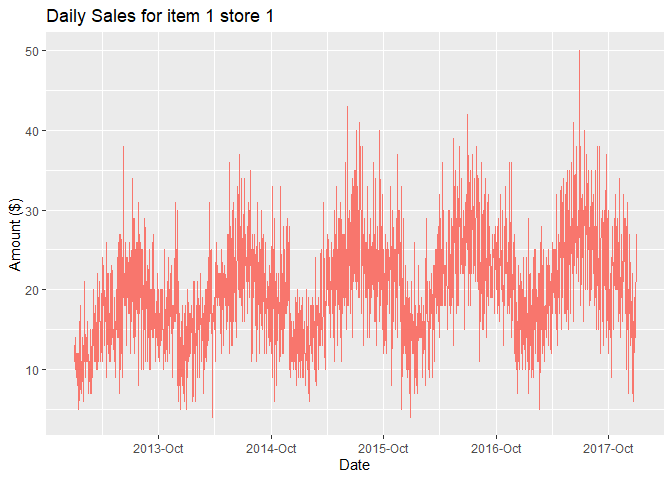

LSTM: A Deep Learning Approach to Multivariate Time Series Forecasting
================

In a landscape where established machine learning techniques based on
Gradient Boosting Machines (e.g., XGBoost, LightGBM, CatBoost) and
classical methods based on ARIMA (e.g., SARIMA, ARIMA-X) are far and
wide, deep learning opens up a new realm of possibilities for time
series forecasting. In this tutorial, we will explore how Recurrent
Neural Networks (RNN), particularly the powerful Long Short-Term Memory
(LSTM) architecture, can be used for precise predictions when dealing
with time series data. LSTM networks are a type of RNN architecture
designed to address some of the limitations of traditional RNNs, such as
the vanishing gradient problem, and to capture long-range dependencies
in time series data.

Please note that this tutorial serves as a foundational introduction to
implementing a fundamental multivariate LSTM framework. While it offers
a primer on working with multivariate time series data, it’s important
to recognize that when grappling with intricate high-dimensional
temporal data or multiple concurrent time series, a more sophisticated
approach might be in order, such as Amazon’s DeepAR. While not making
direct predictions via LSTMs, DeepAR employs the underlying power of
LSTMs to parameterize a Gaussian likelihood function and is able to
capture complex and group-dependent relationships by using covariates.
For more information on how the LSTM architecture and DeepAR work, here
are some materials I recommend:

Hochreiter, S., & Schmidhuber, J. (1997). Long Short-Term Memory. Neural
Computation, 9(8), 1735–1780.
<https://doi.org/10.1162/neco.1997.9.8.1735>

Peixeiro, M. (2022). Time series forecasting in Python (\[First
edition\].). Manning Publications Co.

Salinas, D., Flunkert, V., Gasthaus, J., & Januschowski, T. (2020).
DeepAR: Probabilistic forecasting with autoregressive recurrent
networks. International Journal of Forecasting, 36(3), 1181–1191.
<https://doi.org/10.1016/j.ijforecast.2019.07.001>

For this tutorial, we will be using the dataset provided by Kaggle in
their 2018 competition “Store Item Demand Forecasting Challenge”
(<https://www.kaggle.com/competitions/demand-forecasting-kernels-only>).

We will first start with data preprocessing.

# Data preprocessing

``` r
df <- read.csv("C://Users//wl//Desktop//Work//[Website]//Demand Forecast//Kaggle Challenge//train.csv")
View(df) # 2013-01-01 to 2017-12-31

unique(df$store)
```

    ##  [1]  1  2  3  4  5  6  7  8  9 10

``` r
unique(df$item)
```

    ##  [1]  1  2  3  4  5  6  7  8  9 10 11 12 13 14 15 16 17 18 19 20 21 22 23 24 25
    ## [26] 26 27 28 29 30 31 32 33 34 35 36 37 38 39 40 41 42 43 44 45 46 47 48 49 50

``` r
df[!complete.cases(df), ] # find how many NA rows
```

    ## [1] date  store item  sales
    ## <0 rows> (or 0-length row.names)

Upon examination, we discover that the dataset encompasses records
spanning from January 1, 2013, to December 31, 2017. Within this data,
we have information from 10 distinct stores and 50 unique items.

Unlike more advanced and complex approaches like DeepAR, LSTM is only
suitable for single time series data. For the purpose of this tutorial,
we will focus on the data obtained for item 1 from store 1. We will also
do some exploratory data analysis (EDA) to delve deeper into the
dataset.

# Exploratory data analysis

``` r
library(dplyr)
```

    ## 
    ## Attaching package: 'dplyr'

    ## The following objects are masked from 'package:stats':
    ## 
    ##     filter, lag

    ## The following objects are masked from 'package:base':
    ## 
    ##     intersect, setdiff, setequal, union

``` r
library(lubridate)
```

    ## Loading required package: timechange

    ## 
    ## Attaching package: 'lubridate'

    ## The following objects are masked from 'package:base':
    ## 
    ##     date, intersect, setdiff, union

``` r
library(ggplot2)
library(scales)
library(ggthemes)
```

    ## Warning: package 'ggthemes' was built under R version 4.2.3

``` r
df2 <- df |>
  filter(store == 1 & item == 1) |>
  arrange(date)

df2$date <- ymd(df2$date) # convert to date format

pacf(df2$sales) # we can see that day-of-the-week effect and the previous-day effect are the most important
```

<!-- -->

``` r
exploratory <- ggplot() +
  geom_line(data = df2, aes(x = date, y = sales, color = "#CC79A7")) +
  scale_x_date(labels = date_format("%Y-%b"), breaks = date_breaks("12 months")) +
  xlab("Date") +
  ylab("Amount ($)") +
  ggtitle("Daily Sales for item 1 store 1") +
  guides(color = "none")

exploratory
```

<!-- -->

Evidently, the sales figure shows a recurring seasonality pattern,
accompanied by a subtle ascending trend across time. Furthermore, both
the day-of-the-week and the previous-day’s effects seems to be
noteworthy factors. Because of LSTM’s structure, it will be able to
capture these temporal relationships.

We will now proceed with feature engineering to add crucial features
that will help us forecast our target variable. Incorporating US
Personal Consumption Expenditures (PCE) information from the FRED
database (<https://fred.stlouisfed.org/series/PCE>) adds an extra layer
of feature to our analysis. While the dataset lack explicit geographical
markers, we assume that these figures are rooted in US-specific data
given that the data is disseminated through Kaggle and considering that
Kaggle’s headquarters are US-based. There are also many other features
we can include in our model, but some of these may or may not be
applicable depending on context and the results from the time series
decomposition we observed, as well as from PACF plots. Nevertheless,
some of these features are listed below.

Seasonality: We will use the already extracted seasonality in training
our model. Seasonality captures recurring patterns that occur at
specific times within each year.

Month and Day Variables: We will use separate variables for month and
day to capture any monthly or daily patterns in the data.

Day of the Week: Including a variable for the day of the week will help
us differentiate sales patterns between weekdays and weekends, as they
are likely to differ.

Day of the Year: Adding a variable for the day of the year will help us
identify any annual trends or patterns.

Date Components: We will include variables to indicate whether it is a
weekend, the start/end of the month, and the start/end of the year.
These date components can reveal specific patterns related to these time
frames.

Lagged Periods: Including lagged values of the target variable can help
us capture any dependencies or autocorrelation within the time series
data.

Running Days Column: We will create a column that captures the number of
days elapsed since the start of the time series data. This will help us
model the trend component over time.

Public Holidays: If we have information about public holidays, we can
include them as features. Public holidays can have a significant impact
on sales patterns.

Restock Inventory Information: If available, including information about
restock inventory can help us account for sudden changes in stock levels
that may influence sales.

Anomalies in Operations: Including information about anomalies in
operations can help us identify and account for any irregularities in
the data that may affect sales.

Macroeconomic Factors: If relevant, we can include other macroeconomic
factors that may have an impact on sales, such as inflation rates,
unemployment rates, or GDP growth.

# Feature engineering

``` r
pce <- read.csv("C://Users//wl//Desktop//Work//[Website]//Demand Forecast//Kaggle Challenge//PCE.csv")
pce$DATE <- ymd(pce$DATE) # convert to date format

# rename DATE to lowercase and create year and month columns
pce$date <- pce$DATE 
pce <- pce |>
  select(-DATE) |>
  mutate(year = year(date), month = month(date))

# join pce with df2
df3 <- df2 |>
  mutate(year = year(date), month = month(date)) |>
  left_join(pce, by = c("year", "month")) |>
  mutate(date = date.x) |>
  select(date, sales, PCE)
```

We will now proceed with additional data preprocessing steps before
constructing our model architecture. We will first apply feature scaling
to our dataset. This serves a multifaceted purpose: it facilitates
faster convergence during training, optimizes gradient descent
algorithms, and enhances the stability of activation functions. While
there exist other advantages to scaling prior to modeling, I leave the
exploration of these aspects to readers.

Next, we will generate the training and test sets. Due to temporal
dependency, it is important to split our time series data in a manner
that the test data comprises the most recent periods. Since we are doing
a multi-step forecast, the accuracy of the next period’s forecast is
likely to surpass those made further into the future. This is because
the next period’s forecast can rely on actual observed lagged values,
whereas forecasts further into the future must rely on predicted lagged
values. As we forecast further into the future, the number of
predictions to be made increases which can lead to compounding errors.
Nevertheless, it is still a powerful time series forecasting method and
can produce accurate results.

Finally, We will also prepare the three-dimensional arrays here for both
input (x) and output (y) data which we will feed into the training
process and validate our results.

# Data preprocessing

``` r
library(keras)
```

    ## Warning: package 'keras' was built under R version 4.2.3

``` r
library(tensorflow)
```

    ## Warning: package 'tensorflow' was built under R version 4.2.3

``` r
tensorflow::set_random_seed( 
  seed = 333, 
  disable_gpu = FALSE
) 

# scaling the dataset
scale_factors_sales <- c(mean(df3$sales), sd(df3$sales))
scale_factors_consumption <- c(mean(df3$PCE), sd(df3$PCE))

scaled_train <- df3 |>
  mutate(sales = (sales - scale_factors_sales[1]) / scale_factors_sales[2]) |>
  mutate(PCE = (PCE - scale_factors_consumption[1]) / scale_factors_consumption[2]) |>
  select(sales, PCE)


# preparing the three-dimensional arrays
lag <- 364

scaled_train <- as.matrix(scaled_train)
 
x_train_data_1 <- t(sapply(
    1:(nrow(df3) - lag - lag),
    function(x) scaled_train[x:(x + lag - 1), 1]
  ))
 
x_train_data_2 <- t(sapply(
    1:(nrow(df3) - lag - lag),
    function(x) scaled_train[x:(x + lag - 1), 2]
  ))

x_train_arr <- array(
    data = as.numeric(unlist(c(x_train_data_1, x_train_data_2))),
    dim = c(
        nrow(x_train_data_1),
        lag,
        2
    )
)

y_train_data <- scaled_train[(nrow(df3) - nrow(x_train_data_1) + 1 - lag):(nrow(df3) - lag), 1]

y_train_arr <- array(
    data = as.numeric(unlist(c(y_train_data))),
    dim = c(
        length(y_train_data),
        1
    )
)
```

With our data preprocessed and primed for modeling, we will now
construct the framework of our neural network. While a comprehensive
approach would involve hyperparameter optimization to determine the
optimal settings, our current tutorial focuses on establishing the
foundational implementation of LSTM. As such, we will craft our own
model structure to illustrate the fundamental concepts. In this step, we
will define the architecture of our LSTM-based model. This involves
designing the number of layers, nodes within each layer, and the
sequence of operations that will transform our input data into
meaningful predictions.

We initiate with an LSTM layer of 64 units before incorporating a
dropout rate of 0.4 to mitigate overfitting. Then, we apply a
bidirectional LSTM layer of 64 units (effectively rendering a 128-unit
layer) to enhances the network’s ability to capture nuanced temporal
patterns. A further layer of dropout at 0.4 will be applied to mitigate
overfitting and improve generalization. Finally, we will use a dense
component with a single unit to render the predicted outcomes. This
architecture consistently leverages on hyperbolic tangents as the
activation functions to foster non-linearity within the model’s
transformations. We will use Mean Squared Error (MSE) as our loss
function and Adaptive Moment Estimation (Adam) as our optimizer, which
combines the benefits of both the Adagrad and RMSprop optimizers.

# Constructing model architecture

``` r
# initiating a keras model
lstm_model <- keras_model_sequential()

# adding layers and compiling the model
lstm_model |>
  layer_lstm(
    units = 64,
    batch_input_shape = c(1, lag, 2), # batch size, timesteps, features
    return_sequences = TRUE,
    stateful = TRUE,
    activation = "tanh"
  ) |>
  layer_dropout(rate = 0.4) |>
  bidirectional(layer_lstm(units = 64)) |>
  layer_dropout(rate = 0.4) |>
  layer_dense(units = 1, activation = "tanh") |>
  compile(loss = 'mean_squared_error',
          optimizer = "adam",
          metrics = 'mse')

summary(lstm_model)
```

    ## Model: "sequential"
    ## ________________________________________________________________________________
    ##  Layer (type)                       Output Shape                    Param #     
    ## ================================================================================
    ##  lstm_1 (LSTM)                      (1, 364, 64)                    17152       
    ##  dropout_1 (Dropout)                (1, 364, 64)                    0           
    ##  bidirectional (Bidirectional)      (1, 128)                        66048       
    ##  dropout (Dropout)                  (1, 128)                        0           
    ##  dense (Dense)                      (1, 1)                          129         
    ## ================================================================================
    ## Total params: 83329 (325.50 KB)
    ## Trainable params: 83329 (325.50 KB)
    ## Non-trainable params: 0 (0.00 Byte)
    ## ________________________________________________________________________________

We are now finally ready to train our model. We will be training 10
epochs with a validation split of 0.2, and we will also employ an early
stopping rule based on validation loss if results for 2 subsequent
epochs stops improving.

# Training the model

``` r
# fitting the model to training dataset
history <- lstm_model |> fit(
  x = x_train_arr,
  y = y_train_arr,
  batch_size = 1,
  epochs = 10,
  verbose = 1,
  shuffle = FALSE,
  use_multiprocessing = T,
  validation_split = 0.2,
  callback_early_stopping(
    monitor = "val_loss",
    min_delta = 0,
    patience = 2,
    verbose = 0,
    mode = "auto",
    baseline = NULL,
    restore_best_weights = TRUE
  )
)
```

    ## Epoch 1/10
    ## 
    ##   1/878 [..............................] - ETA: 49:43 - loss: 0.6318 - mse: 0.6318
    ##   2/878 [..............................] - ETA: 1:05 - loss: 1.3019 - mse: 1.3019 
    ##   3/878 [..............................] - ETA: 1:04 - loss: 1.0099 - mse: 1.0099
    ##   4/878 [..............................] - ETA: 1:06 - loss: 1.0279 - mse: 1.0279
    ##   5/878 [..............................] - ETA: 1:06 - loss: 0.8995 - mse: 0.8995
    ##   6/878 [..............................] - ETA: 1:06 - loss: 0.7624 - mse: 0.7624
    ##   7/878 [..............................] - ETA: 1:06 - loss: 0.6573 - mse: 0.6573
    ##   8/878 [..............................] - ETA: 1:06 - loss: 0.6178 - mse: 0.6178
    ##   9/878 [..............................] - ETA: 1:06 - loss: 0.5600 - mse: 0.5600
    ##  10/878 [..............................] - ETA: 1:06 - loss: 0.5178 - mse: 0.5178
    ##  11/878 [..............................] - ETA: 1:06 - loss: 0.4862 - mse: 0.4862
    ##  12/878 [..............................] - ETA: 1:07 - loss: 0.4629 - mse: 0.4629
    ##  13/878 [..............................] - ETA: 1:07 - loss: 0.4416 - mse: 0.4416
    ##  14/878 [..............................] - ETA: 1:08 - loss: 0.4145 - mse: 0.4145
    ##  15/878 [..............................] - ETA: 1:08 - loss: 0.4013 - mse: 0.4013
    ##  16/878 [..............................] - ETA: 1:08 - loss: 0.3908 - mse: 0.3908
    ##  17/878 [..............................] - ETA: 1:07 - loss: 0.3703 - mse: 0.3703
    ##  18/878 [..............................] - ETA: 1:07 - loss: 0.3708 - mse: 0.3708
    ##  19/878 [..............................] - ETA: 1:08 - loss: 0.3525 - mse: 0.3525
    ##  20/878 [..............................] - ETA: 1:08 - loss: 0.3391 - mse: 0.3391
    ##  21/878 [..............................] - ETA: 1:08 - loss: 0.3881 - mse: 0.3881
    ##  22/878 [..............................] - ETA: 1:07 - loss: 0.4136 - mse: 0.4136
    ##  23/878 [..............................] - ETA: 1:07 - loss: 0.4458 - mse: 0.4458
    ##  24/878 [..............................] - ETA: 1:07 - loss: 0.4438 - mse: 0.4438
    ##  25/878 [..............................] - ETA: 1:07 - loss: 0.4419 - mse: 0.4419
    ##  26/878 [..............................] - ETA: 1:07 - loss: 0.4709 - mse: 0.4709
    ##  27/878 [..............................] - ETA: 1:06 - loss: 0.4586 - mse: 0.4586
    ##  28/878 [..............................] - ETA: 1:06 - loss: 0.4705 - mse: 0.4705
    ##  29/878 [..............................] - ETA: 1:06 - loss: 0.5073 - mse: 0.5073
    ##  30/878 [>.............................] - ETA: 1:06 - loss: 0.4914 - mse: 0.4914
    ##  31/878 [>.............................] - ETA: 1:06 - loss: 0.4797 - mse: 0.4797
    ##  32/878 [>.............................] - ETA: 1:06 - loss: 0.4773 - mse: 0.4773
    ##  33/878 [>.............................] - ETA: 1:06 - loss: 0.4630 - mse: 0.4630
    ##  34/878 [>.............................] - ETA: 1:06 - loss: 0.4539 - mse: 0.4539
    ##  35/878 [>.............................] - ETA: 1:06 - loss: 0.4507 - mse: 0.4507
    ##  36/878 [>.............................] - ETA: 1:06 - loss: 0.4512 - mse: 0.4512
    ##  37/878 [>.............................] - ETA: 1:05 - loss: 0.4721 - mse: 0.4721
    ##  38/878 [>.............................] - ETA: 1:05 - loss: 0.4667 - mse: 0.4667
    ##  39/878 [>.............................] - ETA: 1:05 - loss: 0.4562 - mse: 0.4562
    ##  40/878 [>.............................] - ETA: 1:05 - loss: 0.4463 - mse: 0.4463
    ##  41/878 [>.............................] - ETA: 1:05 - loss: 0.4461 - mse: 0.4461
    ##  42/878 [>.............................] - ETA: 1:05 - loss: 0.4419 - mse: 0.4419
    ##  43/878 [>.............................] - ETA: 1:05 - loss: 0.4381 - mse: 0.4381
    ##  44/878 [>.............................] - ETA: 1:05 - loss: 0.4386 - mse: 0.4386
    ##  45/878 [>.............................] - ETA: 1:05 - loss: 0.4651 - mse: 0.4651
    ##  46/878 [>.............................] - ETA: 1:05 - loss: 0.4761 - mse: 0.4761
    ##  47/878 [>.............................] - ETA: 1:05 - loss: 0.4870 - mse: 0.4870
    ##  48/878 [>.............................] - ETA: 1:04 - loss: 0.4769 - mse: 0.4769
    ##  49/878 [>.............................] - ETA: 1:04 - loss: 0.4702 - mse: 0.4702
    ##  50/878 [>.............................] - ETA: 1:04 - loss: 0.4633 - mse: 0.4633
    ##  51/878 [>.............................] - ETA: 1:04 - loss: 0.4570 - mse: 0.4570
    ##  52/878 [>.............................] - ETA: 1:04 - loss: 0.4617 - mse: 0.4617
    ##  53/878 [>.............................] - ETA: 1:04 - loss: 0.4555 - mse: 0.4555
    ##  54/878 [>.............................] - ETA: 1:04 - loss: 0.4522 - mse: 0.4522
    ##  55/878 [>.............................] - ETA: 1:04 - loss: 0.4441 - mse: 0.4441
    ##  56/878 [>.............................] - ETA: 1:03 - loss: 0.4522 - mse: 0.4522
    ##  57/878 [>.............................] - ETA: 1:03 - loss: 0.4443 - mse: 0.4443
    ##  58/878 [>.............................] - ETA: 1:03 - loss: 0.4412 - mse: 0.4412
    ##  59/878 [=>............................] - ETA: 1:03 - loss: 0.4383 - mse: 0.4383
    ##  60/878 [=>............................] - ETA: 1:03 - loss: 0.4328 - mse: 0.4328
    ##  61/878 [=>............................] - ETA: 1:03 - loss: 0.4408 - mse: 0.4408
    ##  62/878 [=>............................] - ETA: 1:03 - loss: 0.4344 - mse: 0.4344
    ##  63/878 [=>............................] - ETA: 1:03 - loss: 0.4284 - mse: 0.4284
    ##  64/878 [=>............................] - ETA: 1:03 - loss: 0.4240 - mse: 0.4240
    ##  65/878 [=>............................] - ETA: 1:03 - loss: 0.4211 - mse: 0.4211
    ##  66/878 [=>............................] - ETA: 1:03 - loss: 0.4245 - mse: 0.4245
    ##  67/878 [=>............................] - ETA: 1:03 - loss: 0.4344 - mse: 0.4344
    ##  68/878 [=>............................] - ETA: 1:03 - loss: 0.4281 - mse: 0.4281
    ##  69/878 [=>............................] - ETA: 1:02 - loss: 0.4388 - mse: 0.4388
    ##  70/878 [=>............................] - ETA: 1:02 - loss: 0.4327 - mse: 0.4327
    ##  71/878 [=>............................] - ETA: 1:02 - loss: 0.4273 - mse: 0.4273
    ##  72/878 [=>............................] - ETA: 1:02 - loss: 0.4428 - mse: 0.4428
    ##  73/878 [=>............................] - ETA: 1:02 - loss: 0.4380 - mse: 0.4380
    ##  74/878 [=>............................] - ETA: 1:02 - loss: 0.4321 - mse: 0.4321
    ##  75/878 [=>............................] - ETA: 1:02 - loss: 0.4383 - mse: 0.4383
    ##  76/878 [=>............................] - ETA: 1:02 - loss: 0.4955 - mse: 0.4955
    ##  77/878 [=>............................] - ETA: 1:02 - loss: 0.4908 - mse: 0.4908
    ##  78/878 [=>............................] - ETA: 1:01 - loss: 0.4849 - mse: 0.4849
    ##  79/878 [=>............................] - ETA: 1:01 - loss: 0.4872 - mse: 0.4872
    ##  80/878 [=>............................] - ETA: 1:01 - loss: 0.4814 - mse: 0.4814
    ##  81/878 [=>............................] - ETA: 1:01 - loss: 0.4790 - mse: 0.4790
    ##  82/878 [=>............................] - ETA: 1:01 - loss: 0.4731 - mse: 0.4731
    ##  83/878 [=>............................] - ETA: 1:01 - loss: 0.4717 - mse: 0.4717
    ##  84/878 [=>............................] - ETA: 1:01 - loss: 0.5428 - mse: 0.5428
    ##  85/878 [=>............................] - ETA: 1:01 - loss: 0.5502 - mse: 0.5502
    ##  86/878 [=>............................] - ETA: 1:01 - loss: 0.5486 - mse: 0.5486
    ##  87/878 [=>............................] - ETA: 1:01 - loss: 0.5469 - mse: 0.5469
    ##  88/878 [==>...........................] - ETA: 1:01 - loss: 0.5464 - mse: 0.5464
    ##  89/878 [==>...........................] - ETA: 1:00 - loss: 0.5416 - mse: 0.5416
    ##  90/878 [==>...........................] - ETA: 1:01 - loss: 0.5399 - mse: 0.5399
    ##  91/878 [==>...........................] - ETA: 1:01 - loss: 0.5385 - mse: 0.5385
    ##  92/878 [==>...........................] - ETA: 1:01 - loss: 0.5328 - mse: 0.5328
    ##  93/878 [==>...........................] - ETA: 1:01 - loss: 0.5436 - mse: 0.5436
    ##  94/878 [==>...........................] - ETA: 1:00 - loss: 0.5390 - mse: 0.5390
    ##  95/878 [==>...........................] - ETA: 1:00 - loss: 0.5334 - mse: 0.5334
    ##  96/878 [==>...........................] - ETA: 1:00 - loss: 0.5305 - mse: 0.5305
    ##  97/878 [==>...........................] - ETA: 1:00 - loss: 0.5426 - mse: 0.5426
    ##  98/878 [==>...........................] - ETA: 1:00 - loss: 0.5375 - mse: 0.5375
    ##  99/878 [==>...........................] - ETA: 1:00 - loss: 0.5325 - mse: 0.5325
    ## 100/878 [==>...........................] - ETA: 1:00 - loss: 0.5279 - mse: 0.5279
    ## 101/878 [==>...........................] - ETA: 1:00 - loss: 0.5227 - mse: 0.5227
    ## 102/878 [==>...........................] - ETA: 1:00 - loss: 0.5242 - mse: 0.5242
    ## 103/878 [==>...........................] - ETA: 1:00 - loss: 0.5200 - mse: 0.5200
    ## 104/878 [==>...........................] - ETA: 1:00 - loss: 0.5185 - mse: 0.5185
    ## 105/878 [==>...........................] - ETA: 1:00 - loss: 0.5140 - mse: 0.5140
    ## 106/878 [==>...........................] - ETA: 1:00 - loss: 0.5128 - mse: 0.5128
    ## 107/878 [==>...........................] - ETA: 1:00 - loss: 0.5086 - mse: 0.5086
    ## 108/878 [==>...........................] - ETA: 59s - loss: 0.5039 - mse: 0.5039 
    ## 109/878 [==>...........................] - ETA: 59s - loss: 0.5002 - mse: 0.5002
    ## 110/878 [==>...........................] - ETA: 59s - loss: 0.4978 - mse: 0.4978
    ## 111/878 [==>...........................] - ETA: 59s - loss: 0.4963 - mse: 0.4963
    ## 112/878 [==>...........................] - ETA: 59s - loss: 0.4923 - mse: 0.4923
    ## 113/878 [==>...........................] - ETA: 59s - loss: 0.4987 - mse: 0.4987
    ## 114/878 [==>...........................] - ETA: 59s - loss: 0.4959 - mse: 0.4959
    ## 115/878 [==>...........................] - ETA: 59s - loss: 0.4990 - mse: 0.4990
    ## 116/878 [==>...........................] - ETA: 59s - loss: 0.4960 - mse: 0.4960
    ## 117/878 [==>...........................] - ETA: 59s - loss: 0.4930 - mse: 0.4930
    ## 118/878 [===>..........................] - ETA: 59s - loss: 0.4890 - mse: 0.4890
    ## 119/878 [===>..........................] - ETA: 59s - loss: 0.4880 - mse: 0.4880
    ## 120/878 [===>..........................] - ETA: 58s - loss: 0.4842 - mse: 0.4842
    ## 121/878 [===>..........................] - ETA: 58s - loss: 0.4886 - mse: 0.4886
    ## 122/878 [===>..........................] - ETA: 58s - loss: 0.4859 - mse: 0.4859
    ## 123/878 [===>..........................] - ETA: 58s - loss: 0.4819 - mse: 0.4819
    ## 124/878 [===>..........................] - ETA: 58s - loss: 0.4791 - mse: 0.4791
    ## 125/878 [===>..........................] - ETA: 58s - loss: 0.4770 - mse: 0.4770
    ## 126/878 [===>..........................] - ETA: 58s - loss: 0.4736 - mse: 0.4736
    ## 127/878 [===>..........................] - ETA: 58s - loss: 0.4699 - mse: 0.4699
    ## 128/878 [===>..........................] - ETA: 58s - loss: 0.4666 - mse: 0.4666
    ## 129/878 [===>..........................] - ETA: 58s - loss: 0.4657 - mse: 0.4657
    ## 130/878 [===>..........................] - ETA: 58s - loss: 0.4624 - mse: 0.4624
    ## 131/878 [===>..........................] - ETA: 58s - loss: 0.4605 - mse: 0.4605
    ## 132/878 [===>..........................] - ETA: 57s - loss: 0.4659 - mse: 0.4659
    ## 133/878 [===>..........................] - ETA: 57s - loss: 0.4644 - mse: 0.4644
    ## 134/878 [===>..........................] - ETA: 57s - loss: 0.4623 - mse: 0.4623
    ## 135/878 [===>..........................] - ETA: 57s - loss: 0.4592 - mse: 0.4592
    ## 136/878 [===>..........................] - ETA: 57s - loss: 0.4566 - mse: 0.4566
    ## 137/878 [===>..........................] - ETA: 57s - loss: 0.4551 - mse: 0.4551
    ## 138/878 [===>..........................] - ETA: 57s - loss: 0.4527 - mse: 0.4527
    ## 139/878 [===>..........................] - ETA: 57s - loss: 0.4895 - mse: 0.4895
    ## 140/878 [===>..........................] - ETA: 57s - loss: 0.4961 - mse: 0.4961
    ## 141/878 [===>..........................] - ETA: 57s - loss: 0.4937 - mse: 0.4937
    ## 142/878 [===>..........................] - ETA: 57s - loss: 0.4930 - mse: 0.4930
    ## 143/878 [===>..........................] - ETA: 56s - loss: 0.4933 - mse: 0.4933
    ## 144/878 [===>..........................] - ETA: 56s - loss: 0.4995 - mse: 0.4995
    ## 145/878 [===>..........................] - ETA: 56s - loss: 0.4985 - mse: 0.4985
    ## 146/878 [===>..........................] - ETA: 56s - loss: 0.4952 - mse: 0.4952
    ## 147/878 [====>.........................] - ETA: 56s - loss: 0.4966 - mse: 0.4966
    ## 148/878 [====>.........................] - ETA: 56s - loss: 0.5044 - mse: 0.5044
    ## 149/878 [====>.........................] - ETA: 56s - loss: 0.5103 - mse: 0.5103
    ## 150/878 [====>.........................] - ETA: 56s - loss: 0.5069 - mse: 0.5069
    ## 151/878 [====>.........................] - ETA: 56s - loss: 0.5120 - mse: 0.5120
    ## 152/878 [====>.........................] - ETA: 56s - loss: 0.5222 - mse: 0.5222
    ## 153/878 [====>.........................] - ETA: 56s - loss: 0.5206 - mse: 0.5206
    ## 154/878 [====>.........................] - ETA: 56s - loss: 0.5225 - mse: 0.5225
    ## 155/878 [====>.........................] - ETA: 56s - loss: 0.5204 - mse: 0.5204
    ## 156/878 [====>.........................] - ETA: 56s - loss: 0.5172 - mse: 0.5172
    ## 157/878 [====>.........................] - ETA: 56s - loss: 0.5148 - mse: 0.5148
    ## 158/878 [====>.........................] - ETA: 55s - loss: 0.5125 - mse: 0.5125
    ## 159/878 [====>.........................] - ETA: 55s - loss: 0.5149 - mse: 0.5149
    ## 160/878 [====>.........................] - ETA: 55s - loss: 0.5200 - mse: 0.5200
    ## 161/878 [====>.........................] - ETA: 55s - loss: 0.5199 - mse: 0.5199
    ## 162/878 [====>.........................] - ETA: 55s - loss: 0.5267 - mse: 0.5267
    ## 163/878 [====>.........................] - ETA: 55s - loss: 0.5235 - mse: 0.5235
    ## 164/878 [====>.........................] - ETA: 55s - loss: 0.5203 - mse: 0.5203
    ## 165/878 [====>.........................] - ETA: 55s - loss: 0.5181 - mse: 0.5181
    ## 166/878 [====>.........................] - ETA: 55s - loss: 0.5224 - mse: 0.5224
    ## 167/878 [====>.........................] - ETA: 55s - loss: 0.5405 - mse: 0.5405
    ## 168/878 [====>.........................] - ETA: 55s - loss: 0.5384 - mse: 0.5384
    ## 169/878 [====>.........................] - ETA: 55s - loss: 0.5452 - mse: 0.5452
    ## 170/878 [====>.........................] - ETA: 55s - loss: 0.5441 - mse: 0.5441
    ## 171/878 [====>.........................] - ETA: 55s - loss: 0.5415 - mse: 0.5415
    ## 172/878 [====>.........................] - ETA: 55s - loss: 0.5417 - mse: 0.5417
    ## 173/878 [====>.........................] - ETA: 54s - loss: 0.5388 - mse: 0.5388
    ## 174/878 [====>.........................] - ETA: 54s - loss: 0.5566 - mse: 0.5566
    ## 175/878 [====>.........................] - ETA: 54s - loss: 0.5559 - mse: 0.5559
    ## 176/878 [=====>........................] - ETA: 54s - loss: 0.5528 - mse: 0.5528
    ## 177/878 [=====>........................] - ETA: 54s - loss: 0.5512 - mse: 0.5512
    ## 178/878 [=====>........................] - ETA: 54s - loss: 0.5517 - mse: 0.5517
    ## 179/878 [=====>........................] - ETA: 54s - loss: 0.5505 - mse: 0.5505
    ## 180/878 [=====>........................] - ETA: 54s - loss: 0.5591 - mse: 0.5591
    ## 181/878 [=====>........................] - ETA: 54s - loss: 0.5604 - mse: 0.5604
    ## 182/878 [=====>........................] - ETA: 54s - loss: 0.5649 - mse: 0.5649
    ## 183/878 [=====>........................] - ETA: 54s - loss: 0.5709 - mse: 0.5709
    ## 184/878 [=====>........................] - ETA: 54s - loss: 0.5678 - mse: 0.5678
    ## 185/878 [=====>........................] - ETA: 53s - loss: 0.5649 - mse: 0.5649
    ## 186/878 [=====>........................] - ETA: 53s - loss: 0.5632 - mse: 0.5632
    ## 187/878 [=====>........................] - ETA: 53s - loss: 0.5603 - mse: 0.5603
    ## 188/878 [=====>........................] - ETA: 53s - loss: 0.5685 - mse: 0.5685
    ## 189/878 [=====>........................] - ETA: 53s - loss: 0.5726 - mse: 0.5726
    ## 190/878 [=====>........................] - ETA: 53s - loss: 0.5698 - mse: 0.5698
    ## 191/878 [=====>........................] - ETA: 53s - loss: 0.5681 - mse: 0.5681
    ## 192/878 [=====>........................] - ETA: 53s - loss: 0.5653 - mse: 0.5653
    ## 193/878 [=====>........................] - ETA: 53s - loss: 0.5625 - mse: 0.5625
    ## 194/878 [=====>........................] - ETA: 53s - loss: 0.5604 - mse: 0.5604
    ## 195/878 [=====>........................] - ETA: 53s - loss: 0.5577 - mse: 0.5577
    ## 196/878 [=====>........................] - ETA: 53s - loss: 0.5564 - mse: 0.5564
    ## 197/878 [=====>........................] - ETA: 53s - loss: 0.5536 - mse: 0.5536
    ## 198/878 [=====>........................] - ETA: 52s - loss: 0.5566 - mse: 0.5566
    ## 199/878 [=====>........................] - ETA: 52s - loss: 0.5542 - mse: 0.5542
    ## 200/878 [=====>........................] - ETA: 52s - loss: 0.5515 - mse: 0.5515
    ## 201/878 [=====>........................] - ETA: 52s - loss: 0.5535 - mse: 0.5535
    ## 202/878 [=====>........................] - ETA: 52s - loss: 0.5528 - mse: 0.5528
    ## 203/878 [=====>........................] - ETA: 52s - loss: 0.5513 - mse: 0.5513
    ## 204/878 [=====>........................] - ETA: 52s - loss: 0.5519 - mse: 0.5519
    ## 205/878 [======>.......................] - ETA: 52s - loss: 0.5520 - mse: 0.5520
    ## 206/878 [======>.......................] - ETA: 52s - loss: 0.5496 - mse: 0.5496
    ## 207/878 [======>.......................] - ETA: 52s - loss: 0.5470 - mse: 0.5470
    ## 208/878 [======>.......................] - ETA: 52s - loss: 0.5466 - mse: 0.5466
    ## 209/878 [======>.......................] - ETA: 52s - loss: 0.5604 - mse: 0.5604
    ## 210/878 [======>.......................] - ETA: 52s - loss: 0.5780 - mse: 0.5780
    ## 211/878 [======>.......................] - ETA: 52s - loss: 0.5785 - mse: 0.5785
    ## 212/878 [======>.......................] - ETA: 51s - loss: 0.5759 - mse: 0.5759
    ## 213/878 [======>.......................] - ETA: 51s - loss: 0.5734 - mse: 0.5734
    ## 214/878 [======>.......................] - ETA: 51s - loss: 0.5844 - mse: 0.5844
    ## 215/878 [======>.......................] - ETA: 51s - loss: 0.5817 - mse: 0.5817
    ## 216/878 [======>.......................] - ETA: 51s - loss: 0.5806 - mse: 0.5806
    ## 217/878 [======>.......................] - ETA: 51s - loss: 0.5787 - mse: 0.5787
    ## 218/878 [======>.......................] - ETA: 51s - loss: 0.5777 - mse: 0.5777
    ## 219/878 [======>.......................] - ETA: 51s - loss: 0.5752 - mse: 0.5752
    ## 220/878 [======>.......................] - ETA: 51s - loss: 0.5729 - mse: 0.5729
    ## 221/878 [======>.......................] - ETA: 51s - loss: 0.5717 - mse: 0.5717
    ## 222/878 [======>.......................] - ETA: 51s - loss: 0.5708 - mse: 0.5708
    ## 223/878 [======>.......................] - ETA: 51s - loss: 0.5683 - mse: 0.5683
    ## 224/878 [======>.......................] - ETA: 50s - loss: 0.5659 - mse: 0.5659
    ## 225/878 [======>.......................] - ETA: 50s - loss: 0.5644 - mse: 0.5644
    ## 226/878 [======>.......................] - ETA: 50s - loss: 0.5748 - mse: 0.5748
    ## 227/878 [======>.......................] - ETA: 50s - loss: 0.5753 - mse: 0.5753
    ## 228/878 [======>.......................] - ETA: 50s - loss: 0.5729 - mse: 0.5729
    ## 229/878 [======>.......................] - ETA: 50s - loss: 0.5712 - mse: 0.5712
    ## 230/878 [======>.......................] - ETA: 50s - loss: 0.5768 - mse: 0.5768
    ## 231/878 [======>.......................] - ETA: 50s - loss: 0.5756 - mse: 0.5756
    ## 232/878 [======>.......................] - ETA: 50s - loss: 0.5774 - mse: 0.5774
    ## 233/878 [======>.......................] - ETA: 50s - loss: 0.5751 - mse: 0.5751
    ## 234/878 [======>.......................] - ETA: 50s - loss: 0.5727 - mse: 0.5727
    ## 235/878 [=======>......................] - ETA: 50s - loss: 0.5703 - mse: 0.5703
    ## 236/878 [=======>......................] - ETA: 49s - loss: 0.5702 - mse: 0.5702
    ## 237/878 [=======>......................] - ETA: 49s - loss: 0.5697 - mse: 0.5697
    ## 238/878 [=======>......................] - ETA: 49s - loss: 0.5748 - mse: 0.5748
    ## 239/878 [=======>......................] - ETA: 49s - loss: 0.5731 - mse: 0.5731
    ## 240/878 [=======>......................] - ETA: 49s - loss: 0.5707 - mse: 0.5707
    ## 241/878 [=======>......................] - ETA: 49s - loss: 0.5687 - mse: 0.5687
    ## 242/878 [=======>......................] - ETA: 49s - loss: 0.5678 - mse: 0.5678
    ## 243/878 [=======>......................] - ETA: 49s - loss: 0.5714 - mse: 0.5714
    ## 244/878 [=======>......................] - ETA: 49s - loss: 0.5744 - mse: 0.5744
    ## 245/878 [=======>......................] - ETA: 49s - loss: 0.5740 - mse: 0.5740
    ## 246/878 [=======>......................] - ETA: 49s - loss: 0.5746 - mse: 0.5746
    ## 247/878 [=======>......................] - ETA: 49s - loss: 0.5724 - mse: 0.5724
    ## 248/878 [=======>......................] - ETA: 48s - loss: 0.5725 - mse: 0.5725
    ## 249/878 [=======>......................] - ETA: 48s - loss: 0.5721 - mse: 0.5721
    ## 250/878 [=======>......................] - ETA: 48s - loss: 0.5698 - mse: 0.5698
    ## 251/878 [=======>......................] - ETA: 48s - loss: 0.5689 - mse: 0.5689
    ## 252/878 [=======>......................] - ETA: 48s - loss: 0.5742 - mse: 0.5742
    ## 253/878 [=======>......................] - ETA: 48s - loss: 0.5719 - mse: 0.5719
    ## 254/878 [=======>......................] - ETA: 48s - loss: 0.5725 - mse: 0.5725
    ## 255/878 [=======>......................] - ETA: 48s - loss: 0.5744 - mse: 0.5744
    ## 256/878 [=======>......................] - ETA: 48s - loss: 0.5730 - mse: 0.5730
    ## 257/878 [=======>......................] - ETA: 48s - loss: 0.5723 - mse: 0.5723
    ## 258/878 [=======>......................] - ETA: 48s - loss: 0.5719 - mse: 0.5719
    ## 259/878 [=======>......................] - ETA: 48s - loss: 0.5761 - mse: 0.5761
    ## 260/878 [=======>......................] - ETA: 48s - loss: 0.5766 - mse: 0.5766
    ## 261/878 [=======>......................] - ETA: 47s - loss: 0.5751 - mse: 0.5751
    ## 262/878 [=======>......................] - ETA: 47s - loss: 0.5735 - mse: 0.5735
    ## 263/878 [=======>......................] - ETA: 47s - loss: 0.5715 - mse: 0.5715
    ## 264/878 [========>.....................] - ETA: 47s - loss: 0.5694 - mse: 0.5694
    ## 265/878 [========>.....................] - ETA: 47s - loss: 0.5672 - mse: 0.5672
    ## 266/878 [========>.....................] - ETA: 47s - loss: 0.5681 - mse: 0.5681
    ## 267/878 [========>.....................] - ETA: 47s - loss: 0.5660 - mse: 0.5660
    ## 268/878 [========>.....................] - ETA: 47s - loss: 0.5671 - mse: 0.5671
    ## 269/878 [========>.....................] - ETA: 47s - loss: 0.5655 - mse: 0.5655
    ## 270/878 [========>.....................] - ETA: 47s - loss: 0.5641 - mse: 0.5641
    ## 271/878 [========>.....................] - ETA: 47s - loss: 0.5650 - mse: 0.5650
    ## 272/878 [========>.....................] - ETA: 47s - loss: 0.5634 - mse: 0.5634
    ## 273/878 [========>.....................] - ETA: 47s - loss: 0.5615 - mse: 0.5615
    ## 274/878 [========>.....................] - ETA: 46s - loss: 0.5612 - mse: 0.5612
    ## 275/878 [========>.....................] - ETA: 46s - loss: 0.5636 - mse: 0.5636
    ## 276/878 [========>.....................] - ETA: 46s - loss: 0.5635 - mse: 0.5635
    ## 277/878 [========>.....................] - ETA: 46s - loss: 0.5640 - mse: 0.5640
    ## 278/878 [========>.....................] - ETA: 46s - loss: 0.5686 - mse: 0.5686
    ## 279/878 [========>.....................] - ETA: 46s - loss: 0.5806 - mse: 0.5806
    ## 280/878 [========>.....................] - ETA: 46s - loss: 0.5860 - mse: 0.5860
    ## 281/878 [========>.....................] - ETA: 46s - loss: 0.5901 - mse: 0.5901
    ## 282/878 [========>.....................] - ETA: 46s - loss: 0.5907 - mse: 0.5907
    ## 283/878 [========>.....................] - ETA: 46s - loss: 0.5887 - mse: 0.5887
    ## 284/878 [========>.....................] - ETA: 46s - loss: 0.5866 - mse: 0.5866
    ## 285/878 [========>.....................] - ETA: 46s - loss: 0.5920 - mse: 0.5920
    ## 286/878 [========>.....................] - ETA: 45s - loss: 0.5992 - mse: 0.5992
    ## 287/878 [========>.....................] - ETA: 45s - loss: 0.6097 - mse: 0.6097
    ## 288/878 [========>.....................] - ETA: 45s - loss: 0.6078 - mse: 0.6078
    ## 289/878 [========>.....................] - ETA: 45s - loss: 0.6061 - mse: 0.6061
    ## 290/878 [========>.....................] - ETA: 45s - loss: 0.6045 - mse: 0.6045
    ## 291/878 [========>.....................] - ETA: 45s - loss: 0.6026 - mse: 0.6026
    ## 292/878 [========>.....................] - ETA: 45s - loss: 0.6011 - mse: 0.6011
    ## 293/878 [=========>....................] - ETA: 45s - loss: 0.6019 - mse: 0.6019
    ## 294/878 [=========>....................] - ETA: 45s - loss: 0.6084 - mse: 0.6084
    ## 295/878 [=========>....................] - ETA: 45s - loss: 0.6063 - mse: 0.6063
    ## 296/878 [=========>....................] - ETA: 45s - loss: 0.6062 - mse: 0.6062
    ## 297/878 [=========>....................] - ETA: 45s - loss: 0.6042 - mse: 0.6042
    ## 298/878 [=========>....................] - ETA: 44s - loss: 0.6025 - mse: 0.6025
    ## 299/878 [=========>....................] - ETA: 44s - loss: 0.6005 - mse: 0.6005
    ## 300/878 [=========>....................] - ETA: 44s - loss: 0.5991 - mse: 0.5991
    ## 301/878 [=========>....................] - ETA: 44s - loss: 0.5989 - mse: 0.5989
    ## 302/878 [=========>....................] - ETA: 44s - loss: 0.6003 - mse: 0.6003
    ## 303/878 [=========>....................] - ETA: 44s - loss: 0.6024 - mse: 0.6024
    ## 304/878 [=========>....................] - ETA: 44s - loss: 0.6035 - mse: 0.6035
    ## 305/878 [=========>....................] - ETA: 44s - loss: 0.6017 - mse: 0.6017
    ## 306/878 [=========>....................] - ETA: 44s - loss: 0.6000 - mse: 0.6000
    ## 307/878 [=========>....................] - ETA: 44s - loss: 0.6152 - mse: 0.6152
    ## 308/878 [=========>....................] - ETA: 44s - loss: 0.6135 - mse: 0.6135
    ## 309/878 [=========>....................] - ETA: 44s - loss: 0.6126 - mse: 0.6126
    ## 310/878 [=========>....................] - ETA: 44s - loss: 0.6113 - mse: 0.6113
    ## 311/878 [=========>....................] - ETA: 44s - loss: 0.6100 - mse: 0.6100
    ## 312/878 [=========>....................] - ETA: 43s - loss: 0.6086 - mse: 0.6086
    ## 313/878 [=========>....................] - ETA: 43s - loss: 0.6099 - mse: 0.6099
    ## 314/878 [=========>....................] - ETA: 43s - loss: 0.6157 - mse: 0.6157
    ## 315/878 [=========>....................] - ETA: 43s - loss: 0.6140 - mse: 0.6140
    ## 316/878 [=========>....................] - ETA: 43s - loss: 0.6154 - mse: 0.6154
    ## 317/878 [=========>....................] - ETA: 43s - loss: 0.6134 - mse: 0.6134
    ## 318/878 [=========>....................] - ETA: 43s - loss: 0.6115 - mse: 0.6115
    ## 319/878 [=========>....................] - ETA: 43s - loss: 0.6134 - mse: 0.6134
    ## 320/878 [=========>....................] - ETA: 43s - loss: 0.6138 - mse: 0.6138
    ## 321/878 [=========>....................] - ETA: 43s - loss: 0.6119 - mse: 0.6119
    ## 322/878 [==========>...................] - ETA: 43s - loss: 0.6103 - mse: 0.6103
    ## 323/878 [==========>...................] - ETA: 43s - loss: 0.6084 - mse: 0.6084
    ## 324/878 [==========>...................] - ETA: 43s - loss: 0.6067 - mse: 0.6067
    ## 325/878 [==========>...................] - ETA: 42s - loss: 0.6049 - mse: 0.6049
    ## 326/878 [==========>...................] - ETA: 42s - loss: 0.6083 - mse: 0.6083
    ## 327/878 [==========>...................] - ETA: 42s - loss: 0.6065 - mse: 0.6065
    ## 328/878 [==========>...................] - ETA: 42s - loss: 0.6123 - mse: 0.6123
    ## 329/878 [==========>...................] - ETA: 42s - loss: 0.6105 - mse: 0.6105
    ## 330/878 [==========>...................] - ETA: 42s - loss: 0.6087 - mse: 0.6087
    ## 331/878 [==========>...................] - ETA: 42s - loss: 0.6077 - mse: 0.6077
    ## 332/878 [==========>...................] - ETA: 42s - loss: 0.6066 - mse: 0.6066
    ## 333/878 [==========>...................] - ETA: 42s - loss: 0.6061 - mse: 0.6061
    ## 334/878 [==========>...................] - ETA: 42s - loss: 0.6093 - mse: 0.6093
    ## 335/878 [==========>...................] - ETA: 42s - loss: 0.6096 - mse: 0.6096
    ## 336/878 [==========>...................] - ETA: 42s - loss: 0.6128 - mse: 0.6128
    ## 337/878 [==========>...................] - ETA: 41s - loss: 0.6111 - mse: 0.6111
    ## 338/878 [==========>...................] - ETA: 41s - loss: 0.6157 - mse: 0.6157
    ## 339/878 [==========>...................] - ETA: 41s - loss: 0.6185 - mse: 0.6185
    ## 340/878 [==========>...................] - ETA: 41s - loss: 0.6178 - mse: 0.6178
    ## 341/878 [==========>...................] - ETA: 41s - loss: 0.6166 - mse: 0.6166
    ## 342/878 [==========>...................] - ETA: 41s - loss: 0.6180 - mse: 0.6180
    ## 343/878 [==========>...................] - ETA: 41s - loss: 0.6179 - mse: 0.6179
    ## 344/878 [==========>...................] - ETA: 41s - loss: 0.6176 - mse: 0.6176
    ## 345/878 [==========>...................] - ETA: 41s - loss: 0.6166 - mse: 0.6166
    ## 346/878 [==========>...................] - ETA: 41s - loss: 0.6167 - mse: 0.6167
    ## 347/878 [==========>...................] - ETA: 41s - loss: 0.6196 - mse: 0.6196
    ## 348/878 [==========>...................] - ETA: 41s - loss: 0.6181 - mse: 0.6181
    ## 349/878 [==========>...................] - ETA: 41s - loss: 0.6176 - mse: 0.6176
    ## 350/878 [==========>...................] - ETA: 40s - loss: 0.6163 - mse: 0.6163
    ## 351/878 [==========>...................] - ETA: 40s - loss: 0.6169 - mse: 0.6169
    ## 352/878 [===========>..................] - ETA: 40s - loss: 0.6152 - mse: 0.6152
    ## 353/878 [===========>..................] - ETA: 40s - loss: 0.6151 - mse: 0.6151
    ## 354/878 [===========>..................] - ETA: 40s - loss: 0.6145 - mse: 0.6145
    ## 355/878 [===========>..................] - ETA: 40s - loss: 0.6138 - mse: 0.6138
    ## 356/878 [===========>..................] - ETA: 40s - loss: 0.6127 - mse: 0.6127
    ## 357/878 [===========>..................] - ETA: 40s - loss: 0.6136 - mse: 0.6136
    ## 358/878 [===========>..................] - ETA: 40s - loss: 0.6121 - mse: 0.6121
    ## 359/878 [===========>..................] - ETA: 40s - loss: 0.6107 - mse: 0.6107
    ## 360/878 [===========>..................] - ETA: 40s - loss: 0.6108 - mse: 0.6108
    ## 361/878 [===========>..................] - ETA: 40s - loss: 0.6095 - mse: 0.6095
    ## 362/878 [===========>..................] - ETA: 39s - loss: 0.6078 - mse: 0.6078
    ## 363/878 [===========>..................] - ETA: 39s - loss: 0.6066 - mse: 0.6066
    ## 364/878 [===========>..................] - ETA: 39s - loss: 0.6064 - mse: 0.6064
    ## 365/878 [===========>..................] - ETA: 39s - loss: 0.6052 - mse: 0.6052
    ## 366/878 [===========>..................] - ETA: 39s - loss: 0.6038 - mse: 0.6038
    ## 367/878 [===========>..................] - ETA: 39s - loss: 0.6025 - mse: 0.6025
    ## 368/878 [===========>..................] - ETA: 39s - loss: 0.6026 - mse: 0.6026
    ## 369/878 [===========>..................] - ETA: 39s - loss: 0.6013 - mse: 0.6013
    ## 370/878 [===========>..................] - ETA: 39s - loss: 0.5997 - mse: 0.5997
    ## 371/878 [===========>..................] - ETA: 39s - loss: 0.5981 - mse: 0.5981
    ## 372/878 [===========>..................] - ETA: 39s - loss: 0.5983 - mse: 0.5983
    ## 373/878 [===========>..................] - ETA: 39s - loss: 0.5967 - mse: 0.5967
    ## 374/878 [===========>..................] - ETA: 39s - loss: 0.5963 - mse: 0.5963
    ## 375/878 [===========>..................] - ETA: 38s - loss: 0.5958 - mse: 0.5958
    ## 376/878 [===========>..................] - ETA: 38s - loss: 0.5948 - mse: 0.5948
    ## 377/878 [===========>..................] - ETA: 38s - loss: 0.5949 - mse: 0.5949
    ## 378/878 [===========>..................] - ETA: 38s - loss: 0.5946 - mse: 0.5946
    ## 379/878 [===========>..................] - ETA: 38s - loss: 0.5941 - mse: 0.5941
    ## 380/878 [===========>..................] - ETA: 38s - loss: 0.5927 - mse: 0.5927
    ## 381/878 [============>.................] - ETA: 38s - loss: 0.5918 - mse: 0.5918
    ## 382/878 [============>.................] - ETA: 38s - loss: 0.5904 - mse: 0.5904
    ## 383/878 [============>.................] - ETA: 38s - loss: 0.5893 - mse: 0.5893
    ## 384/878 [============>.................] - ETA: 38s - loss: 0.5879 - mse: 0.5879
    ## 385/878 [============>.................] - ETA: 38s - loss: 0.5865 - mse: 0.5865
    ## 386/878 [============>.................] - ETA: 38s - loss: 0.5851 - mse: 0.5851
    ## 387/878 [============>.................] - ETA: 38s - loss: 0.5843 - mse: 0.5843
    ## 388/878 [============>.................] - ETA: 37s - loss: 0.5845 - mse: 0.5845
    ## 389/878 [============>.................] - ETA: 37s - loss: 0.5830 - mse: 0.5830
    ## 390/878 [============>.................] - ETA: 37s - loss: 0.5840 - mse: 0.5840
    ## 391/878 [============>.................] - ETA: 37s - loss: 0.5843 - mse: 0.5843
    ## 392/878 [============>.................] - ETA: 37s - loss: 0.5829 - mse: 0.5829
    ## 393/878 [============>.................] - ETA: 37s - loss: 0.5814 - mse: 0.5814
    ## 394/878 [============>.................] - ETA: 37s - loss: 0.5800 - mse: 0.5800
    ## 395/878 [============>.................] - ETA: 37s - loss: 0.5807 - mse: 0.5807
    ## 396/878 [============>.................] - ETA: 37s - loss: 0.5793 - mse: 0.5793
    ## 397/878 [============>.................] - ETA: 37s - loss: 0.5796 - mse: 0.5796
    ## 398/878 [============>.................] - ETA: 37s - loss: 0.5789 - mse: 0.5789
    ## 399/878 [============>.................] - ETA: 37s - loss: 0.5805 - mse: 0.5805
    ## 400/878 [============>.................] - ETA: 37s - loss: 0.5797 - mse: 0.5797
    ## 401/878 [============>.................] - ETA: 36s - loss: 0.5799 - mse: 0.5799
    ## 402/878 [============>.................] - ETA: 36s - loss: 0.5796 - mse: 0.5796
    ## 403/878 [============>.................] - ETA: 36s - loss: 0.5781 - mse: 0.5781
    ## 404/878 [============>.................] - ETA: 36s - loss: 0.5767 - mse: 0.5767
    ## 405/878 [============>.................] - ETA: 36s - loss: 0.5765 - mse: 0.5765
    ## 406/878 [============>.................] - ETA: 36s - loss: 0.5752 - mse: 0.5752
    ## 407/878 [============>.................] - ETA: 36s - loss: 0.5739 - mse: 0.5739
    ## 408/878 [============>.................] - ETA: 36s - loss: 0.5742 - mse: 0.5742
    ## 409/878 [============>.................] - ETA: 36s - loss: 0.5729 - mse: 0.5729
    ## 410/878 [=============>................] - ETA: 36s - loss: 0.5715 - mse: 0.5715
    ## 411/878 [=============>................] - ETA: 36s - loss: 0.5704 - mse: 0.5704
    ## 412/878 [=============>................] - ETA: 36s - loss: 0.5702 - mse: 0.5702
    ## 413/878 [=============>................] - ETA: 36s - loss: 0.5688 - mse: 0.5688
    ## 414/878 [=============>................] - ETA: 35s - loss: 0.5677 - mse: 0.5677
    ## 415/878 [=============>................] - ETA: 35s - loss: 0.5667 - mse: 0.5667
    ## 416/878 [=============>................] - ETA: 35s - loss: 0.5656 - mse: 0.5656
    ## 417/878 [=============>................] - ETA: 35s - loss: 0.5649 - mse: 0.5649
    ## 418/878 [=============>................] - ETA: 35s - loss: 0.5653 - mse: 0.5653
    ## 419/878 [=============>................] - ETA: 35s - loss: 0.5696 - mse: 0.5696
    ## 420/878 [=============>................] - ETA: 35s - loss: 0.5694 - mse: 0.5694
    ## 421/878 [=============>................] - ETA: 35s - loss: 0.5696 - mse: 0.5696
    ## 422/878 [=============>................] - ETA: 35s - loss: 0.5683 - mse: 0.5683
    ## 423/878 [=============>................] - ETA: 35s - loss: 0.5681 - mse: 0.5681
    ## 424/878 [=============>................] - ETA: 35s - loss: 0.5674 - mse: 0.5674
    ## 425/878 [=============>................] - ETA: 35s - loss: 0.5672 - mse: 0.5672
    ## 426/878 [=============>................] - ETA: 35s - loss: 0.5670 - mse: 0.5670
    ## 427/878 [=============>................] - ETA: 35s - loss: 0.5663 - mse: 0.5663
    ## 428/878 [=============>................] - ETA: 34s - loss: 0.5650 - mse: 0.5650
    ## 429/878 [=============>................] - ETA: 34s - loss: 0.5650 - mse: 0.5650
    ## 430/878 [=============>................] - ETA: 34s - loss: 0.5646 - mse: 0.5646
    ## 431/878 [=============>................] - ETA: 34s - loss: 0.5637 - mse: 0.5637
    ## 432/878 [=============>................] - ETA: 34s - loss: 0.5626 - mse: 0.5626
    ## 433/878 [=============>................] - ETA: 34s - loss: 0.5614 - mse: 0.5614
    ## 434/878 [=============>................] - ETA: 34s - loss: 0.5602 - mse: 0.5602
    ## 435/878 [=============>................] - ETA: 34s - loss: 0.5624 - mse: 0.5624
    ## 436/878 [=============>................] - ETA: 34s - loss: 0.5629 - mse: 0.5629
    ## 437/878 [=============>................] - ETA: 34s - loss: 0.5650 - mse: 0.5650
    ## 438/878 [=============>................] - ETA: 34s - loss: 0.5646 - mse: 0.5646
    ## 439/878 [==============>...............] - ETA: 34s - loss: 0.5647 - mse: 0.5647
    ## 440/878 [==============>...............] - ETA: 34s - loss: 0.5639 - mse: 0.5639
    ## 441/878 [==============>...............] - ETA: 33s - loss: 0.5654 - mse: 0.5654
    ## 442/878 [==============>...............] - ETA: 33s - loss: 0.5659 - mse: 0.5659
    ## 443/878 [==============>...............] - ETA: 33s - loss: 0.5658 - mse: 0.5658
    ## 444/878 [==============>...............] - ETA: 33s - loss: 0.5647 - mse: 0.5647
    ## 445/878 [==============>...............] - ETA: 33s - loss: 0.5719 - mse: 0.5719
    ## 446/878 [==============>...............] - ETA: 33s - loss: 0.5729 - mse: 0.5729
    ## 447/878 [==============>...............] - ETA: 33s - loss: 0.5723 - mse: 0.5723
    ## 448/878 [==============>...............] - ETA: 33s - loss: 0.5714 - mse: 0.5714
    ## 449/878 [==============>...............] - ETA: 33s - loss: 0.5705 - mse: 0.5705
    ## 450/878 [==============>...............] - ETA: 33s - loss: 0.5718 - mse: 0.5718
    ## 451/878 [==============>...............] - ETA: 33s - loss: 0.5746 - mse: 0.5746
    ## 452/878 [==============>...............] - ETA: 33s - loss: 0.5739 - mse: 0.5739
    ## 453/878 [==============>...............] - ETA: 33s - loss: 0.5741 - mse: 0.5741
    ## 454/878 [==============>...............] - ETA: 32s - loss: 0.5764 - mse: 0.5764
    ## 455/878 [==============>...............] - ETA: 32s - loss: 0.5754 - mse: 0.5754
    ## 456/878 [==============>...............] - ETA: 32s - loss: 0.5741 - mse: 0.5741
    ## 457/878 [==============>...............] - ETA: 32s - loss: 0.5746 - mse: 0.5746
    ## 458/878 [==============>...............] - ETA: 32s - loss: 0.5734 - mse: 0.5734
    ## 459/878 [==============>...............] - ETA: 32s - loss: 0.5749 - mse: 0.5749
    ## 460/878 [==============>...............] - ETA: 32s - loss: 0.5758 - mse: 0.5758
    ## 461/878 [==============>...............] - ETA: 32s - loss: 0.5745 - mse: 0.5745
    ## 462/878 [==============>...............] - ETA: 32s - loss: 0.5733 - mse: 0.5733
    ## 463/878 [==============>...............] - ETA: 32s - loss: 0.5722 - mse: 0.5722
    ## 464/878 [==============>...............] - ETA: 32s - loss: 0.5716 - mse: 0.5716
    ## 465/878 [==============>...............] - ETA: 32s - loss: 0.5703 - mse: 0.5703
    ## 466/878 [==============>...............] - ETA: 31s - loss: 0.5699 - mse: 0.5699
    ## 467/878 [==============>...............] - ETA: 31s - loss: 0.5690 - mse: 0.5690
    ## 468/878 [==============>...............] - ETA: 31s - loss: 0.5678 - mse: 0.5678
    ## 469/878 [===============>..............] - ETA: 31s - loss: 0.5684 - mse: 0.5684
    ## 470/878 [===============>..............] - ETA: 31s - loss: 0.5688 - mse: 0.5688
    ## 471/878 [===============>..............] - ETA: 31s - loss: 0.5699 - mse: 0.5699
    ## 472/878 [===============>..............] - ETA: 31s - loss: 0.5687 - mse: 0.5687
    ## 473/878 [===============>..............] - ETA: 31s - loss: 0.5675 - mse: 0.5675
    ## 474/878 [===============>..............] - ETA: 31s - loss: 0.5667 - mse: 0.5667
    ## 475/878 [===============>..............] - ETA: 31s - loss: 0.5660 - mse: 0.5660
    ## 476/878 [===============>..............] - ETA: 31s - loss: 0.5651 - mse: 0.5651
    ## 477/878 [===============>..............] - ETA: 31s - loss: 0.5649 - mse: 0.5649
    ## 478/878 [===============>..............] - ETA: 31s - loss: 0.5639 - mse: 0.5639
    ## 479/878 [===============>..............] - ETA: 30s - loss: 0.5637 - mse: 0.5637
    ## 480/878 [===============>..............] - ETA: 30s - loss: 0.5672 - mse: 0.5672
    ## 481/878 [===============>..............] - ETA: 30s - loss: 0.5693 - mse: 0.5693
    ## 482/878 [===============>..............] - ETA: 30s - loss: 0.5737 - mse: 0.5737
    ## 483/878 [===============>..............] - ETA: 30s - loss: 0.5726 - mse: 0.5726
    ## 484/878 [===============>..............] - ETA: 30s - loss: 0.5727 - mse: 0.5727
    ## 485/878 [===============>..............] - ETA: 30s - loss: 0.5719 - mse: 0.5719
    ## 486/878 [===============>..............] - ETA: 30s - loss: 0.5713 - mse: 0.5713
    ## 487/878 [===============>..............] - ETA: 30s - loss: 0.5701 - mse: 0.5701
    ## 488/878 [===============>..............] - ETA: 30s - loss: 0.5689 - mse: 0.5689
    ## 489/878 [===============>..............] - ETA: 30s - loss: 0.5724 - mse: 0.5724
    ## 490/878 [===============>..............] - ETA: 30s - loss: 0.5745 - mse: 0.5745
    ## 491/878 [===============>..............] - ETA: 30s - loss: 0.5733 - mse: 0.5733
    ## 492/878 [===============>..............] - ETA: 30s - loss: 0.5771 - mse: 0.5771
    ## 493/878 [===============>..............] - ETA: 29s - loss: 0.5759 - mse: 0.5759
    ## 494/878 [===============>..............] - ETA: 29s - loss: 0.5750 - mse: 0.5750
    ## 495/878 [===============>..............] - ETA: 29s - loss: 0.5757 - mse: 0.5757
    ## 496/878 [===============>..............] - ETA: 29s - loss: 0.5762 - mse: 0.5762
    ## 497/878 [===============>..............] - ETA: 29s - loss: 0.5751 - mse: 0.5751
    ## 498/878 [================>.............] - ETA: 29s - loss: 0.5742 - mse: 0.5742
    ## 499/878 [================>.............] - ETA: 29s - loss: 0.5768 - mse: 0.5768
    ## 500/878 [================>.............] - ETA: 29s - loss: 0.5778 - mse: 0.5778
    ## 501/878 [================>.............] - ETA: 29s - loss: 0.5770 - mse: 0.5770
    ## 502/878 [================>.............] - ETA: 29s - loss: 0.5786 - mse: 0.5786
    ## 503/878 [================>.............] - ETA: 29s - loss: 0.5787 - mse: 0.5787
    ## 504/878 [================>.............] - ETA: 29s - loss: 0.5848 - mse: 0.5848
    ## 505/878 [================>.............] - ETA: 29s - loss: 0.5843 - mse: 0.5843
    ## 506/878 [================>.............] - ETA: 28s - loss: 0.5843 - mse: 0.5843
    ## 507/878 [================>.............] - ETA: 28s - loss: 0.5837 - mse: 0.5837
    ## 508/878 [================>.............] - ETA: 28s - loss: 0.5826 - mse: 0.5826
    ## 509/878 [================>.............] - ETA: 28s - loss: 0.5814 - mse: 0.5814
    ## 510/878 [================>.............] - ETA: 28s - loss: 0.5811 - mse: 0.5811
    ## 511/878 [================>.............] - ETA: 28s - loss: 0.5806 - mse: 0.5806
    ## 512/878 [================>.............] - ETA: 28s - loss: 0.5797 - mse: 0.5797
    ## 513/878 [================>.............] - ETA: 28s - loss: 0.5785 - mse: 0.5785
    ## 514/878 [================>.............] - ETA: 28s - loss: 0.5774 - mse: 0.5774
    ## 515/878 [================>.............] - ETA: 28s - loss: 0.5778 - mse: 0.5778
    ## 516/878 [================>.............] - ETA: 28s - loss: 0.5861 - mse: 0.5861
    ## 517/878 [================>.............] - ETA: 28s - loss: 0.5859 - mse: 0.5859
    ## 518/878 [================>.............] - ETA: 28s - loss: 0.5848 - mse: 0.5848
    ## 519/878 [================>.............] - ETA: 27s - loss: 0.5861 - mse: 0.5861
    ## 520/878 [================>.............] - ETA: 27s - loss: 0.5850 - mse: 0.5850
    ## 521/878 [================>.............] - ETA: 27s - loss: 0.5840 - mse: 0.5840
    ## 522/878 [================>.............] - ETA: 27s - loss: 0.5840 - mse: 0.5840
    ## 523/878 [================>.............] - ETA: 27s - loss: 0.5974 - mse: 0.5974
    ## 524/878 [================>.............] - ETA: 27s - loss: 0.5963 - mse: 0.5963
    ## 525/878 [================>.............] - ETA: 27s - loss: 0.5963 - mse: 0.5963
    ## 526/878 [================>.............] - ETA: 27s - loss: 0.5959 - mse: 0.5959
    ## 527/878 [=================>............] - ETA: 27s - loss: 0.5950 - mse: 0.5950
    ## 528/878 [=================>............] - ETA: 27s - loss: 0.5947 - mse: 0.5947
    ## 529/878 [=================>............] - ETA: 27s - loss: 0.5936 - mse: 0.5936
    ## 530/878 [=================>............] - ETA: 27s - loss: 0.5932 - mse: 0.5932
    ## 531/878 [=================>............] - ETA: 27s - loss: 0.5938 - mse: 0.5938
    ## 532/878 [=================>............] - ETA: 26s - loss: 0.5943 - mse: 0.5943
    ## 533/878 [=================>............] - ETA: 26s - loss: 0.5958 - mse: 0.5958
    ## 534/878 [=================>............] - ETA: 26s - loss: 0.5954 - mse: 0.5954
    ## 535/878 [=================>............] - ETA: 26s - loss: 0.5947 - mse: 0.5947
    ## 536/878 [=================>............] - ETA: 26s - loss: 0.5945 - mse: 0.5945
    ## 537/878 [=================>............] - ETA: 26s - loss: 0.5942 - mse: 0.5942
    ## 538/878 [=================>............] - ETA: 26s - loss: 0.5960 - mse: 0.5960
    ## 539/878 [=================>............] - ETA: 26s - loss: 0.6000 - mse: 0.6000
    ## 540/878 [=================>............] - ETA: 26s - loss: 0.5991 - mse: 0.5991
    ## 541/878 [=================>............] - ETA: 26s - loss: 0.5980 - mse: 0.5980
    ## 542/878 [=================>............] - ETA: 26s - loss: 0.5977 - mse: 0.5977
    ## 543/878 [=================>............] - ETA: 26s - loss: 0.5974 - mse: 0.5974
    ## 544/878 [=================>............] - ETA: 26s - loss: 0.5979 - mse: 0.5979
    ## 545/878 [=================>............] - ETA: 25s - loss: 0.6021 - mse: 0.6021
    ## 546/878 [=================>............] - ETA: 25s - loss: 0.6010 - mse: 0.6010
    ## 547/878 [=================>............] - ETA: 25s - loss: 0.6001 - mse: 0.6001
    ## 548/878 [=================>............] - ETA: 25s - loss: 0.5999 - mse: 0.5999
    ## 549/878 [=================>............] - ETA: 25s - loss: 0.5988 - mse: 0.5988
    ## 550/878 [=================>............] - ETA: 25s - loss: 0.5983 - mse: 0.5983
    ## 551/878 [=================>............] - ETA: 25s - loss: 0.6051 - mse: 0.6051
    ## 552/878 [=================>............] - ETA: 25s - loss: 0.6046 - mse: 0.6046
    ## 553/878 [=================>............] - ETA: 25s - loss: 0.6050 - mse: 0.6050
    ## 554/878 [=================>............] - ETA: 25s - loss: 0.6041 - mse: 0.6041
    ## 555/878 [=================>............] - ETA: 25s - loss: 0.6042 - mse: 0.6042
    ## 556/878 [=================>............] - ETA: 25s - loss: 0.6050 - mse: 0.6050
    ## 557/878 [==================>...........] - ETA: 25s - loss: 0.6039 - mse: 0.6039
    ## 558/878 [==================>...........] - ETA: 24s - loss: 0.6033 - mse: 0.6033
    ## 559/878 [==================>...........] - ETA: 24s - loss: 0.6043 - mse: 0.6043
    ## 560/878 [==================>...........] - ETA: 24s - loss: 0.6039 - mse: 0.6039
    ## 561/878 [==================>...........] - ETA: 24s - loss: 0.6050 - mse: 0.6050
    ## 562/878 [==================>...........] - ETA: 24s - loss: 0.6055 - mse: 0.6055
    ## 563/878 [==================>...........] - ETA: 24s - loss: 0.6128 - mse: 0.6128
    ## 564/878 [==================>...........] - ETA: 24s - loss: 0.6125 - mse: 0.6125
    ## 565/878 [==================>...........] - ETA: 24s - loss: 0.6165 - mse: 0.6165
    ## 566/878 [==================>...........] - ETA: 24s - loss: 0.6204 - mse: 0.6204
    ## 567/878 [==================>...........] - ETA: 24s - loss: 0.6201 - mse: 0.6201
    ## 568/878 [==================>...........] - ETA: 24s - loss: 0.6193 - mse: 0.6193
    ## 569/878 [==================>...........] - ETA: 24s - loss: 0.6182 - mse: 0.6182
    ## 570/878 [==================>...........] - ETA: 24s - loss: 0.6205 - mse: 0.6205
    ## 571/878 [==================>...........] - ETA: 23s - loss: 0.6197 - mse: 0.6197
    ## 572/878 [==================>...........] - ETA: 23s - loss: 0.6207 - mse: 0.6207
    ## 573/878 [==================>...........] - ETA: 23s - loss: 0.6246 - mse: 0.6246
    ## 574/878 [==================>...........] - ETA: 23s - loss: 0.6301 - mse: 0.6301
    ## 575/878 [==================>...........] - ETA: 23s - loss: 0.6290 - mse: 0.6290
    ## 576/878 [==================>...........] - ETA: 23s - loss: 0.6280 - mse: 0.6280
    ## 577/878 [==================>...........] - ETA: 23s - loss: 0.6276 - mse: 0.6276
    ## 578/878 [==================>...........] - ETA: 23s - loss: 0.6268 - mse: 0.6268
    ## 579/878 [==================>...........] - ETA: 23s - loss: 0.6258 - mse: 0.6258
    ## 580/878 [==================>...........] - ETA: 23s - loss: 0.6269 - mse: 0.6269
    ## 581/878 [==================>...........] - ETA: 23s - loss: 0.6274 - mse: 0.6274
    ## 582/878 [==================>...........] - ETA: 23s - loss: 0.6263 - mse: 0.6263
    ## 583/878 [==================>...........] - ETA: 22s - loss: 0.6269 - mse: 0.6269
    ## 584/878 [==================>...........] - ETA: 22s - loss: 0.6259 - mse: 0.6259
    ## 585/878 [==================>...........] - ETA: 22s - loss: 0.6256 - mse: 0.6256
    ## 586/878 [===================>..........] - ETA: 22s - loss: 0.6265 - mse: 0.6265
    ## 587/878 [===================>..........] - ETA: 22s - loss: 0.6271 - mse: 0.6271
    ## 588/878 [===================>..........] - ETA: 22s - loss: 0.6315 - mse: 0.6315
    ## 589/878 [===================>..........] - ETA: 22s - loss: 0.6337 - mse: 0.6337
    ## 590/878 [===================>..........] - ETA: 22s - loss: 0.6327 - mse: 0.6327
    ## 591/878 [===================>..........] - ETA: 22s - loss: 0.6317 - mse: 0.6317
    ## 592/878 [===================>..........] - ETA: 22s - loss: 0.6308 - mse: 0.6308
    ## 593/878 [===================>..........] - ETA: 22s - loss: 0.6298 - mse: 0.6298
    ## 594/878 [===================>..........] - ETA: 22s - loss: 0.6288 - mse: 0.6288
    ## 595/878 [===================>..........] - ETA: 22s - loss: 0.6321 - mse: 0.6321
    ## 596/878 [===================>..........] - ETA: 21s - loss: 0.6324 - mse: 0.6324
    ## 597/878 [===================>..........] - ETA: 21s - loss: 0.6314 - mse: 0.6314
    ## 598/878 [===================>..........] - ETA: 21s - loss: 0.6322 - mse: 0.6322
    ## 599/878 [===================>..........] - ETA: 21s - loss: 0.6363 - mse: 0.6363
    ## 600/878 [===================>..........] - ETA: 21s - loss: 0.6352 - mse: 0.6352
    ## 601/878 [===================>..........] - ETA: 21s - loss: 0.6344 - mse: 0.6344
    ## 602/878 [===================>..........] - ETA: 21s - loss: 0.6340 - mse: 0.6340
    ## 603/878 [===================>..........] - ETA: 21s - loss: 0.6330 - mse: 0.6330
    ## 604/878 [===================>..........] - ETA: 21s - loss: 0.6329 - mse: 0.6329
    ## 605/878 [===================>..........] - ETA: 21s - loss: 0.6319 - mse: 0.6319
    ## 606/878 [===================>..........] - ETA: 21s - loss: 0.6309 - mse: 0.6309
    ## 607/878 [===================>..........] - ETA: 21s - loss: 0.6354 - mse: 0.6354
    ## 608/878 [===================>..........] - ETA: 21s - loss: 0.6348 - mse: 0.6348
    ## 609/878 [===================>..........] - ETA: 20s - loss: 0.6340 - mse: 0.6340
    ## 610/878 [===================>..........] - ETA: 20s - loss: 0.6333 - mse: 0.6333
    ## 611/878 [===================>..........] - ETA: 20s - loss: 0.6324 - mse: 0.6324
    ## 612/878 [===================>..........] - ETA: 20s - loss: 0.6336 - mse: 0.6336
    ## 613/878 [===================>..........] - ETA: 20s - loss: 0.6337 - mse: 0.6337
    ## 614/878 [===================>..........] - ETA: 20s - loss: 0.6376 - mse: 0.6376
    ## 615/878 [====================>.........] - ETA: 20s - loss: 0.6375 - mse: 0.6375
    ## 616/878 [====================>.........] - ETA: 20s - loss: 0.6375 - mse: 0.6375
    ## 617/878 [====================>.........] - ETA: 20s - loss: 0.6368 - mse: 0.6368
    ## 618/878 [====================>.........] - ETA: 20s - loss: 0.6373 - mse: 0.6373
    ## 619/878 [====================>.........] - ETA: 20s - loss: 0.6372 - mse: 0.6372
    ## 620/878 [====================>.........] - ETA: 20s - loss: 0.6387 - mse: 0.6387
    ## 621/878 [====================>.........] - ETA: 20s - loss: 0.6379 - mse: 0.6379
    ## 622/878 [====================>.........] - ETA: 19s - loss: 0.6375 - mse: 0.6375
    ## 623/878 [====================>.........] - ETA: 19s - loss: 0.6366 - mse: 0.6366
    ## 624/878 [====================>.........] - ETA: 19s - loss: 0.6359 - mse: 0.6359
    ## 625/878 [====================>.........] - ETA: 19s - loss: 0.6349 - mse: 0.6349
    ## 626/878 [====================>.........] - ETA: 19s - loss: 0.6344 - mse: 0.6344
    ## 627/878 [====================>.........] - ETA: 19s - loss: 0.6351 - mse: 0.6351
    ## 628/878 [====================>.........] - ETA: 19s - loss: 0.6436 - mse: 0.6436
    ## 629/878 [====================>.........] - ETA: 19s - loss: 0.6436 - mse: 0.6436
    ## 630/878 [====================>.........] - ETA: 19s - loss: 0.6438 - mse: 0.6438
    ## 631/878 [====================>.........] - ETA: 19s - loss: 0.6434 - mse: 0.6434
    ## 632/878 [====================>.........] - ETA: 19s - loss: 0.6424 - mse: 0.6424
    ## 633/878 [====================>.........] - ETA: 19s - loss: 0.6417 - mse: 0.6417
    ## 634/878 [====================>.........] - ETA: 19s - loss: 0.6408 - mse: 0.6408
    ## 635/878 [====================>.........] - ETA: 18s - loss: 0.6408 - mse: 0.6408
    ## 636/878 [====================>.........] - ETA: 18s - loss: 0.6411 - mse: 0.6411
    ## 637/878 [====================>.........] - ETA: 18s - loss: 0.6418 - mse: 0.6418
    ## 638/878 [====================>.........] - ETA: 18s - loss: 0.6415 - mse: 0.6415
    ## 639/878 [====================>.........] - ETA: 18s - loss: 0.6433 - mse: 0.6433
    ## 640/878 [====================>.........] - ETA: 18s - loss: 0.6423 - mse: 0.6423
    ## 641/878 [====================>.........] - ETA: 18s - loss: 0.6470 - mse: 0.6470
    ## 642/878 [====================>.........] - ETA: 18s - loss: 0.6461 - mse: 0.6461
    ## 643/878 [====================>.........] - ETA: 18s - loss: 0.6453 - mse: 0.6453
    ## 644/878 [=====================>........] - ETA: 18s - loss: 0.6453 - mse: 0.6453
    ## 645/878 [=====================>........] - ETA: 18s - loss: 0.6452 - mse: 0.6452
    ## 646/878 [=====================>........] - ETA: 18s - loss: 0.6443 - mse: 0.6443
    ## 647/878 [=====================>........] - ETA: 18s - loss: 0.6434 - mse: 0.6434
    ## 648/878 [=====================>........] - ETA: 17s - loss: 0.6437 - mse: 0.6437
    ## 649/878 [=====================>........] - ETA: 17s - loss: 0.6427 - mse: 0.6427
    ## 650/878 [=====================>........] - ETA: 17s - loss: 0.6424 - mse: 0.6424
    ## 651/878 [=====================>........] - ETA: 17s - loss: 0.6431 - mse: 0.6431
    ## 652/878 [=====================>........] - ETA: 17s - loss: 0.6426 - mse: 0.6426
    ## 653/878 [=====================>........] - ETA: 17s - loss: 0.6430 - mse: 0.6430
    ## 654/878 [=====================>........] - ETA: 17s - loss: 0.6421 - mse: 0.6421
    ## 655/878 [=====================>........] - ETA: 17s - loss: 0.6415 - mse: 0.6415
    ## 656/878 [=====================>........] - ETA: 17s - loss: 0.6408 - mse: 0.6408
    ## 657/878 [=====================>........] - ETA: 17s - loss: 0.6413 - mse: 0.6413
    ## 658/878 [=====================>........] - ETA: 17s - loss: 0.6403 - mse: 0.6403
    ## 659/878 [=====================>........] - ETA: 17s - loss: 0.6393 - mse: 0.6393
    ## 660/878 [=====================>........] - ETA: 16s - loss: 0.6389 - mse: 0.6389
    ## 661/878 [=====================>........] - ETA: 16s - loss: 0.6383 - mse: 0.6383
    ## 662/878 [=====================>........] - ETA: 16s - loss: 0.6396 - mse: 0.6396
    ## 663/878 [=====================>........] - ETA: 16s - loss: 0.6392 - mse: 0.6392
    ## 664/878 [=====================>........] - ETA: 16s - loss: 0.6445 - mse: 0.6445
    ## 665/878 [=====================>........] - ETA: 16s - loss: 0.6435 - mse: 0.6435
    ## 666/878 [=====================>........] - ETA: 16s - loss: 0.6427 - mse: 0.6427
    ## 667/878 [=====================>........] - ETA: 16s - loss: 0.6469 - mse: 0.6469
    ## 668/878 [=====================>........] - ETA: 16s - loss: 0.6462 - mse: 0.6462
    ## 669/878 [=====================>........] - ETA: 16s - loss: 0.6453 - mse: 0.6453
    ## 670/878 [=====================>........] - ETA: 16s - loss: 0.6478 - mse: 0.6478
    ## 671/878 [=====================>........] - ETA: 16s - loss: 0.6475 - mse: 0.6475
    ## 672/878 [=====================>........] - ETA: 16s - loss: 0.6471 - mse: 0.6471
    ## 673/878 [=====================>........] - ETA: 15s - loss: 0.6467 - mse: 0.6467
    ## 674/878 [======================>.......] - ETA: 15s - loss: 0.6467 - mse: 0.6467
    ## 675/878 [======================>.......] - ETA: 15s - loss: 0.6458 - mse: 0.6458
    ## 676/878 [======================>.......] - ETA: 15s - loss: 0.6451 - mse: 0.6451
    ## 677/878 [======================>.......] - ETA: 15s - loss: 0.6447 - mse: 0.6447
    ## 678/878 [======================>.......] - ETA: 15s - loss: 0.6443 - mse: 0.6443
    ## 679/878 [======================>.......] - ETA: 15s - loss: 0.6441 - mse: 0.6441
    ## 680/878 [======================>.......] - ETA: 15s - loss: 0.6440 - mse: 0.6440
    ## 681/878 [======================>.......] - ETA: 15s - loss: 0.6433 - mse: 0.6433
    ## 682/878 [======================>.......] - ETA: 15s - loss: 0.6424 - mse: 0.6424
    ## 683/878 [======================>.......] - ETA: 15s - loss: 0.6415 - mse: 0.6415
    ## 684/878 [======================>.......] - ETA: 15s - loss: 0.6490 - mse: 0.6490
    ## 685/878 [======================>.......] - ETA: 15s - loss: 0.6514 - mse: 0.6514
    ## 686/878 [======================>.......] - ETA: 14s - loss: 0.6527 - mse: 0.6527
    ## 687/878 [======================>.......] - ETA: 14s - loss: 0.6522 - mse: 0.6522
    ## 688/878 [======================>.......] - ETA: 14s - loss: 0.6531 - mse: 0.6531
    ## 689/878 [======================>.......] - ETA: 14s - loss: 0.6525 - mse: 0.6525
    ## 690/878 [======================>.......] - ETA: 14s - loss: 0.6520 - mse: 0.6520
    ## 691/878 [======================>.......] - ETA: 14s - loss: 0.6511 - mse: 0.6511
    ## 692/878 [======================>.......] - ETA: 14s - loss: 0.6513 - mse: 0.6513
    ## 693/878 [======================>.......] - ETA: 14s - loss: 0.6505 - mse: 0.6505
    ## 694/878 [======================>.......] - ETA: 14s - loss: 0.6497 - mse: 0.6497
    ## 695/878 [======================>.......] - ETA: 14s - loss: 0.6502 - mse: 0.6502
    ## 696/878 [======================>.......] - ETA: 14s - loss: 0.6496 - mse: 0.6496
    ## 697/878 [======================>.......] - ETA: 14s - loss: 0.6525 - mse: 0.6525
    ## 698/878 [======================>.......] - ETA: 14s - loss: 0.6516 - mse: 0.6516
    ## 699/878 [======================>.......] - ETA: 13s - loss: 0.6519 - mse: 0.6519
    ## 700/878 [======================>.......] - ETA: 13s - loss: 0.6574 - mse: 0.6574
    ## 701/878 [======================>.......] - ETA: 13s - loss: 0.6584 - mse: 0.6584
    ## 702/878 [======================>.......] - ETA: 13s - loss: 0.6591 - mse: 0.6591
    ## 703/878 [=======================>......] - ETA: 13s - loss: 0.6592 - mse: 0.6592
    ## 704/878 [=======================>......] - ETA: 13s - loss: 0.6610 - mse: 0.6610
    ## 705/878 [=======================>......] - ETA: 13s - loss: 0.6611 - mse: 0.6611
    ## 706/878 [=======================>......] - ETA: 13s - loss: 0.6611 - mse: 0.6611
    ## 707/878 [=======================>......] - ETA: 13s - loss: 0.6604 - mse: 0.6604
    ## 708/878 [=======================>......] - ETA: 13s - loss: 0.6598 - mse: 0.6598
    ## 709/878 [=======================>......] - ETA: 13s - loss: 0.6590 - mse: 0.6590
    ## 710/878 [=======================>......] - ETA: 13s - loss: 0.6581 - mse: 0.6581
    ## 711/878 [=======================>......] - ETA: 13s - loss: 0.6585 - mse: 0.6585
    ## 712/878 [=======================>......] - ETA: 12s - loss: 0.6596 - mse: 0.6596
    ## 713/878 [=======================>......] - ETA: 12s - loss: 0.6588 - mse: 0.6588
    ## 714/878 [=======================>......] - ETA: 12s - loss: 0.6589 - mse: 0.6589
    ## 715/878 [=======================>......] - ETA: 12s - loss: 0.6582 - mse: 0.6582
    ## 716/878 [=======================>......] - ETA: 12s - loss: 0.6578 - mse: 0.6578
    ## 717/878 [=======================>......] - ETA: 12s - loss: 0.6579 - mse: 0.6579
    ## 718/878 [=======================>......] - ETA: 12s - loss: 0.6575 - mse: 0.6575
    ## 719/878 [=======================>......] - ETA: 12s - loss: 0.6576 - mse: 0.6576
    ## 720/878 [=======================>......] - ETA: 12s - loss: 0.6568 - mse: 0.6568
    ## 721/878 [=======================>......] - ETA: 12s - loss: 0.6566 - mse: 0.6566
    ## 722/878 [=======================>......] - ETA: 12s - loss: 0.6558 - mse: 0.6558
    ## 723/878 [=======================>......] - ETA: 12s - loss: 0.6550 - mse: 0.6550
    ## 724/878 [=======================>......] - ETA: 11s - loss: 0.6560 - mse: 0.6560
    ## 725/878 [=======================>......] - ETA: 11s - loss: 0.6556 - mse: 0.6556
    ## 726/878 [=======================>......] - ETA: 11s - loss: 0.6547 - mse: 0.6547
    ## 727/878 [=======================>......] - ETA: 11s - loss: 0.6542 - mse: 0.6542
    ## 728/878 [=======================>......] - ETA: 11s - loss: 0.6562 - mse: 0.6562
    ## 729/878 [=======================>......] - ETA: 11s - loss: 0.6555 - mse: 0.6555
    ## 730/878 [=======================>......] - ETA: 11s - loss: 0.6546 - mse: 0.6546
    ## 731/878 [=======================>......] - ETA: 11s - loss: 0.6543 - mse: 0.6543
    ## 732/878 [========================>.....] - ETA: 11s - loss: 0.6549 - mse: 0.6549
    ## 733/878 [========================>.....] - ETA: 11s - loss: 0.6540 - mse: 0.6540
    ## 734/878 [========================>.....] - ETA: 11s - loss: 0.6534 - mse: 0.6534
    ## 735/878 [========================>.....] - ETA: 11s - loss: 0.6526 - mse: 0.6526
    ## 736/878 [========================>.....] - ETA: 11s - loss: 0.6518 - mse: 0.6518
    ## 737/878 [========================>.....] - ETA: 10s - loss: 0.6511 - mse: 0.6511
    ## 738/878 [========================>.....] - ETA: 10s - loss: 0.6503 - mse: 0.6503
    ## 739/878 [========================>.....] - ETA: 10s - loss: 0.6495 - mse: 0.6495
    ## 740/878 [========================>.....] - ETA: 10s - loss: 0.6487 - mse: 0.6487
    ## 741/878 [========================>.....] - ETA: 10s - loss: 0.6526 - mse: 0.6526
    ## 742/878 [========================>.....] - ETA: 10s - loss: 0.6530 - mse: 0.6530
    ## 743/878 [========================>.....] - ETA: 10s - loss: 0.6521 - mse: 0.6521
    ## 744/878 [========================>.....] - ETA: 10s - loss: 0.6519 - mse: 0.6519
    ## 745/878 [========================>.....] - ETA: 10s - loss: 0.6515 - mse: 0.6515
    ## 746/878 [========================>.....] - ETA: 10s - loss: 0.6507 - mse: 0.6507
    ## 747/878 [========================>.....] - ETA: 10s - loss: 0.6508 - mse: 0.6508
    ## 748/878 [========================>.....] - ETA: 10s - loss: 0.6499 - mse: 0.6499
    ## 749/878 [========================>.....] - ETA: 10s - loss: 0.6502 - mse: 0.6502
    ## 750/878 [========================>.....] - ETA: 9s - loss: 0.6497 - mse: 0.6497 
    ## 751/878 [========================>.....] - ETA: 9s - loss: 0.6489 - mse: 0.6489
    ## 752/878 [========================>.....] - ETA: 9s - loss: 0.6481 - mse: 0.6481
    ## 753/878 [========================>.....] - ETA: 9s - loss: 0.6473 - mse: 0.6473
    ## 754/878 [========================>.....] - ETA: 9s - loss: 0.6491 - mse: 0.6491
    ## 755/878 [========================>.....] - ETA: 9s - loss: 0.6500 - mse: 0.6500
    ## 756/878 [========================>.....] - ETA: 9s - loss: 0.6492 - mse: 0.6492
    ## 757/878 [========================>.....] - ETA: 9s - loss: 0.6490 - mse: 0.6490
    ## 758/878 [========================>.....] - ETA: 9s - loss: 0.6481 - mse: 0.6481
    ## 759/878 [========================>.....] - ETA: 9s - loss: 0.6476 - mse: 0.6476
    ## 760/878 [========================>.....] - ETA: 9s - loss: 0.6469 - mse: 0.6469
    ## 761/878 [=========================>....] - ETA: 9s - loss: 0.6461 - mse: 0.6461
    ## 762/878 [=========================>....] - ETA: 9s - loss: 0.6452 - mse: 0.6452
    ## 763/878 [=========================>....] - ETA: 8s - loss: 0.6446 - mse: 0.6446
    ## 764/878 [=========================>....] - ETA: 8s - loss: 0.6438 - mse: 0.6438
    ## 765/878 [=========================>....] - ETA: 8s - loss: 0.6439 - mse: 0.6439
    ## 766/878 [=========================>....] - ETA: 8s - loss: 0.6438 - mse: 0.6438
    ## 767/878 [=========================>....] - ETA: 8s - loss: 0.6430 - mse: 0.6430
    ## 768/878 [=========================>....] - ETA: 8s - loss: 0.6422 - mse: 0.6422
    ## 769/878 [=========================>....] - ETA: 8s - loss: 0.6419 - mse: 0.6419
    ## 770/878 [=========================>....] - ETA: 8s - loss: 0.6411 - mse: 0.6411
    ## 771/878 [=========================>....] - ETA: 8s - loss: 0.6403 - mse: 0.6403
    ## 772/878 [=========================>....] - ETA: 8s - loss: 0.6396 - mse: 0.6396
    ## 773/878 [=========================>....] - ETA: 8s - loss: 0.6388 - mse: 0.6388
    ## 774/878 [=========================>....] - ETA: 8s - loss: 0.6380 - mse: 0.6380
    ## 775/878 [=========================>....] - ETA: 8s - loss: 0.6376 - mse: 0.6376
    ## 776/878 [=========================>....] - ETA: 7s - loss: 0.6394 - mse: 0.6394
    ## 777/878 [=========================>....] - ETA: 7s - loss: 0.6395 - mse: 0.6395
    ## 778/878 [=========================>....] - ETA: 7s - loss: 0.6395 - mse: 0.6395
    ## 779/878 [=========================>....] - ETA: 7s - loss: 0.6454 - mse: 0.6454
    ## 780/878 [=========================>....] - ETA: 7s - loss: 0.6447 - mse: 0.6447
    ## 781/878 [=========================>....] - ETA: 7s - loss: 0.6444 - mse: 0.6444
    ## 782/878 [=========================>....] - ETA: 7s - loss: 0.6440 - mse: 0.6440
    ## 783/878 [=========================>....] - ETA: 7s - loss: 0.6446 - mse: 0.6446
    ## 784/878 [=========================>....] - ETA: 7s - loss: 0.6439 - mse: 0.6439
    ## 785/878 [=========================>....] - ETA: 7s - loss: 0.6431 - mse: 0.6431
    ## 786/878 [=========================>....] - ETA: 7s - loss: 0.6429 - mse: 0.6429
    ## 787/878 [=========================>....] - ETA: 7s - loss: 0.6424 - mse: 0.6424
    ## 788/878 [=========================>....] - ETA: 7s - loss: 0.6426 - mse: 0.6426
    ## 789/878 [=========================>....] - ETA: 6s - loss: 0.6431 - mse: 0.6431
    ## 790/878 [=========================>....] - ETA: 6s - loss: 0.6424 - mse: 0.6424
    ## 791/878 [==========================>...] - ETA: 6s - loss: 0.6416 - mse: 0.6416
    ## 792/878 [==========================>...] - ETA: 6s - loss: 0.6408 - mse: 0.6408
    ## 793/878 [==========================>...] - ETA: 6s - loss: 0.6401 - mse: 0.6401
    ## 794/878 [==========================>...] - ETA: 6s - loss: 0.6398 - mse: 0.6398
    ## 795/878 [==========================>...] - ETA: 6s - loss: 0.6391 - mse: 0.6391
    ## 796/878 [==========================>...] - ETA: 6s - loss: 0.6383 - mse: 0.6383
    ## 797/878 [==========================>...] - ETA: 6s - loss: 0.6380 - mse: 0.6380
    ## 798/878 [==========================>...] - ETA: 6s - loss: 0.6372 - mse: 0.6372
    ## 799/878 [==========================>...] - ETA: 6s - loss: 0.6410 - mse: 0.6410
    ## 800/878 [==========================>...] - ETA: 6s - loss: 0.6403 - mse: 0.6403
    ## 801/878 [==========================>...] - ETA: 5s - loss: 0.6398 - mse: 0.6398
    ## 802/878 [==========================>...] - ETA: 5s - loss: 0.6396 - mse: 0.6396
    ## 803/878 [==========================>...] - ETA: 5s - loss: 0.6389 - mse: 0.6389
    ## 804/878 [==========================>...] - ETA: 5s - loss: 0.6387 - mse: 0.6387
    ## 805/878 [==========================>...] - ETA: 5s - loss: 0.6385 - mse: 0.6385
    ## 806/878 [==========================>...] - ETA: 5s - loss: 0.6398 - mse: 0.6398
    ## 807/878 [==========================>...] - ETA: 5s - loss: 0.6394 - mse: 0.6394
    ## 808/878 [==========================>...] - ETA: 5s - loss: 0.6387 - mse: 0.6387
    ## 809/878 [==========================>...] - ETA: 5s - loss: 0.6379 - mse: 0.6379
    ## 810/878 [==========================>...] - ETA: 5s - loss: 0.6383 - mse: 0.6383
    ## 811/878 [==========================>...] - ETA: 5s - loss: 0.6391 - mse: 0.6391
    ## 812/878 [==========================>...] - ETA: 5s - loss: 0.6386 - mse: 0.6386
    ## 813/878 [==========================>...] - ETA: 5s - loss: 0.6380 - mse: 0.6380
    ## 814/878 [==========================>...] - ETA: 4s - loss: 0.6373 - mse: 0.6373
    ## 815/878 [==========================>...] - ETA: 4s - loss: 0.6366 - mse: 0.6366
    ## 816/878 [==========================>...] - ETA: 4s - loss: 0.6369 - mse: 0.6369
    ## 817/878 [==========================>...] - ETA: 4s - loss: 0.6361 - mse: 0.6361
    ## 818/878 [==========================>...] - ETA: 4s - loss: 0.6362 - mse: 0.6362
    ## 819/878 [==========================>...] - ETA: 4s - loss: 0.6361 - mse: 0.6361
    ## 820/878 [===========================>..] - ETA: 4s - loss: 0.6353 - mse: 0.6353
    ## 821/878 [===========================>..] - ETA: 4s - loss: 0.6369 - mse: 0.6369
    ## 822/878 [===========================>..] - ETA: 4s - loss: 0.6371 - mse: 0.6371
    ## 823/878 [===========================>..] - ETA: 4s - loss: 0.6394 - mse: 0.6394
    ## 824/878 [===========================>..] - ETA: 4s - loss: 0.6387 - mse: 0.6387
    ## 825/878 [===========================>..] - ETA: 4s - loss: 0.6393 - mse: 0.6393
    ## 826/878 [===========================>..] - ETA: 4s - loss: 0.6392 - mse: 0.6392
    ## 827/878 [===========================>..] - ETA: 3s - loss: 0.6387 - mse: 0.6387
    ## 828/878 [===========================>..] - ETA: 3s - loss: 0.6379 - mse: 0.6379
    ## 829/878 [===========================>..] - ETA: 3s - loss: 0.6376 - mse: 0.6376
    ## 830/878 [===========================>..] - ETA: 3s - loss: 0.6369 - mse: 0.6369
    ## 831/878 [===========================>..] - ETA: 3s - loss: 0.6361 - mse: 0.6361
    ## 832/878 [===========================>..] - ETA: 3s - loss: 0.6412 - mse: 0.6412
    ## 833/878 [===========================>..] - ETA: 3s - loss: 0.6406 - mse: 0.6406
    ## 834/878 [===========================>..] - ETA: 3s - loss: 0.6412 - mse: 0.6412
    ## 835/878 [===========================>..] - ETA: 3s - loss: 0.6404 - mse: 0.6404
    ## 836/878 [===========================>..] - ETA: 3s - loss: 0.6397 - mse: 0.6397
    ## 837/878 [===========================>..] - ETA: 3s - loss: 0.6389 - mse: 0.6389
    ## 838/878 [===========================>..] - ETA: 3s - loss: 0.6381 - mse: 0.6381
    ## 839/878 [===========================>..] - ETA: 3s - loss: 0.6377 - mse: 0.6377
    ## 840/878 [===========================>..] - ETA: 2s - loss: 0.6369 - mse: 0.6369
    ## 841/878 [===========================>..] - ETA: 2s - loss: 0.6362 - mse: 0.6362
    ## 842/878 [===========================>..] - ETA: 2s - loss: 0.6359 - mse: 0.6359
    ## 843/878 [===========================>..] - ETA: 2s - loss: 0.6354 - mse: 0.6354
    ## 844/878 [===========================>..] - ETA: 2s - loss: 0.6347 - mse: 0.6347
    ## 845/878 [===========================>..] - ETA: 2s - loss: 0.6339 - mse: 0.6339
    ## 846/878 [===========================>..] - ETA: 2s - loss: 0.6334 - mse: 0.6334
    ## 847/878 [===========================>..] - ETA: 2s - loss: 0.6341 - mse: 0.6341
    ## 848/878 [===========================>..] - ETA: 2s - loss: 0.6335 - mse: 0.6335
    ## 849/878 [============================>.] - ETA: 2s - loss: 0.6332 - mse: 0.6332
    ## 850/878 [============================>.] - ETA: 2s - loss: 0.6327 - mse: 0.6327
    ## 851/878 [============================>.] - ETA: 2s - loss: 0.6332 - mse: 0.6332
    ## 852/878 [============================>.] - ETA: 2s - loss: 0.6336 - mse: 0.6336
    ## 853/878 [============================>.] - ETA: 1s - loss: 0.6343 - mse: 0.6343
    ## 854/878 [============================>.] - ETA: 1s - loss: 0.6337 - mse: 0.6337
    ## 855/878 [============================>.] - ETA: 1s - loss: 0.6346 - mse: 0.6346
    ## 856/878 [============================>.] - ETA: 1s - loss: 0.6340 - mse: 0.6340
    ## 857/878 [============================>.] - ETA: 1s - loss: 0.6344 - mse: 0.6344
    ## 858/878 [============================>.] - ETA: 1s - loss: 0.6337 - mse: 0.6337
    ## 859/878 [============================>.] - ETA: 1s - loss: 0.6330 - mse: 0.6330
    ## 860/878 [============================>.] - ETA: 1s - loss: 0.6324 - mse: 0.6324
    ## 861/878 [============================>.] - ETA: 1s - loss: 0.6320 - mse: 0.6320
    ## 862/878 [============================>.] - ETA: 1s - loss: 0.6321 - mse: 0.6321
    ## 863/878 [============================>.] - ETA: 1s - loss: 0.6314 - mse: 0.6314
    ## 864/878 [============================>.] - ETA: 1s - loss: 0.6310 - mse: 0.6310
    ## 865/878 [============================>.] - ETA: 1s - loss: 0.6304 - mse: 0.6304
    ## 866/878 [============================>.] - ETA: 0s - loss: 0.6305 - mse: 0.6305
    ## 867/878 [============================>.] - ETA: 0s - loss: 0.6350 - mse: 0.6350
    ## 868/878 [============================>.] - ETA: 0s - loss: 0.6363 - mse: 0.6363
    ## 869/878 [============================>.] - ETA: 0s - loss: 0.6357 - mse: 0.6357
    ## 870/878 [============================>.] - ETA: 0s - loss: 0.6367 - mse: 0.6367
    ## 871/878 [============================>.] - ETA: 0s - loss: 0.6360 - mse: 0.6360
    ## 872/878 [============================>.] - ETA: 0s - loss: 0.6360 - mse: 0.6360
    ## 873/878 [============================>.] - ETA: 0s - loss: 0.6381 - mse: 0.6381
    ## 874/878 [============================>.] - ETA: 0s - loss: 0.6382 - mse: 0.6382
    ## 875/878 [============================>.] - ETA: 0s - loss: 0.6378 - mse: 0.6378
    ## 876/878 [============================>.] - ETA: 0s - loss: 0.6371 - mse: 0.6371
    ## 877/878 [============================>.] - ETA: 0s - loss: 0.6367 - mse: 0.6367
    ## 878/878 [==============================] - ETA: 0s - loss: 0.6380 - mse: 0.6380
    ## 878/878 [==============================] - 78s 85ms/step - loss: 0.6380 - mse: 0.6380 - val_loss: 0.7085 - val_mse: 0.7085
    ## Epoch 2/10
    ## 
    ##   1/878 [..............................] - ETA: 1:06 - loss: 0.0032 - mse: 0.0032
    ##   2/878 [..............................] - ETA: 1:05 - loss: 0.6762 - mse: 0.6762
    ##   3/878 [..............................] - ETA: 1:05 - loss: 0.4514 - mse: 0.4514
    ##   4/878 [..............................] - ETA: 1:06 - loss: 0.4021 - mse: 0.4021
    ##   5/878 [..............................] - ETA: 1:07 - loss: 0.4177 - mse: 0.4177
    ##   6/878 [..............................] - ETA: 1:07 - loss: 0.3509 - mse: 0.3509
    ##   7/878 [..............................] - ETA: 1:07 - loss: 0.3071 - mse: 0.3071
    ##   8/878 [..............................] - ETA: 1:07 - loss: 0.2987 - mse: 0.2987
    ##   9/878 [..............................] - ETA: 1:07 - loss: 0.2824 - mse: 0.2824
    ##  10/878 [..............................] - ETA: 1:07 - loss: 0.2724 - mse: 0.2724
    ##  11/878 [..............................] - ETA: 1:07 - loss: 0.2721 - mse: 0.2721
    ##  12/878 [..............................] - ETA: 1:08 - loss: 0.2613 - mse: 0.2613
    ##  13/878 [..............................] - ETA: 1:07 - loss: 0.2496 - mse: 0.2496
    ##  14/878 [..............................] - ETA: 1:07 - loss: 0.2395 - mse: 0.2395
    ##  15/878 [..............................] - ETA: 1:09 - loss: 0.2335 - mse: 0.2335
    ##  16/878 [..............................] - ETA: 1:09 - loss: 0.2262 - mse: 0.2262
    ##  17/878 [..............................] - ETA: 1:09 - loss: 0.2129 - mse: 0.2129
    ##  18/878 [..............................] - ETA: 1:09 - loss: 0.2132 - mse: 0.2132
    ##  19/878 [..............................] - ETA: 1:09 - loss: 0.2022 - mse: 0.2022
    ##  20/878 [..............................] - ETA: 1:09 - loss: 0.2312 - mse: 0.2312
    ##  21/878 [..............................] - ETA: 1:08 - loss: 0.2878 - mse: 0.2878
    ##  22/878 [..............................] - ETA: 1:08 - loss: 0.3481 - mse: 0.3481
    ##  23/878 [..............................] - ETA: 1:08 - loss: 0.3819 - mse: 0.3819
    ##  24/878 [..............................] - ETA: 1:08 - loss: 0.3784 - mse: 0.3784
    ##  25/878 [..............................] - ETA: 1:07 - loss: 0.3786 - mse: 0.3786
    ##  26/878 [..............................] - ETA: 1:07 - loss: 0.4120 - mse: 0.4120
    ##  27/878 [..............................] - ETA: 1:07 - loss: 0.4002 - mse: 0.4002
    ##  28/878 [..............................] - ETA: 1:07 - loss: 0.4136 - mse: 0.4136
    ##  29/878 [..............................] - ETA: 1:07 - loss: 0.4432 - mse: 0.4432
    ##  30/878 [>.............................] - ETA: 1:07 - loss: 0.4288 - mse: 0.4288
    ##  31/878 [>.............................] - ETA: 1:07 - loss: 0.4193 - mse: 0.4193
    ##  32/878 [>.............................] - ETA: 1:07 - loss: 0.4189 - mse: 0.4189
    ##  33/878 [>.............................] - ETA: 1:06 - loss: 0.4064 - mse: 0.4064
    ##  34/878 [>.............................] - ETA: 1:06 - loss: 0.3969 - mse: 0.3969
    ##  35/878 [>.............................] - ETA: 1:06 - loss: 0.3942 - mse: 0.3942
    ##  36/878 [>.............................] - ETA: 1:06 - loss: 0.3953 - mse: 0.3953
    ##  37/878 [>.............................] - ETA: 1:06 - loss: 0.4156 - mse: 0.4156
    ##  38/878 [>.............................] - ETA: 1:06 - loss: 0.4104 - mse: 0.4104
    ##  39/878 [>.............................] - ETA: 1:06 - loss: 0.4007 - mse: 0.4007
    ##  40/878 [>.............................] - ETA: 1:06 - loss: 0.3913 - mse: 0.3913
    ##  41/878 [>.............................] - ETA: 1:06 - loss: 0.3915 - mse: 0.3915
    ##  42/878 [>.............................] - ETA: 1:06 - loss: 0.3904 - mse: 0.3904
    ##  43/878 [>.............................] - ETA: 1:06 - loss: 0.3871 - mse: 0.3871
    ##  44/878 [>.............................] - ETA: 1:05 - loss: 0.3885 - mse: 0.3885
    ##  45/878 [>.............................] - ETA: 1:05 - loss: 0.4137 - mse: 0.4137
    ##  46/878 [>.............................] - ETA: 1:05 - loss: 0.4234 - mse: 0.4234
    ##  47/878 [>.............................] - ETA: 1:05 - loss: 0.4331 - mse: 0.4331
    ##  48/878 [>.............................] - ETA: 1:05 - loss: 0.4244 - mse: 0.4244
    ##  49/878 [>.............................] - ETA: 1:05 - loss: 0.4189 - mse: 0.4189
    ##  50/878 [>.............................] - ETA: 1:05 - loss: 0.4149 - mse: 0.4149
    ##  51/878 [>.............................] - ETA: 1:05 - loss: 0.4088 - mse: 0.4088
    ##  52/878 [>.............................] - ETA: 1:05 - loss: 0.4105 - mse: 0.4105
    ##  53/878 [>.............................] - ETA: 1:05 - loss: 0.4053 - mse: 0.4053
    ##  54/878 [>.............................] - ETA: 1:05 - loss: 0.4016 - mse: 0.4016
    ##  55/878 [>.............................] - ETA: 1:04 - loss: 0.3945 - mse: 0.3945
    ##  56/878 [>.............................] - ETA: 1:04 - loss: 0.4062 - mse: 0.4062
    ##  57/878 [>.............................] - ETA: 1:04 - loss: 0.3991 - mse: 0.3991
    ##  58/878 [>.............................] - ETA: 1:04 - loss: 0.3953 - mse: 0.3953
    ##  59/878 [=>............................] - ETA: 1:04 - loss: 0.3936 - mse: 0.3936
    ##  60/878 [=>............................] - ETA: 1:04 - loss: 0.3882 - mse: 0.3882
    ##  61/878 [=>............................] - ETA: 1:04 - loss: 0.3938 - mse: 0.3938
    ##  62/878 [=>............................] - ETA: 1:04 - loss: 0.3875 - mse: 0.3875
    ##  63/878 [=>............................] - ETA: 1:04 - loss: 0.3842 - mse: 0.3842
    ##  64/878 [=>............................] - ETA: 1:04 - loss: 0.3811 - mse: 0.3811
    ##  65/878 [=>............................] - ETA: 1:04 - loss: 0.3787 - mse: 0.3787
    ##  66/878 [=>............................] - ETA: 1:04 - loss: 0.3815 - mse: 0.3815
    ##  67/878 [=>............................] - ETA: 1:04 - loss: 0.3881 - mse: 0.3881
    ##  68/878 [=>............................] - ETA: 1:04 - loss: 0.3829 - mse: 0.3829
    ##  69/878 [=>............................] - ETA: 1:03 - loss: 0.3894 - mse: 0.3894
    ##  70/878 [=>............................] - ETA: 1:03 - loss: 0.3840 - mse: 0.3840
    ##  71/878 [=>............................] - ETA: 1:03 - loss: 0.3799 - mse: 0.3799
    ##  72/878 [=>............................] - ETA: 1:03 - loss: 0.4043 - mse: 0.4043
    ##  73/878 [=>............................] - ETA: 1:03 - loss: 0.3993 - mse: 0.3993
    ##  74/878 [=>............................] - ETA: 1:03 - loss: 0.3940 - mse: 0.3940
    ##  75/878 [=>............................] - ETA: 1:03 - loss: 0.4058 - mse: 0.4058
    ##  76/878 [=>............................] - ETA: 1:02 - loss: 0.4753 - mse: 0.4753
    ##  77/878 [=>............................] - ETA: 1:02 - loss: 0.4729 - mse: 0.4729
    ##  78/878 [=>............................] - ETA: 1:02 - loss: 0.4669 - mse: 0.4669
    ##  79/878 [=>............................] - ETA: 1:02 - loss: 0.4764 - mse: 0.4764
    ##  80/878 [=>............................] - ETA: 1:02 - loss: 0.4705 - mse: 0.4705
    ##  81/878 [=>............................] - ETA: 1:02 - loss: 0.4680 - mse: 0.4680
    ##  82/878 [=>............................] - ETA: 1:02 - loss: 0.4627 - mse: 0.4627
    ##  83/878 [=>............................] - ETA: 1:02 - loss: 0.4618 - mse: 0.4618
    ##  84/878 [=>............................] - ETA: 1:02 - loss: 0.5263 - mse: 0.5263
    ##  85/878 [=>............................] - ETA: 1:02 - loss: 0.5274 - mse: 0.5274
    ##  86/878 [=>............................] - ETA: 1:02 - loss: 0.5221 - mse: 0.5221
    ##  87/878 [=>............................] - ETA: 1:02 - loss: 0.5174 - mse: 0.5174
    ##  88/878 [==>...........................] - ETA: 1:01 - loss: 0.5137 - mse: 0.5137
    ##  89/878 [==>...........................] - ETA: 1:01 - loss: 0.5081 - mse: 0.5081
    ##  90/878 [==>...........................] - ETA: 1:01 - loss: 0.5078 - mse: 0.5078
    ##  91/878 [==>...........................] - ETA: 1:01 - loss: 0.5074 - mse: 0.5074
    ##  92/878 [==>...........................] - ETA: 1:01 - loss: 0.5018 - mse: 0.5018
    ##  93/878 [==>...........................] - ETA: 1:01 - loss: 0.5113 - mse: 0.5113
    ##  94/878 [==>...........................] - ETA: 1:01 - loss: 0.5086 - mse: 0.5086
    ##  95/878 [==>...........................] - ETA: 1:01 - loss: 0.5039 - mse: 0.5039
    ##  96/878 [==>...........................] - ETA: 1:01 - loss: 0.5008 - mse: 0.5008
    ##  97/878 [==>...........................] - ETA: 1:01 - loss: 0.5161 - mse: 0.5161
    ##  98/878 [==>...........................] - ETA: 1:01 - loss: 0.5119 - mse: 0.5119
    ##  99/878 [==>...........................] - ETA: 1:01 - loss: 0.5069 - mse: 0.5069
    ## 100/878 [==>...........................] - ETA: 1:01 - loss: 0.5024 - mse: 0.5024
    ## 101/878 [==>...........................] - ETA: 1:01 - loss: 0.4976 - mse: 0.4976
    ## 102/878 [==>...........................] - ETA: 1:00 - loss: 0.4966 - mse: 0.4966
    ## 103/878 [==>...........................] - ETA: 1:00 - loss: 0.4919 - mse: 0.4919
    ## 104/878 [==>...........................] - ETA: 1:00 - loss: 0.4887 - mse: 0.4887
    ## 105/878 [==>...........................] - ETA: 1:00 - loss: 0.4854 - mse: 0.4854
    ## 106/878 [==>...........................] - ETA: 1:00 - loss: 0.4839 - mse: 0.4839
    ## 107/878 [==>...........................] - ETA: 1:00 - loss: 0.4794 - mse: 0.4794
    ## 108/878 [==>...........................] - ETA: 1:00 - loss: 0.4753 - mse: 0.4753
    ## 109/878 [==>...........................] - ETA: 1:00 - loss: 0.4710 - mse: 0.4710
    ## 110/878 [==>...........................] - ETA: 1:00 - loss: 0.4692 - mse: 0.4692
    ## 111/878 [==>...........................] - ETA: 1:00 - loss: 0.4674 - mse: 0.4674
    ## 112/878 [==>...........................] - ETA: 1:00 - loss: 0.4634 - mse: 0.4634
    ## 113/878 [==>...........................] - ETA: 1:00 - loss: 0.4660 - mse: 0.4660
    ## 114/878 [==>...........................] - ETA: 1:00 - loss: 0.4628 - mse: 0.4628
    ## 115/878 [==>...........................] - ETA: 59s - loss: 0.4691 - mse: 0.4691 
    ## 116/878 [==>...........................] - ETA: 59s - loss: 0.4682 - mse: 0.4682
    ## 117/878 [==>...........................] - ETA: 59s - loss: 0.4645 - mse: 0.4645
    ## 118/878 [===>..........................] - ETA: 59s - loss: 0.4608 - mse: 0.4608
    ## 119/878 [===>..........................] - ETA: 59s - loss: 0.4582 - mse: 0.4582
    ## 120/878 [===>..........................] - ETA: 59s - loss: 0.4551 - mse: 0.4551
    ## 121/878 [===>..........................] - ETA: 59s - loss: 0.4599 - mse: 0.4599
    ## 122/878 [===>..........................] - ETA: 59s - loss: 0.4568 - mse: 0.4568
    ## 123/878 [===>..........................] - ETA: 59s - loss: 0.4531 - mse: 0.4531
    ## 124/878 [===>..........................] - ETA: 59s - loss: 0.4529 - mse: 0.4529
    ## 125/878 [===>..........................] - ETA: 59s - loss: 0.4538 - mse: 0.4538
    ## 126/878 [===>..........................] - ETA: 59s - loss: 0.4525 - mse: 0.4525
    ## 127/878 [===>..........................] - ETA: 59s - loss: 0.4490 - mse: 0.4490
    ## 128/878 [===>..........................] - ETA: 59s - loss: 0.4470 - mse: 0.4470
    ## 129/878 [===>..........................] - ETA: 58s - loss: 0.4449 - mse: 0.4449
    ## 130/878 [===>..........................] - ETA: 58s - loss: 0.4421 - mse: 0.4421
    ## 131/878 [===>..........................] - ETA: 58s - loss: 0.4400 - mse: 0.4400
    ## 132/878 [===>..........................] - ETA: 58s - loss: 0.4502 - mse: 0.4502
    ## 133/878 [===>..........................] - ETA: 58s - loss: 0.4473 - mse: 0.4473
    ## 134/878 [===>..........................] - ETA: 58s - loss: 0.4454 - mse: 0.4454
    ## 135/878 [===>..........................] - ETA: 58s - loss: 0.4425 - mse: 0.4425
    ## 136/878 [===>..........................] - ETA: 58s - loss: 0.4397 - mse: 0.4397
    ## 137/878 [===>..........................] - ETA: 58s - loss: 0.4372 - mse: 0.4372
    ## 138/878 [===>..........................] - ETA: 58s - loss: 0.4362 - mse: 0.4362
    ## 139/878 [===>..........................] - ETA: 58s - loss: 0.4664 - mse: 0.4664
    ## 140/878 [===>..........................] - ETA: 58s - loss: 0.4783 - mse: 0.4783
    ## 141/878 [===>..........................] - ETA: 58s - loss: 0.4750 - mse: 0.4750
    ## 142/878 [===>..........................] - ETA: 58s - loss: 0.4755 - mse: 0.4755
    ## 143/878 [===>..........................] - ETA: 58s - loss: 0.4734 - mse: 0.4734
    ## 144/878 [===>..........................] - ETA: 58s - loss: 0.4743 - mse: 0.4743
    ## 145/878 [===>..........................] - ETA: 57s - loss: 0.4716 - mse: 0.4716
    ## 146/878 [===>..........................] - ETA: 57s - loss: 0.4684 - mse: 0.4684
    ## 147/878 [====>.........................] - ETA: 57s - loss: 0.4687 - mse: 0.4687
    ## 148/878 [====>.........................] - ETA: 57s - loss: 0.4762 - mse: 0.4762
    ## 149/878 [====>.........................] - ETA: 57s - loss: 0.4825 - mse: 0.4825
    ## 150/878 [====>.........................] - ETA: 57s - loss: 0.4801 - mse: 0.4801
    ## 151/878 [====>.........................] - ETA: 57s - loss: 0.4839 - mse: 0.4839
    ## 152/878 [====>.........................] - ETA: 57s - loss: 0.4944 - mse: 0.4944
    ## 153/878 [====>.........................] - ETA: 57s - loss: 0.4926 - mse: 0.4926
    ## 154/878 [====>.........................] - ETA: 57s - loss: 0.4943 - mse: 0.4943
    ## 155/878 [====>.........................] - ETA: 57s - loss: 0.4912 - mse: 0.4912
    ## 156/878 [====>.........................] - ETA: 57s - loss: 0.4892 - mse: 0.4892
    ## 157/878 [====>.........................] - ETA: 56s - loss: 0.4864 - mse: 0.4864
    ## 158/878 [====>.........................] - ETA: 56s - loss: 0.4833 - mse: 0.4833
    ## 159/878 [====>.........................] - ETA: 56s - loss: 0.4806 - mse: 0.4806
    ## 160/878 [====>.........................] - ETA: 56s - loss: 0.4796 - mse: 0.4796
    ## 161/878 [====>.........................] - ETA: 56s - loss: 0.4816 - mse: 0.4816
    ## 162/878 [====>.........................] - ETA: 56s - loss: 0.4925 - mse: 0.4925
    ## 163/878 [====>.........................] - ETA: 56s - loss: 0.4899 - mse: 0.4899
    ## 164/878 [====>.........................] - ETA: 56s - loss: 0.4871 - mse: 0.4871
    ## 165/878 [====>.........................] - ETA: 56s - loss: 0.4849 - mse: 0.4849
    ## 166/878 [====>.........................] - ETA: 56s - loss: 0.4880 - mse: 0.4880
    ## 167/878 [====>.........................] - ETA: 56s - loss: 0.5002 - mse: 0.5002
    ## 168/878 [====>.........................] - ETA: 56s - loss: 0.4986 - mse: 0.4986
    ## 169/878 [====>.........................] - ETA: 56s - loss: 0.5098 - mse: 0.5098
    ## 170/878 [====>.........................] - ETA: 55s - loss: 0.5082 - mse: 0.5082
    ## 171/878 [====>.........................] - ETA: 55s - loss: 0.5058 - mse: 0.5058
    ## 172/878 [====>.........................] - ETA: 55s - loss: 0.5067 - mse: 0.5067
    ## 173/878 [====>.........................] - ETA: 55s - loss: 0.5042 - mse: 0.5042
    ## 174/878 [====>.........................] - ETA: 55s - loss: 0.5192 - mse: 0.5192
    ## 175/878 [====>.........................] - ETA: 55s - loss: 0.5196 - mse: 0.5196
    ## 176/878 [=====>........................] - ETA: 55s - loss: 0.5168 - mse: 0.5168
    ## 177/878 [=====>........................] - ETA: 55s - loss: 0.5142 - mse: 0.5142
    ## 178/878 [=====>........................] - ETA: 55s - loss: 0.5150 - mse: 0.5150
    ## 179/878 [=====>........................] - ETA: 55s - loss: 0.5158 - mse: 0.5158
    ## 180/878 [=====>........................] - ETA: 55s - loss: 0.5301 - mse: 0.5301
    ## 181/878 [=====>........................] - ETA: 55s - loss: 0.5319 - mse: 0.5319
    ## 182/878 [=====>........................] - ETA: 55s - loss: 0.5367 - mse: 0.5367
    ## 183/878 [=====>........................] - ETA: 55s - loss: 0.5418 - mse: 0.5418
    ## 184/878 [=====>........................] - ETA: 55s - loss: 0.5390 - mse: 0.5390
    ## 185/878 [=====>........................] - ETA: 54s - loss: 0.5362 - mse: 0.5362
    ## 186/878 [=====>........................] - ETA: 54s - loss: 0.5352 - mse: 0.5352
    ## 187/878 [=====>........................] - ETA: 54s - loss: 0.5324 - mse: 0.5324
    ## 188/878 [=====>........................] - ETA: 54s - loss: 0.5408 - mse: 0.5408
    ## 189/878 [=====>........................] - ETA: 54s - loss: 0.5464 - mse: 0.5464
    ## 190/878 [=====>........................] - ETA: 54s - loss: 0.5436 - mse: 0.5436
    ## 191/878 [=====>........................] - ETA: 54s - loss: 0.5416 - mse: 0.5416
    ## 192/878 [=====>........................] - ETA: 54s - loss: 0.5397 - mse: 0.5397
    ## 193/878 [=====>........................] - ETA: 54s - loss: 0.5371 - mse: 0.5371
    ## 194/878 [=====>........................] - ETA: 54s - loss: 0.5354 - mse: 0.5354
    ## 195/878 [=====>........................] - ETA: 54s - loss: 0.5326 - mse: 0.5326
    ## 196/878 [=====>........................] - ETA: 54s - loss: 0.5304 - mse: 0.5304
    ## 197/878 [=====>........................] - ETA: 53s - loss: 0.5283 - mse: 0.5283
    ## 198/878 [=====>........................] - ETA: 53s - loss: 0.5327 - mse: 0.5327
    ## 199/878 [=====>........................] - ETA: 53s - loss: 0.5302 - mse: 0.5302
    ## 200/878 [=====>........................] - ETA: 53s - loss: 0.5282 - mse: 0.5282
    ## 201/878 [=====>........................] - ETA: 53s - loss: 0.5340 - mse: 0.5340
    ## 202/878 [=====>........................] - ETA: 53s - loss: 0.5314 - mse: 0.5314
    ## 203/878 [=====>........................] - ETA: 53s - loss: 0.5295 - mse: 0.5295
    ## 204/878 [=====>........................] - ETA: 53s - loss: 0.5295 - mse: 0.5295
    ## 205/878 [======>.......................] - ETA: 53s - loss: 0.5309 - mse: 0.5309
    ## 206/878 [======>.......................] - ETA: 53s - loss: 0.5285 - mse: 0.5285
    ## 207/878 [======>.......................] - ETA: 53s - loss: 0.5260 - mse: 0.5260
    ## 208/878 [======>.......................] - ETA: 53s - loss: 0.5255 - mse: 0.5255
    ## 209/878 [======>.......................] - ETA: 53s - loss: 0.5349 - mse: 0.5349
    ## 210/878 [======>.......................] - ETA: 52s - loss: 0.5524 - mse: 0.5524
    ## 211/878 [======>.......................] - ETA: 52s - loss: 0.5536 - mse: 0.5536
    ## 212/878 [======>.......................] - ETA: 52s - loss: 0.5510 - mse: 0.5510
    ## 213/878 [======>.......................] - ETA: 52s - loss: 0.5484 - mse: 0.5484
    ## 214/878 [======>.......................] - ETA: 52s - loss: 0.5623 - mse: 0.5623
    ## 215/878 [======>.......................] - ETA: 52s - loss: 0.5600 - mse: 0.5600
    ## 216/878 [======>.......................] - ETA: 52s - loss: 0.5577 - mse: 0.5577
    ## 217/878 [======>.......................] - ETA: 52s - loss: 0.5567 - mse: 0.5567
    ## 218/878 [======>.......................] - ETA: 52s - loss: 0.5563 - mse: 0.5563
    ## 219/878 [======>.......................] - ETA: 52s - loss: 0.5538 - mse: 0.5538
    ## 220/878 [======>.......................] - ETA: 52s - loss: 0.5514 - mse: 0.5514
    ## 221/878 [======>.......................] - ETA: 51s - loss: 0.5506 - mse: 0.5506
    ## 222/878 [======>.......................] - ETA: 51s - loss: 0.5510 - mse: 0.5510
    ## 223/878 [======>.......................] - ETA: 51s - loss: 0.5486 - mse: 0.5486
    ## 224/878 [======>.......................] - ETA: 51s - loss: 0.5466 - mse: 0.5466
    ## 225/878 [======>.......................] - ETA: 51s - loss: 0.5454 - mse: 0.5454
    ## 226/878 [======>.......................] - ETA: 51s - loss: 0.5586 - mse: 0.5586
    ## 227/878 [======>.......................] - ETA: 51s - loss: 0.5598 - mse: 0.5598
    ## 228/878 [======>.......................] - ETA: 51s - loss: 0.5573 - mse: 0.5573
    ## 229/878 [======>.......................] - ETA: 51s - loss: 0.5555 - mse: 0.5555
    ## 230/878 [======>.......................] - ETA: 51s - loss: 0.5626 - mse: 0.5626
    ## 231/878 [======>.......................] - ETA: 51s - loss: 0.5634 - mse: 0.5634
    ## 232/878 [======>.......................] - ETA: 51s - loss: 0.5655 - mse: 0.5655
    ## 233/878 [======>.......................] - ETA: 51s - loss: 0.5633 - mse: 0.5633
    ## 234/878 [======>.......................] - ETA: 50s - loss: 0.5613 - mse: 0.5613
    ## 235/878 [=======>......................] - ETA: 50s - loss: 0.5590 - mse: 0.5590
    ## 236/878 [=======>......................] - ETA: 50s - loss: 0.5597 - mse: 0.5597
    ## 237/878 [=======>......................] - ETA: 50s - loss: 0.5597 - mse: 0.5597
    ## 238/878 [=======>......................] - ETA: 50s - loss: 0.5633 - mse: 0.5633
    ## 239/878 [=======>......................] - ETA: 50s - loss: 0.5625 - mse: 0.5625
    ## 240/878 [=======>......................] - ETA: 50s - loss: 0.5602 - mse: 0.5602
    ## 241/878 [=======>......................] - ETA: 50s - loss: 0.5583 - mse: 0.5583
    ## 242/878 [=======>......................] - ETA: 50s - loss: 0.5574 - mse: 0.5574
    ## 243/878 [=======>......................] - ETA: 50s - loss: 0.5619 - mse: 0.5619
    ## 244/878 [=======>......................] - ETA: 50s - loss: 0.5647 - mse: 0.5647
    ## 245/878 [=======>......................] - ETA: 50s - loss: 0.5640 - mse: 0.5640
    ## 246/878 [=======>......................] - ETA: 50s - loss: 0.5644 - mse: 0.5644
    ## 247/878 [=======>......................] - ETA: 49s - loss: 0.5626 - mse: 0.5626
    ## 248/878 [=======>......................] - ETA: 49s - loss: 0.5634 - mse: 0.5634
    ## 249/878 [=======>......................] - ETA: 49s - loss: 0.5640 - mse: 0.5640
    ## 250/878 [=======>......................] - ETA: 49s - loss: 0.5618 - mse: 0.5618
    ## 251/878 [=======>......................] - ETA: 49s - loss: 0.5608 - mse: 0.5608
    ## 252/878 [=======>......................] - ETA: 49s - loss: 0.5662 - mse: 0.5662
    ## 253/878 [=======>......................] - ETA: 49s - loss: 0.5640 - mse: 0.5640
    ## 254/878 [=======>......................] - ETA: 49s - loss: 0.5636 - mse: 0.5636
    ## 255/878 [=======>......................] - ETA: 49s - loss: 0.5643 - mse: 0.5643
    ## 256/878 [=======>......................] - ETA: 49s - loss: 0.5633 - mse: 0.5633
    ## 257/878 [=======>......................] - ETA: 49s - loss: 0.5625 - mse: 0.5625
    ## 258/878 [=======>......................] - ETA: 49s - loss: 0.5627 - mse: 0.5627
    ## 259/878 [=======>......................] - ETA: 48s - loss: 0.5671 - mse: 0.5671
    ## 260/878 [=======>......................] - ETA: 48s - loss: 0.5681 - mse: 0.5681
    ## 261/878 [=======>......................] - ETA: 48s - loss: 0.5667 - mse: 0.5667
    ## 262/878 [=======>......................] - ETA: 48s - loss: 0.5649 - mse: 0.5649
    ## 263/878 [=======>......................] - ETA: 48s - loss: 0.5628 - mse: 0.5628
    ## 264/878 [========>.....................] - ETA: 48s - loss: 0.5607 - mse: 0.5607
    ## 265/878 [========>.....................] - ETA: 48s - loss: 0.5587 - mse: 0.5587
    ## 266/878 [========>.....................] - ETA: 48s - loss: 0.5595 - mse: 0.5595
    ## 267/878 [========>.....................] - ETA: 48s - loss: 0.5574 - mse: 0.5574
    ## 268/878 [========>.....................] - ETA: 48s - loss: 0.5589 - mse: 0.5589
    ## 269/878 [========>.....................] - ETA: 48s - loss: 0.5581 - mse: 0.5581
    ## 270/878 [========>.....................] - ETA: 48s - loss: 0.5564 - mse: 0.5564
    ## 271/878 [========>.....................] - ETA: 47s - loss: 0.5583 - mse: 0.5583
    ## 272/878 [========>.....................] - ETA: 47s - loss: 0.5563 - mse: 0.5563
    ## 273/878 [========>.....................] - ETA: 47s - loss: 0.5544 - mse: 0.5544
    ## 274/878 [========>.....................] - ETA: 47s - loss: 0.5540 - mse: 0.5540
    ## 275/878 [========>.....................] - ETA: 47s - loss: 0.5565 - mse: 0.5565
    ## 276/878 [========>.....................] - ETA: 47s - loss: 0.5562 - mse: 0.5562
    ## 277/878 [========>.....................] - ETA: 47s - loss: 0.5564 - mse: 0.5564
    ## 278/878 [========>.....................] - ETA: 47s - loss: 0.5596 - mse: 0.5596
    ## 279/878 [========>.....................] - ETA: 47s - loss: 0.5718 - mse: 0.5718
    ## 280/878 [========>.....................] - ETA: 47s - loss: 0.5767 - mse: 0.5767
    ## 281/878 [========>.....................] - ETA: 47s - loss: 0.5825 - mse: 0.5825
    ## 282/878 [========>.....................] - ETA: 47s - loss: 0.5828 - mse: 0.5828
    ## 283/878 [========>.....................] - ETA: 47s - loss: 0.5808 - mse: 0.5808
    ## 284/878 [========>.....................] - ETA: 47s - loss: 0.5787 - mse: 0.5787
    ## 285/878 [========>.....................] - ETA: 46s - loss: 0.5827 - mse: 0.5827
    ## 286/878 [========>.....................] - ETA: 46s - loss: 0.5889 - mse: 0.5889
    ## 287/878 [========>.....................] - ETA: 46s - loss: 0.5988 - mse: 0.5988
    ## 288/878 [========>.....................] - ETA: 46s - loss: 0.5967 - mse: 0.5967
    ## 289/878 [========>.....................] - ETA: 46s - loss: 0.5949 - mse: 0.5949
    ## 290/878 [========>.....................] - ETA: 46s - loss: 0.5929 - mse: 0.5929
    ## 291/878 [========>.....................] - ETA: 46s - loss: 0.5910 - mse: 0.5910
    ## 292/878 [========>.....................] - ETA: 46s - loss: 0.5894 - mse: 0.5894
    ## 293/878 [=========>....................] - ETA: 46s - loss: 0.5903 - mse: 0.5903
    ## 294/878 [=========>....................] - ETA: 46s - loss: 0.5979 - mse: 0.5979
    ## 295/878 [=========>....................] - ETA: 46s - loss: 0.5959 - mse: 0.5959
    ## 296/878 [=========>....................] - ETA: 45s - loss: 0.5961 - mse: 0.5961
    ## 297/878 [=========>....................] - ETA: 45s - loss: 0.5941 - mse: 0.5941
    ## 298/878 [=========>....................] - ETA: 45s - loss: 0.5931 - mse: 0.5931
    ## 299/878 [=========>....................] - ETA: 45s - loss: 0.5913 - mse: 0.5913
    ## 300/878 [=========>....................] - ETA: 45s - loss: 0.5900 - mse: 0.5900
    ## 301/878 [=========>....................] - ETA: 45s - loss: 0.5895 - mse: 0.5895
    ## 302/878 [=========>....................] - ETA: 45s - loss: 0.5923 - mse: 0.5923
    ## 303/878 [=========>....................] - ETA: 45s - loss: 0.5971 - mse: 0.5971
    ## 304/878 [=========>....................] - ETA: 45s - loss: 0.5995 - mse: 0.5995
    ## 305/878 [=========>....................] - ETA: 45s - loss: 0.5975 - mse: 0.5975
    ## 306/878 [=========>....................] - ETA: 45s - loss: 0.5959 - mse: 0.5959
    ## 307/878 [=========>....................] - ETA: 45s - loss: 0.6076 - mse: 0.6076
    ## 308/878 [=========>....................] - ETA: 44s - loss: 0.6060 - mse: 0.6060
    ## 309/878 [=========>....................] - ETA: 44s - loss: 0.6053 - mse: 0.6053
    ## 310/878 [=========>....................] - ETA: 44s - loss: 0.6045 - mse: 0.6045
    ## 311/878 [=========>....................] - ETA: 44s - loss: 0.6029 - mse: 0.6029
    ## 312/878 [=========>....................] - ETA: 44s - loss: 0.6015 - mse: 0.6015
    ## 313/878 [=========>....................] - ETA: 44s - loss: 0.6039 - mse: 0.6039
    ## 314/878 [=========>....................] - ETA: 44s - loss: 0.6068 - mse: 0.6068
    ## 315/878 [=========>....................] - ETA: 44s - loss: 0.6055 - mse: 0.6055
    ## 316/878 [=========>....................] - ETA: 44s - loss: 0.6069 - mse: 0.6069
    ## 317/878 [=========>....................] - ETA: 44s - loss: 0.6050 - mse: 0.6050
    ## 318/878 [=========>....................] - ETA: 44s - loss: 0.6031 - mse: 0.6031
    ## 319/878 [=========>....................] - ETA: 44s - loss: 0.6037 - mse: 0.6037
    ## 320/878 [=========>....................] - ETA: 44s - loss: 0.6042 - mse: 0.6042
    ## 321/878 [=========>....................] - ETA: 43s - loss: 0.6024 - mse: 0.6024
    ## 322/878 [==========>...................] - ETA: 43s - loss: 0.6008 - mse: 0.6008
    ## 323/878 [==========>...................] - ETA: 43s - loss: 0.5990 - mse: 0.5990
    ## 324/878 [==========>...................] - ETA: 43s - loss: 0.5972 - mse: 0.5972
    ## 325/878 [==========>...................] - ETA: 43s - loss: 0.5957 - mse: 0.5957
    ## 326/878 [==========>...................] - ETA: 43s - loss: 0.5980 - mse: 0.5980
    ## 327/878 [==========>...................] - ETA: 43s - loss: 0.5962 - mse: 0.5962
    ## 328/878 [==========>...................] - ETA: 43s - loss: 0.5996 - mse: 0.5996
    ## 329/878 [==========>...................] - ETA: 43s - loss: 0.5979 - mse: 0.5979
    ## 330/878 [==========>...................] - ETA: 43s - loss: 0.5962 - mse: 0.5962
    ## 331/878 [==========>...................] - ETA: 43s - loss: 0.5951 - mse: 0.5951
    ## 332/878 [==========>...................] - ETA: 43s - loss: 0.5946 - mse: 0.5946
    ## 333/878 [==========>...................] - ETA: 42s - loss: 0.5946 - mse: 0.5946
    ## 334/878 [==========>...................] - ETA: 42s - loss: 0.5972 - mse: 0.5972
    ## 335/878 [==========>...................] - ETA: 42s - loss: 0.5980 - mse: 0.5980
    ## 336/878 [==========>...................] - ETA: 42s - loss: 0.5987 - mse: 0.5987
    ## 337/878 [==========>...................] - ETA: 42s - loss: 0.5971 - mse: 0.5971
    ## 338/878 [==========>...................] - ETA: 42s - loss: 0.6009 - mse: 0.6009
    ## 339/878 [==========>...................] - ETA: 42s - loss: 0.6030 - mse: 0.6030
    ## 340/878 [==========>...................] - ETA: 42s - loss: 0.6022 - mse: 0.6022
    ## 341/878 [==========>...................] - ETA: 42s - loss: 0.6011 - mse: 0.6011
    ## 342/878 [==========>...................] - ETA: 42s - loss: 0.6029 - mse: 0.6029
    ## 343/878 [==========>...................] - ETA: 42s - loss: 0.6020 - mse: 0.6020
    ## 344/878 [==========>...................] - ETA: 42s - loss: 0.6021 - mse: 0.6021
    ## 345/878 [==========>...................] - ETA: 41s - loss: 0.6007 - mse: 0.6007
    ## 346/878 [==========>...................] - ETA: 41s - loss: 0.6013 - mse: 0.6013
    ## 347/878 [==========>...................] - ETA: 41s - loss: 0.6028 - mse: 0.6028
    ## 348/878 [==========>...................] - ETA: 41s - loss: 0.6011 - mse: 0.6011
    ## 349/878 [==========>...................] - ETA: 41s - loss: 0.6004 - mse: 0.6004
    ## 350/878 [==========>...................] - ETA: 41s - loss: 0.5989 - mse: 0.5989
    ## 351/878 [==========>...................] - ETA: 41s - loss: 0.5990 - mse: 0.5990
    ## 352/878 [===========>..................] - ETA: 41s - loss: 0.5976 - mse: 0.5976
    ## 353/878 [===========>..................] - ETA: 41s - loss: 0.5979 - mse: 0.5979
    ## 354/878 [===========>..................] - ETA: 41s - loss: 0.5972 - mse: 0.5972
    ## 355/878 [===========>..................] - ETA: 41s - loss: 0.5967 - mse: 0.5967
    ## 356/878 [===========>..................] - ETA: 41s - loss: 0.5958 - mse: 0.5958
    ## 357/878 [===========>..................] - ETA: 41s - loss: 0.5965 - mse: 0.5965
    ## 358/878 [===========>..................] - ETA: 40s - loss: 0.5950 - mse: 0.5950
    ## 359/878 [===========>..................] - ETA: 40s - loss: 0.5936 - mse: 0.5936
    ## 360/878 [===========>..................] - ETA: 40s - loss: 0.5938 - mse: 0.5938
    ## 361/878 [===========>..................] - ETA: 40s - loss: 0.5926 - mse: 0.5926
    ## 362/878 [===========>..................] - ETA: 40s - loss: 0.5909 - mse: 0.5909
    ## 363/878 [===========>..................] - ETA: 40s - loss: 0.5899 - mse: 0.5899
    ## 364/878 [===========>..................] - ETA: 40s - loss: 0.5899 - mse: 0.5899
    ## 365/878 [===========>..................] - ETA: 40s - loss: 0.5890 - mse: 0.5890
    ## 366/878 [===========>..................] - ETA: 40s - loss: 0.5877 - mse: 0.5877
    ## 367/878 [===========>..................] - ETA: 40s - loss: 0.5869 - mse: 0.5869
    ## 368/878 [===========>..................] - ETA: 40s - loss: 0.5864 - mse: 0.5864
    ## 369/878 [===========>..................] - ETA: 40s - loss: 0.5849 - mse: 0.5849
    ## 370/878 [===========>..................] - ETA: 40s - loss: 0.5834 - mse: 0.5834
    ## 371/878 [===========>..................] - ETA: 39s - loss: 0.5818 - mse: 0.5818
    ## 372/878 [===========>..................] - ETA: 39s - loss: 0.5822 - mse: 0.5822
    ## 373/878 [===========>..................] - ETA: 39s - loss: 0.5808 - mse: 0.5808
    ## 374/878 [===========>..................] - ETA: 39s - loss: 0.5802 - mse: 0.5802
    ## 375/878 [===========>..................] - ETA: 39s - loss: 0.5798 - mse: 0.5798
    ## 376/878 [===========>..................] - ETA: 39s - loss: 0.5786 - mse: 0.5786
    ## 377/878 [===========>..................] - ETA: 39s - loss: 0.5784 - mse: 0.5784
    ## 378/878 [===========>..................] - ETA: 39s - loss: 0.5782 - mse: 0.5782
    ## 379/878 [===========>..................] - ETA: 39s - loss: 0.5783 - mse: 0.5783
    ## 380/878 [===========>..................] - ETA: 39s - loss: 0.5769 - mse: 0.5769
    ## 381/878 [============>.................] - ETA: 39s - loss: 0.5761 - mse: 0.5761
    ## 382/878 [============>.................] - ETA: 39s - loss: 0.5747 - mse: 0.5747
    ## 383/878 [============>.................] - ETA: 38s - loss: 0.5735 - mse: 0.5735
    ## 384/878 [============>.................] - ETA: 38s - loss: 0.5721 - mse: 0.5721
    ## 385/878 [============>.................] - ETA: 38s - loss: 0.5708 - mse: 0.5708
    ## 386/878 [============>.................] - ETA: 38s - loss: 0.5694 - mse: 0.5694
    ## 387/878 [============>.................] - ETA: 38s - loss: 0.5690 - mse: 0.5690
    ## 388/878 [============>.................] - ETA: 38s - loss: 0.5693 - mse: 0.5693
    ## 389/878 [============>.................] - ETA: 38s - loss: 0.5678 - mse: 0.5678
    ## 390/878 [============>.................] - ETA: 38s - loss: 0.5686 - mse: 0.5686
    ## 391/878 [============>.................] - ETA: 38s - loss: 0.5689 - mse: 0.5689
    ## 392/878 [============>.................] - ETA: 38s - loss: 0.5677 - mse: 0.5677
    ## 393/878 [============>.................] - ETA: 38s - loss: 0.5663 - mse: 0.5663
    ## 394/878 [============>.................] - ETA: 38s - loss: 0.5649 - mse: 0.5649
    ## 395/878 [============>.................] - ETA: 37s - loss: 0.5657 - mse: 0.5657
    ## 396/878 [============>.................] - ETA: 37s - loss: 0.5645 - mse: 0.5645
    ## 397/878 [============>.................] - ETA: 37s - loss: 0.5648 - mse: 0.5648
    ## 398/878 [============>.................] - ETA: 37s - loss: 0.5641 - mse: 0.5641
    ## 399/878 [============>.................] - ETA: 37s - loss: 0.5660 - mse: 0.5660
    ## 400/878 [============>.................] - ETA: 37s - loss: 0.5653 - mse: 0.5653
    ## 401/878 [============>.................] - ETA: 37s - loss: 0.5655 - mse: 0.5655
    ## 402/878 [============>.................] - ETA: 37s - loss: 0.5653 - mse: 0.5653
    ## 403/878 [============>.................] - ETA: 37s - loss: 0.5639 - mse: 0.5639
    ## 404/878 [============>.................] - ETA: 37s - loss: 0.5625 - mse: 0.5625
    ## 405/878 [============>.................] - ETA: 37s - loss: 0.5623 - mse: 0.5623
    ## 406/878 [============>.................] - ETA: 37s - loss: 0.5610 - mse: 0.5610
    ## 407/878 [============>.................] - ETA: 37s - loss: 0.5597 - mse: 0.5597
    ## 408/878 [============>.................] - ETA: 36s - loss: 0.5598 - mse: 0.5598
    ## 409/878 [============>.................] - ETA: 36s - loss: 0.5585 - mse: 0.5585
    ## 410/878 [=============>................] - ETA: 36s - loss: 0.5571 - mse: 0.5571
    ## 411/878 [=============>................] - ETA: 36s - loss: 0.5562 - mse: 0.5562
    ## 412/878 [=============>................] - ETA: 36s - loss: 0.5559 - mse: 0.5559
    ## 413/878 [=============>................] - ETA: 36s - loss: 0.5545 - mse: 0.5545
    ## 414/878 [=============>................] - ETA: 36s - loss: 0.5535 - mse: 0.5535
    ## 415/878 [=============>................] - ETA: 36s - loss: 0.5525 - mse: 0.5525
    ## 416/878 [=============>................] - ETA: 36s - loss: 0.5516 - mse: 0.5516
    ## 417/878 [=============>................] - ETA: 36s - loss: 0.5508 - mse: 0.5508
    ## 418/878 [=============>................] - ETA: 36s - loss: 0.5510 - mse: 0.5510
    ## 419/878 [=============>................] - ETA: 36s - loss: 0.5552 - mse: 0.5552
    ## 420/878 [=============>................] - ETA: 36s - loss: 0.5549 - mse: 0.5549
    ## 421/878 [=============>................] - ETA: 35s - loss: 0.5553 - mse: 0.5553
    ## 422/878 [=============>................] - ETA: 35s - loss: 0.5540 - mse: 0.5540
    ## 423/878 [=============>................] - ETA: 35s - loss: 0.5538 - mse: 0.5538
    ## 424/878 [=============>................] - ETA: 35s - loss: 0.5531 - mse: 0.5531
    ## 425/878 [=============>................] - ETA: 35s - loss: 0.5526 - mse: 0.5526
    ## 426/878 [=============>................] - ETA: 35s - loss: 0.5523 - mse: 0.5523
    ## 427/878 [=============>................] - ETA: 35s - loss: 0.5512 - mse: 0.5512
    ## 428/878 [=============>................] - ETA: 35s - loss: 0.5500 - mse: 0.5500
    ## 429/878 [=============>................] - ETA: 35s - loss: 0.5492 - mse: 0.5492
    ## 430/878 [=============>................] - ETA: 35s - loss: 0.5502 - mse: 0.5502
    ## 431/878 [=============>................] - ETA: 35s - loss: 0.5490 - mse: 0.5490
    ## 432/878 [=============>................] - ETA: 35s - loss: 0.5477 - mse: 0.5477
    ## 433/878 [=============>................] - ETA: 34s - loss: 0.5470 - mse: 0.5470
    ## 434/878 [=============>................] - ETA: 34s - loss: 0.5459 - mse: 0.5459
    ## 435/878 [=============>................] - ETA: 34s - loss: 0.5472 - mse: 0.5472
    ## 436/878 [=============>................] - ETA: 34s - loss: 0.5472 - mse: 0.5472
    ## 437/878 [=============>................] - ETA: 34s - loss: 0.5488 - mse: 0.5488
    ## 438/878 [=============>................] - ETA: 34s - loss: 0.5500 - mse: 0.5500
    ## 439/878 [==============>...............] - ETA: 34s - loss: 0.5507 - mse: 0.5507
    ## 440/878 [==============>...............] - ETA: 34s - loss: 0.5495 - mse: 0.5495
    ## 441/878 [==============>...............] - ETA: 34s - loss: 0.5497 - mse: 0.5497
    ## 442/878 [==============>...............] - ETA: 34s - loss: 0.5495 - mse: 0.5495
    ## 443/878 [==============>...............] - ETA: 34s - loss: 0.5483 - mse: 0.5483
    ## 444/878 [==============>...............] - ETA: 34s - loss: 0.5471 - mse: 0.5471
    ## 445/878 [==============>...............] - ETA: 33s - loss: 0.5593 - mse: 0.5593
    ## 446/878 [==============>...............] - ETA: 33s - loss: 0.5611 - mse: 0.5611
    ## 447/878 [==============>...............] - ETA: 33s - loss: 0.5607 - mse: 0.5607
    ## 448/878 [==============>...............] - ETA: 33s - loss: 0.5595 - mse: 0.5595
    ## 449/878 [==============>...............] - ETA: 33s - loss: 0.5584 - mse: 0.5584
    ## 450/878 [==============>...............] - ETA: 33s - loss: 0.5583 - mse: 0.5583
    ## 451/878 [==============>...............] - ETA: 33s - loss: 0.5602 - mse: 0.5602
    ## 452/878 [==============>...............] - ETA: 33s - loss: 0.5592 - mse: 0.5592
    ## 453/878 [==============>...............] - ETA: 33s - loss: 0.5597 - mse: 0.5597
    ## 454/878 [==============>...............] - ETA: 33s - loss: 0.5622 - mse: 0.5622
    ## 455/878 [==============>...............] - ETA: 33s - loss: 0.5614 - mse: 0.5614
    ## 456/878 [==============>...............] - ETA: 33s - loss: 0.5601 - mse: 0.5601
    ## 457/878 [==============>...............] - ETA: 33s - loss: 0.5611 - mse: 0.5611
    ## 458/878 [==============>...............] - ETA: 32s - loss: 0.5598 - mse: 0.5598
    ## 459/878 [==============>...............] - ETA: 32s - loss: 0.5614 - mse: 0.5614
    ## 460/878 [==============>...............] - ETA: 32s - loss: 0.5615 - mse: 0.5615
    ## 461/878 [==============>...............] - ETA: 32s - loss: 0.5606 - mse: 0.5606
    ## 462/878 [==============>...............] - ETA: 32s - loss: 0.5594 - mse: 0.5594
    ## 463/878 [==============>...............] - ETA: 32s - loss: 0.5586 - mse: 0.5586
    ## 464/878 [==============>...............] - ETA: 32s - loss: 0.5579 - mse: 0.5579
    ## 465/878 [==============>...............] - ETA: 32s - loss: 0.5568 - mse: 0.5568
    ## 466/878 [==============>...............] - ETA: 32s - loss: 0.5567 - mse: 0.5567
    ## 467/878 [==============>...............] - ETA: 32s - loss: 0.5559 - mse: 0.5559
    ## 468/878 [==============>...............] - ETA: 32s - loss: 0.5548 - mse: 0.5548
    ## 469/878 [===============>..............] - ETA: 32s - loss: 0.5556 - mse: 0.5556
    ## 470/878 [===============>..............] - ETA: 32s - loss: 0.5558 - mse: 0.5558
    ## 471/878 [===============>..............] - ETA: 31s - loss: 0.5572 - mse: 0.5572
    ## 472/878 [===============>..............] - ETA: 31s - loss: 0.5564 - mse: 0.5564
    ## 473/878 [===============>..............] - ETA: 31s - loss: 0.5554 - mse: 0.5554
    ## 474/878 [===============>..............] - ETA: 31s - loss: 0.5544 - mse: 0.5544
    ## 475/878 [===============>..............] - ETA: 31s - loss: 0.5542 - mse: 0.5542
    ## 476/878 [===============>..............] - ETA: 31s - loss: 0.5536 - mse: 0.5536
    ## 477/878 [===============>..............] - ETA: 31s - loss: 0.5538 - mse: 0.5538
    ## 478/878 [===============>..............] - ETA: 31s - loss: 0.5528 - mse: 0.5528
    ## 479/878 [===============>..............] - ETA: 31s - loss: 0.5523 - mse: 0.5523
    ## 480/878 [===============>..............] - ETA: 31s - loss: 0.5563 - mse: 0.5563
    ## 481/878 [===============>..............] - ETA: 31s - loss: 0.5577 - mse: 0.5577
    ## 482/878 [===============>..............] - ETA: 31s - loss: 0.5616 - mse: 0.5616
    ## 483/878 [===============>..............] - ETA: 30s - loss: 0.5605 - mse: 0.5605
    ## 484/878 [===============>..............] - ETA: 30s - loss: 0.5607 - mse: 0.5607
    ## 485/878 [===============>..............] - ETA: 30s - loss: 0.5599 - mse: 0.5599
    ## 486/878 [===============>..............] - ETA: 30s - loss: 0.5595 - mse: 0.5595
    ## 487/878 [===============>..............] - ETA: 30s - loss: 0.5587 - mse: 0.5587
    ## 488/878 [===============>..............] - ETA: 30s - loss: 0.5577 - mse: 0.5577
    ## 489/878 [===============>..............] - ETA: 30s - loss: 0.5623 - mse: 0.5623
    ## 490/878 [===============>..............] - ETA: 30s - loss: 0.5644 - mse: 0.5644
    ## 491/878 [===============>..............] - ETA: 30s - loss: 0.5636 - mse: 0.5636
    ## 492/878 [===============>..............] - ETA: 30s - loss: 0.5659 - mse: 0.5659
    ## 493/878 [===============>..............] - ETA: 30s - loss: 0.5651 - mse: 0.5651
    ## 494/878 [===============>..............] - ETA: 30s - loss: 0.5639 - mse: 0.5639
    ## 495/878 [===============>..............] - ETA: 29s - loss: 0.5641 - mse: 0.5641
    ## 496/878 [===============>..............] - ETA: 29s - loss: 0.5643 - mse: 0.5643
    ## 497/878 [===============>..............] - ETA: 29s - loss: 0.5632 - mse: 0.5632
    ## 498/878 [================>.............] - ETA: 29s - loss: 0.5626 - mse: 0.5626
    ## 499/878 [================>.............] - ETA: 29s - loss: 0.5673 - mse: 0.5673
    ## 500/878 [================>.............] - ETA: 29s - loss: 0.5687 - mse: 0.5687
    ## 501/878 [================>.............] - ETA: 29s - loss: 0.5680 - mse: 0.5680
    ## 502/878 [================>.............] - ETA: 29s - loss: 0.5693 - mse: 0.5693
    ## 503/878 [================>.............] - ETA: 29s - loss: 0.5686 - mse: 0.5686
    ## 504/878 [================>.............] - ETA: 29s - loss: 0.5758 - mse: 0.5758
    ## 505/878 [================>.............] - ETA: 29s - loss: 0.5753 - mse: 0.5753
    ## 506/878 [================>.............] - ETA: 29s - loss: 0.5760 - mse: 0.5760
    ## 507/878 [================>.............] - ETA: 29s - loss: 0.5754 - mse: 0.5754
    ## 508/878 [================>.............] - ETA: 28s - loss: 0.5743 - mse: 0.5743
    ## 509/878 [================>.............] - ETA: 28s - loss: 0.5733 - mse: 0.5733
    ## 510/878 [================>.............] - ETA: 28s - loss: 0.5733 - mse: 0.5733
    ## 511/878 [================>.............] - ETA: 28s - loss: 0.5726 - mse: 0.5726
    ## 512/878 [================>.............] - ETA: 28s - loss: 0.5717 - mse: 0.5717
    ## 513/878 [================>.............] - ETA: 28s - loss: 0.5707 - mse: 0.5707
    ## 514/878 [================>.............] - ETA: 28s - loss: 0.5696 - mse: 0.5696
    ## 515/878 [================>.............] - ETA: 28s - loss: 0.5709 - mse: 0.5709
    ## 516/878 [================>.............] - ETA: 28s - loss: 0.5751 - mse: 0.5751
    ## 517/878 [================>.............] - ETA: 28s - loss: 0.5745 - mse: 0.5745
    ## 518/878 [================>.............] - ETA: 28s - loss: 0.5735 - mse: 0.5735
    ## 519/878 [================>.............] - ETA: 28s - loss: 0.5754 - mse: 0.5754
    ## 520/878 [================>.............] - ETA: 28s - loss: 0.5743 - mse: 0.5743
    ## 521/878 [================>.............] - ETA: 27s - loss: 0.5732 - mse: 0.5732
    ## 522/878 [================>.............] - ETA: 27s - loss: 0.5740 - mse: 0.5740
    ## 523/878 [================>.............] - ETA: 27s - loss: 0.5900 - mse: 0.5900
    ## 524/878 [================>.............] - ETA: 27s - loss: 0.5891 - mse: 0.5891
    ## 525/878 [================>.............] - ETA: 27s - loss: 0.5892 - mse: 0.5892
    ## 526/878 [================>.............] - ETA: 27s - loss: 0.5888 - mse: 0.5888
    ## 527/878 [=================>............] - ETA: 27s - loss: 0.5877 - mse: 0.5877
    ## 528/878 [=================>............] - ETA: 27s - loss: 0.5871 - mse: 0.5871
    ## 529/878 [=================>............] - ETA: 27s - loss: 0.5860 - mse: 0.5860
    ## 530/878 [=================>............] - ETA: 27s - loss: 0.5851 - mse: 0.5851
    ## 531/878 [=================>............] - ETA: 27s - loss: 0.5850 - mse: 0.5850
    ## 532/878 [=================>............] - ETA: 27s - loss: 0.5852 - mse: 0.5852
    ## 533/878 [=================>............] - ETA: 26s - loss: 0.5874 - mse: 0.5874
    ## 534/878 [=================>............] - ETA: 26s - loss: 0.5875 - mse: 0.5875
    ## 535/878 [=================>............] - ETA: 26s - loss: 0.5873 - mse: 0.5873
    ## 536/878 [=================>............] - ETA: 26s - loss: 0.5869 - mse: 0.5869
    ## 537/878 [=================>............] - ETA: 26s - loss: 0.5867 - mse: 0.5867
    ## 538/878 [=================>............] - ETA: 26s - loss: 0.5893 - mse: 0.5893
    ## 539/878 [=================>............] - ETA: 26s - loss: 0.5920 - mse: 0.5920
    ## 540/878 [=================>............] - ETA: 26s - loss: 0.5912 - mse: 0.5912
    ## 541/878 [=================>............] - ETA: 26s - loss: 0.5901 - mse: 0.5901
    ## 542/878 [=================>............] - ETA: 26s - loss: 0.5893 - mse: 0.5893
    ## 543/878 [=================>............] - ETA: 26s - loss: 0.5891 - mse: 0.5891
    ## 544/878 [=================>............] - ETA: 26s - loss: 0.5898 - mse: 0.5898
    ## 545/878 [=================>............] - ETA: 26s - loss: 0.5932 - mse: 0.5932
    ## 546/878 [=================>............] - ETA: 25s - loss: 0.5923 - mse: 0.5923
    ## 547/878 [=================>............] - ETA: 25s - loss: 0.5913 - mse: 0.5913
    ## 548/878 [=================>............] - ETA: 25s - loss: 0.5908 - mse: 0.5908
    ## 549/878 [=================>............] - ETA: 25s - loss: 0.5897 - mse: 0.5897
    ## 550/878 [=================>............] - ETA: 25s - loss: 0.5901 - mse: 0.5901
    ## 551/878 [=================>............] - ETA: 25s - loss: 0.5968 - mse: 0.5968
    ## 552/878 [=================>............] - ETA: 25s - loss: 0.5964 - mse: 0.5964
    ## 553/878 [=================>............] - ETA: 25s - loss: 0.5968 - mse: 0.5968
    ## 554/878 [=================>............] - ETA: 25s - loss: 0.5959 - mse: 0.5959
    ## 555/878 [=================>............] - ETA: 25s - loss: 0.5960 - mse: 0.5960
    ## 556/878 [=================>............] - ETA: 25s - loss: 0.5967 - mse: 0.5967
    ## 557/878 [==================>...........] - ETA: 25s - loss: 0.5958 - mse: 0.5958
    ## 558/878 [==================>...........] - ETA: 25s - loss: 0.5954 - mse: 0.5954
    ## 559/878 [==================>...........] - ETA: 24s - loss: 0.5964 - mse: 0.5964
    ## 560/878 [==================>...........] - ETA: 24s - loss: 0.5961 - mse: 0.5961
    ## 561/878 [==================>...........] - ETA: 24s - loss: 0.5971 - mse: 0.5971
    ## 562/878 [==================>...........] - ETA: 24s - loss: 0.5977 - mse: 0.5977
    ## 563/878 [==================>...........] - ETA: 24s - loss: 0.6058 - mse: 0.6058
    ## 564/878 [==================>...........] - ETA: 24s - loss: 0.6056 - mse: 0.6056
    ## 565/878 [==================>...........] - ETA: 24s - loss: 0.6098 - mse: 0.6098
    ## 566/878 [==================>...........] - ETA: 24s - loss: 0.6140 - mse: 0.6140
    ## 567/878 [==================>...........] - ETA: 24s - loss: 0.6137 - mse: 0.6137
    ## 568/878 [==================>...........] - ETA: 24s - loss: 0.6128 - mse: 0.6128
    ## 569/878 [==================>...........] - ETA: 24s - loss: 0.6118 - mse: 0.6118
    ## 570/878 [==================>...........] - ETA: 24s - loss: 0.6141 - mse: 0.6141
    ## 571/878 [==================>...........] - ETA: 23s - loss: 0.6133 - mse: 0.6133
    ## 572/878 [==================>...........] - ETA: 23s - loss: 0.6143 - mse: 0.6143
    ## 573/878 [==================>...........] - ETA: 23s - loss: 0.6182 - mse: 0.6182
    ## 574/878 [==================>...........] - ETA: 23s - loss: 0.6241 - mse: 0.6241
    ## 575/878 [==================>...........] - ETA: 23s - loss: 0.6230 - mse: 0.6230
    ## 576/878 [==================>...........] - ETA: 23s - loss: 0.6220 - mse: 0.6220
    ## 577/878 [==================>...........] - ETA: 23s - loss: 0.6215 - mse: 0.6215
    ## 578/878 [==================>...........] - ETA: 23s - loss: 0.6207 - mse: 0.6207
    ## 579/878 [==================>...........] - ETA: 23s - loss: 0.6197 - mse: 0.6197
    ## 580/878 [==================>...........] - ETA: 23s - loss: 0.6207 - mse: 0.6207
    ## 581/878 [==================>...........] - ETA: 23s - loss: 0.6212 - mse: 0.6212
    ## 582/878 [==================>...........] - ETA: 23s - loss: 0.6202 - mse: 0.6202
    ## 583/878 [==================>...........] - ETA: 23s - loss: 0.6206 - mse: 0.6206
    ## 584/878 [==================>...........] - ETA: 22s - loss: 0.6196 - mse: 0.6196
    ## 585/878 [==================>...........] - ETA: 22s - loss: 0.6193 - mse: 0.6193
    ## 586/878 [===================>..........] - ETA: 22s - loss: 0.6202 - mse: 0.6202
    ## 587/878 [===================>..........] - ETA: 22s - loss: 0.6207 - mse: 0.6207
    ## 588/878 [===================>..........] - ETA: 22s - loss: 0.6250 - mse: 0.6250
    ## 589/878 [===================>..........] - ETA: 22s - loss: 0.6275 - mse: 0.6275
    ## 590/878 [===================>..........] - ETA: 22s - loss: 0.6266 - mse: 0.6266
    ## 591/878 [===================>..........] - ETA: 22s - loss: 0.6256 - mse: 0.6256
    ## 592/878 [===================>..........] - ETA: 22s - loss: 0.6250 - mse: 0.6250
    ## 593/878 [===================>..........] - ETA: 22s - loss: 0.6239 - mse: 0.6239
    ## 594/878 [===================>..........] - ETA: 22s - loss: 0.6230 - mse: 0.6230
    ## 595/878 [===================>..........] - ETA: 22s - loss: 0.6268 - mse: 0.6268
    ## 596/878 [===================>..........] - ETA: 22s - loss: 0.6279 - mse: 0.6279
    ## 597/878 [===================>..........] - ETA: 21s - loss: 0.6270 - mse: 0.6270
    ## 598/878 [===================>..........] - ETA: 21s - loss: 0.6281 - mse: 0.6281
    ## 599/878 [===================>..........] - ETA: 21s - loss: 0.6276 - mse: 0.6276
    ## 600/878 [===================>..........] - ETA: 21s - loss: 0.6270 - mse: 0.6270
    ## 601/878 [===================>..........] - ETA: 21s - loss: 0.6270 - mse: 0.6270
    ## 602/878 [===================>..........] - ETA: 21s - loss: 0.6270 - mse: 0.6270
    ## 603/878 [===================>..........] - ETA: 21s - loss: 0.6261 - mse: 0.6261
    ## 604/878 [===================>..........] - ETA: 21s - loss: 0.6253 - mse: 0.6253
    ## 605/878 [===================>..........] - ETA: 21s - loss: 0.6243 - mse: 0.6243
    ## 606/878 [===================>..........] - ETA: 21s - loss: 0.6233 - mse: 0.6233
    ## 607/878 [===================>..........] - ETA: 21s - loss: 0.6264 - mse: 0.6264
    ## 608/878 [===================>..........] - ETA: 21s - loss: 0.6255 - mse: 0.6255
    ## 609/878 [===================>..........] - ETA: 21s - loss: 0.6247 - mse: 0.6247
    ## 610/878 [===================>..........] - ETA: 20s - loss: 0.6244 - mse: 0.6244
    ## 611/878 [===================>..........] - ETA: 20s - loss: 0.6235 - mse: 0.6235
    ## 612/878 [===================>..........] - ETA: 20s - loss: 0.6252 - mse: 0.6252
    ## 613/878 [===================>..........] - ETA: 20s - loss: 0.6262 - mse: 0.6262
    ## 614/878 [===================>..........] - ETA: 20s - loss: 0.6311 - mse: 0.6311
    ## 615/878 [====================>.........] - ETA: 20s - loss: 0.6309 - mse: 0.6309
    ## 616/878 [====================>.........] - ETA: 20s - loss: 0.6302 - mse: 0.6302
    ## 617/878 [====================>.........] - ETA: 20s - loss: 0.6296 - mse: 0.6296
    ## 618/878 [====================>.........] - ETA: 20s - loss: 0.6301 - mse: 0.6301
    ## 619/878 [====================>.........] - ETA: 20s - loss: 0.6298 - mse: 0.6298
    ## 620/878 [====================>.........] - ETA: 20s - loss: 0.6304 - mse: 0.6304
    ## 621/878 [====================>.........] - ETA: 20s - loss: 0.6301 - mse: 0.6301
    ## 622/878 [====================>.........] - ETA: 19s - loss: 0.6310 - mse: 0.6310
    ## 623/878 [====================>.........] - ETA: 19s - loss: 0.6302 - mse: 0.6302
    ## 624/878 [====================>.........] - ETA: 19s - loss: 0.6292 - mse: 0.6292
    ## 625/878 [====================>.........] - ETA: 19s - loss: 0.6283 - mse: 0.6283
    ## 626/878 [====================>.........] - ETA: 19s - loss: 0.6277 - mse: 0.6277
    ## 627/878 [====================>.........] - ETA: 19s - loss: 0.6289 - mse: 0.6289
    ## 628/878 [====================>.........] - ETA: 19s - loss: 0.6372 - mse: 0.6372
    ## 629/878 [====================>.........] - ETA: 19s - loss: 0.6372 - mse: 0.6372
    ## 630/878 [====================>.........] - ETA: 19s - loss: 0.6371 - mse: 0.6371
    ## 631/878 [====================>.........] - ETA: 19s - loss: 0.6364 - mse: 0.6364
    ## 632/878 [====================>.........] - ETA: 19s - loss: 0.6354 - mse: 0.6354
    ## 633/878 [====================>.........] - ETA: 19s - loss: 0.6359 - mse: 0.6359
    ## 634/878 [====================>.........] - ETA: 19s - loss: 0.6351 - mse: 0.6351
    ## 635/878 [====================>.........] - ETA: 18s - loss: 0.6347 - mse: 0.6347
    ## 636/878 [====================>.........] - ETA: 18s - loss: 0.6353 - mse: 0.6353
    ## 637/878 [====================>.........] - ETA: 18s - loss: 0.6369 - mse: 0.6369
    ## 638/878 [====================>.........] - ETA: 18s - loss: 0.6371 - mse: 0.6371
    ## 639/878 [====================>.........] - ETA: 18s - loss: 0.6383 - mse: 0.6383
    ## 640/878 [====================>.........] - ETA: 18s - loss: 0.6373 - mse: 0.6373
    ## 641/878 [====================>.........] - ETA: 18s - loss: 0.6424 - mse: 0.6424
    ## 642/878 [====================>.........] - ETA: 18s - loss: 0.6421 - mse: 0.6421
    ## 643/878 [====================>.........] - ETA: 18s - loss: 0.6411 - mse: 0.6411
    ## 644/878 [=====================>........] - ETA: 18s - loss: 0.6425 - mse: 0.6425
    ## 645/878 [=====================>........] - ETA: 18s - loss: 0.6442 - mse: 0.6442
    ## 646/878 [=====================>........] - ETA: 18s - loss: 0.6441 - mse: 0.6441
    ## 647/878 [=====================>........] - ETA: 18s - loss: 0.6432 - mse: 0.6432
    ## 648/878 [=====================>........] - ETA: 17s - loss: 0.6432 - mse: 0.6432
    ## 649/878 [=====================>........] - ETA: 17s - loss: 0.6425 - mse: 0.6425
    ## 650/878 [=====================>........] - ETA: 17s - loss: 0.6417 - mse: 0.6417
    ## 651/878 [=====================>........] - ETA: 17s - loss: 0.6424 - mse: 0.6424
    ## 652/878 [=====================>........] - ETA: 17s - loss: 0.6416 - mse: 0.6416
    ## 653/878 [=====================>........] - ETA: 17s - loss: 0.6416 - mse: 0.6416
    ## 654/878 [=====================>........] - ETA: 17s - loss: 0.6407 - mse: 0.6407
    ## 655/878 [=====================>........] - ETA: 17s - loss: 0.6400 - mse: 0.6400
    ## 656/878 [=====================>........] - ETA: 17s - loss: 0.6393 - mse: 0.6393
    ## 657/878 [=====================>........] - ETA: 17s - loss: 0.6394 - mse: 0.6394
    ## 658/878 [=====================>........] - ETA: 17s - loss: 0.6385 - mse: 0.6385
    ## 659/878 [=====================>........] - ETA: 17s - loss: 0.6376 - mse: 0.6376
    ## 660/878 [=====================>........] - ETA: 17s - loss: 0.6370 - mse: 0.6370
    ## 661/878 [=====================>........] - ETA: 16s - loss: 0.6371 - mse: 0.6371
    ## 662/878 [=====================>........] - ETA: 16s - loss: 0.6371 - mse: 0.6371
    ## 663/878 [=====================>........] - ETA: 16s - loss: 0.6362 - mse: 0.6362
    ## 664/878 [=====================>........] - ETA: 16s - loss: 0.6402 - mse: 0.6402
    ## 665/878 [=====================>........] - ETA: 16s - loss: 0.6395 - mse: 0.6395
    ## 666/878 [=====================>........] - ETA: 16s - loss: 0.6386 - mse: 0.6386
    ## 667/878 [=====================>........] - ETA: 16s - loss: 0.6428 - mse: 0.6428
    ## 668/878 [=====================>........] - ETA: 16s - loss: 0.6424 - mse: 0.6424
    ## 669/878 [=====================>........] - ETA: 16s - loss: 0.6415 - mse: 0.6415
    ## 670/878 [=====================>........] - ETA: 16s - loss: 0.6430 - mse: 0.6430
    ## 671/878 [=====================>........] - ETA: 16s - loss: 0.6428 - mse: 0.6428
    ## 672/878 [=====================>........] - ETA: 16s - loss: 0.6423 - mse: 0.6423
    ## 673/878 [=====================>........] - ETA: 15s - loss: 0.6418 - mse: 0.6418
    ## 674/878 [======================>.......] - ETA: 15s - loss: 0.6422 - mse: 0.6422
    ## 675/878 [======================>.......] - ETA: 15s - loss: 0.6412 - mse: 0.6412
    ## 676/878 [======================>.......] - ETA: 15s - loss: 0.6403 - mse: 0.6403
    ## 677/878 [======================>.......] - ETA: 15s - loss: 0.6395 - mse: 0.6395
    ## 678/878 [======================>.......] - ETA: 15s - loss: 0.6388 - mse: 0.6388
    ## 679/878 [======================>.......] - ETA: 15s - loss: 0.6386 - mse: 0.6386
    ## 680/878 [======================>.......] - ETA: 15s - loss: 0.6389 - mse: 0.6389
    ## 681/878 [======================>.......] - ETA: 15s - loss: 0.6380 - mse: 0.6380
    ## 682/878 [======================>.......] - ETA: 15s - loss: 0.6373 - mse: 0.6373
    ## 683/878 [======================>.......] - ETA: 15s - loss: 0.6368 - mse: 0.6368
    ## 684/878 [======================>.......] - ETA: 15s - loss: 0.6431 - mse: 0.6431
    ## 685/878 [======================>.......] - ETA: 15s - loss: 0.6456 - mse: 0.6456
    ## 686/878 [======================>.......] - ETA: 14s - loss: 0.6469 - mse: 0.6469
    ## 687/878 [======================>.......] - ETA: 14s - loss: 0.6466 - mse: 0.6466
    ## 688/878 [======================>.......] - ETA: 14s - loss: 0.6475 - mse: 0.6475
    ## 689/878 [======================>.......] - ETA: 14s - loss: 0.6468 - mse: 0.6468
    ## 690/878 [======================>.......] - ETA: 14s - loss: 0.6460 - mse: 0.6460
    ## 691/878 [======================>.......] - ETA: 14s - loss: 0.6453 - mse: 0.6453
    ## 692/878 [======================>.......] - ETA: 14s - loss: 0.6455 - mse: 0.6455
    ## 693/878 [======================>.......] - ETA: 14s - loss: 0.6448 - mse: 0.6448
    ## 694/878 [======================>.......] - ETA: 14s - loss: 0.6444 - mse: 0.6444
    ## 695/878 [======================>.......] - ETA: 14s - loss: 0.6454 - mse: 0.6454
    ## 696/878 [======================>.......] - ETA: 14s - loss: 0.6457 - mse: 0.6457
    ## 697/878 [======================>.......] - ETA: 14s - loss: 0.6480 - mse: 0.6480
    ## 698/878 [======================>.......] - ETA: 14s - loss: 0.6471 - mse: 0.6471
    ## 699/878 [======================>.......] - ETA: 13s - loss: 0.6471 - mse: 0.6471
    ## 700/878 [======================>.......] - ETA: 13s - loss: 0.6522 - mse: 0.6522
    ## 701/878 [======================>.......] - ETA: 13s - loss: 0.6537 - mse: 0.6537
    ## 702/878 [======================>.......] - ETA: 13s - loss: 0.6533 - mse: 0.6533
    ## 703/878 [=======================>......] - ETA: 13s - loss: 0.6533 - mse: 0.6533
    ## 704/878 [=======================>......] - ETA: 13s - loss: 0.6559 - mse: 0.6559
    ## 705/878 [=======================>......] - ETA: 13s - loss: 0.6565 - mse: 0.6565
    ## 706/878 [=======================>......] - ETA: 13s - loss: 0.6563 - mse: 0.6563
    ## 707/878 [=======================>......] - ETA: 13s - loss: 0.6570 - mse: 0.6570
    ## 708/878 [=======================>......] - ETA: 13s - loss: 0.6569 - mse: 0.6569
    ## 709/878 [=======================>......] - ETA: 13s - loss: 0.6561 - mse: 0.6561
    ## 710/878 [=======================>......] - ETA: 13s - loss: 0.6556 - mse: 0.6556
    ## 711/878 [=======================>......] - ETA: 12s - loss: 0.6548 - mse: 0.6548
    ## 712/878 [=======================>......] - ETA: 12s - loss: 0.6548 - mse: 0.6548
    ## 713/878 [=======================>......] - ETA: 12s - loss: 0.6542 - mse: 0.6542
    ## 714/878 [=======================>......] - ETA: 12s - loss: 0.6551 - mse: 0.6551
    ## 715/878 [=======================>......] - ETA: 12s - loss: 0.6546 - mse: 0.6546
    ## 716/878 [=======================>......] - ETA: 12s - loss: 0.6540 - mse: 0.6540
    ## 717/878 [=======================>......] - ETA: 12s - loss: 0.6546 - mse: 0.6546
    ## 718/878 [=======================>......] - ETA: 12s - loss: 0.6540 - mse: 0.6540
    ## 719/878 [=======================>......] - ETA: 12s - loss: 0.6535 - mse: 0.6535
    ## 720/878 [=======================>......] - ETA: 12s - loss: 0.6526 - mse: 0.6526
    ## 721/878 [=======================>......] - ETA: 12s - loss: 0.6527 - mse: 0.6527
    ## 722/878 [=======================>......] - ETA: 12s - loss: 0.6520 - mse: 0.6520
    ## 723/878 [=======================>......] - ETA: 12s - loss: 0.6513 - mse: 0.6513
    ## 724/878 [=======================>......] - ETA: 11s - loss: 0.6534 - mse: 0.6534
    ## 725/878 [=======================>......] - ETA: 11s - loss: 0.6527 - mse: 0.6527
    ## 726/878 [=======================>......] - ETA: 11s - loss: 0.6519 - mse: 0.6519
    ## 727/878 [=======================>......] - ETA: 11s - loss: 0.6510 - mse: 0.6510
    ## 728/878 [=======================>......] - ETA: 11s - loss: 0.6532 - mse: 0.6532
    ## 729/878 [=======================>......] - ETA: 11s - loss: 0.6524 - mse: 0.6524
    ## 730/878 [=======================>......] - ETA: 11s - loss: 0.6515 - mse: 0.6515
    ## 731/878 [=======================>......] - ETA: 11s - loss: 0.6512 - mse: 0.6512
    ## 732/878 [========================>.....] - ETA: 11s - loss: 0.6512 - mse: 0.6512
    ## 733/878 [========================>.....] - ETA: 11s - loss: 0.6505 - mse: 0.6505
    ## 734/878 [========================>.....] - ETA: 11s - loss: 0.6497 - mse: 0.6497
    ## 735/878 [========================>.....] - ETA: 11s - loss: 0.6489 - mse: 0.6489
    ## 736/878 [========================>.....] - ETA: 11s - loss: 0.6482 - mse: 0.6482
    ## 737/878 [========================>.....] - ETA: 10s - loss: 0.6475 - mse: 0.6475
    ## 738/878 [========================>.....] - ETA: 10s - loss: 0.6467 - mse: 0.6467
    ## 739/878 [========================>.....] - ETA: 10s - loss: 0.6459 - mse: 0.6459
    ## 740/878 [========================>.....] - ETA: 10s - loss: 0.6452 - mse: 0.6452
    ## 741/878 [========================>.....] - ETA: 10s - loss: 0.6488 - mse: 0.6488
    ## 742/878 [========================>.....] - ETA: 10s - loss: 0.6496 - mse: 0.6496
    ## 743/878 [========================>.....] - ETA: 10s - loss: 0.6488 - mse: 0.6488
    ## 744/878 [========================>.....] - ETA: 10s - loss: 0.6486 - mse: 0.6486
    ## 745/878 [========================>.....] - ETA: 10s - loss: 0.6482 - mse: 0.6482
    ## 746/878 [========================>.....] - ETA: 10s - loss: 0.6474 - mse: 0.6474
    ## 747/878 [========================>.....] - ETA: 10s - loss: 0.6475 - mse: 0.6475
    ## 748/878 [========================>.....] - ETA: 10s - loss: 0.6467 - mse: 0.6467
    ## 749/878 [========================>.....] - ETA: 10s - loss: 0.6471 - mse: 0.6471
    ## 750/878 [========================>.....] - ETA: 9s - loss: 0.6465 - mse: 0.6465 
    ## 751/878 [========================>.....] - ETA: 9s - loss: 0.6457 - mse: 0.6457
    ## 752/878 [========================>.....] - ETA: 9s - loss: 0.6449 - mse: 0.6449
    ## 753/878 [========================>.....] - ETA: 9s - loss: 0.6441 - mse: 0.6441
    ## 754/878 [========================>.....] - ETA: 9s - loss: 0.6458 - mse: 0.6458
    ## 755/878 [========================>.....] - ETA: 9s - loss: 0.6465 - mse: 0.6465
    ## 756/878 [========================>.....] - ETA: 9s - loss: 0.6457 - mse: 0.6457
    ## 757/878 [========================>.....] - ETA: 9s - loss: 0.6454 - mse: 0.6454
    ## 758/878 [========================>.....] - ETA: 9s - loss: 0.6446 - mse: 0.6446
    ## 759/878 [========================>.....] - ETA: 9s - loss: 0.6441 - mse: 0.6441
    ## 760/878 [========================>.....] - ETA: 9s - loss: 0.6433 - mse: 0.6433
    ## 761/878 [=========================>....] - ETA: 9s - loss: 0.6425 - mse: 0.6425
    ## 762/878 [=========================>....] - ETA: 9s - loss: 0.6416 - mse: 0.6416
    ## 763/878 [=========================>....] - ETA: 8s - loss: 0.6409 - mse: 0.6409
    ## 764/878 [=========================>....] - ETA: 8s - loss: 0.6402 - mse: 0.6402
    ## 765/878 [=========================>....] - ETA: 8s - loss: 0.6400 - mse: 0.6400
    ## 766/878 [=========================>....] - ETA: 8s - loss: 0.6401 - mse: 0.6401
    ## 767/878 [=========================>....] - ETA: 8s - loss: 0.6392 - mse: 0.6392
    ## 768/878 [=========================>....] - ETA: 8s - loss: 0.6384 - mse: 0.6384
    ## 769/878 [=========================>....] - ETA: 8s - loss: 0.6381 - mse: 0.6381
    ## 770/878 [=========================>....] - ETA: 8s - loss: 0.6373 - mse: 0.6373
    ## 771/878 [=========================>....] - ETA: 8s - loss: 0.6365 - mse: 0.6365
    ## 772/878 [=========================>....] - ETA: 8s - loss: 0.6358 - mse: 0.6358
    ## 773/878 [=========================>....] - ETA: 8s - loss: 0.6350 - mse: 0.6350
    ## 774/878 [=========================>....] - ETA: 8s - loss: 0.6342 - mse: 0.6342
    ## 775/878 [=========================>....] - ETA: 8s - loss: 0.6340 - mse: 0.6340
    ## 776/878 [=========================>....] - ETA: 7s - loss: 0.6352 - mse: 0.6352
    ## 777/878 [=========================>....] - ETA: 7s - loss: 0.6355 - mse: 0.6355
    ## 778/878 [=========================>....] - ETA: 7s - loss: 0.6353 - mse: 0.6353
    ## 779/878 [=========================>....] - ETA: 7s - loss: 0.6412 - mse: 0.6412
    ## 780/878 [=========================>....] - ETA: 7s - loss: 0.6406 - mse: 0.6406
    ## 781/878 [=========================>....] - ETA: 7s - loss: 0.6400 - mse: 0.6400
    ## 782/878 [=========================>....] - ETA: 7s - loss: 0.6394 - mse: 0.6394
    ## 783/878 [=========================>....] - ETA: 7s - loss: 0.6390 - mse: 0.6390
    ## 784/878 [=========================>....] - ETA: 7s - loss: 0.6383 - mse: 0.6383
    ## 785/878 [=========================>....] - ETA: 7s - loss: 0.6375 - mse: 0.6375
    ## 786/878 [=========================>....] - ETA: 7s - loss: 0.6373 - mse: 0.6373
    ## 787/878 [=========================>....] - ETA: 7s - loss: 0.6376 - mse: 0.6376
    ## 788/878 [=========================>....] - ETA: 6s - loss: 0.6385 - mse: 0.6385
    ## 789/878 [=========================>....] - ETA: 6s - loss: 0.6382 - mse: 0.6382
    ## 790/878 [=========================>....] - ETA: 6s - loss: 0.6378 - mse: 0.6378
    ## 791/878 [==========================>...] - ETA: 6s - loss: 0.6371 - mse: 0.6371
    ## 792/878 [==========================>...] - ETA: 6s - loss: 0.6363 - mse: 0.6363
    ## 793/878 [==========================>...] - ETA: 6s - loss: 0.6355 - mse: 0.6355
    ## 794/878 [==========================>...] - ETA: 6s - loss: 0.6354 - mse: 0.6354
    ## 795/878 [==========================>...] - ETA: 6s - loss: 0.6346 - mse: 0.6346
    ## 796/878 [==========================>...] - ETA: 6s - loss: 0.6339 - mse: 0.6339
    ## 797/878 [==========================>...] - ETA: 6s - loss: 0.6337 - mse: 0.6337
    ## 798/878 [==========================>...] - ETA: 6s - loss: 0.6330 - mse: 0.6330
    ## 799/878 [==========================>...] - ETA: 6s - loss: 0.6358 - mse: 0.6358
    ## 800/878 [==========================>...] - ETA: 6s - loss: 0.6350 - mse: 0.6350
    ## 801/878 [==========================>...] - ETA: 5s - loss: 0.6348 - mse: 0.6348
    ## 802/878 [==========================>...] - ETA: 5s - loss: 0.6343 - mse: 0.6343
    ## 803/878 [==========================>...] - ETA: 5s - loss: 0.6335 - mse: 0.6335
    ## 804/878 [==========================>...] - ETA: 5s - loss: 0.6332 - mse: 0.6332
    ## 805/878 [==========================>...] - ETA: 5s - loss: 0.6327 - mse: 0.6327
    ## 806/878 [==========================>...] - ETA: 5s - loss: 0.6334 - mse: 0.6334
    ## 807/878 [==========================>...] - ETA: 5s - loss: 0.6331 - mse: 0.6331
    ## 808/878 [==========================>...] - ETA: 5s - loss: 0.6323 - mse: 0.6323
    ## 809/878 [==========================>...] - ETA: 5s - loss: 0.6315 - mse: 0.6315
    ## 810/878 [==========================>...] - ETA: 5s - loss: 0.6319 - mse: 0.6319
    ## 811/878 [==========================>...] - ETA: 5s - loss: 0.6320 - mse: 0.6320
    ## 812/878 [==========================>...] - ETA: 5s - loss: 0.6325 - mse: 0.6325
    ## 813/878 [==========================>...] - ETA: 5s - loss: 0.6317 - mse: 0.6317
    ## 814/878 [==========================>...] - ETA: 4s - loss: 0.6314 - mse: 0.6314
    ## 815/878 [==========================>...] - ETA: 4s - loss: 0.6308 - mse: 0.6308
    ## 816/878 [==========================>...] - ETA: 4s - loss: 0.6314 - mse: 0.6314
    ## 817/878 [==========================>...] - ETA: 4s - loss: 0.6310 - mse: 0.6310
    ## 818/878 [==========================>...] - ETA: 4s - loss: 0.6317 - mse: 0.6317
    ## 819/878 [==========================>...] - ETA: 4s - loss: 0.6316 - mse: 0.6316
    ## 820/878 [===========================>..] - ETA: 4s - loss: 0.6308 - mse: 0.6308
    ## 821/878 [===========================>..] - ETA: 4s - loss: 0.6320 - mse: 0.6320
    ## 822/878 [===========================>..] - ETA: 4s - loss: 0.6321 - mse: 0.6321
    ## 823/878 [===========================>..] - ETA: 4s - loss: 0.6333 - mse: 0.6333
    ## 824/878 [===========================>..] - ETA: 4s - loss: 0.6326 - mse: 0.6326
    ## 825/878 [===========================>..] - ETA: 4s - loss: 0.6333 - mse: 0.6333
    ## 826/878 [===========================>..] - ETA: 4s - loss: 0.6327 - mse: 0.6327
    ## 827/878 [===========================>..] - ETA: 3s - loss: 0.6320 - mse: 0.6320
    ## 828/878 [===========================>..] - ETA: 3s - loss: 0.6314 - mse: 0.6314
    ## 829/878 [===========================>..] - ETA: 3s - loss: 0.6309 - mse: 0.6309
    ## 830/878 [===========================>..] - ETA: 3s - loss: 0.6301 - mse: 0.6301
    ## 831/878 [===========================>..] - ETA: 3s - loss: 0.6295 - mse: 0.6295
    ## 832/878 [===========================>..] - ETA: 3s - loss: 0.6323 - mse: 0.6323
    ## 833/878 [===========================>..] - ETA: 3s - loss: 0.6320 - mse: 0.6320
    ## 834/878 [===========================>..] - ETA: 3s - loss: 0.6321 - mse: 0.6321
    ## 835/878 [===========================>..] - ETA: 3s - loss: 0.6314 - mse: 0.6314
    ## 836/878 [===========================>..] - ETA: 3s - loss: 0.6307 - mse: 0.6307
    ## 837/878 [===========================>..] - ETA: 3s - loss: 0.6300 - mse: 0.6300
    ## 838/878 [===========================>..] - ETA: 3s - loss: 0.6292 - mse: 0.6292
    ## 839/878 [===========================>..] - ETA: 3s - loss: 0.6291 - mse: 0.6291
    ## 840/878 [===========================>..] - ETA: 2s - loss: 0.6283 - mse: 0.6283
    ## 841/878 [===========================>..] - ETA: 2s - loss: 0.6276 - mse: 0.6276
    ## 842/878 [===========================>..] - ETA: 2s - loss: 0.6271 - mse: 0.6271
    ## 843/878 [===========================>..] - ETA: 2s - loss: 0.6265 - mse: 0.6265
    ## 844/878 [===========================>..] - ETA: 2s - loss: 0.6259 - mse: 0.6259
    ## 845/878 [===========================>..] - ETA: 2s - loss: 0.6253 - mse: 0.6253
    ## 846/878 [===========================>..] - ETA: 2s - loss: 0.6246 - mse: 0.6246
    ## 847/878 [===========================>..] - ETA: 2s - loss: 0.6249 - mse: 0.6249
    ## 848/878 [===========================>..] - ETA: 2s - loss: 0.6248 - mse: 0.6248
    ## 849/878 [============================>.] - ETA: 2s - loss: 0.6242 - mse: 0.6242
    ## 850/878 [============================>.] - ETA: 2s - loss: 0.6237 - mse: 0.6237
    ## 851/878 [============================>.] - ETA: 2s - loss: 0.6246 - mse: 0.6246
    ## 852/878 [============================>.] - ETA: 2s - loss: 0.6251 - mse: 0.6251
    ## 853/878 [============================>.] - ETA: 1s - loss: 0.6253 - mse: 0.6253
    ## 854/878 [============================>.] - ETA: 1s - loss: 0.6250 - mse: 0.6250
    ## 855/878 [============================>.] - ETA: 1s - loss: 0.6249 - mse: 0.6249
    ## 856/878 [============================>.] - ETA: 1s - loss: 0.6242 - mse: 0.6242
    ## 857/878 [============================>.] - ETA: 1s - loss: 0.6244 - mse: 0.6244
    ## 858/878 [============================>.] - ETA: 1s - loss: 0.6236 - mse: 0.6236
    ## 859/878 [============================>.] - ETA: 1s - loss: 0.6230 - mse: 0.6230
    ## 860/878 [============================>.] - ETA: 1s - loss: 0.6224 - mse: 0.6224
    ## 861/878 [============================>.] - ETA: 1s - loss: 0.6217 - mse: 0.6217
    ## 862/878 [============================>.] - ETA: 1s - loss: 0.6225 - mse: 0.6225
    ## 863/878 [============================>.] - ETA: 1s - loss: 0.6219 - mse: 0.6219
    ## 864/878 [============================>.] - ETA: 1s - loss: 0.6219 - mse: 0.6219
    ## 865/878 [============================>.] - ETA: 1s - loss: 0.6214 - mse: 0.6214
    ## 866/878 [============================>.] - ETA: 0s - loss: 0.6215 - mse: 0.6215
    ## 867/878 [============================>.] - ETA: 0s - loss: 0.6274 - mse: 0.6274
    ## 868/878 [============================>.] - ETA: 0s - loss: 0.6298 - mse: 0.6298
    ## 869/878 [============================>.] - ETA: 0s - loss: 0.6290 - mse: 0.6290
    ## 870/878 [============================>.] - ETA: 0s - loss: 0.6303 - mse: 0.6303
    ## 871/878 [============================>.] - ETA: 0s - loss: 0.6296 - mse: 0.6296
    ## 872/878 [============================>.] - ETA: 0s - loss: 0.6293 - mse: 0.6293
    ## 873/878 [============================>.] - ETA: 0s - loss: 0.6314 - mse: 0.6314
    ## 874/878 [============================>.] - ETA: 0s - loss: 0.6328 - mse: 0.6328
    ## 875/878 [============================>.] - ETA: 0s - loss: 0.6324 - mse: 0.6324
    ## 876/878 [============================>.] - ETA: 0s - loss: 0.6316 - mse: 0.6316
    ## 877/878 [============================>.] - ETA: 0s - loss: 0.6312 - mse: 0.6312
    ## 878/878 [==============================] - ETA: 0s - loss: 0.6319 - mse: 0.6319
    ## 878/878 [==============================] - 74s 84ms/step - loss: 0.6319 - mse: 0.6319 - val_loss: 0.6965 - val_mse: 0.6965
    ## Epoch 3/10
    ## 
    ##   1/878 [..............................] - ETA: 1:04 - loss: 0.1548 - mse: 0.1548
    ##   2/878 [..............................] - ETA: 1:05 - loss: 0.5083 - mse: 0.5083
    ##   3/878 [..............................] - ETA: 1:14 - loss: 0.3932 - mse: 0.3932
    ##   4/878 [..............................] - ETA: 1:16 - loss: 0.5290 - mse: 0.5290
    ##   5/878 [..............................] - ETA: 1:16 - loss: 0.4833 - mse: 0.4833
    ##   6/878 [..............................] - ETA: 1:13 - loss: 0.4148 - mse: 0.4148
    ##   7/878 [..............................] - ETA: 1:11 - loss: 0.3594 - mse: 0.3594
    ##   8/878 [..............................] - ETA: 1:11 - loss: 0.3490 - mse: 0.3490
    ##   9/878 [..............................] - ETA: 1:10 - loss: 0.3740 - mse: 0.3740
    ##  10/878 [..............................] - ETA: 1:10 - loss: 0.3582 - mse: 0.3582
    ##  11/878 [..............................] - ETA: 1:09 - loss: 0.3630 - mse: 0.3630
    ##  12/878 [..............................] - ETA: 1:09 - loss: 0.3455 - mse: 0.3455
    ##  13/878 [..............................] - ETA: 1:08 - loss: 0.3259 - mse: 0.3259
    ##  14/878 [..............................] - ETA: 1:08 - loss: 0.3121 - mse: 0.3121
    ##  15/878 [..............................] - ETA: 1:07 - loss: 0.3021 - mse: 0.3021
    ##  16/878 [..............................] - ETA: 1:07 - loss: 0.2942 - mse: 0.2942
    ##  17/878 [..............................] - ETA: 1:07 - loss: 0.2772 - mse: 0.2772
    ##  18/878 [..............................] - ETA: 1:07 - loss: 0.2799 - mse: 0.2799
    ##  19/878 [..............................] - ETA: 1:07 - loss: 0.2660 - mse: 0.2660
    ##  20/878 [..............................] - ETA: 1:07 - loss: 0.2577 - mse: 0.2577
    ##  21/878 [..............................] - ETA: 1:06 - loss: 0.3070 - mse: 0.3070
    ##  22/878 [..............................] - ETA: 1:06 - loss: 0.3403 - mse: 0.3403
    ##  23/878 [..............................] - ETA: 1:07 - loss: 0.3703 - mse: 0.3703
    ##  24/878 [..............................] - ETA: 1:07 - loss: 0.3721 - mse: 0.3721
    ##  25/878 [..............................] - ETA: 1:07 - loss: 0.3665 - mse: 0.3665
    ##  26/878 [..............................] - ETA: 1:06 - loss: 0.3979 - mse: 0.3979
    ##  27/878 [..............................] - ETA: 1:07 - loss: 0.3863 - mse: 0.3863
    ##  28/878 [..............................] - ETA: 1:06 - loss: 0.4070 - mse: 0.4070
    ##  29/878 [..............................] - ETA: 1:06 - loss: 0.4376 - mse: 0.4376
    ##  30/878 [>.............................] - ETA: 1:06 - loss: 0.4239 - mse: 0.4239
    ##  31/878 [>.............................] - ETA: 1:06 - loss: 0.4174 - mse: 0.4174
    ##  32/878 [>.............................] - ETA: 1:06 - loss: 0.4176 - mse: 0.4176
    ##  33/878 [>.............................] - ETA: 1:06 - loss: 0.4060 - mse: 0.4060
    ##  34/878 [>.............................] - ETA: 1:06 - loss: 0.3975 - mse: 0.3975
    ##  35/878 [>.............................] - ETA: 1:05 - loss: 0.3958 - mse: 0.3958
    ##  36/878 [>.............................] - ETA: 1:05 - loss: 0.3975 - mse: 0.3975
    ##  37/878 [>.............................] - ETA: 1:05 - loss: 0.4190 - mse: 0.4190
    ##  38/878 [>.............................] - ETA: 1:05 - loss: 0.4144 - mse: 0.4144
    ##  39/878 [>.............................] - ETA: 1:05 - loss: 0.4040 - mse: 0.4040
    ##  40/878 [>.............................] - ETA: 1:05 - loss: 0.3941 - mse: 0.3941
    ##  41/878 [>.............................] - ETA: 1:05 - loss: 0.3939 - mse: 0.3939
    ##  42/878 [>.............................] - ETA: 1:05 - loss: 0.3929 - mse: 0.3929
    ##  43/878 [>.............................] - ETA: 1:05 - loss: 0.3907 - mse: 0.3907
    ##  44/878 [>.............................] - ETA: 1:05 - loss: 0.3918 - mse: 0.3918
    ##  45/878 [>.............................] - ETA: 1:05 - loss: 0.4175 - mse: 0.4175
    ##  46/878 [>.............................] - ETA: 1:05 - loss: 0.4279 - mse: 0.4279
    ##  47/878 [>.............................] - ETA: 1:04 - loss: 0.4377 - mse: 0.4377
    ##  48/878 [>.............................] - ETA: 1:04 - loss: 0.4288 - mse: 0.4288
    ##  49/878 [>.............................] - ETA: 1:04 - loss: 0.4256 - mse: 0.4256
    ##  50/878 [>.............................] - ETA: 1:04 - loss: 0.4207 - mse: 0.4207
    ##  51/878 [>.............................] - ETA: 1:04 - loss: 0.4139 - mse: 0.4139
    ##  52/878 [>.............................] - ETA: 1:04 - loss: 0.4135 - mse: 0.4135
    ##  53/878 [>.............................] - ETA: 1:04 - loss: 0.4078 - mse: 0.4078
    ##  54/878 [>.............................] - ETA: 1:04 - loss: 0.4014 - mse: 0.4014
    ##  55/878 [>.............................] - ETA: 1:04 - loss: 0.3952 - mse: 0.3952
    ##  56/878 [>.............................] - ETA: 1:04 - loss: 0.4094 - mse: 0.4094
    ##  57/878 [>.............................] - ETA: 1:04 - loss: 0.4023 - mse: 0.4023
    ##  58/878 [>.............................] - ETA: 1:04 - loss: 0.3997 - mse: 0.3997
    ##  59/878 [=>............................] - ETA: 1:04 - loss: 0.3999 - mse: 0.3999
    ##  60/878 [=>............................] - ETA: 1:04 - loss: 0.3937 - mse: 0.3937
    ##  61/878 [=>............................] - ETA: 1:04 - loss: 0.3972 - mse: 0.3972
    ##  62/878 [=>............................] - ETA: 1:03 - loss: 0.3910 - mse: 0.3910
    ##  63/878 [=>............................] - ETA: 1:03 - loss: 0.3874 - mse: 0.3874
    ##  64/878 [=>............................] - ETA: 1:03 - loss: 0.3865 - mse: 0.3865
    ##  65/878 [=>............................] - ETA: 1:03 - loss: 0.3859 - mse: 0.3859
    ##  66/878 [=>............................] - ETA: 1:03 - loss: 0.3884 - mse: 0.3884
    ##  67/878 [=>............................] - ETA: 1:03 - loss: 0.3974 - mse: 0.3974
    ##  68/878 [=>............................] - ETA: 1:03 - loss: 0.3923 - mse: 0.3923
    ##  69/878 [=>............................] - ETA: 1:03 - loss: 0.4007 - mse: 0.4007
    ##  70/878 [=>............................] - ETA: 1:03 - loss: 0.3956 - mse: 0.3956
    ##  71/878 [=>............................] - ETA: 1:03 - loss: 0.3906 - mse: 0.3906
    ##  72/878 [=>............................] - ETA: 1:03 - loss: 0.4084 - mse: 0.4084
    ##  73/878 [=>............................] - ETA: 1:03 - loss: 0.4050 - mse: 0.4050
    ##  74/878 [=>............................] - ETA: 1:02 - loss: 0.4008 - mse: 0.4008
    ##  75/878 [=>............................] - ETA: 1:02 - loss: 0.4021 - mse: 0.4021
    ##  76/878 [=>............................] - ETA: 1:02 - loss: 0.4557 - mse: 0.4557
    ##  77/878 [=>............................] - ETA: 1:02 - loss: 0.4506 - mse: 0.4506
    ##  78/878 [=>............................] - ETA: 1:02 - loss: 0.4534 - mse: 0.4534
    ##  79/878 [=>............................] - ETA: 1:02 - loss: 0.4483 - mse: 0.4483
    ##  80/878 [=>............................] - ETA: 1:02 - loss: 0.4427 - mse: 0.4427
    ##  81/878 [=>............................] - ETA: 1:02 - loss: 0.4484 - mse: 0.4484
    ##  82/878 [=>............................] - ETA: 1:02 - loss: 0.4443 - mse: 0.4443
    ##  83/878 [=>............................] - ETA: 1:02 - loss: 0.4447 - mse: 0.4447
    ##  84/878 [=>............................] - ETA: 1:02 - loss: 0.4939 - mse: 0.4939
    ##  85/878 [=>............................] - ETA: 1:02 - loss: 0.4974 - mse: 0.4974
    ##  86/878 [=>............................] - ETA: 1:02 - loss: 0.4917 - mse: 0.4917
    ##  87/878 [=>............................] - ETA: 1:02 - loss: 0.4862 - mse: 0.4862
    ##  88/878 [==>...........................] - ETA: 1:01 - loss: 0.4888 - mse: 0.4888
    ##  89/878 [==>...........................] - ETA: 1:01 - loss: 0.4838 - mse: 0.4838
    ##  90/878 [==>...........................] - ETA: 1:01 - loss: 0.4832 - mse: 0.4832
    ##  91/878 [==>...........................] - ETA: 1:01 - loss: 0.4815 - mse: 0.4815
    ##  92/878 [==>...........................] - ETA: 1:01 - loss: 0.4767 - mse: 0.4767
    ##  93/878 [==>...........................] - ETA: 1:01 - loss: 0.4866 - mse: 0.4866
    ##  94/878 [==>...........................] - ETA: 1:01 - loss: 0.4828 - mse: 0.4828
    ##  95/878 [==>...........................] - ETA: 1:01 - loss: 0.4782 - mse: 0.4782
    ##  96/878 [==>...........................] - ETA: 1:00 - loss: 0.4752 - mse: 0.4752
    ##  97/878 [==>...........................] - ETA: 1:00 - loss: 0.4913 - mse: 0.4913
    ##  98/878 [==>...........................] - ETA: 1:00 - loss: 0.4882 - mse: 0.4882
    ##  99/878 [==>...........................] - ETA: 1:00 - loss: 0.4841 - mse: 0.4841
    ## 100/878 [==>...........................] - ETA: 1:00 - loss: 0.4803 - mse: 0.4803
    ## 101/878 [==>...........................] - ETA: 1:00 - loss: 0.4755 - mse: 0.4755
    ## 102/878 [==>...........................] - ETA: 1:00 - loss: 0.4737 - mse: 0.4737
    ## 103/878 [==>...........................] - ETA: 1:00 - loss: 0.4692 - mse: 0.4692
    ## 104/878 [==>...........................] - ETA: 1:00 - loss: 0.4666 - mse: 0.4666
    ## 105/878 [==>...........................] - ETA: 1:00 - loss: 0.4660 - mse: 0.4660
    ## 106/878 [==>...........................] - ETA: 1:00 - loss: 0.4653 - mse: 0.4653
    ## 107/878 [==>...........................] - ETA: 1:00 - loss: 0.4613 - mse: 0.4613
    ## 108/878 [==>...........................] - ETA: 59s - loss: 0.4576 - mse: 0.4576 
    ## 109/878 [==>...........................] - ETA: 59s - loss: 0.4534 - mse: 0.4534
    ## 110/878 [==>...........................] - ETA: 59s - loss: 0.4522 - mse: 0.4522
    ## 111/878 [==>...........................] - ETA: 59s - loss: 0.4515 - mse: 0.4515
    ## 112/878 [==>...........................] - ETA: 59s - loss: 0.4477 - mse: 0.4477
    ## 113/878 [==>...........................] - ETA: 59s - loss: 0.4481 - mse: 0.4481
    ## 114/878 [==>...........................] - ETA: 59s - loss: 0.4444 - mse: 0.4444
    ## 115/878 [==>...........................] - ETA: 59s - loss: 0.4506 - mse: 0.4506
    ## 116/878 [==>...........................] - ETA: 59s - loss: 0.4488 - mse: 0.4488
    ## 117/878 [==>...........................] - ETA: 59s - loss: 0.4455 - mse: 0.4455
    ## 118/878 [===>..........................] - ETA: 58s - loss: 0.4422 - mse: 0.4422
    ## 119/878 [===>..........................] - ETA: 58s - loss: 0.4403 - mse: 0.4403
    ## 120/878 [===>..........................] - ETA: 58s - loss: 0.4366 - mse: 0.4366
    ## 121/878 [===>..........................] - ETA: 58s - loss: 0.4381 - mse: 0.4381
    ## 122/878 [===>..........................] - ETA: 58s - loss: 0.4350 - mse: 0.4350
    ## 123/878 [===>..........................] - ETA: 58s - loss: 0.4319 - mse: 0.4319
    ## 124/878 [===>..........................] - ETA: 58s - loss: 0.4313 - mse: 0.4313
    ## 125/878 [===>..........................] - ETA: 58s - loss: 0.4347 - mse: 0.4347
    ## 126/878 [===>..........................] - ETA: 58s - loss: 0.4328 - mse: 0.4328
    ## 127/878 [===>..........................] - ETA: 58s - loss: 0.4294 - mse: 0.4294
    ## 128/878 [===>..........................] - ETA: 58s - loss: 0.4264 - mse: 0.4264
    ## 129/878 [===>..........................] - ETA: 58s - loss: 0.4242 - mse: 0.4242
    ## 130/878 [===>..........................] - ETA: 57s - loss: 0.4209 - mse: 0.4209
    ## 131/878 [===>..........................] - ETA: 57s - loss: 0.4181 - mse: 0.4181
    ## 132/878 [===>..........................] - ETA: 57s - loss: 0.4308 - mse: 0.4308
    ## 133/878 [===>..........................] - ETA: 57s - loss: 0.4276 - mse: 0.4276
    ## 134/878 [===>..........................] - ETA: 57s - loss: 0.4267 - mse: 0.4267
    ## 135/878 [===>..........................] - ETA: 57s - loss: 0.4242 - mse: 0.4242
    ## 136/878 [===>..........................] - ETA: 57s - loss: 0.4214 - mse: 0.4214
    ## 137/878 [===>..........................] - ETA: 57s - loss: 0.4194 - mse: 0.4194
    ## 138/878 [===>..........................] - ETA: 57s - loss: 0.4186 - mse: 0.4186
    ## 139/878 [===>..........................] - ETA: 57s - loss: 0.4517 - mse: 0.4517
    ## 140/878 [===>..........................] - ETA: 56s - loss: 0.4603 - mse: 0.4603
    ## 141/878 [===>..........................] - ETA: 56s - loss: 0.4571 - mse: 0.4571
    ## 142/878 [===>..........................] - ETA: 56s - loss: 0.4605 - mse: 0.4605
    ## 143/878 [===>..........................] - ETA: 56s - loss: 0.4586 - mse: 0.4586
    ## 144/878 [===>..........................] - ETA: 56s - loss: 0.4602 - mse: 0.4602
    ## 145/878 [===>..........................] - ETA: 56s - loss: 0.4580 - mse: 0.4580
    ## 146/878 [===>..........................] - ETA: 56s - loss: 0.4555 - mse: 0.4555
    ## 147/878 [====>.........................] - ETA: 56s - loss: 0.4537 - mse: 0.4537
    ## 148/878 [====>.........................] - ETA: 56s - loss: 0.4579 - mse: 0.4579
    ## 149/878 [====>.........................] - ETA: 56s - loss: 0.4624 - mse: 0.4624
    ## 150/878 [====>.........................] - ETA: 56s - loss: 0.4596 - mse: 0.4596
    ## 151/878 [====>.........................] - ETA: 56s - loss: 0.4645 - mse: 0.4645
    ## 152/878 [====>.........................] - ETA: 55s - loss: 0.4766 - mse: 0.4766
    ## 153/878 [====>.........................] - ETA: 55s - loss: 0.4746 - mse: 0.4746
    ## 154/878 [====>.........................] - ETA: 55s - loss: 0.4743 - mse: 0.4743
    ## 155/878 [====>.........................] - ETA: 55s - loss: 0.4715 - mse: 0.4715
    ## 156/878 [====>.........................] - ETA: 55s - loss: 0.4693 - mse: 0.4693
    ## 157/878 [====>.........................] - ETA: 55s - loss: 0.4673 - mse: 0.4673
    ## 158/878 [====>.........................] - ETA: 55s - loss: 0.4644 - mse: 0.4644
    ## 159/878 [====>.........................] - ETA: 55s - loss: 0.4632 - mse: 0.4632
    ## 160/878 [====>.........................] - ETA: 55s - loss: 0.4623 - mse: 0.4623
    ## 161/878 [====>.........................] - ETA: 55s - loss: 0.4618 - mse: 0.4618
    ## 162/878 [====>.........................] - ETA: 55s - loss: 0.4673 - mse: 0.4673
    ## 163/878 [====>.........................] - ETA: 55s - loss: 0.4646 - mse: 0.4646
    ## 164/878 [====>.........................] - ETA: 55s - loss: 0.4618 - mse: 0.4618
    ## 165/878 [====>.........................] - ETA: 55s - loss: 0.4608 - mse: 0.4608
    ## 166/878 [====>.........................] - ETA: 55s - loss: 0.4622 - mse: 0.4622
    ## 167/878 [====>.........................] - ETA: 55s - loss: 0.4759 - mse: 0.4759
    ## 168/878 [====>.........................] - ETA: 55s - loss: 0.4755 - mse: 0.4755
    ## 169/878 [====>.........................] - ETA: 54s - loss: 0.4814 - mse: 0.4814
    ## 170/878 [====>.........................] - ETA: 54s - loss: 0.4798 - mse: 0.4798
    ## 171/878 [====>.........................] - ETA: 54s - loss: 0.4779 - mse: 0.4779
    ## 172/878 [====>.........................] - ETA: 54s - loss: 0.4766 - mse: 0.4766
    ## 173/878 [====>.........................] - ETA: 54s - loss: 0.4740 - mse: 0.4740
    ## 174/878 [====>.........................] - ETA: 54s - loss: 0.4985 - mse: 0.4985
    ## 175/878 [====>.........................] - ETA: 54s - loss: 0.4986 - mse: 0.4986
    ## 176/878 [=====>........................] - ETA: 54s - loss: 0.4959 - mse: 0.4959
    ## 177/878 [=====>........................] - ETA: 54s - loss: 0.4952 - mse: 0.4952
    ## 178/878 [=====>........................] - ETA: 54s - loss: 0.4995 - mse: 0.4995
    ## 179/878 [=====>........................] - ETA: 54s - loss: 0.4982 - mse: 0.4982
    ## 180/878 [=====>........................] - ETA: 54s - loss: 0.5074 - mse: 0.5074
    ## 181/878 [=====>........................] - ETA: 54s - loss: 0.5108 - mse: 0.5108
    ## 182/878 [=====>........................] - ETA: 54s - loss: 0.5186 - mse: 0.5186
    ## 183/878 [=====>........................] - ETA: 54s - loss: 0.5260 - mse: 0.5260
    ## 184/878 [=====>........................] - ETA: 54s - loss: 0.5234 - mse: 0.5234
    ## 185/878 [=====>........................] - ETA: 53s - loss: 0.5205 - mse: 0.5205
    ## 186/878 [=====>........................] - ETA: 53s - loss: 0.5198 - mse: 0.5198
    ## 187/878 [=====>........................] - ETA: 53s - loss: 0.5170 - mse: 0.5170
    ## 188/878 [=====>........................] - ETA: 53s - loss: 0.5221 - mse: 0.5221
    ## 189/878 [=====>........................] - ETA: 53s - loss: 0.5276 - mse: 0.5276
    ## 190/878 [=====>........................] - ETA: 53s - loss: 0.5249 - mse: 0.5249
    ## 191/878 [=====>........................] - ETA: 53s - loss: 0.5231 - mse: 0.5231
    ## 192/878 [=====>........................] - ETA: 53s - loss: 0.5206 - mse: 0.5206
    ## 193/878 [=====>........................] - ETA: 53s - loss: 0.5180 - mse: 0.5180
    ## 194/878 [=====>........................] - ETA: 53s - loss: 0.5168 - mse: 0.5168
    ## 195/878 [=====>........................] - ETA: 53s - loss: 0.5145 - mse: 0.5145
    ## 196/878 [=====>........................] - ETA: 53s - loss: 0.5121 - mse: 0.5121
    ## 197/878 [=====>........................] - ETA: 53s - loss: 0.5097 - mse: 0.5097
    ## 198/878 [=====>........................] - ETA: 53s - loss: 0.5108 - mse: 0.5108
    ## 199/878 [=====>........................] - ETA: 52s - loss: 0.5082 - mse: 0.5082
    ## 200/878 [=====>........................] - ETA: 52s - loss: 0.5060 - mse: 0.5060
    ## 201/878 [=====>........................] - ETA: 52s - loss: 0.5068 - mse: 0.5068
    ## 202/878 [=====>........................] - ETA: 52s - loss: 0.5045 - mse: 0.5045
    ## 203/878 [=====>........................] - ETA: 52s - loss: 0.5030 - mse: 0.5030
    ## 204/878 [=====>........................] - ETA: 52s - loss: 0.5049 - mse: 0.5049
    ## 205/878 [======>.......................] - ETA: 52s - loss: 0.5037 - mse: 0.5037
    ## 206/878 [======>.......................] - ETA: 52s - loss: 0.5016 - mse: 0.5016
    ## 207/878 [======>.......................] - ETA: 52s - loss: 0.4992 - mse: 0.4992
    ## 208/878 [======>.......................] - ETA: 52s - loss: 0.4994 - mse: 0.4994
    ## 209/878 [======>.......................] - ETA: 52s - loss: 0.5074 - mse: 0.5074
    ## 210/878 [======>.......................] - ETA: 52s - loss: 0.5189 - mse: 0.5189
    ## 211/878 [======>.......................] - ETA: 52s - loss: 0.5197 - mse: 0.5197
    ## 212/878 [======>.......................] - ETA: 52s - loss: 0.5173 - mse: 0.5173
    ## 213/878 [======>.......................] - ETA: 51s - loss: 0.5149 - mse: 0.5149
    ## 214/878 [======>.......................] - ETA: 51s - loss: 0.5215 - mse: 0.5215
    ## 215/878 [======>.......................] - ETA: 51s - loss: 0.5193 - mse: 0.5193
    ## 216/878 [======>.......................] - ETA: 51s - loss: 0.5211 - mse: 0.5211
    ## 217/878 [======>.......................] - ETA: 51s - loss: 0.5189 - mse: 0.5189
    ## 218/878 [======>.......................] - ETA: 51s - loss: 0.5171 - mse: 0.5171
    ## 219/878 [======>.......................] - ETA: 51s - loss: 0.5154 - mse: 0.5154
    ## 220/878 [======>.......................] - ETA: 51s - loss: 0.5131 - mse: 0.5131
    ## 221/878 [======>.......................] - ETA: 51s - loss: 0.5125 - mse: 0.5125
    ## 222/878 [======>.......................] - ETA: 51s - loss: 0.5142 - mse: 0.5142
    ## 223/878 [======>.......................] - ETA: 51s - loss: 0.5119 - mse: 0.5119
    ## 224/878 [======>.......................] - ETA: 51s - loss: 0.5097 - mse: 0.5097
    ## 225/878 [======>.......................] - ETA: 50s - loss: 0.5074 - mse: 0.5074
    ## 226/878 [======>.......................] - ETA: 50s - loss: 0.5130 - mse: 0.5130
    ## 227/878 [======>.......................] - ETA: 50s - loss: 0.5128 - mse: 0.5128
    ## 228/878 [======>.......................] - ETA: 50s - loss: 0.5106 - mse: 0.5106
    ## 229/878 [======>.......................] - ETA: 50s - loss: 0.5108 - mse: 0.5108
    ## 230/878 [======>.......................] - ETA: 50s - loss: 0.5135 - mse: 0.5135
    ## 231/878 [======>.......................] - ETA: 50s - loss: 0.5142 - mse: 0.5142
    ## 232/878 [======>.......................] - ETA: 50s - loss: 0.5182 - mse: 0.5182
    ## 233/878 [======>.......................] - ETA: 50s - loss: 0.5159 - mse: 0.5159
    ## 234/878 [======>.......................] - ETA: 50s - loss: 0.5137 - mse: 0.5137
    ## 235/878 [=======>......................] - ETA: 50s - loss: 0.5116 - mse: 0.5116
    ## 236/878 [=======>......................] - ETA: 50s - loss: 0.5146 - mse: 0.5146
    ## 237/878 [=======>......................] - ETA: 50s - loss: 0.5142 - mse: 0.5142
    ## 238/878 [=======>......................] - ETA: 49s - loss: 0.5270 - mse: 0.5270
    ## 239/878 [=======>......................] - ETA: 49s - loss: 0.5253 - mse: 0.5253
    ## 240/878 [=======>......................] - ETA: 49s - loss: 0.5231 - mse: 0.5231
    ## 241/878 [=======>......................] - ETA: 49s - loss: 0.5211 - mse: 0.5211
    ## 242/878 [=======>......................] - ETA: 49s - loss: 0.5229 - mse: 0.5229
    ## 243/878 [=======>......................] - ETA: 49s - loss: 0.5251 - mse: 0.5251
    ## 244/878 [=======>......................] - ETA: 49s - loss: 0.5261 - mse: 0.5261
    ## 245/878 [=======>......................] - ETA: 49s - loss: 0.5247 - mse: 0.5247
    ## 246/878 [=======>......................] - ETA: 49s - loss: 0.5257 - mse: 0.5257
    ## 247/878 [=======>......................] - ETA: 49s - loss: 0.5237 - mse: 0.5237
    ## 248/878 [=======>......................] - ETA: 49s - loss: 0.5244 - mse: 0.5244
    ## 249/878 [=======>......................] - ETA: 49s - loss: 0.5257 - mse: 0.5257
    ## 250/878 [=======>......................] - ETA: 48s - loss: 0.5236 - mse: 0.5236
    ## 251/878 [=======>......................] - ETA: 48s - loss: 0.5218 - mse: 0.5218
    ## 252/878 [=======>......................] - ETA: 48s - loss: 0.5265 - mse: 0.5265
    ## 253/878 [=======>......................] - ETA: 48s - loss: 0.5247 - mse: 0.5247
    ## 254/878 [=======>......................] - ETA: 48s - loss: 0.5255 - mse: 0.5255
    ## 255/878 [=======>......................] - ETA: 48s - loss: 0.5274 - mse: 0.5274
    ## 256/878 [=======>......................] - ETA: 48s - loss: 0.5263 - mse: 0.5263
    ## 257/878 [=======>......................] - ETA: 48s - loss: 0.5265 - mse: 0.5265
    ## 258/878 [=======>......................] - ETA: 48s - loss: 0.5274 - mse: 0.5274
    ## 259/878 [=======>......................] - ETA: 48s - loss: 0.5338 - mse: 0.5338
    ## 260/878 [=======>......................] - ETA: 48s - loss: 0.5345 - mse: 0.5345
    ## 261/878 [=======>......................] - ETA: 48s - loss: 0.5330 - mse: 0.5330
    ## 262/878 [=======>......................] - ETA: 48s - loss: 0.5312 - mse: 0.5312
    ## 263/878 [=======>......................] - ETA: 47s - loss: 0.5300 - mse: 0.5300
    ## 264/878 [========>.....................] - ETA: 47s - loss: 0.5282 - mse: 0.5282
    ## 265/878 [========>.....................] - ETA: 47s - loss: 0.5262 - mse: 0.5262
    ## 266/878 [========>.....................] - ETA: 47s - loss: 0.5260 - mse: 0.5260
    ## 267/878 [========>.....................] - ETA: 47s - loss: 0.5241 - mse: 0.5241
    ## 268/878 [========>.....................] - ETA: 47s - loss: 0.5253 - mse: 0.5253
    ## 269/878 [========>.....................] - ETA: 47s - loss: 0.5239 - mse: 0.5239
    ## 270/878 [========>.....................] - ETA: 47s - loss: 0.5226 - mse: 0.5226
    ## 271/878 [========>.....................] - ETA: 47s - loss: 0.5234 - mse: 0.5234
    ## 272/878 [========>.....................] - ETA: 47s - loss: 0.5221 - mse: 0.5221
    ## 273/878 [========>.....................] - ETA: 47s - loss: 0.5202 - mse: 0.5202
    ## 274/878 [========>.....................] - ETA: 47s - loss: 0.5186 - mse: 0.5186
    ## 275/878 [========>.....................] - ETA: 46s - loss: 0.5198 - mse: 0.5198
    ## 276/878 [========>.....................] - ETA: 46s - loss: 0.5184 - mse: 0.5184
    ## 277/878 [========>.....................] - ETA: 46s - loss: 0.5200 - mse: 0.5200
    ## 278/878 [========>.....................] - ETA: 46s - loss: 0.5257 - mse: 0.5257
    ## 279/878 [========>.....................] - ETA: 46s - loss: 0.5399 - mse: 0.5399
    ## 280/878 [========>.....................] - ETA: 46s - loss: 0.5443 - mse: 0.5443
    ## 281/878 [========>.....................] - ETA: 46s - loss: 0.5490 - mse: 0.5490
    ## 282/878 [========>.....................] - ETA: 46s - loss: 0.5513 - mse: 0.5513
    ## 283/878 [========>.....................] - ETA: 46s - loss: 0.5495 - mse: 0.5495
    ## 284/878 [========>.....................] - ETA: 46s - loss: 0.5476 - mse: 0.5476
    ## 285/878 [========>.....................] - ETA: 46s - loss: 0.5532 - mse: 0.5532
    ## 286/878 [========>.....................] - ETA: 46s - loss: 0.5574 - mse: 0.5574
    ## 287/878 [========>.....................] - ETA: 45s - loss: 0.5648 - mse: 0.5648
    ## 288/878 [========>.....................] - ETA: 45s - loss: 0.5629 - mse: 0.5629
    ## 289/878 [========>.....................] - ETA: 45s - loss: 0.5614 - mse: 0.5614
    ## 290/878 [========>.....................] - ETA: 45s - loss: 0.5594 - mse: 0.5594
    ## 291/878 [========>.....................] - ETA: 45s - loss: 0.5575 - mse: 0.5575
    ## 292/878 [========>.....................] - ETA: 45s - loss: 0.5559 - mse: 0.5559
    ## 293/878 [=========>....................] - ETA: 45s - loss: 0.5571 - mse: 0.5571
    ## 294/878 [=========>....................] - ETA: 45s - loss: 0.5630 - mse: 0.5630
    ## 295/878 [=========>....................] - ETA: 45s - loss: 0.5614 - mse: 0.5614
    ## 296/878 [=========>....................] - ETA: 45s - loss: 0.5607 - mse: 0.5607
    ## 297/878 [=========>....................] - ETA: 45s - loss: 0.5589 - mse: 0.5589
    ## 298/878 [=========>....................] - ETA: 45s - loss: 0.5572 - mse: 0.5572
    ## 299/878 [=========>....................] - ETA: 45s - loss: 0.5557 - mse: 0.5557
    ## 300/878 [=========>....................] - ETA: 44s - loss: 0.5553 - mse: 0.5553
    ## 301/878 [=========>....................] - ETA: 44s - loss: 0.5540 - mse: 0.5540
    ## 302/878 [=========>....................] - ETA: 44s - loss: 0.5571 - mse: 0.5571
    ## 303/878 [=========>....................] - ETA: 44s - loss: 0.5614 - mse: 0.5614
    ## 304/878 [=========>....................] - ETA: 44s - loss: 0.5647 - mse: 0.5647
    ## 305/878 [=========>....................] - ETA: 44s - loss: 0.5629 - mse: 0.5629
    ## 306/878 [=========>....................] - ETA: 44s - loss: 0.5617 - mse: 0.5617
    ## 307/878 [=========>....................] - ETA: 44s - loss: 0.5775 - mse: 0.5775
    ## 308/878 [=========>....................] - ETA: 44s - loss: 0.5762 - mse: 0.5762
    ## 309/878 [=========>....................] - ETA: 44s - loss: 0.5758 - mse: 0.5758
    ## 310/878 [=========>....................] - ETA: 44s - loss: 0.5750 - mse: 0.5750
    ## 311/878 [=========>....................] - ETA: 44s - loss: 0.5741 - mse: 0.5741
    ## 312/878 [=========>....................] - ETA: 43s - loss: 0.5728 - mse: 0.5728
    ## 313/878 [=========>....................] - ETA: 43s - loss: 0.5738 - mse: 0.5738
    ## 314/878 [=========>....................] - ETA: 43s - loss: 0.5762 - mse: 0.5762
    ## 315/878 [=========>....................] - ETA: 43s - loss: 0.5746 - mse: 0.5746
    ## 316/878 [=========>....................] - ETA: 43s - loss: 0.5762 - mse: 0.5762
    ## 317/878 [=========>....................] - ETA: 43s - loss: 0.5744 - mse: 0.5744
    ## 318/878 [=========>....................] - ETA: 43s - loss: 0.5728 - mse: 0.5728
    ## 319/878 [=========>....................] - ETA: 43s - loss: 0.5734 - mse: 0.5734
    ## 320/878 [=========>....................] - ETA: 43s - loss: 0.5743 - mse: 0.5743
    ## 321/878 [=========>....................] - ETA: 43s - loss: 0.5726 - mse: 0.5726
    ## 322/878 [==========>...................] - ETA: 43s - loss: 0.5709 - mse: 0.5709
    ## 323/878 [==========>...................] - ETA: 43s - loss: 0.5692 - mse: 0.5692
    ## 324/878 [==========>...................] - ETA: 42s - loss: 0.5675 - mse: 0.5675
    ## 325/878 [==========>...................] - ETA: 42s - loss: 0.5661 - mse: 0.5661
    ## 326/878 [==========>...................] - ETA: 42s - loss: 0.5691 - mse: 0.5691
    ## 327/878 [==========>...................] - ETA: 42s - loss: 0.5674 - mse: 0.5674
    ## 328/878 [==========>...................] - ETA: 42s - loss: 0.5722 - mse: 0.5722
    ## 329/878 [==========>...................] - ETA: 42s - loss: 0.5705 - mse: 0.5705
    ## 330/878 [==========>...................] - ETA: 42s - loss: 0.5692 - mse: 0.5692
    ## 331/878 [==========>...................] - ETA: 42s - loss: 0.5685 - mse: 0.5685
    ## 332/878 [==========>...................] - ETA: 42s - loss: 0.5680 - mse: 0.5680
    ## 333/878 [==========>...................] - ETA: 42s - loss: 0.5677 - mse: 0.5677
    ## 334/878 [==========>...................] - ETA: 42s - loss: 0.5697 - mse: 0.5697
    ## 335/878 [==========>...................] - ETA: 42s - loss: 0.5715 - mse: 0.5715
    ## 336/878 [==========>...................] - ETA: 41s - loss: 0.5728 - mse: 0.5728
    ## 337/878 [==========>...................] - ETA: 41s - loss: 0.5718 - mse: 0.5718
    ## 338/878 [==========>...................] - ETA: 41s - loss: 0.5755 - mse: 0.5755
    ## 339/878 [==========>...................] - ETA: 41s - loss: 0.5768 - mse: 0.5768
    ## 340/878 [==========>...................] - ETA: 41s - loss: 0.5763 - mse: 0.5763
    ## 341/878 [==========>...................] - ETA: 41s - loss: 0.5749 - mse: 0.5749
    ## 342/878 [==========>...................] - ETA: 41s - loss: 0.5758 - mse: 0.5758
    ## 343/878 [==========>...................] - ETA: 41s - loss: 0.5753 - mse: 0.5753
    ## 344/878 [==========>...................] - ETA: 41s - loss: 0.5744 - mse: 0.5744
    ## 345/878 [==========>...................] - ETA: 41s - loss: 0.5728 - mse: 0.5728
    ## 346/878 [==========>...................] - ETA: 41s - loss: 0.5725 - mse: 0.5725
    ## 347/878 [==========>...................] - ETA: 41s - loss: 0.5738 - mse: 0.5738
    ## 348/878 [==========>...................] - ETA: 41s - loss: 0.5723 - mse: 0.5723
    ## 349/878 [==========>...................] - ETA: 41s - loss: 0.5723 - mse: 0.5723
    ## 350/878 [==========>...................] - ETA: 40s - loss: 0.5711 - mse: 0.5711
    ## 351/878 [==========>...................] - ETA: 40s - loss: 0.5710 - mse: 0.5710
    ## 352/878 [===========>..................] - ETA: 40s - loss: 0.5695 - mse: 0.5695
    ## 353/878 [===========>..................] - ETA: 40s - loss: 0.5710 - mse: 0.5710
    ## 354/878 [===========>..................] - ETA: 40s - loss: 0.5708 - mse: 0.5708
    ## 355/878 [===========>..................] - ETA: 40s - loss: 0.5698 - mse: 0.5698
    ## 356/878 [===========>..................] - ETA: 40s - loss: 0.5686 - mse: 0.5686
    ## 357/878 [===========>..................] - ETA: 40s - loss: 0.5709 - mse: 0.5709
    ## 358/878 [===========>..................] - ETA: 40s - loss: 0.5702 - mse: 0.5702
    ## 359/878 [===========>..................] - ETA: 40s - loss: 0.5687 - mse: 0.5687
    ## 360/878 [===========>..................] - ETA: 40s - loss: 0.5684 - mse: 0.5684
    ## 361/878 [===========>..................] - ETA: 40s - loss: 0.5673 - mse: 0.5673
    ## 362/878 [===========>..................] - ETA: 40s - loss: 0.5657 - mse: 0.5657
    ## 363/878 [===========>..................] - ETA: 39s - loss: 0.5648 - mse: 0.5648
    ## 364/878 [===========>..................] - ETA: 39s - loss: 0.5649 - mse: 0.5649
    ## 365/878 [===========>..................] - ETA: 39s - loss: 0.5643 - mse: 0.5643
    ## 366/878 [===========>..................] - ETA: 39s - loss: 0.5630 - mse: 0.5630
    ## 367/878 [===========>..................] - ETA: 39s - loss: 0.5620 - mse: 0.5620
    ## 368/878 [===========>..................] - ETA: 39s - loss: 0.5621 - mse: 0.5621
    ## 369/878 [===========>..................] - ETA: 39s - loss: 0.5606 - mse: 0.5606
    ## 370/878 [===========>..................] - ETA: 39s - loss: 0.5591 - mse: 0.5591
    ## 371/878 [===========>..................] - ETA: 39s - loss: 0.5576 - mse: 0.5576
    ## 372/878 [===========>..................] - ETA: 39s - loss: 0.5575 - mse: 0.5575
    ## 373/878 [===========>..................] - ETA: 39s - loss: 0.5561 - mse: 0.5561
    ## 374/878 [===========>..................] - ETA: 39s - loss: 0.5557 - mse: 0.5557
    ## 375/878 [===========>..................] - ETA: 39s - loss: 0.5549 - mse: 0.5549
    ## 376/878 [===========>..................] - ETA: 38s - loss: 0.5540 - mse: 0.5540
    ## 377/878 [===========>..................] - ETA: 38s - loss: 0.5538 - mse: 0.5538
    ## 378/878 [===========>..................] - ETA: 38s - loss: 0.5540 - mse: 0.5540
    ## 379/878 [===========>..................] - ETA: 38s - loss: 0.5543 - mse: 0.5543
    ## 380/878 [===========>..................] - ETA: 38s - loss: 0.5529 - mse: 0.5529
    ## 381/878 [============>.................] - ETA: 38s - loss: 0.5522 - mse: 0.5522
    ## 382/878 [============>.................] - ETA: 38s - loss: 0.5508 - mse: 0.5508
    ## 383/878 [============>.................] - ETA: 38s - loss: 0.5497 - mse: 0.5497
    ## 384/878 [============>.................] - ETA: 38s - loss: 0.5484 - mse: 0.5484
    ## 385/878 [============>.................] - ETA: 38s - loss: 0.5471 - mse: 0.5471
    ## 386/878 [============>.................] - ETA: 38s - loss: 0.5459 - mse: 0.5459
    ## 387/878 [============>.................] - ETA: 38s - loss: 0.5459 - mse: 0.5459
    ## 388/878 [============>.................] - ETA: 38s - loss: 0.5468 - mse: 0.5468
    ## 389/878 [============>.................] - ETA: 37s - loss: 0.5454 - mse: 0.5454
    ## 390/878 [============>.................] - ETA: 37s - loss: 0.5465 - mse: 0.5465
    ## 391/878 [============>.................] - ETA: 37s - loss: 0.5469 - mse: 0.5469
    ## 392/878 [============>.................] - ETA: 37s - loss: 0.5456 - mse: 0.5456
    ## 393/878 [============>.................] - ETA: 37s - loss: 0.5442 - mse: 0.5442
    ## 394/878 [============>.................] - ETA: 37s - loss: 0.5428 - mse: 0.5428
    ## 395/878 [============>.................] - ETA: 37s - loss: 0.5440 - mse: 0.5440
    ## 396/878 [============>.................] - ETA: 37s - loss: 0.5427 - mse: 0.5427
    ## 397/878 [============>.................] - ETA: 37s - loss: 0.5431 - mse: 0.5431
    ## 398/878 [============>.................] - ETA: 37s - loss: 0.5425 - mse: 0.5425
    ## 399/878 [============>.................] - ETA: 37s - loss: 0.5442 - mse: 0.5442
    ## 400/878 [============>.................] - ETA: 37s - loss: 0.5435 - mse: 0.5435
    ## 401/878 [============>.................] - ETA: 37s - loss: 0.5437 - mse: 0.5437
    ## 402/878 [============>.................] - ETA: 36s - loss: 0.5436 - mse: 0.5436
    ## 403/878 [============>.................] - ETA: 36s - loss: 0.5422 - mse: 0.5422
    ## 404/878 [============>.................] - ETA: 36s - loss: 0.5409 - mse: 0.5409
    ## 405/878 [============>.................] - ETA: 36s - loss: 0.5403 - mse: 0.5403
    ## 406/878 [============>.................] - ETA: 36s - loss: 0.5391 - mse: 0.5391
    ## 407/878 [============>.................] - ETA: 36s - loss: 0.5379 - mse: 0.5379
    ## 408/878 [============>.................] - ETA: 36s - loss: 0.5384 - mse: 0.5384
    ## 409/878 [============>.................] - ETA: 36s - loss: 0.5371 - mse: 0.5371
    ## 410/878 [=============>................] - ETA: 36s - loss: 0.5358 - mse: 0.5358
    ## 411/878 [=============>................] - ETA: 36s - loss: 0.5349 - mse: 0.5349
    ## 412/878 [=============>................] - ETA: 36s - loss: 0.5347 - mse: 0.5347
    ## 413/878 [=============>................] - ETA: 36s - loss: 0.5334 - mse: 0.5334
    ## 414/878 [=============>................] - ETA: 36s - loss: 0.5325 - mse: 0.5325
    ## 415/878 [=============>................] - ETA: 35s - loss: 0.5315 - mse: 0.5315
    ## 416/878 [=============>................] - ETA: 35s - loss: 0.5305 - mse: 0.5305
    ## 417/878 [=============>................] - ETA: 35s - loss: 0.5299 - mse: 0.5299
    ## 418/878 [=============>................] - ETA: 35s - loss: 0.5299 - mse: 0.5299
    ## 419/878 [=============>................] - ETA: 35s - loss: 0.5345 - mse: 0.5345
    ## 420/878 [=============>................] - ETA: 35s - loss: 0.5341 - mse: 0.5341
    ## 421/878 [=============>................] - ETA: 35s - loss: 0.5345 - mse: 0.5345
    ## 422/878 [=============>................] - ETA: 35s - loss: 0.5332 - mse: 0.5332
    ## 423/878 [=============>................] - ETA: 35s - loss: 0.5329 - mse: 0.5329
    ## 424/878 [=============>................] - ETA: 35s - loss: 0.5322 - mse: 0.5322
    ## 425/878 [=============>................] - ETA: 35s - loss: 0.5318 - mse: 0.5318
    ## 426/878 [=============>................] - ETA: 35s - loss: 0.5316 - mse: 0.5316
    ## 427/878 [=============>................] - ETA: 34s - loss: 0.5309 - mse: 0.5309
    ## 428/878 [=============>................] - ETA: 34s - loss: 0.5297 - mse: 0.5297
    ## 429/878 [=============>................] - ETA: 34s - loss: 0.5292 - mse: 0.5292
    ## 430/878 [=============>................] - ETA: 34s - loss: 0.5296 - mse: 0.5296
    ## 431/878 [=============>................] - ETA: 34s - loss: 0.5284 - mse: 0.5284
    ## 432/878 [=============>................] - ETA: 34s - loss: 0.5274 - mse: 0.5274
    ## 433/878 [=============>................] - ETA: 34s - loss: 0.5263 - mse: 0.5263
    ## 434/878 [=============>................] - ETA: 34s - loss: 0.5252 - mse: 0.5252
    ## 435/878 [=============>................] - ETA: 34s - loss: 0.5268 - mse: 0.5268
    ## 436/878 [=============>................] - ETA: 34s - loss: 0.5259 - mse: 0.5259
    ## 437/878 [=============>................] - ETA: 34s - loss: 0.5268 - mse: 0.5268
    ## 438/878 [=============>................] - ETA: 34s - loss: 0.5272 - mse: 0.5272
    ## 439/878 [==============>...............] - ETA: 34s - loss: 0.5309 - mse: 0.5309
    ## 440/878 [==============>...............] - ETA: 33s - loss: 0.5298 - mse: 0.5298
    ## 441/878 [==============>...............] - ETA: 33s - loss: 0.5296 - mse: 0.5296
    ## 442/878 [==============>...............] - ETA: 33s - loss: 0.5297 - mse: 0.5297
    ## 443/878 [==============>...............] - ETA: 33s - loss: 0.5287 - mse: 0.5287
    ## 444/878 [==============>...............] - ETA: 33s - loss: 0.5275 - mse: 0.5275
    ## 445/878 [==============>...............] - ETA: 33s - loss: 0.5395 - mse: 0.5395
    ## 446/878 [==============>...............] - ETA: 33s - loss: 0.5422 - mse: 0.5422
    ## 447/878 [==============>...............] - ETA: 33s - loss: 0.5429 - mse: 0.5429
    ## 448/878 [==============>...............] - ETA: 33s - loss: 0.5417 - mse: 0.5417
    ## 449/878 [==============>...............] - ETA: 33s - loss: 0.5405 - mse: 0.5405
    ## 450/878 [==============>...............] - ETA: 33s - loss: 0.5401 - mse: 0.5401
    ## 451/878 [==============>...............] - ETA: 33s - loss: 0.5409 - mse: 0.5409
    ## 452/878 [==============>...............] - ETA: 33s - loss: 0.5397 - mse: 0.5397
    ## 453/878 [==============>...............] - ETA: 32s - loss: 0.5392 - mse: 0.5392
    ## 454/878 [==============>...............] - ETA: 32s - loss: 0.5421 - mse: 0.5421
    ## 455/878 [==============>...............] - ETA: 32s - loss: 0.5413 - mse: 0.5413
    ## 456/878 [==============>...............] - ETA: 32s - loss: 0.5402 - mse: 0.5402
    ## 457/878 [==============>...............] - ETA: 32s - loss: 0.5401 - mse: 0.5401
    ## 458/878 [==============>...............] - ETA: 32s - loss: 0.5390 - mse: 0.5390
    ## 459/878 [==============>...............] - ETA: 32s - loss: 0.5387 - mse: 0.5387
    ## 460/878 [==============>...............] - ETA: 32s - loss: 0.5385 - mse: 0.5385
    ## 461/878 [==============>...............] - ETA: 32s - loss: 0.5381 - mse: 0.5381
    ## 462/878 [==============>...............] - ETA: 32s - loss: 0.5370 - mse: 0.5370
    ## 463/878 [==============>...............] - ETA: 32s - loss: 0.5361 - mse: 0.5361
    ## 464/878 [==============>...............] - ETA: 32s - loss: 0.5353 - mse: 0.5353
    ## 465/878 [==============>...............] - ETA: 32s - loss: 0.5341 - mse: 0.5341
    ## 466/878 [==============>...............] - ETA: 31s - loss: 0.5332 - mse: 0.5332
    ## 467/878 [==============>...............] - ETA: 31s - loss: 0.5335 - mse: 0.5335
    ## 468/878 [==============>...............] - ETA: 31s - loss: 0.5326 - mse: 0.5326
    ## 469/878 [===============>..............] - ETA: 31s - loss: 0.5340 - mse: 0.5340
    ## 470/878 [===============>..............] - ETA: 31s - loss: 0.5340 - mse: 0.5340
    ## 471/878 [===============>..............] - ETA: 31s - loss: 0.5342 - mse: 0.5342
    ## 472/878 [===============>..............] - ETA: 31s - loss: 0.5332 - mse: 0.5332
    ## 473/878 [===============>..............] - ETA: 31s - loss: 0.5321 - mse: 0.5321
    ## 474/878 [===============>..............] - ETA: 31s - loss: 0.5316 - mse: 0.5316
    ## 475/878 [===============>..............] - ETA: 31s - loss: 0.5311 - mse: 0.5311
    ## 476/878 [===============>..............] - ETA: 31s - loss: 0.5307 - mse: 0.5307
    ## 477/878 [===============>..............] - ETA: 31s - loss: 0.5325 - mse: 0.5325
    ## 478/878 [===============>..............] - ETA: 30s - loss: 0.5321 - mse: 0.5321
    ## 479/878 [===============>..............] - ETA: 30s - loss: 0.5323 - mse: 0.5323
    ## 480/878 [===============>..............] - ETA: 30s - loss: 0.5361 - mse: 0.5361
    ## 481/878 [===============>..............] - ETA: 30s - loss: 0.5379 - mse: 0.5379
    ## 482/878 [===============>..............] - ETA: 30s - loss: 0.5421 - mse: 0.5421
    ## 483/878 [===============>..............] - ETA: 30s - loss: 0.5417 - mse: 0.5417
    ## 484/878 [===============>..............] - ETA: 30s - loss: 0.5424 - mse: 0.5424
    ## 485/878 [===============>..............] - ETA: 30s - loss: 0.5417 - mse: 0.5417
    ## 486/878 [===============>..............] - ETA: 30s - loss: 0.5420 - mse: 0.5420
    ## 487/878 [===============>..............] - ETA: 30s - loss: 0.5409 - mse: 0.5409
    ## 488/878 [===============>..............] - ETA: 30s - loss: 0.5397 - mse: 0.5397
    ## 489/878 [===============>..............] - ETA: 30s - loss: 0.5437 - mse: 0.5437
    ## 490/878 [===============>..............] - ETA: 30s - loss: 0.5445 - mse: 0.5445
    ## 491/878 [===============>..............] - ETA: 29s - loss: 0.5444 - mse: 0.5444
    ## 492/878 [===============>..............] - ETA: 29s - loss: 0.5461 - mse: 0.5461
    ## 493/878 [===============>..............] - ETA: 29s - loss: 0.5451 - mse: 0.5451
    ## 494/878 [===============>..............] - ETA: 29s - loss: 0.5440 - mse: 0.5440
    ## 495/878 [===============>..............] - ETA: 29s - loss: 0.5448 - mse: 0.5448
    ## 496/878 [===============>..............] - ETA: 29s - loss: 0.5450 - mse: 0.5450
    ## 497/878 [===============>..............] - ETA: 29s - loss: 0.5439 - mse: 0.5439
    ## 498/878 [================>.............] - ETA: 29s - loss: 0.5437 - mse: 0.5437
    ## 499/878 [================>.............] - ETA: 29s - loss: 0.5466 - mse: 0.5466
    ## 500/878 [================>.............] - ETA: 29s - loss: 0.5464 - mse: 0.5464
    ## 501/878 [================>.............] - ETA: 29s - loss: 0.5457 - mse: 0.5457
    ## 502/878 [================>.............] - ETA: 29s - loss: 0.5469 - mse: 0.5469
    ## 503/878 [================>.............] - ETA: 29s - loss: 0.5459 - mse: 0.5459
    ## 504/878 [================>.............] - ETA: 28s - loss: 0.5500 - mse: 0.5500
    ## 505/878 [================>.............] - ETA: 28s - loss: 0.5493 - mse: 0.5493
    ## 506/878 [================>.............] - ETA: 28s - loss: 0.5494 - mse: 0.5494
    ## 507/878 [================>.............] - ETA: 28s - loss: 0.5486 - mse: 0.5486
    ## 508/878 [================>.............] - ETA: 28s - loss: 0.5480 - mse: 0.5480
    ## 509/878 [================>.............] - ETA: 28s - loss: 0.5469 - mse: 0.5469
    ## 510/878 [================>.............] - ETA: 28s - loss: 0.5466 - mse: 0.5466
    ## 511/878 [================>.............] - ETA: 28s - loss: 0.5457 - mse: 0.5457
    ## 512/878 [================>.............] - ETA: 28s - loss: 0.5446 - mse: 0.5446
    ## 513/878 [================>.............] - ETA: 28s - loss: 0.5436 - mse: 0.5436
    ## 514/878 [================>.............] - ETA: 28s - loss: 0.5427 - mse: 0.5427
    ## 515/878 [================>.............] - ETA: 28s - loss: 0.5441 - mse: 0.5441
    ## 516/878 [================>.............] - ETA: 28s - loss: 0.5499 - mse: 0.5499
    ## 517/878 [================>.............] - ETA: 27s - loss: 0.5497 - mse: 0.5497
    ## 518/878 [================>.............] - ETA: 27s - loss: 0.5487 - mse: 0.5487
    ## 519/878 [================>.............] - ETA: 27s - loss: 0.5508 - mse: 0.5508
    ## 520/878 [================>.............] - ETA: 27s - loss: 0.5498 - mse: 0.5498
    ## 521/878 [================>.............] - ETA: 27s - loss: 0.5488 - mse: 0.5488
    ## 522/878 [================>.............] - ETA: 27s - loss: 0.5488 - mse: 0.5488
    ## 523/878 [================>.............] - ETA: 27s - loss: 0.5617 - mse: 0.5617
    ## 524/878 [================>.............] - ETA: 27s - loss: 0.5609 - mse: 0.5609
    ## 525/878 [================>.............] - ETA: 27s - loss: 0.5603 - mse: 0.5603
    ## 526/878 [================>.............] - ETA: 27s - loss: 0.5601 - mse: 0.5601
    ## 527/878 [=================>............] - ETA: 27s - loss: 0.5590 - mse: 0.5590
    ## 528/878 [=================>............] - ETA: 27s - loss: 0.5592 - mse: 0.5592
    ## 529/878 [=================>............] - ETA: 27s - loss: 0.5583 - mse: 0.5583
    ## 530/878 [=================>............] - ETA: 26s - loss: 0.5574 - mse: 0.5574
    ## 531/878 [=================>............] - ETA: 26s - loss: 0.5578 - mse: 0.5578
    ## 532/878 [=================>............] - ETA: 26s - loss: 0.5583 - mse: 0.5583
    ## 533/878 [=================>............] - ETA: 26s - loss: 0.5596 - mse: 0.5596
    ## 534/878 [=================>............] - ETA: 26s - loss: 0.5610 - mse: 0.5610
    ## 535/878 [=================>............] - ETA: 26s - loss: 0.5637 - mse: 0.5637
    ## 536/878 [=================>............] - ETA: 26s - loss: 0.5630 - mse: 0.5630
    ## 537/878 [=================>............] - ETA: 26s - loss: 0.5628 - mse: 0.5628
    ## 538/878 [=================>............] - ETA: 26s - loss: 0.5660 - mse: 0.5660
    ## 539/878 [=================>............] - ETA: 26s - loss: 0.5671 - mse: 0.5671
    ## 540/878 [=================>............] - ETA: 26s - loss: 0.5664 - mse: 0.5664
    ## 541/878 [=================>............] - ETA: 26s - loss: 0.5665 - mse: 0.5665
    ## 542/878 [=================>............] - ETA: 26s - loss: 0.5660 - mse: 0.5660
    ## 543/878 [=================>............] - ETA: 25s - loss: 0.5665 - mse: 0.5665
    ## 544/878 [=================>............] - ETA: 25s - loss: 0.5667 - mse: 0.5667
    ## 545/878 [=================>............] - ETA: 25s - loss: 0.5695 - mse: 0.5695
    ## 546/878 [=================>............] - ETA: 25s - loss: 0.5700 - mse: 0.5700
    ## 547/878 [=================>............] - ETA: 25s - loss: 0.5690 - mse: 0.5690
    ## 548/878 [=================>............] - ETA: 25s - loss: 0.5690 - mse: 0.5690
    ## 549/878 [=================>............] - ETA: 25s - loss: 0.5679 - mse: 0.5679
    ## 550/878 [=================>............] - ETA: 25s - loss: 0.5675 - mse: 0.5675
    ## 551/878 [=================>............] - ETA: 25s - loss: 0.5738 - mse: 0.5738
    ## 552/878 [=================>............] - ETA: 25s - loss: 0.5732 - mse: 0.5732
    ## 553/878 [=================>............] - ETA: 25s - loss: 0.5736 - mse: 0.5736
    ## 554/878 [=================>............] - ETA: 25s - loss: 0.5728 - mse: 0.5728
    ## 555/878 [=================>............] - ETA: 24s - loss: 0.5729 - mse: 0.5729
    ## 556/878 [=================>............] - ETA: 24s - loss: 0.5737 - mse: 0.5737
    ## 557/878 [==================>...........] - ETA: 24s - loss: 0.5727 - mse: 0.5727
    ## 558/878 [==================>...........] - ETA: 24s - loss: 0.5721 - mse: 0.5721
    ## 559/878 [==================>...........] - ETA: 24s - loss: 0.5733 - mse: 0.5733
    ## 560/878 [==================>...........] - ETA: 24s - loss: 0.5730 - mse: 0.5730
    ## 561/878 [==================>...........] - ETA: 24s - loss: 0.5739 - mse: 0.5739
    ## 562/878 [==================>...........] - ETA: 24s - loss: 0.5745 - mse: 0.5745
    ## 563/878 [==================>...........] - ETA: 24s - loss: 0.5817 - mse: 0.5817
    ## 564/878 [==================>...........] - ETA: 24s - loss: 0.5814 - mse: 0.5814
    ## 565/878 [==================>...........] - ETA: 24s - loss: 0.5857 - mse: 0.5857
    ## 566/878 [==================>...........] - ETA: 24s - loss: 0.5901 - mse: 0.5901
    ## 567/878 [==================>...........] - ETA: 24s - loss: 0.5896 - mse: 0.5896
    ## 568/878 [==================>...........] - ETA: 23s - loss: 0.5889 - mse: 0.5889
    ## 569/878 [==================>...........] - ETA: 23s - loss: 0.5879 - mse: 0.5879
    ## 570/878 [==================>...........] - ETA: 23s - loss: 0.5904 - mse: 0.5904
    ## 571/878 [==================>...........] - ETA: 23s - loss: 0.5896 - mse: 0.5896
    ## 572/878 [==================>...........] - ETA: 23s - loss: 0.5906 - mse: 0.5906
    ## 573/878 [==================>...........] - ETA: 23s - loss: 0.5946 - mse: 0.5946
    ## 574/878 [==================>...........] - ETA: 23s - loss: 0.6004 - mse: 0.6004
    ## 575/878 [==================>...........] - ETA: 23s - loss: 0.5993 - mse: 0.5993
    ## 576/878 [==================>...........] - ETA: 23s - loss: 0.5983 - mse: 0.5983
    ## 577/878 [==================>...........] - ETA: 23s - loss: 0.5981 - mse: 0.5981
    ## 578/878 [==================>...........] - ETA: 23s - loss: 0.5973 - mse: 0.5973
    ## 579/878 [==================>...........] - ETA: 23s - loss: 0.5963 - mse: 0.5963
    ## 580/878 [==================>...........] - ETA: 23s - loss: 0.5974 - mse: 0.5974
    ## 581/878 [==================>...........] - ETA: 22s - loss: 0.5980 - mse: 0.5980
    ## 582/878 [==================>...........] - ETA: 22s - loss: 0.5970 - mse: 0.5970
    ## 583/878 [==================>...........] - ETA: 22s - loss: 0.5976 - mse: 0.5976
    ## 584/878 [==================>...........] - ETA: 22s - loss: 0.5967 - mse: 0.5967
    ## 585/878 [==================>...........] - ETA: 22s - loss: 0.5964 - mse: 0.5964
    ## 586/878 [===================>..........] - ETA: 22s - loss: 0.5975 - mse: 0.5975
    ## 587/878 [===================>..........] - ETA: 22s - loss: 0.5984 - mse: 0.5984
    ## 588/878 [===================>..........] - ETA: 22s - loss: 0.6016 - mse: 0.6016
    ## 589/878 [===================>..........] - ETA: 22s - loss: 0.6045 - mse: 0.6045
    ## 590/878 [===================>..........] - ETA: 22s - loss: 0.6035 - mse: 0.6035
    ## 591/878 [===================>..........] - ETA: 22s - loss: 0.6025 - mse: 0.6025
    ## 592/878 [===================>..........] - ETA: 22s - loss: 0.6018 - mse: 0.6018
    ## 593/878 [===================>..........] - ETA: 22s - loss: 0.6007 - mse: 0.6007
    ## 594/878 [===================>..........] - ETA: 21s - loss: 0.5998 - mse: 0.5998
    ## 595/878 [===================>..........] - ETA: 21s - loss: 0.6036 - mse: 0.6036
    ## 596/878 [===================>..........] - ETA: 21s - loss: 0.6047 - mse: 0.6047
    ## 597/878 [===================>..........] - ETA: 21s - loss: 0.6037 - mse: 0.6037
    ## 598/878 [===================>..........] - ETA: 21s - loss: 0.6046 - mse: 0.6046
    ## 599/878 [===================>..........] - ETA: 21s - loss: 0.6042 - mse: 0.6042
    ## 600/878 [===================>..........] - ETA: 21s - loss: 0.6035 - mse: 0.6035
    ## 601/878 [===================>..........] - ETA: 21s - loss: 0.6034 - mse: 0.6034
    ## 602/878 [===================>..........] - ETA: 21s - loss: 0.6035 - mse: 0.6035
    ## 603/878 [===================>..........] - ETA: 21s - loss: 0.6027 - mse: 0.6027
    ## 604/878 [===================>..........] - ETA: 21s - loss: 0.6018 - mse: 0.6018
    ## 605/878 [===================>..........] - ETA: 21s - loss: 0.6008 - mse: 0.6008
    ## 606/878 [===================>..........] - ETA: 21s - loss: 0.5998 - mse: 0.5998
    ## 607/878 [===================>..........] - ETA: 21s - loss: 0.6026 - mse: 0.6026
    ## 608/878 [===================>..........] - ETA: 20s - loss: 0.6020 - mse: 0.6020
    ## 609/878 [===================>..........] - ETA: 20s - loss: 0.6011 - mse: 0.6011
    ## 610/878 [===================>..........] - ETA: 20s - loss: 0.6008 - mse: 0.6008
    ## 611/878 [===================>..........] - ETA: 20s - loss: 0.5998 - mse: 0.5998
    ## 612/878 [===================>..........] - ETA: 20s - loss: 0.6011 - mse: 0.6011
    ## 613/878 [===================>..........] - ETA: 20s - loss: 0.6030 - mse: 0.6030
    ## 614/878 [===================>..........] - ETA: 20s - loss: 0.6075 - mse: 0.6075
    ## 615/878 [====================>.........] - ETA: 20s - loss: 0.6069 - mse: 0.6069
    ## 616/878 [====================>.........] - ETA: 20s - loss: 0.6064 - mse: 0.6064
    ## 617/878 [====================>.........] - ETA: 20s - loss: 0.6056 - mse: 0.6056
    ## 618/878 [====================>.........] - ETA: 20s - loss: 0.6064 - mse: 0.6064
    ## 619/878 [====================>.........] - ETA: 20s - loss: 0.6061 - mse: 0.6061
    ## 620/878 [====================>.........] - ETA: 20s - loss: 0.6057 - mse: 0.6057
    ## 621/878 [====================>.........] - ETA: 19s - loss: 0.6051 - mse: 0.6051
    ## 622/878 [====================>.........] - ETA: 19s - loss: 0.6056 - mse: 0.6056
    ## 623/878 [====================>.........] - ETA: 19s - loss: 0.6049 - mse: 0.6049
    ## 624/878 [====================>.........] - ETA: 19s - loss: 0.6039 - mse: 0.6039
    ## 625/878 [====================>.........] - ETA: 19s - loss: 0.6030 - mse: 0.6030
    ## 626/878 [====================>.........] - ETA: 19s - loss: 0.6024 - mse: 0.6024
    ## 627/878 [====================>.........] - ETA: 19s - loss: 0.6028 - mse: 0.6028
    ## 628/878 [====================>.........] - ETA: 19s - loss: 0.6130 - mse: 0.6130
    ## 629/878 [====================>.........] - ETA: 19s - loss: 0.6131 - mse: 0.6131
    ## 630/878 [====================>.........] - ETA: 19s - loss: 0.6123 - mse: 0.6123
    ## 631/878 [====================>.........] - ETA: 19s - loss: 0.6118 - mse: 0.6118
    ## 632/878 [====================>.........] - ETA: 19s - loss: 0.6112 - mse: 0.6112
    ## 633/878 [====================>.........] - ETA: 19s - loss: 0.6118 - mse: 0.6118
    ## 634/878 [====================>.........] - ETA: 18s - loss: 0.6113 - mse: 0.6113
    ## 635/878 [====================>.........] - ETA: 18s - loss: 0.6105 - mse: 0.6105
    ## 636/878 [====================>.........] - ETA: 18s - loss: 0.6124 - mse: 0.6124
    ## 637/878 [====================>.........] - ETA: 18s - loss: 0.6139 - mse: 0.6139
    ## 638/878 [====================>.........] - ETA: 18s - loss: 0.6132 - mse: 0.6132
    ## 639/878 [====================>.........] - ETA: 18s - loss: 0.6137 - mse: 0.6137
    ## 640/878 [====================>.........] - ETA: 18s - loss: 0.6128 - mse: 0.6128
    ## 641/878 [====================>.........] - ETA: 18s - loss: 0.6181 - mse: 0.6181
    ## 642/878 [====================>.........] - ETA: 18s - loss: 0.6183 - mse: 0.6183
    ## 643/878 [====================>.........] - ETA: 18s - loss: 0.6176 - mse: 0.6176
    ## 644/878 [=====================>........] - ETA: 18s - loss: 0.6188 - mse: 0.6188
    ## 645/878 [=====================>........] - ETA: 18s - loss: 0.6204 - mse: 0.6204
    ## 646/878 [=====================>........] - ETA: 18s - loss: 0.6206 - mse: 0.6206
    ## 647/878 [=====================>........] - ETA: 17s - loss: 0.6198 - mse: 0.6198
    ## 648/878 [=====================>........] - ETA: 17s - loss: 0.6193 - mse: 0.6193
    ## 649/878 [=====================>........] - ETA: 17s - loss: 0.6184 - mse: 0.6184
    ## 650/878 [=====================>........] - ETA: 17s - loss: 0.6174 - mse: 0.6174
    ## 651/878 [=====================>........] - ETA: 17s - loss: 0.6183 - mse: 0.6183
    ## 652/878 [=====================>........] - ETA: 17s - loss: 0.6176 - mse: 0.6176
    ## 653/878 [=====================>........] - ETA: 17s - loss: 0.6179 - mse: 0.6179
    ## 654/878 [=====================>........] - ETA: 17s - loss: 0.6170 - mse: 0.6170
    ## 655/878 [=====================>........] - ETA: 17s - loss: 0.6164 - mse: 0.6164
    ## 656/878 [=====================>........] - ETA: 17s - loss: 0.6155 - mse: 0.6155
    ## 657/878 [=====================>........] - ETA: 17s - loss: 0.6167 - mse: 0.6167
    ## 658/878 [=====================>........] - ETA: 17s - loss: 0.6159 - mse: 0.6159
    ## 659/878 [=====================>........] - ETA: 17s - loss: 0.6150 - mse: 0.6150
    ## 660/878 [=====================>........] - ETA: 16s - loss: 0.6144 - mse: 0.6144
    ## 661/878 [=====================>........] - ETA: 16s - loss: 0.6144 - mse: 0.6144
    ## 662/878 [=====================>........] - ETA: 16s - loss: 0.6153 - mse: 0.6153
    ## 663/878 [=====================>........] - ETA: 16s - loss: 0.6145 - mse: 0.6145
    ## 664/878 [=====================>........] - ETA: 16s - loss: 0.6185 - mse: 0.6185
    ## 665/878 [=====================>........] - ETA: 16s - loss: 0.6176 - mse: 0.6176
    ## 666/878 [=====================>........] - ETA: 16s - loss: 0.6169 - mse: 0.6169
    ## 667/878 [=====================>........] - ETA: 16s - loss: 0.6200 - mse: 0.6200
    ## 668/878 [=====================>........] - ETA: 16s - loss: 0.6194 - mse: 0.6194
    ## 669/878 [=====================>........] - ETA: 16s - loss: 0.6186 - mse: 0.6186
    ## 670/878 [=====================>........] - ETA: 16s - loss: 0.6196 - mse: 0.6196
    ## 671/878 [=====================>........] - ETA: 16s - loss: 0.6188 - mse: 0.6188
    ## 672/878 [=====================>........] - ETA: 16s - loss: 0.6188 - mse: 0.6188
    ## 673/878 [=====================>........] - ETA: 15s - loss: 0.6181 - mse: 0.6181
    ## 674/878 [======================>.......] - ETA: 15s - loss: 0.6182 - mse: 0.6182
    ## 675/878 [======================>.......] - ETA: 15s - loss: 0.6174 - mse: 0.6174
    ## 676/878 [======================>.......] - ETA: 15s - loss: 0.6166 - mse: 0.6166
    ## 677/878 [======================>.......] - ETA: 15s - loss: 0.6163 - mse: 0.6163
    ## 678/878 [======================>.......] - ETA: 15s - loss: 0.6154 - mse: 0.6154
    ## 679/878 [======================>.......] - ETA: 15s - loss: 0.6150 - mse: 0.6150
    ## 680/878 [======================>.......] - ETA: 15s - loss: 0.6153 - mse: 0.6153
    ## 681/878 [======================>.......] - ETA: 15s - loss: 0.6144 - mse: 0.6144
    ## 682/878 [======================>.......] - ETA: 15s - loss: 0.6140 - mse: 0.6140
    ## 683/878 [======================>.......] - ETA: 15s - loss: 0.6132 - mse: 0.6132
    ## 684/878 [======================>.......] - ETA: 15s - loss: 0.6191 - mse: 0.6191
    ## 685/878 [======================>.......] - ETA: 14s - loss: 0.6212 - mse: 0.6212
    ## 686/878 [======================>.......] - ETA: 14s - loss: 0.6225 - mse: 0.6225
    ## 687/878 [======================>.......] - ETA: 14s - loss: 0.6216 - mse: 0.6216
    ## 688/878 [======================>.......] - ETA: 14s - loss: 0.6220 - mse: 0.6220
    ## 689/878 [======================>.......] - ETA: 14s - loss: 0.6212 - mse: 0.6212
    ## 690/878 [======================>.......] - ETA: 14s - loss: 0.6204 - mse: 0.6204
    ## 691/878 [======================>.......] - ETA: 14s - loss: 0.6197 - mse: 0.6197
    ## 692/878 [======================>.......] - ETA: 14s - loss: 0.6195 - mse: 0.6195
    ## 693/878 [======================>.......] - ETA: 14s - loss: 0.6187 - mse: 0.6187
    ## 694/878 [======================>.......] - ETA: 14s - loss: 0.6184 - mse: 0.6184
    ## 695/878 [======================>.......] - ETA: 14s - loss: 0.6194 - mse: 0.6194
    ## 696/878 [======================>.......] - ETA: 14s - loss: 0.6195 - mse: 0.6195
    ## 697/878 [======================>.......] - ETA: 14s - loss: 0.6213 - mse: 0.6213
    ## 698/878 [======================>.......] - ETA: 13s - loss: 0.6204 - mse: 0.6204
    ## 699/878 [======================>.......] - ETA: 13s - loss: 0.6200 - mse: 0.6200
    ## 700/878 [======================>.......] - ETA: 13s - loss: 0.6245 - mse: 0.6245
    ## 701/878 [======================>.......] - ETA: 13s - loss: 0.6250 - mse: 0.6250
    ## 702/878 [======================>.......] - ETA: 13s - loss: 0.6252 - mse: 0.6252
    ## 703/878 [=======================>......] - ETA: 13s - loss: 0.6248 - mse: 0.6248
    ## 704/878 [=======================>......] - ETA: 13s - loss: 0.6265 - mse: 0.6265
    ## 705/878 [=======================>......] - ETA: 13s - loss: 0.6274 - mse: 0.6274
    ## 706/878 [=======================>......] - ETA: 13s - loss: 0.6273 - mse: 0.6273
    ## 707/878 [=======================>......] - ETA: 13s - loss: 0.6268 - mse: 0.6268
    ## 708/878 [=======================>......] - ETA: 13s - loss: 0.6262 - mse: 0.6262
    ## 709/878 [=======================>......] - ETA: 13s - loss: 0.6254 - mse: 0.6254
    ## 710/878 [=======================>......] - ETA: 13s - loss: 0.6246 - mse: 0.6246
    ## 711/878 [=======================>......] - ETA: 12s - loss: 0.6242 - mse: 0.6242
    ## 712/878 [=======================>......] - ETA: 12s - loss: 0.6246 - mse: 0.6246
    ## 713/878 [=======================>......] - ETA: 12s - loss: 0.6238 - mse: 0.6238
    ## 714/878 [=======================>......] - ETA: 12s - loss: 0.6241 - mse: 0.6241
    ## 715/878 [=======================>......] - ETA: 12s - loss: 0.6237 - mse: 0.6237
    ## 716/878 [=======================>......] - ETA: 12s - loss: 0.6230 - mse: 0.6230
    ## 717/878 [=======================>......] - ETA: 12s - loss: 0.6237 - mse: 0.6237
    ## 718/878 [=======================>......] - ETA: 12s - loss: 0.6231 - mse: 0.6231
    ## 719/878 [=======================>......] - ETA: 12s - loss: 0.6228 - mse: 0.6228
    ## 720/878 [=======================>......] - ETA: 12s - loss: 0.6219 - mse: 0.6219
    ## 721/878 [=======================>......] - ETA: 12s - loss: 0.6221 - mse: 0.6221
    ## 722/878 [=======================>......] - ETA: 12s - loss: 0.6218 - mse: 0.6218
    ## 723/878 [=======================>......] - ETA: 12s - loss: 0.6216 - mse: 0.6216
    ## 724/878 [=======================>......] - ETA: 11s - loss: 0.6236 - mse: 0.6236
    ## 725/878 [=======================>......] - ETA: 11s - loss: 0.6233 - mse: 0.6233
    ## 726/878 [=======================>......] - ETA: 11s - loss: 0.6225 - mse: 0.6225
    ## 727/878 [=======================>......] - ETA: 11s - loss: 0.6218 - mse: 0.6218
    ## 728/878 [=======================>......] - ETA: 11s - loss: 0.6243 - mse: 0.6243
    ## 729/878 [=======================>......] - ETA: 11s - loss: 0.6240 - mse: 0.6240
    ## 730/878 [=======================>......] - ETA: 11s - loss: 0.6232 - mse: 0.6232
    ## 731/878 [=======================>......] - ETA: 11s - loss: 0.6230 - mse: 0.6230
    ## 732/878 [========================>.....] - ETA: 11s - loss: 0.6237 - mse: 0.6237
    ## 733/878 [========================>.....] - ETA: 11s - loss: 0.6229 - mse: 0.6229
    ## 734/878 [========================>.....] - ETA: 11s - loss: 0.6223 - mse: 0.6223
    ## 735/878 [========================>.....] - ETA: 11s - loss: 0.6215 - mse: 0.6215
    ## 736/878 [========================>.....] - ETA: 11s - loss: 0.6208 - mse: 0.6208
    ## 737/878 [========================>.....] - ETA: 10s - loss: 0.6201 - mse: 0.6201
    ## 738/878 [========================>.....] - ETA: 10s - loss: 0.6194 - mse: 0.6194
    ## 739/878 [========================>.....] - ETA: 10s - loss: 0.6187 - mse: 0.6187
    ## 740/878 [========================>.....] - ETA: 10s - loss: 0.6179 - mse: 0.6179
    ## 741/878 [========================>.....] - ETA: 10s - loss: 0.6217 - mse: 0.6217
    ## 742/878 [========================>.....] - ETA: 10s - loss: 0.6221 - mse: 0.6221
    ## 743/878 [========================>.....] - ETA: 10s - loss: 0.6213 - mse: 0.6213
    ## 744/878 [========================>.....] - ETA: 10s - loss: 0.6211 - mse: 0.6211
    ## 745/878 [========================>.....] - ETA: 10s - loss: 0.6208 - mse: 0.6208
    ## 746/878 [========================>.....] - ETA: 10s - loss: 0.6200 - mse: 0.6200
    ## 747/878 [========================>.....] - ETA: 10s - loss: 0.6200 - mse: 0.6200
    ## 748/878 [========================>.....] - ETA: 10s - loss: 0.6192 - mse: 0.6192
    ## 749/878 [========================>.....] - ETA: 10s - loss: 0.6196 - mse: 0.6196
    ## 750/878 [========================>.....] - ETA: 9s - loss: 0.6191 - mse: 0.6191 
    ## 751/878 [========================>.....] - ETA: 9s - loss: 0.6183 - mse: 0.6183
    ## 752/878 [========================>.....] - ETA: 9s - loss: 0.6175 - mse: 0.6175
    ## 753/878 [========================>.....] - ETA: 9s - loss: 0.6168 - mse: 0.6168
    ## 754/878 [========================>.....] - ETA: 9s - loss: 0.6183 - mse: 0.6183
    ## 755/878 [========================>.....] - ETA: 9s - loss: 0.6192 - mse: 0.6192
    ## 756/878 [========================>.....] - ETA: 9s - loss: 0.6184 - mse: 0.6184
    ## 757/878 [========================>.....] - ETA: 9s - loss: 0.6182 - mse: 0.6182
    ## 758/878 [========================>.....] - ETA: 9s - loss: 0.6174 - mse: 0.6174
    ## 759/878 [========================>.....] - ETA: 9s - loss: 0.6169 - mse: 0.6169
    ## 760/878 [========================>.....] - ETA: 9s - loss: 0.6161 - mse: 0.6161
    ## 761/878 [=========================>....] - ETA: 9s - loss: 0.6153 - mse: 0.6153
    ## 762/878 [=========================>....] - ETA: 9s - loss: 0.6145 - mse: 0.6145
    ## 763/878 [=========================>....] - ETA: 8s - loss: 0.6139 - mse: 0.6139
    ## 764/878 [=========================>....] - ETA: 8s - loss: 0.6133 - mse: 0.6133
    ## 765/878 [=========================>....] - ETA: 8s - loss: 0.6133 - mse: 0.6133
    ## 766/878 [=========================>....] - ETA: 8s - loss: 0.6133 - mse: 0.6133
    ## 767/878 [=========================>....] - ETA: 8s - loss: 0.6125 - mse: 0.6125
    ## 768/878 [=========================>....] - ETA: 8s - loss: 0.6117 - mse: 0.6117
    ## 769/878 [=========================>....] - ETA: 8s - loss: 0.6113 - mse: 0.6113
    ## 770/878 [=========================>....] - ETA: 8s - loss: 0.6107 - mse: 0.6107
    ## 771/878 [=========================>....] - ETA: 8s - loss: 0.6099 - mse: 0.6099
    ## 772/878 [=========================>....] - ETA: 8s - loss: 0.6092 - mse: 0.6092
    ## 773/878 [=========================>....] - ETA: 8s - loss: 0.6085 - mse: 0.6085
    ## 774/878 [=========================>....] - ETA: 8s - loss: 0.6077 - mse: 0.6077
    ## 775/878 [=========================>....] - ETA: 7s - loss: 0.6074 - mse: 0.6074
    ## 776/878 [=========================>....] - ETA: 7s - loss: 0.6090 - mse: 0.6090
    ## 777/878 [=========================>....] - ETA: 7s - loss: 0.6092 - mse: 0.6092
    ## 778/878 [=========================>....] - ETA: 7s - loss: 0.6087 - mse: 0.6087
    ## 779/878 [=========================>....] - ETA: 7s - loss: 0.6143 - mse: 0.6143
    ## 780/878 [=========================>....] - ETA: 7s - loss: 0.6136 - mse: 0.6136
    ## 781/878 [=========================>....] - ETA: 7s - loss: 0.6129 - mse: 0.6129
    ## 782/878 [=========================>....] - ETA: 7s - loss: 0.6122 - mse: 0.6122
    ## 783/878 [=========================>....] - ETA: 7s - loss: 0.6119 - mse: 0.6119
    ## 784/878 [=========================>....] - ETA: 7s - loss: 0.6112 - mse: 0.6112
    ## 785/878 [=========================>....] - ETA: 7s - loss: 0.6104 - mse: 0.6104
    ## 786/878 [=========================>....] - ETA: 7s - loss: 0.6111 - mse: 0.6111
    ## 787/878 [=========================>....] - ETA: 7s - loss: 0.6112 - mse: 0.6112
    ## 788/878 [=========================>....] - ETA: 6s - loss: 0.6124 - mse: 0.6124
    ## 789/878 [=========================>....] - ETA: 6s - loss: 0.6119 - mse: 0.6119
    ## 790/878 [=========================>....] - ETA: 6s - loss: 0.6116 - mse: 0.6116
    ## 791/878 [==========================>...] - ETA: 6s - loss: 0.6109 - mse: 0.6109
    ## 792/878 [==========================>...] - ETA: 6s - loss: 0.6101 - mse: 0.6101
    ## 793/878 [==========================>...] - ETA: 6s - loss: 0.6094 - mse: 0.6094
    ## 794/878 [==========================>...] - ETA: 6s - loss: 0.6091 - mse: 0.6091
    ## 795/878 [==========================>...] - ETA: 6s - loss: 0.6084 - mse: 0.6084
    ## 796/878 [==========================>...] - ETA: 6s - loss: 0.6076 - mse: 0.6076
    ## 797/878 [==========================>...] - ETA: 6s - loss: 0.6075 - mse: 0.6075
    ## 798/878 [==========================>...] - ETA: 6s - loss: 0.6068 - mse: 0.6068
    ## 799/878 [==========================>...] - ETA: 6s - loss: 0.6098 - mse: 0.6098
    ## 800/878 [==========================>...] - ETA: 6s - loss: 0.6095 - mse: 0.6095
    ## 801/878 [==========================>...] - ETA: 5s - loss: 0.6092 - mse: 0.6092
    ## 802/878 [==========================>...] - ETA: 5s - loss: 0.6087 - mse: 0.6087
    ## 803/878 [==========================>...] - ETA: 5s - loss: 0.6079 - mse: 0.6079
    ## 804/878 [==========================>...] - ETA: 5s - loss: 0.6078 - mse: 0.6078
    ## 805/878 [==========================>...] - ETA: 5s - loss: 0.6073 - mse: 0.6073
    ## 806/878 [==========================>...] - ETA: 5s - loss: 0.6089 - mse: 0.6089
    ## 807/878 [==========================>...] - ETA: 5s - loss: 0.6087 - mse: 0.6087
    ## 808/878 [==========================>...] - ETA: 5s - loss: 0.6079 - mse: 0.6079
    ## 809/878 [==========================>...] - ETA: 5s - loss: 0.6075 - mse: 0.6075
    ## 810/878 [==========================>...] - ETA: 5s - loss: 0.6073 - mse: 0.6073
    ## 811/878 [==========================>...] - ETA: 5s - loss: 0.6077 - mse: 0.6077
    ## 812/878 [==========================>...] - ETA: 5s - loss: 0.6074 - mse: 0.6074
    ## 813/878 [==========================>...] - ETA: 5s - loss: 0.6067 - mse: 0.6067
    ## 814/878 [==========================>...] - ETA: 4s - loss: 0.6061 - mse: 0.6061
    ## 815/878 [==========================>...] - ETA: 4s - loss: 0.6054 - mse: 0.6054
    ## 816/878 [==========================>...] - ETA: 4s - loss: 0.6065 - mse: 0.6065
    ## 817/878 [==========================>...] - ETA: 4s - loss: 0.6060 - mse: 0.6060
    ## 818/878 [==========================>...] - ETA: 4s - loss: 0.6056 - mse: 0.6056
    ## 819/878 [==========================>...] - ETA: 4s - loss: 0.6061 - mse: 0.6061
    ## 820/878 [===========================>..] - ETA: 4s - loss: 0.6054 - mse: 0.6054
    ## 821/878 [===========================>..] - ETA: 4s - loss: 0.6069 - mse: 0.6069
    ## 822/878 [===========================>..] - ETA: 4s - loss: 0.6072 - mse: 0.6072
    ## 823/878 [===========================>..] - ETA: 4s - loss: 0.6083 - mse: 0.6083
    ## 824/878 [===========================>..] - ETA: 4s - loss: 0.6075 - mse: 0.6075
    ## 825/878 [===========================>..] - ETA: 4s - loss: 0.6080 - mse: 0.6080
    ## 826/878 [===========================>..] - ETA: 4s - loss: 0.6076 - mse: 0.6076
    ## 827/878 [===========================>..] - ETA: 3s - loss: 0.6071 - mse: 0.6071
    ## 828/878 [===========================>..] - ETA: 3s - loss: 0.6067 - mse: 0.6067
    ## 829/878 [===========================>..] - ETA: 3s - loss: 0.6064 - mse: 0.6064
    ## 830/878 [===========================>..] - ETA: 3s - loss: 0.6057 - mse: 0.6057
    ## 831/878 [===========================>..] - ETA: 3s - loss: 0.6049 - mse: 0.6049
    ## 832/878 [===========================>..] - ETA: 3s - loss: 0.6096 - mse: 0.6096
    ## 833/878 [===========================>..] - ETA: 3s - loss: 0.6089 - mse: 0.6089
    ## 834/878 [===========================>..] - ETA: 3s - loss: 0.6089 - mse: 0.6089
    ## 835/878 [===========================>..] - ETA: 3s - loss: 0.6082 - mse: 0.6082
    ## 836/878 [===========================>..] - ETA: 3s - loss: 0.6075 - mse: 0.6075
    ## 837/878 [===========================>..] - ETA: 3s - loss: 0.6068 - mse: 0.6068
    ## 838/878 [===========================>..] - ETA: 3s - loss: 0.6060 - mse: 0.6060
    ## 839/878 [===========================>..] - ETA: 3s - loss: 0.6066 - mse: 0.6066
    ## 840/878 [===========================>..] - ETA: 2s - loss: 0.6059 - mse: 0.6059
    ## 841/878 [===========================>..] - ETA: 2s - loss: 0.6052 - mse: 0.6052
    ## 842/878 [===========================>..] - ETA: 2s - loss: 0.6050 - mse: 0.6050
    ## 843/878 [===========================>..] - ETA: 2s - loss: 0.6045 - mse: 0.6045
    ## 844/878 [===========================>..] - ETA: 2s - loss: 0.6039 - mse: 0.6039
    ## 845/878 [===========================>..] - ETA: 2s - loss: 0.6032 - mse: 0.6032
    ## 846/878 [===========================>..] - ETA: 2s - loss: 0.6025 - mse: 0.6025
    ## 847/878 [===========================>..] - ETA: 2s - loss: 0.6043 - mse: 0.6043
    ## 848/878 [===========================>..] - ETA: 2s - loss: 0.6040 - mse: 0.6040
    ## 849/878 [============================>.] - ETA: 2s - loss: 0.6036 - mse: 0.6036
    ## 850/878 [============================>.] - ETA: 2s - loss: 0.6033 - mse: 0.6033
    ## 851/878 [============================>.] - ETA: 2s - loss: 0.6038 - mse: 0.6038
    ## 852/878 [============================>.] - ETA: 2s - loss: 0.6041 - mse: 0.6041
    ## 853/878 [============================>.] - ETA: 1s - loss: 0.6043 - mse: 0.6043
    ## 854/878 [============================>.] - ETA: 1s - loss: 0.6039 - mse: 0.6039
    ## 855/878 [============================>.] - ETA: 1s - loss: 0.6045 - mse: 0.6045
    ## 856/878 [============================>.] - ETA: 1s - loss: 0.6041 - mse: 0.6041
    ## 857/878 [============================>.] - ETA: 1s - loss: 0.6049 - mse: 0.6049
    ## 858/878 [============================>.] - ETA: 1s - loss: 0.6042 - mse: 0.6042
    ## 859/878 [============================>.] - ETA: 1s - loss: 0.6037 - mse: 0.6037
    ## 860/878 [============================>.] - ETA: 1s - loss: 0.6031 - mse: 0.6031
    ## 861/878 [============================>.] - ETA: 1s - loss: 0.6034 - mse: 0.6034
    ## 862/878 [============================>.] - ETA: 1s - loss: 0.6038 - mse: 0.6038
    ## 863/878 [============================>.] - ETA: 1s - loss: 0.6031 - mse: 0.6031
    ## 864/878 [============================>.] - ETA: 1s - loss: 0.6027 - mse: 0.6027
    ## 865/878 [============================>.] - ETA: 1s - loss: 0.6020 - mse: 0.6020
    ## 866/878 [============================>.] - ETA: 0s - loss: 0.6020 - mse: 0.6020
    ## 867/878 [============================>.] - ETA: 0s - loss: 0.6076 - mse: 0.6076
    ## 868/878 [============================>.] - ETA: 0s - loss: 0.6092 - mse: 0.6092
    ## 869/878 [============================>.] - ETA: 0s - loss: 0.6085 - mse: 0.6085
    ## 870/878 [============================>.] - ETA: 0s - loss: 0.6105 - mse: 0.6105
    ## 871/878 [============================>.] - ETA: 0s - loss: 0.6099 - mse: 0.6099
    ## 872/878 [============================>.] - ETA: 0s - loss: 0.6103 - mse: 0.6103
    ## 873/878 [============================>.] - ETA: 0s - loss: 0.6121 - mse: 0.6121
    ## 874/878 [============================>.] - ETA: 0s - loss: 0.6129 - mse: 0.6129
    ## 875/878 [============================>.] - ETA: 0s - loss: 0.6122 - mse: 0.6122
    ## 876/878 [============================>.] - ETA: 0s - loss: 0.6116 - mse: 0.6116
    ## 877/878 [============================>.] - ETA: 0s - loss: 0.6113 - mse: 0.6113
    ## 878/878 [==============================] - ETA: 0s - loss: 0.6122 - mse: 0.6122
    ## 878/878 [==============================] - 74s 84ms/step - loss: 0.6122 - mse: 0.6122 - val_loss: 0.6608 - val_mse: 0.6608
    ## Epoch 4/10
    ## 
    ##   1/878 [..............................] - ETA: 1:08 - loss: 0.0115 - mse: 0.0115
    ##   2/878 [..............................] - ETA: 1:11 - loss: 0.3399 - mse: 0.3399
    ##   3/878 [..............................] - ETA: 1:09 - loss: 0.2274 - mse: 0.2274
    ##   4/878 [..............................] - ETA: 1:07 - loss: 0.2242 - mse: 0.2242
    ##   5/878 [..............................] - ETA: 1:07 - loss: 0.3034 - mse: 0.3034
    ##   6/878 [..............................] - ETA: 1:07 - loss: 0.2776 - mse: 0.2776
    ##   7/878 [..............................] - ETA: 1:06 - loss: 0.2420 - mse: 0.2420
    ##   8/878 [..............................] - ETA: 1:05 - loss: 0.2484 - mse: 0.2484
    ##   9/878 [..............................] - ETA: 1:05 - loss: 0.2410 - mse: 0.2410
    ##  10/878 [..............................] - ETA: 1:05 - loss: 0.2401 - mse: 0.2401
    ##  11/878 [..............................] - ETA: 1:06 - loss: 0.2245 - mse: 0.2245
    ##  12/878 [..............................] - ETA: 1:06 - loss: 0.2241 - mse: 0.2241
    ##  13/878 [..............................] - ETA: 1:06 - loss: 0.2132 - mse: 0.2132
    ##  14/878 [..............................] - ETA: 1:06 - loss: 0.2062 - mse: 0.2062
    ##  15/878 [..............................] - ETA: 1:06 - loss: 0.2050 - mse: 0.2050
    ##  16/878 [..............................] - ETA: 1:06 - loss: 0.2015 - mse: 0.2015
    ##  17/878 [..............................] - ETA: 1:06 - loss: 0.1912 - mse: 0.1912
    ##  18/878 [..............................] - ETA: 1:06 - loss: 0.1962 - mse: 0.1962
    ##  19/878 [..............................] - ETA: 1:06 - loss: 0.1863 - mse: 0.1863
    ##  20/878 [..............................] - ETA: 1:06 - loss: 0.1910 - mse: 0.1910
    ##  21/878 [..............................] - ETA: 1:06 - loss: 0.2547 - mse: 0.2547
    ##  22/878 [..............................] - ETA: 1:06 - loss: 0.2872 - mse: 0.2872
    ##  23/878 [..............................] - ETA: 1:05 - loss: 0.3229 - mse: 0.3229
    ##  24/878 [..............................] - ETA: 1:05 - loss: 0.3146 - mse: 0.3146
    ##  25/878 [..............................] - ETA: 1:05 - loss: 0.3111 - mse: 0.3111
    ##  26/878 [..............................] - ETA: 1:05 - loss: 0.3436 - mse: 0.3436
    ##  27/878 [..............................] - ETA: 1:05 - loss: 0.3352 - mse: 0.3352
    ##  28/878 [..............................] - ETA: 1:05 - loss: 0.3569 - mse: 0.3569
    ##  29/878 [..............................] - ETA: 1:05 - loss: 0.3944 - mse: 0.3944
    ##  30/878 [>.............................] - ETA: 1:05 - loss: 0.3828 - mse: 0.3828
    ##  31/878 [>.............................] - ETA: 1:05 - loss: 0.3774 - mse: 0.3774
    ##  32/878 [>.............................] - ETA: 1:05 - loss: 0.3714 - mse: 0.3714
    ##  33/878 [>.............................] - ETA: 1:05 - loss: 0.3611 - mse: 0.3611
    ##  34/878 [>.............................] - ETA: 1:05 - loss: 0.3528 - mse: 0.3528
    ##  35/878 [>.............................] - ETA: 1:05 - loss: 0.3535 - mse: 0.3535
    ##  36/878 [>.............................] - ETA: 1:05 - loss: 0.3575 - mse: 0.3575
    ##  37/878 [>.............................] - ETA: 1:05 - loss: 0.3773 - mse: 0.3773
    ##  38/878 [>.............................] - ETA: 1:05 - loss: 0.3733 - mse: 0.3733
    ##  39/878 [>.............................] - ETA: 1:05 - loss: 0.3647 - mse: 0.3647
    ##  40/878 [>.............................] - ETA: 1:06 - loss: 0.3564 - mse: 0.3564
    ##  41/878 [>.............................] - ETA: 1:06 - loss: 0.3558 - mse: 0.3558
    ##  42/878 [>.............................] - ETA: 1:06 - loss: 0.3569 - mse: 0.3569
    ##  43/878 [>.............................] - ETA: 1:06 - loss: 0.3557 - mse: 0.3557
    ##  44/878 [>.............................] - ETA: 1:05 - loss: 0.3598 - mse: 0.3598
    ##  45/878 [>.............................] - ETA: 1:05 - loss: 0.3825 - mse: 0.3825
    ##  46/878 [>.............................] - ETA: 1:05 - loss: 0.3913 - mse: 0.3913
    ##  47/878 [>.............................] - ETA: 1:05 - loss: 0.4029 - mse: 0.4029
    ##  48/878 [>.............................] - ETA: 1:05 - loss: 0.3955 - mse: 0.3955
    ##  49/878 [>.............................] - ETA: 1:05 - loss: 0.3908 - mse: 0.3908
    ##  50/878 [>.............................] - ETA: 1:05 - loss: 0.3877 - mse: 0.3877
    ##  51/878 [>.............................] - ETA: 1:05 - loss: 0.3824 - mse: 0.3824
    ##  52/878 [>.............................] - ETA: 1:05 - loss: 0.3828 - mse: 0.3828
    ##  53/878 [>.............................] - ETA: 1:04 - loss: 0.3770 - mse: 0.3770
    ##  54/878 [>.............................] - ETA: 1:04 - loss: 0.3737 - mse: 0.3737
    ##  55/878 [>.............................] - ETA: 1:04 - loss: 0.3671 - mse: 0.3671
    ##  56/878 [>.............................] - ETA: 1:04 - loss: 0.3869 - mse: 0.3869
    ##  57/878 [>.............................] - ETA: 1:04 - loss: 0.3802 - mse: 0.3802
    ##  58/878 [>.............................] - ETA: 1:04 - loss: 0.3765 - mse: 0.3765
    ##  59/878 [=>............................] - ETA: 1:04 - loss: 0.3764 - mse: 0.3764
    ##  60/878 [=>............................] - ETA: 1:04 - loss: 0.3703 - mse: 0.3703
    ##  61/878 [=>............................] - ETA: 1:03 - loss: 0.3715 - mse: 0.3715
    ##  62/878 [=>............................] - ETA: 1:03 - loss: 0.3694 - mse: 0.3694
    ##  63/878 [=>............................] - ETA: 1:03 - loss: 0.3678 - mse: 0.3678
    ##  64/878 [=>............................] - ETA: 1:03 - loss: 0.3667 - mse: 0.3667
    ##  65/878 [=>............................] - ETA: 1:03 - loss: 0.3654 - mse: 0.3654
    ##  66/878 [=>............................] - ETA: 1:03 - loss: 0.3676 - mse: 0.3676
    ##  67/878 [=>............................] - ETA: 1:03 - loss: 0.3709 - mse: 0.3709
    ##  68/878 [=>............................] - ETA: 1:03 - loss: 0.3659 - mse: 0.3659
    ##  69/878 [=>............................] - ETA: 1:02 - loss: 0.3713 - mse: 0.3713
    ##  70/878 [=>............................] - ETA: 1:02 - loss: 0.3688 - mse: 0.3688
    ##  71/878 [=>............................] - ETA: 1:02 - loss: 0.3639 - mse: 0.3639
    ##  72/878 [=>............................] - ETA: 1:02 - loss: 0.3817 - mse: 0.3817
    ##  73/878 [=>............................] - ETA: 1:02 - loss: 0.3765 - mse: 0.3765
    ##  74/878 [=>............................] - ETA: 1:02 - loss: 0.3723 - mse: 0.3723
    ##  75/878 [=>............................] - ETA: 1:02 - loss: 0.3736 - mse: 0.3736
    ##  76/878 [=>............................] - ETA: 1:02 - loss: 0.4054 - mse: 0.4054
    ##  77/878 [=>............................] - ETA: 1:02 - loss: 0.4003 - mse: 0.4003
    ##  78/878 [=>............................] - ETA: 1:01 - loss: 0.3985 - mse: 0.3985
    ##  79/878 [=>............................] - ETA: 1:01 - loss: 0.3955 - mse: 0.3955
    ##  80/878 [=>............................] - ETA: 1:01 - loss: 0.3909 - mse: 0.3909
    ##  81/878 [=>............................] - ETA: 1:01 - loss: 0.3972 - mse: 0.3972
    ##  82/878 [=>............................] - ETA: 1:01 - loss: 0.3956 - mse: 0.3956
    ##  83/878 [=>............................] - ETA: 1:01 - loss: 0.3945 - mse: 0.3945
    ##  84/878 [=>............................] - ETA: 1:01 - loss: 0.4643 - mse: 0.4643
    ##  85/878 [=>............................] - ETA: 1:01 - loss: 0.4699 - mse: 0.4699
    ##  86/878 [=>............................] - ETA: 1:01 - loss: 0.4654 - mse: 0.4654
    ##  87/878 [=>............................] - ETA: 1:01 - loss: 0.4638 - mse: 0.4638
    ##  88/878 [==>...........................] - ETA: 1:01 - loss: 0.4671 - mse: 0.4671
    ##  89/878 [==>...........................] - ETA: 1:01 - loss: 0.4648 - mse: 0.4648
    ##  90/878 [==>...........................] - ETA: 1:00 - loss: 0.4655 - mse: 0.4655
    ##  91/878 [==>...........................] - ETA: 1:00 - loss: 0.4655 - mse: 0.4655
    ##  92/878 [==>...........................] - ETA: 1:00 - loss: 0.4614 - mse: 0.4614
    ##  93/878 [==>...........................] - ETA: 1:00 - loss: 0.4838 - mse: 0.4838
    ##  94/878 [==>...........................] - ETA: 1:00 - loss: 0.4837 - mse: 0.4837
    ##  95/878 [==>...........................] - ETA: 1:00 - loss: 0.4804 - mse: 0.4804
    ##  96/878 [==>...........................] - ETA: 1:00 - loss: 0.4755 - mse: 0.4755
    ##  97/878 [==>...........................] - ETA: 1:00 - loss: 0.4836 - mse: 0.4836
    ##  98/878 [==>...........................] - ETA: 1:00 - loss: 0.4789 - mse: 0.4789
    ##  99/878 [==>...........................] - ETA: 1:00 - loss: 0.4743 - mse: 0.4743
    ## 100/878 [==>...........................] - ETA: 1:00 - loss: 0.4696 - mse: 0.4696
    ## 101/878 [==>...........................] - ETA: 1:00 - loss: 0.4651 - mse: 0.4651
    ## 102/878 [==>...........................] - ETA: 59s - loss: 0.4640 - mse: 0.4640 
    ## 103/878 [==>...........................] - ETA: 59s - loss: 0.4595 - mse: 0.4595
    ## 104/878 [==>...........................] - ETA: 59s - loss: 0.4554 - mse: 0.4554
    ## 105/878 [==>...........................] - ETA: 59s - loss: 0.4528 - mse: 0.4528
    ## 106/878 [==>...........................] - ETA: 59s - loss: 0.4530 - mse: 0.4530
    ## 107/878 [==>...........................] - ETA: 59s - loss: 0.4488 - mse: 0.4488
    ## 108/878 [==>...........................] - ETA: 59s - loss: 0.4470 - mse: 0.4470
    ## 109/878 [==>...........................] - ETA: 59s - loss: 0.4430 - mse: 0.4430
    ## 110/878 [==>...........................] - ETA: 59s - loss: 0.4395 - mse: 0.4395
    ## 111/878 [==>...........................] - ETA: 59s - loss: 0.4398 - mse: 0.4398
    ## 112/878 [==>...........................] - ETA: 59s - loss: 0.4359 - mse: 0.4359
    ## 113/878 [==>...........................] - ETA: 59s - loss: 0.4370 - mse: 0.4370
    ## 114/878 [==>...........................] - ETA: 59s - loss: 0.4336 - mse: 0.4336
    ## 115/878 [==>...........................] - ETA: 59s - loss: 0.4389 - mse: 0.4389
    ## 116/878 [==>...........................] - ETA: 59s - loss: 0.4373 - mse: 0.4373
    ## 117/878 [==>...........................] - ETA: 58s - loss: 0.4338 - mse: 0.4338
    ## 118/878 [===>..........................] - ETA: 58s - loss: 0.4312 - mse: 0.4312
    ## 119/878 [===>..........................] - ETA: 58s - loss: 0.4280 - mse: 0.4280
    ## 120/878 [===>..........................] - ETA: 59s - loss: 0.4247 - mse: 0.4247
    ## 121/878 [===>..........................] - ETA: 59s - loss: 0.4261 - mse: 0.4261
    ## 122/878 [===>..........................] - ETA: 59s - loss: 0.4227 - mse: 0.4227
    ## 123/878 [===>..........................] - ETA: 59s - loss: 0.4195 - mse: 0.4195
    ## 124/878 [===>..........................] - ETA: 58s - loss: 0.4173 - mse: 0.4173
    ## 125/878 [===>..........................] - ETA: 58s - loss: 0.4190 - mse: 0.4190
    ## 126/878 [===>..........................] - ETA: 58s - loss: 0.4178 - mse: 0.4178
    ## 127/878 [===>..........................] - ETA: 58s - loss: 0.4145 - mse: 0.4145
    ## 128/878 [===>..........................] - ETA: 58s - loss: 0.4162 - mse: 0.4162
    ## 129/878 [===>..........................] - ETA: 58s - loss: 0.4132 - mse: 0.4132
    ## 130/878 [===>..........................] - ETA: 58s - loss: 0.4103 - mse: 0.4103
    ## 131/878 [===>..........................] - ETA: 58s - loss: 0.4073 - mse: 0.4073
    ## 132/878 [===>..........................] - ETA: 58s - loss: 0.4238 - mse: 0.4238
    ## 133/878 [===>..........................] - ETA: 58s - loss: 0.4206 - mse: 0.4206
    ## 134/878 [===>..........................] - ETA: 57s - loss: 0.4196 - mse: 0.4196
    ## 135/878 [===>..........................] - ETA: 57s - loss: 0.4174 - mse: 0.4174
    ## 136/878 [===>..........................] - ETA: 57s - loss: 0.4154 - mse: 0.4154
    ## 137/878 [===>..........................] - ETA: 57s - loss: 0.4132 - mse: 0.4132
    ## 138/878 [===>..........................] - ETA: 57s - loss: 0.4116 - mse: 0.4116
    ## 139/878 [===>..........................] - ETA: 57s - loss: 0.4495 - mse: 0.4495
    ## 140/878 [===>..........................] - ETA: 57s - loss: 0.4545 - mse: 0.4545
    ## 141/878 [===>..........................] - ETA: 57s - loss: 0.4518 - mse: 0.4518
    ## 142/878 [===>..........................] - ETA: 57s - loss: 0.4543 - mse: 0.4543
    ## 143/878 [===>..........................] - ETA: 57s - loss: 0.4546 - mse: 0.4546
    ## 144/878 [===>..........................] - ETA: 57s - loss: 0.4555 - mse: 0.4555
    ## 145/878 [===>..........................] - ETA: 57s - loss: 0.4548 - mse: 0.4548
    ## 146/878 [===>..........................] - ETA: 57s - loss: 0.4522 - mse: 0.4522
    ## 147/878 [====>.........................] - ETA: 57s - loss: 0.4499 - mse: 0.4499
    ## 148/878 [====>.........................] - ETA: 56s - loss: 0.4522 - mse: 0.4522
    ## 149/878 [====>.........................] - ETA: 56s - loss: 0.4542 - mse: 0.4542
    ## 150/878 [====>.........................] - ETA: 56s - loss: 0.4517 - mse: 0.4517
    ## 151/878 [====>.........................] - ETA: 56s - loss: 0.4556 - mse: 0.4556
    ## 152/878 [====>.........................] - ETA: 56s - loss: 0.4645 - mse: 0.4645
    ## 153/878 [====>.........................] - ETA: 56s - loss: 0.4625 - mse: 0.4625
    ## 154/878 [====>.........................] - ETA: 56s - loss: 0.4602 - mse: 0.4602
    ## 155/878 [====>.........................] - ETA: 56s - loss: 0.4578 - mse: 0.4578
    ## 156/878 [====>.........................] - ETA: 56s - loss: 0.4549 - mse: 0.4549
    ## 157/878 [====>.........................] - ETA: 56s - loss: 0.4549 - mse: 0.4549
    ## 158/878 [====>.........................] - ETA: 56s - loss: 0.4520 - mse: 0.4520
    ## 159/878 [====>.........................] - ETA: 56s - loss: 0.4502 - mse: 0.4502
    ## 160/878 [====>.........................] - ETA: 55s - loss: 0.4486 - mse: 0.4486
    ## 161/878 [====>.........................] - ETA: 55s - loss: 0.4480 - mse: 0.4480
    ## 162/878 [====>.........................] - ETA: 55s - loss: 0.4571 - mse: 0.4571
    ## 163/878 [====>.........................] - ETA: 55s - loss: 0.4543 - mse: 0.4543
    ## 164/878 [====>.........................] - ETA: 55s - loss: 0.4516 - mse: 0.4516
    ## 165/878 [====>.........................] - ETA: 55s - loss: 0.4493 - mse: 0.4493
    ## 166/878 [====>.........................] - ETA: 55s - loss: 0.4502 - mse: 0.4502
    ## 167/878 [====>.........................] - ETA: 55s - loss: 0.4601 - mse: 0.4601
    ## 168/878 [====>.........................] - ETA: 55s - loss: 0.4619 - mse: 0.4619
    ## 169/878 [====>.........................] - ETA: 55s - loss: 0.4712 - mse: 0.4712
    ## 170/878 [====>.........................] - ETA: 55s - loss: 0.4687 - mse: 0.4687
    ## 171/878 [====>.........................] - ETA: 55s - loss: 0.4671 - mse: 0.4671
    ## 172/878 [====>.........................] - ETA: 55s - loss: 0.4686 - mse: 0.4686
    ## 173/878 [====>.........................] - ETA: 54s - loss: 0.4663 - mse: 0.4663
    ## 174/878 [====>.........................] - ETA: 54s - loss: 0.4861 - mse: 0.4861
    ## 175/878 [====>.........................] - ETA: 54s - loss: 0.4843 - mse: 0.4843
    ## 176/878 [=====>........................] - ETA: 54s - loss: 0.4816 - mse: 0.4816
    ## 177/878 [=====>........................] - ETA: 54s - loss: 0.4800 - mse: 0.4800
    ## 178/878 [=====>........................] - ETA: 54s - loss: 0.4805 - mse: 0.4805
    ## 179/878 [=====>........................] - ETA: 54s - loss: 0.4862 - mse: 0.4862
    ## 180/878 [=====>........................] - ETA: 54s - loss: 0.5007 - mse: 0.5007
    ## 181/878 [=====>........................] - ETA: 54s - loss: 0.5015 - mse: 0.5015
    ## 182/878 [=====>........................] - ETA: 54s - loss: 0.5059 - mse: 0.5059
    ## 183/878 [=====>........................] - ETA: 54s - loss: 0.5098 - mse: 0.5098
    ## 184/878 [=====>........................] - ETA: 54s - loss: 0.5078 - mse: 0.5078
    ## 185/878 [=====>........................] - ETA: 54s - loss: 0.5053 - mse: 0.5053
    ## 186/878 [=====>........................] - ETA: 54s - loss: 0.5045 - mse: 0.5045
    ## 187/878 [=====>........................] - ETA: 54s - loss: 0.5018 - mse: 0.5018
    ## 188/878 [=====>........................] - ETA: 53s - loss: 0.5069 - mse: 0.5069
    ## 189/878 [=====>........................] - ETA: 53s - loss: 0.5118 - mse: 0.5118
    ## 190/878 [=====>........................] - ETA: 53s - loss: 0.5093 - mse: 0.5093
    ## 191/878 [=====>........................] - ETA: 53s - loss: 0.5081 - mse: 0.5081
    ## 192/878 [=====>........................] - ETA: 53s - loss: 0.5061 - mse: 0.5061
    ## 193/878 [=====>........................] - ETA: 53s - loss: 0.5035 - mse: 0.5035
    ## 194/878 [=====>........................] - ETA: 53s - loss: 0.5014 - mse: 0.5014
    ## 195/878 [=====>........................] - ETA: 53s - loss: 0.4988 - mse: 0.4988
    ## 196/878 [=====>........................] - ETA: 53s - loss: 0.4965 - mse: 0.4965
    ## 197/878 [=====>........................] - ETA: 53s - loss: 0.4943 - mse: 0.4943
    ## 198/878 [=====>........................] - ETA: 53s - loss: 0.4937 - mse: 0.4937
    ## 199/878 [=====>........................] - ETA: 53s - loss: 0.4915 - mse: 0.4915
    ## 200/878 [=====>........................] - ETA: 52s - loss: 0.4891 - mse: 0.4891
    ## 201/878 [=====>........................] - ETA: 52s - loss: 0.4903 - mse: 0.4903
    ## 202/878 [=====>........................] - ETA: 52s - loss: 0.4885 - mse: 0.4885
    ## 203/878 [=====>........................] - ETA: 52s - loss: 0.4863 - mse: 0.4863
    ## 204/878 [=====>........................] - ETA: 52s - loss: 0.4884 - mse: 0.4884
    ## 205/878 [======>.......................] - ETA: 52s - loss: 0.4880 - mse: 0.4880
    ## 206/878 [======>.......................] - ETA: 52s - loss: 0.4857 - mse: 0.4857
    ## 207/878 [======>.......................] - ETA: 52s - loss: 0.4837 - mse: 0.4837
    ## 208/878 [======>.......................] - ETA: 52s - loss: 0.4865 - mse: 0.4865
    ## 209/878 [======>.......................] - ETA: 52s - loss: 0.4983 - mse: 0.4983
    ## 210/878 [======>.......................] - ETA: 52s - loss: 0.5055 - mse: 0.5055
    ## 211/878 [======>.......................] - ETA: 52s - loss: 0.5080 - mse: 0.5080
    ## 212/878 [======>.......................] - ETA: 51s - loss: 0.5056 - mse: 0.5056
    ## 213/878 [======>.......................] - ETA: 51s - loss: 0.5035 - mse: 0.5035
    ## 214/878 [======>.......................] - ETA: 51s - loss: 0.5160 - mse: 0.5160
    ## 215/878 [======>.......................] - ETA: 51s - loss: 0.5140 - mse: 0.5140
    ## 216/878 [======>.......................] - ETA: 51s - loss: 0.5131 - mse: 0.5131
    ## 217/878 [======>.......................] - ETA: 51s - loss: 0.5109 - mse: 0.5109
    ## 218/878 [======>.......................] - ETA: 51s - loss: 0.5091 - mse: 0.5091
    ## 219/878 [======>.......................] - ETA: 51s - loss: 0.5068 - mse: 0.5068
    ## 220/878 [======>.......................] - ETA: 51s - loss: 0.5047 - mse: 0.5047
    ## 221/878 [======>.......................] - ETA: 51s - loss: 0.5045 - mse: 0.5045
    ## 222/878 [======>.......................] - ETA: 51s - loss: 0.5031 - mse: 0.5031
    ## 223/878 [======>.......................] - ETA: 51s - loss: 0.5009 - mse: 0.5009
    ## 224/878 [======>.......................] - ETA: 51s - loss: 0.4995 - mse: 0.4995
    ## 225/878 [======>.......................] - ETA: 50s - loss: 0.4973 - mse: 0.4973
    ## 226/878 [======>.......................] - ETA: 50s - loss: 0.5137 - mse: 0.5137
    ## 227/878 [======>.......................] - ETA: 50s - loss: 0.5157 - mse: 0.5157
    ## 228/878 [======>.......................] - ETA: 50s - loss: 0.5136 - mse: 0.5136
    ## 229/878 [======>.......................] - ETA: 50s - loss: 0.5135 - mse: 0.5135
    ## 230/878 [======>.......................] - ETA: 50s - loss: 0.5173 - mse: 0.5173
    ## 231/878 [======>.......................] - ETA: 50s - loss: 0.5180 - mse: 0.5180
    ## 232/878 [======>.......................] - ETA: 50s - loss: 0.5203 - mse: 0.5203
    ## 233/878 [======>.......................] - ETA: 50s - loss: 0.5181 - mse: 0.5181
    ## 234/878 [======>.......................] - ETA: 50s - loss: 0.5159 - mse: 0.5159
    ## 235/878 [=======>......................] - ETA: 50s - loss: 0.5140 - mse: 0.5140
    ## 236/878 [=======>......................] - ETA: 50s - loss: 0.5140 - mse: 0.5140
    ## 237/878 [=======>......................] - ETA: 50s - loss: 0.5138 - mse: 0.5138
    ## 238/878 [=======>......................] - ETA: 49s - loss: 0.5163 - mse: 0.5163
    ## 239/878 [=======>......................] - ETA: 49s - loss: 0.5154 - mse: 0.5154
    ## 240/878 [=======>......................] - ETA: 49s - loss: 0.5132 - mse: 0.5132
    ## 241/878 [=======>......................] - ETA: 49s - loss: 0.5115 - mse: 0.5115
    ## 242/878 [=======>......................] - ETA: 49s - loss: 0.5121 - mse: 0.5121
    ## 243/878 [=======>......................] - ETA: 49s - loss: 0.5138 - mse: 0.5138
    ## 244/878 [=======>......................] - ETA: 49s - loss: 0.5169 - mse: 0.5169
    ## 245/878 [=======>......................] - ETA: 49s - loss: 0.5154 - mse: 0.5154
    ## 246/878 [=======>......................] - ETA: 49s - loss: 0.5158 - mse: 0.5158
    ## 247/878 [=======>......................] - ETA: 49s - loss: 0.5144 - mse: 0.5144
    ## 248/878 [=======>......................] - ETA: 49s - loss: 0.5152 - mse: 0.5152
    ## 249/878 [=======>......................] - ETA: 49s - loss: 0.5167 - mse: 0.5167
    ## 250/878 [=======>......................] - ETA: 49s - loss: 0.5148 - mse: 0.5148
    ## 251/878 [=======>......................] - ETA: 48s - loss: 0.5135 - mse: 0.5135
    ## 252/878 [=======>......................] - ETA: 48s - loss: 0.5169 - mse: 0.5169
    ## 253/878 [=======>......................] - ETA: 48s - loss: 0.5149 - mse: 0.5149
    ## 254/878 [=======>......................] - ETA: 48s - loss: 0.5161 - mse: 0.5161
    ## 255/878 [=======>......................] - ETA: 48s - loss: 0.5157 - mse: 0.5157
    ## 256/878 [=======>......................] - ETA: 48s - loss: 0.5147 - mse: 0.5147
    ## 257/878 [=======>......................] - ETA: 48s - loss: 0.5148 - mse: 0.5148
    ## 258/878 [=======>......................] - ETA: 48s - loss: 0.5149 - mse: 0.5149
    ## 259/878 [=======>......................] - ETA: 48s - loss: 0.5192 - mse: 0.5192
    ## 260/878 [=======>......................] - ETA: 48s - loss: 0.5212 - mse: 0.5212
    ## 261/878 [=======>......................] - ETA: 48s - loss: 0.5195 - mse: 0.5195
    ## 262/878 [=======>......................] - ETA: 48s - loss: 0.5175 - mse: 0.5175
    ## 263/878 [=======>......................] - ETA: 47s - loss: 0.5160 - mse: 0.5160
    ## 264/878 [========>.....................] - ETA: 47s - loss: 0.5145 - mse: 0.5145
    ## 265/878 [========>.....................] - ETA: 47s - loss: 0.5125 - mse: 0.5125
    ## 266/878 [========>.....................] - ETA: 47s - loss: 0.5130 - mse: 0.5130
    ## 267/878 [========>.....................] - ETA: 47s - loss: 0.5111 - mse: 0.5111
    ## 268/878 [========>.....................] - ETA: 47s - loss: 0.5123 - mse: 0.5123
    ## 269/878 [========>.....................] - ETA: 47s - loss: 0.5120 - mse: 0.5120
    ## 270/878 [========>.....................] - ETA: 47s - loss: 0.5109 - mse: 0.5109
    ## 271/878 [========>.....................] - ETA: 47s - loss: 0.5112 - mse: 0.5112
    ## 272/878 [========>.....................] - ETA: 47s - loss: 0.5094 - mse: 0.5094
    ## 273/878 [========>.....................] - ETA: 47s - loss: 0.5076 - mse: 0.5076
    ## 274/878 [========>.....................] - ETA: 47s - loss: 0.5065 - mse: 0.5065
    ## 275/878 [========>.....................] - ETA: 47s - loss: 0.5075 - mse: 0.5075
    ## 276/878 [========>.....................] - ETA: 46s - loss: 0.5069 - mse: 0.5069
    ## 277/878 [========>.....................] - ETA: 46s - loss: 0.5088 - mse: 0.5088
    ## 278/878 [========>.....................] - ETA: 46s - loss: 0.5128 - mse: 0.5128
    ## 279/878 [========>.....................] - ETA: 46s - loss: 0.5244 - mse: 0.5244
    ## 280/878 [========>.....................] - ETA: 46s - loss: 0.5299 - mse: 0.5299
    ## 281/878 [========>.....................] - ETA: 46s - loss: 0.5328 - mse: 0.5328
    ## 282/878 [========>.....................] - ETA: 46s - loss: 0.5346 - mse: 0.5346
    ## 283/878 [========>.....................] - ETA: 46s - loss: 0.5328 - mse: 0.5328
    ## 284/878 [========>.....................] - ETA: 46s - loss: 0.5309 - mse: 0.5309
    ## 285/878 [========>.....................] - ETA: 46s - loss: 0.5339 - mse: 0.5339
    ## 286/878 [========>.....................] - ETA: 46s - loss: 0.5394 - mse: 0.5394
    ## 287/878 [========>.....................] - ETA: 46s - loss: 0.5503 - mse: 0.5503
    ## 288/878 [========>.....................] - ETA: 45s - loss: 0.5487 - mse: 0.5487
    ## 289/878 [========>.....................] - ETA: 45s - loss: 0.5481 - mse: 0.5481
    ## 290/878 [========>.....................] - ETA: 45s - loss: 0.5462 - mse: 0.5462
    ## 291/878 [========>.....................] - ETA: 45s - loss: 0.5443 - mse: 0.5443
    ## 292/878 [========>.....................] - ETA: 45s - loss: 0.5426 - mse: 0.5426
    ## 293/878 [=========>....................] - ETA: 45s - loss: 0.5457 - mse: 0.5457
    ## 294/878 [=========>....................] - ETA: 45s - loss: 0.5503 - mse: 0.5503
    ## 295/878 [=========>....................] - ETA: 45s - loss: 0.5488 - mse: 0.5488
    ## 296/878 [=========>....................] - ETA: 45s - loss: 0.5487 - mse: 0.5487
    ## 297/878 [=========>....................] - ETA: 45s - loss: 0.5477 - mse: 0.5477
    ## 298/878 [=========>....................] - ETA: 45s - loss: 0.5461 - mse: 0.5461
    ## 299/878 [=========>....................] - ETA: 45s - loss: 0.5443 - mse: 0.5443
    ## 300/878 [=========>....................] - ETA: 44s - loss: 0.5436 - mse: 0.5436
    ## 301/878 [=========>....................] - ETA: 44s - loss: 0.5424 - mse: 0.5424
    ## 302/878 [=========>....................] - ETA: 44s - loss: 0.5448 - mse: 0.5448
    ## 303/878 [=========>....................] - ETA: 44s - loss: 0.5490 - mse: 0.5490
    ## 304/878 [=========>....................] - ETA: 44s - loss: 0.5522 - mse: 0.5522
    ## 305/878 [=========>....................] - ETA: 44s - loss: 0.5505 - mse: 0.5505
    ## 306/878 [=========>....................] - ETA: 44s - loss: 0.5492 - mse: 0.5492
    ## 307/878 [=========>....................] - ETA: 44s - loss: 0.5613 - mse: 0.5613
    ## 308/878 [=========>....................] - ETA: 44s - loss: 0.5600 - mse: 0.5600
    ## 309/878 [=========>....................] - ETA: 44s - loss: 0.5588 - mse: 0.5588
    ## 310/878 [=========>....................] - ETA: 44s - loss: 0.5579 - mse: 0.5579
    ## 311/878 [=========>....................] - ETA: 44s - loss: 0.5569 - mse: 0.5569
    ## 312/878 [=========>....................] - ETA: 44s - loss: 0.5558 - mse: 0.5558
    ## 313/878 [=========>....................] - ETA: 43s - loss: 0.5594 - mse: 0.5594
    ## 314/878 [=========>....................] - ETA: 43s - loss: 0.5616 - mse: 0.5616
    ## 315/878 [=========>....................] - ETA: 43s - loss: 0.5600 - mse: 0.5600
    ## 316/878 [=========>....................] - ETA: 43s - loss: 0.5627 - mse: 0.5627
    ## 317/878 [=========>....................] - ETA: 43s - loss: 0.5609 - mse: 0.5609
    ## 318/878 [=========>....................] - ETA: 43s - loss: 0.5592 - mse: 0.5592
    ## 319/878 [=========>....................] - ETA: 43s - loss: 0.5602 - mse: 0.5602
    ## 320/878 [=========>....................] - ETA: 43s - loss: 0.5604 - mse: 0.5604
    ## 321/878 [=========>....................] - ETA: 43s - loss: 0.5589 - mse: 0.5589
    ## 322/878 [==========>...................] - ETA: 43s - loss: 0.5572 - mse: 0.5572
    ## 323/878 [==========>...................] - ETA: 43s - loss: 0.5555 - mse: 0.5555
    ## 324/878 [==========>...................] - ETA: 43s - loss: 0.5539 - mse: 0.5539
    ## 325/878 [==========>...................] - ETA: 42s - loss: 0.5529 - mse: 0.5529
    ## 326/878 [==========>...................] - ETA: 42s - loss: 0.5571 - mse: 0.5571
    ## 327/878 [==========>...................] - ETA: 42s - loss: 0.5555 - mse: 0.5555
    ## 328/878 [==========>...................] - ETA: 42s - loss: 0.5599 - mse: 0.5599
    ## 329/878 [==========>...................] - ETA: 42s - loss: 0.5582 - mse: 0.5582
    ## 330/878 [==========>...................] - ETA: 42s - loss: 0.5576 - mse: 0.5576
    ## 331/878 [==========>...................] - ETA: 42s - loss: 0.5572 - mse: 0.5572
    ## 332/878 [==========>...................] - ETA: 42s - loss: 0.5579 - mse: 0.5579
    ## 333/878 [==========>...................] - ETA: 42s - loss: 0.5582 - mse: 0.5582
    ## 334/878 [==========>...................] - ETA: 42s - loss: 0.5594 - mse: 0.5594
    ## 335/878 [==========>...................] - ETA: 42s - loss: 0.5614 - mse: 0.5614
    ## 336/878 [==========>...................] - ETA: 42s - loss: 0.5628 - mse: 0.5628
    ## 337/878 [==========>...................] - ETA: 42s - loss: 0.5612 - mse: 0.5612
    ## 338/878 [==========>...................] - ETA: 41s - loss: 0.5629 - mse: 0.5629
    ## 339/878 [==========>...................] - ETA: 41s - loss: 0.5658 - mse: 0.5658
    ## 340/878 [==========>...................] - ETA: 41s - loss: 0.5650 - mse: 0.5650
    ## 341/878 [==========>...................] - ETA: 41s - loss: 0.5639 - mse: 0.5639
    ## 342/878 [==========>...................] - ETA: 41s - loss: 0.5639 - mse: 0.5639
    ## 343/878 [==========>...................] - ETA: 41s - loss: 0.5627 - mse: 0.5627
    ## 344/878 [==========>...................] - ETA: 41s - loss: 0.5617 - mse: 0.5617
    ## 345/878 [==========>...................] - ETA: 41s - loss: 0.5606 - mse: 0.5606
    ## 346/878 [==========>...................] - ETA: 41s - loss: 0.5606 - mse: 0.5606
    ## 347/878 [==========>...................] - ETA: 41s - loss: 0.5609 - mse: 0.5609
    ## 348/878 [==========>...................] - ETA: 41s - loss: 0.5595 - mse: 0.5595
    ## 349/878 [==========>...................] - ETA: 41s - loss: 0.5586 - mse: 0.5586
    ## 350/878 [==========>...................] - ETA: 41s - loss: 0.5572 - mse: 0.5572
    ## 351/878 [==========>...................] - ETA: 40s - loss: 0.5577 - mse: 0.5577
    ## 352/878 [===========>..................] - ETA: 40s - loss: 0.5563 - mse: 0.5563
    ## 353/878 [===========>..................] - ETA: 40s - loss: 0.5559 - mse: 0.5559
    ## 354/878 [===========>..................] - ETA: 40s - loss: 0.5554 - mse: 0.5554
    ## 355/878 [===========>..................] - ETA: 40s - loss: 0.5542 - mse: 0.5542
    ## 356/878 [===========>..................] - ETA: 40s - loss: 0.5532 - mse: 0.5532
    ## 357/878 [===========>..................] - ETA: 40s - loss: 0.5549 - mse: 0.5549
    ## 358/878 [===========>..................] - ETA: 40s - loss: 0.5536 - mse: 0.5536
    ## 359/878 [===========>..................] - ETA: 40s - loss: 0.5521 - mse: 0.5521
    ## 360/878 [===========>..................] - ETA: 40s - loss: 0.5522 - mse: 0.5522
    ## 361/878 [===========>..................] - ETA: 40s - loss: 0.5515 - mse: 0.5515
    ## 362/878 [===========>..................] - ETA: 40s - loss: 0.5501 - mse: 0.5501
    ## 363/878 [===========>..................] - ETA: 40s - loss: 0.5486 - mse: 0.5486
    ## 364/878 [===========>..................] - ETA: 39s - loss: 0.5491 - mse: 0.5491
    ## 365/878 [===========>..................] - ETA: 39s - loss: 0.5498 - mse: 0.5498
    ## 366/878 [===========>..................] - ETA: 39s - loss: 0.5488 - mse: 0.5488
    ## 367/878 [===========>..................] - ETA: 39s - loss: 0.5486 - mse: 0.5486
    ## 368/878 [===========>..................] - ETA: 39s - loss: 0.5486 - mse: 0.5486
    ## 369/878 [===========>..................] - ETA: 39s - loss: 0.5474 - mse: 0.5474
    ## 370/878 [===========>..................] - ETA: 39s - loss: 0.5459 - mse: 0.5459
    ## 371/878 [===========>..................] - ETA: 39s - loss: 0.5445 - mse: 0.5445
    ## 372/878 [===========>..................] - ETA: 39s - loss: 0.5444 - mse: 0.5444
    ## 373/878 [===========>..................] - ETA: 39s - loss: 0.5429 - mse: 0.5429
    ## 374/878 [===========>..................] - ETA: 39s - loss: 0.5424 - mse: 0.5424
    ## 375/878 [===========>..................] - ETA: 39s - loss: 0.5420 - mse: 0.5420
    ## 376/878 [===========>..................] - ETA: 39s - loss: 0.5413 - mse: 0.5413
    ## 377/878 [===========>..................] - ETA: 38s - loss: 0.5415 - mse: 0.5415
    ## 378/878 [===========>..................] - ETA: 38s - loss: 0.5413 - mse: 0.5413
    ## 379/878 [===========>..................] - ETA: 38s - loss: 0.5411 - mse: 0.5411
    ## 380/878 [===========>..................] - ETA: 38s - loss: 0.5398 - mse: 0.5398
    ## 381/878 [============>.................] - ETA: 38s - loss: 0.5391 - mse: 0.5391
    ## 382/878 [============>.................] - ETA: 38s - loss: 0.5378 - mse: 0.5378
    ## 383/878 [============>.................] - ETA: 38s - loss: 0.5368 - mse: 0.5368
    ## 384/878 [============>.................] - ETA: 38s - loss: 0.5355 - mse: 0.5355
    ## 385/878 [============>.................] - ETA: 38s - loss: 0.5343 - mse: 0.5343
    ## 386/878 [============>.................] - ETA: 38s - loss: 0.5332 - mse: 0.5332
    ## 387/878 [============>.................] - ETA: 38s - loss: 0.5329 - mse: 0.5329
    ## 388/878 [============>.................] - ETA: 38s - loss: 0.5333 - mse: 0.5333
    ## 389/878 [============>.................] - ETA: 38s - loss: 0.5319 - mse: 0.5319
    ## 390/878 [============>.................] - ETA: 37s - loss: 0.5330 - mse: 0.5330
    ## 391/878 [============>.................] - ETA: 37s - loss: 0.5335 - mse: 0.5335
    ## 392/878 [============>.................] - ETA: 37s - loss: 0.5322 - mse: 0.5322
    ## 393/878 [============>.................] - ETA: 37s - loss: 0.5309 - mse: 0.5309
    ## 394/878 [============>.................] - ETA: 37s - loss: 0.5295 - mse: 0.5295
    ## 395/878 [============>.................] - ETA: 37s - loss: 0.5307 - mse: 0.5307
    ## 396/878 [============>.................] - ETA: 37s - loss: 0.5295 - mse: 0.5295
    ## 397/878 [============>.................] - ETA: 37s - loss: 0.5299 - mse: 0.5299
    ## 398/878 [============>.................] - ETA: 37s - loss: 0.5292 - mse: 0.5292
    ## 399/878 [============>.................] - ETA: 37s - loss: 0.5309 - mse: 0.5309
    ## 400/878 [============>.................] - ETA: 37s - loss: 0.5302 - mse: 0.5302
    ## 401/878 [============>.................] - ETA: 37s - loss: 0.5306 - mse: 0.5306
    ## 402/878 [============>.................] - ETA: 37s - loss: 0.5304 - mse: 0.5304
    ## 403/878 [============>.................] - ETA: 36s - loss: 0.5291 - mse: 0.5291
    ## 404/878 [============>.................] - ETA: 36s - loss: 0.5278 - mse: 0.5278
    ## 405/878 [============>.................] - ETA: 36s - loss: 0.5275 - mse: 0.5275
    ## 406/878 [============>.................] - ETA: 36s - loss: 0.5264 - mse: 0.5264
    ## 407/878 [============>.................] - ETA: 36s - loss: 0.5252 - mse: 0.5252
    ## 408/878 [============>.................] - ETA: 36s - loss: 0.5257 - mse: 0.5257
    ## 409/878 [============>.................] - ETA: 36s - loss: 0.5246 - mse: 0.5246
    ## 410/878 [=============>................] - ETA: 36s - loss: 0.5233 - mse: 0.5233
    ## 411/878 [=============>................] - ETA: 36s - loss: 0.5223 - mse: 0.5223
    ## 412/878 [=============>................] - ETA: 36s - loss: 0.5222 - mse: 0.5222
    ## 413/878 [=============>................] - ETA: 36s - loss: 0.5210 - mse: 0.5210
    ## 414/878 [=============>................] - ETA: 36s - loss: 0.5200 - mse: 0.5200
    ## 415/878 [=============>................] - ETA: 36s - loss: 0.5191 - mse: 0.5191
    ## 416/878 [=============>................] - ETA: 35s - loss: 0.5183 - mse: 0.5183
    ## 417/878 [=============>................] - ETA: 35s - loss: 0.5177 - mse: 0.5177
    ## 418/878 [=============>................] - ETA: 35s - loss: 0.5182 - mse: 0.5182
    ## 419/878 [=============>................] - ETA: 35s - loss: 0.5229 - mse: 0.5229
    ## 420/878 [=============>................] - ETA: 35s - loss: 0.5226 - mse: 0.5226
    ## 421/878 [=============>................] - ETA: 35s - loss: 0.5234 - mse: 0.5234
    ## 422/878 [=============>................] - ETA: 35s - loss: 0.5222 - mse: 0.5222
    ## 423/878 [=============>................] - ETA: 35s - loss: 0.5221 - mse: 0.5221
    ## 424/878 [=============>................] - ETA: 35s - loss: 0.5215 - mse: 0.5215
    ## 425/878 [=============>................] - ETA: 35s - loss: 0.5212 - mse: 0.5212
    ## 426/878 [=============>................] - ETA: 35s - loss: 0.5208 - mse: 0.5208
    ## 427/878 [=============>................] - ETA: 35s - loss: 0.5203 - mse: 0.5203
    ## 428/878 [=============>................] - ETA: 34s - loss: 0.5190 - mse: 0.5190
    ## 429/878 [=============>................] - ETA: 34s - loss: 0.5187 - mse: 0.5187
    ## 430/878 [=============>................] - ETA: 34s - loss: 0.5189 - mse: 0.5189
    ## 431/878 [=============>................] - ETA: 34s - loss: 0.5179 - mse: 0.5179
    ## 432/878 [=============>................] - ETA: 34s - loss: 0.5169 - mse: 0.5169
    ## 433/878 [=============>................] - ETA: 34s - loss: 0.5162 - mse: 0.5162
    ## 434/878 [=============>................] - ETA: 34s - loss: 0.5151 - mse: 0.5151
    ## 435/878 [=============>................] - ETA: 34s - loss: 0.5165 - mse: 0.5165
    ## 436/878 [=============>................] - ETA: 34s - loss: 0.5165 - mse: 0.5165
    ## 437/878 [=============>................] - ETA: 34s - loss: 0.5174 - mse: 0.5174
    ## 438/878 [=============>................] - ETA: 34s - loss: 0.5195 - mse: 0.5195
    ## 439/878 [==============>...............] - ETA: 34s - loss: 0.5195 - mse: 0.5195
    ## 440/878 [==============>...............] - ETA: 34s - loss: 0.5188 - mse: 0.5188
    ## 441/878 [==============>...............] - ETA: 33s - loss: 0.5182 - mse: 0.5182
    ## 442/878 [==============>...............] - ETA: 33s - loss: 0.5173 - mse: 0.5173
    ## 443/878 [==============>...............] - ETA: 33s - loss: 0.5162 - mse: 0.5162
    ## 444/878 [==============>...............] - ETA: 33s - loss: 0.5151 - mse: 0.5151
    ## 445/878 [==============>...............] - ETA: 33s - loss: 0.5250 - mse: 0.5250
    ## 446/878 [==============>...............] - ETA: 33s - loss: 0.5278 - mse: 0.5278
    ## 447/878 [==============>...............] - ETA: 33s - loss: 0.5284 - mse: 0.5284
    ## 448/878 [==============>...............] - ETA: 33s - loss: 0.5273 - mse: 0.5273
    ## 449/878 [==============>...............] - ETA: 33s - loss: 0.5263 - mse: 0.5263
    ## 450/878 [==============>...............] - ETA: 33s - loss: 0.5260 - mse: 0.5260
    ## 451/878 [==============>...............] - ETA: 33s - loss: 0.5276 - mse: 0.5276
    ## 452/878 [==============>...............] - ETA: 33s - loss: 0.5267 - mse: 0.5267
    ## 453/878 [==============>...............] - ETA: 33s - loss: 0.5266 - mse: 0.5266
    ## 454/878 [==============>...............] - ETA: 32s - loss: 0.5288 - mse: 0.5288
    ## 455/878 [==============>...............] - ETA: 32s - loss: 0.5278 - mse: 0.5278
    ## 456/878 [==============>...............] - ETA: 32s - loss: 0.5270 - mse: 0.5270
    ## 457/878 [==============>...............] - ETA: 32s - loss: 0.5281 - mse: 0.5281
    ## 458/878 [==============>...............] - ETA: 32s - loss: 0.5271 - mse: 0.5271
    ## 459/878 [==============>...............] - ETA: 32s - loss: 0.5278 - mse: 0.5278
    ## 460/878 [==============>...............] - ETA: 32s - loss: 0.5276 - mse: 0.5276
    ## 461/878 [==============>...............] - ETA: 32s - loss: 0.5269 - mse: 0.5269
    ## 462/878 [==============>...............] - ETA: 32s - loss: 0.5258 - mse: 0.5258
    ## 463/878 [==============>...............] - ETA: 32s - loss: 0.5247 - mse: 0.5247
    ## 464/878 [==============>...............] - ETA: 32s - loss: 0.5244 - mse: 0.5244
    ## 465/878 [==============>...............] - ETA: 32s - loss: 0.5232 - mse: 0.5232
    ## 466/878 [==============>...............] - ETA: 32s - loss: 0.5223 - mse: 0.5223
    ## 467/878 [==============>...............] - ETA: 32s - loss: 0.5231 - mse: 0.5231
    ## 468/878 [==============>...............] - ETA: 31s - loss: 0.5220 - mse: 0.5220
    ## 469/878 [===============>..............] - ETA: 31s - loss: 0.5247 - mse: 0.5247
    ## 470/878 [===============>..............] - ETA: 31s - loss: 0.5241 - mse: 0.5241
    ## 471/878 [===============>..............] - ETA: 31s - loss: 0.5244 - mse: 0.5244
    ## 472/878 [===============>..............] - ETA: 31s - loss: 0.5233 - mse: 0.5233
    ## 473/878 [===============>..............] - ETA: 31s - loss: 0.5222 - mse: 0.5222
    ## 474/878 [===============>..............] - ETA: 31s - loss: 0.5211 - mse: 0.5211
    ## 475/878 [===============>..............] - ETA: 31s - loss: 0.5209 - mse: 0.5209
    ## 476/878 [===============>..............] - ETA: 31s - loss: 0.5198 - mse: 0.5198
    ## 477/878 [===============>..............] - ETA: 31s - loss: 0.5204 - mse: 0.5204
    ## 478/878 [===============>..............] - ETA: 31s - loss: 0.5193 - mse: 0.5193
    ## 479/878 [===============>..............] - ETA: 31s - loss: 0.5201 - mse: 0.5201
    ## 480/878 [===============>..............] - ETA: 30s - loss: 0.5249 - mse: 0.5249
    ## 481/878 [===============>..............] - ETA: 30s - loss: 0.5273 - mse: 0.5273
    ## 482/878 [===============>..............] - ETA: 30s - loss: 0.5317 - mse: 0.5317
    ## 483/878 [===============>..............] - ETA: 30s - loss: 0.5306 - mse: 0.5306
    ## 484/878 [===============>..............] - ETA: 30s - loss: 0.5321 - mse: 0.5321
    ## 485/878 [===============>..............] - ETA: 30s - loss: 0.5313 - mse: 0.5313
    ## 486/878 [===============>..............] - ETA: 30s - loss: 0.5318 - mse: 0.5318
    ## 487/878 [===============>..............] - ETA: 30s - loss: 0.5308 - mse: 0.5308
    ## 488/878 [===============>..............] - ETA: 30s - loss: 0.5298 - mse: 0.5298
    ## 489/878 [===============>..............] - ETA: 30s - loss: 0.5337 - mse: 0.5337
    ## 490/878 [===============>..............] - ETA: 30s - loss: 0.5347 - mse: 0.5347
    ## 491/878 [===============>..............] - ETA: 30s - loss: 0.5342 - mse: 0.5342
    ## 492/878 [===============>..............] - ETA: 30s - loss: 0.5362 - mse: 0.5362
    ## 493/878 [===============>..............] - ETA: 29s - loss: 0.5351 - mse: 0.5351
    ## 494/878 [===============>..............] - ETA: 29s - loss: 0.5341 - mse: 0.5341
    ## 495/878 [===============>..............] - ETA: 29s - loss: 0.5346 - mse: 0.5346
    ## 496/878 [===============>..............] - ETA: 29s - loss: 0.5344 - mse: 0.5344
    ## 497/878 [===============>..............] - ETA: 29s - loss: 0.5337 - mse: 0.5337
    ## 498/878 [================>.............] - ETA: 29s - loss: 0.5330 - mse: 0.5330
    ## 499/878 [================>.............] - ETA: 29s - loss: 0.5344 - mse: 0.5344
    ## 500/878 [================>.............] - ETA: 29s - loss: 0.5343 - mse: 0.5343
    ## 501/878 [================>.............] - ETA: 29s - loss: 0.5347 - mse: 0.5347
    ## 502/878 [================>.............] - ETA: 29s - loss: 0.5378 - mse: 0.5378
    ## 503/878 [================>.............] - ETA: 29s - loss: 0.5368 - mse: 0.5368
    ## 504/878 [================>.............] - ETA: 29s - loss: 0.5387 - mse: 0.5387
    ## 505/878 [================>.............] - ETA: 29s - loss: 0.5385 - mse: 0.5385
    ## 506/878 [================>.............] - ETA: 29s - loss: 0.5387 - mse: 0.5387
    ## 507/878 [================>.............] - ETA: 28s - loss: 0.5378 - mse: 0.5378
    ## 508/878 [================>.............] - ETA: 28s - loss: 0.5369 - mse: 0.5369
    ## 509/878 [================>.............] - ETA: 28s - loss: 0.5358 - mse: 0.5358
    ## 510/878 [================>.............] - ETA: 28s - loss: 0.5358 - mse: 0.5358
    ## 511/878 [================>.............] - ETA: 28s - loss: 0.5348 - mse: 0.5348
    ## 512/878 [================>.............] - ETA: 28s - loss: 0.5338 - mse: 0.5338
    ## 513/878 [================>.............] - ETA: 28s - loss: 0.5328 - mse: 0.5328
    ## 514/878 [================>.............] - ETA: 28s - loss: 0.5318 - mse: 0.5318
    ## 515/878 [================>.............] - ETA: 28s - loss: 0.5328 - mse: 0.5328
    ## 516/878 [================>.............] - ETA: 28s - loss: 0.5370 - mse: 0.5370
    ## 517/878 [================>.............] - ETA: 28s - loss: 0.5370 - mse: 0.5370
    ## 518/878 [================>.............] - ETA: 28s - loss: 0.5361 - mse: 0.5361
    ## 519/878 [================>.............] - ETA: 28s - loss: 0.5374 - mse: 0.5374
    ## 520/878 [================>.............] - ETA: 27s - loss: 0.5364 - mse: 0.5364
    ## 521/878 [================>.............] - ETA: 27s - loss: 0.5359 - mse: 0.5359
    ## 522/878 [================>.............] - ETA: 27s - loss: 0.5364 - mse: 0.5364
    ## 523/878 [================>.............] - ETA: 27s - loss: 0.5490 - mse: 0.5490
    ## 524/878 [================>.............] - ETA: 27s - loss: 0.5482 - mse: 0.5482
    ## 525/878 [================>.............] - ETA: 27s - loss: 0.5482 - mse: 0.5482
    ## 526/878 [================>.............] - ETA: 27s - loss: 0.5473 - mse: 0.5473
    ## 527/878 [=================>............] - ETA: 27s - loss: 0.5464 - mse: 0.5464
    ## 528/878 [=================>............] - ETA: 27s - loss: 0.5468 - mse: 0.5468
    ## 529/878 [=================>............] - ETA: 27s - loss: 0.5460 - mse: 0.5460
    ## 530/878 [=================>............] - ETA: 27s - loss: 0.5451 - mse: 0.5451
    ## 531/878 [=================>............] - ETA: 27s - loss: 0.5448 - mse: 0.5448
    ## 532/878 [=================>............] - ETA: 26s - loss: 0.5446 - mse: 0.5446
    ## 533/878 [=================>............] - ETA: 26s - loss: 0.5446 - mse: 0.5446
    ## 534/878 [=================>............] - ETA: 26s - loss: 0.5454 - mse: 0.5454
    ## 535/878 [=================>............] - ETA: 26s - loss: 0.5471 - mse: 0.5471
    ## 536/878 [=================>............] - ETA: 26s - loss: 0.5466 - mse: 0.5466
    ## 537/878 [=================>............] - ETA: 26s - loss: 0.5466 - mse: 0.5466
    ## 538/878 [=================>............] - ETA: 26s - loss: 0.5495 - mse: 0.5495
    ## 539/878 [=================>............] - ETA: 26s - loss: 0.5525 - mse: 0.5525
    ## 540/878 [=================>............] - ETA: 26s - loss: 0.5518 - mse: 0.5518
    ## 541/878 [=================>............] - ETA: 26s - loss: 0.5509 - mse: 0.5509
    ## 542/878 [=================>............] - ETA: 26s - loss: 0.5501 - mse: 0.5501
    ## 543/878 [=================>............] - ETA: 26s - loss: 0.5499 - mse: 0.5499
    ## 544/878 [=================>............] - ETA: 26s - loss: 0.5500 - mse: 0.5500
    ## 545/878 [=================>............] - ETA: 25s - loss: 0.5560 - mse: 0.5560
    ## 546/878 [=================>............] - ETA: 25s - loss: 0.5559 - mse: 0.5559
    ## 547/878 [=================>............] - ETA: 25s - loss: 0.5551 - mse: 0.5551
    ## 548/878 [=================>............] - ETA: 25s - loss: 0.5543 - mse: 0.5543
    ## 549/878 [=================>............] - ETA: 25s - loss: 0.5533 - mse: 0.5533
    ## 550/878 [=================>............] - ETA: 25s - loss: 0.5528 - mse: 0.5528
    ## 551/878 [=================>............] - ETA: 25s - loss: 0.5601 - mse: 0.5601
    ## 552/878 [=================>............] - ETA: 25s - loss: 0.5597 - mse: 0.5597
    ## 553/878 [=================>............] - ETA: 25s - loss: 0.5600 - mse: 0.5600
    ## 554/878 [=================>............] - ETA: 25s - loss: 0.5592 - mse: 0.5592
    ## 555/878 [=================>............] - ETA: 25s - loss: 0.5588 - mse: 0.5588
    ## 556/878 [=================>............] - ETA: 25s - loss: 0.5596 - mse: 0.5596
    ## 557/878 [==================>...........] - ETA: 25s - loss: 0.5586 - mse: 0.5586
    ## 558/878 [==================>...........] - ETA: 24s - loss: 0.5581 - mse: 0.5581
    ## 559/878 [==================>...........] - ETA: 24s - loss: 0.5591 - mse: 0.5591
    ## 560/878 [==================>...........] - ETA: 24s - loss: 0.5584 - mse: 0.5584
    ## 561/878 [==================>...........] - ETA: 24s - loss: 0.5595 - mse: 0.5595
    ## 562/878 [==================>...........] - ETA: 24s - loss: 0.5601 - mse: 0.5601
    ## 563/878 [==================>...........] - ETA: 24s - loss: 0.5672 - mse: 0.5672
    ## 564/878 [==================>...........] - ETA: 24s - loss: 0.5670 - mse: 0.5670
    ## 565/878 [==================>...........] - ETA: 24s - loss: 0.5711 - mse: 0.5711
    ## 566/878 [==================>...........] - ETA: 24s - loss: 0.5769 - mse: 0.5769
    ## 567/878 [==================>...........] - ETA: 24s - loss: 0.5761 - mse: 0.5761
    ## 568/878 [==================>...........] - ETA: 24s - loss: 0.5755 - mse: 0.5755
    ## 569/878 [==================>...........] - ETA: 24s - loss: 0.5749 - mse: 0.5749
    ## 570/878 [==================>...........] - ETA: 24s - loss: 0.5771 - mse: 0.5771
    ## 571/878 [==================>...........] - ETA: 23s - loss: 0.5763 - mse: 0.5763
    ## 572/878 [==================>...........] - ETA: 23s - loss: 0.5774 - mse: 0.5774
    ## 573/878 [==================>...........] - ETA: 23s - loss: 0.5813 - mse: 0.5813
    ## 574/878 [==================>...........] - ETA: 23s - loss: 0.5866 - mse: 0.5866
    ## 575/878 [==================>...........] - ETA: 23s - loss: 0.5856 - mse: 0.5856
    ## 576/878 [==================>...........] - ETA: 23s - loss: 0.5846 - mse: 0.5846
    ## 577/878 [==================>...........] - ETA: 23s - loss: 0.5842 - mse: 0.5842
    ## 578/878 [==================>...........] - ETA: 23s - loss: 0.5834 - mse: 0.5834
    ## 579/878 [==================>...........] - ETA: 23s - loss: 0.5825 - mse: 0.5825
    ## 580/878 [==================>...........] - ETA: 23s - loss: 0.5836 - mse: 0.5836
    ## 581/878 [==================>...........] - ETA: 23s - loss: 0.5843 - mse: 0.5843
    ## 582/878 [==================>...........] - ETA: 23s - loss: 0.5833 - mse: 0.5833
    ## 583/878 [==================>...........] - ETA: 23s - loss: 0.5837 - mse: 0.5837
    ## 584/878 [==================>...........] - ETA: 22s - loss: 0.5828 - mse: 0.5828
    ## 585/878 [==================>...........] - ETA: 22s - loss: 0.5826 - mse: 0.5826
    ## 586/878 [===================>..........] - ETA: 22s - loss: 0.5837 - mse: 0.5837
    ## 587/878 [===================>..........] - ETA: 22s - loss: 0.5846 - mse: 0.5846
    ## 588/878 [===================>..........] - ETA: 22s - loss: 0.5883 - mse: 0.5883
    ## 589/878 [===================>..........] - ETA: 22s - loss: 0.5910 - mse: 0.5910
    ## 590/878 [===================>..........] - ETA: 22s - loss: 0.5900 - mse: 0.5900
    ## 591/878 [===================>..........] - ETA: 22s - loss: 0.5891 - mse: 0.5891
    ## 592/878 [===================>..........] - ETA: 22s - loss: 0.5885 - mse: 0.5885
    ## 593/878 [===================>..........] - ETA: 22s - loss: 0.5875 - mse: 0.5875
    ## 594/878 [===================>..........] - ETA: 22s - loss: 0.5865 - mse: 0.5865
    ## 595/878 [===================>..........] - ETA: 22s - loss: 0.5907 - mse: 0.5907
    ## 596/878 [===================>..........] - ETA: 21s - loss: 0.5911 - mse: 0.5911
    ## 597/878 [===================>..........] - ETA: 21s - loss: 0.5902 - mse: 0.5902
    ## 598/878 [===================>..........] - ETA: 21s - loss: 0.5914 - mse: 0.5914
    ## 599/878 [===================>..........] - ETA: 21s - loss: 0.5909 - mse: 0.5909
    ## 600/878 [===================>..........] - ETA: 21s - loss: 0.5904 - mse: 0.5904
    ## 601/878 [===================>..........] - ETA: 21s - loss: 0.5909 - mse: 0.5909
    ## 602/878 [===================>..........] - ETA: 21s - loss: 0.5911 - mse: 0.5911
    ## 603/878 [===================>..........] - ETA: 21s - loss: 0.5903 - mse: 0.5903
    ## 604/878 [===================>..........] - ETA: 21s - loss: 0.5896 - mse: 0.5896
    ## 605/878 [===================>..........] - ETA: 21s - loss: 0.5887 - mse: 0.5887
    ## 606/878 [===================>..........] - ETA: 21s - loss: 0.5879 - mse: 0.5879
    ## 607/878 [===================>..........] - ETA: 21s - loss: 0.5917 - mse: 0.5917
    ## 608/878 [===================>..........] - ETA: 21s - loss: 0.5907 - mse: 0.5907
    ## 609/878 [===================>..........] - ETA: 20s - loss: 0.5898 - mse: 0.5898
    ## 610/878 [===================>..........] - ETA: 20s - loss: 0.5900 - mse: 0.5900
    ## 611/878 [===================>..........] - ETA: 20s - loss: 0.5891 - mse: 0.5891
    ## 612/878 [===================>..........] - ETA: 20s - loss: 0.5897 - mse: 0.5897
    ## 613/878 [===================>..........] - ETA: 20s - loss: 0.5905 - mse: 0.5905
    ## 614/878 [===================>..........] - ETA: 20s - loss: 0.5939 - mse: 0.5939
    ## 615/878 [====================>.........] - ETA: 20s - loss: 0.5931 - mse: 0.5931
    ## 616/878 [====================>.........] - ETA: 20s - loss: 0.5928 - mse: 0.5928
    ## 617/878 [====================>.........] - ETA: 20s - loss: 0.5922 - mse: 0.5922
    ## 618/878 [====================>.........] - ETA: 20s - loss: 0.5936 - mse: 0.5936
    ## 619/878 [====================>.........] - ETA: 20s - loss: 0.5942 - mse: 0.5942
    ## 620/878 [====================>.........] - ETA: 20s - loss: 0.5945 - mse: 0.5945
    ## 621/878 [====================>.........] - ETA: 20s - loss: 0.5939 - mse: 0.5939
    ## 622/878 [====================>.........] - ETA: 19s - loss: 0.5939 - mse: 0.5939
    ## 623/878 [====================>.........] - ETA: 19s - loss: 0.5939 - mse: 0.5939
    ## 624/878 [====================>.........] - ETA: 19s - loss: 0.5933 - mse: 0.5933
    ## 625/878 [====================>.........] - ETA: 19s - loss: 0.5927 - mse: 0.5927
    ## 626/878 [====================>.........] - ETA: 19s - loss: 0.5918 - mse: 0.5918
    ## 627/878 [====================>.........] - ETA: 19s - loss: 0.5920 - mse: 0.5920
    ## 628/878 [====================>.........] - ETA: 19s - loss: 0.6014 - mse: 0.6014
    ## 629/878 [====================>.........] - ETA: 19s - loss: 0.6008 - mse: 0.6008
    ## 630/878 [====================>.........] - ETA: 19s - loss: 0.6008 - mse: 0.6008
    ## 631/878 [====================>.........] - ETA: 19s - loss: 0.5999 - mse: 0.5999
    ## 632/878 [====================>.........] - ETA: 19s - loss: 0.5991 - mse: 0.5991
    ## 633/878 [====================>.........] - ETA: 19s - loss: 0.5987 - mse: 0.5987
    ## 634/878 [====================>.........] - ETA: 19s - loss: 0.5986 - mse: 0.5986
    ## 635/878 [====================>.........] - ETA: 18s - loss: 0.5984 - mse: 0.5984
    ## 636/878 [====================>.........] - ETA: 18s - loss: 0.5992 - mse: 0.5992
    ## 637/878 [====================>.........] - ETA: 18s - loss: 0.6013 - mse: 0.6013
    ## 638/878 [====================>.........] - ETA: 18s - loss: 0.6008 - mse: 0.6008
    ## 639/878 [====================>.........] - ETA: 18s - loss: 0.6016 - mse: 0.6016
    ## 640/878 [====================>.........] - ETA: 18s - loss: 0.6007 - mse: 0.6007
    ## 641/878 [====================>.........] - ETA: 18s - loss: 0.6065 - mse: 0.6065
    ## 642/878 [====================>.........] - ETA: 18s - loss: 0.6068 - mse: 0.6068
    ## 643/878 [====================>.........] - ETA: 18s - loss: 0.6062 - mse: 0.6062
    ## 644/878 [=====================>........] - ETA: 18s - loss: 0.6074 - mse: 0.6074
    ## 645/878 [=====================>........] - ETA: 18s - loss: 0.6099 - mse: 0.6099
    ## 646/878 [=====================>........] - ETA: 18s - loss: 0.6101 - mse: 0.6101
    ## 647/878 [=====================>........] - ETA: 17s - loss: 0.6094 - mse: 0.6094
    ## 648/878 [=====================>........] - ETA: 17s - loss: 0.6089 - mse: 0.6089
    ## 649/878 [=====================>........] - ETA: 17s - loss: 0.6084 - mse: 0.6084
    ## 650/878 [=====================>........] - ETA: 17s - loss: 0.6075 - mse: 0.6075
    ## 651/878 [=====================>........] - ETA: 17s - loss: 0.6080 - mse: 0.6080
    ## 652/878 [=====================>........] - ETA: 17s - loss: 0.6073 - mse: 0.6073
    ## 653/878 [=====================>........] - ETA: 17s - loss: 0.6079 - mse: 0.6079
    ## 654/878 [=====================>........] - ETA: 17s - loss: 0.6070 - mse: 0.6070
    ## 655/878 [=====================>........] - ETA: 17s - loss: 0.6064 - mse: 0.6064
    ## 656/878 [=====================>........] - ETA: 17s - loss: 0.6057 - mse: 0.6057
    ## 657/878 [=====================>........] - ETA: 17s - loss: 0.6062 - mse: 0.6062
    ## 658/878 [=====================>........] - ETA: 17s - loss: 0.6053 - mse: 0.6053
    ## 659/878 [=====================>........] - ETA: 17s - loss: 0.6044 - mse: 0.6044
    ## 660/878 [=====================>........] - ETA: 16s - loss: 0.6039 - mse: 0.6039
    ## 661/878 [=====================>........] - ETA: 16s - loss: 0.6035 - mse: 0.6035
    ## 662/878 [=====================>........] - ETA: 16s - loss: 0.6038 - mse: 0.6038
    ## 663/878 [=====================>........] - ETA: 16s - loss: 0.6032 - mse: 0.6032
    ## 664/878 [=====================>........] - ETA: 16s - loss: 0.6062 - mse: 0.6062
    ## 665/878 [=====================>........] - ETA: 16s - loss: 0.6053 - mse: 0.6053
    ## 666/878 [=====================>........] - ETA: 16s - loss: 0.6044 - mse: 0.6044
    ## 667/878 [=====================>........] - ETA: 16s - loss: 0.6084 - mse: 0.6084
    ## 668/878 [=====================>........] - ETA: 16s - loss: 0.6078 - mse: 0.6078
    ## 669/878 [=====================>........] - ETA: 16s - loss: 0.6074 - mse: 0.6074
    ## 670/878 [=====================>........] - ETA: 16s - loss: 0.6081 - mse: 0.6081
    ## 671/878 [=====================>........] - ETA: 16s - loss: 0.6072 - mse: 0.6072
    ## 672/878 [=====================>........] - ETA: 16s - loss: 0.6074 - mse: 0.6074
    ## 673/878 [=====================>........] - ETA: 15s - loss: 0.6069 - mse: 0.6069
    ## 674/878 [======================>.......] - ETA: 15s - loss: 0.6078 - mse: 0.6078
    ## 675/878 [======================>.......] - ETA: 15s - loss: 0.6069 - mse: 0.6069
    ## 676/878 [======================>.......] - ETA: 15s - loss: 0.6062 - mse: 0.6062
    ## 677/878 [======================>.......] - ETA: 15s - loss: 0.6056 - mse: 0.6056
    ## 678/878 [======================>.......] - ETA: 15s - loss: 0.6047 - mse: 0.6047
    ## 679/878 [======================>.......] - ETA: 15s - loss: 0.6045 - mse: 0.6045
    ## 680/878 [======================>.......] - ETA: 15s - loss: 0.6049 - mse: 0.6049
    ## 681/878 [======================>.......] - ETA: 15s - loss: 0.6041 - mse: 0.6041
    ## 682/878 [======================>.......] - ETA: 15s - loss: 0.6043 - mse: 0.6043
    ## 683/878 [======================>.......] - ETA: 15s - loss: 0.6038 - mse: 0.6038
    ## 684/878 [======================>.......] - ETA: 15s - loss: 0.6075 - mse: 0.6075
    ## 685/878 [======================>.......] - ETA: 15s - loss: 0.6091 - mse: 0.6091
    ## 686/878 [======================>.......] - ETA: 14s - loss: 0.6112 - mse: 0.6112
    ## 687/878 [======================>.......] - ETA: 14s - loss: 0.6105 - mse: 0.6105
    ## 688/878 [======================>.......] - ETA: 14s - loss: 0.6119 - mse: 0.6119
    ## 689/878 [======================>.......] - ETA: 14s - loss: 0.6112 - mse: 0.6112
    ## 690/878 [======================>.......] - ETA: 14s - loss: 0.6104 - mse: 0.6104
    ## 691/878 [======================>.......] - ETA: 14s - loss: 0.6099 - mse: 0.6099
    ## 692/878 [======================>.......] - ETA: 14s - loss: 0.6098 - mse: 0.6098
    ## 693/878 [======================>.......] - ETA: 14s - loss: 0.6090 - mse: 0.6090
    ## 694/878 [======================>.......] - ETA: 14s - loss: 0.6084 - mse: 0.6084
    ## 695/878 [======================>.......] - ETA: 14s - loss: 0.6098 - mse: 0.6098
    ## 696/878 [======================>.......] - ETA: 14s - loss: 0.6100 - mse: 0.6100
    ## 697/878 [======================>.......] - ETA: 14s - loss: 0.6116 - mse: 0.6116
    ## 698/878 [======================>.......] - ETA: 14s - loss: 0.6107 - mse: 0.6107
    ## 699/878 [======================>.......] - ETA: 13s - loss: 0.6101 - mse: 0.6101
    ## 700/878 [======================>.......] - ETA: 13s - loss: 0.6150 - mse: 0.6150
    ## 701/878 [======================>.......] - ETA: 13s - loss: 0.6155 - mse: 0.6155
    ## 702/878 [======================>.......] - ETA: 13s - loss: 0.6153 - mse: 0.6153
    ## 703/878 [=======================>......] - ETA: 13s - loss: 0.6150 - mse: 0.6150
    ## 704/878 [=======================>......] - ETA: 13s - loss: 0.6179 - mse: 0.6179
    ## 705/878 [=======================>......] - ETA: 13s - loss: 0.6177 - mse: 0.6177
    ## 706/878 [=======================>......] - ETA: 13s - loss: 0.6173 - mse: 0.6173
    ## 707/878 [=======================>......] - ETA: 13s - loss: 0.6166 - mse: 0.6166
    ## 708/878 [=======================>......] - ETA: 13s - loss: 0.6168 - mse: 0.6168
    ## 709/878 [=======================>......] - ETA: 13s - loss: 0.6159 - mse: 0.6159
    ## 710/878 [=======================>......] - ETA: 13s - loss: 0.6156 - mse: 0.6156
    ## 711/878 [=======================>......] - ETA: 13s - loss: 0.6155 - mse: 0.6155
    ## 712/878 [=======================>......] - ETA: 12s - loss: 0.6162 - mse: 0.6162
    ## 713/878 [=======================>......] - ETA: 12s - loss: 0.6156 - mse: 0.6156
    ## 714/878 [=======================>......] - ETA: 12s - loss: 0.6161 - mse: 0.6161
    ## 715/878 [=======================>......] - ETA: 12s - loss: 0.6159 - mse: 0.6159
    ## 716/878 [=======================>......] - ETA: 12s - loss: 0.6154 - mse: 0.6154
    ## 717/878 [=======================>......] - ETA: 12s - loss: 0.6156 - mse: 0.6156
    ## 718/878 [=======================>......] - ETA: 12s - loss: 0.6150 - mse: 0.6150
    ## 719/878 [=======================>......] - ETA: 12s - loss: 0.6144 - mse: 0.6144
    ## 720/878 [=======================>......] - ETA: 12s - loss: 0.6136 - mse: 0.6136
    ## 721/878 [=======================>......] - ETA: 12s - loss: 0.6136 - mse: 0.6136
    ## 722/878 [=======================>......] - ETA: 12s - loss: 0.6131 - mse: 0.6131
    ## 723/878 [=======================>......] - ETA: 12s - loss: 0.6125 - mse: 0.6125
    ## 724/878 [=======================>......] - ETA: 11s - loss: 0.6158 - mse: 0.6158
    ## 725/878 [=======================>......] - ETA: 11s - loss: 0.6158 - mse: 0.6158
    ## 726/878 [=======================>......] - ETA: 11s - loss: 0.6150 - mse: 0.6150
    ## 727/878 [=======================>......] - ETA: 11s - loss: 0.6144 - mse: 0.6144
    ## 728/878 [=======================>......] - ETA: 11s - loss: 0.6179 - mse: 0.6179
    ## 729/878 [=======================>......] - ETA: 11s - loss: 0.6173 - mse: 0.6173
    ## 730/878 [=======================>......] - ETA: 11s - loss: 0.6165 - mse: 0.6165
    ## 731/878 [=======================>......] - ETA: 11s - loss: 0.6158 - mse: 0.6158
    ## 732/878 [========================>.....] - ETA: 11s - loss: 0.6164 - mse: 0.6164
    ## 733/878 [========================>.....] - ETA: 11s - loss: 0.6157 - mse: 0.6157
    ## 734/878 [========================>.....] - ETA: 11s - loss: 0.6150 - mse: 0.6150
    ## 735/878 [========================>.....] - ETA: 11s - loss: 0.6143 - mse: 0.6143
    ## 736/878 [========================>.....] - ETA: 11s - loss: 0.6135 - mse: 0.6135
    ## 737/878 [========================>.....] - ETA: 10s - loss: 0.6128 - mse: 0.6128
    ## 738/878 [========================>.....] - ETA: 10s - loss: 0.6121 - mse: 0.6121
    ## 739/878 [========================>.....] - ETA: 10s - loss: 0.6116 - mse: 0.6116
    ## 740/878 [========================>.....] - ETA: 10s - loss: 0.6110 - mse: 0.6110
    ## 741/878 [========================>.....] - ETA: 10s - loss: 0.6144 - mse: 0.6144
    ## 742/878 [========================>.....] - ETA: 10s - loss: 0.6148 - mse: 0.6148
    ## 743/878 [========================>.....] - ETA: 10s - loss: 0.6140 - mse: 0.6140
    ## 744/878 [========================>.....] - ETA: 10s - loss: 0.6138 - mse: 0.6138
    ## 745/878 [========================>.....] - ETA: 10s - loss: 0.6136 - mse: 0.6136
    ## 746/878 [========================>.....] - ETA: 10s - loss: 0.6127 - mse: 0.6127
    ## 747/878 [========================>.....] - ETA: 10s - loss: 0.6128 - mse: 0.6128
    ## 748/878 [========================>.....] - ETA: 10s - loss: 0.6120 - mse: 0.6120
    ## 749/878 [========================>.....] - ETA: 10s - loss: 0.6123 - mse: 0.6123
    ## 750/878 [========================>.....] - ETA: 9s - loss: 0.6119 - mse: 0.6119 
    ## 751/878 [========================>.....] - ETA: 9s - loss: 0.6111 - mse: 0.6111
    ## 752/878 [========================>.....] - ETA: 9s - loss: 0.6103 - mse: 0.6103
    ## 753/878 [========================>.....] - ETA: 9s - loss: 0.6096 - mse: 0.6096
    ## 754/878 [========================>.....] - ETA: 9s - loss: 0.6113 - mse: 0.6113
    ## 755/878 [========================>.....] - ETA: 9s - loss: 0.6121 - mse: 0.6121
    ## 756/878 [========================>.....] - ETA: 9s - loss: 0.6113 - mse: 0.6113
    ## 757/878 [========================>.....] - ETA: 9s - loss: 0.6111 - mse: 0.6111
    ## 758/878 [========================>.....] - ETA: 9s - loss: 0.6103 - mse: 0.6103
    ## 759/878 [========================>.....] - ETA: 9s - loss: 0.6099 - mse: 0.6099
    ## 760/878 [========================>.....] - ETA: 9s - loss: 0.6093 - mse: 0.6093
    ## 761/878 [=========================>....] - ETA: 9s - loss: 0.6085 - mse: 0.6085
    ## 762/878 [=========================>....] - ETA: 9s - loss: 0.6077 - mse: 0.6077
    ## 763/878 [=========================>....] - ETA: 8s - loss: 0.6071 - mse: 0.6071
    ## 764/878 [=========================>....] - ETA: 8s - loss: 0.6065 - mse: 0.6065
    ## 765/878 [=========================>....] - ETA: 8s - loss: 0.6064 - mse: 0.6064
    ## 766/878 [=========================>....] - ETA: 8s - loss: 0.6065 - mse: 0.6065
    ## 767/878 [=========================>....] - ETA: 8s - loss: 0.6057 - mse: 0.6057
    ## 768/878 [=========================>....] - ETA: 8s - loss: 0.6050 - mse: 0.6050
    ## 769/878 [=========================>....] - ETA: 8s - loss: 0.6045 - mse: 0.6045
    ## 770/878 [=========================>....] - ETA: 8s - loss: 0.6039 - mse: 0.6039
    ## 771/878 [=========================>....] - ETA: 8s - loss: 0.6031 - mse: 0.6031
    ## 772/878 [=========================>....] - ETA: 8s - loss: 0.6025 - mse: 0.6025
    ## 773/878 [=========================>....] - ETA: 8s - loss: 0.6017 - mse: 0.6017
    ## 774/878 [=========================>....] - ETA: 8s - loss: 0.6010 - mse: 0.6010
    ## 775/878 [=========================>....] - ETA: 8s - loss: 0.6007 - mse: 0.6007
    ## 776/878 [=========================>....] - ETA: 7s - loss: 0.6021 - mse: 0.6021
    ## 777/878 [=========================>....] - ETA: 7s - loss: 0.6023 - mse: 0.6023
    ## 778/878 [=========================>....] - ETA: 7s - loss: 0.6022 - mse: 0.6022
    ## 779/878 [=========================>....] - ETA: 7s - loss: 0.6075 - mse: 0.6075
    ## 780/878 [=========================>....] - ETA: 7s - loss: 0.6070 - mse: 0.6070
    ## 781/878 [=========================>....] - ETA: 7s - loss: 0.6066 - mse: 0.6066
    ## 782/878 [=========================>....] - ETA: 7s - loss: 0.6061 - mse: 0.6061
    ## 783/878 [=========================>....] - ETA: 7s - loss: 0.6064 - mse: 0.6064
    ## 784/878 [=========================>....] - ETA: 7s - loss: 0.6057 - mse: 0.6057
    ## 785/878 [=========================>....] - ETA: 7s - loss: 0.6050 - mse: 0.6050
    ## 786/878 [=========================>....] - ETA: 7s - loss: 0.6051 - mse: 0.6051
    ## 787/878 [=========================>....] - ETA: 7s - loss: 0.6052 - mse: 0.6052
    ## 788/878 [=========================>....] - ETA: 7s - loss: 0.6066 - mse: 0.6066
    ## 789/878 [=========================>....] - ETA: 6s - loss: 0.6063 - mse: 0.6063
    ## 790/878 [=========================>....] - ETA: 6s - loss: 0.6062 - mse: 0.6062
    ## 791/878 [==========================>...] - ETA: 6s - loss: 0.6057 - mse: 0.6057
    ## 792/878 [==========================>...] - ETA: 6s - loss: 0.6049 - mse: 0.6049
    ## 793/878 [==========================>...] - ETA: 6s - loss: 0.6042 - mse: 0.6042
    ## 794/878 [==========================>...] - ETA: 6s - loss: 0.6043 - mse: 0.6043
    ## 795/878 [==========================>...] - ETA: 6s - loss: 0.6035 - mse: 0.6035
    ## 796/878 [==========================>...] - ETA: 6s - loss: 0.6028 - mse: 0.6028
    ## 797/878 [==========================>...] - ETA: 6s - loss: 0.6030 - mse: 0.6030
    ## 798/878 [==========================>...] - ETA: 6s - loss: 0.6023 - mse: 0.6023
    ## 799/878 [==========================>...] - ETA: 6s - loss: 0.6060 - mse: 0.6060
    ## 800/878 [==========================>...] - ETA: 6s - loss: 0.6053 - mse: 0.6053
    ## 801/878 [==========================>...] - ETA: 5s - loss: 0.6054 - mse: 0.6054
    ## 802/878 [==========================>...] - ETA: 5s - loss: 0.6049 - mse: 0.6049
    ## 803/878 [==========================>...] - ETA: 5s - loss: 0.6042 - mse: 0.6042
    ## 804/878 [==========================>...] - ETA: 5s - loss: 0.6042 - mse: 0.6042
    ## 805/878 [==========================>...] - ETA: 5s - loss: 0.6037 - mse: 0.6037
    ## 806/878 [==========================>...] - ETA: 5s - loss: 0.6044 - mse: 0.6044
    ## 807/878 [==========================>...] - ETA: 5s - loss: 0.6045 - mse: 0.6045
    ## 808/878 [==========================>...] - ETA: 5s - loss: 0.6038 - mse: 0.6038
    ## 809/878 [==========================>...] - ETA: 5s - loss: 0.6036 - mse: 0.6036
    ## 810/878 [==========================>...] - ETA: 5s - loss: 0.6033 - mse: 0.6033
    ## 811/878 [==========================>...] - ETA: 5s - loss: 0.6038 - mse: 0.6038
    ## 812/878 [==========================>...] - ETA: 5s - loss: 0.6041 - mse: 0.6041
    ## 813/878 [==========================>...] - ETA: 5s - loss: 0.6034 - mse: 0.6034
    ## 814/878 [==========================>...] - ETA: 4s - loss: 0.6028 - mse: 0.6028
    ## 815/878 [==========================>...] - ETA: 4s - loss: 0.6022 - mse: 0.6022
    ## 816/878 [==========================>...] - ETA: 4s - loss: 0.6037 - mse: 0.6037
    ## 817/878 [==========================>...] - ETA: 4s - loss: 0.6031 - mse: 0.6031
    ## 818/878 [==========================>...] - ETA: 4s - loss: 0.6028 - mse: 0.6028
    ## 819/878 [==========================>...] - ETA: 4s - loss: 0.6028 - mse: 0.6028
    ## 820/878 [===========================>..] - ETA: 4s - loss: 0.6021 - mse: 0.6021
    ## 821/878 [===========================>..] - ETA: 4s - loss: 0.6032 - mse: 0.6032
    ## 822/878 [===========================>..] - ETA: 4s - loss: 0.6031 - mse: 0.6031
    ## 823/878 [===========================>..] - ETA: 4s - loss: 0.6039 - mse: 0.6039
    ## 824/878 [===========================>..] - ETA: 4s - loss: 0.6032 - mse: 0.6032
    ## 825/878 [===========================>..] - ETA: 4s - loss: 0.6033 - mse: 0.6033
    ## 826/878 [===========================>..] - ETA: 4s - loss: 0.6030 - mse: 0.6030
    ## 827/878 [===========================>..] - ETA: 3s - loss: 0.6023 - mse: 0.6023
    ## 828/878 [===========================>..] - ETA: 3s - loss: 0.6025 - mse: 0.6025
    ## 829/878 [===========================>..] - ETA: 3s - loss: 0.6021 - mse: 0.6021
    ## 830/878 [===========================>..] - ETA: 3s - loss: 0.6015 - mse: 0.6015
    ## 831/878 [===========================>..] - ETA: 3s - loss: 0.6008 - mse: 0.6008
    ## 832/878 [===========================>..] - ETA: 3s - loss: 0.6042 - mse: 0.6042
    ## 833/878 [===========================>..] - ETA: 3s - loss: 0.6036 - mse: 0.6036
    ## 834/878 [===========================>..] - ETA: 3s - loss: 0.6039 - mse: 0.6039
    ## 835/878 [===========================>..] - ETA: 3s - loss: 0.6032 - mse: 0.6032
    ## 836/878 [===========================>..] - ETA: 3s - loss: 0.6025 - mse: 0.6025
    ## 837/878 [===========================>..] - ETA: 3s - loss: 0.6018 - mse: 0.6018
    ## 838/878 [===========================>..] - ETA: 3s - loss: 0.6011 - mse: 0.6011
    ## 839/878 [===========================>..] - ETA: 3s - loss: 0.6014 - mse: 0.6014
    ## 840/878 [===========================>..] - ETA: 2s - loss: 0.6008 - mse: 0.6008
    ## 841/878 [===========================>..] - ETA: 2s - loss: 0.6002 - mse: 0.6002
    ## 842/878 [===========================>..] - ETA: 2s - loss: 0.5998 - mse: 0.5998
    ## 843/878 [===========================>..] - ETA: 2s - loss: 0.5993 - mse: 0.5993
    ## 844/878 [===========================>..] - ETA: 2s - loss: 0.5987 - mse: 0.5987
    ## 845/878 [===========================>..] - ETA: 2s - loss: 0.5981 - mse: 0.5981
    ## 846/878 [===========================>..] - ETA: 2s - loss: 0.5974 - mse: 0.5974
    ## 847/878 [===========================>..] - ETA: 2s - loss: 0.5994 - mse: 0.5994
    ## 848/878 [===========================>..] - ETA: 2s - loss: 0.5995 - mse: 0.5995
    ## 849/878 [============================>.] - ETA: 2s - loss: 0.5990 - mse: 0.5990
    ## 850/878 [============================>.] - ETA: 2s - loss: 0.5986 - mse: 0.5986
    ## 851/878 [============================>.] - ETA: 2s - loss: 0.5996 - mse: 0.5996
    ## 852/878 [============================>.] - ETA: 2s - loss: 0.5998 - mse: 0.5998
    ## 853/878 [============================>.] - ETA: 1s - loss: 0.5998 - mse: 0.5998
    ## 854/878 [============================>.] - ETA: 1s - loss: 0.5992 - mse: 0.5992
    ## 855/878 [============================>.] - ETA: 1s - loss: 0.5997 - mse: 0.5997
    ## 856/878 [============================>.] - ETA: 1s - loss: 0.5997 - mse: 0.5997
    ## 857/878 [============================>.] - ETA: 1s - loss: 0.5998 - mse: 0.5998
    ## 858/878 [============================>.] - ETA: 1s - loss: 0.5992 - mse: 0.5992
    ## 859/878 [============================>.] - ETA: 1s - loss: 0.5988 - mse: 0.5988
    ## 860/878 [============================>.] - ETA: 1s - loss: 0.5981 - mse: 0.5981
    ## 861/878 [============================>.] - ETA: 1s - loss: 0.5980 - mse: 0.5980
    ## 862/878 [============================>.] - ETA: 1s - loss: 0.5981 - mse: 0.5981
    ## 863/878 [============================>.] - ETA: 1s - loss: 0.5975 - mse: 0.5975
    ## 864/878 [============================>.] - ETA: 1s - loss: 0.5973 - mse: 0.5973
    ## 865/878 [============================>.] - ETA: 1s - loss: 0.5966 - mse: 0.5966
    ## 866/878 [============================>.] - ETA: 0s - loss: 0.5967 - mse: 0.5967
    ## 867/878 [============================>.] - ETA: 0s - loss: 0.6013 - mse: 0.6013
    ## 868/878 [============================>.] - ETA: 0s - loss: 0.6014 - mse: 0.6014
    ## 869/878 [============================>.] - ETA: 0s - loss: 0.6007 - mse: 0.6007
    ## 870/878 [============================>.] - ETA: 0s - loss: 0.6041 - mse: 0.6041
    ## 871/878 [============================>.] - ETA: 0s - loss: 0.6036 - mse: 0.6036
    ## 872/878 [============================>.] - ETA: 0s - loss: 0.6035 - mse: 0.6035
    ## 873/878 [============================>.] - ETA: 0s - loss: 0.6057 - mse: 0.6057
    ## 874/878 [============================>.] - ETA: 0s - loss: 0.6063 - mse: 0.6063
    ## 875/878 [============================>.] - ETA: 0s - loss: 0.6057 - mse: 0.6057
    ## 876/878 [============================>.] - ETA: 0s - loss: 0.6053 - mse: 0.6053
    ## 877/878 [============================>.] - ETA: 0s - loss: 0.6052 - mse: 0.6052
    ## 878/878 [==============================] - ETA: 0s - loss: 0.6066 - mse: 0.6066
    ## 878/878 [==============================] - 74s 84ms/step - loss: 0.6066 - mse: 0.6066 - val_loss: 0.6816 - val_mse: 0.6816
    ## Epoch 5/10
    ## 
    ##   1/878 [..............................] - ETA: 1:06 - loss: 0.0277 - mse: 0.0277
    ##   2/878 [..............................] - ETA: 1:08 - loss: 0.2834 - mse: 0.2834
    ##   3/878 [..............................] - ETA: 1:06 - loss: 0.1897 - mse: 0.1897
    ##   4/878 [..............................] - ETA: 1:06 - loss: 0.1843 - mse: 0.1843
    ##   5/878 [..............................] - ETA: 1:07 - loss: 0.2818 - mse: 0.2818
    ##   6/878 [..............................] - ETA: 1:08 - loss: 0.2767 - mse: 0.2767
    ##   7/878 [..............................] - ETA: 1:07 - loss: 0.2372 - mse: 0.2372
    ##   8/878 [..............................] - ETA: 1:06 - loss: 0.2346 - mse: 0.2346
    ##   9/878 [..............................] - ETA: 1:06 - loss: 0.2145 - mse: 0.2145
    ##  10/878 [..............................] - ETA: 1:06 - loss: 0.2198 - mse: 0.2198
    ##  11/878 [..............................] - ETA: 1:06 - loss: 0.2038 - mse: 0.2038
    ##  12/878 [..............................] - ETA: 1:06 - loss: 0.2062 - mse: 0.2062
    ##  13/878 [..............................] - ETA: 1:06 - loss: 0.2009 - mse: 0.2009
    ##  14/878 [..............................] - ETA: 1:06 - loss: 0.1939 - mse: 0.1939
    ##  15/878 [..............................] - ETA: 1:06 - loss: 0.1989 - mse: 0.1989
    ##  16/878 [..............................] - ETA: 1:06 - loss: 0.2028 - mse: 0.2028
    ##  17/878 [..............................] - ETA: 1:06 - loss: 0.1910 - mse: 0.1910
    ##  18/878 [..............................] - ETA: 1:06 - loss: 0.2024 - mse: 0.2024
    ##  19/878 [..............................] - ETA: 1:06 - loss: 0.1919 - mse: 0.1919
    ##  20/878 [..............................] - ETA: 1:06 - loss: 0.1884 - mse: 0.1884
    ##  21/878 [..............................] - ETA: 1:06 - loss: 0.2424 - mse: 0.2424
    ##  22/878 [..............................] - ETA: 1:06 - loss: 0.2828 - mse: 0.2828
    ##  23/878 [..............................] - ETA: 1:06 - loss: 0.3237 - mse: 0.3237
    ##  24/878 [..............................] - ETA: 1:06 - loss: 0.3242 - mse: 0.3242
    ##  25/878 [..............................] - ETA: 1:06 - loss: 0.3212 - mse: 0.3212
    ##  26/878 [..............................] - ETA: 1:06 - loss: 0.3428 - mse: 0.3428
    ##  27/878 [..............................] - ETA: 1:06 - loss: 0.3325 - mse: 0.3325
    ##  28/878 [..............................] - ETA: 1:06 - loss: 0.3448 - mse: 0.3448
    ##  29/878 [..............................] - ETA: 1:06 - loss: 0.3811 - mse: 0.3811
    ##  30/878 [>.............................] - ETA: 1:05 - loss: 0.3698 - mse: 0.3698
    ##  31/878 [>.............................] - ETA: 1:05 - loss: 0.3644 - mse: 0.3644
    ##  32/878 [>.............................] - ETA: 1:05 - loss: 0.3581 - mse: 0.3581
    ##  33/878 [>.............................] - ETA: 1:05 - loss: 0.3543 - mse: 0.3543
    ##  34/878 [>.............................] - ETA: 1:05 - loss: 0.3440 - mse: 0.3440
    ##  35/878 [>.............................] - ETA: 1:05 - loss: 0.3447 - mse: 0.3447
    ##  36/878 [>.............................] - ETA: 1:05 - loss: 0.3587 - mse: 0.3587
    ##  37/878 [>.............................] - ETA: 1:05 - loss: 0.3761 - mse: 0.3761
    ##  38/878 [>.............................] - ETA: 1:04 - loss: 0.3728 - mse: 0.3728
    ##  39/878 [>.............................] - ETA: 1:04 - loss: 0.3636 - mse: 0.3636
    ##  40/878 [>.............................] - ETA: 1:04 - loss: 0.3550 - mse: 0.3550
    ##  41/878 [>.............................] - ETA: 1:04 - loss: 0.3560 - mse: 0.3560
    ##  42/878 [>.............................] - ETA: 1:04 - loss: 0.3587 - mse: 0.3587
    ##  43/878 [>.............................] - ETA: 1:04 - loss: 0.3576 - mse: 0.3576
    ##  44/878 [>.............................] - ETA: 1:04 - loss: 0.3599 - mse: 0.3599
    ##  45/878 [>.............................] - ETA: 1:04 - loss: 0.3859 - mse: 0.3859
    ##  46/878 [>.............................] - ETA: 1:04 - loss: 0.3946 - mse: 0.3946
    ##  47/878 [>.............................] - ETA: 1:04 - loss: 0.3991 - mse: 0.3991
    ##  48/878 [>.............................] - ETA: 1:04 - loss: 0.3913 - mse: 0.3913
    ##  49/878 [>.............................] - ETA: 1:04 - loss: 0.3886 - mse: 0.3886
    ##  50/878 [>.............................] - ETA: 1:03 - loss: 0.3848 - mse: 0.3848
    ##  51/878 [>.............................] - ETA: 1:03 - loss: 0.3790 - mse: 0.3790
    ##  52/878 [>.............................] - ETA: 1:03 - loss: 0.3809 - mse: 0.3809
    ##  53/878 [>.............................] - ETA: 1:03 - loss: 0.3737 - mse: 0.3737
    ##  54/878 [>.............................] - ETA: 1:03 - loss: 0.3706 - mse: 0.3706
    ##  55/878 [>.............................] - ETA: 1:03 - loss: 0.3645 - mse: 0.3645
    ##  56/878 [>.............................] - ETA: 1:03 - loss: 0.3769 - mse: 0.3769
    ##  57/878 [>.............................] - ETA: 1:03 - loss: 0.3704 - mse: 0.3704
    ##  58/878 [>.............................] - ETA: 1:03 - loss: 0.3672 - mse: 0.3672
    ##  59/878 [=>............................] - ETA: 1:03 - loss: 0.3683 - mse: 0.3683
    ##  60/878 [=>............................] - ETA: 1:03 - loss: 0.3621 - mse: 0.3621
    ##  61/878 [=>............................] - ETA: 1:03 - loss: 0.3632 - mse: 0.3632
    ##  62/878 [=>............................] - ETA: 1:03 - loss: 0.3579 - mse: 0.3579
    ##  63/878 [=>............................] - ETA: 1:03 - loss: 0.3570 - mse: 0.3570
    ##  64/878 [=>............................] - ETA: 1:03 - loss: 0.3582 - mse: 0.3582
    ##  65/878 [=>............................] - ETA: 1:03 - loss: 0.3575 - mse: 0.3575
    ##  66/878 [=>............................] - ETA: 1:02 - loss: 0.3582 - mse: 0.3582
    ##  67/878 [=>............................] - ETA: 1:02 - loss: 0.3626 - mse: 0.3626
    ##  68/878 [=>............................] - ETA: 1:02 - loss: 0.3593 - mse: 0.3593
    ##  69/878 [=>............................] - ETA: 1:02 - loss: 0.3620 - mse: 0.3620
    ##  70/878 [=>............................] - ETA: 1:02 - loss: 0.3601 - mse: 0.3601
    ##  71/878 [=>............................] - ETA: 1:02 - loss: 0.3556 - mse: 0.3556
    ##  72/878 [=>............................] - ETA: 1:02 - loss: 0.3756 - mse: 0.3756
    ##  73/878 [=>............................] - ETA: 1:02 - loss: 0.3710 - mse: 0.3710
    ##  74/878 [=>............................] - ETA: 1:02 - loss: 0.3672 - mse: 0.3672
    ##  75/878 [=>............................] - ETA: 1:02 - loss: 0.3662 - mse: 0.3662
    ##  76/878 [=>............................] - ETA: 1:02 - loss: 0.3917 - mse: 0.3917
    ##  77/878 [=>............................] - ETA: 1:02 - loss: 0.3866 - mse: 0.3866
    ##  78/878 [=>............................] - ETA: 1:02 - loss: 0.3934 - mse: 0.3934
    ##  79/878 [=>............................] - ETA: 1:02 - loss: 0.3897 - mse: 0.3897
    ##  80/878 [=>............................] - ETA: 1:01 - loss: 0.3863 - mse: 0.3863
    ##  81/878 [=>............................] - ETA: 1:01 - loss: 0.3930 - mse: 0.3930
    ##  82/878 [=>............................] - ETA: 1:01 - loss: 0.3939 - mse: 0.3939
    ##  83/878 [=>............................] - ETA: 1:01 - loss: 0.3893 - mse: 0.3893
    ##  84/878 [=>............................] - ETA: 1:01 - loss: 0.4678 - mse: 0.4678
    ##  85/878 [=>............................] - ETA: 1:01 - loss: 0.4722 - mse: 0.4722
    ##  86/878 [=>............................] - ETA: 1:01 - loss: 0.4675 - mse: 0.4675
    ##  87/878 [=>............................] - ETA: 1:01 - loss: 0.4695 - mse: 0.4695
    ##  88/878 [==>...........................] - ETA: 1:01 - loss: 0.4716 - mse: 0.4716
    ##  89/878 [==>...........................] - ETA: 1:01 - loss: 0.4706 - mse: 0.4706
    ##  90/878 [==>...........................] - ETA: 1:01 - loss: 0.4711 - mse: 0.4711
    ##  91/878 [==>...........................] - ETA: 1:01 - loss: 0.4694 - mse: 0.4694
    ##  92/878 [==>...........................] - ETA: 1:01 - loss: 0.4665 - mse: 0.4665
    ##  93/878 [==>...........................] - ETA: 1:01 - loss: 0.4926 - mse: 0.4926
    ##  94/878 [==>...........................] - ETA: 1:01 - loss: 0.4887 - mse: 0.4887
    ##  95/878 [==>...........................] - ETA: 1:01 - loss: 0.4840 - mse: 0.4840
    ##  96/878 [==>...........................] - ETA: 1:01 - loss: 0.4790 - mse: 0.4790
    ##  97/878 [==>...........................] - ETA: 1:01 - loss: 0.4904 - mse: 0.4904
    ##  98/878 [==>...........................] - ETA: 1:01 - loss: 0.4862 - mse: 0.4862
    ##  99/878 [==>...........................] - ETA: 1:01 - loss: 0.4832 - mse: 0.4832
    ## 100/878 [==>...........................] - ETA: 1:01 - loss: 0.4792 - mse: 0.4792
    ## 101/878 [==>...........................] - ETA: 1:01 - loss: 0.4745 - mse: 0.4745
    ## 102/878 [==>...........................] - ETA: 1:01 - loss: 0.4728 - mse: 0.4728
    ## 103/878 [==>...........................] - ETA: 1:00 - loss: 0.4682 - mse: 0.4682
    ## 104/878 [==>...........................] - ETA: 1:00 - loss: 0.4637 - mse: 0.4637
    ## 105/878 [==>...........................] - ETA: 1:00 - loss: 0.4623 - mse: 0.4623
    ## 106/878 [==>...........................] - ETA: 1:00 - loss: 0.4650 - mse: 0.4650
    ## 107/878 [==>...........................] - ETA: 1:01 - loss: 0.4607 - mse: 0.4607
    ## 108/878 [==>...........................] - ETA: 1:00 - loss: 0.4598 - mse: 0.4598
    ## 109/878 [==>...........................] - ETA: 1:00 - loss: 0.4558 - mse: 0.4558
    ## 110/878 [==>...........................] - ETA: 1:00 - loss: 0.4529 - mse: 0.4529
    ## 111/878 [==>...........................] - ETA: 1:00 - loss: 0.4547 - mse: 0.4547
    ## 112/878 [==>...........................] - ETA: 1:00 - loss: 0.4506 - mse: 0.4506
    ## 113/878 [==>...........................] - ETA: 1:00 - loss: 0.4499 - mse: 0.4499
    ## 114/878 [==>...........................] - ETA: 1:00 - loss: 0.4462 - mse: 0.4462
    ## 115/878 [==>...........................] - ETA: 1:00 - loss: 0.4536 - mse: 0.4536
    ## 116/878 [==>...........................] - ETA: 1:00 - loss: 0.4514 - mse: 0.4514
    ## 117/878 [==>...........................] - ETA: 1:00 - loss: 0.4478 - mse: 0.4478
    ## 118/878 [===>..........................] - ETA: 1:00 - loss: 0.4445 - mse: 0.4445
    ## 119/878 [===>..........................] - ETA: 59s - loss: 0.4419 - mse: 0.4419 
    ## 120/878 [===>..........................] - ETA: 59s - loss: 0.4382 - mse: 0.4382
    ## 121/878 [===>..........................] - ETA: 59s - loss: 0.4432 - mse: 0.4432
    ## 122/878 [===>..........................] - ETA: 59s - loss: 0.4396 - mse: 0.4396
    ## 123/878 [===>..........................] - ETA: 59s - loss: 0.4360 - mse: 0.4360
    ## 124/878 [===>..........................] - ETA: 59s - loss: 0.4342 - mse: 0.4342
    ## 125/878 [===>..........................] - ETA: 59s - loss: 0.4368 - mse: 0.4368
    ## 126/878 [===>..........................] - ETA: 59s - loss: 0.4358 - mse: 0.4358
    ## 127/878 [===>..........................] - ETA: 59s - loss: 0.4330 - mse: 0.4330
    ## 128/878 [===>..........................] - ETA: 59s - loss: 0.4323 - mse: 0.4323
    ## 129/878 [===>..........................] - ETA: 59s - loss: 0.4292 - mse: 0.4292
    ## 130/878 [===>..........................] - ETA: 59s - loss: 0.4259 - mse: 0.4259
    ## 131/878 [===>..........................] - ETA: 58s - loss: 0.4229 - mse: 0.4229
    ## 132/878 [===>..........................] - ETA: 58s - loss: 0.4382 - mse: 0.4382
    ## 133/878 [===>..........................] - ETA: 58s - loss: 0.4349 - mse: 0.4349
    ## 134/878 [===>..........................] - ETA: 58s - loss: 0.4349 - mse: 0.4349
    ## 135/878 [===>..........................] - ETA: 58s - loss: 0.4324 - mse: 0.4324
    ## 136/878 [===>..........................] - ETA: 58s - loss: 0.4307 - mse: 0.4307
    ## 137/878 [===>..........................] - ETA: 58s - loss: 0.4288 - mse: 0.4288
    ## 138/878 [===>..........................] - ETA: 58s - loss: 0.4270 - mse: 0.4270
    ## 139/878 [===>..........................] - ETA: 58s - loss: 0.4603 - mse: 0.4603
    ## 140/878 [===>..........................] - ETA: 58s - loss: 0.4658 - mse: 0.4658
    ## 141/878 [===>..........................] - ETA: 58s - loss: 0.4625 - mse: 0.4625
    ## 142/878 [===>..........................] - ETA: 58s - loss: 0.4664 - mse: 0.4664
    ## 143/878 [===>..........................] - ETA: 58s - loss: 0.4646 - mse: 0.4646
    ## 144/878 [===>..........................] - ETA: 58s - loss: 0.4637 - mse: 0.4637
    ## 145/878 [===>..........................] - ETA: 58s - loss: 0.4608 - mse: 0.4608
    ## 146/878 [===>..........................] - ETA: 57s - loss: 0.4588 - mse: 0.4588
    ## 147/878 [====>.........................] - ETA: 57s - loss: 0.4560 - mse: 0.4560
    ## 148/878 [====>.........................] - ETA: 57s - loss: 0.4555 - mse: 0.4555
    ## 149/878 [====>.........................] - ETA: 57s - loss: 0.4575 - mse: 0.4575
    ## 150/878 [====>.........................] - ETA: 57s - loss: 0.4550 - mse: 0.4550
    ## 151/878 [====>.........................] - ETA: 57s - loss: 0.4567 - mse: 0.4567
    ## 152/878 [====>.........................] - ETA: 57s - loss: 0.4618 - mse: 0.4618
    ## 153/878 [====>.........................] - ETA: 57s - loss: 0.4595 - mse: 0.4595
    ## 154/878 [====>.........................] - ETA: 57s - loss: 0.4574 - mse: 0.4574
    ## 155/878 [====>.........................] - ETA: 57s - loss: 0.4552 - mse: 0.4552
    ## 156/878 [====>.........................] - ETA: 56s - loss: 0.4529 - mse: 0.4529
    ## 157/878 [====>.........................] - ETA: 56s - loss: 0.4523 - mse: 0.4523
    ## 158/878 [====>.........................] - ETA: 56s - loss: 0.4497 - mse: 0.4497
    ## 159/878 [====>.........................] - ETA: 56s - loss: 0.4482 - mse: 0.4482
    ## 160/878 [====>.........................] - ETA: 56s - loss: 0.4466 - mse: 0.4466
    ## 161/878 [====>.........................] - ETA: 56s - loss: 0.4464 - mse: 0.4464
    ## 162/878 [====>.........................] - ETA: 56s - loss: 0.4498 - mse: 0.4498
    ## 163/878 [====>.........................] - ETA: 56s - loss: 0.4472 - mse: 0.4472
    ## 164/878 [====>.........................] - ETA: 56s - loss: 0.4444 - mse: 0.4444
    ## 165/878 [====>.........................] - ETA: 56s - loss: 0.4418 - mse: 0.4418
    ## 166/878 [====>.........................] - ETA: 56s - loss: 0.4423 - mse: 0.4423
    ## 167/878 [====>.........................] - ETA: 56s - loss: 0.4555 - mse: 0.4555
    ## 168/878 [====>.........................] - ETA: 55s - loss: 0.4582 - mse: 0.4582
    ## 169/878 [====>.........................] - ETA: 55s - loss: 0.4702 - mse: 0.4702
    ## 170/878 [====>.........................] - ETA: 55s - loss: 0.4675 - mse: 0.4675
    ## 171/878 [====>.........................] - ETA: 55s - loss: 0.4655 - mse: 0.4655
    ## 172/878 [====>.........................] - ETA: 55s - loss: 0.4658 - mse: 0.4658
    ## 173/878 [====>.........................] - ETA: 55s - loss: 0.4635 - mse: 0.4635
    ## 174/878 [====>.........................] - ETA: 55s - loss: 0.4862 - mse: 0.4862
    ## 175/878 [====>.........................] - ETA: 55s - loss: 0.4855 - mse: 0.4855
    ## 176/878 [=====>........................] - ETA: 55s - loss: 0.4831 - mse: 0.4831
    ## 177/878 [=====>........................] - ETA: 55s - loss: 0.4816 - mse: 0.4816
    ## 178/878 [=====>........................] - ETA: 55s - loss: 0.4850 - mse: 0.4850
    ## 179/878 [=====>........................] - ETA: 55s - loss: 0.4883 - mse: 0.4883
    ## 180/878 [=====>........................] - ETA: 55s - loss: 0.5006 - mse: 0.5006
    ## 181/878 [=====>........................] - ETA: 54s - loss: 0.5033 - mse: 0.5033
    ## 182/878 [=====>........................] - ETA: 54s - loss: 0.5070 - mse: 0.5070
    ## 183/878 [=====>........................] - ETA: 54s - loss: 0.5088 - mse: 0.5088
    ## 184/878 [=====>........................] - ETA: 54s - loss: 0.5089 - mse: 0.5089
    ## 185/878 [=====>........................] - ETA: 54s - loss: 0.5061 - mse: 0.5061
    ## 186/878 [=====>........................] - ETA: 54s - loss: 0.5075 - mse: 0.5075
    ## 187/878 [=====>........................] - ETA: 54s - loss: 0.5048 - mse: 0.5048
    ## 188/878 [=====>........................] - ETA: 54s - loss: 0.5096 - mse: 0.5096
    ## 189/878 [=====>........................] - ETA: 54s - loss: 0.5112 - mse: 0.5112
    ## 190/878 [=====>........................] - ETA: 54s - loss: 0.5089 - mse: 0.5089
    ## 191/878 [=====>........................] - ETA: 54s - loss: 0.5074 - mse: 0.5074
    ## 192/878 [=====>........................] - ETA: 54s - loss: 0.5054 - mse: 0.5054
    ## 193/878 [=====>........................] - ETA: 54s - loss: 0.5030 - mse: 0.5030
    ## 194/878 [=====>........................] - ETA: 53s - loss: 0.5011 - mse: 0.5011
    ## 195/878 [=====>........................] - ETA: 53s - loss: 0.4987 - mse: 0.4987
    ## 196/878 [=====>........................] - ETA: 53s - loss: 0.4967 - mse: 0.4967
    ## 197/878 [=====>........................] - ETA: 53s - loss: 0.4946 - mse: 0.4946
    ## 198/878 [=====>........................] - ETA: 53s - loss: 0.4969 - mse: 0.4969
    ## 199/878 [=====>........................] - ETA: 53s - loss: 0.4947 - mse: 0.4947
    ## 200/878 [=====>........................] - ETA: 53s - loss: 0.4922 - mse: 0.4922
    ## 201/878 [=====>........................] - ETA: 53s - loss: 0.4935 - mse: 0.4935
    ## 202/878 [=====>........................] - ETA: 53s - loss: 0.4911 - mse: 0.4911
    ## 203/878 [=====>........................] - ETA: 53s - loss: 0.4889 - mse: 0.4889
    ## 204/878 [=====>........................] - ETA: 53s - loss: 0.4940 - mse: 0.4940
    ## 205/878 [======>.......................] - ETA: 53s - loss: 0.4949 - mse: 0.4949
    ## 206/878 [======>.......................] - ETA: 52s - loss: 0.4925 - mse: 0.4925
    ## 207/878 [======>.......................] - ETA: 52s - loss: 0.4903 - mse: 0.4903
    ## 208/878 [======>.......................] - ETA: 52s - loss: 0.4914 - mse: 0.4914
    ## 209/878 [======>.......................] - ETA: 52s - loss: 0.4988 - mse: 0.4988
    ## 210/878 [======>.......................] - ETA: 52s - loss: 0.5083 - mse: 0.5083
    ## 211/878 [======>.......................] - ETA: 52s - loss: 0.5086 - mse: 0.5086
    ## 212/878 [======>.......................] - ETA: 52s - loss: 0.5063 - mse: 0.5063
    ## 213/878 [======>.......................] - ETA: 52s - loss: 0.5041 - mse: 0.5041
    ## 214/878 [======>.......................] - ETA: 52s - loss: 0.5184 - mse: 0.5184
    ## 215/878 [======>.......................] - ETA: 52s - loss: 0.5162 - mse: 0.5162
    ## 216/878 [======>.......................] - ETA: 52s - loss: 0.5145 - mse: 0.5145
    ## 217/878 [======>.......................] - ETA: 52s - loss: 0.5126 - mse: 0.5126
    ## 218/878 [======>.......................] - ETA: 51s - loss: 0.5108 - mse: 0.5108
    ## 219/878 [======>.......................] - ETA: 51s - loss: 0.5086 - mse: 0.5086
    ## 220/878 [======>.......................] - ETA: 51s - loss: 0.5065 - mse: 0.5065
    ## 221/878 [======>.......................] - ETA: 51s - loss: 0.5058 - mse: 0.5058
    ## 222/878 [======>.......................] - ETA: 51s - loss: 0.5049 - mse: 0.5049
    ## 223/878 [======>.......................] - ETA: 51s - loss: 0.5029 - mse: 0.5029
    ## 224/878 [======>.......................] - ETA: 51s - loss: 0.5025 - mse: 0.5025
    ## 225/878 [======>.......................] - ETA: 51s - loss: 0.5004 - mse: 0.5004
    ## 226/878 [======>.......................] - ETA: 51s - loss: 0.5112 - mse: 0.5112
    ## 227/878 [======>.......................] - ETA: 51s - loss: 0.5135 - mse: 0.5135
    ## 228/878 [======>.......................] - ETA: 51s - loss: 0.5118 - mse: 0.5118
    ## 229/878 [======>.......................] - ETA: 51s - loss: 0.5126 - mse: 0.5126
    ## 230/878 [======>.......................] - ETA: 50s - loss: 0.5138 - mse: 0.5138
    ## 231/878 [======>.......................] - ETA: 50s - loss: 0.5152 - mse: 0.5152
    ## 232/878 [======>.......................] - ETA: 50s - loss: 0.5158 - mse: 0.5158
    ## 233/878 [======>.......................] - ETA: 50s - loss: 0.5137 - mse: 0.5137
    ## 234/878 [======>.......................] - ETA: 50s - loss: 0.5115 - mse: 0.5115
    ## 235/878 [=======>......................] - ETA: 50s - loss: 0.5094 - mse: 0.5094
    ## 236/878 [=======>......................] - ETA: 50s - loss: 0.5086 - mse: 0.5086
    ## 237/878 [=======>......................] - ETA: 50s - loss: 0.5075 - mse: 0.5075
    ## 238/878 [=======>......................] - ETA: 50s - loss: 0.5091 - mse: 0.5091
    ## 239/878 [=======>......................] - ETA: 50s - loss: 0.5090 - mse: 0.5090
    ## 240/878 [=======>......................] - ETA: 50s - loss: 0.5069 - mse: 0.5069
    ## 241/878 [=======>......................] - ETA: 50s - loss: 0.5049 - mse: 0.5049
    ## 242/878 [=======>......................] - ETA: 50s - loss: 0.5065 - mse: 0.5065
    ## 243/878 [=======>......................] - ETA: 49s - loss: 0.5084 - mse: 0.5084
    ## 244/878 [=======>......................] - ETA: 49s - loss: 0.5094 - mse: 0.5094
    ## 245/878 [=======>......................] - ETA: 49s - loss: 0.5076 - mse: 0.5076
    ## 246/878 [=======>......................] - ETA: 49s - loss: 0.5064 - mse: 0.5064
    ## 247/878 [=======>......................] - ETA: 49s - loss: 0.5056 - mse: 0.5056
    ## 248/878 [=======>......................] - ETA: 49s - loss: 0.5065 - mse: 0.5065
    ## 249/878 [=======>......................] - ETA: 49s - loss: 0.5065 - mse: 0.5065
    ## 250/878 [=======>......................] - ETA: 49s - loss: 0.5047 - mse: 0.5047
    ## 251/878 [=======>......................] - ETA: 49s - loss: 0.5037 - mse: 0.5037
    ## 252/878 [=======>......................] - ETA: 49s - loss: 0.5069 - mse: 0.5069
    ## 253/878 [=======>......................] - ETA: 49s - loss: 0.5051 - mse: 0.5051
    ## 254/878 [=======>......................] - ETA: 49s - loss: 0.5069 - mse: 0.5069
    ## 255/878 [=======>......................] - ETA: 48s - loss: 0.5071 - mse: 0.5071
    ## 256/878 [=======>......................] - ETA: 48s - loss: 0.5058 - mse: 0.5058
    ## 257/878 [=======>......................] - ETA: 48s - loss: 0.5081 - mse: 0.5081
    ## 258/878 [=======>......................] - ETA: 48s - loss: 0.5082 - mse: 0.5082
    ## 259/878 [=======>......................] - ETA: 48s - loss: 0.5124 - mse: 0.5124
    ## 260/878 [=======>......................] - ETA: 48s - loss: 0.5143 - mse: 0.5143
    ## 261/878 [=======>......................] - ETA: 48s - loss: 0.5128 - mse: 0.5128
    ## 262/878 [=======>......................] - ETA: 48s - loss: 0.5109 - mse: 0.5109
    ## 263/878 [=======>......................] - ETA: 48s - loss: 0.5097 - mse: 0.5097
    ## 264/878 [========>.....................] - ETA: 48s - loss: 0.5083 - mse: 0.5083
    ## 265/878 [========>.....................] - ETA: 48s - loss: 0.5064 - mse: 0.5064
    ## 266/878 [========>.....................] - ETA: 48s - loss: 0.5068 - mse: 0.5068
    ## 267/878 [========>.....................] - ETA: 47s - loss: 0.5050 - mse: 0.5050
    ## 268/878 [========>.....................] - ETA: 47s - loss: 0.5053 - mse: 0.5053
    ## 269/878 [========>.....................] - ETA: 47s - loss: 0.5047 - mse: 0.5047
    ## 270/878 [========>.....................] - ETA: 47s - loss: 0.5034 - mse: 0.5034
    ## 271/878 [========>.....................] - ETA: 47s - loss: 0.5056 - mse: 0.5056
    ## 272/878 [========>.....................] - ETA: 47s - loss: 0.5038 - mse: 0.5038
    ## 273/878 [========>.....................] - ETA: 47s - loss: 0.5020 - mse: 0.5020
    ## 274/878 [========>.....................] - ETA: 47s - loss: 0.5011 - mse: 0.5011
    ## 275/878 [========>.....................] - ETA: 47s - loss: 0.5009 - mse: 0.5009
    ## 276/878 [========>.....................] - ETA: 47s - loss: 0.4994 - mse: 0.4994
    ## 277/878 [========>.....................] - ETA: 47s - loss: 0.5001 - mse: 0.5001
    ## 278/878 [========>.....................] - ETA: 47s - loss: 0.5044 - mse: 0.5044
    ## 279/878 [========>.....................] - ETA: 47s - loss: 0.5145 - mse: 0.5145
    ## 280/878 [========>.....................] - ETA: 47s - loss: 0.5176 - mse: 0.5176
    ## 281/878 [========>.....................] - ETA: 46s - loss: 0.5222 - mse: 0.5222
    ## 282/878 [========>.....................] - ETA: 46s - loss: 0.5254 - mse: 0.5254
    ## 283/878 [========>.....................] - ETA: 46s - loss: 0.5236 - mse: 0.5236
    ## 284/878 [========>.....................] - ETA: 46s - loss: 0.5218 - mse: 0.5218
    ## 285/878 [========>.....................] - ETA: 46s - loss: 0.5240 - mse: 0.5240
    ## 286/878 [========>.....................] - ETA: 46s - loss: 0.5275 - mse: 0.5275
    ## 287/878 [========>.....................] - ETA: 46s - loss: 0.5356 - mse: 0.5356
    ## 288/878 [========>.....................] - ETA: 46s - loss: 0.5339 - mse: 0.5339
    ## 289/878 [========>.....................] - ETA: 46s - loss: 0.5335 - mse: 0.5335
    ## 290/878 [========>.....................] - ETA: 46s - loss: 0.5318 - mse: 0.5318
    ## 291/878 [========>.....................] - ETA: 46s - loss: 0.5299 - mse: 0.5299
    ## 292/878 [========>.....................] - ETA: 46s - loss: 0.5281 - mse: 0.5281
    ## 293/878 [=========>....................] - ETA: 46s - loss: 0.5316 - mse: 0.5316
    ## 294/878 [=========>....................] - ETA: 45s - loss: 0.5369 - mse: 0.5369
    ## 295/878 [=========>....................] - ETA: 45s - loss: 0.5352 - mse: 0.5352
    ## 296/878 [=========>....................] - ETA: 45s - loss: 0.5348 - mse: 0.5348
    ## 297/878 [=========>....................] - ETA: 45s - loss: 0.5330 - mse: 0.5330
    ## 298/878 [=========>....................] - ETA: 45s - loss: 0.5317 - mse: 0.5317
    ## 299/878 [=========>....................] - ETA: 45s - loss: 0.5302 - mse: 0.5302
    ## 300/878 [=========>....................] - ETA: 45s - loss: 0.5304 - mse: 0.5304
    ## 301/878 [=========>....................] - ETA: 45s - loss: 0.5290 - mse: 0.5290
    ## 302/878 [=========>....................] - ETA: 45s - loss: 0.5308 - mse: 0.5308
    ## 303/878 [=========>....................] - ETA: 45s - loss: 0.5346 - mse: 0.5346
    ## 304/878 [=========>....................] - ETA: 45s - loss: 0.5376 - mse: 0.5376
    ## 305/878 [=========>....................] - ETA: 45s - loss: 0.5359 - mse: 0.5359
    ## 306/878 [=========>....................] - ETA: 44s - loss: 0.5352 - mse: 0.5352
    ## 307/878 [=========>....................] - ETA: 44s - loss: 0.5456 - mse: 0.5456
    ## 308/878 [=========>....................] - ETA: 44s - loss: 0.5440 - mse: 0.5440
    ## 309/878 [=========>....................] - ETA: 44s - loss: 0.5428 - mse: 0.5428
    ## 310/878 [=========>....................] - ETA: 44s - loss: 0.5411 - mse: 0.5411
    ## 311/878 [=========>....................] - ETA: 44s - loss: 0.5406 - mse: 0.5406
    ## 312/878 [=========>....................] - ETA: 44s - loss: 0.5391 - mse: 0.5391
    ## 313/878 [=========>....................] - ETA: 44s - loss: 0.5425 - mse: 0.5425
    ## 314/878 [=========>....................] - ETA: 44s - loss: 0.5440 - mse: 0.5440
    ## 315/878 [=========>....................] - ETA: 44s - loss: 0.5423 - mse: 0.5423
    ## 316/878 [=========>....................] - ETA: 44s - loss: 0.5453 - mse: 0.5453
    ## 317/878 [=========>....................] - ETA: 44s - loss: 0.5437 - mse: 0.5437
    ## 318/878 [=========>....................] - ETA: 43s - loss: 0.5420 - mse: 0.5420
    ## 319/878 [=========>....................] - ETA: 43s - loss: 0.5451 - mse: 0.5451
    ## 320/878 [=========>....................] - ETA: 43s - loss: 0.5465 - mse: 0.5465
    ## 321/878 [=========>....................] - ETA: 43s - loss: 0.5449 - mse: 0.5449
    ## 322/878 [==========>...................] - ETA: 43s - loss: 0.5433 - mse: 0.5433
    ## 323/878 [==========>...................] - ETA: 43s - loss: 0.5416 - mse: 0.5416
    ## 324/878 [==========>...................] - ETA: 43s - loss: 0.5399 - mse: 0.5399
    ## 325/878 [==========>...................] - ETA: 43s - loss: 0.5389 - mse: 0.5389
    ## 326/878 [==========>...................] - ETA: 43s - loss: 0.5392 - mse: 0.5392
    ## 327/878 [==========>...................] - ETA: 43s - loss: 0.5388 - mse: 0.5388
    ## 328/878 [==========>...................] - ETA: 43s - loss: 0.5420 - mse: 0.5420
    ## 329/878 [==========>...................] - ETA: 43s - loss: 0.5404 - mse: 0.5404
    ## 330/878 [==========>...................] - ETA: 42s - loss: 0.5389 - mse: 0.5389
    ## 331/878 [==========>...................] - ETA: 42s - loss: 0.5377 - mse: 0.5377
    ## 332/878 [==========>...................] - ETA: 42s - loss: 0.5381 - mse: 0.5381
    ## 333/878 [==========>...................] - ETA: 42s - loss: 0.5372 - mse: 0.5372
    ## 334/878 [==========>...................] - ETA: 42s - loss: 0.5370 - mse: 0.5370
    ## 335/878 [==========>...................] - ETA: 42s - loss: 0.5384 - mse: 0.5384
    ## 336/878 [==========>...................] - ETA: 42s - loss: 0.5385 - mse: 0.5385
    ## 337/878 [==========>...................] - ETA: 42s - loss: 0.5370 - mse: 0.5370
    ## 338/878 [==========>...................] - ETA: 42s - loss: 0.5381 - mse: 0.5381
    ## 339/878 [==========>...................] - ETA: 42s - loss: 0.5409 - mse: 0.5409
    ## 340/878 [==========>...................] - ETA: 42s - loss: 0.5400 - mse: 0.5400
    ## 341/878 [==========>...................] - ETA: 42s - loss: 0.5386 - mse: 0.5386
    ## 342/878 [==========>...................] - ETA: 42s - loss: 0.5390 - mse: 0.5390
    ## 343/878 [==========>...................] - ETA: 41s - loss: 0.5387 - mse: 0.5387
    ## 344/878 [==========>...................] - ETA: 41s - loss: 0.5374 - mse: 0.5374
    ## 345/878 [==========>...................] - ETA: 41s - loss: 0.5360 - mse: 0.5360
    ## 346/878 [==========>...................] - ETA: 41s - loss: 0.5350 - mse: 0.5350
    ## 347/878 [==========>...................] - ETA: 41s - loss: 0.5356 - mse: 0.5356
    ## 348/878 [==========>...................] - ETA: 41s - loss: 0.5341 - mse: 0.5341
    ## 349/878 [==========>...................] - ETA: 41s - loss: 0.5328 - mse: 0.5328
    ## 350/878 [==========>...................] - ETA: 41s - loss: 0.5313 - mse: 0.5313
    ## 351/878 [==========>...................] - ETA: 41s - loss: 0.5304 - mse: 0.5304
    ## 352/878 [===========>..................] - ETA: 41s - loss: 0.5291 - mse: 0.5291
    ## 353/878 [===========>..................] - ETA: 41s - loss: 0.5286 - mse: 0.5286
    ## 354/878 [===========>..................] - ETA: 41s - loss: 0.5276 - mse: 0.5276
    ## 355/878 [===========>..................] - ETA: 40s - loss: 0.5275 - mse: 0.5275
    ## 356/878 [===========>..................] - ETA: 40s - loss: 0.5269 - mse: 0.5269
    ## 357/878 [===========>..................] - ETA: 40s - loss: 0.5279 - mse: 0.5279
    ## 358/878 [===========>..................] - ETA: 40s - loss: 0.5266 - mse: 0.5266
    ## 359/878 [===========>..................] - ETA: 40s - loss: 0.5254 - mse: 0.5254
    ## 360/878 [===========>..................] - ETA: 40s - loss: 0.5250 - mse: 0.5250
    ## 361/878 [===========>..................] - ETA: 40s - loss: 0.5242 - mse: 0.5242
    ## 362/878 [===========>..................] - ETA: 40s - loss: 0.5232 - mse: 0.5232
    ## 363/878 [===========>..................] - ETA: 40s - loss: 0.5223 - mse: 0.5223
    ## 364/878 [===========>..................] - ETA: 40s - loss: 0.5222 - mse: 0.5222
    ## 365/878 [===========>..................] - ETA: 40s - loss: 0.5219 - mse: 0.5219
    ## 366/878 [===========>..................] - ETA: 40s - loss: 0.5207 - mse: 0.5207
    ## 367/878 [===========>..................] - ETA: 40s - loss: 0.5206 - mse: 0.5206
    ## 368/878 [===========>..................] - ETA: 39s - loss: 0.5205 - mse: 0.5205
    ## 369/878 [===========>..................] - ETA: 39s - loss: 0.5191 - mse: 0.5191
    ## 370/878 [===========>..................] - ETA: 39s - loss: 0.5179 - mse: 0.5179
    ## 371/878 [===========>..................] - ETA: 39s - loss: 0.5165 - mse: 0.5165
    ## 372/878 [===========>..................] - ETA: 39s - loss: 0.5169 - mse: 0.5169
    ## 373/878 [===========>..................] - ETA: 39s - loss: 0.5156 - mse: 0.5156
    ## 374/878 [===========>..................] - ETA: 39s - loss: 0.5146 - mse: 0.5146
    ## 375/878 [===========>..................] - ETA: 39s - loss: 0.5144 - mse: 0.5144
    ## 376/878 [===========>..................] - ETA: 39s - loss: 0.5133 - mse: 0.5133
    ## 377/878 [===========>..................] - ETA: 39s - loss: 0.5136 - mse: 0.5136
    ## 378/878 [===========>..................] - ETA: 39s - loss: 0.5137 - mse: 0.5137
    ## 379/878 [===========>..................] - ETA: 39s - loss: 0.5149 - mse: 0.5149
    ## 380/878 [===========>..................] - ETA: 38s - loss: 0.5136 - mse: 0.5136
    ## 381/878 [============>.................] - ETA: 38s - loss: 0.5132 - mse: 0.5132
    ## 382/878 [============>.................] - ETA: 38s - loss: 0.5118 - mse: 0.5118
    ## 383/878 [============>.................] - ETA: 38s - loss: 0.5108 - mse: 0.5108
    ## 384/878 [============>.................] - ETA: 38s - loss: 0.5095 - mse: 0.5095
    ## 385/878 [============>.................] - ETA: 38s - loss: 0.5084 - mse: 0.5084
    ## 386/878 [============>.................] - ETA: 38s - loss: 0.5073 - mse: 0.5073
    ## 387/878 [============>.................] - ETA: 38s - loss: 0.5074 - mse: 0.5074
    ## 388/878 [============>.................] - ETA: 38s - loss: 0.5084 - mse: 0.5084
    ## 389/878 [============>.................] - ETA: 38s - loss: 0.5071 - mse: 0.5071
    ## 390/878 [============>.................] - ETA: 38s - loss: 0.5081 - mse: 0.5081
    ## 391/878 [============>.................] - ETA: 38s - loss: 0.5086 - mse: 0.5086
    ## 392/878 [============>.................] - ETA: 38s - loss: 0.5074 - mse: 0.5074
    ## 393/878 [============>.................] - ETA: 37s - loss: 0.5061 - mse: 0.5061
    ## 394/878 [============>.................] - ETA: 37s - loss: 0.5048 - mse: 0.5048
    ## 395/878 [============>.................] - ETA: 37s - loss: 0.5060 - mse: 0.5060
    ## 396/878 [============>.................] - ETA: 37s - loss: 0.5048 - mse: 0.5048
    ## 397/878 [============>.................] - ETA: 37s - loss: 0.5052 - mse: 0.5052
    ## 398/878 [============>.................] - ETA: 37s - loss: 0.5047 - mse: 0.5047
    ## 399/878 [============>.................] - ETA: 37s - loss: 0.5065 - mse: 0.5065
    ## 400/878 [============>.................] - ETA: 37s - loss: 0.5059 - mse: 0.5059
    ## 401/878 [============>.................] - ETA: 37s - loss: 0.5064 - mse: 0.5064
    ## 402/878 [============>.................] - ETA: 37s - loss: 0.5063 - mse: 0.5063
    ## 403/878 [============>.................] - ETA: 37s - loss: 0.5050 - mse: 0.5050
    ## 404/878 [============>.................] - ETA: 37s - loss: 0.5038 - mse: 0.5038
    ## 405/878 [============>.................] - ETA: 36s - loss: 0.5037 - mse: 0.5037
    ## 406/878 [============>.................] - ETA: 36s - loss: 0.5026 - mse: 0.5026
    ## 407/878 [============>.................] - ETA: 36s - loss: 0.5015 - mse: 0.5015
    ## 408/878 [============>.................] - ETA: 36s - loss: 0.5019 - mse: 0.5019
    ## 409/878 [============>.................] - ETA: 36s - loss: 0.5007 - mse: 0.5007
    ## 410/878 [=============>................] - ETA: 36s - loss: 0.4996 - mse: 0.4996
    ## 411/878 [=============>................] - ETA: 36s - loss: 0.4987 - mse: 0.4987
    ## 412/878 [=============>................] - ETA: 36s - loss: 0.4986 - mse: 0.4986
    ## 413/878 [=============>................] - ETA: 36s - loss: 0.4974 - mse: 0.4974
    ## 414/878 [=============>................] - ETA: 36s - loss: 0.4966 - mse: 0.4966
    ## 415/878 [=============>................] - ETA: 36s - loss: 0.4957 - mse: 0.4957
    ## 416/878 [=============>................] - ETA: 36s - loss: 0.4948 - mse: 0.4948
    ## 417/878 [=============>................] - ETA: 36s - loss: 0.4944 - mse: 0.4944
    ## 418/878 [=============>................] - ETA: 35s - loss: 0.4950 - mse: 0.4950
    ## 419/878 [=============>................] - ETA: 35s - loss: 0.4997 - mse: 0.4997
    ## 420/878 [=============>................] - ETA: 35s - loss: 0.4997 - mse: 0.4997
    ## 421/878 [=============>................] - ETA: 35s - loss: 0.5001 - mse: 0.5001
    ## 422/878 [=============>................] - ETA: 35s - loss: 0.4989 - mse: 0.4989
    ## 423/878 [=============>................] - ETA: 35s - loss: 0.4988 - mse: 0.4988
    ## 424/878 [=============>................] - ETA: 35s - loss: 0.4982 - mse: 0.4982
    ## 425/878 [=============>................] - ETA: 35s - loss: 0.4980 - mse: 0.4980
    ## 426/878 [=============>................] - ETA: 35s - loss: 0.4979 - mse: 0.4979
    ## 427/878 [=============>................] - ETA: 35s - loss: 0.4970 - mse: 0.4970
    ## 428/878 [=============>................] - ETA: 35s - loss: 0.4959 - mse: 0.4959
    ## 429/878 [=============>................] - ETA: 35s - loss: 0.4958 - mse: 0.4958
    ## 430/878 [=============>................] - ETA: 34s - loss: 0.4960 - mse: 0.4960
    ## 431/878 [=============>................] - ETA: 34s - loss: 0.4949 - mse: 0.4949
    ## 432/878 [=============>................] - ETA: 34s - loss: 0.4938 - mse: 0.4938
    ## 433/878 [=============>................] - ETA: 34s - loss: 0.4937 - mse: 0.4937
    ## 434/878 [=============>................] - ETA: 34s - loss: 0.4927 - mse: 0.4927
    ## 435/878 [=============>................] - ETA: 34s - loss: 0.4949 - mse: 0.4949
    ## 436/878 [=============>................] - ETA: 34s - loss: 0.4944 - mse: 0.4944
    ## 437/878 [=============>................] - ETA: 34s - loss: 0.4956 - mse: 0.4956
    ## 438/878 [=============>................] - ETA: 34s - loss: 0.4977 - mse: 0.4977
    ## 439/878 [==============>...............] - ETA: 34s - loss: 0.4975 - mse: 0.4975
    ## 440/878 [==============>...............] - ETA: 34s - loss: 0.4967 - mse: 0.4967
    ## 441/878 [==============>...............] - ETA: 34s - loss: 0.4968 - mse: 0.4968
    ## 442/878 [==============>...............] - ETA: 34s - loss: 0.4957 - mse: 0.4957
    ## 443/878 [==============>...............] - ETA: 33s - loss: 0.4948 - mse: 0.4948
    ## 444/878 [==============>...............] - ETA: 33s - loss: 0.4939 - mse: 0.4939
    ## 445/878 [==============>...............] - ETA: 33s - loss: 0.5017 - mse: 0.5017
    ## 446/878 [==============>...............] - ETA: 33s - loss: 0.5022 - mse: 0.5022
    ## 447/878 [==============>...............] - ETA: 33s - loss: 0.5016 - mse: 0.5016
    ## 448/878 [==============>...............] - ETA: 33s - loss: 0.5007 - mse: 0.5007
    ## 449/878 [==============>...............] - ETA: 33s - loss: 0.5002 - mse: 0.5002
    ## 450/878 [==============>...............] - ETA: 33s - loss: 0.4994 - mse: 0.4994
    ## 451/878 [==============>...............] - ETA: 33s - loss: 0.5004 - mse: 0.5004
    ## 452/878 [==============>...............] - ETA: 33s - loss: 0.4993 - mse: 0.4993
    ## 453/878 [==============>...............] - ETA: 33s - loss: 0.4991 - mse: 0.4991
    ## 454/878 [==============>...............] - ETA: 33s - loss: 0.5011 - mse: 0.5011
    ## 455/878 [==============>...............] - ETA: 33s - loss: 0.5000 - mse: 0.5000
    ## 456/878 [==============>...............] - ETA: 32s - loss: 0.4998 - mse: 0.4998
    ## 457/878 [==============>...............] - ETA: 32s - loss: 0.5013 - mse: 0.5013
    ## 458/878 [==============>...............] - ETA: 32s - loss: 0.5003 - mse: 0.5003
    ## 459/878 [==============>...............] - ETA: 32s - loss: 0.5027 - mse: 0.5027
    ## 460/878 [==============>...............] - ETA: 32s - loss: 0.5034 - mse: 0.5034
    ## 461/878 [==============>...............] - ETA: 32s - loss: 0.5023 - mse: 0.5023
    ## 462/878 [==============>...............] - ETA: 32s - loss: 0.5021 - mse: 0.5021
    ## 463/878 [==============>...............] - ETA: 32s - loss: 0.5011 - mse: 0.5011
    ## 464/878 [==============>...............] - ETA: 32s - loss: 0.5009 - mse: 0.5009
    ## 465/878 [==============>...............] - ETA: 32s - loss: 0.4999 - mse: 0.4999
    ## 466/878 [==============>...............] - ETA: 32s - loss: 0.4989 - mse: 0.4989
    ## 467/878 [==============>...............] - ETA: 32s - loss: 0.5003 - mse: 0.5003
    ## 468/878 [==============>...............] - ETA: 31s - loss: 0.5002 - mse: 0.5002
    ## 469/878 [===============>..............] - ETA: 31s - loss: 0.5029 - mse: 0.5029
    ## 470/878 [===============>..............] - ETA: 31s - loss: 0.5022 - mse: 0.5022
    ## 471/878 [===============>..............] - ETA: 31s - loss: 0.5022 - mse: 0.5022
    ## 472/878 [===============>..............] - ETA: 31s - loss: 0.5013 - mse: 0.5013
    ## 473/878 [===============>..............] - ETA: 31s - loss: 0.5003 - mse: 0.5003
    ## 474/878 [===============>..............] - ETA: 31s - loss: 0.4994 - mse: 0.4994
    ## 475/878 [===============>..............] - ETA: 31s - loss: 0.4996 - mse: 0.4996
    ## 476/878 [===============>..............] - ETA: 31s - loss: 0.4986 - mse: 0.4986
    ## 477/878 [===============>..............] - ETA: 31s - loss: 0.4996 - mse: 0.4996
    ## 478/878 [===============>..............] - ETA: 31s - loss: 0.4986 - mse: 0.4986
    ## 479/878 [===============>..............] - ETA: 31s - loss: 0.4996 - mse: 0.4996
    ## 480/878 [===============>..............] - ETA: 31s - loss: 0.5041 - mse: 0.5041
    ## 481/878 [===============>..............] - ETA: 31s - loss: 0.5061 - mse: 0.5061
    ## 482/878 [===============>..............] - ETA: 30s - loss: 0.5115 - mse: 0.5115
    ## 483/878 [===============>..............] - ETA: 30s - loss: 0.5109 - mse: 0.5109
    ## 484/878 [===============>..............] - ETA: 30s - loss: 0.5115 - mse: 0.5115
    ## 485/878 [===============>..............] - ETA: 30s - loss: 0.5105 - mse: 0.5105
    ## 486/878 [===============>..............] - ETA: 30s - loss: 0.5114 - mse: 0.5114
    ## 487/878 [===============>..............] - ETA: 30s - loss: 0.5104 - mse: 0.5104
    ## 488/878 [===============>..............] - ETA: 30s - loss: 0.5094 - mse: 0.5094
    ## 489/878 [===============>..............] - ETA: 30s - loss: 0.5132 - mse: 0.5132
    ## 490/878 [===============>..............] - ETA: 30s - loss: 0.5153 - mse: 0.5153
    ## 491/878 [===============>..............] - ETA: 30s - loss: 0.5146 - mse: 0.5146
    ## 492/878 [===============>..............] - ETA: 30s - loss: 0.5164 - mse: 0.5164
    ## 493/878 [===============>..............] - ETA: 30s - loss: 0.5157 - mse: 0.5157
    ## 494/878 [===============>..............] - ETA: 30s - loss: 0.5147 - mse: 0.5147
    ## 495/878 [===============>..............] - ETA: 29s - loss: 0.5161 - mse: 0.5161
    ## 496/878 [===============>..............] - ETA: 29s - loss: 0.5162 - mse: 0.5162
    ## 497/878 [===============>..............] - ETA: 29s - loss: 0.5154 - mse: 0.5154
    ## 498/878 [================>.............] - ETA: 29s - loss: 0.5144 - mse: 0.5144
    ## 499/878 [================>.............] - ETA: 29s - loss: 0.5160 - mse: 0.5160
    ## 500/878 [================>.............] - ETA: 29s - loss: 0.5162 - mse: 0.5162
    ## 501/878 [================>.............] - ETA: 29s - loss: 0.5162 - mse: 0.5162
    ## 502/878 [================>.............] - ETA: 29s - loss: 0.5181 - mse: 0.5181
    ## 503/878 [================>.............] - ETA: 29s - loss: 0.5171 - mse: 0.5171
    ## 504/878 [================>.............] - ETA: 29s - loss: 0.5198 - mse: 0.5198
    ## 505/878 [================>.............] - ETA: 29s - loss: 0.5199 - mse: 0.5199
    ## 506/878 [================>.............] - ETA: 29s - loss: 0.5194 - mse: 0.5194
    ## 507/878 [================>.............] - ETA: 28s - loss: 0.5187 - mse: 0.5187
    ## 508/878 [================>.............] - ETA: 28s - loss: 0.5181 - mse: 0.5181
    ## 509/878 [================>.............] - ETA: 28s - loss: 0.5171 - mse: 0.5171
    ## 510/878 [================>.............] - ETA: 28s - loss: 0.5171 - mse: 0.5171
    ## 511/878 [================>.............] - ETA: 28s - loss: 0.5162 - mse: 0.5162
    ## 512/878 [================>.............] - ETA: 28s - loss: 0.5152 - mse: 0.5152
    ## 513/878 [================>.............] - ETA: 28s - loss: 0.5142 - mse: 0.5142
    ## 514/878 [================>.............] - ETA: 28s - loss: 0.5133 - mse: 0.5133
    ## 515/878 [================>.............] - ETA: 28s - loss: 0.5149 - mse: 0.5149
    ## 516/878 [================>.............] - ETA: 28s - loss: 0.5183 - mse: 0.5183
    ## 517/878 [================>.............] - ETA: 28s - loss: 0.5176 - mse: 0.5176
    ## 518/878 [================>.............] - ETA: 28s - loss: 0.5168 - mse: 0.5168
    ## 519/878 [================>.............] - ETA: 28s - loss: 0.5180 - mse: 0.5180
    ## 520/878 [================>.............] - ETA: 27s - loss: 0.5170 - mse: 0.5170
    ## 521/878 [================>.............] - ETA: 27s - loss: 0.5160 - mse: 0.5160
    ## 522/878 [================>.............] - ETA: 27s - loss: 0.5169 - mse: 0.5169
    ## 523/878 [================>.............] - ETA: 27s - loss: 0.5288 - mse: 0.5288
    ## 524/878 [================>.............] - ETA: 27s - loss: 0.5282 - mse: 0.5282
    ## 525/878 [================>.............] - ETA: 27s - loss: 0.5284 - mse: 0.5284
    ## 526/878 [================>.............] - ETA: 27s - loss: 0.5277 - mse: 0.5277
    ## 527/878 [=================>............] - ETA: 27s - loss: 0.5267 - mse: 0.5267
    ## 528/878 [=================>............] - ETA: 27s - loss: 0.5262 - mse: 0.5262
    ## 529/878 [=================>............] - ETA: 27s - loss: 0.5254 - mse: 0.5254
    ## 530/878 [=================>............] - ETA: 27s - loss: 0.5246 - mse: 0.5246
    ## 531/878 [=================>............] - ETA: 27s - loss: 0.5242 - mse: 0.5242
    ## 532/878 [=================>............] - ETA: 26s - loss: 0.5250 - mse: 0.5250
    ## 533/878 [=================>............] - ETA: 26s - loss: 0.5267 - mse: 0.5267
    ## 534/878 [=================>............] - ETA: 26s - loss: 0.5283 - mse: 0.5283
    ## 535/878 [=================>............] - ETA: 26s - loss: 0.5284 - mse: 0.5284
    ## 536/878 [=================>............] - ETA: 26s - loss: 0.5281 - mse: 0.5281
    ## 537/878 [=================>............] - ETA: 26s - loss: 0.5279 - mse: 0.5279
    ## 538/878 [=================>............] - ETA: 26s - loss: 0.5298 - mse: 0.5298
    ## 539/878 [=================>............] - ETA: 26s - loss: 0.5311 - mse: 0.5311
    ## 540/878 [=================>............] - ETA: 26s - loss: 0.5306 - mse: 0.5306
    ## 541/878 [=================>............] - ETA: 26s - loss: 0.5309 - mse: 0.5309
    ## 542/878 [=================>............] - ETA: 26s - loss: 0.5302 - mse: 0.5302
    ## 543/878 [=================>............] - ETA: 26s - loss: 0.5300 - mse: 0.5300
    ## 544/878 [=================>............] - ETA: 26s - loss: 0.5301 - mse: 0.5301
    ## 545/878 [=================>............] - ETA: 25s - loss: 0.5372 - mse: 0.5372
    ## 546/878 [=================>............] - ETA: 25s - loss: 0.5379 - mse: 0.5379
    ## 547/878 [=================>............] - ETA: 25s - loss: 0.5369 - mse: 0.5369
    ## 548/878 [=================>............] - ETA: 25s - loss: 0.5361 - mse: 0.5361
    ## 549/878 [=================>............] - ETA: 25s - loss: 0.5352 - mse: 0.5352
    ## 550/878 [=================>............] - ETA: 25s - loss: 0.5349 - mse: 0.5349
    ## 551/878 [=================>............] - ETA: 25s - loss: 0.5425 - mse: 0.5425
    ## 552/878 [=================>............] - ETA: 25s - loss: 0.5423 - mse: 0.5423
    ## 553/878 [=================>............] - ETA: 25s - loss: 0.5414 - mse: 0.5414
    ## 554/878 [=================>............] - ETA: 25s - loss: 0.5408 - mse: 0.5408
    ## 555/878 [=================>............] - ETA: 25s - loss: 0.5406 - mse: 0.5406
    ## 556/878 [=================>............] - ETA: 25s - loss: 0.5416 - mse: 0.5416
    ## 557/878 [==================>...........] - ETA: 25s - loss: 0.5407 - mse: 0.5407
    ## 558/878 [==================>...........] - ETA: 24s - loss: 0.5402 - mse: 0.5402
    ## 559/878 [==================>...........] - ETA: 24s - loss: 0.5414 - mse: 0.5414
    ## 560/878 [==================>...........] - ETA: 24s - loss: 0.5411 - mse: 0.5411
    ## 561/878 [==================>...........] - ETA: 24s - loss: 0.5421 - mse: 0.5421
    ## 562/878 [==================>...........] - ETA: 24s - loss: 0.5423 - mse: 0.5423
    ## 563/878 [==================>...........] - ETA: 24s - loss: 0.5501 - mse: 0.5501
    ## 564/878 [==================>...........] - ETA: 24s - loss: 0.5499 - mse: 0.5499
    ## 565/878 [==================>...........] - ETA: 24s - loss: 0.5543 - mse: 0.5543
    ## 566/878 [==================>...........] - ETA: 24s - loss: 0.5596 - mse: 0.5596
    ## 567/878 [==================>...........] - ETA: 24s - loss: 0.5586 - mse: 0.5586
    ## 568/878 [==================>...........] - ETA: 24s - loss: 0.5581 - mse: 0.5581
    ## 569/878 [==================>...........] - ETA: 24s - loss: 0.5572 - mse: 0.5572
    ## 570/878 [==================>...........] - ETA: 24s - loss: 0.5597 - mse: 0.5597
    ## 571/878 [==================>...........] - ETA: 23s - loss: 0.5590 - mse: 0.5590
    ## 572/878 [==================>...........] - ETA: 23s - loss: 0.5600 - mse: 0.5600
    ## 573/878 [==================>...........] - ETA: 23s - loss: 0.5640 - mse: 0.5640
    ## 574/878 [==================>...........] - ETA: 23s - loss: 0.5687 - mse: 0.5687
    ## 575/878 [==================>...........] - ETA: 23s - loss: 0.5678 - mse: 0.5678
    ## 576/878 [==================>...........] - ETA: 23s - loss: 0.5668 - mse: 0.5668
    ## 577/878 [==================>...........] - ETA: 23s - loss: 0.5664 - mse: 0.5664
    ## 578/878 [==================>...........] - ETA: 23s - loss: 0.5661 - mse: 0.5661
    ## 579/878 [==================>...........] - ETA: 23s - loss: 0.5653 - mse: 0.5653
    ## 580/878 [==================>...........] - ETA: 23s - loss: 0.5665 - mse: 0.5665
    ## 581/878 [==================>...........] - ETA: 23s - loss: 0.5669 - mse: 0.5669
    ## 582/878 [==================>...........] - ETA: 23s - loss: 0.5659 - mse: 0.5659
    ## 583/878 [==================>...........] - ETA: 22s - loss: 0.5661 - mse: 0.5661
    ## 584/878 [==================>...........] - ETA: 22s - loss: 0.5652 - mse: 0.5652
    ## 585/878 [==================>...........] - ETA: 22s - loss: 0.5649 - mse: 0.5649
    ## 586/878 [===================>..........] - ETA: 22s - loss: 0.5660 - mse: 0.5660
    ## 587/878 [===================>..........] - ETA: 22s - loss: 0.5683 - mse: 0.5683
    ## 588/878 [===================>..........] - ETA: 22s - loss: 0.5708 - mse: 0.5708
    ## 589/878 [===================>..........] - ETA: 22s - loss: 0.5723 - mse: 0.5723
    ## 590/878 [===================>..........] - ETA: 22s - loss: 0.5717 - mse: 0.5717
    ## 591/878 [===================>..........] - ETA: 22s - loss: 0.5708 - mse: 0.5708
    ## 592/878 [===================>..........] - ETA: 22s - loss: 0.5702 - mse: 0.5702
    ## 593/878 [===================>..........] - ETA: 22s - loss: 0.5692 - mse: 0.5692
    ## 594/878 [===================>..........] - ETA: 22s - loss: 0.5683 - mse: 0.5683
    ## 595/878 [===================>..........] - ETA: 22s - loss: 0.5718 - mse: 0.5718
    ## 596/878 [===================>..........] - ETA: 22s - loss: 0.5714 - mse: 0.5714
    ## 597/878 [===================>..........] - ETA: 21s - loss: 0.5704 - mse: 0.5704
    ## 598/878 [===================>..........] - ETA: 21s - loss: 0.5708 - mse: 0.5708
    ## 599/878 [===================>..........] - ETA: 21s - loss: 0.5704 - mse: 0.5704
    ## 600/878 [===================>..........] - ETA: 21s - loss: 0.5701 - mse: 0.5701
    ## 601/878 [===================>..........] - ETA: 21s - loss: 0.5710 - mse: 0.5710
    ## 602/878 [===================>..........] - ETA: 21s - loss: 0.5701 - mse: 0.5701
    ## 603/878 [===================>..........] - ETA: 21s - loss: 0.5695 - mse: 0.5695
    ## 604/878 [===================>..........] - ETA: 21s - loss: 0.5688 - mse: 0.5688
    ## 605/878 [===================>..........] - ETA: 21s - loss: 0.5678 - mse: 0.5678
    ## 606/878 [===================>..........] - ETA: 21s - loss: 0.5669 - mse: 0.5669
    ## 607/878 [===================>..........] - ETA: 21s - loss: 0.5695 - mse: 0.5695
    ## 608/878 [===================>..........] - ETA: 21s - loss: 0.5686 - mse: 0.5686
    ## 609/878 [===================>..........] - ETA: 21s - loss: 0.5676 - mse: 0.5676
    ## 610/878 [===================>..........] - ETA: 20s - loss: 0.5689 - mse: 0.5689
    ## 611/878 [===================>..........] - ETA: 20s - loss: 0.5681 - mse: 0.5681
    ## 612/878 [===================>..........] - ETA: 20s - loss: 0.5705 - mse: 0.5705
    ## 613/878 [===================>..........] - ETA: 20s - loss: 0.5727 - mse: 0.5727
    ## 614/878 [===================>..........] - ETA: 20s - loss: 0.5754 - mse: 0.5754
    ## 615/878 [====================>.........] - ETA: 20s - loss: 0.5745 - mse: 0.5745
    ## 616/878 [====================>.........] - ETA: 20s - loss: 0.5739 - mse: 0.5739
    ## 617/878 [====================>.........] - ETA: 20s - loss: 0.5734 - mse: 0.5734
    ## 618/878 [====================>.........] - ETA: 20s - loss: 0.5738 - mse: 0.5738
    ## 619/878 [====================>.........] - ETA: 20s - loss: 0.5736 - mse: 0.5736
    ## 620/878 [====================>.........] - ETA: 20s - loss: 0.5735 - mse: 0.5735
    ## 621/878 [====================>.........] - ETA: 20s - loss: 0.5729 - mse: 0.5729
    ## 622/878 [====================>.........] - ETA: 20s - loss: 0.5725 - mse: 0.5725
    ## 623/878 [====================>.........] - ETA: 19s - loss: 0.5726 - mse: 0.5726
    ## 624/878 [====================>.........] - ETA: 19s - loss: 0.5719 - mse: 0.5719
    ## 625/878 [====================>.........] - ETA: 19s - loss: 0.5713 - mse: 0.5713
    ## 626/878 [====================>.........] - ETA: 19s - loss: 0.5708 - mse: 0.5708
    ## 627/878 [====================>.........] - ETA: 19s - loss: 0.5720 - mse: 0.5720
    ## 628/878 [====================>.........] - ETA: 19s - loss: 0.5813 - mse: 0.5813
    ## 629/878 [====================>.........] - ETA: 19s - loss: 0.5820 - mse: 0.5820
    ## 630/878 [====================>.........] - ETA: 19s - loss: 0.5811 - mse: 0.5811
    ## 631/878 [====================>.........] - ETA: 19s - loss: 0.5802 - mse: 0.5802
    ## 632/878 [====================>.........] - ETA: 19s - loss: 0.5794 - mse: 0.5794
    ## 633/878 [====================>.........] - ETA: 19s - loss: 0.5797 - mse: 0.5797
    ## 634/878 [====================>.........] - ETA: 19s - loss: 0.5793 - mse: 0.5793
    ## 635/878 [====================>.........] - ETA: 18s - loss: 0.5785 - mse: 0.5785
    ## 636/878 [====================>.........] - ETA: 18s - loss: 0.5801 - mse: 0.5801
    ## 637/878 [====================>.........] - ETA: 18s - loss: 0.5808 - mse: 0.5808
    ## 638/878 [====================>.........] - ETA: 18s - loss: 0.5801 - mse: 0.5801
    ## 639/878 [====================>.........] - ETA: 18s - loss: 0.5804 - mse: 0.5804
    ## 640/878 [====================>.........] - ETA: 18s - loss: 0.5796 - mse: 0.5796
    ## 641/878 [====================>.........] - ETA: 18s - loss: 0.5849 - mse: 0.5849
    ## 642/878 [====================>.........] - ETA: 18s - loss: 0.5854 - mse: 0.5854
    ## 643/878 [====================>.........] - ETA: 18s - loss: 0.5846 - mse: 0.5846
    ## 644/878 [=====================>........] - ETA: 18s - loss: 0.5856 - mse: 0.5856
    ## 645/878 [=====================>........] - ETA: 18s - loss: 0.5866 - mse: 0.5866
    ## 646/878 [=====================>........] - ETA: 18s - loss: 0.5866 - mse: 0.5866
    ## 647/878 [=====================>........] - ETA: 18s - loss: 0.5857 - mse: 0.5857
    ## 648/878 [=====================>........] - ETA: 17s - loss: 0.5854 - mse: 0.5854
    ## 649/878 [=====================>........] - ETA: 17s - loss: 0.5850 - mse: 0.5850
    ## 650/878 [=====================>........] - ETA: 17s - loss: 0.5841 - mse: 0.5841
    ## 651/878 [=====================>........] - ETA: 17s - loss: 0.5841 - mse: 0.5841
    ## 652/878 [=====================>........] - ETA: 17s - loss: 0.5834 - mse: 0.5834
    ## 653/878 [=====================>........] - ETA: 17s - loss: 0.5834 - mse: 0.5834
    ## 654/878 [=====================>........] - ETA: 17s - loss: 0.5828 - mse: 0.5828
    ## 655/878 [=====================>........] - ETA: 17s - loss: 0.5819 - mse: 0.5819
    ## 656/878 [=====================>........] - ETA: 17s - loss: 0.5810 - mse: 0.5810
    ## 657/878 [=====================>........] - ETA: 17s - loss: 0.5819 - mse: 0.5819
    ## 658/878 [=====================>........] - ETA: 17s - loss: 0.5810 - mse: 0.5810
    ## 659/878 [=====================>........] - ETA: 17s - loss: 0.5802 - mse: 0.5802
    ## 660/878 [=====================>........] - ETA: 17s - loss: 0.5800 - mse: 0.5800
    ## 661/878 [=====================>........] - ETA: 16s - loss: 0.5797 - mse: 0.5797
    ## 662/878 [=====================>........] - ETA: 16s - loss: 0.5803 - mse: 0.5803
    ## 663/878 [=====================>........] - ETA: 16s - loss: 0.5795 - mse: 0.5795
    ## 664/878 [=====================>........] - ETA: 16s - loss: 0.5815 - mse: 0.5815
    ## 665/878 [=====================>........] - ETA: 16s - loss: 0.5807 - mse: 0.5807
    ## 666/878 [=====================>........] - ETA: 16s - loss: 0.5798 - mse: 0.5798
    ## 667/878 [=====================>........] - ETA: 16s - loss: 0.5828 - mse: 0.5828
    ## 668/878 [=====================>........] - ETA: 16s - loss: 0.5825 - mse: 0.5825
    ## 669/878 [=====================>........] - ETA: 16s - loss: 0.5821 - mse: 0.5821
    ## 670/878 [=====================>........] - ETA: 16s - loss: 0.5825 - mse: 0.5825
    ## 671/878 [=====================>........] - ETA: 16s - loss: 0.5816 - mse: 0.5816
    ## 672/878 [=====================>........] - ETA: 16s - loss: 0.5817 - mse: 0.5817
    ## 673/878 [=====================>........] - ETA: 16s - loss: 0.5816 - mse: 0.5816
    ## 674/878 [======================>.......] - ETA: 15s - loss: 0.5822 - mse: 0.5822
    ## 675/878 [======================>.......] - ETA: 15s - loss: 0.5815 - mse: 0.5815
    ## 676/878 [======================>.......] - ETA: 15s - loss: 0.5808 - mse: 0.5808
    ## 677/878 [======================>.......] - ETA: 15s - loss: 0.5805 - mse: 0.5805
    ## 678/878 [======================>.......] - ETA: 15s - loss: 0.5797 - mse: 0.5797
    ## 679/878 [======================>.......] - ETA: 15s - loss: 0.5797 - mse: 0.5797
    ## 680/878 [======================>.......] - ETA: 15s - loss: 0.5795 - mse: 0.5795
    ## 681/878 [======================>.......] - ETA: 15s - loss: 0.5788 - mse: 0.5788
    ## 682/878 [======================>.......] - ETA: 15s - loss: 0.5783 - mse: 0.5783
    ## 683/878 [======================>.......] - ETA: 15s - loss: 0.5781 - mse: 0.5781
    ## 684/878 [======================>.......] - ETA: 15s - loss: 0.5821 - mse: 0.5821
    ## 685/878 [======================>.......] - ETA: 15s - loss: 0.5836 - mse: 0.5836
    ## 686/878 [======================>.......] - ETA: 15s - loss: 0.5838 - mse: 0.5838
    ## 687/878 [======================>.......] - ETA: 14s - loss: 0.5830 - mse: 0.5830
    ## 688/878 [======================>.......] - ETA: 14s - loss: 0.5849 - mse: 0.5849
    ## 689/878 [======================>.......] - ETA: 14s - loss: 0.5844 - mse: 0.5844
    ## 690/878 [======================>.......] - ETA: 14s - loss: 0.5835 - mse: 0.5835
    ## 691/878 [======================>.......] - ETA: 14s - loss: 0.5829 - mse: 0.5829
    ## 692/878 [======================>.......] - ETA: 14s - loss: 0.5825 - mse: 0.5825
    ## 693/878 [======================>.......] - ETA: 14s - loss: 0.5817 - mse: 0.5817
    ## 694/878 [======================>.......] - ETA: 14s - loss: 0.5813 - mse: 0.5813
    ## 695/878 [======================>.......] - ETA: 14s - loss: 0.5831 - mse: 0.5831
    ## 696/878 [======================>.......] - ETA: 14s - loss: 0.5835 - mse: 0.5835
    ## 697/878 [======================>.......] - ETA: 14s - loss: 0.5847 - mse: 0.5847
    ## 698/878 [======================>.......] - ETA: 14s - loss: 0.5840 - mse: 0.5840
    ## 699/878 [======================>.......] - ETA: 13s - loss: 0.5836 - mse: 0.5836
    ## 700/878 [======================>.......] - ETA: 13s - loss: 0.5871 - mse: 0.5871
    ## 701/878 [======================>.......] - ETA: 13s - loss: 0.5868 - mse: 0.5868
    ## 702/878 [======================>.......] - ETA: 13s - loss: 0.5865 - mse: 0.5865
    ## 703/878 [=======================>......] - ETA: 13s - loss: 0.5859 - mse: 0.5859
    ## 704/878 [=======================>......] - ETA: 13s - loss: 0.5887 - mse: 0.5887
    ## 705/878 [=======================>......] - ETA: 13s - loss: 0.5886 - mse: 0.5886
    ## 706/878 [=======================>......] - ETA: 13s - loss: 0.5879 - mse: 0.5879
    ## 707/878 [=======================>......] - ETA: 13s - loss: 0.5872 - mse: 0.5872
    ## 708/878 [=======================>......] - ETA: 13s - loss: 0.5866 - mse: 0.5866
    ## 709/878 [=======================>......] - ETA: 13s - loss: 0.5858 - mse: 0.5858
    ## 710/878 [=======================>......] - ETA: 13s - loss: 0.5851 - mse: 0.5851
    ## 711/878 [=======================>......] - ETA: 13s - loss: 0.5849 - mse: 0.5849
    ## 712/878 [=======================>......] - ETA: 12s - loss: 0.5856 - mse: 0.5856
    ## 713/878 [=======================>......] - ETA: 12s - loss: 0.5850 - mse: 0.5850
    ## 714/878 [=======================>......] - ETA: 12s - loss: 0.5849 - mse: 0.5849
    ## 715/878 [=======================>......] - ETA: 12s - loss: 0.5843 - mse: 0.5843
    ## 716/878 [=======================>......] - ETA: 12s - loss: 0.5838 - mse: 0.5838
    ## 717/878 [=======================>......] - ETA: 12s - loss: 0.5841 - mse: 0.5841
    ## 718/878 [=======================>......] - ETA: 12s - loss: 0.5835 - mse: 0.5835
    ## 719/878 [=======================>......] - ETA: 12s - loss: 0.5828 - mse: 0.5828
    ## 720/878 [=======================>......] - ETA: 12s - loss: 0.5821 - mse: 0.5821
    ## 721/878 [=======================>......] - ETA: 12s - loss: 0.5820 - mse: 0.5820
    ## 722/878 [=======================>......] - ETA: 12s - loss: 0.5816 - mse: 0.5816
    ## 723/878 [=======================>......] - ETA: 12s - loss: 0.5810 - mse: 0.5810
    ## 724/878 [=======================>......] - ETA: 12s - loss: 0.5839 - mse: 0.5839
    ## 725/878 [=======================>......] - ETA: 11s - loss: 0.5836 - mse: 0.5836
    ## 726/878 [=======================>......] - ETA: 11s - loss: 0.5829 - mse: 0.5829
    ## 727/878 [=======================>......] - ETA: 11s - loss: 0.5823 - mse: 0.5823
    ## 728/878 [=======================>......] - ETA: 11s - loss: 0.5846 - mse: 0.5846
    ## 729/878 [=======================>......] - ETA: 11s - loss: 0.5840 - mse: 0.5840
    ## 730/878 [=======================>......] - ETA: 11s - loss: 0.5833 - mse: 0.5833
    ## 731/878 [=======================>......] - ETA: 11s - loss: 0.5827 - mse: 0.5827
    ## 732/878 [========================>.....] - ETA: 11s - loss: 0.5823 - mse: 0.5823
    ## 733/878 [========================>.....] - ETA: 11s - loss: 0.5818 - mse: 0.5818
    ## 734/878 [========================>.....] - ETA: 11s - loss: 0.5812 - mse: 0.5812
    ## 735/878 [========================>.....] - ETA: 11s - loss: 0.5806 - mse: 0.5806
    ## 736/878 [========================>.....] - ETA: 11s - loss: 0.5799 - mse: 0.5799
    ## 737/878 [========================>.....] - ETA: 11s - loss: 0.5792 - mse: 0.5792
    ## 738/878 [========================>.....] - ETA: 10s - loss: 0.5795 - mse: 0.5795
    ## 739/878 [========================>.....] - ETA: 10s - loss: 0.5790 - mse: 0.5790
    ## 740/878 [========================>.....] - ETA: 10s - loss: 0.5784 - mse: 0.5784
    ## 741/878 [========================>.....] - ETA: 10s - loss: 0.5821 - mse: 0.5821
    ## 742/878 [========================>.....] - ETA: 10s - loss: 0.5827 - mse: 0.5827
    ## 743/878 [========================>.....] - ETA: 10s - loss: 0.5819 - mse: 0.5819
    ## 744/878 [========================>.....] - ETA: 10s - loss: 0.5817 - mse: 0.5817
    ## 745/878 [========================>.....] - ETA: 10s - loss: 0.5815 - mse: 0.5815
    ## 746/878 [========================>.....] - ETA: 10s - loss: 0.5808 - mse: 0.5808
    ## 747/878 [========================>.....] - ETA: 10s - loss: 0.5808 - mse: 0.5808
    ## 748/878 [========================>.....] - ETA: 10s - loss: 0.5801 - mse: 0.5801
    ## 749/878 [========================>.....] - ETA: 10s - loss: 0.5806 - mse: 0.5806
    ## 750/878 [========================>.....] - ETA: 9s - loss: 0.5802 - mse: 0.5802 
    ## 751/878 [========================>.....] - ETA: 9s - loss: 0.5794 - mse: 0.5794
    ## 752/878 [========================>.....] - ETA: 9s - loss: 0.5787 - mse: 0.5787
    ## 753/878 [========================>.....] - ETA: 9s - loss: 0.5780 - mse: 0.5780
    ## 754/878 [========================>.....] - ETA: 9s - loss: 0.5793 - mse: 0.5793
    ## 755/878 [========================>.....] - ETA: 9s - loss: 0.5801 - mse: 0.5801
    ## 756/878 [========================>.....] - ETA: 9s - loss: 0.5794 - mse: 0.5794
    ## 757/878 [========================>.....] - ETA: 9s - loss: 0.5792 - mse: 0.5792
    ## 758/878 [========================>.....] - ETA: 9s - loss: 0.5785 - mse: 0.5785
    ## 759/878 [========================>.....] - ETA: 9s - loss: 0.5781 - mse: 0.5781
    ## 760/878 [========================>.....] - ETA: 9s - loss: 0.5775 - mse: 0.5775
    ## 761/878 [=========================>....] - ETA: 9s - loss: 0.5767 - mse: 0.5767
    ## 762/878 [=========================>....] - ETA: 9s - loss: 0.5760 - mse: 0.5760
    ## 763/878 [=========================>....] - ETA: 8s - loss: 0.5754 - mse: 0.5754
    ## 764/878 [=========================>....] - ETA: 8s - loss: 0.5747 - mse: 0.5747
    ## 765/878 [=========================>....] - ETA: 8s - loss: 0.5748 - mse: 0.5748
    ## 766/878 [=========================>....] - ETA: 8s - loss: 0.5756 - mse: 0.5756
    ## 767/878 [=========================>....] - ETA: 8s - loss: 0.5749 - mse: 0.5749
    ## 768/878 [=========================>....] - ETA: 8s - loss: 0.5741 - mse: 0.5741
    ## 769/878 [=========================>....] - ETA: 8s - loss: 0.5739 - mse: 0.5739
    ## 770/878 [=========================>....] - ETA: 8s - loss: 0.5733 - mse: 0.5733
    ## 771/878 [=========================>....] - ETA: 8s - loss: 0.5725 - mse: 0.5725
    ## 772/878 [=========================>....] - ETA: 8s - loss: 0.5720 - mse: 0.5720
    ## 773/878 [=========================>....] - ETA: 8s - loss: 0.5712 - mse: 0.5712
    ## 774/878 [=========================>....] - ETA: 8s - loss: 0.5705 - mse: 0.5705
    ## 775/878 [=========================>....] - ETA: 8s - loss: 0.5702 - mse: 0.5702
    ## 776/878 [=========================>....] - ETA: 7s - loss: 0.5718 - mse: 0.5718
    ## 777/878 [=========================>....] - ETA: 7s - loss: 0.5721 - mse: 0.5721
    ## 778/878 [=========================>....] - ETA: 7s - loss: 0.5721 - mse: 0.5721
    ## 779/878 [=========================>....] - ETA: 7s - loss: 0.5773 - mse: 0.5773
    ## 780/878 [=========================>....] - ETA: 7s - loss: 0.5769 - mse: 0.5769
    ## 781/878 [=========================>....] - ETA: 7s - loss: 0.5764 - mse: 0.5764
    ## 782/878 [=========================>....] - ETA: 7s - loss: 0.5757 - mse: 0.5757
    ## 783/878 [=========================>....] - ETA: 7s - loss: 0.5758 - mse: 0.5758
    ## 784/878 [=========================>....] - ETA: 7s - loss: 0.5751 - mse: 0.5751
    ## 785/878 [=========================>....] - ETA: 7s - loss: 0.5744 - mse: 0.5744
    ## 786/878 [=========================>....] - ETA: 7s - loss: 0.5749 - mse: 0.5749
    ## 787/878 [=========================>....] - ETA: 7s - loss: 0.5755 - mse: 0.5755
    ## 788/878 [=========================>....] - ETA: 7s - loss: 0.5775 - mse: 0.5775
    ## 789/878 [=========================>....] - ETA: 6s - loss: 0.5774 - mse: 0.5774
    ## 790/878 [=========================>....] - ETA: 6s - loss: 0.5771 - mse: 0.5771
    ## 791/878 [==========================>...] - ETA: 6s - loss: 0.5766 - mse: 0.5766
    ## 792/878 [==========================>...] - ETA: 6s - loss: 0.5759 - mse: 0.5759
    ## 793/878 [==========================>...] - ETA: 6s - loss: 0.5752 - mse: 0.5752
    ## 794/878 [==========================>...] - ETA: 6s - loss: 0.5748 - mse: 0.5748
    ## 795/878 [==========================>...] - ETA: 6s - loss: 0.5742 - mse: 0.5742
    ## 796/878 [==========================>...] - ETA: 6s - loss: 0.5735 - mse: 0.5735
    ## 797/878 [==========================>...] - ETA: 6s - loss: 0.5731 - mse: 0.5731
    ## 798/878 [==========================>...] - ETA: 6s - loss: 0.5725 - mse: 0.5725
    ## 799/878 [==========================>...] - ETA: 6s - loss: 0.5782 - mse: 0.5782
    ## 800/878 [==========================>...] - ETA: 6s - loss: 0.5780 - mse: 0.5780
    ## 801/878 [==========================>...] - ETA: 6s - loss: 0.5779 - mse: 0.5779
    ## 802/878 [==========================>...] - ETA: 5s - loss: 0.5772 - mse: 0.5772
    ## 803/878 [==========================>...] - ETA: 5s - loss: 0.5765 - mse: 0.5765
    ## 804/878 [==========================>...] - ETA: 5s - loss: 0.5760 - mse: 0.5760
    ## 805/878 [==========================>...] - ETA: 5s - loss: 0.5757 - mse: 0.5757
    ## 806/878 [==========================>...] - ETA: 5s - loss: 0.5767 - mse: 0.5767
    ## 807/878 [==========================>...] - ETA: 5s - loss: 0.5765 - mse: 0.5765
    ## 808/878 [==========================>...] - ETA: 5s - loss: 0.5758 - mse: 0.5758
    ## 809/878 [==========================>...] - ETA: 5s - loss: 0.5755 - mse: 0.5755
    ## 810/878 [==========================>...] - ETA: 5s - loss: 0.5750 - mse: 0.5750
    ## 811/878 [==========================>...] - ETA: 5s - loss: 0.5747 - mse: 0.5747
    ## 812/878 [==========================>...] - ETA: 5s - loss: 0.5747 - mse: 0.5747
    ## 813/878 [==========================>...] - ETA: 5s - loss: 0.5740 - mse: 0.5740
    ## 814/878 [==========================>...] - ETA: 5s - loss: 0.5735 - mse: 0.5735
    ## 815/878 [==========================>...] - ETA: 4s - loss: 0.5728 - mse: 0.5728
    ## 816/878 [==========================>...] - ETA: 4s - loss: 0.5739 - mse: 0.5739
    ## 817/878 [==========================>...] - ETA: 4s - loss: 0.5733 - mse: 0.5733
    ## 818/878 [==========================>...] - ETA: 4s - loss: 0.5728 - mse: 0.5728
    ## 819/878 [==========================>...] - ETA: 4s - loss: 0.5730 - mse: 0.5730
    ## 820/878 [===========================>..] - ETA: 4s - loss: 0.5723 - mse: 0.5723
    ## 821/878 [===========================>..] - ETA: 4s - loss: 0.5743 - mse: 0.5743
    ## 822/878 [===========================>..] - ETA: 4s - loss: 0.5746 - mse: 0.5746
    ## 823/878 [===========================>..] - ETA: 4s - loss: 0.5754 - mse: 0.5754
    ## 824/878 [===========================>..] - ETA: 4s - loss: 0.5747 - mse: 0.5747
    ## 825/878 [===========================>..] - ETA: 4s - loss: 0.5746 - mse: 0.5746
    ## 826/878 [===========================>..] - ETA: 4s - loss: 0.5742 - mse: 0.5742
    ## 827/878 [===========================>..] - ETA: 3s - loss: 0.5736 - mse: 0.5736
    ## 828/878 [===========================>..] - ETA: 3s - loss: 0.5734 - mse: 0.5734
    ## 829/878 [===========================>..] - ETA: 3s - loss: 0.5732 - mse: 0.5732
    ## 830/878 [===========================>..] - ETA: 3s - loss: 0.5725 - mse: 0.5725
    ## 831/878 [===========================>..] - ETA: 3s - loss: 0.5719 - mse: 0.5719
    ## 832/878 [===========================>..] - ETA: 3s - loss: 0.5748 - mse: 0.5748
    ## 833/878 [===========================>..] - ETA: 3s - loss: 0.5744 - mse: 0.5744
    ## 834/878 [===========================>..] - ETA: 3s - loss: 0.5745 - mse: 0.5745
    ## 835/878 [===========================>..] - ETA: 3s - loss: 0.5739 - mse: 0.5739
    ## 836/878 [===========================>..] - ETA: 3s - loss: 0.5733 - mse: 0.5733
    ## 837/878 [===========================>..] - ETA: 3s - loss: 0.5726 - mse: 0.5726
    ## 838/878 [===========================>..] - ETA: 3s - loss: 0.5720 - mse: 0.5720
    ## 839/878 [===========================>..] - ETA: 3s - loss: 0.5726 - mse: 0.5726
    ## 840/878 [===========================>..] - ETA: 2s - loss: 0.5720 - mse: 0.5720
    ## 841/878 [===========================>..] - ETA: 2s - loss: 0.5713 - mse: 0.5713
    ## 842/878 [===========================>..] - ETA: 2s - loss: 0.5710 - mse: 0.5710
    ## 843/878 [===========================>..] - ETA: 2s - loss: 0.5703 - mse: 0.5703
    ## 844/878 [===========================>..] - ETA: 2s - loss: 0.5697 - mse: 0.5697
    ## 845/878 [===========================>..] - ETA: 2s - loss: 0.5691 - mse: 0.5691
    ## 846/878 [===========================>..] - ETA: 2s - loss: 0.5685 - mse: 0.5685
    ## 847/878 [===========================>..] - ETA: 2s - loss: 0.5697 - mse: 0.5697
    ## 848/878 [===========================>..] - ETA: 2s - loss: 0.5699 - mse: 0.5699
    ## 849/878 [============================>.] - ETA: 2s - loss: 0.5695 - mse: 0.5695
    ## 850/878 [============================>.] - ETA: 2s - loss: 0.5691 - mse: 0.5691
    ## 851/878 [============================>.] - ETA: 2s - loss: 0.5698 - mse: 0.5698
    ## 852/878 [============================>.] - ETA: 2s - loss: 0.5702 - mse: 0.5702
    ## 853/878 [============================>.] - ETA: 1s - loss: 0.5699 - mse: 0.5699
    ## 854/878 [============================>.] - ETA: 1s - loss: 0.5693 - mse: 0.5693
    ## 855/878 [============================>.] - ETA: 1s - loss: 0.5700 - mse: 0.5700
    ## 856/878 [============================>.] - ETA: 1s - loss: 0.5698 - mse: 0.5698
    ## 857/878 [============================>.] - ETA: 1s - loss: 0.5699 - mse: 0.5699
    ## 858/878 [============================>.] - ETA: 1s - loss: 0.5693 - mse: 0.5693
    ## 859/878 [============================>.] - ETA: 1s - loss: 0.5688 - mse: 0.5688
    ## 860/878 [============================>.] - ETA: 1s - loss: 0.5682 - mse: 0.5682
    ## 861/878 [============================>.] - ETA: 1s - loss: 0.5686 - mse: 0.5686
    ## 862/878 [============================>.] - ETA: 1s - loss: 0.5693 - mse: 0.5693
    ## 863/878 [============================>.] - ETA: 1s - loss: 0.5688 - mse: 0.5688
    ## 864/878 [============================>.] - ETA: 1s - loss: 0.5684 - mse: 0.5684
    ## 865/878 [============================>.] - ETA: 1s - loss: 0.5678 - mse: 0.5678
    ## 866/878 [============================>.] - ETA: 0s - loss: 0.5675 - mse: 0.5675
    ## 867/878 [============================>.] - ETA: 0s - loss: 0.5716 - mse: 0.5716
    ## 868/878 [============================>.] - ETA: 0s - loss: 0.5721 - mse: 0.5721
    ## 869/878 [============================>.] - ETA: 0s - loss: 0.5715 - mse: 0.5715
    ## 870/878 [============================>.] - ETA: 0s - loss: 0.5746 - mse: 0.5746
    ## 871/878 [============================>.] - ETA: 0s - loss: 0.5740 - mse: 0.5740
    ## 872/878 [============================>.] - ETA: 0s - loss: 0.5735 - mse: 0.5735
    ## 873/878 [============================>.] - ETA: 0s - loss: 0.5753 - mse: 0.5753
    ## 874/878 [============================>.] - ETA: 0s - loss: 0.5759 - mse: 0.5759
    ## 875/878 [============================>.] - ETA: 0s - loss: 0.5753 - mse: 0.5753
    ## 876/878 [============================>.] - ETA: 0s - loss: 0.5749 - mse: 0.5749
    ## 877/878 [============================>.] - ETA: 0s - loss: 0.5745 - mse: 0.5745
    ## 878/878 [==============================] - ETA: 0s - loss: 0.5759 - mse: 0.5759
    ## 878/878 [==============================] - 74s 84ms/step - loss: 0.5759 - mse: 0.5759 - val_loss: 0.6227 - val_mse: 0.6227
    ## Epoch 6/10
    ## 
    ##   1/878 [..............................] - ETA: 1:08 - loss: 0.0372 - mse: 0.0372
    ##   2/878 [..............................] - ETA: 1:09 - loss: 0.2698 - mse: 0.2698
    ##   3/878 [..............................] - ETA: 1:07 - loss: 0.1800 - mse: 0.1800
    ##   4/878 [..............................] - ETA: 1:07 - loss: 0.1750 - mse: 0.1750
    ##   5/878 [..............................] - ETA: 1:06 - loss: 0.2948 - mse: 0.2948
    ##   6/878 [..............................] - ETA: 1:06 - loss: 0.2827 - mse: 0.2827
    ##   7/878 [..............................] - ETA: 1:05 - loss: 0.2425 - mse: 0.2425
    ##   8/878 [..............................] - ETA: 1:05 - loss: 0.2305 - mse: 0.2305
    ##   9/878 [..............................] - ETA: 1:05 - loss: 0.2458 - mse: 0.2458
    ##  10/878 [..............................] - ETA: 1:05 - loss: 0.2466 - mse: 0.2466
    ##  11/878 [..............................] - ETA: 1:05 - loss: 0.2288 - mse: 0.2288
    ##  12/878 [..............................] - ETA: 1:05 - loss: 0.2272 - mse: 0.2272
    ##  13/878 [..............................] - ETA: 1:05 - loss: 0.2137 - mse: 0.2137
    ##  14/878 [..............................] - ETA: 1:05 - loss: 0.2023 - mse: 0.2023
    ##  15/878 [..............................] - ETA: 1:04 - loss: 0.2037 - mse: 0.2037
    ##  16/878 [..............................] - ETA: 1:04 - loss: 0.2010 - mse: 0.2010
    ##  17/878 [..............................] - ETA: 1:04 - loss: 0.1892 - mse: 0.1892
    ##  18/878 [..............................] - ETA: 1:04 - loss: 0.1920 - mse: 0.1920
    ##  19/878 [..............................] - ETA: 1:04 - loss: 0.1830 - mse: 0.1830
    ##  20/878 [..............................] - ETA: 1:04 - loss: 0.1777 - mse: 0.1777
    ##  21/878 [..............................] - ETA: 1:04 - loss: 0.2456 - mse: 0.2456
    ##  22/878 [..............................] - ETA: 1:04 - loss: 0.2766 - mse: 0.2766
    ##  23/878 [..............................] - ETA: 1:04 - loss: 0.2941 - mse: 0.2941
    ##  24/878 [..............................] - ETA: 1:04 - loss: 0.2925 - mse: 0.2925
    ##  25/878 [..............................] - ETA: 1:04 - loss: 0.2892 - mse: 0.2892
    ##  26/878 [..............................] - ETA: 1:06 - loss: 0.3157 - mse: 0.3157
    ##  27/878 [..............................] - ETA: 1:06 - loss: 0.3050 - mse: 0.3050
    ##  28/878 [..............................] - ETA: 1:06 - loss: 0.3315 - mse: 0.3315
    ##  29/878 [..............................] - ETA: 1:06 - loss: 0.3716 - mse: 0.3716
    ##  30/878 [>.............................] - ETA: 1:06 - loss: 0.3600 - mse: 0.3600
    ##  31/878 [>.............................] - ETA: 1:06 - loss: 0.3556 - mse: 0.3556
    ##  32/878 [>.............................] - ETA: 1:06 - loss: 0.3496 - mse: 0.3496
    ##  33/878 [>.............................] - ETA: 1:06 - loss: 0.3424 - mse: 0.3424
    ##  34/878 [>.............................] - ETA: 1:06 - loss: 0.3327 - mse: 0.3327
    ##  35/878 [>.............................] - ETA: 1:06 - loss: 0.3340 - mse: 0.3340
    ##  36/878 [>.............................] - ETA: 1:06 - loss: 0.3379 - mse: 0.3379
    ##  37/878 [>.............................] - ETA: 1:06 - loss: 0.3511 - mse: 0.3511
    ##  38/878 [>.............................] - ETA: 1:05 - loss: 0.3488 - mse: 0.3488
    ##  39/878 [>.............................] - ETA: 1:05 - loss: 0.3399 - mse: 0.3399
    ##  40/878 [>.............................] - ETA: 1:05 - loss: 0.3314 - mse: 0.3314
    ##  41/878 [>.............................] - ETA: 1:05 - loss: 0.3322 - mse: 0.3322
    ##  42/878 [>.............................] - ETA: 1:05 - loss: 0.3357 - mse: 0.3357
    ##  43/878 [>.............................] - ETA: 1:05 - loss: 0.3359 - mse: 0.3359
    ##  44/878 [>.............................] - ETA: 1:05 - loss: 0.3388 - mse: 0.3388
    ##  45/878 [>.............................] - ETA: 1:05 - loss: 0.3638 - mse: 0.3638
    ##  46/878 [>.............................] - ETA: 1:05 - loss: 0.3758 - mse: 0.3758
    ##  47/878 [>.............................] - ETA: 1:05 - loss: 0.3865 - mse: 0.3865
    ##  48/878 [>.............................] - ETA: 1:05 - loss: 0.3795 - mse: 0.3795
    ##  49/878 [>.............................] - ETA: 1:05 - loss: 0.3811 - mse: 0.3811
    ##  50/878 [>.............................] - ETA: 1:05 - loss: 0.3780 - mse: 0.3780
    ##  51/878 [>.............................] - ETA: 1:04 - loss: 0.3716 - mse: 0.3716
    ##  52/878 [>.............................] - ETA: 1:04 - loss: 0.3756 - mse: 0.3756
    ##  53/878 [>.............................] - ETA: 1:04 - loss: 0.3704 - mse: 0.3704
    ##  54/878 [>.............................] - ETA: 1:04 - loss: 0.3658 - mse: 0.3658
    ##  55/878 [>.............................] - ETA: 1:04 - loss: 0.3606 - mse: 0.3606
    ##  56/878 [>.............................] - ETA: 1:04 - loss: 0.3833 - mse: 0.3833
    ##  57/878 [>.............................] - ETA: 1:04 - loss: 0.3766 - mse: 0.3766
    ##  58/878 [>.............................] - ETA: 1:04 - loss: 0.3723 - mse: 0.3723
    ##  59/878 [=>............................] - ETA: 1:04 - loss: 0.3727 - mse: 0.3727
    ##  60/878 [=>............................] - ETA: 1:03 - loss: 0.3668 - mse: 0.3668
    ##  61/878 [=>............................] - ETA: 1:03 - loss: 0.3695 - mse: 0.3695
    ##  62/878 [=>............................] - ETA: 1:03 - loss: 0.3640 - mse: 0.3640
    ##  63/878 [=>............................] - ETA: 1:03 - loss: 0.3604 - mse: 0.3604
    ##  64/878 [=>............................] - ETA: 1:03 - loss: 0.3617 - mse: 0.3617
    ##  65/878 [=>............................] - ETA: 1:03 - loss: 0.3589 - mse: 0.3589
    ##  66/878 [=>............................] - ETA: 1:03 - loss: 0.3606 - mse: 0.3606
    ##  67/878 [=>............................] - ETA: 1:03 - loss: 0.3658 - mse: 0.3658
    ##  68/878 [=>............................] - ETA: 1:03 - loss: 0.3624 - mse: 0.3624
    ##  69/878 [=>............................] - ETA: 1:02 - loss: 0.3696 - mse: 0.3696
    ##  70/878 [=>............................] - ETA: 1:02 - loss: 0.3668 - mse: 0.3668
    ##  71/878 [=>............................] - ETA: 1:02 - loss: 0.3620 - mse: 0.3620
    ##  72/878 [=>............................] - ETA: 1:02 - loss: 0.3822 - mse: 0.3822
    ##  73/878 [=>............................] - ETA: 1:02 - loss: 0.3780 - mse: 0.3780
    ##  74/878 [=>............................] - ETA: 1:02 - loss: 0.3734 - mse: 0.3734
    ##  75/878 [=>............................] - ETA: 1:02 - loss: 0.3741 - mse: 0.3741
    ##  76/878 [=>............................] - ETA: 1:02 - loss: 0.4000 - mse: 0.4000
    ##  77/878 [=>............................] - ETA: 1:02 - loss: 0.3950 - mse: 0.3950
    ##  78/878 [=>............................] - ETA: 1:02 - loss: 0.3940 - mse: 0.3940
    ##  79/878 [=>............................] - ETA: 1:02 - loss: 0.3950 - mse: 0.3950
    ##  80/878 [=>............................] - ETA: 1:02 - loss: 0.3901 - mse: 0.3901
    ##  81/878 [=>............................] - ETA: 1:02 - loss: 0.3947 - mse: 0.3947
    ##  82/878 [=>............................] - ETA: 1:02 - loss: 0.3939 - mse: 0.3939
    ##  83/878 [=>............................] - ETA: 1:02 - loss: 0.3926 - mse: 0.3926
    ##  84/878 [=>............................] - ETA: 1:02 - loss: 0.4485 - mse: 0.4485
    ##  85/878 [=>............................] - ETA: 1:01 - loss: 0.4503 - mse: 0.4503
    ##  86/878 [=>............................] - ETA: 1:01 - loss: 0.4450 - mse: 0.4450
    ##  87/878 [=>............................] - ETA: 1:01 - loss: 0.4408 - mse: 0.4408
    ##  88/878 [==>...........................] - ETA: 1:01 - loss: 0.4416 - mse: 0.4416
    ##  89/878 [==>...........................] - ETA: 1:01 - loss: 0.4398 - mse: 0.4398
    ##  90/878 [==>...........................] - ETA: 1:01 - loss: 0.4511 - mse: 0.4511
    ##  91/878 [==>...........................] - ETA: 1:01 - loss: 0.4501 - mse: 0.4501
    ##  92/878 [==>...........................] - ETA: 1:01 - loss: 0.4466 - mse: 0.4466
    ##  93/878 [==>...........................] - ETA: 1:01 - loss: 0.4630 - mse: 0.4630
    ##  94/878 [==>...........................] - ETA: 1:01 - loss: 0.4616 - mse: 0.4616
    ##  95/878 [==>...........................] - ETA: 1:01 - loss: 0.4578 - mse: 0.4578
    ##  96/878 [==>...........................] - ETA: 1:00 - loss: 0.4530 - mse: 0.4530
    ##  97/878 [==>...........................] - ETA: 1:00 - loss: 0.4636 - mse: 0.4636
    ##  98/878 [==>...........................] - ETA: 1:00 - loss: 0.4589 - mse: 0.4589
    ##  99/878 [==>...........................] - ETA: 1:00 - loss: 0.4544 - mse: 0.4544
    ## 100/878 [==>...........................] - ETA: 1:00 - loss: 0.4499 - mse: 0.4499
    ## 101/878 [==>...........................] - ETA: 1:00 - loss: 0.4458 - mse: 0.4458
    ## 102/878 [==>...........................] - ETA: 1:00 - loss: 0.4431 - mse: 0.4431
    ## 103/878 [==>...........................] - ETA: 1:00 - loss: 0.4394 - mse: 0.4394
    ## 104/878 [==>...........................] - ETA: 1:00 - loss: 0.4353 - mse: 0.4353
    ## 105/878 [==>...........................] - ETA: 1:00 - loss: 0.4320 - mse: 0.4320
    ## 106/878 [==>...........................] - ETA: 1:00 - loss: 0.4334 - mse: 0.4334
    ## 107/878 [==>...........................] - ETA: 59s - loss: 0.4294 - mse: 0.4294 
    ## 108/878 [==>...........................] - ETA: 59s - loss: 0.4276 - mse: 0.4276
    ## 109/878 [==>...........................] - ETA: 59s - loss: 0.4243 - mse: 0.4243
    ## 110/878 [==>...........................] - ETA: 59s - loss: 0.4213 - mse: 0.4213
    ## 111/878 [==>...........................] - ETA: 59s - loss: 0.4192 - mse: 0.4192
    ## 112/878 [==>...........................] - ETA: 59s - loss: 0.4159 - mse: 0.4159
    ## 113/878 [==>...........................] - ETA: 59s - loss: 0.4150 - mse: 0.4150
    ## 114/878 [==>...........................] - ETA: 59s - loss: 0.4117 - mse: 0.4117
    ## 115/878 [==>...........................] - ETA: 59s - loss: 0.4194 - mse: 0.4194
    ## 116/878 [==>...........................] - ETA: 59s - loss: 0.4164 - mse: 0.4164
    ## 117/878 [==>...........................] - ETA: 59s - loss: 0.4132 - mse: 0.4132
    ## 118/878 [===>..........................] - ETA: 58s - loss: 0.4106 - mse: 0.4106
    ## 119/878 [===>..........................] - ETA: 58s - loss: 0.4076 - mse: 0.4076
    ## 120/878 [===>..........................] - ETA: 58s - loss: 0.4044 - mse: 0.4044
    ## 121/878 [===>..........................] - ETA: 58s - loss: 0.4073 - mse: 0.4073
    ## 122/878 [===>..........................] - ETA: 58s - loss: 0.4040 - mse: 0.4040
    ## 123/878 [===>..........................] - ETA: 58s - loss: 0.4007 - mse: 0.4007
    ## 124/878 [===>..........................] - ETA: 58s - loss: 0.4005 - mse: 0.4005
    ## 125/878 [===>..........................] - ETA: 58s - loss: 0.4041 - mse: 0.4041
    ## 126/878 [===>..........................] - ETA: 58s - loss: 0.4052 - mse: 0.4052
    ## 127/878 [===>..........................] - ETA: 58s - loss: 0.4036 - mse: 0.4036
    ## 128/878 [===>..........................] - ETA: 58s - loss: 0.4033 - mse: 0.4033
    ## 129/878 [===>..........................] - ETA: 57s - loss: 0.4003 - mse: 0.4003
    ## 130/878 [===>..........................] - ETA: 57s - loss: 0.3972 - mse: 0.3972
    ## 131/878 [===>..........................] - ETA: 57s - loss: 0.3953 - mse: 0.3953
    ## 132/878 [===>..........................] - ETA: 57s - loss: 0.4104 - mse: 0.4104
    ## 133/878 [===>..........................] - ETA: 57s - loss: 0.4074 - mse: 0.4074
    ## 134/878 [===>..........................] - ETA: 57s - loss: 0.4064 - mse: 0.4064
    ## 135/878 [===>..........................] - ETA: 57s - loss: 0.4045 - mse: 0.4045
    ## 136/878 [===>..........................] - ETA: 57s - loss: 0.4024 - mse: 0.4024
    ## 137/878 [===>..........................] - ETA: 57s - loss: 0.4013 - mse: 0.4013
    ## 138/878 [===>..........................] - ETA: 57s - loss: 0.4003 - mse: 0.4003
    ## 139/878 [===>..........................] - ETA: 57s - loss: 0.4336 - mse: 0.4336
    ## 140/878 [===>..........................] - ETA: 57s - loss: 0.4451 - mse: 0.4451
    ## 141/878 [===>..........................] - ETA: 57s - loss: 0.4421 - mse: 0.4421
    ## 142/878 [===>..........................] - ETA: 56s - loss: 0.4463 - mse: 0.4463
    ## 143/878 [===>..........................] - ETA: 56s - loss: 0.4447 - mse: 0.4447
    ## 144/878 [===>..........................] - ETA: 56s - loss: 0.4432 - mse: 0.4432
    ## 145/878 [===>..........................] - ETA: 56s - loss: 0.4401 - mse: 0.4401
    ## 146/878 [===>..........................] - ETA: 56s - loss: 0.4388 - mse: 0.4388
    ## 147/878 [====>.........................] - ETA: 56s - loss: 0.4369 - mse: 0.4369
    ## 148/878 [====>.........................] - ETA: 56s - loss: 0.4402 - mse: 0.4402
    ## 149/878 [====>.........................] - ETA: 56s - loss: 0.4447 - mse: 0.4447
    ## 150/878 [====>.........................] - ETA: 56s - loss: 0.4421 - mse: 0.4421
    ## 151/878 [====>.........................] - ETA: 56s - loss: 0.4418 - mse: 0.4418
    ## 152/878 [====>.........................] - ETA: 56s - loss: 0.4454 - mse: 0.4454
    ## 153/878 [====>.........................] - ETA: 56s - loss: 0.4425 - mse: 0.4425
    ## 154/878 [====>.........................] - ETA: 56s - loss: 0.4398 - mse: 0.4398
    ## 155/878 [====>.........................] - ETA: 56s - loss: 0.4381 - mse: 0.4381
    ## 156/878 [====>.........................] - ETA: 55s - loss: 0.4362 - mse: 0.4362
    ## 157/878 [====>.........................] - ETA: 56s - loss: 0.4356 - mse: 0.4356
    ## 158/878 [====>.........................] - ETA: 55s - loss: 0.4329 - mse: 0.4329
    ## 159/878 [====>.........................] - ETA: 55s - loss: 0.4316 - mse: 0.4316
    ## 160/878 [====>.........................] - ETA: 55s - loss: 0.4297 - mse: 0.4297
    ## 161/878 [====>.........................] - ETA: 55s - loss: 0.4284 - mse: 0.4284
    ## 162/878 [====>.........................] - ETA: 55s - loss: 0.4312 - mse: 0.4312
    ## 163/878 [====>.........................] - ETA: 55s - loss: 0.4285 - mse: 0.4285
    ## 164/878 [====>.........................] - ETA: 55s - loss: 0.4259 - mse: 0.4259
    ## 165/878 [====>.........................] - ETA: 55s - loss: 0.4235 - mse: 0.4235
    ## 166/878 [====>.........................] - ETA: 55s - loss: 0.4248 - mse: 0.4248
    ## 167/878 [====>.........................] - ETA: 55s - loss: 0.4361 - mse: 0.4361
    ## 168/878 [====>.........................] - ETA: 55s - loss: 0.4397 - mse: 0.4397
    ## 169/878 [====>.........................] - ETA: 55s - loss: 0.4504 - mse: 0.4504
    ## 170/878 [====>.........................] - ETA: 55s - loss: 0.4488 - mse: 0.4488
    ## 171/878 [====>.........................] - ETA: 54s - loss: 0.4463 - mse: 0.4463
    ## 172/878 [====>.........................] - ETA: 54s - loss: 0.4479 - mse: 0.4479
    ## 173/878 [====>.........................] - ETA: 54s - loss: 0.4455 - mse: 0.4455
    ## 174/878 [====>.........................] - ETA: 54s - loss: 0.4608 - mse: 0.4608
    ## 175/878 [====>.........................] - ETA: 54s - loss: 0.4591 - mse: 0.4591
    ## 176/878 [=====>........................] - ETA: 54s - loss: 0.4565 - mse: 0.4565
    ## 177/878 [=====>........................] - ETA: 54s - loss: 0.4541 - mse: 0.4541
    ## 178/878 [=====>........................] - ETA: 54s - loss: 0.4570 - mse: 0.4570
    ## 179/878 [=====>........................] - ETA: 54s - loss: 0.4608 - mse: 0.4608
    ## 180/878 [=====>........................] - ETA: 54s - loss: 0.4699 - mse: 0.4699
    ## 181/878 [=====>........................] - ETA: 54s - loss: 0.4730 - mse: 0.4730
    ## 182/878 [=====>........................] - ETA: 54s - loss: 0.4755 - mse: 0.4755
    ## 183/878 [=====>........................] - ETA: 54s - loss: 0.4765 - mse: 0.4765
    ## 184/878 [=====>........................] - ETA: 53s - loss: 0.4750 - mse: 0.4750
    ## 185/878 [=====>........................] - ETA: 53s - loss: 0.4725 - mse: 0.4725
    ## 186/878 [=====>........................] - ETA: 53s - loss: 0.4718 - mse: 0.4718
    ## 187/878 [=====>........................] - ETA: 53s - loss: 0.4693 - mse: 0.4693
    ## 188/878 [=====>........................] - ETA: 53s - loss: 0.4732 - mse: 0.4732
    ## 189/878 [=====>........................] - ETA: 53s - loss: 0.4743 - mse: 0.4743
    ## 190/878 [=====>........................] - ETA: 53s - loss: 0.4718 - mse: 0.4718
    ## 191/878 [=====>........................] - ETA: 53s - loss: 0.4744 - mse: 0.4744
    ## 192/878 [=====>........................] - ETA: 53s - loss: 0.4726 - mse: 0.4726
    ## 193/878 [=====>........................] - ETA: 53s - loss: 0.4703 - mse: 0.4703
    ## 194/878 [=====>........................] - ETA: 53s - loss: 0.4691 - mse: 0.4691
    ## 195/878 [=====>........................] - ETA: 53s - loss: 0.4669 - mse: 0.4669
    ## 196/878 [=====>........................] - ETA: 53s - loss: 0.4645 - mse: 0.4645
    ## 197/878 [=====>........................] - ETA: 52s - loss: 0.4643 - mse: 0.4643
    ## 198/878 [=====>........................] - ETA: 52s - loss: 0.4653 - mse: 0.4653
    ## 199/878 [=====>........................] - ETA: 52s - loss: 0.4634 - mse: 0.4634
    ## 200/878 [=====>........................] - ETA: 52s - loss: 0.4612 - mse: 0.4612
    ## 201/878 [=====>........................] - ETA: 52s - loss: 0.4643 - mse: 0.4643
    ## 202/878 [=====>........................] - ETA: 52s - loss: 0.4622 - mse: 0.4622
    ## 203/878 [=====>........................] - ETA: 52s - loss: 0.4599 - mse: 0.4599
    ## 204/878 [=====>........................] - ETA: 52s - loss: 0.4688 - mse: 0.4688
    ## 205/878 [======>.......................] - ETA: 52s - loss: 0.4676 - mse: 0.4676
    ## 206/878 [======>.......................] - ETA: 52s - loss: 0.4656 - mse: 0.4656
    ## 207/878 [======>.......................] - ETA: 52s - loss: 0.4637 - mse: 0.4637
    ## 208/878 [======>.......................] - ETA: 52s - loss: 0.4646 - mse: 0.4646
    ## 209/878 [======>.......................] - ETA: 52s - loss: 0.4715 - mse: 0.4715
    ## 210/878 [======>.......................] - ETA: 52s - loss: 0.4766 - mse: 0.4766
    ## 211/878 [======>.......................] - ETA: 51s - loss: 0.4775 - mse: 0.4775
    ## 212/878 [======>.......................] - ETA: 51s - loss: 0.4753 - mse: 0.4753
    ## 213/878 [======>.......................] - ETA: 51s - loss: 0.4731 - mse: 0.4731
    ## 214/878 [======>.......................] - ETA: 51s - loss: 0.4863 - mse: 0.4863
    ## 215/878 [======>.......................] - ETA: 51s - loss: 0.4846 - mse: 0.4846
    ## 216/878 [======>.......................] - ETA: 51s - loss: 0.4833 - mse: 0.4833
    ## 217/878 [======>.......................] - ETA: 51s - loss: 0.4814 - mse: 0.4814
    ## 218/878 [======>.......................] - ETA: 51s - loss: 0.4792 - mse: 0.4792
    ## 219/878 [======>.......................] - ETA: 51s - loss: 0.4771 - mse: 0.4771
    ## 220/878 [======>.......................] - ETA: 51s - loss: 0.4751 - mse: 0.4751
    ## 221/878 [======>.......................] - ETA: 51s - loss: 0.4759 - mse: 0.4759
    ## 222/878 [======>.......................] - ETA: 51s - loss: 0.4751 - mse: 0.4751
    ## 223/878 [======>.......................] - ETA: 51s - loss: 0.4737 - mse: 0.4737
    ## 224/878 [======>.......................] - ETA: 50s - loss: 0.4724 - mse: 0.4724
    ## 225/878 [======>.......................] - ETA: 50s - loss: 0.4704 - mse: 0.4704
    ## 226/878 [======>.......................] - ETA: 50s - loss: 0.4852 - mse: 0.4852
    ## 227/878 [======>.......................] - ETA: 50s - loss: 0.4876 - mse: 0.4876
    ## 228/878 [======>.......................] - ETA: 50s - loss: 0.4856 - mse: 0.4856
    ## 229/878 [======>.......................] - ETA: 50s - loss: 0.4858 - mse: 0.4858
    ## 230/878 [======>.......................] - ETA: 50s - loss: 0.4862 - mse: 0.4862
    ## 231/878 [======>.......................] - ETA: 50s - loss: 0.4884 - mse: 0.4884
    ## 232/878 [======>.......................] - ETA: 50s - loss: 0.4878 - mse: 0.4878
    ## 233/878 [======>.......................] - ETA: 50s - loss: 0.4858 - mse: 0.4858
    ## 234/878 [======>.......................] - ETA: 50s - loss: 0.4837 - mse: 0.4837
    ## 235/878 [=======>......................] - ETA: 50s - loss: 0.4818 - mse: 0.4818
    ## 236/878 [=======>......................] - ETA: 50s - loss: 0.4809 - mse: 0.4809
    ## 237/878 [=======>......................] - ETA: 49s - loss: 0.4792 - mse: 0.4792
    ## 238/878 [=======>......................] - ETA: 49s - loss: 0.4825 - mse: 0.4825
    ## 239/878 [=======>......................] - ETA: 49s - loss: 0.4834 - mse: 0.4834
    ## 240/878 [=======>......................] - ETA: 49s - loss: 0.4814 - mse: 0.4814
    ## 241/878 [=======>......................] - ETA: 49s - loss: 0.4798 - mse: 0.4798
    ## 242/878 [=======>......................] - ETA: 49s - loss: 0.4809 - mse: 0.4809
    ## 243/878 [=======>......................] - ETA: 49s - loss: 0.4811 - mse: 0.4811
    ## 244/878 [=======>......................] - ETA: 49s - loss: 0.4820 - mse: 0.4820
    ## 245/878 [=======>......................] - ETA: 49s - loss: 0.4805 - mse: 0.4805
    ## 246/878 [=======>......................] - ETA: 49s - loss: 0.4791 - mse: 0.4791
    ## 247/878 [=======>......................] - ETA: 49s - loss: 0.4792 - mse: 0.4792
    ## 248/878 [=======>......................] - ETA: 49s - loss: 0.4804 - mse: 0.4804
    ## 249/878 [=======>......................] - ETA: 49s - loss: 0.4801 - mse: 0.4801
    ## 250/878 [=======>......................] - ETA: 48s - loss: 0.4785 - mse: 0.4785
    ## 251/878 [=======>......................] - ETA: 48s - loss: 0.4776 - mse: 0.4776
    ## 252/878 [=======>......................] - ETA: 48s - loss: 0.4795 - mse: 0.4795
    ## 253/878 [=======>......................] - ETA: 48s - loss: 0.4777 - mse: 0.4777
    ## 254/878 [=======>......................] - ETA: 48s - loss: 0.4799 - mse: 0.4799
    ## 255/878 [=======>......................] - ETA: 48s - loss: 0.4801 - mse: 0.4801
    ## 256/878 [=======>......................] - ETA: 48s - loss: 0.4791 - mse: 0.4791
    ## 257/878 [=======>......................] - ETA: 48s - loss: 0.4824 - mse: 0.4824
    ## 258/878 [=======>......................] - ETA: 48s - loss: 0.4845 - mse: 0.4845
    ## 259/878 [=======>......................] - ETA: 48s - loss: 0.4884 - mse: 0.4884
    ## 260/878 [=======>......................] - ETA: 48s - loss: 0.4902 - mse: 0.4902
    ## 261/878 [=======>......................] - ETA: 48s - loss: 0.4886 - mse: 0.4886
    ## 262/878 [=======>......................] - ETA: 48s - loss: 0.4868 - mse: 0.4868
    ## 263/878 [=======>......................] - ETA: 48s - loss: 0.4858 - mse: 0.4858
    ## 264/878 [========>.....................] - ETA: 47s - loss: 0.4840 - mse: 0.4840
    ## 265/878 [========>.....................] - ETA: 47s - loss: 0.4822 - mse: 0.4822
    ## 266/878 [========>.....................] - ETA: 47s - loss: 0.4821 - mse: 0.4821
    ## 267/878 [========>.....................] - ETA: 47s - loss: 0.4804 - mse: 0.4804
    ## 268/878 [========>.....................] - ETA: 47s - loss: 0.4812 - mse: 0.4812
    ## 269/878 [========>.....................] - ETA: 47s - loss: 0.4808 - mse: 0.4808
    ## 270/878 [========>.....................] - ETA: 47s - loss: 0.4795 - mse: 0.4795
    ## 271/878 [========>.....................] - ETA: 47s - loss: 0.4801 - mse: 0.4801
    ## 272/878 [========>.....................] - ETA: 47s - loss: 0.4784 - mse: 0.4784
    ## 273/878 [========>.....................] - ETA: 47s - loss: 0.4767 - mse: 0.4767
    ## 274/878 [========>.....................] - ETA: 47s - loss: 0.4758 - mse: 0.4758
    ## 275/878 [========>.....................] - ETA: 47s - loss: 0.4759 - mse: 0.4759
    ## 276/878 [========>.....................] - ETA: 47s - loss: 0.4749 - mse: 0.4749
    ## 277/878 [========>.....................] - ETA: 46s - loss: 0.4770 - mse: 0.4770
    ## 278/878 [========>.....................] - ETA: 46s - loss: 0.4796 - mse: 0.4796
    ## 279/878 [========>.....................] - ETA: 46s - loss: 0.4889 - mse: 0.4889
    ## 280/878 [========>.....................] - ETA: 46s - loss: 0.4926 - mse: 0.4926
    ## 281/878 [========>.....................] - ETA: 46s - loss: 0.4939 - mse: 0.4939
    ## 282/878 [========>.....................] - ETA: 46s - loss: 0.4972 - mse: 0.4972
    ## 283/878 [========>.....................] - ETA: 46s - loss: 0.4954 - mse: 0.4954
    ## 284/878 [========>.....................] - ETA: 46s - loss: 0.4937 - mse: 0.4937
    ## 285/878 [========>.....................] - ETA: 46s - loss: 0.4974 - mse: 0.4974
    ## 286/878 [========>.....................] - ETA: 46s - loss: 0.4995 - mse: 0.4995
    ## 287/878 [========>.....................] - ETA: 46s - loss: 0.5095 - mse: 0.5095
    ## 288/878 [========>.....................] - ETA: 45s - loss: 0.5090 - mse: 0.5090
    ## 289/878 [========>.....................] - ETA: 45s - loss: 0.5090 - mse: 0.5090
    ## 290/878 [========>.....................] - ETA: 45s - loss: 0.5073 - mse: 0.5073
    ## 291/878 [========>.....................] - ETA: 45s - loss: 0.5057 - mse: 0.5057
    ## 292/878 [========>.....................] - ETA: 45s - loss: 0.5039 - mse: 0.5039
    ## 293/878 [=========>....................] - ETA: 45s - loss: 0.5108 - mse: 0.5108
    ## 294/878 [=========>....................] - ETA: 45s - loss: 0.5154 - mse: 0.5154
    ## 295/878 [=========>....................] - ETA: 45s - loss: 0.5139 - mse: 0.5139
    ## 296/878 [=========>....................] - ETA: 45s - loss: 0.5138 - mse: 0.5138
    ## 297/878 [=========>....................] - ETA: 45s - loss: 0.5125 - mse: 0.5125
    ## 298/878 [=========>....................] - ETA: 45s - loss: 0.5115 - mse: 0.5115
    ## 299/878 [=========>....................] - ETA: 45s - loss: 0.5098 - mse: 0.5098
    ## 300/878 [=========>....................] - ETA: 44s - loss: 0.5092 - mse: 0.5092
    ## 301/878 [=========>....................] - ETA: 44s - loss: 0.5080 - mse: 0.5080
    ## 302/878 [=========>....................] - ETA: 44s - loss: 0.5101 - mse: 0.5101
    ## 303/878 [=========>....................] - ETA: 44s - loss: 0.5144 - mse: 0.5144
    ## 304/878 [=========>....................] - ETA: 44s - loss: 0.5176 - mse: 0.5176
    ## 305/878 [=========>....................] - ETA: 44s - loss: 0.5159 - mse: 0.5159
    ## 306/878 [=========>....................] - ETA: 44s - loss: 0.5161 - mse: 0.5161
    ## 307/878 [=========>....................] - ETA: 44s - loss: 0.5241 - mse: 0.5241
    ## 308/878 [=========>....................] - ETA: 44s - loss: 0.5227 - mse: 0.5227
    ## 309/878 [=========>....................] - ETA: 44s - loss: 0.5231 - mse: 0.5231
    ## 310/878 [=========>....................] - ETA: 44s - loss: 0.5216 - mse: 0.5216
    ## 311/878 [=========>....................] - ETA: 44s - loss: 0.5207 - mse: 0.5207
    ## 312/878 [=========>....................] - ETA: 44s - loss: 0.5192 - mse: 0.5192
    ## 313/878 [=========>....................] - ETA: 44s - loss: 0.5243 - mse: 0.5243
    ## 314/878 [=========>....................] - ETA: 43s - loss: 0.5247 - mse: 0.5247
    ## 315/878 [=========>....................] - ETA: 43s - loss: 0.5238 - mse: 0.5238
    ## 316/878 [=========>....................] - ETA: 43s - loss: 0.5274 - mse: 0.5274
    ## 317/878 [=========>....................] - ETA: 43s - loss: 0.5257 - mse: 0.5257
    ## 318/878 [=========>....................] - ETA: 43s - loss: 0.5242 - mse: 0.5242
    ## 319/878 [=========>....................] - ETA: 43s - loss: 0.5248 - mse: 0.5248
    ## 320/878 [=========>....................] - ETA: 43s - loss: 0.5252 - mse: 0.5252
    ## 321/878 [=========>....................] - ETA: 43s - loss: 0.5238 - mse: 0.5238
    ## 322/878 [==========>...................] - ETA: 43s - loss: 0.5222 - mse: 0.5222
    ## 323/878 [==========>...................] - ETA: 43s - loss: 0.5206 - mse: 0.5206
    ## 324/878 [==========>...................] - ETA: 43s - loss: 0.5190 - mse: 0.5190
    ## 325/878 [==========>...................] - ETA: 43s - loss: 0.5180 - mse: 0.5180
    ## 326/878 [==========>...................] - ETA: 43s - loss: 0.5188 - mse: 0.5188
    ## 327/878 [==========>...................] - ETA: 42s - loss: 0.5189 - mse: 0.5189
    ## 328/878 [==========>...................] - ETA: 42s - loss: 0.5217 - mse: 0.5217
    ## 329/878 [==========>...................] - ETA: 42s - loss: 0.5201 - mse: 0.5201
    ## 330/878 [==========>...................] - ETA: 42s - loss: 0.5195 - mse: 0.5195
    ## 331/878 [==========>...................] - ETA: 42s - loss: 0.5185 - mse: 0.5185
    ## 332/878 [==========>...................] - ETA: 42s - loss: 0.5191 - mse: 0.5191
    ## 333/878 [==========>...................] - ETA: 42s - loss: 0.5184 - mse: 0.5184
    ## 334/878 [==========>...................] - ETA: 42s - loss: 0.5178 - mse: 0.5178
    ## 335/878 [==========>...................] - ETA: 42s - loss: 0.5195 - mse: 0.5195
    ## 336/878 [==========>...................] - ETA: 42s - loss: 0.5201 - mse: 0.5201
    ## 337/878 [==========>...................] - ETA: 42s - loss: 0.5185 - mse: 0.5185
    ## 338/878 [==========>...................] - ETA: 42s - loss: 0.5199 - mse: 0.5199
    ## 339/878 [==========>...................] - ETA: 42s - loss: 0.5210 - mse: 0.5210
    ## 340/878 [==========>...................] - ETA: 41s - loss: 0.5211 - mse: 0.5211
    ## 341/878 [==========>...................] - ETA: 41s - loss: 0.5199 - mse: 0.5199
    ## 342/878 [==========>...................] - ETA: 41s - loss: 0.5219 - mse: 0.5219
    ## 343/878 [==========>...................] - ETA: 41s - loss: 0.5215 - mse: 0.5215
    ## 344/878 [==========>...................] - ETA: 41s - loss: 0.5204 - mse: 0.5204
    ## 345/878 [==========>...................] - ETA: 41s - loss: 0.5189 - mse: 0.5189
    ## 346/878 [==========>...................] - ETA: 41s - loss: 0.5177 - mse: 0.5177
    ## 347/878 [==========>...................] - ETA: 41s - loss: 0.5181 - mse: 0.5181
    ## 348/878 [==========>...................] - ETA: 41s - loss: 0.5167 - mse: 0.5167
    ## 349/878 [==========>...................] - ETA: 41s - loss: 0.5156 - mse: 0.5156
    ## 350/878 [==========>...................] - ETA: 41s - loss: 0.5143 - mse: 0.5143
    ## 351/878 [==========>...................] - ETA: 41s - loss: 0.5133 - mse: 0.5133
    ## 352/878 [===========>..................] - ETA: 40s - loss: 0.5119 - mse: 0.5119
    ## 353/878 [===========>..................] - ETA: 40s - loss: 0.5115 - mse: 0.5115
    ## 354/878 [===========>..................] - ETA: 40s - loss: 0.5115 - mse: 0.5115
    ## 355/878 [===========>..................] - ETA: 40s - loss: 0.5118 - mse: 0.5118
    ## 356/878 [===========>..................] - ETA: 40s - loss: 0.5114 - mse: 0.5114
    ## 357/878 [===========>..................] - ETA: 40s - loss: 0.5133 - mse: 0.5133
    ## 358/878 [===========>..................] - ETA: 40s - loss: 0.5122 - mse: 0.5122
    ## 359/878 [===========>..................] - ETA: 40s - loss: 0.5110 - mse: 0.5110
    ## 360/878 [===========>..................] - ETA: 40s - loss: 0.5112 - mse: 0.5112
    ## 361/878 [===========>..................] - ETA: 40s - loss: 0.5105 - mse: 0.5105
    ## 362/878 [===========>..................] - ETA: 40s - loss: 0.5091 - mse: 0.5091
    ## 363/878 [===========>..................] - ETA: 40s - loss: 0.5081 - mse: 0.5081
    ## 364/878 [===========>..................] - ETA: 40s - loss: 0.5081 - mse: 0.5081
    ## 365/878 [===========>..................] - ETA: 40s - loss: 0.5075 - mse: 0.5075
    ## 366/878 [===========>..................] - ETA: 39s - loss: 0.5064 - mse: 0.5064
    ## 367/878 [===========>..................] - ETA: 39s - loss: 0.5056 - mse: 0.5056
    ## 368/878 [===========>..................] - ETA: 39s - loss: 0.5056 - mse: 0.5056
    ## 369/878 [===========>..................] - ETA: 39s - loss: 0.5043 - mse: 0.5043
    ## 370/878 [===========>..................] - ETA: 39s - loss: 0.5030 - mse: 0.5030
    ## 371/878 [===========>..................] - ETA: 39s - loss: 0.5016 - mse: 0.5016
    ## 372/878 [===========>..................] - ETA: 39s - loss: 0.5016 - mse: 0.5016
    ## 373/878 [===========>..................] - ETA: 39s - loss: 0.5004 - mse: 0.5004
    ## 374/878 [===========>..................] - ETA: 39s - loss: 0.5000 - mse: 0.5000
    ## 375/878 [===========>..................] - ETA: 39s - loss: 0.4994 - mse: 0.4994
    ## 376/878 [===========>..................] - ETA: 39s - loss: 0.4985 - mse: 0.4985
    ## 377/878 [===========>..................] - ETA: 39s - loss: 0.4983 - mse: 0.4983
    ## 378/878 [===========>..................] - ETA: 39s - loss: 0.4986 - mse: 0.4986
    ## 379/878 [===========>..................] - ETA: 39s - loss: 0.4990 - mse: 0.4990
    ## 380/878 [===========>..................] - ETA: 39s - loss: 0.4977 - mse: 0.4977
    ## 381/878 [============>.................] - ETA: 38s - loss: 0.4974 - mse: 0.4974
    ## 382/878 [============>.................] - ETA: 38s - loss: 0.4962 - mse: 0.4962
    ## 383/878 [============>.................] - ETA: 38s - loss: 0.4952 - mse: 0.4952
    ## 384/878 [============>.................] - ETA: 38s - loss: 0.4940 - mse: 0.4940
    ## 385/878 [============>.................] - ETA: 38s - loss: 0.4929 - mse: 0.4929
    ## 386/878 [============>.................] - ETA: 38s - loss: 0.4919 - mse: 0.4919
    ## 387/878 [============>.................] - ETA: 38s - loss: 0.4922 - mse: 0.4922
    ## 388/878 [============>.................] - ETA: 38s - loss: 0.4940 - mse: 0.4940
    ## 389/878 [============>.................] - ETA: 38s - loss: 0.4927 - mse: 0.4927
    ## 390/878 [============>.................] - ETA: 38s - loss: 0.4935 - mse: 0.4935
    ## 391/878 [============>.................] - ETA: 38s - loss: 0.4939 - mse: 0.4939
    ## 392/878 [============>.................] - ETA: 38s - loss: 0.4928 - mse: 0.4928
    ## 393/878 [============>.................] - ETA: 37s - loss: 0.4915 - mse: 0.4915
    ## 394/878 [============>.................] - ETA: 37s - loss: 0.4903 - mse: 0.4903
    ## 395/878 [============>.................] - ETA: 37s - loss: 0.4916 - mse: 0.4916
    ## 396/878 [============>.................] - ETA: 37s - loss: 0.4905 - mse: 0.4905
    ## 397/878 [============>.................] - ETA: 37s - loss: 0.4906 - mse: 0.4906
    ## 398/878 [============>.................] - ETA: 37s - loss: 0.4899 - mse: 0.4899
    ## 399/878 [============>.................] - ETA: 37s - loss: 0.4918 - mse: 0.4918
    ## 400/878 [============>.................] - ETA: 37s - loss: 0.4914 - mse: 0.4914
    ## 401/878 [============>.................] - ETA: 37s - loss: 0.4918 - mse: 0.4918
    ## 402/878 [============>.................] - ETA: 37s - loss: 0.4914 - mse: 0.4914
    ## 403/878 [============>.................] - ETA: 37s - loss: 0.4902 - mse: 0.4902
    ## 404/878 [============>.................] - ETA: 37s - loss: 0.4890 - mse: 0.4890
    ## 405/878 [============>.................] - ETA: 37s - loss: 0.4889 - mse: 0.4889
    ## 406/878 [============>.................] - ETA: 36s - loss: 0.4878 - mse: 0.4878
    ## 407/878 [============>.................] - ETA: 36s - loss: 0.4867 - mse: 0.4867
    ## 408/878 [============>.................] - ETA: 36s - loss: 0.4870 - mse: 0.4870
    ## 409/878 [============>.................] - ETA: 36s - loss: 0.4858 - mse: 0.4858
    ## 410/878 [=============>................] - ETA: 36s - loss: 0.4847 - mse: 0.4847
    ## 411/878 [=============>................] - ETA: 36s - loss: 0.4838 - mse: 0.4838
    ## 412/878 [=============>................] - ETA: 36s - loss: 0.4837 - mse: 0.4837
    ## 413/878 [=============>................] - ETA: 36s - loss: 0.4826 - mse: 0.4826
    ## 414/878 [=============>................] - ETA: 36s - loss: 0.4817 - mse: 0.4817
    ## 415/878 [=============>................] - ETA: 36s - loss: 0.4809 - mse: 0.4809
    ## 416/878 [=============>................] - ETA: 36s - loss: 0.4807 - mse: 0.4807
    ## 417/878 [=============>................] - ETA: 36s - loss: 0.4803 - mse: 0.4803
    ## 418/878 [=============>................] - ETA: 36s - loss: 0.4808 - mse: 0.4808
    ## 419/878 [=============>................] - ETA: 36s - loss: 0.4856 - mse: 0.4856
    ## 420/878 [=============>................] - ETA: 35s - loss: 0.4857 - mse: 0.4857
    ## 421/878 [=============>................] - ETA: 35s - loss: 0.4864 - mse: 0.4864
    ## 422/878 [=============>................] - ETA: 35s - loss: 0.4853 - mse: 0.4853
    ## 423/878 [=============>................] - ETA: 35s - loss: 0.4852 - mse: 0.4852
    ## 424/878 [=============>................] - ETA: 35s - loss: 0.4846 - mse: 0.4846
    ## 425/878 [=============>................] - ETA: 35s - loss: 0.4841 - mse: 0.4841
    ## 426/878 [=============>................] - ETA: 35s - loss: 0.4840 - mse: 0.4840
    ## 427/878 [=============>................] - ETA: 35s - loss: 0.4831 - mse: 0.4831
    ## 428/878 [=============>................] - ETA: 35s - loss: 0.4820 - mse: 0.4820
    ## 429/878 [=============>................] - ETA: 35s - loss: 0.4814 - mse: 0.4814
    ## 430/878 [=============>................] - ETA: 35s - loss: 0.4823 - mse: 0.4823
    ## 431/878 [=============>................] - ETA: 35s - loss: 0.4815 - mse: 0.4815
    ## 432/878 [=============>................] - ETA: 34s - loss: 0.4805 - mse: 0.4805
    ## 433/878 [=============>................] - ETA: 34s - loss: 0.4798 - mse: 0.4798
    ## 434/878 [=============>................] - ETA: 34s - loss: 0.4790 - mse: 0.4790
    ## 435/878 [=============>................] - ETA: 34s - loss: 0.4810 - mse: 0.4810
    ## 436/878 [=============>................] - ETA: 34s - loss: 0.4804 - mse: 0.4804
    ## 437/878 [=============>................] - ETA: 34s - loss: 0.4818 - mse: 0.4818
    ## 438/878 [=============>................] - ETA: 34s - loss: 0.4833 - mse: 0.4833
    ## 439/878 [==============>...............] - ETA: 34s - loss: 0.4828 - mse: 0.4828
    ## 440/878 [==============>...............] - ETA: 34s - loss: 0.4820 - mse: 0.4820
    ## 441/878 [==============>...............] - ETA: 34s - loss: 0.4816 - mse: 0.4816
    ## 442/878 [==============>...............] - ETA: 34s - loss: 0.4806 - mse: 0.4806
    ## 443/878 [==============>...............] - ETA: 34s - loss: 0.4799 - mse: 0.4799
    ## 444/878 [==============>...............] - ETA: 34s - loss: 0.4788 - mse: 0.4788
    ## 445/878 [==============>...............] - ETA: 33s - loss: 0.4877 - mse: 0.4877
    ## 446/878 [==============>...............] - ETA: 33s - loss: 0.4880 - mse: 0.4880
    ## 447/878 [==============>...............] - ETA: 33s - loss: 0.4870 - mse: 0.4870
    ## 448/878 [==============>...............] - ETA: 33s - loss: 0.4861 - mse: 0.4861
    ## 449/878 [==============>...............] - ETA: 33s - loss: 0.4853 - mse: 0.4853
    ## 450/878 [==============>...............] - ETA: 33s - loss: 0.4846 - mse: 0.4846
    ## 451/878 [==============>...............] - ETA: 33s - loss: 0.4856 - mse: 0.4856
    ## 452/878 [==============>...............] - ETA: 33s - loss: 0.4845 - mse: 0.4845
    ## 453/878 [==============>...............] - ETA: 33s - loss: 0.4850 - mse: 0.4850
    ## 454/878 [==============>...............] - ETA: 33s - loss: 0.4866 - mse: 0.4866
    ## 455/878 [==============>...............] - ETA: 33s - loss: 0.4856 - mse: 0.4856
    ## 456/878 [==============>...............] - ETA: 33s - loss: 0.4853 - mse: 0.4853
    ## 457/878 [==============>...............] - ETA: 33s - loss: 0.4855 - mse: 0.4855
    ## 458/878 [==============>...............] - ETA: 32s - loss: 0.4846 - mse: 0.4846
    ## 459/878 [==============>...............] - ETA: 32s - loss: 0.4871 - mse: 0.4871
    ## 460/878 [==============>...............] - ETA: 32s - loss: 0.4873 - mse: 0.4873
    ## 461/878 [==============>...............] - ETA: 32s - loss: 0.4865 - mse: 0.4865
    ## 462/878 [==============>...............] - ETA: 32s - loss: 0.4856 - mse: 0.4856
    ## 463/878 [==============>...............] - ETA: 32s - loss: 0.4846 - mse: 0.4846
    ## 464/878 [==============>...............] - ETA: 32s - loss: 0.4849 - mse: 0.4849
    ## 465/878 [==============>...............] - ETA: 32s - loss: 0.4839 - mse: 0.4839
    ## 466/878 [==============>...............] - ETA: 32s - loss: 0.4829 - mse: 0.4829
    ## 467/878 [==============>...............] - ETA: 32s - loss: 0.4840 - mse: 0.4840
    ## 468/878 [==============>...............] - ETA: 32s - loss: 0.4834 - mse: 0.4834
    ## 469/878 [===============>..............] - ETA: 32s - loss: 0.4854 - mse: 0.4854
    ## 470/878 [===============>..............] - ETA: 31s - loss: 0.4853 - mse: 0.4853
    ## 471/878 [===============>..............] - ETA: 31s - loss: 0.4859 - mse: 0.4859
    ## 472/878 [===============>..............] - ETA: 31s - loss: 0.4848 - mse: 0.4848
    ## 473/878 [===============>..............] - ETA: 31s - loss: 0.4839 - mse: 0.4839
    ## 474/878 [===============>..............] - ETA: 31s - loss: 0.4832 - mse: 0.4832
    ## 475/878 [===============>..............] - ETA: 31s - loss: 0.4828 - mse: 0.4828
    ## 476/878 [===============>..............] - ETA: 31s - loss: 0.4819 - mse: 0.4819
    ## 477/878 [===============>..............] - ETA: 31s - loss: 0.4831 - mse: 0.4831
    ## 478/878 [===============>..............] - ETA: 31s - loss: 0.4822 - mse: 0.4822
    ## 479/878 [===============>..............] - ETA: 31s - loss: 0.4834 - mse: 0.4834
    ## 480/878 [===============>..............] - ETA: 31s - loss: 0.4883 - mse: 0.4883
    ## 481/878 [===============>..............] - ETA: 31s - loss: 0.4898 - mse: 0.4898
    ## 482/878 [===============>..............] - ETA: 31s - loss: 0.4933 - mse: 0.4933
    ## 483/878 [===============>..............] - ETA: 30s - loss: 0.4925 - mse: 0.4925
    ## 484/878 [===============>..............] - ETA: 30s - loss: 0.4932 - mse: 0.4932
    ## 485/878 [===============>..............] - ETA: 30s - loss: 0.4922 - mse: 0.4922
    ## 486/878 [===============>..............] - ETA: 30s - loss: 0.4926 - mse: 0.4926
    ## 487/878 [===============>..............] - ETA: 30s - loss: 0.4917 - mse: 0.4917
    ## 488/878 [===============>..............] - ETA: 30s - loss: 0.4909 - mse: 0.4909
    ## 489/878 [===============>..............] - ETA: 30s - loss: 0.4934 - mse: 0.4934
    ## 490/878 [===============>..............] - ETA: 30s - loss: 0.4966 - mse: 0.4966
    ## 491/878 [===============>..............] - ETA: 30s - loss: 0.4960 - mse: 0.4960
    ## 492/878 [===============>..............] - ETA: 30s - loss: 0.4975 - mse: 0.4975
    ## 493/878 [===============>..............] - ETA: 30s - loss: 0.4966 - mse: 0.4966
    ## 494/878 [===============>..............] - ETA: 30s - loss: 0.4958 - mse: 0.4958
    ## 495/878 [===============>..............] - ETA: 29s - loss: 0.4961 - mse: 0.4961
    ## 496/878 [===============>..............] - ETA: 29s - loss: 0.4954 - mse: 0.4954
    ## 497/878 [===============>..............] - ETA: 29s - loss: 0.4947 - mse: 0.4947
    ## 498/878 [================>.............] - ETA: 29s - loss: 0.4937 - mse: 0.4937
    ## 499/878 [================>.............] - ETA: 29s - loss: 0.4950 - mse: 0.4950
    ## 500/878 [================>.............] - ETA: 29s - loss: 0.4962 - mse: 0.4962
    ## 501/878 [================>.............] - ETA: 29s - loss: 0.4959 - mse: 0.4959
    ## 502/878 [================>.............] - ETA: 29s - loss: 0.4975 - mse: 0.4975
    ## 503/878 [================>.............] - ETA: 29s - loss: 0.4965 - mse: 0.4965
    ## 504/878 [================>.............] - ETA: 29s - loss: 0.4991 - mse: 0.4991
    ## 505/878 [================>.............] - ETA: 29s - loss: 0.5001 - mse: 0.5001
    ## 506/878 [================>.............] - ETA: 29s - loss: 0.4997 - mse: 0.4997
    ## 507/878 [================>.............] - ETA: 29s - loss: 0.4989 - mse: 0.4989
    ## 508/878 [================>.............] - ETA: 28s - loss: 0.4981 - mse: 0.4981
    ## 509/878 [================>.............] - ETA: 28s - loss: 0.4972 - mse: 0.4972
    ## 510/878 [================>.............] - ETA: 28s - loss: 0.4970 - mse: 0.4970
    ## 511/878 [================>.............] - ETA: 28s - loss: 0.4961 - mse: 0.4961
    ## 512/878 [================>.............] - ETA: 28s - loss: 0.4952 - mse: 0.4952
    ## 513/878 [================>.............] - ETA: 28s - loss: 0.4944 - mse: 0.4944
    ## 514/878 [================>.............] - ETA: 28s - loss: 0.4934 - mse: 0.4934
    ## 515/878 [================>.............] - ETA: 28s - loss: 0.4946 - mse: 0.4946
    ## 516/878 [================>.............] - ETA: 28s - loss: 0.4977 - mse: 0.4977
    ## 517/878 [================>.............] - ETA: 28s - loss: 0.4970 - mse: 0.4970
    ## 518/878 [================>.............] - ETA: 28s - loss: 0.4961 - mse: 0.4961
    ## 519/878 [================>.............] - ETA: 28s - loss: 0.4971 - mse: 0.4971
    ## 520/878 [================>.............] - ETA: 28s - loss: 0.4962 - mse: 0.4962
    ## 521/878 [================>.............] - ETA: 27s - loss: 0.4956 - mse: 0.4956
    ## 522/878 [================>.............] - ETA: 27s - loss: 0.4969 - mse: 0.4969
    ## 523/878 [================>.............] - ETA: 27s - loss: 0.5081 - mse: 0.5081
    ## 524/878 [================>.............] - ETA: 27s - loss: 0.5077 - mse: 0.5077
    ## 525/878 [================>.............] - ETA: 27s - loss: 0.5074 - mse: 0.5074
    ## 526/878 [================>.............] - ETA: 27s - loss: 0.5065 - mse: 0.5065
    ## 527/878 [=================>............] - ETA: 27s - loss: 0.5056 - mse: 0.5056
    ## 528/878 [=================>............] - ETA: 27s - loss: 0.5060 - mse: 0.5060
    ## 529/878 [=================>............] - ETA: 27s - loss: 0.5052 - mse: 0.5052
    ## 530/878 [=================>............] - ETA: 27s - loss: 0.5045 - mse: 0.5045
    ## 531/878 [=================>............] - ETA: 27s - loss: 0.5044 - mse: 0.5044
    ## 532/878 [=================>............] - ETA: 27s - loss: 0.5050 - mse: 0.5050
    ## 533/878 [=================>............] - ETA: 27s - loss: 0.5072 - mse: 0.5072
    ## 534/878 [=================>............] - ETA: 26s - loss: 0.5085 - mse: 0.5085
    ## 535/878 [=================>............] - ETA: 26s - loss: 0.5103 - mse: 0.5103
    ## 536/878 [=================>............] - ETA: 26s - loss: 0.5102 - mse: 0.5102
    ## 537/878 [=================>............] - ETA: 26s - loss: 0.5110 - mse: 0.5110
    ## 538/878 [=================>............] - ETA: 26s - loss: 0.5126 - mse: 0.5126
    ## 539/878 [=================>............] - ETA: 26s - loss: 0.5135 - mse: 0.5135
    ## 540/878 [=================>............] - ETA: 26s - loss: 0.5135 - mse: 0.5135
    ## 541/878 [=================>............] - ETA: 26s - loss: 0.5138 - mse: 0.5138
    ## 542/878 [=================>............] - ETA: 26s - loss: 0.5130 - mse: 0.5130
    ## 543/878 [=================>............] - ETA: 26s - loss: 0.5129 - mse: 0.5129
    ## 544/878 [=================>............] - ETA: 26s - loss: 0.5129 - mse: 0.5129
    ## 545/878 [=================>............] - ETA: 26s - loss: 0.5176 - mse: 0.5176
    ## 546/878 [=================>............] - ETA: 25s - loss: 0.5179 - mse: 0.5179
    ## 547/878 [=================>............] - ETA: 25s - loss: 0.5172 - mse: 0.5172
    ## 548/878 [=================>............] - ETA: 25s - loss: 0.5167 - mse: 0.5167
    ## 549/878 [=================>............] - ETA: 25s - loss: 0.5157 - mse: 0.5157
    ## 550/878 [=================>............] - ETA: 25s - loss: 0.5156 - mse: 0.5156
    ## 551/878 [=================>............] - ETA: 25s - loss: 0.5223 - mse: 0.5223
    ## 552/878 [=================>............] - ETA: 25s - loss: 0.5218 - mse: 0.5218
    ## 553/878 [=================>............] - ETA: 25s - loss: 0.5209 - mse: 0.5209
    ## 554/878 [=================>............] - ETA: 25s - loss: 0.5199 - mse: 0.5199
    ## 555/878 [=================>............] - ETA: 25s - loss: 0.5195 - mse: 0.5195
    ## 556/878 [=================>............] - ETA: 25s - loss: 0.5208 - mse: 0.5208
    ## 557/878 [==================>...........] - ETA: 25s - loss: 0.5199 - mse: 0.5199
    ## 558/878 [==================>...........] - ETA: 25s - loss: 0.5197 - mse: 0.5197
    ## 559/878 [==================>...........] - ETA: 25s - loss: 0.5206 - mse: 0.5206
    ## 560/878 [==================>...........] - ETA: 24s - loss: 0.5200 - mse: 0.5200
    ## 561/878 [==================>...........] - ETA: 24s - loss: 0.5209 - mse: 0.5209
    ## 562/878 [==================>...........] - ETA: 24s - loss: 0.5211 - mse: 0.5211
    ## 563/878 [==================>...........] - ETA: 24s - loss: 0.5284 - mse: 0.5284
    ## 564/878 [==================>...........] - ETA: 24s - loss: 0.5283 - mse: 0.5283
    ## 565/878 [==================>...........] - ETA: 24s - loss: 0.5326 - mse: 0.5326
    ## 566/878 [==================>...........] - ETA: 24s - loss: 0.5389 - mse: 0.5389
    ## 567/878 [==================>...........] - ETA: 24s - loss: 0.5381 - mse: 0.5381
    ## 568/878 [==================>...........] - ETA: 24s - loss: 0.5374 - mse: 0.5374
    ## 569/878 [==================>...........] - ETA: 24s - loss: 0.5366 - mse: 0.5366
    ## 570/878 [==================>...........] - ETA: 24s - loss: 0.5389 - mse: 0.5389
    ## 571/878 [==================>...........] - ETA: 24s - loss: 0.5382 - mse: 0.5382
    ## 572/878 [==================>...........] - ETA: 23s - loss: 0.5394 - mse: 0.5394
    ## 573/878 [==================>...........] - ETA: 23s - loss: 0.5434 - mse: 0.5434
    ## 574/878 [==================>...........] - ETA: 23s - loss: 0.5459 - mse: 0.5459
    ## 575/878 [==================>...........] - ETA: 23s - loss: 0.5451 - mse: 0.5451
    ## 576/878 [==================>...........] - ETA: 23s - loss: 0.5443 - mse: 0.5443
    ## 577/878 [==================>...........] - ETA: 23s - loss: 0.5436 - mse: 0.5436
    ## 578/878 [==================>...........] - ETA: 23s - loss: 0.5434 - mse: 0.5434
    ## 579/878 [==================>...........] - ETA: 23s - loss: 0.5426 - mse: 0.5426
    ## 580/878 [==================>...........] - ETA: 23s - loss: 0.5439 - mse: 0.5439
    ## 581/878 [==================>...........] - ETA: 23s - loss: 0.5443 - mse: 0.5443
    ## 582/878 [==================>...........] - ETA: 23s - loss: 0.5435 - mse: 0.5435
    ## 583/878 [==================>...........] - ETA: 23s - loss: 0.5437 - mse: 0.5437
    ## 584/878 [==================>...........] - ETA: 23s - loss: 0.5428 - mse: 0.5428
    ## 585/878 [==================>...........] - ETA: 22s - loss: 0.5423 - mse: 0.5423
    ## 586/878 [===================>..........] - ETA: 22s - loss: 0.5434 - mse: 0.5434
    ## 587/878 [===================>..........] - ETA: 22s - loss: 0.5453 - mse: 0.5453
    ## 588/878 [===================>..........] - ETA: 22s - loss: 0.5486 - mse: 0.5486
    ## 589/878 [===================>..........] - ETA: 22s - loss: 0.5500 - mse: 0.5500
    ## 590/878 [===================>..........] - ETA: 22s - loss: 0.5493 - mse: 0.5493
    ## 591/878 [===================>..........] - ETA: 22s - loss: 0.5486 - mse: 0.5486
    ## 592/878 [===================>..........] - ETA: 22s - loss: 0.5479 - mse: 0.5479
    ## 593/878 [===================>..........] - ETA: 22s - loss: 0.5470 - mse: 0.5470
    ## 594/878 [===================>..........] - ETA: 22s - loss: 0.5461 - mse: 0.5461
    ## 595/878 [===================>..........] - ETA: 22s - loss: 0.5502 - mse: 0.5502
    ## 596/878 [===================>..........] - ETA: 22s - loss: 0.5497 - mse: 0.5497
    ## 597/878 [===================>..........] - ETA: 22s - loss: 0.5488 - mse: 0.5488
    ## 598/878 [===================>..........] - ETA: 21s - loss: 0.5499 - mse: 0.5499
    ## 599/878 [===================>..........] - ETA: 21s - loss: 0.5495 - mse: 0.5495
    ## 600/878 [===================>..........] - ETA: 21s - loss: 0.5490 - mse: 0.5490
    ## 601/878 [===================>..........] - ETA: 21s - loss: 0.5500 - mse: 0.5500
    ## 602/878 [===================>..........] - ETA: 21s - loss: 0.5492 - mse: 0.5492
    ## 603/878 [===================>..........] - ETA: 21s - loss: 0.5485 - mse: 0.5485
    ## 604/878 [===================>..........] - ETA: 21s - loss: 0.5479 - mse: 0.5479
    ## 605/878 [===================>..........] - ETA: 21s - loss: 0.5470 - mse: 0.5470
    ## 606/878 [===================>..........] - ETA: 21s - loss: 0.5461 - mse: 0.5461
    ## 607/878 [===================>..........] - ETA: 21s - loss: 0.5488 - mse: 0.5488
    ## 608/878 [===================>..........] - ETA: 21s - loss: 0.5480 - mse: 0.5480
    ## 609/878 [===================>..........] - ETA: 21s - loss: 0.5471 - mse: 0.5471
    ## 610/878 [===================>..........] - ETA: 21s - loss: 0.5474 - mse: 0.5474
    ## 611/878 [===================>..........] - ETA: 20s - loss: 0.5467 - mse: 0.5467
    ## 612/878 [===================>..........] - ETA: 20s - loss: 0.5495 - mse: 0.5495
    ## 613/878 [===================>..........] - ETA: 20s - loss: 0.5519 - mse: 0.5519
    ## 614/878 [===================>..........] - ETA: 20s - loss: 0.5553 - mse: 0.5553
    ## 615/878 [====================>.........] - ETA: 20s - loss: 0.5544 - mse: 0.5544
    ## 616/878 [====================>.........] - ETA: 20s - loss: 0.5538 - mse: 0.5538
    ## 617/878 [====================>.........] - ETA: 20s - loss: 0.5535 - mse: 0.5535
    ## 618/878 [====================>.........] - ETA: 20s - loss: 0.5538 - mse: 0.5538
    ## 619/878 [====================>.........] - ETA: 20s - loss: 0.5536 - mse: 0.5536
    ## 620/878 [====================>.........] - ETA: 20s - loss: 0.5534 - mse: 0.5534
    ## 621/878 [====================>.........] - ETA: 20s - loss: 0.5526 - mse: 0.5526
    ## 622/878 [====================>.........] - ETA: 20s - loss: 0.5520 - mse: 0.5520
    ## 623/878 [====================>.........] - ETA: 20s - loss: 0.5518 - mse: 0.5518
    ## 624/878 [====================>.........] - ETA: 19s - loss: 0.5509 - mse: 0.5509
    ## 625/878 [====================>.........] - ETA: 19s - loss: 0.5505 - mse: 0.5505
    ## 626/878 [====================>.........] - ETA: 19s - loss: 0.5498 - mse: 0.5498
    ## 627/878 [====================>.........] - ETA: 19s - loss: 0.5508 - mse: 0.5508
    ## 628/878 [====================>.........] - ETA: 19s - loss: 0.5584 - mse: 0.5584
    ## 629/878 [====================>.........] - ETA: 19s - loss: 0.5587 - mse: 0.5587
    ## 630/878 [====================>.........] - ETA: 19s - loss: 0.5578 - mse: 0.5578
    ## 631/878 [====================>.........] - ETA: 19s - loss: 0.5570 - mse: 0.5570
    ## 632/878 [====================>.........] - ETA: 19s - loss: 0.5565 - mse: 0.5565
    ## 633/878 [====================>.........] - ETA: 19s - loss: 0.5574 - mse: 0.5574
    ## 634/878 [====================>.........] - ETA: 19s - loss: 0.5569 - mse: 0.5569
    ## 635/878 [====================>.........] - ETA: 19s - loss: 0.5562 - mse: 0.5562
    ## 636/878 [====================>.........] - ETA: 18s - loss: 0.5571 - mse: 0.5571
    ## 637/878 [====================>.........] - ETA: 18s - loss: 0.5584 - mse: 0.5584
    ## 638/878 [====================>.........] - ETA: 18s - loss: 0.5576 - mse: 0.5576
    ## 639/878 [====================>.........] - ETA: 18s - loss: 0.5579 - mse: 0.5579
    ## 640/878 [====================>.........] - ETA: 18s - loss: 0.5570 - mse: 0.5570
    ## 641/878 [====================>.........] - ETA: 18s - loss: 0.5628 - mse: 0.5628
    ## 642/878 [====================>.........] - ETA: 18s - loss: 0.5633 - mse: 0.5633
    ## 643/878 [====================>.........] - ETA: 18s - loss: 0.5628 - mse: 0.5628
    ## 644/878 [=====================>........] - ETA: 18s - loss: 0.5635 - mse: 0.5635
    ## 645/878 [=====================>........] - ETA: 18s - loss: 0.5637 - mse: 0.5637
    ## 646/878 [=====================>........] - ETA: 18s - loss: 0.5638 - mse: 0.5638
    ## 647/878 [=====================>........] - ETA: 18s - loss: 0.5629 - mse: 0.5629
    ## 648/878 [=====================>........] - ETA: 18s - loss: 0.5626 - mse: 0.5626
    ## 649/878 [=====================>........] - ETA: 17s - loss: 0.5620 - mse: 0.5620
    ## 650/878 [=====================>........] - ETA: 17s - loss: 0.5612 - mse: 0.5612
    ## 651/878 [=====================>........] - ETA: 17s - loss: 0.5609 - mse: 0.5609
    ## 652/878 [=====================>........] - ETA: 17s - loss: 0.5608 - mse: 0.5608
    ## 653/878 [=====================>........] - ETA: 17s - loss: 0.5614 - mse: 0.5614
    ## 654/878 [=====================>........] - ETA: 17s - loss: 0.5606 - mse: 0.5606
    ## 655/878 [=====================>........] - ETA: 17s - loss: 0.5598 - mse: 0.5598
    ## 656/878 [=====================>........] - ETA: 17s - loss: 0.5589 - mse: 0.5589
    ## 657/878 [=====================>........] - ETA: 17s - loss: 0.5592 - mse: 0.5592
    ## 658/878 [=====================>........] - ETA: 17s - loss: 0.5584 - mse: 0.5584
    ## 659/878 [=====================>........] - ETA: 17s - loss: 0.5575 - mse: 0.5575
    ## 660/878 [=====================>........] - ETA: 17s - loss: 0.5575 - mse: 0.5575
    ## 661/878 [=====================>........] - ETA: 17s - loss: 0.5574 - mse: 0.5574
    ## 662/878 [=====================>........] - ETA: 16s - loss: 0.5576 - mse: 0.5576
    ## 663/878 [=====================>........] - ETA: 16s - loss: 0.5568 - mse: 0.5568
    ## 664/878 [=====================>........] - ETA: 16s - loss: 0.5591 - mse: 0.5591
    ## 665/878 [=====================>........] - ETA: 16s - loss: 0.5582 - mse: 0.5582
    ## 666/878 [=====================>........] - ETA: 16s - loss: 0.5574 - mse: 0.5574
    ## 667/878 [=====================>........] - ETA: 16s - loss: 0.5606 - mse: 0.5606
    ## 668/878 [=====================>........] - ETA: 16s - loss: 0.5609 - mse: 0.5609
    ## 669/878 [=====================>........] - ETA: 16s - loss: 0.5603 - mse: 0.5603
    ## 670/878 [=====================>........] - ETA: 16s - loss: 0.5603 - mse: 0.5603
    ## 671/878 [=====================>........] - ETA: 16s - loss: 0.5594 - mse: 0.5594
    ## 672/878 [=====================>........] - ETA: 16s - loss: 0.5596 - mse: 0.5596
    ## 673/878 [=====================>........] - ETA: 16s - loss: 0.5596 - mse: 0.5596
    ## 674/878 [======================>.......] - ETA: 16s - loss: 0.5597 - mse: 0.5597
    ## 675/878 [======================>.......] - ETA: 15s - loss: 0.5589 - mse: 0.5589
    ## 676/878 [======================>.......] - ETA: 15s - loss: 0.5581 - mse: 0.5581
    ## 677/878 [======================>.......] - ETA: 15s - loss: 0.5575 - mse: 0.5575
    ## 678/878 [======================>.......] - ETA: 15s - loss: 0.5567 - mse: 0.5567
    ## 679/878 [======================>.......] - ETA: 15s - loss: 0.5576 - mse: 0.5576
    ## 680/878 [======================>.......] - ETA: 15s - loss: 0.5578 - mse: 0.5578
    ## 681/878 [======================>.......] - ETA: 15s - loss: 0.5572 - mse: 0.5572
    ## 682/878 [======================>.......] - ETA: 15s - loss: 0.5573 - mse: 0.5573
    ## 683/878 [======================>.......] - ETA: 15s - loss: 0.5571 - mse: 0.5571
    ## 684/878 [======================>.......] - ETA: 15s - loss: 0.5607 - mse: 0.5607
    ## 685/878 [======================>.......] - ETA: 15s - loss: 0.5624 - mse: 0.5624
    ## 686/878 [======================>.......] - ETA: 15s - loss: 0.5640 - mse: 0.5640
    ## 687/878 [======================>.......] - ETA: 14s - loss: 0.5634 - mse: 0.5634
    ## 688/878 [======================>.......] - ETA: 14s - loss: 0.5643 - mse: 0.5643
    ## 689/878 [======================>.......] - ETA: 14s - loss: 0.5636 - mse: 0.5636
    ## 690/878 [======================>.......] - ETA: 14s - loss: 0.5629 - mse: 0.5629
    ## 691/878 [======================>.......] - ETA: 14s - loss: 0.5624 - mse: 0.5624
    ## 692/878 [======================>.......] - ETA: 14s - loss: 0.5621 - mse: 0.5621
    ## 693/878 [======================>.......] - ETA: 14s - loss: 0.5613 - mse: 0.5613
    ## 694/878 [======================>.......] - ETA: 14s - loss: 0.5607 - mse: 0.5607
    ## 695/878 [======================>.......] - ETA: 14s - loss: 0.5612 - mse: 0.5612
    ## 696/878 [======================>.......] - ETA: 14s - loss: 0.5612 - mse: 0.5612
    ## 697/878 [======================>.......] - ETA: 14s - loss: 0.5625 - mse: 0.5625
    ## 698/878 [======================>.......] - ETA: 14s - loss: 0.5618 - mse: 0.5618
    ## 699/878 [======================>.......] - ETA: 14s - loss: 0.5617 - mse: 0.5617
    ## 700/878 [======================>.......] - ETA: 13s - loss: 0.5647 - mse: 0.5647
    ## 701/878 [======================>.......] - ETA: 13s - loss: 0.5642 - mse: 0.5642
    ## 702/878 [======================>.......] - ETA: 13s - loss: 0.5636 - mse: 0.5636
    ## 703/878 [=======================>......] - ETA: 13s - loss: 0.5628 - mse: 0.5628
    ## 704/878 [=======================>......] - ETA: 13s - loss: 0.5683 - mse: 0.5683
    ## 705/878 [=======================>......] - ETA: 13s - loss: 0.5687 - mse: 0.5687
    ## 706/878 [=======================>......] - ETA: 13s - loss: 0.5681 - mse: 0.5681
    ## 707/878 [=======================>......] - ETA: 13s - loss: 0.5675 - mse: 0.5675
    ## 708/878 [=======================>......] - ETA: 13s - loss: 0.5670 - mse: 0.5670
    ## 709/878 [=======================>......] - ETA: 13s - loss: 0.5664 - mse: 0.5664
    ## 710/878 [=======================>......] - ETA: 13s - loss: 0.5657 - mse: 0.5657
    ## 711/878 [=======================>......] - ETA: 13s - loss: 0.5657 - mse: 0.5657
    ## 712/878 [=======================>......] - ETA: 13s - loss: 0.5661 - mse: 0.5661
    ## 713/878 [=======================>......] - ETA: 12s - loss: 0.5656 - mse: 0.5656
    ## 714/878 [=======================>......] - ETA: 12s - loss: 0.5659 - mse: 0.5659
    ## 715/878 [=======================>......] - ETA: 12s - loss: 0.5654 - mse: 0.5654
    ## 716/878 [=======================>......] - ETA: 12s - loss: 0.5648 - mse: 0.5648
    ## 717/878 [=======================>......] - ETA: 12s - loss: 0.5658 - mse: 0.5658
    ## 718/878 [=======================>......] - ETA: 12s - loss: 0.5651 - mse: 0.5651
    ## 719/878 [=======================>......] - ETA: 12s - loss: 0.5644 - mse: 0.5644
    ## 720/878 [=======================>......] - ETA: 12s - loss: 0.5638 - mse: 0.5638
    ## 721/878 [=======================>......] - ETA: 12s - loss: 0.5637 - mse: 0.5637
    ## 722/878 [=======================>......] - ETA: 12s - loss: 0.5635 - mse: 0.5635
    ## 723/878 [=======================>......] - ETA: 12s - loss: 0.5632 - mse: 0.5632
    ## 724/878 [=======================>......] - ETA: 12s - loss: 0.5663 - mse: 0.5663
    ## 725/878 [=======================>......] - ETA: 12s - loss: 0.5662 - mse: 0.5662
    ## 726/878 [=======================>......] - ETA: 11s - loss: 0.5657 - mse: 0.5657
    ## 727/878 [=======================>......] - ETA: 11s - loss: 0.5649 - mse: 0.5649
    ## 728/878 [=======================>......] - ETA: 11s - loss: 0.5673 - mse: 0.5673
    ## 729/878 [=======================>......] - ETA: 11s - loss: 0.5668 - mse: 0.5668
    ## 730/878 [=======================>......] - ETA: 11s - loss: 0.5660 - mse: 0.5660
    ## 731/878 [=======================>......] - ETA: 11s - loss: 0.5656 - mse: 0.5656
    ## 732/878 [========================>.....] - ETA: 11s - loss: 0.5655 - mse: 0.5655
    ## 733/878 [========================>.....] - ETA: 11s - loss: 0.5650 - mse: 0.5650
    ## 734/878 [========================>.....] - ETA: 11s - loss: 0.5643 - mse: 0.5643
    ## 735/878 [========================>.....] - ETA: 11s - loss: 0.5636 - mse: 0.5636
    ## 736/878 [========================>.....] - ETA: 11s - loss: 0.5631 - mse: 0.5631
    ## 737/878 [========================>.....] - ETA: 11s - loss: 0.5624 - mse: 0.5624
    ## 738/878 [========================>.....] - ETA: 11s - loss: 0.5620 - mse: 0.5620
    ## 739/878 [========================>.....] - ETA: 10s - loss: 0.5614 - mse: 0.5614
    ## 740/878 [========================>.....] - ETA: 10s - loss: 0.5607 - mse: 0.5607
    ## 741/878 [========================>.....] - ETA: 10s - loss: 0.5641 - mse: 0.5641
    ## 742/878 [========================>.....] - ETA: 10s - loss: 0.5647 - mse: 0.5647
    ## 743/878 [========================>.....] - ETA: 10s - loss: 0.5639 - mse: 0.5639
    ## 744/878 [========================>.....] - ETA: 10s - loss: 0.5638 - mse: 0.5638
    ## 745/878 [========================>.....] - ETA: 10s - loss: 0.5633 - mse: 0.5633
    ## 746/878 [========================>.....] - ETA: 10s - loss: 0.5626 - mse: 0.5626
    ## 747/878 [========================>.....] - ETA: 10s - loss: 0.5630 - mse: 0.5630
    ## 748/878 [========================>.....] - ETA: 10s - loss: 0.5623 - mse: 0.5623
    ## 749/878 [========================>.....] - ETA: 10s - loss: 0.5627 - mse: 0.5627
    ## 750/878 [========================>.....] - ETA: 10s - loss: 0.5621 - mse: 0.5621
    ## 751/878 [========================>.....] - ETA: 9s - loss: 0.5614 - mse: 0.5614 
    ## 752/878 [========================>.....] - ETA: 9s - loss: 0.5610 - mse: 0.5610
    ## 753/878 [========================>.....] - ETA: 9s - loss: 0.5602 - mse: 0.5602
    ## 754/878 [========================>.....] - ETA: 9s - loss: 0.5608 - mse: 0.5608
    ## 755/878 [========================>.....] - ETA: 9s - loss: 0.5612 - mse: 0.5612
    ## 756/878 [========================>.....] - ETA: 9s - loss: 0.5605 - mse: 0.5605
    ## 757/878 [========================>.....] - ETA: 9s - loss: 0.5601 - mse: 0.5601
    ## 758/878 [========================>.....] - ETA: 9s - loss: 0.5594 - mse: 0.5594
    ## 759/878 [========================>.....] - ETA: 9s - loss: 0.5589 - mse: 0.5589
    ## 760/878 [========================>.....] - ETA: 9s - loss: 0.5583 - mse: 0.5583
    ## 761/878 [=========================>....] - ETA: 9s - loss: 0.5578 - mse: 0.5578
    ## 762/878 [=========================>....] - ETA: 9s - loss: 0.5571 - mse: 0.5571
    ## 763/878 [=========================>....] - ETA: 9s - loss: 0.5565 - mse: 0.5565
    ## 764/878 [=========================>....] - ETA: 8s - loss: 0.5558 - mse: 0.5558
    ## 765/878 [=========================>....] - ETA: 8s - loss: 0.5557 - mse: 0.5557
    ## 766/878 [=========================>....] - ETA: 8s - loss: 0.5561 - mse: 0.5561
    ## 767/878 [=========================>....] - ETA: 8s - loss: 0.5554 - mse: 0.5554
    ## 768/878 [=========================>....] - ETA: 8s - loss: 0.5548 - mse: 0.5548
    ## 769/878 [=========================>....] - ETA: 8s - loss: 0.5543 - mse: 0.5543
    ## 770/878 [=========================>....] - ETA: 8s - loss: 0.5537 - mse: 0.5537
    ## 771/878 [=========================>....] - ETA: 8s - loss: 0.5534 - mse: 0.5534
    ## 772/878 [=========================>....] - ETA: 8s - loss: 0.5527 - mse: 0.5527
    ## 773/878 [=========================>....] - ETA: 8s - loss: 0.5521 - mse: 0.5521
    ## 774/878 [=========================>....] - ETA: 8s - loss: 0.5513 - mse: 0.5513
    ## 775/878 [=========================>....] - ETA: 8s - loss: 0.5513 - mse: 0.5513
    ## 776/878 [=========================>....] - ETA: 8s - loss: 0.5524 - mse: 0.5524
    ## 777/878 [=========================>....] - ETA: 7s - loss: 0.5531 - mse: 0.5531
    ## 778/878 [=========================>....] - ETA: 7s - loss: 0.5529 - mse: 0.5529
    ## 779/878 [=========================>....] - ETA: 7s - loss: 0.5581 - mse: 0.5581
    ## 780/878 [=========================>....] - ETA: 7s - loss: 0.5575 - mse: 0.5575
    ## 781/878 [=========================>....] - ETA: 7s - loss: 0.5569 - mse: 0.5569
    ## 782/878 [=========================>....] - ETA: 7s - loss: 0.5562 - mse: 0.5562
    ## 783/878 [=========================>....] - ETA: 7s - loss: 0.5562 - mse: 0.5562
    ## 784/878 [=========================>....] - ETA: 7s - loss: 0.5556 - mse: 0.5556
    ## 785/878 [=========================>....] - ETA: 7s - loss: 0.5549 - mse: 0.5549
    ## 786/878 [=========================>....] - ETA: 7s - loss: 0.5555 - mse: 0.5555
    ## 787/878 [=========================>....] - ETA: 7s - loss: 0.5560 - mse: 0.5560
    ## 788/878 [=========================>....] - ETA: 7s - loss: 0.5579 - mse: 0.5579
    ## 789/878 [=========================>....] - ETA: 6s - loss: 0.5574 - mse: 0.5574
    ## 790/878 [=========================>....] - ETA: 6s - loss: 0.5574 - mse: 0.5574
    ## 791/878 [==========================>...] - ETA: 6s - loss: 0.5574 - mse: 0.5574
    ## 792/878 [==========================>...] - ETA: 6s - loss: 0.5567 - mse: 0.5567
    ## 793/878 [==========================>...] - ETA: 6s - loss: 0.5560 - mse: 0.5560
    ## 794/878 [==========================>...] - ETA: 6s - loss: 0.5558 - mse: 0.5558
    ## 795/878 [==========================>...] - ETA: 6s - loss: 0.5553 - mse: 0.5553
    ## 796/878 [==========================>...] - ETA: 6s - loss: 0.5546 - mse: 0.5546
    ## 797/878 [==========================>...] - ETA: 6s - loss: 0.5551 - mse: 0.5551
    ## 798/878 [==========================>...] - ETA: 6s - loss: 0.5545 - mse: 0.5545
    ## 799/878 [==========================>...] - ETA: 6s - loss: 0.5593 - mse: 0.5593
    ## 800/878 [==========================>...] - ETA: 6s - loss: 0.5590 - mse: 0.5590
    ## 801/878 [==========================>...] - ETA: 6s - loss: 0.5587 - mse: 0.5587
    ## 802/878 [==========================>...] - ETA: 5s - loss: 0.5582 - mse: 0.5582
    ## 803/878 [==========================>...] - ETA: 5s - loss: 0.5576 - mse: 0.5576
    ## 804/878 [==========================>...] - ETA: 5s - loss: 0.5577 - mse: 0.5577
    ## 805/878 [==========================>...] - ETA: 5s - loss: 0.5572 - mse: 0.5572
    ## 806/878 [==========================>...] - ETA: 5s - loss: 0.5572 - mse: 0.5572
    ## 807/878 [==========================>...] - ETA: 5s - loss: 0.5577 - mse: 0.5577
    ## 808/878 [==========================>...] - ETA: 5s - loss: 0.5570 - mse: 0.5570
    ## 809/878 [==========================>...] - ETA: 5s - loss: 0.5568 - mse: 0.5568
    ## 810/878 [==========================>...] - ETA: 5s - loss: 0.5562 - mse: 0.5562
    ## 811/878 [==========================>...] - ETA: 5s - loss: 0.5558 - mse: 0.5558
    ## 812/878 [==========================>...] - ETA: 5s - loss: 0.5557 - mse: 0.5557
    ## 813/878 [==========================>...] - ETA: 5s - loss: 0.5550 - mse: 0.5550
    ## 814/878 [==========================>...] - ETA: 5s - loss: 0.5547 - mse: 0.5547
    ## 815/878 [==========================>...] - ETA: 4s - loss: 0.5542 - mse: 0.5542
    ## 816/878 [==========================>...] - ETA: 4s - loss: 0.5552 - mse: 0.5552
    ## 817/878 [==========================>...] - ETA: 4s - loss: 0.5549 - mse: 0.5549
    ## 818/878 [==========================>...] - ETA: 4s - loss: 0.5545 - mse: 0.5545
    ## 819/878 [==========================>...] - ETA: 4s - loss: 0.5548 - mse: 0.5548
    ## 820/878 [===========================>..] - ETA: 4s - loss: 0.5542 - mse: 0.5542
    ## 821/878 [===========================>..] - ETA: 4s - loss: 0.5555 - mse: 0.5555
    ## 822/878 [===========================>..] - ETA: 4s - loss: 0.5556 - mse: 0.5556
    ## 823/878 [===========================>..] - ETA: 4s - loss: 0.5566 - mse: 0.5566
    ## 824/878 [===========================>..] - ETA: 4s - loss: 0.5559 - mse: 0.5559
    ## 825/878 [===========================>..] - ETA: 4s - loss: 0.5559 - mse: 0.5559
    ## 826/878 [===========================>..] - ETA: 4s - loss: 0.5553 - mse: 0.5553
    ## 827/878 [===========================>..] - ETA: 4s - loss: 0.5547 - mse: 0.5547
    ## 828/878 [===========================>..] - ETA: 3s - loss: 0.5545 - mse: 0.5545
    ## 829/878 [===========================>..] - ETA: 3s - loss: 0.5544 - mse: 0.5544
    ## 830/878 [===========================>..] - ETA: 3s - loss: 0.5539 - mse: 0.5539
    ## 831/878 [===========================>..] - ETA: 3s - loss: 0.5534 - mse: 0.5534
    ## 832/878 [===========================>..] - ETA: 3s - loss: 0.5565 - mse: 0.5565
    ## 833/878 [===========================>..] - ETA: 3s - loss: 0.5559 - mse: 0.5559
    ## 834/878 [===========================>..] - ETA: 3s - loss: 0.5557 - mse: 0.5557
    ## 835/878 [===========================>..] - ETA: 3s - loss: 0.5551 - mse: 0.5551
    ## 836/878 [===========================>..] - ETA: 3s - loss: 0.5545 - mse: 0.5545
    ## 837/878 [===========================>..] - ETA: 3s - loss: 0.5538 - mse: 0.5538
    ## 838/878 [===========================>..] - ETA: 3s - loss: 0.5533 - mse: 0.5533
    ## 839/878 [===========================>..] - ETA: 3s - loss: 0.5541 - mse: 0.5541
    ## 840/878 [===========================>..] - ETA: 2s - loss: 0.5534 - mse: 0.5534
    ## 841/878 [===========================>..] - ETA: 2s - loss: 0.5528 - mse: 0.5528
    ## 842/878 [===========================>..] - ETA: 2s - loss: 0.5523 - mse: 0.5523
    ## 843/878 [===========================>..] - ETA: 2s - loss: 0.5518 - mse: 0.5518
    ## 844/878 [===========================>..] - ETA: 2s - loss: 0.5514 - mse: 0.5514
    ## 845/878 [===========================>..] - ETA: 2s - loss: 0.5510 - mse: 0.5510
    ## 846/878 [===========================>..] - ETA: 2s - loss: 0.5504 - mse: 0.5504
    ## 847/878 [===========================>..] - ETA: 2s - loss: 0.5520 - mse: 0.5520
    ## 848/878 [===========================>..] - ETA: 2s - loss: 0.5523 - mse: 0.5523
    ## 849/878 [============================>.] - ETA: 2s - loss: 0.5517 - mse: 0.5517
    ## 850/878 [============================>.] - ETA: 2s - loss: 0.5513 - mse: 0.5513
    ## 851/878 [============================>.] - ETA: 2s - loss: 0.5516 - mse: 0.5516
    ## 852/878 [============================>.] - ETA: 2s - loss: 0.5520 - mse: 0.5520
    ## 853/878 [============================>.] - ETA: 1s - loss: 0.5519 - mse: 0.5519
    ## 854/878 [============================>.] - ETA: 1s - loss: 0.5512 - mse: 0.5512
    ## 855/878 [============================>.] - ETA: 1s - loss: 0.5514 - mse: 0.5514
    ## 856/878 [============================>.] - ETA: 1s - loss: 0.5511 - mse: 0.5511
    ## 857/878 [============================>.] - ETA: 1s - loss: 0.5517 - mse: 0.5517
    ## 858/878 [============================>.] - ETA: 1s - loss: 0.5511 - mse: 0.5511
    ## 859/878 [============================>.] - ETA: 1s - loss: 0.5507 - mse: 0.5507
    ## 860/878 [============================>.] - ETA: 1s - loss: 0.5500 - mse: 0.5500
    ## 861/878 [============================>.] - ETA: 1s - loss: 0.5507 - mse: 0.5507
    ## 862/878 [============================>.] - ETA: 1s - loss: 0.5511 - mse: 0.5511
    ## 863/878 [============================>.] - ETA: 1s - loss: 0.5505 - mse: 0.5505
    ## 864/878 [============================>.] - ETA: 1s - loss: 0.5501 - mse: 0.5501
    ## 865/878 [============================>.] - ETA: 1s - loss: 0.5495 - mse: 0.5495
    ## 866/878 [============================>.] - ETA: 0s - loss: 0.5492 - mse: 0.5492
    ## 867/878 [============================>.] - ETA: 0s - loss: 0.5534 - mse: 0.5534
    ## 868/878 [============================>.] - ETA: 0s - loss: 0.5538 - mse: 0.5538
    ## 869/878 [============================>.] - ETA: 0s - loss: 0.5532 - mse: 0.5532
    ## 870/878 [============================>.] - ETA: 0s - loss: 0.5565 - mse: 0.5565
    ## 871/878 [============================>.] - ETA: 0s - loss: 0.5559 - mse: 0.5559
    ## 872/878 [============================>.] - ETA: 0s - loss: 0.5555 - mse: 0.5555
    ## 873/878 [============================>.] - ETA: 0s - loss: 0.5573 - mse: 0.5573
    ## 874/878 [============================>.] - ETA: 0s - loss: 0.5577 - mse: 0.5577
    ## 875/878 [============================>.] - ETA: 0s - loss: 0.5574 - mse: 0.5574
    ## 876/878 [============================>.] - ETA: 0s - loss: 0.5572 - mse: 0.5572
    ## 877/878 [============================>.] - ETA: 0s - loss: 0.5573 - mse: 0.5573
    ## 878/878 [==============================] - ETA: 0s - loss: 0.5578 - mse: 0.5578
    ## 878/878 [==============================] - 75s 85ms/step - loss: 0.5578 - mse: 0.5578 - val_loss: 0.6316 - val_mse: 0.6316
    ## Epoch 7/10
    ## 
    ##   1/878 [..............................] - ETA: 1:09 - loss: 0.0037 - mse: 0.0037
    ##   2/878 [..............................] - ETA: 1:06 - loss: 0.4099 - mse: 0.4099
    ##   3/878 [..............................] - ETA: 1:07 - loss: 0.2734 - mse: 0.2734
    ##   4/878 [..............................] - ETA: 1:07 - loss: 0.2474 - mse: 0.2474
    ##   5/878 [..............................] - ETA: 1:07 - loss: 0.3873 - mse: 0.3873
    ##   6/878 [..............................] - ETA: 1:07 - loss: 0.3654 - mse: 0.3654
    ##   7/878 [..............................] - ETA: 1:07 - loss: 0.3133 - mse: 0.3133
    ##   8/878 [..............................] - ETA: 1:07 - loss: 0.3181 - mse: 0.3181
    ##   9/878 [..............................] - ETA: 1:06 - loss: 0.2887 - mse: 0.2887
    ##  10/878 [..............................] - ETA: 1:06 - loss: 0.2823 - mse: 0.2823
    ##  11/878 [..............................] - ETA: 1:06 - loss: 0.2614 - mse: 0.2614
    ##  12/878 [..............................] - ETA: 1:06 - loss: 0.2586 - mse: 0.2586
    ##  13/878 [..............................] - ETA: 1:06 - loss: 0.2434 - mse: 0.2434
    ##  14/878 [..............................] - ETA: 1:06 - loss: 0.2292 - mse: 0.2292
    ##  15/878 [..............................] - ETA: 1:06 - loss: 0.2321 - mse: 0.2321
    ##  16/878 [..............................] - ETA: 1:06 - loss: 0.2337 - mse: 0.2337
    ##  17/878 [..............................] - ETA: 1:05 - loss: 0.2220 - mse: 0.2220
    ##  18/878 [..............................] - ETA: 1:06 - loss: 0.2189 - mse: 0.2189
    ##  19/878 [..............................] - ETA: 1:06 - loss: 0.2095 - mse: 0.2095
    ##  20/878 [..............................] - ETA: 1:06 - loss: 0.2036 - mse: 0.2036
    ##  21/878 [..............................] - ETA: 1:06 - loss: 0.2762 - mse: 0.2762
    ##  22/878 [..............................] - ETA: 1:06 - loss: 0.3085 - mse: 0.3085
    ##  23/878 [..............................] - ETA: 1:06 - loss: 0.3438 - mse: 0.3438
    ##  24/878 [..............................] - ETA: 1:06 - loss: 0.3491 - mse: 0.3491
    ##  25/878 [..............................] - ETA: 1:06 - loss: 0.3492 - mse: 0.3492
    ##  26/878 [..............................] - ETA: 1:06 - loss: 0.3795 - mse: 0.3795
    ##  27/878 [..............................] - ETA: 1:06 - loss: 0.3687 - mse: 0.3687
    ##  28/878 [..............................] - ETA: 1:07 - loss: 0.3831 - mse: 0.3831
    ##  29/878 [..............................] - ETA: 1:06 - loss: 0.4383 - mse: 0.4383
    ##  30/878 [>.............................] - ETA: 1:06 - loss: 0.4246 - mse: 0.4246
    ##  31/878 [>.............................] - ETA: 1:06 - loss: 0.4207 - mse: 0.4207
    ##  32/878 [>.............................] - ETA: 1:06 - loss: 0.4185 - mse: 0.4185
    ##  33/878 [>.............................] - ETA: 1:06 - loss: 0.4063 - mse: 0.4063
    ##  34/878 [>.............................] - ETA: 1:06 - loss: 0.3947 - mse: 0.3947
    ##  35/878 [>.............................] - ETA: 1:06 - loss: 0.3916 - mse: 0.3916
    ##  36/878 [>.............................] - ETA: 1:05 - loss: 0.3981 - mse: 0.3981
    ##  37/878 [>.............................] - ETA: 1:05 - loss: 0.4207 - mse: 0.4207
    ##  38/878 [>.............................] - ETA: 1:05 - loss: 0.4157 - mse: 0.4157
    ##  39/878 [>.............................] - ETA: 1:05 - loss: 0.4058 - mse: 0.4058
    ##  40/878 [>.............................] - ETA: 1:05 - loss: 0.3966 - mse: 0.3966
    ##  41/878 [>.............................] - ETA: 1:05 - loss: 0.3972 - mse: 0.3972
    ##  42/878 [>.............................] - ETA: 1:05 - loss: 0.3949 - mse: 0.3949
    ##  43/878 [>.............................] - ETA: 1:05 - loss: 0.3918 - mse: 0.3918
    ##  44/878 [>.............................] - ETA: 1:05 - loss: 0.3929 - mse: 0.3929
    ##  45/878 [>.............................] - ETA: 1:05 - loss: 0.4199 - mse: 0.4199
    ##  46/878 [>.............................] - ETA: 1:05 - loss: 0.4314 - mse: 0.4314
    ##  47/878 [>.............................] - ETA: 1:05 - loss: 0.4426 - mse: 0.4426
    ##  48/878 [>.............................] - ETA: 1:04 - loss: 0.4346 - mse: 0.4346
    ##  49/878 [>.............................] - ETA: 1:04 - loss: 0.4286 - mse: 0.4286
    ##  50/878 [>.............................] - ETA: 1:04 - loss: 0.4250 - mse: 0.4250
    ##  51/878 [>.............................] - ETA: 1:04 - loss: 0.4174 - mse: 0.4174
    ##  52/878 [>.............................] - ETA: 1:04 - loss: 0.4200 - mse: 0.4200
    ##  53/878 [>.............................] - ETA: 1:04 - loss: 0.4138 - mse: 0.4138
    ##  54/878 [>.............................] - ETA: 1:04 - loss: 0.4097 - mse: 0.4097
    ##  55/878 [>.............................] - ETA: 1:04 - loss: 0.4023 - mse: 0.4023
    ##  56/878 [>.............................] - ETA: 1:04 - loss: 0.4139 - mse: 0.4139
    ##  57/878 [>.............................] - ETA: 1:04 - loss: 0.4067 - mse: 0.4067
    ##  58/878 [>.............................] - ETA: 1:04 - loss: 0.4031 - mse: 0.4031
    ##  59/878 [=>............................] - ETA: 1:04 - loss: 0.4022 - mse: 0.4022
    ##  60/878 [=>............................] - ETA: 1:04 - loss: 0.3961 - mse: 0.3961
    ##  61/878 [=>............................] - ETA: 1:04 - loss: 0.4004 - mse: 0.4004
    ##  62/878 [=>............................] - ETA: 1:04 - loss: 0.3940 - mse: 0.3940
    ##  63/878 [=>............................] - ETA: 1:04 - loss: 0.3895 - mse: 0.3895
    ##  64/878 [=>............................] - ETA: 1:03 - loss: 0.3867 - mse: 0.3867
    ##  65/878 [=>............................] - ETA: 1:03 - loss: 0.3843 - mse: 0.3843
    ##  66/878 [=>............................] - ETA: 1:03 - loss: 0.3862 - mse: 0.3862
    ##  67/878 [=>............................] - ETA: 1:03 - loss: 0.3911 - mse: 0.3911
    ##  68/878 [=>............................] - ETA: 1:03 - loss: 0.3860 - mse: 0.3860
    ##  69/878 [=>............................] - ETA: 1:03 - loss: 0.3931 - mse: 0.3931
    ##  70/878 [=>............................] - ETA: 1:03 - loss: 0.3914 - mse: 0.3914
    ##  71/878 [=>............................] - ETA: 1:03 - loss: 0.3879 - mse: 0.3879
    ##  72/878 [=>............................] - ETA: 1:03 - loss: 0.4112 - mse: 0.4112
    ##  73/878 [=>............................] - ETA: 1:03 - loss: 0.4070 - mse: 0.4070
    ##  74/878 [=>............................] - ETA: 1:03 - loss: 0.4016 - mse: 0.4016
    ##  75/878 [=>............................] - ETA: 1:02 - loss: 0.4022 - mse: 0.4022
    ##  76/878 [=>............................] - ETA: 1:02 - loss: 0.4254 - mse: 0.4254
    ##  77/878 [=>............................] - ETA: 1:02 - loss: 0.4203 - mse: 0.4203
    ##  78/878 [=>............................] - ETA: 1:02 - loss: 0.4207 - mse: 0.4207
    ##  79/878 [=>............................] - ETA: 1:02 - loss: 0.4207 - mse: 0.4207
    ##  80/878 [=>............................] - ETA: 1:02 - loss: 0.4156 - mse: 0.4156
    ##  81/878 [=>............................] - ETA: 1:02 - loss: 0.4169 - mse: 0.4169
    ##  82/878 [=>............................] - ETA: 1:02 - loss: 0.4154 - mse: 0.4154
    ##  83/878 [=>............................] - ETA: 1:02 - loss: 0.4114 - mse: 0.4114
    ##  84/878 [=>............................] - ETA: 1:02 - loss: 0.4708 - mse: 0.4708
    ##  85/878 [=>............................] - ETA: 1:02 - loss: 0.4732 - mse: 0.4732
    ##  86/878 [=>............................] - ETA: 1:02 - loss: 0.4679 - mse: 0.4679
    ##  87/878 [=>............................] - ETA: 1:02 - loss: 0.4631 - mse: 0.4631
    ##  88/878 [==>...........................] - ETA: 1:02 - loss: 0.4627 - mse: 0.4627
    ##  89/878 [==>...........................] - ETA: 1:01 - loss: 0.4602 - mse: 0.4602
    ##  90/878 [==>...........................] - ETA: 1:01 - loss: 0.4639 - mse: 0.4639
    ##  91/878 [==>...........................] - ETA: 1:01 - loss: 0.4610 - mse: 0.4610
    ##  92/878 [==>...........................] - ETA: 1:01 - loss: 0.4560 - mse: 0.4560
    ##  93/878 [==>...........................] - ETA: 1:01 - loss: 0.4864 - mse: 0.4864
    ##  94/878 [==>...........................] - ETA: 1:01 - loss: 0.4829 - mse: 0.4829
    ##  95/878 [==>...........................] - ETA: 1:01 - loss: 0.4779 - mse: 0.4779
    ##  96/878 [==>...........................] - ETA: 1:01 - loss: 0.4732 - mse: 0.4732
    ##  97/878 [==>...........................] - ETA: 1:01 - loss: 0.4824 - mse: 0.4824
    ##  98/878 [==>...........................] - ETA: 1:01 - loss: 0.4775 - mse: 0.4775
    ##  99/878 [==>...........................] - ETA: 1:01 - loss: 0.4731 - mse: 0.4731
    ## 100/878 [==>...........................] - ETA: 1:01 - loss: 0.4692 - mse: 0.4692
    ## 101/878 [==>...........................] - ETA: 1:00 - loss: 0.4647 - mse: 0.4647
    ## 102/878 [==>...........................] - ETA: 1:00 - loss: 0.4637 - mse: 0.4637
    ## 103/878 [==>...........................] - ETA: 1:00 - loss: 0.4596 - mse: 0.4596
    ## 104/878 [==>...........................] - ETA: 1:00 - loss: 0.4561 - mse: 0.4561
    ## 105/878 [==>...........................] - ETA: 1:00 - loss: 0.4536 - mse: 0.4536
    ## 106/878 [==>...........................] - ETA: 1:00 - loss: 0.4550 - mse: 0.4550
    ## 107/878 [==>...........................] - ETA: 1:00 - loss: 0.4513 - mse: 0.4513
    ## 108/878 [==>...........................] - ETA: 1:00 - loss: 0.4483 - mse: 0.4483
    ## 109/878 [==>...........................] - ETA: 1:00 - loss: 0.4444 - mse: 0.4444
    ## 110/878 [==>...........................] - ETA: 1:00 - loss: 0.4410 - mse: 0.4410
    ## 111/878 [==>...........................] - ETA: 1:00 - loss: 0.4400 - mse: 0.4400
    ## 112/878 [==>...........................] - ETA: 1:00 - loss: 0.4366 - mse: 0.4366
    ## 113/878 [==>...........................] - ETA: 1:00 - loss: 0.4352 - mse: 0.4352
    ## 114/878 [==>...........................] - ETA: 1:00 - loss: 0.4315 - mse: 0.4315
    ## 115/878 [==>...........................] - ETA: 1:00 - loss: 0.4392 - mse: 0.4392
    ## 116/878 [==>...........................] - ETA: 1:00 - loss: 0.4360 - mse: 0.4360
    ## 117/878 [==>...........................] - ETA: 1:00 - loss: 0.4326 - mse: 0.4326
    ## 118/878 [===>..........................] - ETA: 59s - loss: 0.4297 - mse: 0.4297 
    ## 119/878 [===>..........................] - ETA: 59s - loss: 0.4268 - mse: 0.4268
    ## 120/878 [===>..........................] - ETA: 59s - loss: 0.4234 - mse: 0.4234
    ## 121/878 [===>..........................] - ETA: 59s - loss: 0.4274 - mse: 0.4274
    ## 122/878 [===>..........................] - ETA: 59s - loss: 0.4242 - mse: 0.4242
    ## 123/878 [===>..........................] - ETA: 59s - loss: 0.4208 - mse: 0.4208
    ## 124/878 [===>..........................] - ETA: 59s - loss: 0.4180 - mse: 0.4180
    ## 125/878 [===>..........................] - ETA: 59s - loss: 0.4206 - mse: 0.4206
    ## 126/878 [===>..........................] - ETA: 59s - loss: 0.4193 - mse: 0.4193
    ## 127/878 [===>..........................] - ETA: 59s - loss: 0.4177 - mse: 0.4177
    ## 128/878 [===>..........................] - ETA: 59s - loss: 0.4171 - mse: 0.4171
    ## 129/878 [===>..........................] - ETA: 58s - loss: 0.4146 - mse: 0.4146
    ## 130/878 [===>..........................] - ETA: 58s - loss: 0.4115 - mse: 0.4115
    ## 131/878 [===>..........................] - ETA: 58s - loss: 0.4097 - mse: 0.4097
    ## 132/878 [===>..........................] - ETA: 58s - loss: 0.4202 - mse: 0.4202
    ## 133/878 [===>..........................] - ETA: 58s - loss: 0.4176 - mse: 0.4176
    ## 134/878 [===>..........................] - ETA: 58s - loss: 0.4174 - mse: 0.4174
    ## 135/878 [===>..........................] - ETA: 58s - loss: 0.4159 - mse: 0.4159
    ## 136/878 [===>..........................] - ETA: 58s - loss: 0.4151 - mse: 0.4151
    ## 137/878 [===>..........................] - ETA: 58s - loss: 0.4133 - mse: 0.4133
    ## 138/878 [===>..........................] - ETA: 58s - loss: 0.4113 - mse: 0.4113
    ## 139/878 [===>..........................] - ETA: 58s - loss: 0.4432 - mse: 0.4432
    ## 140/878 [===>..........................] - ETA: 57s - loss: 0.4529 - mse: 0.4529
    ## 141/878 [===>..........................] - ETA: 57s - loss: 0.4498 - mse: 0.4498
    ## 142/878 [===>..........................] - ETA: 57s - loss: 0.4513 - mse: 0.4513
    ## 143/878 [===>..........................] - ETA: 57s - loss: 0.4522 - mse: 0.4522
    ## 144/878 [===>..........................] - ETA: 57s - loss: 0.4513 - mse: 0.4513
    ## 145/878 [===>..........................] - ETA: 57s - loss: 0.4482 - mse: 0.4482
    ## 146/878 [===>..........................] - ETA: 57s - loss: 0.4486 - mse: 0.4486
    ## 147/878 [====>.........................] - ETA: 57s - loss: 0.4466 - mse: 0.4466
    ## 148/878 [====>.........................] - ETA: 57s - loss: 0.4472 - mse: 0.4472
    ## 149/878 [====>.........................] - ETA: 57s - loss: 0.4539 - mse: 0.4539
    ## 150/878 [====>.........................] - ETA: 57s - loss: 0.4520 - mse: 0.4520
    ## 151/878 [====>.........................] - ETA: 57s - loss: 0.4541 - mse: 0.4541
    ## 152/878 [====>.........................] - ETA: 57s - loss: 0.4551 - mse: 0.4551
    ## 153/878 [====>.........................] - ETA: 56s - loss: 0.4521 - mse: 0.4521
    ## 154/878 [====>.........................] - ETA: 56s - loss: 0.4492 - mse: 0.4492
    ## 155/878 [====>.........................] - ETA: 56s - loss: 0.4501 - mse: 0.4501
    ## 156/878 [====>.........................] - ETA: 56s - loss: 0.4474 - mse: 0.4474
    ## 157/878 [====>.........................] - ETA: 56s - loss: 0.4464 - mse: 0.4464
    ## 158/878 [====>.........................] - ETA: 56s - loss: 0.4437 - mse: 0.4437
    ## 159/878 [====>.........................] - ETA: 56s - loss: 0.4415 - mse: 0.4415
    ## 160/878 [====>.........................] - ETA: 56s - loss: 0.4395 - mse: 0.4395
    ## 161/878 [====>.........................] - ETA: 56s - loss: 0.4380 - mse: 0.4380
    ## 162/878 [====>.........................] - ETA: 56s - loss: 0.4449 - mse: 0.4449
    ## 163/878 [====>.........................] - ETA: 56s - loss: 0.4424 - mse: 0.4424
    ## 164/878 [====>.........................] - ETA: 56s - loss: 0.4397 - mse: 0.4397
    ## 165/878 [====>.........................] - ETA: 56s - loss: 0.4371 - mse: 0.4371
    ## 166/878 [====>.........................] - ETA: 56s - loss: 0.4362 - mse: 0.4362
    ## 167/878 [====>.........................] - ETA: 55s - loss: 0.4452 - mse: 0.4452
    ## 168/878 [====>.........................] - ETA: 55s - loss: 0.4482 - mse: 0.4482
    ## 169/878 [====>.........................] - ETA: 55s - loss: 0.4596 - mse: 0.4596
    ## 170/878 [====>.........................] - ETA: 55s - loss: 0.4578 - mse: 0.4578
    ## 171/878 [====>.........................] - ETA: 55s - loss: 0.4562 - mse: 0.4562
    ## 172/878 [====>.........................] - ETA: 55s - loss: 0.4567 - mse: 0.4567
    ## 173/878 [====>.........................] - ETA: 55s - loss: 0.4544 - mse: 0.4544
    ## 174/878 [====>.........................] - ETA: 55s - loss: 0.4684 - mse: 0.4684
    ## 175/878 [====>.........................] - ETA: 55s - loss: 0.4664 - mse: 0.4664
    ## 176/878 [=====>........................] - ETA: 55s - loss: 0.4638 - mse: 0.4638
    ## 177/878 [=====>........................] - ETA: 55s - loss: 0.4614 - mse: 0.4614
    ## 178/878 [=====>........................] - ETA: 55s - loss: 0.4627 - mse: 0.4627
    ## 179/878 [=====>........................] - ETA: 55s - loss: 0.4673 - mse: 0.4673
    ## 180/878 [=====>........................] - ETA: 54s - loss: 0.4810 - mse: 0.4810
    ## 181/878 [=====>........................] - ETA: 54s - loss: 0.4832 - mse: 0.4832
    ## 182/878 [=====>........................] - ETA: 54s - loss: 0.4881 - mse: 0.4881
    ## 183/878 [=====>........................] - ETA: 54s - loss: 0.4881 - mse: 0.4881
    ## 184/878 [=====>........................] - ETA: 54s - loss: 0.4863 - mse: 0.4863
    ## 185/878 [=====>........................] - ETA: 54s - loss: 0.4838 - mse: 0.4838
    ## 186/878 [=====>........................] - ETA: 54s - loss: 0.4852 - mse: 0.4852
    ## 187/878 [=====>........................] - ETA: 54s - loss: 0.4833 - mse: 0.4833
    ## 188/878 [=====>........................] - ETA: 54s - loss: 0.4875 - mse: 0.4875
    ## 189/878 [=====>........................] - ETA: 54s - loss: 0.4888 - mse: 0.4888
    ## 190/878 [=====>........................] - ETA: 54s - loss: 0.4874 - mse: 0.4874
    ## 191/878 [=====>........................] - ETA: 53s - loss: 0.4889 - mse: 0.4889
    ## 192/878 [=====>........................] - ETA: 53s - loss: 0.4870 - mse: 0.4870
    ## 193/878 [=====>........................] - ETA: 53s - loss: 0.4846 - mse: 0.4846
    ## 194/878 [=====>........................] - ETA: 53s - loss: 0.4831 - mse: 0.4831
    ## 195/878 [=====>........................] - ETA: 53s - loss: 0.4812 - mse: 0.4812
    ## 196/878 [=====>........................] - ETA: 53s - loss: 0.4789 - mse: 0.4789
    ## 197/878 [=====>........................] - ETA: 53s - loss: 0.4790 - mse: 0.4790
    ## 198/878 [=====>........................] - ETA: 53s - loss: 0.4788 - mse: 0.4788
    ## 199/878 [=====>........................] - ETA: 53s - loss: 0.4766 - mse: 0.4766
    ## 200/878 [=====>........................] - ETA: 53s - loss: 0.4743 - mse: 0.4743
    ## 201/878 [=====>........................] - ETA: 53s - loss: 0.4754 - mse: 0.4754
    ## 202/878 [=====>........................] - ETA: 53s - loss: 0.4731 - mse: 0.4731
    ## 203/878 [=====>........................] - ETA: 52s - loss: 0.4708 - mse: 0.4708
    ## 204/878 [=====>........................] - ETA: 52s - loss: 0.4782 - mse: 0.4782
    ## 205/878 [======>.......................] - ETA: 52s - loss: 0.4781 - mse: 0.4781
    ## 206/878 [======>.......................] - ETA: 52s - loss: 0.4760 - mse: 0.4760
    ## 207/878 [======>.......................] - ETA: 52s - loss: 0.4742 - mse: 0.4742
    ## 208/878 [======>.......................] - ETA: 52s - loss: 0.4743 - mse: 0.4743
    ## 209/878 [======>.......................] - ETA: 52s - loss: 0.4837 - mse: 0.4837
    ## 210/878 [======>.......................] - ETA: 52s - loss: 0.4888 - mse: 0.4888
    ## 211/878 [======>.......................] - ETA: 52s - loss: 0.4905 - mse: 0.4905
    ## 212/878 [======>.......................] - ETA: 52s - loss: 0.4884 - mse: 0.4884
    ## 213/878 [======>.......................] - ETA: 52s - loss: 0.4862 - mse: 0.4862
    ## 214/878 [======>.......................] - ETA: 52s - loss: 0.5023 - mse: 0.5023
    ## 215/878 [======>.......................] - ETA: 52s - loss: 0.5008 - mse: 0.5008
    ## 216/878 [======>.......................] - ETA: 52s - loss: 0.4998 - mse: 0.4998
    ## 217/878 [======>.......................] - ETA: 52s - loss: 0.4977 - mse: 0.4977
    ## 218/878 [======>.......................] - ETA: 51s - loss: 0.4956 - mse: 0.4956
    ## 219/878 [======>.......................] - ETA: 51s - loss: 0.4934 - mse: 0.4934
    ## 220/878 [======>.......................] - ETA: 51s - loss: 0.4912 - mse: 0.4912
    ## 221/878 [======>.......................] - ETA: 51s - loss: 0.4915 - mse: 0.4915
    ## 222/878 [======>.......................] - ETA: 51s - loss: 0.4898 - mse: 0.4898
    ## 223/878 [======>.......................] - ETA: 51s - loss: 0.4882 - mse: 0.4882
    ## 224/878 [======>.......................] - ETA: 51s - loss: 0.4876 - mse: 0.4876
    ## 225/878 [======>.......................] - ETA: 51s - loss: 0.4855 - mse: 0.4855
    ## 226/878 [======>.......................] - ETA: 51s - loss: 0.4986 - mse: 0.4986
    ## 227/878 [======>.......................] - ETA: 51s - loss: 0.5013 - mse: 0.5013
    ## 228/878 [======>.......................] - ETA: 51s - loss: 0.4996 - mse: 0.4996
    ## 229/878 [======>.......................] - ETA: 51s - loss: 0.5004 - mse: 0.5004
    ## 230/878 [======>.......................] - ETA: 51s - loss: 0.5013 - mse: 0.5013
    ## 231/878 [======>.......................] - ETA: 50s - loss: 0.5034 - mse: 0.5034
    ## 232/878 [======>.......................] - ETA: 50s - loss: 0.5016 - mse: 0.5016
    ## 233/878 [======>.......................] - ETA: 50s - loss: 0.4995 - mse: 0.4995
    ## 234/878 [======>.......................] - ETA: 50s - loss: 0.4973 - mse: 0.4973
    ## 235/878 [=======>......................] - ETA: 50s - loss: 0.4952 - mse: 0.4952
    ## 236/878 [=======>......................] - ETA: 50s - loss: 0.4939 - mse: 0.4939
    ## 237/878 [=======>......................] - ETA: 50s - loss: 0.4921 - mse: 0.4921
    ## 238/878 [=======>......................] - ETA: 50s - loss: 0.4951 - mse: 0.4951
    ## 239/878 [=======>......................] - ETA: 50s - loss: 0.4978 - mse: 0.4978
    ## 240/878 [=======>......................] - ETA: 50s - loss: 0.4958 - mse: 0.4958
    ## 241/878 [=======>......................] - ETA: 50s - loss: 0.4939 - mse: 0.4939
    ## 242/878 [=======>......................] - ETA: 50s - loss: 0.4958 - mse: 0.4958
    ## 243/878 [=======>......................] - ETA: 49s - loss: 0.4958 - mse: 0.4958
    ## 244/878 [=======>......................] - ETA: 49s - loss: 0.4954 - mse: 0.4954
    ## 245/878 [=======>......................] - ETA: 49s - loss: 0.4934 - mse: 0.4934
    ## 246/878 [=======>......................] - ETA: 49s - loss: 0.4923 - mse: 0.4923
    ## 247/878 [=======>......................] - ETA: 49s - loss: 0.4927 - mse: 0.4927
    ## 248/878 [=======>......................] - ETA: 49s - loss: 0.4936 - mse: 0.4936
    ## 249/878 [=======>......................] - ETA: 49s - loss: 0.4924 - mse: 0.4924
    ## 250/878 [=======>......................] - ETA: 49s - loss: 0.4911 - mse: 0.4911
    ## 251/878 [=======>......................] - ETA: 49s - loss: 0.4900 - mse: 0.4900
    ## 252/878 [=======>......................] - ETA: 49s - loss: 0.4930 - mse: 0.4930
    ## 253/878 [=======>......................] - ETA: 49s - loss: 0.4911 - mse: 0.4911
    ## 254/878 [=======>......................] - ETA: 49s - loss: 0.4933 - mse: 0.4933
    ## 255/878 [=======>......................] - ETA: 49s - loss: 0.4934 - mse: 0.4934
    ## 256/878 [=======>......................] - ETA: 49s - loss: 0.4927 - mse: 0.4927
    ## 257/878 [=======>......................] - ETA: 49s - loss: 0.4944 - mse: 0.4944
    ## 258/878 [=======>......................] - ETA: 48s - loss: 0.4968 - mse: 0.4968
    ## 259/878 [=======>......................] - ETA: 48s - loss: 0.5003 - mse: 0.5003
    ## 260/878 [=======>......................] - ETA: 48s - loss: 0.5015 - mse: 0.5015
    ## 261/878 [=======>......................] - ETA: 48s - loss: 0.4997 - mse: 0.4997
    ## 262/878 [=======>......................] - ETA: 48s - loss: 0.4978 - mse: 0.4978
    ## 263/878 [=======>......................] - ETA: 48s - loss: 0.4970 - mse: 0.4970
    ## 264/878 [========>.....................] - ETA: 48s - loss: 0.4952 - mse: 0.4952
    ## 265/878 [========>.....................] - ETA: 48s - loss: 0.4934 - mse: 0.4934
    ## 266/878 [========>.....................] - ETA: 48s - loss: 0.4934 - mse: 0.4934
    ## 267/878 [========>.....................] - ETA: 48s - loss: 0.4919 - mse: 0.4919
    ## 268/878 [========>.....................] - ETA: 48s - loss: 0.4928 - mse: 0.4928
    ## 269/878 [========>.....................] - ETA: 47s - loss: 0.4924 - mse: 0.4924
    ## 270/878 [========>.....................] - ETA: 47s - loss: 0.4911 - mse: 0.4911
    ## 271/878 [========>.....................] - ETA: 47s - loss: 0.4917 - mse: 0.4917
    ## 272/878 [========>.....................] - ETA: 47s - loss: 0.4900 - mse: 0.4900
    ## 273/878 [========>.....................] - ETA: 47s - loss: 0.4882 - mse: 0.4882
    ## 274/878 [========>.....................] - ETA: 47s - loss: 0.4871 - mse: 0.4871
    ## 275/878 [========>.....................] - ETA: 47s - loss: 0.4870 - mse: 0.4870
    ## 276/878 [========>.....................] - ETA: 47s - loss: 0.4854 - mse: 0.4854
    ## 277/878 [========>.....................] - ETA: 47s - loss: 0.4872 - mse: 0.4872
    ## 278/878 [========>.....................] - ETA: 47s - loss: 0.4917 - mse: 0.4917
    ## 279/878 [========>.....................] - ETA: 47s - loss: 0.4999 - mse: 0.4999
    ## 280/878 [========>.....................] - ETA: 47s - loss: 0.5015 - mse: 0.5015
    ## 281/878 [========>.....................] - ETA: 47s - loss: 0.5028 - mse: 0.5028
    ## 282/878 [========>.....................] - ETA: 46s - loss: 0.5048 - mse: 0.5048
    ## 283/878 [========>.....................] - ETA: 46s - loss: 0.5031 - mse: 0.5031
    ## 284/878 [========>.....................] - ETA: 46s - loss: 0.5017 - mse: 0.5017
    ## 285/878 [========>.....................] - ETA: 46s - loss: 0.5035 - mse: 0.5035
    ## 286/878 [========>.....................] - ETA: 46s - loss: 0.5059 - mse: 0.5059
    ## 287/878 [========>.....................] - ETA: 46s - loss: 0.5181 - mse: 0.5181
    ## 288/878 [========>.....................] - ETA: 46s - loss: 0.5171 - mse: 0.5171
    ## 289/878 [========>.....................] - ETA: 46s - loss: 0.5170 - mse: 0.5170
    ## 290/878 [========>.....................] - ETA: 46s - loss: 0.5153 - mse: 0.5153
    ## 291/878 [========>.....................] - ETA: 46s - loss: 0.5136 - mse: 0.5136
    ## 292/878 [========>.....................] - ETA: 46s - loss: 0.5119 - mse: 0.5119
    ## 293/878 [=========>....................] - ETA: 46s - loss: 0.5184 - mse: 0.5184
    ## 294/878 [=========>....................] - ETA: 46s - loss: 0.5235 - mse: 0.5235
    ## 295/878 [=========>....................] - ETA: 45s - loss: 0.5220 - mse: 0.5220
    ## 296/878 [=========>....................] - ETA: 45s - loss: 0.5212 - mse: 0.5212
    ## 297/878 [=========>....................] - ETA: 45s - loss: 0.5196 - mse: 0.5196
    ## 298/878 [=========>....................] - ETA: 45s - loss: 0.5187 - mse: 0.5187
    ## 299/878 [=========>....................] - ETA: 45s - loss: 0.5170 - mse: 0.5170
    ## 300/878 [=========>....................] - ETA: 45s - loss: 0.5163 - mse: 0.5163
    ## 301/878 [=========>....................] - ETA: 45s - loss: 0.5152 - mse: 0.5152
    ## 302/878 [=========>....................] - ETA: 45s - loss: 0.5174 - mse: 0.5174
    ## 303/878 [=========>....................] - ETA: 45s - loss: 0.5218 - mse: 0.5218
    ## 304/878 [=========>....................] - ETA: 45s - loss: 0.5259 - mse: 0.5259
    ## 305/878 [=========>....................] - ETA: 45s - loss: 0.5241 - mse: 0.5241
    ## 306/878 [=========>....................] - ETA: 45s - loss: 0.5246 - mse: 0.5246
    ## 307/878 [=========>....................] - ETA: 44s - loss: 0.5341 - mse: 0.5341
    ## 308/878 [=========>....................] - ETA: 44s - loss: 0.5329 - mse: 0.5329
    ## 309/878 [=========>....................] - ETA: 44s - loss: 0.5319 - mse: 0.5319
    ## 310/878 [=========>....................] - ETA: 44s - loss: 0.5309 - mse: 0.5309
    ## 311/878 [=========>....................] - ETA: 44s - loss: 0.5296 - mse: 0.5296
    ## 312/878 [=========>....................] - ETA: 44s - loss: 0.5279 - mse: 0.5279
    ## 313/878 [=========>....................] - ETA: 44s - loss: 0.5315 - mse: 0.5315
    ## 314/878 [=========>....................] - ETA: 44s - loss: 0.5320 - mse: 0.5320
    ## 315/878 [=========>....................] - ETA: 44s - loss: 0.5311 - mse: 0.5311
    ## 316/878 [=========>....................] - ETA: 44s - loss: 0.5361 - mse: 0.5361
    ## 317/878 [=========>....................] - ETA: 44s - loss: 0.5344 - mse: 0.5344
    ## 318/878 [=========>....................] - ETA: 44s - loss: 0.5328 - mse: 0.5328
    ## 319/878 [=========>....................] - ETA: 44s - loss: 0.5334 - mse: 0.5334
    ## 320/878 [=========>....................] - ETA: 43s - loss: 0.5334 - mse: 0.5334
    ## 321/878 [=========>....................] - ETA: 43s - loss: 0.5318 - mse: 0.5318
    ## 322/878 [==========>...................] - ETA: 43s - loss: 0.5302 - mse: 0.5302
    ## 323/878 [==========>...................] - ETA: 43s - loss: 0.5286 - mse: 0.5286
    ## 324/878 [==========>...................] - ETA: 43s - loss: 0.5270 - mse: 0.5270
    ## 325/878 [==========>...................] - ETA: 43s - loss: 0.5264 - mse: 0.5264
    ## 326/878 [==========>...................] - ETA: 43s - loss: 0.5271 - mse: 0.5271
    ## 327/878 [==========>...................] - ETA: 43s - loss: 0.5269 - mse: 0.5269
    ## 328/878 [==========>...................] - ETA: 43s - loss: 0.5295 - mse: 0.5295
    ## 329/878 [==========>...................] - ETA: 43s - loss: 0.5280 - mse: 0.5280
    ## 330/878 [==========>...................] - ETA: 43s - loss: 0.5272 - mse: 0.5272
    ## 331/878 [==========>...................] - ETA: 42s - loss: 0.5264 - mse: 0.5264
    ## 332/878 [==========>...................] - ETA: 42s - loss: 0.5258 - mse: 0.5258
    ## 333/878 [==========>...................] - ETA: 42s - loss: 0.5243 - mse: 0.5243
    ## 334/878 [==========>...................] - ETA: 42s - loss: 0.5231 - mse: 0.5231
    ## 335/878 [==========>...................] - ETA: 42s - loss: 0.5245 - mse: 0.5245
    ## 336/878 [==========>...................] - ETA: 42s - loss: 0.5243 - mse: 0.5243
    ## 337/878 [==========>...................] - ETA: 42s - loss: 0.5228 - mse: 0.5228
    ## 338/878 [==========>...................] - ETA: 42s - loss: 0.5247 - mse: 0.5247
    ## 339/878 [==========>...................] - ETA: 42s - loss: 0.5274 - mse: 0.5274
    ## 340/878 [==========>...................] - ETA: 42s - loss: 0.5261 - mse: 0.5261
    ## 341/878 [==========>...................] - ETA: 42s - loss: 0.5245 - mse: 0.5245
    ## 342/878 [==========>...................] - ETA: 42s - loss: 0.5260 - mse: 0.5260
    ## 343/878 [==========>...................] - ETA: 42s - loss: 0.5246 - mse: 0.5246
    ## 344/878 [==========>...................] - ETA: 41s - loss: 0.5236 - mse: 0.5236
    ## 345/878 [==========>...................] - ETA: 41s - loss: 0.5221 - mse: 0.5221
    ## 346/878 [==========>...................] - ETA: 41s - loss: 0.5210 - mse: 0.5210
    ## 347/878 [==========>...................] - ETA: 41s - loss: 0.5226 - mse: 0.5226
    ## 348/878 [==========>...................] - ETA: 41s - loss: 0.5214 - mse: 0.5214
    ## 349/878 [==========>...................] - ETA: 41s - loss: 0.5205 - mse: 0.5205
    ## 350/878 [==========>...................] - ETA: 41s - loss: 0.5193 - mse: 0.5193
    ## 351/878 [==========>...................] - ETA: 41s - loss: 0.5183 - mse: 0.5183
    ## 352/878 [===========>..................] - ETA: 41s - loss: 0.5168 - mse: 0.5168
    ## 353/878 [===========>..................] - ETA: 41s - loss: 0.5163 - mse: 0.5163
    ## 354/878 [===========>..................] - ETA: 41s - loss: 0.5155 - mse: 0.5155
    ## 355/878 [===========>..................] - ETA: 41s - loss: 0.5156 - mse: 0.5156
    ## 356/878 [===========>..................] - ETA: 41s - loss: 0.5150 - mse: 0.5150
    ## 357/878 [===========>..................] - ETA: 40s - loss: 0.5159 - mse: 0.5159
    ## 358/878 [===========>..................] - ETA: 40s - loss: 0.5146 - mse: 0.5146
    ## 359/878 [===========>..................] - ETA: 40s - loss: 0.5134 - mse: 0.5134
    ## 360/878 [===========>..................] - ETA: 40s - loss: 0.5133 - mse: 0.5133
    ## 361/878 [===========>..................] - ETA: 40s - loss: 0.5122 - mse: 0.5122
    ## 362/878 [===========>..................] - ETA: 40s - loss: 0.5108 - mse: 0.5108
    ## 363/878 [===========>..................] - ETA: 40s - loss: 0.5097 - mse: 0.5097
    ## 364/878 [===========>..................] - ETA: 40s - loss: 0.5097 - mse: 0.5097
    ## 365/878 [===========>..................] - ETA: 40s - loss: 0.5088 - mse: 0.5088
    ## 366/878 [===========>..................] - ETA: 40s - loss: 0.5076 - mse: 0.5076
    ## 367/878 [===========>..................] - ETA: 40s - loss: 0.5072 - mse: 0.5072
    ## 368/878 [===========>..................] - ETA: 40s - loss: 0.5066 - mse: 0.5066
    ## 369/878 [===========>..................] - ETA: 40s - loss: 0.5053 - mse: 0.5053
    ## 370/878 [===========>..................] - ETA: 39s - loss: 0.5039 - mse: 0.5039
    ## 371/878 [===========>..................] - ETA: 39s - loss: 0.5026 - mse: 0.5026
    ## 372/878 [===========>..................] - ETA: 39s - loss: 0.5029 - mse: 0.5029
    ## 373/878 [===========>..................] - ETA: 39s - loss: 0.5016 - mse: 0.5016
    ## 374/878 [===========>..................] - ETA: 39s - loss: 0.5009 - mse: 0.5009
    ## 375/878 [===========>..................] - ETA: 39s - loss: 0.5003 - mse: 0.5003
    ## 376/878 [===========>..................] - ETA: 39s - loss: 0.4992 - mse: 0.4992
    ## 377/878 [===========>..................] - ETA: 39s - loss: 0.4995 - mse: 0.4995
    ## 378/878 [===========>..................] - ETA: 39s - loss: 0.5003 - mse: 0.5003
    ## 379/878 [===========>..................] - ETA: 39s - loss: 0.5010 - mse: 0.5010
    ## 380/878 [===========>..................] - ETA: 39s - loss: 0.4997 - mse: 0.4997
    ## 381/878 [============>.................] - ETA: 39s - loss: 0.4996 - mse: 0.4996
    ## 382/878 [============>.................] - ETA: 38s - loss: 0.4983 - mse: 0.4983
    ## 383/878 [============>.................] - ETA: 38s - loss: 0.4971 - mse: 0.4971
    ## 384/878 [============>.................] - ETA: 38s - loss: 0.4959 - mse: 0.4959
    ## 385/878 [============>.................] - ETA: 38s - loss: 0.4949 - mse: 0.4949
    ## 386/878 [============>.................] - ETA: 38s - loss: 0.4938 - mse: 0.4938
    ## 387/878 [============>.................] - ETA: 38s - loss: 0.4944 - mse: 0.4944
    ## 388/878 [============>.................] - ETA: 38s - loss: 0.4954 - mse: 0.4954
    ## 389/878 [============>.................] - ETA: 38s - loss: 0.4941 - mse: 0.4941
    ## 390/878 [============>.................] - ETA: 38s - loss: 0.4952 - mse: 0.4952
    ## 391/878 [============>.................] - ETA: 38s - loss: 0.4958 - mse: 0.4958
    ## 392/878 [============>.................] - ETA: 38s - loss: 0.4948 - mse: 0.4948
    ## 393/878 [============>.................] - ETA: 38s - loss: 0.4935 - mse: 0.4935
    ## 394/878 [============>.................] - ETA: 38s - loss: 0.4923 - mse: 0.4923
    ## 395/878 [============>.................] - ETA: 38s - loss: 0.4937 - mse: 0.4937
    ## 396/878 [============>.................] - ETA: 37s - loss: 0.4927 - mse: 0.4927
    ## 397/878 [============>.................] - ETA: 37s - loss: 0.4932 - mse: 0.4932
    ## 398/878 [============>.................] - ETA: 37s - loss: 0.4925 - mse: 0.4925
    ## 399/878 [============>.................] - ETA: 37s - loss: 0.4946 - mse: 0.4946
    ## 400/878 [============>.................] - ETA: 37s - loss: 0.4941 - mse: 0.4941
    ## 401/878 [============>.................] - ETA: 37s - loss: 0.4945 - mse: 0.4945
    ## 402/878 [============>.................] - ETA: 37s - loss: 0.4943 - mse: 0.4943
    ## 403/878 [============>.................] - ETA: 37s - loss: 0.4931 - mse: 0.4931
    ## 404/878 [============>.................] - ETA: 37s - loss: 0.4919 - mse: 0.4919
    ## 405/878 [============>.................] - ETA: 37s - loss: 0.4916 - mse: 0.4916
    ## 406/878 [============>.................] - ETA: 37s - loss: 0.4906 - mse: 0.4906
    ## 407/878 [============>.................] - ETA: 37s - loss: 0.4895 - mse: 0.4895
    ## 408/878 [============>.................] - ETA: 36s - loss: 0.4899 - mse: 0.4899
    ## 409/878 [============>.................] - ETA: 36s - loss: 0.4888 - mse: 0.4888
    ## 410/878 [=============>................] - ETA: 36s - loss: 0.4876 - mse: 0.4876
    ## 411/878 [=============>................] - ETA: 36s - loss: 0.4867 - mse: 0.4867
    ## 412/878 [=============>................] - ETA: 36s - loss: 0.4867 - mse: 0.4867
    ## 413/878 [=============>................] - ETA: 36s - loss: 0.4856 - mse: 0.4856
    ## 414/878 [=============>................] - ETA: 36s - loss: 0.4847 - mse: 0.4847
    ## 415/878 [=============>................] - ETA: 36s - loss: 0.4839 - mse: 0.4839
    ## 416/878 [=============>................] - ETA: 36s - loss: 0.4832 - mse: 0.4832
    ## 417/878 [=============>................] - ETA: 36s - loss: 0.4827 - mse: 0.4827
    ## 418/878 [=============>................] - ETA: 36s - loss: 0.4825 - mse: 0.4825
    ## 419/878 [=============>................] - ETA: 36s - loss: 0.4873 - mse: 0.4873
    ## 420/878 [=============>................] - ETA: 36s - loss: 0.4871 - mse: 0.4871
    ## 421/878 [=============>................] - ETA: 35s - loss: 0.4878 - mse: 0.4878
    ## 422/878 [=============>................] - ETA: 35s - loss: 0.4867 - mse: 0.4867
    ## 423/878 [=============>................] - ETA: 35s - loss: 0.4866 - mse: 0.4866
    ## 424/878 [=============>................] - ETA: 35s - loss: 0.4860 - mse: 0.4860
    ## 425/878 [=============>................] - ETA: 35s - loss: 0.4854 - mse: 0.4854
    ## 426/878 [=============>................] - ETA: 35s - loss: 0.4847 - mse: 0.4847
    ## 427/878 [=============>................] - ETA: 35s - loss: 0.4840 - mse: 0.4840
    ## 428/878 [=============>................] - ETA: 35s - loss: 0.4828 - mse: 0.4828
    ## 429/878 [=============>................] - ETA: 35s - loss: 0.4824 - mse: 0.4824
    ## 430/878 [=============>................] - ETA: 35s - loss: 0.4829 - mse: 0.4829
    ## 431/878 [=============>................] - ETA: 35s - loss: 0.4818 - mse: 0.4818
    ## 432/878 [=============>................] - ETA: 35s - loss: 0.4807 - mse: 0.4807
    ## 433/878 [=============>................] - ETA: 35s - loss: 0.4807 - mse: 0.4807
    ## 434/878 [=============>................] - ETA: 34s - loss: 0.4804 - mse: 0.4804
    ## 435/878 [=============>................] - ETA: 34s - loss: 0.4800 - mse: 0.4800
    ## 436/878 [=============>................] - ETA: 34s - loss: 0.4789 - mse: 0.4789
    ## 437/878 [=============>................] - ETA: 34s - loss: 0.4794 - mse: 0.4794
    ## 438/878 [=============>................] - ETA: 34s - loss: 0.4809 - mse: 0.4809
    ## 439/878 [==============>...............] - ETA: 34s - loss: 0.4811 - mse: 0.4811
    ## 440/878 [==============>...............] - ETA: 34s - loss: 0.4811 - mse: 0.4811
    ## 441/878 [==============>...............] - ETA: 34s - loss: 0.4805 - mse: 0.4805
    ## 442/878 [==============>...............] - ETA: 34s - loss: 0.4797 - mse: 0.4797
    ## 443/878 [==============>...............] - ETA: 34s - loss: 0.4791 - mse: 0.4791
    ## 444/878 [==============>...............] - ETA: 34s - loss: 0.4781 - mse: 0.4781
    ## 445/878 [==============>...............] - ETA: 34s - loss: 0.4854 - mse: 0.4854
    ## 446/878 [==============>...............] - ETA: 33s - loss: 0.4862 - mse: 0.4862
    ## 447/878 [==============>...............] - ETA: 33s - loss: 0.4851 - mse: 0.4851
    ## 448/878 [==============>...............] - ETA: 33s - loss: 0.4843 - mse: 0.4843
    ## 449/878 [==============>...............] - ETA: 33s - loss: 0.4840 - mse: 0.4840
    ## 450/878 [==============>...............] - ETA: 33s - loss: 0.4833 - mse: 0.4833
    ## 451/878 [==============>...............] - ETA: 33s - loss: 0.4840 - mse: 0.4840
    ## 452/878 [==============>...............] - ETA: 33s - loss: 0.4830 - mse: 0.4830
    ## 453/878 [==============>...............] - ETA: 33s - loss: 0.4838 - mse: 0.4838
    ## 454/878 [==============>...............] - ETA: 33s - loss: 0.4846 - mse: 0.4846
    ## 455/878 [==============>...............] - ETA: 33s - loss: 0.4835 - mse: 0.4835
    ## 456/878 [==============>...............] - ETA: 33s - loss: 0.4827 - mse: 0.4827
    ## 457/878 [==============>...............] - ETA: 33s - loss: 0.4850 - mse: 0.4850
    ## 458/878 [==============>...............] - ETA: 33s - loss: 0.4843 - mse: 0.4843
    ## 459/878 [==============>...............] - ETA: 32s - loss: 0.4866 - mse: 0.4866
    ## 460/878 [==============>...............] - ETA: 32s - loss: 0.4880 - mse: 0.4880
    ## 461/878 [==============>...............] - ETA: 32s - loss: 0.4870 - mse: 0.4870
    ## 462/878 [==============>...............] - ETA: 32s - loss: 0.4863 - mse: 0.4863
    ## 463/878 [==============>...............] - ETA: 32s - loss: 0.4853 - mse: 0.4853
    ## 464/878 [==============>...............] - ETA: 32s - loss: 0.4850 - mse: 0.4850
    ## 465/878 [==============>...............] - ETA: 32s - loss: 0.4843 - mse: 0.4843
    ## 466/878 [==============>...............] - ETA: 32s - loss: 0.4834 - mse: 0.4834
    ## 467/878 [==============>...............] - ETA: 32s - loss: 0.4848 - mse: 0.4848
    ## 468/878 [==============>...............] - ETA: 32s - loss: 0.4843 - mse: 0.4843
    ## 469/878 [===============>..............] - ETA: 32s - loss: 0.4868 - mse: 0.4868
    ## 470/878 [===============>..............] - ETA: 32s - loss: 0.4862 - mse: 0.4862
    ## 471/878 [===============>..............] - ETA: 32s - loss: 0.4867 - mse: 0.4867
    ## 472/878 [===============>..............] - ETA: 31s - loss: 0.4858 - mse: 0.4858
    ## 473/878 [===============>..............] - ETA: 31s - loss: 0.4848 - mse: 0.4848
    ## 474/878 [===============>..............] - ETA: 31s - loss: 0.4839 - mse: 0.4839
    ## 475/878 [===============>..............] - ETA: 31s - loss: 0.4835 - mse: 0.4835
    ## 476/878 [===============>..............] - ETA: 31s - loss: 0.4826 - mse: 0.4826
    ## 477/878 [===============>..............] - ETA: 31s - loss: 0.4840 - mse: 0.4840
    ## 478/878 [===============>..............] - ETA: 31s - loss: 0.4831 - mse: 0.4831
    ## 479/878 [===============>..............] - ETA: 31s - loss: 0.4853 - mse: 0.4853
    ## 480/878 [===============>..............] - ETA: 31s - loss: 0.4901 - mse: 0.4901
    ## 481/878 [===============>..............] - ETA: 31s - loss: 0.4919 - mse: 0.4919
    ## 482/878 [===============>..............] - ETA: 31s - loss: 0.4958 - mse: 0.4958
    ## 483/878 [===============>..............] - ETA: 31s - loss: 0.4949 - mse: 0.4949
    ## 484/878 [===============>..............] - ETA: 30s - loss: 0.4959 - mse: 0.4959
    ## 485/878 [===============>..............] - ETA: 30s - loss: 0.4949 - mse: 0.4949
    ## 486/878 [===============>..............] - ETA: 30s - loss: 0.4954 - mse: 0.4954
    ## 487/878 [===============>..............] - ETA: 30s - loss: 0.4944 - mse: 0.4944
    ## 488/878 [===============>..............] - ETA: 30s - loss: 0.4934 - mse: 0.4934
    ## 489/878 [===============>..............] - ETA: 30s - loss: 0.4963 - mse: 0.4963
    ## 490/878 [===============>..............] - ETA: 30s - loss: 0.4991 - mse: 0.4991
    ## 491/878 [===============>..............] - ETA: 30s - loss: 0.4987 - mse: 0.4987
    ## 492/878 [===============>..............] - ETA: 30s - loss: 0.4998 - mse: 0.4998
    ## 493/878 [===============>..............] - ETA: 30s - loss: 0.4991 - mse: 0.4991
    ## 494/878 [===============>..............] - ETA: 30s - loss: 0.4981 - mse: 0.4981
    ## 495/878 [===============>..............] - ETA: 30s - loss: 0.4981 - mse: 0.4981
    ## 496/878 [===============>..............] - ETA: 30s - loss: 0.4975 - mse: 0.4975
    ## 497/878 [===============>..............] - ETA: 30s - loss: 0.4967 - mse: 0.4967
    ## 498/878 [================>.............] - ETA: 29s - loss: 0.4959 - mse: 0.4959
    ## 499/878 [================>.............] - ETA: 29s - loss: 0.4976 - mse: 0.4976
    ## 500/878 [================>.............] - ETA: 29s - loss: 0.4980 - mse: 0.4980
    ## 501/878 [================>.............] - ETA: 29s - loss: 0.4979 - mse: 0.4979
    ## 502/878 [================>.............] - ETA: 29s - loss: 0.4990 - mse: 0.4990
    ## 503/878 [================>.............] - ETA: 29s - loss: 0.4980 - mse: 0.4980
    ## 504/878 [================>.............] - ETA: 29s - loss: 0.5003 - mse: 0.5003
    ## 505/878 [================>.............] - ETA: 29s - loss: 0.5005 - mse: 0.5005
    ## 506/878 [================>.............] - ETA: 29s - loss: 0.5001 - mse: 0.5001
    ## 507/878 [================>.............] - ETA: 29s - loss: 0.4997 - mse: 0.4997
    ## 508/878 [================>.............] - ETA: 29s - loss: 0.4993 - mse: 0.4993
    ## 509/878 [================>.............] - ETA: 29s - loss: 0.4983 - mse: 0.4983
    ## 510/878 [================>.............] - ETA: 28s - loss: 0.4980 - mse: 0.4980
    ## 511/878 [================>.............] - ETA: 28s - loss: 0.4972 - mse: 0.4972
    ## 512/878 [================>.............] - ETA: 28s - loss: 0.4962 - mse: 0.4962
    ## 513/878 [================>.............] - ETA: 28s - loss: 0.4954 - mse: 0.4954
    ## 514/878 [================>.............] - ETA: 28s - loss: 0.4944 - mse: 0.4944
    ## 515/878 [================>.............] - ETA: 28s - loss: 0.4962 - mse: 0.4962
    ## 516/878 [================>.............] - ETA: 28s - loss: 0.4994 - mse: 0.4994
    ## 517/878 [================>.............] - ETA: 28s - loss: 0.4987 - mse: 0.4987
    ## 518/878 [================>.............] - ETA: 28s - loss: 0.4981 - mse: 0.4981
    ## 519/878 [================>.............] - ETA: 28s - loss: 0.5009 - mse: 0.5009
    ## 520/878 [================>.............] - ETA: 28s - loss: 0.5000 - mse: 0.5000
    ## 521/878 [================>.............] - ETA: 28s - loss: 0.4991 - mse: 0.4991
    ## 522/878 [================>.............] - ETA: 28s - loss: 0.5000 - mse: 0.5000
    ## 523/878 [================>.............] - ETA: 27s - loss: 0.5119 - mse: 0.5119
    ## 524/878 [================>.............] - ETA: 27s - loss: 0.5115 - mse: 0.5115
    ## 525/878 [================>.............] - ETA: 27s - loss: 0.5111 - mse: 0.5111
    ## 526/878 [================>.............] - ETA: 27s - loss: 0.5101 - mse: 0.5101
    ## 527/878 [=================>............] - ETA: 27s - loss: 0.5093 - mse: 0.5093
    ## 528/878 [=================>............] - ETA: 27s - loss: 0.5095 - mse: 0.5095
    ## 529/878 [=================>............] - ETA: 27s - loss: 0.5086 - mse: 0.5086
    ## 530/878 [=================>............] - ETA: 27s - loss: 0.5078 - mse: 0.5078
    ## 531/878 [=================>............] - ETA: 27s - loss: 0.5073 - mse: 0.5073
    ## 532/878 [=================>............] - ETA: 27s - loss: 0.5075 - mse: 0.5075
    ## 533/878 [=================>............] - ETA: 27s - loss: 0.5101 - mse: 0.5101
    ## 534/878 [=================>............] - ETA: 27s - loss: 0.5120 - mse: 0.5120
    ## 535/878 [=================>............] - ETA: 26s - loss: 0.5129 - mse: 0.5129
    ## 536/878 [=================>............] - ETA: 26s - loss: 0.5124 - mse: 0.5124
    ## 537/878 [=================>............] - ETA: 26s - loss: 0.5121 - mse: 0.5121
    ## 538/878 [=================>............] - ETA: 26s - loss: 0.5135 - mse: 0.5135
    ## 539/878 [=================>............] - ETA: 26s - loss: 0.5142 - mse: 0.5142
    ## 540/878 [=================>............] - ETA: 26s - loss: 0.5145 - mse: 0.5145
    ## 541/878 [=================>............] - ETA: 26s - loss: 0.5139 - mse: 0.5139
    ## 542/878 [=================>............] - ETA: 26s - loss: 0.5133 - mse: 0.5133
    ## 543/878 [=================>............] - ETA: 26s - loss: 0.5129 - mse: 0.5129
    ## 544/878 [=================>............] - ETA: 26s - loss: 0.5127 - mse: 0.5127
    ## 545/878 [=================>............] - ETA: 26s - loss: 0.5172 - mse: 0.5172
    ## 546/878 [=================>............] - ETA: 26s - loss: 0.5175 - mse: 0.5175
    ## 547/878 [=================>............] - ETA: 26s - loss: 0.5169 - mse: 0.5169
    ## 548/878 [=================>............] - ETA: 25s - loss: 0.5163 - mse: 0.5163
    ## 549/878 [=================>............] - ETA: 25s - loss: 0.5154 - mse: 0.5154
    ## 550/878 [=================>............] - ETA: 25s - loss: 0.5153 - mse: 0.5153
    ## 551/878 [=================>............] - ETA: 25s - loss: 0.5224 - mse: 0.5224
    ## 552/878 [=================>............] - ETA: 25s - loss: 0.5219 - mse: 0.5219
    ## 553/878 [=================>............] - ETA: 25s - loss: 0.5212 - mse: 0.5212
    ## 554/878 [=================>............] - ETA: 25s - loss: 0.5204 - mse: 0.5204
    ## 555/878 [=================>............] - ETA: 25s - loss: 0.5199 - mse: 0.5199
    ## 556/878 [=================>............] - ETA: 25s - loss: 0.5210 - mse: 0.5210
    ## 557/878 [==================>...........] - ETA: 25s - loss: 0.5201 - mse: 0.5201
    ## 558/878 [==================>...........] - ETA: 25s - loss: 0.5198 - mse: 0.5198
    ## 559/878 [==================>...........] - ETA: 25s - loss: 0.5209 - mse: 0.5209
    ## 560/878 [==================>...........] - ETA: 25s - loss: 0.5202 - mse: 0.5202
    ## 561/878 [==================>...........] - ETA: 24s - loss: 0.5211 - mse: 0.5211
    ## 562/878 [==================>...........] - ETA: 24s - loss: 0.5211 - mse: 0.5211
    ## 563/878 [==================>...........] - ETA: 24s - loss: 0.5295 - mse: 0.5295
    ## 564/878 [==================>...........] - ETA: 24s - loss: 0.5295 - mse: 0.5295
    ## 565/878 [==================>...........] - ETA: 24s - loss: 0.5336 - mse: 0.5336
    ## 566/878 [==================>...........] - ETA: 24s - loss: 0.5394 - mse: 0.5394
    ## 567/878 [==================>...........] - ETA: 24s - loss: 0.5385 - mse: 0.5385
    ## 568/878 [==================>...........] - ETA: 24s - loss: 0.5378 - mse: 0.5378
    ## 569/878 [==================>...........] - ETA: 24s - loss: 0.5372 - mse: 0.5372
    ## 570/878 [==================>...........] - ETA: 24s - loss: 0.5395 - mse: 0.5395
    ## 571/878 [==================>...........] - ETA: 24s - loss: 0.5388 - mse: 0.5388
    ## 572/878 [==================>...........] - ETA: 24s - loss: 0.5399 - mse: 0.5399
    ## 573/878 [==================>...........] - ETA: 24s - loss: 0.5439 - mse: 0.5439
    ## 574/878 [==================>...........] - ETA: 23s - loss: 0.5447 - mse: 0.5447
    ## 575/878 [==================>...........] - ETA: 23s - loss: 0.5445 - mse: 0.5445
    ## 576/878 [==================>...........] - ETA: 23s - loss: 0.5435 - mse: 0.5435
    ## 577/878 [==================>...........] - ETA: 23s - loss: 0.5432 - mse: 0.5432
    ## 578/878 [==================>...........] - ETA: 23s - loss: 0.5427 - mse: 0.5427
    ## 579/878 [==================>...........] - ETA: 23s - loss: 0.5419 - mse: 0.5419
    ## 580/878 [==================>...........] - ETA: 23s - loss: 0.5432 - mse: 0.5432
    ## 581/878 [==================>...........] - ETA: 23s - loss: 0.5434 - mse: 0.5434
    ## 582/878 [==================>...........] - ETA: 23s - loss: 0.5425 - mse: 0.5425
    ## 583/878 [==================>...........] - ETA: 23s - loss: 0.5426 - mse: 0.5426
    ## 584/878 [==================>...........] - ETA: 23s - loss: 0.5417 - mse: 0.5417
    ## 585/878 [==================>...........] - ETA: 23s - loss: 0.5414 - mse: 0.5414
    ## 586/878 [===================>..........] - ETA: 23s - loss: 0.5424 - mse: 0.5424
    ## 587/878 [===================>..........] - ETA: 22s - loss: 0.5435 - mse: 0.5435
    ## 588/878 [===================>..........] - ETA: 22s - loss: 0.5468 - mse: 0.5468
    ## 589/878 [===================>..........] - ETA: 22s - loss: 0.5494 - mse: 0.5494
    ## 590/878 [===================>..........] - ETA: 22s - loss: 0.5485 - mse: 0.5485
    ## 591/878 [===================>..........] - ETA: 22s - loss: 0.5476 - mse: 0.5476
    ## 592/878 [===================>..........] - ETA: 22s - loss: 0.5470 - mse: 0.5470
    ## 593/878 [===================>..........] - ETA: 22s - loss: 0.5461 - mse: 0.5461
    ## 594/878 [===================>..........] - ETA: 22s - loss: 0.5452 - mse: 0.5452
    ## 595/878 [===================>..........] - ETA: 22s - loss: 0.5496 - mse: 0.5496
    ## 596/878 [===================>..........] - ETA: 22s - loss: 0.5491 - mse: 0.5491
    ## 597/878 [===================>..........] - ETA: 22s - loss: 0.5482 - mse: 0.5482
    ## 598/878 [===================>..........] - ETA: 22s - loss: 0.5488 - mse: 0.5488
    ## 599/878 [===================>..........] - ETA: 21s - loss: 0.5485 - mse: 0.5485
    ## 600/878 [===================>..........] - ETA: 21s - loss: 0.5482 - mse: 0.5482
    ## 601/878 [===================>..........] - ETA: 21s - loss: 0.5493 - mse: 0.5493
    ## 602/878 [===================>..........] - ETA: 21s - loss: 0.5485 - mse: 0.5485
    ## 603/878 [===================>..........] - ETA: 21s - loss: 0.5479 - mse: 0.5479
    ## 604/878 [===================>..........] - ETA: 21s - loss: 0.5473 - mse: 0.5473
    ## 605/878 [===================>..........] - ETA: 21s - loss: 0.5464 - mse: 0.5464
    ## 606/878 [===================>..........] - ETA: 21s - loss: 0.5454 - mse: 0.5454
    ## 607/878 [===================>..........] - ETA: 21s - loss: 0.5479 - mse: 0.5479
    ## 608/878 [===================>..........] - ETA: 21s - loss: 0.5470 - mse: 0.5470
    ## 609/878 [===================>..........] - ETA: 21s - loss: 0.5465 - mse: 0.5465
    ## 610/878 [===================>..........] - ETA: 21s - loss: 0.5462 - mse: 0.5462
    ## 611/878 [===================>..........] - ETA: 21s - loss: 0.5454 - mse: 0.5454
    ## 612/878 [===================>..........] - ETA: 20s - loss: 0.5477 - mse: 0.5477
    ## 613/878 [===================>..........] - ETA: 20s - loss: 0.5506 - mse: 0.5506
    ## 614/878 [===================>..........] - ETA: 20s - loss: 0.5531 - mse: 0.5531
    ## 615/878 [====================>.........] - ETA: 20s - loss: 0.5522 - mse: 0.5522
    ## 616/878 [====================>.........] - ETA: 20s - loss: 0.5514 - mse: 0.5514
    ## 617/878 [====================>.........] - ETA: 20s - loss: 0.5506 - mse: 0.5506
    ## 618/878 [====================>.........] - ETA: 20s - loss: 0.5513 - mse: 0.5513
    ## 619/878 [====================>.........] - ETA: 20s - loss: 0.5513 - mse: 0.5513
    ## 620/878 [====================>.........] - ETA: 20s - loss: 0.5511 - mse: 0.5511
    ## 621/878 [====================>.........] - ETA: 20s - loss: 0.5502 - mse: 0.5502
    ## 622/878 [====================>.........] - ETA: 20s - loss: 0.5496 - mse: 0.5496
    ## 623/878 [====================>.........] - ETA: 20s - loss: 0.5496 - mse: 0.5496
    ## 624/878 [====================>.........] - ETA: 20s - loss: 0.5490 - mse: 0.5490
    ## 625/878 [====================>.........] - ETA: 19s - loss: 0.5485 - mse: 0.5485
    ## 626/878 [====================>.........] - ETA: 19s - loss: 0.5478 - mse: 0.5478
    ## 627/878 [====================>.........] - ETA: 19s - loss: 0.5486 - mse: 0.5486
    ## 628/878 [====================>.........] - ETA: 19s - loss: 0.5574 - mse: 0.5574
    ## 629/878 [====================>.........] - ETA: 19s - loss: 0.5579 - mse: 0.5579
    ## 630/878 [====================>.........] - ETA: 19s - loss: 0.5571 - mse: 0.5571
    ## 631/878 [====================>.........] - ETA: 19s - loss: 0.5562 - mse: 0.5562
    ## 632/878 [====================>.........] - ETA: 19s - loss: 0.5554 - mse: 0.5554
    ## 633/878 [====================>.........] - ETA: 19s - loss: 0.5557 - mse: 0.5557
    ## 634/878 [====================>.........] - ETA: 19s - loss: 0.5555 - mse: 0.5555
    ## 635/878 [====================>.........] - ETA: 19s - loss: 0.5547 - mse: 0.5547
    ## 636/878 [====================>.........] - ETA: 19s - loss: 0.5558 - mse: 0.5558
    ## 637/878 [====================>.........] - ETA: 19s - loss: 0.5562 - mse: 0.5562
    ## 638/878 [====================>.........] - ETA: 18s - loss: 0.5555 - mse: 0.5555
    ## 639/878 [====================>.........] - ETA: 18s - loss: 0.5556 - mse: 0.5556
    ## 640/878 [====================>.........] - ETA: 18s - loss: 0.5548 - mse: 0.5548
    ## 641/878 [====================>.........] - ETA: 18s - loss: 0.5595 - mse: 0.5595
    ## 642/878 [====================>.........] - ETA: 18s - loss: 0.5601 - mse: 0.5601
    ## 643/878 [====================>.........] - ETA: 18s - loss: 0.5599 - mse: 0.5599
    ## 644/878 [=====================>........] - ETA: 18s - loss: 0.5607 - mse: 0.5607
    ## 645/878 [=====================>........] - ETA: 18s - loss: 0.5612 - mse: 0.5612
    ## 646/878 [=====================>........] - ETA: 18s - loss: 0.5615 - mse: 0.5615
    ## 647/878 [=====================>........] - ETA: 18s - loss: 0.5607 - mse: 0.5607
    ## 648/878 [=====================>........] - ETA: 18s - loss: 0.5605 - mse: 0.5605
    ## 649/878 [=====================>........] - ETA: 18s - loss: 0.5601 - mse: 0.5601
    ## 650/878 [=====================>........] - ETA: 17s - loss: 0.5592 - mse: 0.5592
    ## 651/878 [=====================>........] - ETA: 17s - loss: 0.5592 - mse: 0.5592
    ## 652/878 [=====================>........] - ETA: 17s - loss: 0.5587 - mse: 0.5587
    ## 653/878 [=====================>........] - ETA: 17s - loss: 0.5591 - mse: 0.5591
    ## 654/878 [=====================>........] - ETA: 17s - loss: 0.5584 - mse: 0.5584
    ## 655/878 [=====================>........] - ETA: 17s - loss: 0.5575 - mse: 0.5575
    ## 656/878 [=====================>........] - ETA: 17s - loss: 0.5568 - mse: 0.5568
    ## 657/878 [=====================>........] - ETA: 17s - loss: 0.5578 - mse: 0.5578
    ## 658/878 [=====================>........] - ETA: 17s - loss: 0.5570 - mse: 0.5570
    ## 659/878 [=====================>........] - ETA: 17s - loss: 0.5562 - mse: 0.5562
    ## 660/878 [=====================>........] - ETA: 17s - loss: 0.5562 - mse: 0.5562
    ## 661/878 [=====================>........] - ETA: 17s - loss: 0.5559 - mse: 0.5559
    ## 662/878 [=====================>........] - ETA: 17s - loss: 0.5570 - mse: 0.5570
    ## 663/878 [=====================>........] - ETA: 16s - loss: 0.5561 - mse: 0.5561
    ## 664/878 [=====================>........] - ETA: 16s - loss: 0.5576 - mse: 0.5576
    ## 665/878 [=====================>........] - ETA: 16s - loss: 0.5569 - mse: 0.5569
    ## 666/878 [=====================>........] - ETA: 16s - loss: 0.5561 - mse: 0.5561
    ## 667/878 [=====================>........] - ETA: 16s - loss: 0.5598 - mse: 0.5598
    ## 668/878 [=====================>........] - ETA: 16s - loss: 0.5601 - mse: 0.5601
    ## 669/878 [=====================>........] - ETA: 16s - loss: 0.5601 - mse: 0.5601
    ## 670/878 [=====================>........] - ETA: 16s - loss: 0.5603 - mse: 0.5603
    ## 671/878 [=====================>........] - ETA: 16s - loss: 0.5595 - mse: 0.5595
    ## 672/878 [=====================>........] - ETA: 16s - loss: 0.5601 - mse: 0.5601
    ## 673/878 [=====================>........] - ETA: 16s - loss: 0.5601 - mse: 0.5601
    ## 674/878 [======================>.......] - ETA: 16s - loss: 0.5605 - mse: 0.5605
    ## 675/878 [======================>.......] - ETA: 16s - loss: 0.5599 - mse: 0.5599
    ## 676/878 [======================>.......] - ETA: 15s - loss: 0.5591 - mse: 0.5591
    ## 677/878 [======================>.......] - ETA: 15s - loss: 0.5587 - mse: 0.5587
    ## 678/878 [======================>.......] - ETA: 15s - loss: 0.5579 - mse: 0.5579
    ## 679/878 [======================>.......] - ETA: 15s - loss: 0.5577 - mse: 0.5577
    ## 680/878 [======================>.......] - ETA: 15s - loss: 0.5576 - mse: 0.5576
    ## 681/878 [======================>.......] - ETA: 15s - loss: 0.5569 - mse: 0.5569
    ## 682/878 [======================>.......] - ETA: 15s - loss: 0.5563 - mse: 0.5563
    ## 683/878 [======================>.......] - ETA: 15s - loss: 0.5562 - mse: 0.5562
    ## 684/878 [======================>.......] - ETA: 15s - loss: 0.5599 - mse: 0.5599
    ## 685/878 [======================>.......] - ETA: 15s - loss: 0.5616 - mse: 0.5616
    ## 686/878 [======================>.......] - ETA: 15s - loss: 0.5625 - mse: 0.5625
    ## 687/878 [======================>.......] - ETA: 15s - loss: 0.5621 - mse: 0.5621
    ## 688/878 [======================>.......] - ETA: 14s - loss: 0.5641 - mse: 0.5641
    ## 689/878 [======================>.......] - ETA: 14s - loss: 0.5635 - mse: 0.5635
    ## 690/878 [======================>.......] - ETA: 14s - loss: 0.5627 - mse: 0.5627
    ## 691/878 [======================>.......] - ETA: 14s - loss: 0.5624 - mse: 0.5624
    ## 692/878 [======================>.......] - ETA: 14s - loss: 0.5620 - mse: 0.5620
    ## 693/878 [======================>.......] - ETA: 14s - loss: 0.5612 - mse: 0.5612
    ## 694/878 [======================>.......] - ETA: 14s - loss: 0.5606 - mse: 0.5606
    ## 695/878 [======================>.......] - ETA: 14s - loss: 0.5619 - mse: 0.5619
    ## 696/878 [======================>.......] - ETA: 14s - loss: 0.5619 - mse: 0.5619
    ## 697/878 [======================>.......] - ETA: 14s - loss: 0.5631 - mse: 0.5631
    ## 698/878 [======================>.......] - ETA: 14s - loss: 0.5624 - mse: 0.5624
    ## 699/878 [======================>.......] - ETA: 14s - loss: 0.5620 - mse: 0.5620
    ## 700/878 [======================>.......] - ETA: 14s - loss: 0.5641 - mse: 0.5641
    ## 701/878 [======================>.......] - ETA: 13s - loss: 0.5636 - mse: 0.5636
    ## 702/878 [======================>.......] - ETA: 13s - loss: 0.5630 - mse: 0.5630
    ## 703/878 [=======================>......] - ETA: 13s - loss: 0.5623 - mse: 0.5623
    ## 704/878 [=======================>......] - ETA: 13s - loss: 0.5673 - mse: 0.5673
    ## 705/878 [=======================>......] - ETA: 13s - loss: 0.5676 - mse: 0.5676
    ## 706/878 [=======================>......] - ETA: 13s - loss: 0.5670 - mse: 0.5670
    ## 707/878 [=======================>......] - ETA: 13s - loss: 0.5669 - mse: 0.5669
    ## 708/878 [=======================>......] - ETA: 13s - loss: 0.5662 - mse: 0.5662
    ## 709/878 [=======================>......] - ETA: 13s - loss: 0.5656 - mse: 0.5656
    ## 710/878 [=======================>......] - ETA: 13s - loss: 0.5648 - mse: 0.5648
    ## 711/878 [=======================>......] - ETA: 13s - loss: 0.5646 - mse: 0.5646
    ## 712/878 [=======================>......] - ETA: 13s - loss: 0.5649 - mse: 0.5649
    ## 713/878 [=======================>......] - ETA: 13s - loss: 0.5643 - mse: 0.5643
    ## 714/878 [=======================>......] - ETA: 12s - loss: 0.5648 - mse: 0.5648
    ## 715/878 [=======================>......] - ETA: 12s - loss: 0.5642 - mse: 0.5642
    ## 716/878 [=======================>......] - ETA: 12s - loss: 0.5638 - mse: 0.5638
    ## 717/878 [=======================>......] - ETA: 12s - loss: 0.5642 - mse: 0.5642
    ## 718/878 [=======================>......] - ETA: 12s - loss: 0.5640 - mse: 0.5640
    ## 719/878 [=======================>......] - ETA: 12s - loss: 0.5634 - mse: 0.5634
    ## 720/878 [=======================>......] - ETA: 12s - loss: 0.5628 - mse: 0.5628
    ## 721/878 [=======================>......] - ETA: 12s - loss: 0.5627 - mse: 0.5627
    ## 722/878 [=======================>......] - ETA: 12s - loss: 0.5623 - mse: 0.5623
    ## 723/878 [=======================>......] - ETA: 12s - loss: 0.5617 - mse: 0.5617
    ## 724/878 [=======================>......] - ETA: 12s - loss: 0.5636 - mse: 0.5636
    ## 725/878 [=======================>......] - ETA: 12s - loss: 0.5634 - mse: 0.5634
    ## 726/878 [=======================>......] - ETA: 12s - loss: 0.5632 - mse: 0.5632
    ## 727/878 [=======================>......] - ETA: 11s - loss: 0.5625 - mse: 0.5625
    ## 728/878 [=======================>......] - ETA: 11s - loss: 0.5651 - mse: 0.5651
    ## 729/878 [=======================>......] - ETA: 11s - loss: 0.5645 - mse: 0.5645
    ## 730/878 [=======================>......] - ETA: 11s - loss: 0.5637 - mse: 0.5637
    ## 731/878 [=======================>......] - ETA: 11s - loss: 0.5634 - mse: 0.5634
    ## 732/878 [========================>.....] - ETA: 11s - loss: 0.5631 - mse: 0.5631
    ## 733/878 [========================>.....] - ETA: 11s - loss: 0.5626 - mse: 0.5626
    ## 734/878 [========================>.....] - ETA: 11s - loss: 0.5619 - mse: 0.5619
    ## 735/878 [========================>.....] - ETA: 11s - loss: 0.5612 - mse: 0.5612
    ## 736/878 [========================>.....] - ETA: 11s - loss: 0.5605 - mse: 0.5605
    ## 737/878 [========================>.....] - ETA: 11s - loss: 0.5599 - mse: 0.5599
    ## 738/878 [========================>.....] - ETA: 11s - loss: 0.5593 - mse: 0.5593
    ## 739/878 [========================>.....] - ETA: 10s - loss: 0.5589 - mse: 0.5589
    ## 740/878 [========================>.....] - ETA: 10s - loss: 0.5582 - mse: 0.5582
    ## 741/878 [========================>.....] - ETA: 10s - loss: 0.5611 - mse: 0.5611
    ## 742/878 [========================>.....] - ETA: 10s - loss: 0.5628 - mse: 0.5628
    ## 743/878 [========================>.....] - ETA: 10s - loss: 0.5620 - mse: 0.5620
    ## 744/878 [========================>.....] - ETA: 10s - loss: 0.5618 - mse: 0.5618
    ## 745/878 [========================>.....] - ETA: 10s - loss: 0.5615 - mse: 0.5615
    ## 746/878 [========================>.....] - ETA: 10s - loss: 0.5608 - mse: 0.5608
    ## 747/878 [========================>.....] - ETA: 10s - loss: 0.5611 - mse: 0.5611
    ## 748/878 [========================>.....] - ETA: 10s - loss: 0.5605 - mse: 0.5605
    ## 749/878 [========================>.....] - ETA: 10s - loss: 0.5610 - mse: 0.5610
    ## 750/878 [========================>.....] - ETA: 10s - loss: 0.5605 - mse: 0.5605
    ## 751/878 [========================>.....] - ETA: 10s - loss: 0.5598 - mse: 0.5598
    ## 752/878 [========================>.....] - ETA: 9s - loss: 0.5594 - mse: 0.5594 
    ## 753/878 [========================>.....] - ETA: 9s - loss: 0.5586 - mse: 0.5586
    ## 754/878 [========================>.....] - ETA: 9s - loss: 0.5601 - mse: 0.5601
    ## 755/878 [========================>.....] - ETA: 9s - loss: 0.5602 - mse: 0.5602
    ## 756/878 [========================>.....] - ETA: 9s - loss: 0.5595 - mse: 0.5595
    ## 757/878 [========================>.....] - ETA: 9s - loss: 0.5592 - mse: 0.5592
    ## 758/878 [========================>.....] - ETA: 9s - loss: 0.5584 - mse: 0.5584
    ## 759/878 [========================>.....] - ETA: 9s - loss: 0.5581 - mse: 0.5581
    ## 760/878 [========================>.....] - ETA: 9s - loss: 0.5574 - mse: 0.5574
    ## 761/878 [=========================>....] - ETA: 9s - loss: 0.5567 - mse: 0.5567
    ## 762/878 [=========================>....] - ETA: 9s - loss: 0.5559 - mse: 0.5559
    ## 763/878 [=========================>....] - ETA: 9s - loss: 0.5554 - mse: 0.5554
    ## 764/878 [=========================>....] - ETA: 8s - loss: 0.5548 - mse: 0.5548
    ## 765/878 [=========================>....] - ETA: 8s - loss: 0.5546 - mse: 0.5546
    ## 766/878 [=========================>....] - ETA: 8s - loss: 0.5548 - mse: 0.5548
    ## 767/878 [=========================>....] - ETA: 8s - loss: 0.5541 - mse: 0.5541
    ## 768/878 [=========================>....] - ETA: 8s - loss: 0.5534 - mse: 0.5534
    ## 769/878 [=========================>....] - ETA: 8s - loss: 0.5528 - mse: 0.5528
    ## 770/878 [=========================>....] - ETA: 8s - loss: 0.5522 - mse: 0.5522
    ## 771/878 [=========================>....] - ETA: 8s - loss: 0.5520 - mse: 0.5520
    ## 772/878 [=========================>....] - ETA: 8s - loss: 0.5513 - mse: 0.5513
    ## 773/878 [=========================>....] - ETA: 8s - loss: 0.5507 - mse: 0.5507
    ## 774/878 [=========================>....] - ETA: 8s - loss: 0.5500 - mse: 0.5500
    ## 775/878 [=========================>....] - ETA: 8s - loss: 0.5502 - mse: 0.5502
    ## 776/878 [=========================>....] - ETA: 8s - loss: 0.5507 - mse: 0.5507
    ## 777/878 [=========================>....] - ETA: 7s - loss: 0.5516 - mse: 0.5516
    ## 778/878 [=========================>....] - ETA: 7s - loss: 0.5514 - mse: 0.5514
    ## 779/878 [=========================>....] - ETA: 7s - loss: 0.5572 - mse: 0.5572
    ## 780/878 [=========================>....] - ETA: 7s - loss: 0.5567 - mse: 0.5567
    ## 781/878 [=========================>....] - ETA: 7s - loss: 0.5562 - mse: 0.5562
    ## 782/878 [=========================>....] - ETA: 7s - loss: 0.5555 - mse: 0.5555
    ## 783/878 [=========================>....] - ETA: 7s - loss: 0.5550 - mse: 0.5550
    ## 784/878 [=========================>....] - ETA: 7s - loss: 0.5544 - mse: 0.5544
    ## 785/878 [=========================>....] - ETA: 7s - loss: 0.5537 - mse: 0.5537
    ## 786/878 [=========================>....] - ETA: 7s - loss: 0.5540 - mse: 0.5540
    ## 787/878 [=========================>....] - ETA: 7s - loss: 0.5539 - mse: 0.5539
    ## 788/878 [=========================>....] - ETA: 7s - loss: 0.5550 - mse: 0.5550
    ## 789/878 [=========================>....] - ETA: 7s - loss: 0.5548 - mse: 0.5548
    ## 790/878 [=========================>....] - ETA: 6s - loss: 0.5544 - mse: 0.5544
    ## 791/878 [==========================>...] - ETA: 6s - loss: 0.5538 - mse: 0.5538
    ## 792/878 [==========================>...] - ETA: 6s - loss: 0.5531 - mse: 0.5531
    ## 793/878 [==========================>...] - ETA: 6s - loss: 0.5525 - mse: 0.5525
    ## 794/878 [==========================>...] - ETA: 6s - loss: 0.5521 - mse: 0.5521
    ## 795/878 [==========================>...] - ETA: 6s - loss: 0.5515 - mse: 0.5515
    ## 796/878 [==========================>...] - ETA: 6s - loss: 0.5508 - mse: 0.5508
    ## 797/878 [==========================>...] - ETA: 6s - loss: 0.5512 - mse: 0.5512
    ## 798/878 [==========================>...] - ETA: 6s - loss: 0.5505 - mse: 0.5505
    ## 799/878 [==========================>...] - ETA: 6s - loss: 0.5537 - mse: 0.5537
    ## 800/878 [==========================>...] - ETA: 6s - loss: 0.5530 - mse: 0.5530
    ## 801/878 [==========================>...] - ETA: 6s - loss: 0.5529 - mse: 0.5529
    ## 802/878 [==========================>...] - ETA: 5s - loss: 0.5522 - mse: 0.5522
    ## 803/878 [==========================>...] - ETA: 5s - loss: 0.5516 - mse: 0.5516
    ## 804/878 [==========================>...] - ETA: 5s - loss: 0.5515 - mse: 0.5515
    ## 805/878 [==========================>...] - ETA: 5s - loss: 0.5511 - mse: 0.5511
    ## 806/878 [==========================>...] - ETA: 5s - loss: 0.5510 - mse: 0.5510
    ## 807/878 [==========================>...] - ETA: 5s - loss: 0.5521 - mse: 0.5521
    ## 808/878 [==========================>...] - ETA: 5s - loss: 0.5514 - mse: 0.5514
    ## 809/878 [==========================>...] - ETA: 5s - loss: 0.5514 - mse: 0.5514
    ## 810/878 [==========================>...] - ETA: 5s - loss: 0.5508 - mse: 0.5508
    ## 811/878 [==========================>...] - ETA: 5s - loss: 0.5504 - mse: 0.5504
    ## 812/878 [==========================>...] - ETA: 5s - loss: 0.5505 - mse: 0.5505
    ## 813/878 [==========================>...] - ETA: 5s - loss: 0.5498 - mse: 0.5498
    ## 814/878 [==========================>...] - ETA: 5s - loss: 0.5497 - mse: 0.5497
    ## 815/878 [==========================>...] - ETA: 4s - loss: 0.5492 - mse: 0.5492
    ## 816/878 [==========================>...] - ETA: 4s - loss: 0.5497 - mse: 0.5497
    ## 817/878 [==========================>...] - ETA: 4s - loss: 0.5490 - mse: 0.5490
    ## 818/878 [==========================>...] - ETA: 4s - loss: 0.5484 - mse: 0.5484
    ## 819/878 [==========================>...] - ETA: 4s - loss: 0.5485 - mse: 0.5485
    ## 820/878 [===========================>..] - ETA: 4s - loss: 0.5478 - mse: 0.5478
    ## 821/878 [===========================>..] - ETA: 4s - loss: 0.5484 - mse: 0.5484
    ## 822/878 [===========================>..] - ETA: 4s - loss: 0.5483 - mse: 0.5483
    ## 823/878 [===========================>..] - ETA: 4s - loss: 0.5491 - mse: 0.5491
    ## 824/878 [===========================>..] - ETA: 4s - loss: 0.5485 - mse: 0.5485
    ## 825/878 [===========================>..] - ETA: 4s - loss: 0.5482 - mse: 0.5482
    ## 826/878 [===========================>..] - ETA: 4s - loss: 0.5478 - mse: 0.5478
    ## 827/878 [===========================>..] - ETA: 4s - loss: 0.5472 - mse: 0.5472
    ## 828/878 [===========================>..] - ETA: 3s - loss: 0.5472 - mse: 0.5472
    ## 829/878 [===========================>..] - ETA: 3s - loss: 0.5475 - mse: 0.5475
    ## 830/878 [===========================>..] - ETA: 3s - loss: 0.5470 - mse: 0.5470
    ## 831/878 [===========================>..] - ETA: 3s - loss: 0.5463 - mse: 0.5463
    ## 832/878 [===========================>..] - ETA: 3s - loss: 0.5490 - mse: 0.5490
    ## 833/878 [===========================>..] - ETA: 3s - loss: 0.5484 - mse: 0.5484
    ## 834/878 [===========================>..] - ETA: 3s - loss: 0.5484 - mse: 0.5484
    ## 835/878 [===========================>..] - ETA: 3s - loss: 0.5477 - mse: 0.5477
    ## 836/878 [===========================>..] - ETA: 3s - loss: 0.5471 - mse: 0.5471
    ## 837/878 [===========================>..] - ETA: 3s - loss: 0.5465 - mse: 0.5465
    ## 838/878 [===========================>..] - ETA: 3s - loss: 0.5461 - mse: 0.5461
    ## 839/878 [===========================>..] - ETA: 3s - loss: 0.5470 - mse: 0.5470
    ## 840/878 [===========================>..] - ETA: 2s - loss: 0.5463 - mse: 0.5463
    ## 841/878 [===========================>..] - ETA: 2s - loss: 0.5458 - mse: 0.5458
    ## 842/878 [===========================>..] - ETA: 2s - loss: 0.5458 - mse: 0.5458
    ## 843/878 [===========================>..] - ETA: 2s - loss: 0.5451 - mse: 0.5451
    ## 844/878 [===========================>..] - ETA: 2s - loss: 0.5447 - mse: 0.5447
    ## 845/878 [===========================>..] - ETA: 2s - loss: 0.5442 - mse: 0.5442
    ## 846/878 [===========================>..] - ETA: 2s - loss: 0.5436 - mse: 0.5436
    ## 847/878 [===========================>..] - ETA: 2s - loss: 0.5448 - mse: 0.5448
    ## 848/878 [===========================>..] - ETA: 2s - loss: 0.5449 - mse: 0.5449
    ## 849/878 [============================>.] - ETA: 2s - loss: 0.5443 - mse: 0.5443
    ## 850/878 [============================>.] - ETA: 2s - loss: 0.5437 - mse: 0.5437
    ## 851/878 [============================>.] - ETA: 2s - loss: 0.5447 - mse: 0.5447
    ## 852/878 [============================>.] - ETA: 2s - loss: 0.5447 - mse: 0.5447
    ## 853/878 [============================>.] - ETA: 1s - loss: 0.5443 - mse: 0.5443
    ## 854/878 [============================>.] - ETA: 1s - loss: 0.5437 - mse: 0.5437
    ## 855/878 [============================>.] - ETA: 1s - loss: 0.5436 - mse: 0.5436
    ## 856/878 [============================>.] - ETA: 1s - loss: 0.5434 - mse: 0.5434
    ## 857/878 [============================>.] - ETA: 1s - loss: 0.5437 - mse: 0.5437
    ## 858/878 [============================>.] - ETA: 1s - loss: 0.5432 - mse: 0.5432
    ## 859/878 [============================>.] - ETA: 1s - loss: 0.5429 - mse: 0.5429
    ## 860/878 [============================>.] - ETA: 1s - loss: 0.5422 - mse: 0.5422
    ## 861/878 [============================>.] - ETA: 1s - loss: 0.5429 - mse: 0.5429
    ## 862/878 [============================>.] - ETA: 1s - loss: 0.5434 - mse: 0.5434
    ## 863/878 [============================>.] - ETA: 1s - loss: 0.5434 - mse: 0.5434
    ## 864/878 [============================>.] - ETA: 1s - loss: 0.5427 - mse: 0.5427
    ## 865/878 [============================>.] - ETA: 1s - loss: 0.5423 - mse: 0.5423
    ## 866/878 [============================>.] - ETA: 0s - loss: 0.5420 - mse: 0.5420
    ## 867/878 [============================>.] - ETA: 0s - loss: 0.5456 - mse: 0.5456
    ## 868/878 [============================>.] - ETA: 0s - loss: 0.5450 - mse: 0.5450
    ## 869/878 [============================>.] - ETA: 0s - loss: 0.5444 - mse: 0.5444
    ## 870/878 [============================>.] - ETA: 0s - loss: 0.5466 - mse: 0.5466
    ## 871/878 [============================>.] - ETA: 0s - loss: 0.5460 - mse: 0.5460
    ## 872/878 [============================>.] - ETA: 0s - loss: 0.5456 - mse: 0.5456
    ## 873/878 [============================>.] - ETA: 0s - loss: 0.5470 - mse: 0.5470
    ## 874/878 [============================>.] - ETA: 0s - loss: 0.5472 - mse: 0.5472
    ## 875/878 [============================>.] - ETA: 0s - loss: 0.5466 - mse: 0.5466
    ## 876/878 [============================>.] - ETA: 0s - loss: 0.5460 - mse: 0.5460
    ## 877/878 [============================>.] - ETA: 0s - loss: 0.5459 - mse: 0.5459
    ## 878/878 [==============================] - ETA: 0s - loss: 0.5465 - mse: 0.5465
    ## 878/878 [==============================] - 75s 85ms/step - loss: 0.5465 - mse: 0.5465 - val_loss: 0.6155 - val_mse: 0.6155
    ## Epoch 8/10
    ## 
    ##   1/878 [..............................] - ETA: 1:10 - loss: 0.0316 - mse: 0.0316
    ##   2/878 [..............................] - ETA: 1:09 - loss: 0.3217 - mse: 0.3217
    ##   3/878 [..............................] - ETA: 1:10 - loss: 0.2149 - mse: 0.2149
    ##   4/878 [..............................] - ETA: 1:10 - loss: 0.2653 - mse: 0.2653
    ##   5/878 [..............................] - ETA: 1:10 - loss: 0.3847 - mse: 0.3847
    ##   6/878 [..............................] - ETA: 1:10 - loss: 0.3349 - mse: 0.3349
    ##   7/878 [..............................] - ETA: 1:10 - loss: 0.2927 - mse: 0.2927
    ##   8/878 [..............................] - ETA: 1:09 - loss: 0.3066 - mse: 0.3066
    ##   9/878 [..............................] - ETA: 1:09 - loss: 0.2797 - mse: 0.2797
    ##  10/878 [..............................] - ETA: 1:08 - loss: 0.2713 - mse: 0.2713
    ##  11/878 [..............................] - ETA: 1:08 - loss: 0.2545 - mse: 0.2545
    ##  12/878 [..............................] - ETA: 1:07 - loss: 0.2467 - mse: 0.2467
    ##  13/878 [..............................] - ETA: 1:07 - loss: 0.2346 - mse: 0.2346
    ##  14/878 [..............................] - ETA: 1:07 - loss: 0.2276 - mse: 0.2276
    ##  15/878 [..............................] - ETA: 1:07 - loss: 0.2277 - mse: 0.2277
    ##  16/878 [..............................] - ETA: 1:07 - loss: 0.2215 - mse: 0.2215
    ##  17/878 [..............................] - ETA: 1:07 - loss: 0.2085 - mse: 0.2085
    ##  18/878 [..............................] - ETA: 1:07 - loss: 0.2181 - mse: 0.2181
    ##  19/878 [..............................] - ETA: 1:07 - loss: 0.2066 - mse: 0.2066
    ##  20/878 [..............................] - ETA: 1:07 - loss: 0.2016 - mse: 0.2016
    ##  21/878 [..............................] - ETA: 1:07 - loss: 0.2624 - mse: 0.2624
    ##  22/878 [..............................] - ETA: 1:07 - loss: 0.2948 - mse: 0.2948
    ##  23/878 [..............................] - ETA: 1:07 - loss: 0.3292 - mse: 0.3292
    ##  24/878 [..............................] - ETA: 1:07 - loss: 0.3322 - mse: 0.3322
    ##  25/878 [..............................] - ETA: 1:07 - loss: 0.3249 - mse: 0.3249
    ##  26/878 [..............................] - ETA: 1:06 - loss: 0.3438 - mse: 0.3438
    ##  27/878 [..............................] - ETA: 1:06 - loss: 0.3330 - mse: 0.3330
    ##  28/878 [..............................] - ETA: 1:06 - loss: 0.3602 - mse: 0.3602
    ##  29/878 [..............................] - ETA: 1:06 - loss: 0.3917 - mse: 0.3917
    ##  30/878 [>.............................] - ETA: 1:06 - loss: 0.3799 - mse: 0.3799
    ##  31/878 [>.............................] - ETA: 1:06 - loss: 0.3731 - mse: 0.3731
    ##  32/878 [>.............................] - ETA: 1:06 - loss: 0.3702 - mse: 0.3702
    ##  33/878 [>.............................] - ETA: 1:06 - loss: 0.3640 - mse: 0.3640
    ##  34/878 [>.............................] - ETA: 1:05 - loss: 0.3533 - mse: 0.3533
    ##  35/878 [>.............................] - ETA: 1:05 - loss: 0.3526 - mse: 0.3526
    ##  36/878 [>.............................] - ETA: 1:05 - loss: 0.3561 - mse: 0.3561
    ##  37/878 [>.............................] - ETA: 1:05 - loss: 0.3753 - mse: 0.3753
    ##  38/878 [>.............................] - ETA: 1:05 - loss: 0.3724 - mse: 0.3724
    ##  39/878 [>.............................] - ETA: 1:05 - loss: 0.3629 - mse: 0.3629
    ##  40/878 [>.............................] - ETA: 1:05 - loss: 0.3547 - mse: 0.3547
    ##  41/878 [>.............................] - ETA: 1:05 - loss: 0.3522 - mse: 0.3522
    ##  42/878 [>.............................] - ETA: 1:05 - loss: 0.3528 - mse: 0.3528
    ##  43/878 [>.............................] - ETA: 1:05 - loss: 0.3532 - mse: 0.3532
    ##  44/878 [>.............................] - ETA: 1:05 - loss: 0.3604 - mse: 0.3604
    ##  45/878 [>.............................] - ETA: 1:05 - loss: 0.3826 - mse: 0.3826
    ##  46/878 [>.............................] - ETA: 1:05 - loss: 0.3850 - mse: 0.3850
    ##  47/878 [>.............................] - ETA: 1:05 - loss: 0.3943 - mse: 0.3943
    ##  48/878 [>.............................] - ETA: 1:04 - loss: 0.3874 - mse: 0.3874
    ##  49/878 [>.............................] - ETA: 1:04 - loss: 0.3842 - mse: 0.3842
    ##  50/878 [>.............................] - ETA: 1:04 - loss: 0.3799 - mse: 0.3799
    ##  51/878 [>.............................] - ETA: 1:04 - loss: 0.3738 - mse: 0.3738
    ##  52/878 [>.............................] - ETA: 1:04 - loss: 0.3779 - mse: 0.3779
    ##  53/878 [>.............................] - ETA: 1:04 - loss: 0.3708 - mse: 0.3708
    ##  54/878 [>.............................] - ETA: 1:04 - loss: 0.3650 - mse: 0.3650
    ##  55/878 [>.............................] - ETA: 1:04 - loss: 0.3597 - mse: 0.3597
    ##  56/878 [>.............................] - ETA: 1:04 - loss: 0.3713 - mse: 0.3713
    ##  57/878 [>.............................] - ETA: 1:04 - loss: 0.3648 - mse: 0.3648
    ##  58/878 [>.............................] - ETA: 1:04 - loss: 0.3606 - mse: 0.3606
    ##  59/878 [=>............................] - ETA: 1:04 - loss: 0.3610 - mse: 0.3610
    ##  60/878 [=>............................] - ETA: 1:04 - loss: 0.3550 - mse: 0.3550
    ##  61/878 [=>............................] - ETA: 1:04 - loss: 0.3543 - mse: 0.3543
    ##  62/878 [=>............................] - ETA: 1:04 - loss: 0.3532 - mse: 0.3532
    ##  63/878 [=>............................] - ETA: 1:04 - loss: 0.3588 - mse: 0.3588
    ##  64/878 [=>............................] - ETA: 1:04 - loss: 0.3626 - mse: 0.3626
    ##  65/878 [=>............................] - ETA: 1:03 - loss: 0.3588 - mse: 0.3588
    ##  66/878 [=>............................] - ETA: 1:03 - loss: 0.3586 - mse: 0.3586
    ##  67/878 [=>............................] - ETA: 1:03 - loss: 0.3608 - mse: 0.3608
    ##  68/878 [=>............................] - ETA: 1:03 - loss: 0.3575 - mse: 0.3575
    ##  69/878 [=>............................] - ETA: 1:03 - loss: 0.3603 - mse: 0.3603
    ##  70/878 [=>............................] - ETA: 1:03 - loss: 0.3640 - mse: 0.3640
    ##  71/878 [=>............................] - ETA: 1:03 - loss: 0.3596 - mse: 0.3596
    ##  72/878 [=>............................] - ETA: 1:03 - loss: 0.3739 - mse: 0.3739
    ##  73/878 [=>............................] - ETA: 1:03 - loss: 0.3688 - mse: 0.3688
    ##  74/878 [=>............................] - ETA: 1:03 - loss: 0.3650 - mse: 0.3650
    ##  75/878 [=>............................] - ETA: 1:03 - loss: 0.3664 - mse: 0.3664
    ##  76/878 [=>............................] - ETA: 1:03 - loss: 0.3858 - mse: 0.3858
    ##  77/878 [=>............................] - ETA: 1:03 - loss: 0.3827 - mse: 0.3827
    ##  78/878 [=>............................] - ETA: 1:03 - loss: 0.3855 - mse: 0.3855
    ##  79/878 [=>............................] - ETA: 1:03 - loss: 0.3857 - mse: 0.3857
    ##  80/878 [=>............................] - ETA: 1:03 - loss: 0.3810 - mse: 0.3810
    ##  81/878 [=>............................] - ETA: 1:03 - loss: 0.3825 - mse: 0.3825
    ##  82/878 [=>............................] - ETA: 1:03 - loss: 0.3844 - mse: 0.3844
    ##  83/878 [=>............................] - ETA: 1:03 - loss: 0.3823 - mse: 0.3823
    ##  84/878 [=>............................] - ETA: 1:02 - loss: 0.4311 - mse: 0.4311
    ##  85/878 [=>............................] - ETA: 1:02 - loss: 0.4286 - mse: 0.4286
    ##  86/878 [=>............................] - ETA: 1:02 - loss: 0.4236 - mse: 0.4236
    ##  87/878 [=>............................] - ETA: 1:02 - loss: 0.4196 - mse: 0.4196
    ##  88/878 [==>...........................] - ETA: 1:02 - loss: 0.4182 - mse: 0.4182
    ##  89/878 [==>...........................] - ETA: 1:02 - loss: 0.4163 - mse: 0.4163
    ##  90/878 [==>...........................] - ETA: 1:02 - loss: 0.4199 - mse: 0.4199
    ##  91/878 [==>...........................] - ETA: 1:02 - loss: 0.4180 - mse: 0.4180
    ##  92/878 [==>...........................] - ETA: 1:02 - loss: 0.4136 - mse: 0.4136
    ##  93/878 [==>...........................] - ETA: 1:02 - loss: 0.4357 - mse: 0.4357
    ##  94/878 [==>...........................] - ETA: 1:02 - loss: 0.4318 - mse: 0.4318
    ##  95/878 [==>...........................] - ETA: 1:01 - loss: 0.4278 - mse: 0.4278
    ##  96/878 [==>...........................] - ETA: 1:01 - loss: 0.4234 - mse: 0.4234
    ##  97/878 [==>...........................] - ETA: 1:01 - loss: 0.4283 - mse: 0.4283
    ##  98/878 [==>...........................] - ETA: 1:01 - loss: 0.4258 - mse: 0.4258
    ##  99/878 [==>...........................] - ETA: 1:01 - loss: 0.4224 - mse: 0.4224
    ## 100/878 [==>...........................] - ETA: 1:01 - loss: 0.4188 - mse: 0.4188
    ## 101/878 [==>...........................] - ETA: 1:01 - loss: 0.4149 - mse: 0.4149
    ## 102/878 [==>...........................] - ETA: 1:01 - loss: 0.4112 - mse: 0.4112
    ## 103/878 [==>...........................] - ETA: 1:01 - loss: 0.4086 - mse: 0.4086
    ## 104/878 [==>...........................] - ETA: 1:01 - loss: 0.4067 - mse: 0.4067
    ## 105/878 [==>...........................] - ETA: 1:01 - loss: 0.4054 - mse: 0.4054
    ## 106/878 [==>...........................] - ETA: 1:00 - loss: 0.4085 - mse: 0.4085
    ## 107/878 [==>...........................] - ETA: 1:00 - loss: 0.4057 - mse: 0.4057
    ## 108/878 [==>...........................] - ETA: 1:00 - loss: 0.4024 - mse: 0.4024
    ## 109/878 [==>...........................] - ETA: 1:00 - loss: 0.3989 - mse: 0.3989
    ## 110/878 [==>...........................] - ETA: 1:00 - loss: 0.3955 - mse: 0.3955
    ## 111/878 [==>...........................] - ETA: 1:00 - loss: 0.3924 - mse: 0.3924
    ## 112/878 [==>...........................] - ETA: 1:00 - loss: 0.3891 - mse: 0.3891
    ## 113/878 [==>...........................] - ETA: 1:00 - loss: 0.3881 - mse: 0.3881
    ## 114/878 [==>...........................] - ETA: 1:00 - loss: 0.3848 - mse: 0.3848
    ## 115/878 [==>...........................] - ETA: 1:00 - loss: 0.3900 - mse: 0.3900
    ## 116/878 [==>...........................] - ETA: 1:00 - loss: 0.3873 - mse: 0.3873
    ## 117/878 [==>...........................] - ETA: 1:00 - loss: 0.3851 - mse: 0.3851
    ## 118/878 [===>..........................] - ETA: 59s - loss: 0.3819 - mse: 0.3819 
    ## 119/878 [===>..........................] - ETA: 59s - loss: 0.3788 - mse: 0.3788
    ## 120/878 [===>..........................] - ETA: 59s - loss: 0.3760 - mse: 0.3760
    ## 121/878 [===>..........................] - ETA: 59s - loss: 0.3769 - mse: 0.3769
    ## 122/878 [===>..........................] - ETA: 59s - loss: 0.3738 - mse: 0.3738
    ## 123/878 [===>..........................] - ETA: 59s - loss: 0.3723 - mse: 0.3723
    ## 124/878 [===>..........................] - ETA: 59s - loss: 0.3693 - mse: 0.3693
    ## 125/878 [===>..........................] - ETA: 59s - loss: 0.3747 - mse: 0.3747
    ## 126/878 [===>..........................] - ETA: 59s - loss: 0.3766 - mse: 0.3766
    ## 127/878 [===>..........................] - ETA: 59s - loss: 0.3761 - mse: 0.3761
    ## 128/878 [===>..........................] - ETA: 59s - loss: 0.3762 - mse: 0.3762
    ## 129/878 [===>..........................] - ETA: 59s - loss: 0.3736 - mse: 0.3736
    ## 130/878 [===>..........................] - ETA: 59s - loss: 0.3722 - mse: 0.3722
    ## 131/878 [===>..........................] - ETA: 58s - loss: 0.3751 - mse: 0.3751
    ## 132/878 [===>..........................] - ETA: 58s - loss: 0.3889 - mse: 0.3889
    ## 133/878 [===>..........................] - ETA: 58s - loss: 0.3864 - mse: 0.3864
    ## 134/878 [===>..........................] - ETA: 58s - loss: 0.3849 - mse: 0.3849
    ## 135/878 [===>..........................] - ETA: 58s - loss: 0.3826 - mse: 0.3826
    ## 136/878 [===>..........................] - ETA: 58s - loss: 0.3815 - mse: 0.3815
    ## 137/878 [===>..........................] - ETA: 58s - loss: 0.3814 - mse: 0.3814
    ## 138/878 [===>..........................] - ETA: 58s - loss: 0.3823 - mse: 0.3823
    ## 139/878 [===>..........................] - ETA: 58s - loss: 0.4128 - mse: 0.4128
    ## 140/878 [===>..........................] - ETA: 58s - loss: 0.4211 - mse: 0.4211
    ## 141/878 [===>..........................] - ETA: 58s - loss: 0.4184 - mse: 0.4184
    ## 142/878 [===>..........................] - ETA: 57s - loss: 0.4238 - mse: 0.4238
    ## 143/878 [===>..........................] - ETA: 57s - loss: 0.4220 - mse: 0.4220
    ## 144/878 [===>..........................] - ETA: 57s - loss: 0.4217 - mse: 0.4217
    ## 145/878 [===>..........................] - ETA: 57s - loss: 0.4190 - mse: 0.4190
    ## 146/878 [===>..........................] - ETA: 57s - loss: 0.4208 - mse: 0.4208
    ## 147/878 [====>.........................] - ETA: 57s - loss: 0.4192 - mse: 0.4192
    ## 148/878 [====>.........................] - ETA: 57s - loss: 0.4219 - mse: 0.4219
    ## 149/878 [====>.........................] - ETA: 57s - loss: 0.4248 - mse: 0.4248
    ## 150/878 [====>.........................] - ETA: 57s - loss: 0.4221 - mse: 0.4221
    ## 151/878 [====>.........................] - ETA: 57s - loss: 0.4227 - mse: 0.4227
    ## 152/878 [====>.........................] - ETA: 57s - loss: 0.4245 - mse: 0.4245
    ## 153/878 [====>.........................] - ETA: 57s - loss: 0.4218 - mse: 0.4218
    ## 154/878 [====>.........................] - ETA: 56s - loss: 0.4191 - mse: 0.4191
    ## 155/878 [====>.........................] - ETA: 56s - loss: 0.4193 - mse: 0.4193
    ## 156/878 [====>.........................] - ETA: 56s - loss: 0.4180 - mse: 0.4180
    ## 157/878 [====>.........................] - ETA: 56s - loss: 0.4166 - mse: 0.4166
    ## 158/878 [====>.........................] - ETA: 56s - loss: 0.4140 - mse: 0.4140
    ## 159/878 [====>.........................] - ETA: 56s - loss: 0.4116 - mse: 0.4116
    ## 160/878 [====>.........................] - ETA: 56s - loss: 0.4106 - mse: 0.4106
    ## 161/878 [====>.........................] - ETA: 56s - loss: 0.4092 - mse: 0.4092
    ## 162/878 [====>.........................] - ETA: 56s - loss: 0.4108 - mse: 0.4108
    ## 163/878 [====>.........................] - ETA: 56s - loss: 0.4084 - mse: 0.4084
    ## 164/878 [====>.........................] - ETA: 56s - loss: 0.4059 - mse: 0.4059
    ## 165/878 [====>.........................] - ETA: 56s - loss: 0.4035 - mse: 0.4035
    ## 166/878 [====>.........................] - ETA: 56s - loss: 0.4023 - mse: 0.4023
    ## 167/878 [====>.........................] - ETA: 55s - loss: 0.4115 - mse: 0.4115
    ## 168/878 [====>.........................] - ETA: 55s - loss: 0.4177 - mse: 0.4177
    ## 169/878 [====>.........................] - ETA: 55s - loss: 0.4288 - mse: 0.4288
    ## 170/878 [====>.........................] - ETA: 55s - loss: 0.4263 - mse: 0.4263
    ## 171/878 [====>.........................] - ETA: 55s - loss: 0.4244 - mse: 0.4244
    ## 172/878 [====>.........................] - ETA: 55s - loss: 0.4253 - mse: 0.4253
    ## 173/878 [====>.........................] - ETA: 55s - loss: 0.4230 - mse: 0.4230
    ## 174/878 [====>.........................] - ETA: 55s - loss: 0.4359 - mse: 0.4359
    ## 175/878 [====>.........................] - ETA: 55s - loss: 0.4340 - mse: 0.4340
    ## 176/878 [=====>........................] - ETA: 55s - loss: 0.4316 - mse: 0.4316
    ## 177/878 [=====>........................] - ETA: 55s - loss: 0.4297 - mse: 0.4297
    ## 178/878 [=====>........................] - ETA: 55s - loss: 0.4335 - mse: 0.4335
    ## 179/878 [=====>........................] - ETA: 55s - loss: 0.4390 - mse: 0.4390
    ## 180/878 [=====>........................] - ETA: 55s - loss: 0.4490 - mse: 0.4490
    ## 181/878 [=====>........................] - ETA: 55s - loss: 0.4501 - mse: 0.4501
    ## 182/878 [=====>........................] - ETA: 54s - loss: 0.4588 - mse: 0.4588
    ## 183/878 [=====>........................] - ETA: 54s - loss: 0.4593 - mse: 0.4593
    ## 184/878 [=====>........................] - ETA: 54s - loss: 0.4572 - mse: 0.4572
    ## 185/878 [=====>........................] - ETA: 54s - loss: 0.4547 - mse: 0.4547
    ## 186/878 [=====>........................] - ETA: 54s - loss: 0.4556 - mse: 0.4556
    ## 187/878 [=====>........................] - ETA: 54s - loss: 0.4538 - mse: 0.4538
    ## 188/878 [=====>........................] - ETA: 54s - loss: 0.4580 - mse: 0.4580
    ## 189/878 [=====>........................] - ETA: 54s - loss: 0.4572 - mse: 0.4572
    ## 190/878 [=====>........................] - ETA: 54s - loss: 0.4549 - mse: 0.4549
    ## 191/878 [=====>........................] - ETA: 54s - loss: 0.4562 - mse: 0.4562
    ## 192/878 [=====>........................] - ETA: 54s - loss: 0.4542 - mse: 0.4542
    ## 193/878 [=====>........................] - ETA: 54s - loss: 0.4521 - mse: 0.4521
    ## 194/878 [=====>........................] - ETA: 53s - loss: 0.4514 - mse: 0.4514
    ## 195/878 [=====>........................] - ETA: 53s - loss: 0.4498 - mse: 0.4498
    ## 196/878 [=====>........................] - ETA: 53s - loss: 0.4475 - mse: 0.4475
    ## 197/878 [=====>........................] - ETA: 53s - loss: 0.4478 - mse: 0.4478
    ## 198/878 [=====>........................] - ETA: 53s - loss: 0.4482 - mse: 0.4482
    ## 199/878 [=====>........................] - ETA: 53s - loss: 0.4465 - mse: 0.4465
    ## 200/878 [=====>........................] - ETA: 53s - loss: 0.4443 - mse: 0.4443
    ## 201/878 [=====>........................] - ETA: 53s - loss: 0.4448 - mse: 0.4448
    ## 202/878 [=====>........................] - ETA: 53s - loss: 0.4426 - mse: 0.4426
    ## 203/878 [=====>........................] - ETA: 53s - loss: 0.4415 - mse: 0.4415
    ## 204/878 [=====>........................] - ETA: 53s - loss: 0.4435 - mse: 0.4435
    ## 205/878 [======>.......................] - ETA: 53s - loss: 0.4453 - mse: 0.4453
    ## 206/878 [======>.......................] - ETA: 53s - loss: 0.4431 - mse: 0.4431
    ## 207/878 [======>.......................] - ETA: 52s - loss: 0.4416 - mse: 0.4416
    ## 208/878 [======>.......................] - ETA: 52s - loss: 0.4410 - mse: 0.4410
    ## 209/878 [======>.......................] - ETA: 52s - loss: 0.4480 - mse: 0.4480
    ## 210/878 [======>.......................] - ETA: 52s - loss: 0.4519 - mse: 0.4519
    ## 211/878 [======>.......................] - ETA: 52s - loss: 0.4544 - mse: 0.4544
    ## 212/878 [======>.......................] - ETA: 52s - loss: 0.4532 - mse: 0.4532
    ## 213/878 [======>.......................] - ETA: 52s - loss: 0.4512 - mse: 0.4512
    ## 214/878 [======>.......................] - ETA: 52s - loss: 0.4672 - mse: 0.4672
    ## 215/878 [======>.......................] - ETA: 52s - loss: 0.4662 - mse: 0.4662
    ## 216/878 [======>.......................] - ETA: 52s - loss: 0.4646 - mse: 0.4646
    ## 217/878 [======>.......................] - ETA: 52s - loss: 0.4633 - mse: 0.4633
    ## 218/878 [======>.......................] - ETA: 52s - loss: 0.4612 - mse: 0.4612
    ## 219/878 [======>.......................] - ETA: 51s - loss: 0.4593 - mse: 0.4593
    ## 220/878 [======>.......................] - ETA: 51s - loss: 0.4572 - mse: 0.4572
    ## 221/878 [======>.......................] - ETA: 51s - loss: 0.4573 - mse: 0.4573
    ## 222/878 [======>.......................] - ETA: 51s - loss: 0.4562 - mse: 0.4562
    ## 223/878 [======>.......................] - ETA: 51s - loss: 0.4550 - mse: 0.4550
    ## 224/878 [======>.......................] - ETA: 51s - loss: 0.4536 - mse: 0.4536
    ## 225/878 [======>.......................] - ETA: 51s - loss: 0.4516 - mse: 0.4516
    ## 226/878 [======>.......................] - ETA: 51s - loss: 0.4657 - mse: 0.4657
    ## 227/878 [======>.......................] - ETA: 51s - loss: 0.4699 - mse: 0.4699
    ## 228/878 [======>.......................] - ETA: 51s - loss: 0.4685 - mse: 0.4685
    ## 229/878 [======>.......................] - ETA: 51s - loss: 0.4704 - mse: 0.4704
    ## 230/878 [======>.......................] - ETA: 51s - loss: 0.4705 - mse: 0.4705
    ## 231/878 [======>.......................] - ETA: 50s - loss: 0.4730 - mse: 0.4730
    ## 232/878 [======>.......................] - ETA: 50s - loss: 0.4714 - mse: 0.4714
    ## 233/878 [======>.......................] - ETA: 50s - loss: 0.4694 - mse: 0.4694
    ## 234/878 [======>.......................] - ETA: 50s - loss: 0.4675 - mse: 0.4675
    ## 235/878 [=======>......................] - ETA: 50s - loss: 0.4665 - mse: 0.4665
    ## 236/878 [=======>......................] - ETA: 50s - loss: 0.4648 - mse: 0.4648
    ## 237/878 [=======>......................] - ETA: 50s - loss: 0.4629 - mse: 0.4629
    ## 238/878 [=======>......................] - ETA: 50s - loss: 0.4653 - mse: 0.4653
    ## 239/878 [=======>......................] - ETA: 50s - loss: 0.4660 - mse: 0.4660
    ## 240/878 [=======>......................] - ETA: 50s - loss: 0.4641 - mse: 0.4641
    ## 241/878 [=======>......................] - ETA: 50s - loss: 0.4625 - mse: 0.4625
    ## 242/878 [=======>......................] - ETA: 50s - loss: 0.4647 - mse: 0.4647
    ## 243/878 [=======>......................] - ETA: 50s - loss: 0.4644 - mse: 0.4644
    ## 244/878 [=======>......................] - ETA: 49s - loss: 0.4634 - mse: 0.4634
    ## 245/878 [=======>......................] - ETA: 49s - loss: 0.4615 - mse: 0.4615
    ## 246/878 [=======>......................] - ETA: 49s - loss: 0.4629 - mse: 0.4629
    ## 247/878 [=======>......................] - ETA: 49s - loss: 0.4618 - mse: 0.4618
    ## 248/878 [=======>......................] - ETA: 49s - loss: 0.4615 - mse: 0.4615
    ## 249/878 [=======>......................] - ETA: 49s - loss: 0.4611 - mse: 0.4611
    ## 250/878 [=======>......................] - ETA: 49s - loss: 0.4596 - mse: 0.4596
    ## 251/878 [=======>......................] - ETA: 49s - loss: 0.4585 - mse: 0.4585
    ## 252/878 [=======>......................] - ETA: 49s - loss: 0.4600 - mse: 0.4600
    ## 253/878 [=======>......................] - ETA: 49s - loss: 0.4583 - mse: 0.4583
    ## 254/878 [=======>......................] - ETA: 49s - loss: 0.4606 - mse: 0.4606
    ## 255/878 [=======>......................] - ETA: 49s - loss: 0.4606 - mse: 0.4606
    ## 256/878 [=======>......................] - ETA: 49s - loss: 0.4594 - mse: 0.4594
    ## 257/878 [=======>......................] - ETA: 49s - loss: 0.4635 - mse: 0.4635
    ## 258/878 [=======>......................] - ETA: 48s - loss: 0.4665 - mse: 0.4665
    ## 259/878 [=======>......................] - ETA: 48s - loss: 0.4689 - mse: 0.4689
    ## 260/878 [=======>......................] - ETA: 48s - loss: 0.4713 - mse: 0.4713
    ## 261/878 [=======>......................] - ETA: 48s - loss: 0.4696 - mse: 0.4696
    ## 262/878 [=======>......................] - ETA: 48s - loss: 0.4678 - mse: 0.4678
    ## 263/878 [=======>......................] - ETA: 48s - loss: 0.4666 - mse: 0.4666
    ## 264/878 [========>.....................] - ETA: 48s - loss: 0.4651 - mse: 0.4651
    ## 265/878 [========>.....................] - ETA: 48s - loss: 0.4634 - mse: 0.4634
    ## 266/878 [========>.....................] - ETA: 48s - loss: 0.4646 - mse: 0.4646
    ## 267/878 [========>.....................] - ETA: 48s - loss: 0.4636 - mse: 0.4636
    ## 268/878 [========>.....................] - ETA: 48s - loss: 0.4641 - mse: 0.4641
    ## 269/878 [========>.....................] - ETA: 48s - loss: 0.4636 - mse: 0.4636
    ## 270/878 [========>.....................] - ETA: 48s - loss: 0.4623 - mse: 0.4623
    ## 271/878 [========>.....................] - ETA: 47s - loss: 0.4622 - mse: 0.4622
    ## 272/878 [========>.....................] - ETA: 47s - loss: 0.4611 - mse: 0.4611
    ## 273/878 [========>.....................] - ETA: 47s - loss: 0.4594 - mse: 0.4594
    ## 274/878 [========>.....................] - ETA: 47s - loss: 0.4579 - mse: 0.4579
    ## 275/878 [========>.....................] - ETA: 47s - loss: 0.4576 - mse: 0.4576
    ## 276/878 [========>.....................] - ETA: 47s - loss: 0.4563 - mse: 0.4563
    ## 277/878 [========>.....................] - ETA: 47s - loss: 0.4597 - mse: 0.4597
    ## 278/878 [========>.....................] - ETA: 47s - loss: 0.4640 - mse: 0.4640
    ## 279/878 [========>.....................] - ETA: 47s - loss: 0.4714 - mse: 0.4714
    ## 280/878 [========>.....................] - ETA: 47s - loss: 0.4732 - mse: 0.4732
    ## 281/878 [========>.....................] - ETA: 47s - loss: 0.4744 - mse: 0.4744
    ## 282/878 [========>.....................] - ETA: 47s - loss: 0.4760 - mse: 0.4760
    ## 283/878 [========>.....................] - ETA: 46s - loss: 0.4744 - mse: 0.4744
    ## 284/878 [========>.....................] - ETA: 46s - loss: 0.4728 - mse: 0.4728
    ## 285/878 [========>.....................] - ETA: 46s - loss: 0.4753 - mse: 0.4753
    ## 286/878 [========>.....................] - ETA: 46s - loss: 0.4757 - mse: 0.4757
    ## 287/878 [========>.....................] - ETA: 46s - loss: 0.4837 - mse: 0.4837
    ## 288/878 [========>.....................] - ETA: 46s - loss: 0.4834 - mse: 0.4834
    ## 289/878 [========>.....................] - ETA: 46s - loss: 0.4829 - mse: 0.4829
    ## 290/878 [========>.....................] - ETA: 46s - loss: 0.4814 - mse: 0.4814
    ## 291/878 [========>.....................] - ETA: 46s - loss: 0.4799 - mse: 0.4799
    ## 292/878 [========>.....................] - ETA: 46s - loss: 0.4783 - mse: 0.4783
    ## 293/878 [=========>....................] - ETA: 46s - loss: 0.4873 - mse: 0.4873
    ## 294/878 [=========>....................] - ETA: 46s - loss: 0.4935 - mse: 0.4935
    ## 295/878 [=========>....................] - ETA: 46s - loss: 0.4921 - mse: 0.4921
    ## 296/878 [=========>....................] - ETA: 45s - loss: 0.4917 - mse: 0.4917
    ## 297/878 [=========>....................] - ETA: 45s - loss: 0.4900 - mse: 0.4900
    ## 298/878 [=========>....................] - ETA: 45s - loss: 0.4891 - mse: 0.4891
    ## 299/878 [=========>....................] - ETA: 45s - loss: 0.4876 - mse: 0.4876
    ## 300/878 [=========>....................] - ETA: 45s - loss: 0.4872 - mse: 0.4872
    ## 301/878 [=========>....................] - ETA: 45s - loss: 0.4859 - mse: 0.4859
    ## 302/878 [=========>....................] - ETA: 45s - loss: 0.4874 - mse: 0.4874
    ## 303/878 [=========>....................] - ETA: 45s - loss: 0.4924 - mse: 0.4924
    ## 304/878 [=========>....................] - ETA: 45s - loss: 0.4960 - mse: 0.4960
    ## 305/878 [=========>....................] - ETA: 45s - loss: 0.4945 - mse: 0.4945
    ## 306/878 [=========>....................] - ETA: 45s - loss: 0.4968 - mse: 0.4968
    ## 307/878 [=========>....................] - ETA: 45s - loss: 0.5022 - mse: 0.5022
    ## 308/878 [=========>....................] - ETA: 44s - loss: 0.5017 - mse: 0.5017
    ## 309/878 [=========>....................] - ETA: 44s - loss: 0.5014 - mse: 0.5014
    ## 310/878 [=========>....................] - ETA: 44s - loss: 0.5002 - mse: 0.5002
    ## 311/878 [=========>....................] - ETA: 44s - loss: 0.4994 - mse: 0.4994
    ## 312/878 [=========>....................] - ETA: 44s - loss: 0.4982 - mse: 0.4982
    ## 313/878 [=========>....................] - ETA: 44s - loss: 0.5007 - mse: 0.5007
    ## 314/878 [=========>....................] - ETA: 44s - loss: 0.5006 - mse: 0.5006
    ## 315/878 [=========>....................] - ETA: 44s - loss: 0.4992 - mse: 0.4992
    ## 316/878 [=========>....................] - ETA: 44s - loss: 0.5026 - mse: 0.5026
    ## 317/878 [=========>....................] - ETA: 44s - loss: 0.5010 - mse: 0.5010
    ## 318/878 [=========>....................] - ETA: 44s - loss: 0.4998 - mse: 0.4998
    ## 319/878 [=========>....................] - ETA: 44s - loss: 0.5010 - mse: 0.5010
    ## 320/878 [=========>....................] - ETA: 44s - loss: 0.5016 - mse: 0.5016
    ## 321/878 [=========>....................] - ETA: 43s - loss: 0.5000 - mse: 0.5000
    ## 322/878 [==========>...................] - ETA: 43s - loss: 0.4986 - mse: 0.4986
    ## 323/878 [==========>...................] - ETA: 43s - loss: 0.4972 - mse: 0.4972
    ## 324/878 [==========>...................] - ETA: 43s - loss: 0.4956 - mse: 0.4956
    ## 325/878 [==========>...................] - ETA: 43s - loss: 0.4946 - mse: 0.4946
    ## 326/878 [==========>...................] - ETA: 43s - loss: 0.4959 - mse: 0.4959
    ## 327/878 [==========>...................] - ETA: 43s - loss: 0.4966 - mse: 0.4966
    ## 328/878 [==========>...................] - ETA: 43s - loss: 0.5002 - mse: 0.5002
    ## 329/878 [==========>...................] - ETA: 43s - loss: 0.4987 - mse: 0.4987
    ## 330/878 [==========>...................] - ETA: 43s - loss: 0.4972 - mse: 0.4972
    ## 331/878 [==========>...................] - ETA: 43s - loss: 0.4966 - mse: 0.4966
    ## 332/878 [==========>...................] - ETA: 43s - loss: 0.4960 - mse: 0.4960
    ## 333/878 [==========>...................] - ETA: 42s - loss: 0.4945 - mse: 0.4945
    ## 334/878 [==========>...................] - ETA: 42s - loss: 0.4935 - mse: 0.4935
    ## 335/878 [==========>...................] - ETA: 42s - loss: 0.4961 - mse: 0.4961
    ## 336/878 [==========>...................] - ETA: 42s - loss: 0.4963 - mse: 0.4963
    ## 337/878 [==========>...................] - ETA: 42s - loss: 0.4950 - mse: 0.4950
    ## 338/878 [==========>...................] - ETA: 42s - loss: 0.4967 - mse: 0.4967
    ## 339/878 [==========>...................] - ETA: 42s - loss: 0.4997 - mse: 0.4997
    ## 340/878 [==========>...................] - ETA: 42s - loss: 0.4996 - mse: 0.4996
    ## 341/878 [==========>...................] - ETA: 42s - loss: 0.4993 - mse: 0.4993
    ## 342/878 [==========>...................] - ETA: 42s - loss: 0.4998 - mse: 0.4998
    ## 343/878 [==========>...................] - ETA: 42s - loss: 0.4985 - mse: 0.4985
    ## 344/878 [==========>...................] - ETA: 42s - loss: 0.4972 - mse: 0.4972
    ## 345/878 [==========>...................] - ETA: 42s - loss: 0.4958 - mse: 0.4958
    ## 346/878 [==========>...................] - ETA: 41s - loss: 0.4946 - mse: 0.4946
    ## 347/878 [==========>...................] - ETA: 41s - loss: 0.4947 - mse: 0.4947
    ## 348/878 [==========>...................] - ETA: 41s - loss: 0.4934 - mse: 0.4934
    ## 349/878 [==========>...................] - ETA: 41s - loss: 0.4923 - mse: 0.4923
    ## 350/878 [==========>...................] - ETA: 41s - loss: 0.4909 - mse: 0.4909
    ## 351/878 [==========>...................] - ETA: 41s - loss: 0.4901 - mse: 0.4901
    ## 352/878 [===========>..................] - ETA: 41s - loss: 0.4887 - mse: 0.4887
    ## 353/878 [===========>..................] - ETA: 41s - loss: 0.4882 - mse: 0.4882
    ## 354/878 [===========>..................] - ETA: 41s - loss: 0.4873 - mse: 0.4873
    ## 355/878 [===========>..................] - ETA: 41s - loss: 0.4876 - mse: 0.4876
    ## 356/878 [===========>..................] - ETA: 41s - loss: 0.4870 - mse: 0.4870
    ## 357/878 [===========>..................] - ETA: 41s - loss: 0.4875 - mse: 0.4875
    ## 358/878 [===========>..................] - ETA: 40s - loss: 0.4862 - mse: 0.4862
    ## 359/878 [===========>..................] - ETA: 40s - loss: 0.4852 - mse: 0.4852
    ## 360/878 [===========>..................] - ETA: 40s - loss: 0.4860 - mse: 0.4860
    ## 361/878 [===========>..................] - ETA: 40s - loss: 0.4851 - mse: 0.4851
    ## 362/878 [===========>..................] - ETA: 40s - loss: 0.4838 - mse: 0.4838
    ## 363/878 [===========>..................] - ETA: 40s - loss: 0.4826 - mse: 0.4826
    ## 364/878 [===========>..................] - ETA: 40s - loss: 0.4830 - mse: 0.4830
    ## 365/878 [===========>..................] - ETA: 40s - loss: 0.4824 - mse: 0.4824
    ## 366/878 [===========>..................] - ETA: 40s - loss: 0.4812 - mse: 0.4812
    ## 367/878 [===========>..................] - ETA: 40s - loss: 0.4806 - mse: 0.4806
    ## 368/878 [===========>..................] - ETA: 40s - loss: 0.4804 - mse: 0.4804
    ## 369/878 [===========>..................] - ETA: 40s - loss: 0.4792 - mse: 0.4792
    ## 370/878 [===========>..................] - ETA: 40s - loss: 0.4780 - mse: 0.4780
    ## 371/878 [===========>..................] - ETA: 39s - loss: 0.4767 - mse: 0.4767
    ## 372/878 [===========>..................] - ETA: 39s - loss: 0.4768 - mse: 0.4768
    ## 373/878 [===========>..................] - ETA: 39s - loss: 0.4755 - mse: 0.4755
    ## 374/878 [===========>..................] - ETA: 39s - loss: 0.4752 - mse: 0.4752
    ## 375/878 [===========>..................] - ETA: 39s - loss: 0.4747 - mse: 0.4747
    ## 376/878 [===========>..................] - ETA: 39s - loss: 0.4739 - mse: 0.4739
    ## 377/878 [===========>..................] - ETA: 39s - loss: 0.4742 - mse: 0.4742
    ## 378/878 [===========>..................] - ETA: 39s - loss: 0.4743 - mse: 0.4743
    ## 379/878 [===========>..................] - ETA: 39s - loss: 0.4750 - mse: 0.4750
    ## 380/878 [===========>..................] - ETA: 39s - loss: 0.4738 - mse: 0.4738
    ## 381/878 [============>.................] - ETA: 39s - loss: 0.4734 - mse: 0.4734
    ## 382/878 [============>.................] - ETA: 39s - loss: 0.4722 - mse: 0.4722
    ## 383/878 [============>.................] - ETA: 38s - loss: 0.4710 - mse: 0.4710
    ## 384/878 [============>.................] - ETA: 38s - loss: 0.4699 - mse: 0.4699
    ## 385/878 [============>.................] - ETA: 38s - loss: 0.4688 - mse: 0.4688
    ## 386/878 [============>.................] - ETA: 38s - loss: 0.4680 - mse: 0.4680
    ## 387/878 [============>.................] - ETA: 38s - loss: 0.4679 - mse: 0.4679
    ## 388/878 [============>.................] - ETA: 38s - loss: 0.4684 - mse: 0.4684
    ## 389/878 [============>.................] - ETA: 38s - loss: 0.4672 - mse: 0.4672
    ## 390/878 [============>.................] - ETA: 38s - loss: 0.4682 - mse: 0.4682
    ## 391/878 [============>.................] - ETA: 38s - loss: 0.4687 - mse: 0.4687
    ## 392/878 [============>.................] - ETA: 38s - loss: 0.4677 - mse: 0.4677
    ## 393/878 [============>.................] - ETA: 38s - loss: 0.4665 - mse: 0.4665
    ## 394/878 [============>.................] - ETA: 38s - loss: 0.4654 - mse: 0.4654
    ## 395/878 [============>.................] - ETA: 38s - loss: 0.4669 - mse: 0.4669
    ## 396/878 [============>.................] - ETA: 37s - loss: 0.4659 - mse: 0.4659
    ## 397/878 [============>.................] - ETA: 37s - loss: 0.4662 - mse: 0.4662
    ## 398/878 [============>.................] - ETA: 37s - loss: 0.4655 - mse: 0.4655
    ## 399/878 [============>.................] - ETA: 37s - loss: 0.4678 - mse: 0.4678
    ## 400/878 [============>.................] - ETA: 37s - loss: 0.4673 - mse: 0.4673
    ## 401/878 [============>.................] - ETA: 37s - loss: 0.4681 - mse: 0.4681
    ## 402/878 [============>.................] - ETA: 37s - loss: 0.4675 - mse: 0.4675
    ## 403/878 [============>.................] - ETA: 37s - loss: 0.4666 - mse: 0.4666
    ## 404/878 [============>.................] - ETA: 37s - loss: 0.4660 - mse: 0.4660
    ## 405/878 [============>.................] - ETA: 37s - loss: 0.4658 - mse: 0.4658
    ## 406/878 [============>.................] - ETA: 37s - loss: 0.4648 - mse: 0.4648
    ## 407/878 [============>.................] - ETA: 37s - loss: 0.4638 - mse: 0.4638
    ## 408/878 [============>.................] - ETA: 37s - loss: 0.4643 - mse: 0.4643
    ## 409/878 [============>.................] - ETA: 36s - loss: 0.4631 - mse: 0.4631
    ## 410/878 [=============>................] - ETA: 36s - loss: 0.4621 - mse: 0.4621
    ## 411/878 [=============>................] - ETA: 36s - loss: 0.4614 - mse: 0.4614
    ## 412/878 [=============>................] - ETA: 36s - loss: 0.4614 - mse: 0.4614
    ## 413/878 [=============>................] - ETA: 36s - loss: 0.4603 - mse: 0.4603
    ## 414/878 [=============>................] - ETA: 36s - loss: 0.4595 - mse: 0.4595
    ## 415/878 [=============>................] - ETA: 36s - loss: 0.4585 - mse: 0.4585
    ## 416/878 [=============>................] - ETA: 36s - loss: 0.4583 - mse: 0.4583
    ## 417/878 [=============>................] - ETA: 36s - loss: 0.4580 - mse: 0.4580
    ## 418/878 [=============>................] - ETA: 36s - loss: 0.4580 - mse: 0.4580
    ## 419/878 [=============>................] - ETA: 36s - loss: 0.4624 - mse: 0.4624
    ## 420/878 [=============>................] - ETA: 36s - loss: 0.4626 - mse: 0.4626
    ## 421/878 [=============>................] - ETA: 36s - loss: 0.4639 - mse: 0.4639
    ## 422/878 [=============>................] - ETA: 35s - loss: 0.4629 - mse: 0.4629
    ## 423/878 [=============>................] - ETA: 35s - loss: 0.4628 - mse: 0.4628
    ## 424/878 [=============>................] - ETA: 35s - loss: 0.4622 - mse: 0.4622
    ## 425/878 [=============>................] - ETA: 35s - loss: 0.4612 - mse: 0.4612
    ## 426/878 [=============>................] - ETA: 35s - loss: 0.4608 - mse: 0.4608
    ## 427/878 [=============>................] - ETA: 35s - loss: 0.4600 - mse: 0.4600
    ## 428/878 [=============>................] - ETA: 35s - loss: 0.4590 - mse: 0.4590
    ## 429/878 [=============>................] - ETA: 35s - loss: 0.4588 - mse: 0.4588
    ## 430/878 [=============>................] - ETA: 35s - loss: 0.4591 - mse: 0.4591
    ## 431/878 [=============>................] - ETA: 35s - loss: 0.4581 - mse: 0.4581
    ## 432/878 [=============>................] - ETA: 35s - loss: 0.4570 - mse: 0.4570
    ## 433/878 [=============>................] - ETA: 35s - loss: 0.4570 - mse: 0.4570
    ## 434/878 [=============>................] - ETA: 34s - loss: 0.4570 - mse: 0.4570
    ## 435/878 [=============>................] - ETA: 34s - loss: 0.4579 - mse: 0.4579
    ## 436/878 [=============>................] - ETA: 34s - loss: 0.4568 - mse: 0.4568
    ## 437/878 [=============>................] - ETA: 34s - loss: 0.4571 - mse: 0.4571
    ## 438/878 [=============>................] - ETA: 34s - loss: 0.4585 - mse: 0.4585
    ## 439/878 [==============>...............] - ETA: 34s - loss: 0.4588 - mse: 0.4588
    ## 440/878 [==============>...............] - ETA: 34s - loss: 0.4590 - mse: 0.4590
    ## 441/878 [==============>...............] - ETA: 34s - loss: 0.4594 - mse: 0.4594
    ## 442/878 [==============>...............] - ETA: 34s - loss: 0.4585 - mse: 0.4585
    ## 443/878 [==============>...............] - ETA: 34s - loss: 0.4577 - mse: 0.4577
    ## 444/878 [==============>...............] - ETA: 34s - loss: 0.4568 - mse: 0.4568
    ## 445/878 [==============>...............] - ETA: 34s - loss: 0.4641 - mse: 0.4641
    ## 446/878 [==============>...............] - ETA: 33s - loss: 0.4637 - mse: 0.4637
    ## 447/878 [==============>...............] - ETA: 33s - loss: 0.4627 - mse: 0.4627
    ## 448/878 [==============>...............] - ETA: 33s - loss: 0.4619 - mse: 0.4619
    ## 449/878 [==============>...............] - ETA: 33s - loss: 0.4612 - mse: 0.4612
    ## 450/878 [==============>...............] - ETA: 33s - loss: 0.4606 - mse: 0.4606
    ## 451/878 [==============>...............] - ETA: 33s - loss: 0.4611 - mse: 0.4611
    ## 452/878 [==============>...............] - ETA: 33s - loss: 0.4601 - mse: 0.4601
    ## 453/878 [==============>...............] - ETA: 33s - loss: 0.4598 - mse: 0.4598
    ## 454/878 [==============>...............] - ETA: 33s - loss: 0.4610 - mse: 0.4610
    ## 455/878 [==============>...............] - ETA: 33s - loss: 0.4600 - mse: 0.4600
    ## 456/878 [==============>...............] - ETA: 33s - loss: 0.4596 - mse: 0.4596
    ## 457/878 [==============>...............] - ETA: 33s - loss: 0.4610 - mse: 0.4610
    ## 458/878 [==============>...............] - ETA: 32s - loss: 0.4602 - mse: 0.4602
    ## 459/878 [==============>...............] - ETA: 32s - loss: 0.4632 - mse: 0.4632
    ## 460/878 [==============>...............] - ETA: 32s - loss: 0.4640 - mse: 0.4640
    ## 461/878 [==============>...............] - ETA: 32s - loss: 0.4631 - mse: 0.4631
    ## 462/878 [==============>...............] - ETA: 32s - loss: 0.4621 - mse: 0.4621
    ## 463/878 [==============>...............] - ETA: 32s - loss: 0.4612 - mse: 0.4612
    ## 464/878 [==============>...............] - ETA: 32s - loss: 0.4614 - mse: 0.4614
    ## 465/878 [==============>...............] - ETA: 32s - loss: 0.4605 - mse: 0.4605
    ## 466/878 [==============>...............] - ETA: 32s - loss: 0.4595 - mse: 0.4595
    ## 467/878 [==============>...............] - ETA: 32s - loss: 0.4607 - mse: 0.4607
    ## 468/878 [==============>...............] - ETA: 32s - loss: 0.4601 - mse: 0.4601
    ## 469/878 [===============>..............] - ETA: 32s - loss: 0.4615 - mse: 0.4615
    ## 470/878 [===============>..............] - ETA: 32s - loss: 0.4609 - mse: 0.4609
    ## 471/878 [===============>..............] - ETA: 31s - loss: 0.4613 - mse: 0.4613
    ## 472/878 [===============>..............] - ETA: 31s - loss: 0.4604 - mse: 0.4604
    ## 473/878 [===============>..............] - ETA: 31s - loss: 0.4596 - mse: 0.4596
    ## 474/878 [===============>..............] - ETA: 31s - loss: 0.4587 - mse: 0.4587
    ## 475/878 [===============>..............] - ETA: 31s - loss: 0.4582 - mse: 0.4582
    ## 476/878 [===============>..............] - ETA: 31s - loss: 0.4576 - mse: 0.4576
    ## 477/878 [===============>..............] - ETA: 31s - loss: 0.4600 - mse: 0.4600
    ## 478/878 [===============>..............] - ETA: 31s - loss: 0.4590 - mse: 0.4590
    ## 479/878 [===============>..............] - ETA: 31s - loss: 0.4602 - mse: 0.4602
    ## 480/878 [===============>..............] - ETA: 31s - loss: 0.4657 - mse: 0.4657
    ## 481/878 [===============>..............] - ETA: 31s - loss: 0.4677 - mse: 0.4677
    ## 482/878 [===============>..............] - ETA: 31s - loss: 0.4710 - mse: 0.4710
    ## 483/878 [===============>..............] - ETA: 30s - loss: 0.4706 - mse: 0.4706
    ## 484/878 [===============>..............] - ETA: 30s - loss: 0.4724 - mse: 0.4724
    ## 485/878 [===============>..............] - ETA: 30s - loss: 0.4714 - mse: 0.4714
    ## 486/878 [===============>..............] - ETA: 30s - loss: 0.4716 - mse: 0.4716
    ## 487/878 [===============>..............] - ETA: 30s - loss: 0.4707 - mse: 0.4707
    ## 488/878 [===============>..............] - ETA: 30s - loss: 0.4697 - mse: 0.4697
    ## 489/878 [===============>..............] - ETA: 30s - loss: 0.4730 - mse: 0.4730
    ## 490/878 [===============>..............] - ETA: 30s - loss: 0.4752 - mse: 0.4752
    ## 491/878 [===============>..............] - ETA: 30s - loss: 0.4746 - mse: 0.4746
    ## 492/878 [===============>..............] - ETA: 30s - loss: 0.4766 - mse: 0.4766
    ## 493/878 [===============>..............] - ETA: 30s - loss: 0.4758 - mse: 0.4758
    ## 494/878 [===============>..............] - ETA: 30s - loss: 0.4749 - mse: 0.4749
    ## 495/878 [===============>..............] - ETA: 30s - loss: 0.4753 - mse: 0.4753
    ## 496/878 [===============>..............] - ETA: 29s - loss: 0.4750 - mse: 0.4750
    ## 497/878 [===============>..............] - ETA: 29s - loss: 0.4753 - mse: 0.4753
    ## 498/878 [================>.............] - ETA: 29s - loss: 0.4748 - mse: 0.4748
    ## 499/878 [================>.............] - ETA: 29s - loss: 0.4767 - mse: 0.4767
    ## 500/878 [================>.............] - ETA: 29s - loss: 0.4767 - mse: 0.4767
    ## 501/878 [================>.............] - ETA: 29s - loss: 0.4766 - mse: 0.4766
    ## 502/878 [================>.............] - ETA: 29s - loss: 0.4771 - mse: 0.4771
    ## 503/878 [================>.............] - ETA: 29s - loss: 0.4762 - mse: 0.4762
    ## 504/878 [================>.............] - ETA: 29s - loss: 0.4772 - mse: 0.4772
    ## 505/878 [================>.............] - ETA: 29s - loss: 0.4776 - mse: 0.4776
    ## 506/878 [================>.............] - ETA: 29s - loss: 0.4770 - mse: 0.4770
    ## 507/878 [================>.............] - ETA: 29s - loss: 0.4764 - mse: 0.4764
    ## 508/878 [================>.............] - ETA: 28s - loss: 0.4758 - mse: 0.4758
    ## 509/878 [================>.............] - ETA: 28s - loss: 0.4748 - mse: 0.4748
    ## 510/878 [================>.............] - ETA: 28s - loss: 0.4746 - mse: 0.4746
    ## 511/878 [================>.............] - ETA: 28s - loss: 0.4737 - mse: 0.4737
    ## 512/878 [================>.............] - ETA: 28s - loss: 0.4728 - mse: 0.4728
    ## 513/878 [================>.............] - ETA: 28s - loss: 0.4719 - mse: 0.4719
    ## 514/878 [================>.............] - ETA: 28s - loss: 0.4710 - mse: 0.4710
    ## 515/878 [================>.............] - ETA: 28s - loss: 0.4725 - mse: 0.4725
    ## 516/878 [================>.............] - ETA: 28s - loss: 0.4762 - mse: 0.4762
    ## 517/878 [================>.............] - ETA: 28s - loss: 0.4759 - mse: 0.4759
    ## 518/878 [================>.............] - ETA: 28s - loss: 0.4752 - mse: 0.4752
    ## 519/878 [================>.............] - ETA: 28s - loss: 0.4753 - mse: 0.4753
    ## 520/878 [================>.............] - ETA: 28s - loss: 0.4749 - mse: 0.4749
    ## 521/878 [================>.............] - ETA: 28s - loss: 0.4744 - mse: 0.4744
    ## 522/878 [================>.............] - ETA: 27s - loss: 0.4747 - mse: 0.4747
    ## 523/878 [================>.............] - ETA: 27s - loss: 0.4862 - mse: 0.4862
    ## 524/878 [================>.............] - ETA: 27s - loss: 0.4859 - mse: 0.4859
    ## 525/878 [================>.............] - ETA: 27s - loss: 0.4856 - mse: 0.4856
    ## 526/878 [================>.............] - ETA: 27s - loss: 0.4847 - mse: 0.4847
    ## 527/878 [=================>............] - ETA: 27s - loss: 0.4839 - mse: 0.4839
    ## 528/878 [=================>............] - ETA: 27s - loss: 0.4843 - mse: 0.4843
    ## 529/878 [=================>............] - ETA: 27s - loss: 0.4836 - mse: 0.4836
    ## 530/878 [=================>............] - ETA: 27s - loss: 0.4828 - mse: 0.4828
    ## 531/878 [=================>............] - ETA: 27s - loss: 0.4829 - mse: 0.4829
    ## 532/878 [=================>............] - ETA: 27s - loss: 0.4828 - mse: 0.4828
    ## 533/878 [=================>............] - ETA: 27s - loss: 0.4853 - mse: 0.4853
    ## 534/878 [=================>............] - ETA: 26s - loss: 0.4876 - mse: 0.4876
    ## 535/878 [=================>............] - ETA: 26s - loss: 0.4887 - mse: 0.4887
    ## 536/878 [=================>............] - ETA: 26s - loss: 0.4881 - mse: 0.4881
    ## 537/878 [=================>............] - ETA: 26s - loss: 0.4877 - mse: 0.4877
    ## 538/878 [=================>............] - ETA: 26s - loss: 0.4892 - mse: 0.4892
    ## 539/878 [=================>............] - ETA: 26s - loss: 0.4906 - mse: 0.4906
    ## 540/878 [=================>............] - ETA: 26s - loss: 0.4900 - mse: 0.4900
    ## 541/878 [=================>............] - ETA: 26s - loss: 0.4904 - mse: 0.4904
    ## 542/878 [=================>............] - ETA: 26s - loss: 0.4899 - mse: 0.4899
    ## 543/878 [=================>............] - ETA: 26s - loss: 0.4895 - mse: 0.4895
    ## 544/878 [=================>............] - ETA: 26s - loss: 0.4895 - mse: 0.4895
    ## 545/878 [=================>............] - ETA: 26s - loss: 0.4967 - mse: 0.4967
    ## 546/878 [=================>............] - ETA: 26s - loss: 0.4994 - mse: 0.4994
    ## 547/878 [=================>............] - ETA: 25s - loss: 0.4985 - mse: 0.4985
    ## 548/878 [=================>............] - ETA: 25s - loss: 0.4981 - mse: 0.4981
    ## 549/878 [=================>............] - ETA: 25s - loss: 0.4974 - mse: 0.4974
    ## 550/878 [=================>............] - ETA: 25s - loss: 0.4972 - mse: 0.4972
    ## 551/878 [=================>............] - ETA: 25s - loss: 0.5036 - mse: 0.5036
    ## 552/878 [=================>............] - ETA: 25s - loss: 0.5032 - mse: 0.5032
    ## 553/878 [=================>............] - ETA: 25s - loss: 0.5023 - mse: 0.5023
    ## 554/878 [=================>............] - ETA: 25s - loss: 0.5014 - mse: 0.5014
    ## 555/878 [=================>............] - ETA: 25s - loss: 0.5013 - mse: 0.5013
    ## 556/878 [=================>............] - ETA: 25s - loss: 0.5026 - mse: 0.5026
    ## 557/878 [==================>...........] - ETA: 25s - loss: 0.5017 - mse: 0.5017
    ## 558/878 [==================>...........] - ETA: 25s - loss: 0.5015 - mse: 0.5015
    ## 559/878 [==================>...........] - ETA: 25s - loss: 0.5025 - mse: 0.5025
    ## 560/878 [==================>...........] - ETA: 24s - loss: 0.5022 - mse: 0.5022
    ## 561/878 [==================>...........] - ETA: 24s - loss: 0.5034 - mse: 0.5034
    ## 562/878 [==================>...........] - ETA: 24s - loss: 0.5035 - mse: 0.5035
    ## 563/878 [==================>...........] - ETA: 24s - loss: 0.5122 - mse: 0.5122
    ## 564/878 [==================>...........] - ETA: 24s - loss: 0.5126 - mse: 0.5126
    ## 565/878 [==================>...........] - ETA: 24s - loss: 0.5168 - mse: 0.5168
    ## 566/878 [==================>...........] - ETA: 24s - loss: 0.5217 - mse: 0.5217
    ## 567/878 [==================>...........] - ETA: 24s - loss: 0.5212 - mse: 0.5212
    ## 568/878 [==================>...........] - ETA: 24s - loss: 0.5212 - mse: 0.5212
    ## 569/878 [==================>...........] - ETA: 24s - loss: 0.5207 - mse: 0.5207
    ## 570/878 [==================>...........] - ETA: 24s - loss: 0.5230 - mse: 0.5230
    ## 571/878 [==================>...........] - ETA: 24s - loss: 0.5223 - mse: 0.5223
    ## 572/878 [==================>...........] - ETA: 24s - loss: 0.5235 - mse: 0.5235
    ## 573/878 [==================>...........] - ETA: 23s - loss: 0.5276 - mse: 0.5276
    ## 574/878 [==================>...........] - ETA: 23s - loss: 0.5290 - mse: 0.5290
    ## 575/878 [==================>...........] - ETA: 23s - loss: 0.5284 - mse: 0.5284
    ## 576/878 [==================>...........] - ETA: 23s - loss: 0.5275 - mse: 0.5275
    ## 577/878 [==================>...........] - ETA: 23s - loss: 0.5272 - mse: 0.5272
    ## 578/878 [==================>...........] - ETA: 23s - loss: 0.5267 - mse: 0.5267
    ## 579/878 [==================>...........] - ETA: 23s - loss: 0.5259 - mse: 0.5259
    ## 580/878 [==================>...........] - ETA: 23s - loss: 0.5271 - mse: 0.5271
    ## 581/878 [==================>...........] - ETA: 23s - loss: 0.5278 - mse: 0.5278
    ## 582/878 [==================>...........] - ETA: 23s - loss: 0.5269 - mse: 0.5269
    ## 583/878 [==================>...........] - ETA: 23s - loss: 0.5273 - mse: 0.5273
    ## 584/878 [==================>...........] - ETA: 23s - loss: 0.5264 - mse: 0.5264
    ## 585/878 [==================>...........] - ETA: 22s - loss: 0.5260 - mse: 0.5260
    ## 586/878 [===================>..........] - ETA: 22s - loss: 0.5270 - mse: 0.5270
    ## 587/878 [===================>..........] - ETA: 22s - loss: 0.5286 - mse: 0.5286
    ## 588/878 [===================>..........] - ETA: 22s - loss: 0.5329 - mse: 0.5329
    ## 589/878 [===================>..........] - ETA: 22s - loss: 0.5354 - mse: 0.5354
    ## 590/878 [===================>..........] - ETA: 22s - loss: 0.5346 - mse: 0.5346
    ## 591/878 [===================>..........] - ETA: 22s - loss: 0.5337 - mse: 0.5337
    ## 592/878 [===================>..........] - ETA: 22s - loss: 0.5329 - mse: 0.5329
    ## 593/878 [===================>..........] - ETA: 22s - loss: 0.5320 - mse: 0.5320
    ## 594/878 [===================>..........] - ETA: 22s - loss: 0.5312 - mse: 0.5312
    ## 595/878 [===================>..........] - ETA: 22s - loss: 0.5361 - mse: 0.5361
    ## 596/878 [===================>..........] - ETA: 22s - loss: 0.5360 - mse: 0.5360
    ## 597/878 [===================>..........] - ETA: 22s - loss: 0.5351 - mse: 0.5351
    ## 598/878 [===================>..........] - ETA: 21s - loss: 0.5363 - mse: 0.5363
    ## 599/878 [===================>..........] - ETA: 21s - loss: 0.5358 - mse: 0.5358
    ## 600/878 [===================>..........] - ETA: 21s - loss: 0.5355 - mse: 0.5355
    ## 601/878 [===================>..........] - ETA: 21s - loss: 0.5367 - mse: 0.5367
    ## 602/878 [===================>..........] - ETA: 21s - loss: 0.5361 - mse: 0.5361
    ## 603/878 [===================>..........] - ETA: 21s - loss: 0.5355 - mse: 0.5355
    ## 604/878 [===================>..........] - ETA: 21s - loss: 0.5348 - mse: 0.5348
    ## 605/878 [===================>..........] - ETA: 21s - loss: 0.5340 - mse: 0.5340
    ## 606/878 [===================>..........] - ETA: 21s - loss: 0.5331 - mse: 0.5331
    ## 607/878 [===================>..........] - ETA: 21s - loss: 0.5361 - mse: 0.5361
    ## 608/878 [===================>..........] - ETA: 21s - loss: 0.5352 - mse: 0.5352
    ## 609/878 [===================>..........] - ETA: 21s - loss: 0.5346 - mse: 0.5346
    ## 610/878 [===================>..........] - ETA: 21s - loss: 0.5340 - mse: 0.5340
    ## 611/878 [===================>..........] - ETA: 20s - loss: 0.5335 - mse: 0.5335
    ## 612/878 [===================>..........] - ETA: 20s - loss: 0.5361 - mse: 0.5361
    ## 613/878 [===================>..........] - ETA: 20s - loss: 0.5385 - mse: 0.5385
    ## 614/878 [===================>..........] - ETA: 20s - loss: 0.5411 - mse: 0.5411
    ## 615/878 [====================>.........] - ETA: 20s - loss: 0.5403 - mse: 0.5403
    ## 616/878 [====================>.........] - ETA: 20s - loss: 0.5394 - mse: 0.5394
    ## 617/878 [====================>.........] - ETA: 20s - loss: 0.5392 - mse: 0.5392
    ## 618/878 [====================>.........] - ETA: 20s - loss: 0.5396 - mse: 0.5396
    ## 619/878 [====================>.........] - ETA: 20s - loss: 0.5396 - mse: 0.5396
    ## 620/878 [====================>.........] - ETA: 20s - loss: 0.5403 - mse: 0.5403
    ## 621/878 [====================>.........] - ETA: 20s - loss: 0.5396 - mse: 0.5396
    ## 622/878 [====================>.........] - ETA: 20s - loss: 0.5389 - mse: 0.5389
    ## 623/878 [====================>.........] - ETA: 19s - loss: 0.5385 - mse: 0.5385
    ## 624/878 [====================>.........] - ETA: 19s - loss: 0.5379 - mse: 0.5379
    ## 625/878 [====================>.........] - ETA: 19s - loss: 0.5373 - mse: 0.5373
    ## 626/878 [====================>.........] - ETA: 19s - loss: 0.5366 - mse: 0.5366
    ## 627/878 [====================>.........] - ETA: 19s - loss: 0.5374 - mse: 0.5374
    ## 628/878 [====================>.........] - ETA: 19s - loss: 0.5448 - mse: 0.5448
    ## 629/878 [====================>.........] - ETA: 19s - loss: 0.5451 - mse: 0.5451
    ## 630/878 [====================>.........] - ETA: 19s - loss: 0.5444 - mse: 0.5444
    ## 631/878 [====================>.........] - ETA: 19s - loss: 0.5435 - mse: 0.5435
    ## 632/878 [====================>.........] - ETA: 19s - loss: 0.5427 - mse: 0.5427
    ## 633/878 [====================>.........] - ETA: 19s - loss: 0.5436 - mse: 0.5436
    ## 634/878 [====================>.........] - ETA: 19s - loss: 0.5434 - mse: 0.5434
    ## 635/878 [====================>.........] - ETA: 19s - loss: 0.5426 - mse: 0.5426
    ## 636/878 [====================>.........] - ETA: 18s - loss: 0.5434 - mse: 0.5434
    ## 637/878 [====================>.........] - ETA: 18s - loss: 0.5446 - mse: 0.5446
    ## 638/878 [====================>.........] - ETA: 18s - loss: 0.5439 - mse: 0.5439
    ## 639/878 [====================>.........] - ETA: 18s - loss: 0.5442 - mse: 0.5442
    ## 640/878 [====================>.........] - ETA: 18s - loss: 0.5433 - mse: 0.5433
    ## 641/878 [====================>.........] - ETA: 18s - loss: 0.5494 - mse: 0.5494
    ## 642/878 [====================>.........] - ETA: 18s - loss: 0.5500 - mse: 0.5500
    ## 643/878 [====================>.........] - ETA: 18s - loss: 0.5497 - mse: 0.5497
    ## 644/878 [=====================>........] - ETA: 18s - loss: 0.5508 - mse: 0.5508
    ## 645/878 [=====================>........] - ETA: 18s - loss: 0.5511 - mse: 0.5511
    ## 646/878 [=====================>........] - ETA: 18s - loss: 0.5511 - mse: 0.5511
    ## 647/878 [=====================>........] - ETA: 18s - loss: 0.5502 - mse: 0.5502
    ## 648/878 [=====================>........] - ETA: 18s - loss: 0.5503 - mse: 0.5503
    ## 649/878 [=====================>........] - ETA: 17s - loss: 0.5500 - mse: 0.5500
    ## 650/878 [=====================>........] - ETA: 17s - loss: 0.5492 - mse: 0.5492
    ## 651/878 [=====================>........] - ETA: 17s - loss: 0.5486 - mse: 0.5486
    ## 652/878 [=====================>........] - ETA: 17s - loss: 0.5491 - mse: 0.5491
    ## 653/878 [=====================>........] - ETA: 17s - loss: 0.5502 - mse: 0.5502
    ## 654/878 [=====================>........] - ETA: 17s - loss: 0.5494 - mse: 0.5494
    ## 655/878 [=====================>........] - ETA: 17s - loss: 0.5486 - mse: 0.5486
    ## 656/878 [=====================>........] - ETA: 17s - loss: 0.5479 - mse: 0.5479
    ## 657/878 [=====================>........] - ETA: 17s - loss: 0.5482 - mse: 0.5482
    ## 658/878 [=====================>........] - ETA: 17s - loss: 0.5475 - mse: 0.5475
    ## 659/878 [=====================>........] - ETA: 17s - loss: 0.5468 - mse: 0.5468
    ## 660/878 [=====================>........] - ETA: 17s - loss: 0.5469 - mse: 0.5469
    ## 661/878 [=====================>........] - ETA: 17s - loss: 0.5467 - mse: 0.5467
    ## 662/878 [=====================>........] - ETA: 16s - loss: 0.5476 - mse: 0.5476
    ## 663/878 [=====================>........] - ETA: 16s - loss: 0.5468 - mse: 0.5468
    ## 664/878 [=====================>........] - ETA: 16s - loss: 0.5484 - mse: 0.5484
    ## 665/878 [=====================>........] - ETA: 16s - loss: 0.5476 - mse: 0.5476
    ## 666/878 [=====================>........] - ETA: 16s - loss: 0.5468 - mse: 0.5468
    ## 667/878 [=====================>........] - ETA: 16s - loss: 0.5506 - mse: 0.5506
    ## 668/878 [=====================>........] - ETA: 16s - loss: 0.5502 - mse: 0.5502
    ## 669/878 [=====================>........] - ETA: 16s - loss: 0.5499 - mse: 0.5499
    ## 670/878 [=====================>........] - ETA: 16s - loss: 0.5499 - mse: 0.5499
    ## 671/878 [=====================>........] - ETA: 16s - loss: 0.5491 - mse: 0.5491
    ## 672/878 [=====================>........] - ETA: 16s - loss: 0.5497 - mse: 0.5497
    ## 673/878 [=====================>........] - ETA: 16s - loss: 0.5504 - mse: 0.5504
    ## 674/878 [======================>.......] - ETA: 15s - loss: 0.5509 - mse: 0.5509
    ## 675/878 [======================>.......] - ETA: 15s - loss: 0.5503 - mse: 0.5503
    ## 676/878 [======================>.......] - ETA: 15s - loss: 0.5495 - mse: 0.5495
    ## 677/878 [======================>.......] - ETA: 15s - loss: 0.5495 - mse: 0.5495
    ## 678/878 [======================>.......] - ETA: 15s - loss: 0.5487 - mse: 0.5487
    ## 679/878 [======================>.......] - ETA: 15s - loss: 0.5487 - mse: 0.5487
    ## 680/878 [======================>.......] - ETA: 15s - loss: 0.5481 - mse: 0.5481
    ## 681/878 [======================>.......] - ETA: 15s - loss: 0.5474 - mse: 0.5474
    ## 682/878 [======================>.......] - ETA: 15s - loss: 0.5470 - mse: 0.5470
    ## 683/878 [======================>.......] - ETA: 15s - loss: 0.5470 - mse: 0.5470
    ## 684/878 [======================>.......] - ETA: 15s - loss: 0.5506 - mse: 0.5506
    ## 685/878 [======================>.......] - ETA: 15s - loss: 0.5522 - mse: 0.5522
    ## 686/878 [======================>.......] - ETA: 15s - loss: 0.5523 - mse: 0.5523
    ## 687/878 [======================>.......] - ETA: 14s - loss: 0.5523 - mse: 0.5523
    ## 688/878 [======================>.......] - ETA: 14s - loss: 0.5534 - mse: 0.5534
    ## 689/878 [======================>.......] - ETA: 14s - loss: 0.5530 - mse: 0.5530
    ## 690/878 [======================>.......] - ETA: 14s - loss: 0.5522 - mse: 0.5522
    ## 691/878 [======================>.......] - ETA: 14s - loss: 0.5516 - mse: 0.5516
    ## 692/878 [======================>.......] - ETA: 14s - loss: 0.5512 - mse: 0.5512
    ## 693/878 [======================>.......] - ETA: 14s - loss: 0.5505 - mse: 0.5505
    ## 694/878 [======================>.......] - ETA: 14s - loss: 0.5500 - mse: 0.5500
    ## 695/878 [======================>.......] - ETA: 14s - loss: 0.5501 - mse: 0.5501
    ## 696/878 [======================>.......] - ETA: 14s - loss: 0.5505 - mse: 0.5505
    ## 697/878 [======================>.......] - ETA: 14s - loss: 0.5516 - mse: 0.5516
    ## 698/878 [======================>.......] - ETA: 14s - loss: 0.5508 - mse: 0.5508
    ## 699/878 [======================>.......] - ETA: 14s - loss: 0.5503 - mse: 0.5503
    ## 700/878 [======================>.......] - ETA: 13s - loss: 0.5528 - mse: 0.5528
    ## 701/878 [======================>.......] - ETA: 13s - loss: 0.5525 - mse: 0.5525
    ## 702/878 [======================>.......] - ETA: 13s - loss: 0.5518 - mse: 0.5518
    ## 703/878 [=======================>......] - ETA: 13s - loss: 0.5510 - mse: 0.5510
    ## 704/878 [=======================>......] - ETA: 13s - loss: 0.5572 - mse: 0.5572
    ## 705/878 [=======================>......] - ETA: 13s - loss: 0.5576 - mse: 0.5576
    ## 706/878 [=======================>......] - ETA: 13s - loss: 0.5568 - mse: 0.5568
    ## 707/878 [=======================>......] - ETA: 13s - loss: 0.5560 - mse: 0.5560
    ## 708/878 [=======================>......] - ETA: 13s - loss: 0.5553 - mse: 0.5553
    ## 709/878 [=======================>......] - ETA: 13s - loss: 0.5549 - mse: 0.5549
    ## 710/878 [=======================>......] - ETA: 13s - loss: 0.5542 - mse: 0.5542
    ## 711/878 [=======================>......] - ETA: 13s - loss: 0.5543 - mse: 0.5543
    ## 712/878 [=======================>......] - ETA: 13s - loss: 0.5543 - mse: 0.5543
    ## 713/878 [=======================>......] - ETA: 12s - loss: 0.5537 - mse: 0.5537
    ## 714/878 [=======================>......] - ETA: 12s - loss: 0.5534 - mse: 0.5534
    ## 715/878 [=======================>......] - ETA: 12s - loss: 0.5527 - mse: 0.5527
    ## 716/878 [=======================>......] - ETA: 12s - loss: 0.5523 - mse: 0.5523
    ## 717/878 [=======================>......] - ETA: 12s - loss: 0.5523 - mse: 0.5523
    ## 718/878 [=======================>......] - ETA: 12s - loss: 0.5521 - mse: 0.5521
    ## 719/878 [=======================>......] - ETA: 12s - loss: 0.5517 - mse: 0.5517
    ## 720/878 [=======================>......] - ETA: 12s - loss: 0.5509 - mse: 0.5509
    ## 721/878 [=======================>......] - ETA: 12s - loss: 0.5515 - mse: 0.5515
    ## 722/878 [=======================>......] - ETA: 12s - loss: 0.5509 - mse: 0.5509
    ## 723/878 [=======================>......] - ETA: 12s - loss: 0.5504 - mse: 0.5504
    ## 724/878 [=======================>......] - ETA: 12s - loss: 0.5531 - mse: 0.5531
    ## 725/878 [=======================>......] - ETA: 11s - loss: 0.5527 - mse: 0.5527
    ## 726/878 [=======================>......] - ETA: 11s - loss: 0.5521 - mse: 0.5521
    ## 727/878 [=======================>......] - ETA: 11s - loss: 0.5514 - mse: 0.5514
    ## 728/878 [=======================>......] - ETA: 11s - loss: 0.5540 - mse: 0.5540
    ## 729/878 [=======================>......] - ETA: 11s - loss: 0.5533 - mse: 0.5533
    ## 730/878 [=======================>......] - ETA: 11s - loss: 0.5526 - mse: 0.5526
    ## 731/878 [=======================>......] - ETA: 11s - loss: 0.5521 - mse: 0.5521
    ## 732/878 [========================>.....] - ETA: 11s - loss: 0.5521 - mse: 0.5521
    ## 733/878 [========================>.....] - ETA: 11s - loss: 0.5522 - mse: 0.5522
    ## 734/878 [========================>.....] - ETA: 11s - loss: 0.5515 - mse: 0.5515
    ## 735/878 [========================>.....] - ETA: 11s - loss: 0.5509 - mse: 0.5509
    ## 736/878 [========================>.....] - ETA: 11s - loss: 0.5503 - mse: 0.5503
    ## 737/878 [========================>.....] - ETA: 11s - loss: 0.5496 - mse: 0.5496
    ## 738/878 [========================>.....] - ETA: 10s - loss: 0.5491 - mse: 0.5491
    ## 739/878 [========================>.....] - ETA: 10s - loss: 0.5486 - mse: 0.5486
    ## 740/878 [========================>.....] - ETA: 10s - loss: 0.5480 - mse: 0.5480
    ## 741/878 [========================>.....] - ETA: 10s - loss: 0.5519 - mse: 0.5519
    ## 742/878 [========================>.....] - ETA: 10s - loss: 0.5524 - mse: 0.5524
    ## 743/878 [========================>.....] - ETA: 10s - loss: 0.5516 - mse: 0.5516
    ## 744/878 [========================>.....] - ETA: 10s - loss: 0.5515 - mse: 0.5515
    ## 745/878 [========================>.....] - ETA: 10s - loss: 0.5514 - mse: 0.5514
    ## 746/878 [========================>.....] - ETA: 10s - loss: 0.5506 - mse: 0.5506
    ## 747/878 [========================>.....] - ETA: 10s - loss: 0.5509 - mse: 0.5509
    ## 748/878 [========================>.....] - ETA: 10s - loss: 0.5501 - mse: 0.5501
    ## 749/878 [========================>.....] - ETA: 10s - loss: 0.5506 - mse: 0.5506
    ## 750/878 [========================>.....] - ETA: 10s - loss: 0.5503 - mse: 0.5503
    ## 751/878 [========================>.....] - ETA: 9s - loss: 0.5495 - mse: 0.5495 
    ## 752/878 [========================>.....] - ETA: 9s - loss: 0.5489 - mse: 0.5489
    ## 753/878 [========================>.....] - ETA: 9s - loss: 0.5481 - mse: 0.5481
    ## 754/878 [========================>.....] - ETA: 9s - loss: 0.5499 - mse: 0.5499
    ## 755/878 [========================>.....] - ETA: 9s - loss: 0.5495 - mse: 0.5495
    ## 756/878 [========================>.....] - ETA: 9s - loss: 0.5488 - mse: 0.5488
    ## 757/878 [========================>.....] - ETA: 9s - loss: 0.5488 - mse: 0.5488
    ## 758/878 [========================>.....] - ETA: 9s - loss: 0.5481 - mse: 0.5481
    ## 759/878 [========================>.....] - ETA: 9s - loss: 0.5477 - mse: 0.5477
    ## 760/878 [========================>.....] - ETA: 9s - loss: 0.5472 - mse: 0.5472
    ## 761/878 [=========================>....] - ETA: 9s - loss: 0.5465 - mse: 0.5465
    ## 762/878 [=========================>....] - ETA: 9s - loss: 0.5457 - mse: 0.5457
    ## 763/878 [=========================>....] - ETA: 9s - loss: 0.5452 - mse: 0.5452
    ## 764/878 [=========================>....] - ETA: 8s - loss: 0.5447 - mse: 0.5447
    ## 765/878 [=========================>....] - ETA: 8s - loss: 0.5448 - mse: 0.5448
    ## 766/878 [=========================>....] - ETA: 8s - loss: 0.5449 - mse: 0.5449
    ## 767/878 [=========================>....] - ETA: 8s - loss: 0.5442 - mse: 0.5442
    ## 768/878 [=========================>....] - ETA: 8s - loss: 0.5435 - mse: 0.5435
    ## 769/878 [=========================>....] - ETA: 8s - loss: 0.5434 - mse: 0.5434
    ## 770/878 [=========================>....] - ETA: 8s - loss: 0.5428 - mse: 0.5428
    ## 771/878 [=========================>....] - ETA: 8s - loss: 0.5424 - mse: 0.5424
    ## 772/878 [=========================>....] - ETA: 8s - loss: 0.5417 - mse: 0.5417
    ## 773/878 [=========================>....] - ETA: 8s - loss: 0.5410 - mse: 0.5410
    ## 774/878 [=========================>....] - ETA: 8s - loss: 0.5403 - mse: 0.5403
    ## 775/878 [=========================>....] - ETA: 8s - loss: 0.5400 - mse: 0.5400
    ## 776/878 [=========================>....] - ETA: 7s - loss: 0.5415 - mse: 0.5415
    ## 777/878 [=========================>....] - ETA: 7s - loss: 0.5423 - mse: 0.5423
    ## 778/878 [=========================>....] - ETA: 7s - loss: 0.5424 - mse: 0.5424
    ## 779/878 [=========================>....] - ETA: 7s - loss: 0.5486 - mse: 0.5486
    ## 780/878 [=========================>....] - ETA: 7s - loss: 0.5479 - mse: 0.5479
    ## 781/878 [=========================>....] - ETA: 7s - loss: 0.5476 - mse: 0.5476
    ## 782/878 [=========================>....] - ETA: 7s - loss: 0.5472 - mse: 0.5472
    ## 783/878 [=========================>....] - ETA: 7s - loss: 0.5471 - mse: 0.5471
    ## 784/878 [=========================>....] - ETA: 7s - loss: 0.5466 - mse: 0.5466
    ## 785/878 [=========================>....] - ETA: 7s - loss: 0.5460 - mse: 0.5460
    ## 786/878 [=========================>....] - ETA: 7s - loss: 0.5463 - mse: 0.5463
    ## 787/878 [=========================>....] - ETA: 7s - loss: 0.5463 - mse: 0.5463
    ## 788/878 [=========================>....] - ETA: 7s - loss: 0.5474 - mse: 0.5474
    ## 789/878 [=========================>....] - ETA: 6s - loss: 0.5477 - mse: 0.5477
    ## 790/878 [=========================>....] - ETA: 6s - loss: 0.5476 - mse: 0.5476
    ## 791/878 [==========================>...] - ETA: 6s - loss: 0.5476 - mse: 0.5476
    ## 792/878 [==========================>...] - ETA: 6s - loss: 0.5469 - mse: 0.5469
    ## 793/878 [==========================>...] - ETA: 6s - loss: 0.5463 - mse: 0.5463
    ## 794/878 [==========================>...] - ETA: 6s - loss: 0.5459 - mse: 0.5459
    ## 795/878 [==========================>...] - ETA: 6s - loss: 0.5455 - mse: 0.5455
    ## 796/878 [==========================>...] - ETA: 6s - loss: 0.5449 - mse: 0.5449
    ## 797/878 [==========================>...] - ETA: 6s - loss: 0.5454 - mse: 0.5454
    ## 798/878 [==========================>...] - ETA: 6s - loss: 0.5447 - mse: 0.5447
    ## 799/878 [==========================>...] - ETA: 6s - loss: 0.5485 - mse: 0.5485
    ## 800/878 [==========================>...] - ETA: 6s - loss: 0.5479 - mse: 0.5479
    ## 801/878 [==========================>...] - ETA: 6s - loss: 0.5475 - mse: 0.5475
    ## 802/878 [==========================>...] - ETA: 5s - loss: 0.5470 - mse: 0.5470
    ## 803/878 [==========================>...] - ETA: 5s - loss: 0.5463 - mse: 0.5463
    ## 804/878 [==========================>...] - ETA: 5s - loss: 0.5457 - mse: 0.5457
    ## 805/878 [==========================>...] - ETA: 5s - loss: 0.5452 - mse: 0.5452
    ## 806/878 [==========================>...] - ETA: 5s - loss: 0.5450 - mse: 0.5450
    ## 807/878 [==========================>...] - ETA: 5s - loss: 0.5459 - mse: 0.5459
    ## 808/878 [==========================>...] - ETA: 5s - loss: 0.5453 - mse: 0.5453
    ## 809/878 [==========================>...] - ETA: 5s - loss: 0.5448 - mse: 0.5448
    ## 810/878 [==========================>...] - ETA: 5s - loss: 0.5442 - mse: 0.5442
    ## 811/878 [==========================>...] - ETA: 5s - loss: 0.5436 - mse: 0.5436
    ## 812/878 [==========================>...] - ETA: 5s - loss: 0.5438 - mse: 0.5438
    ## 813/878 [==========================>...] - ETA: 5s - loss: 0.5433 - mse: 0.5433
    ## 814/878 [==========================>...] - ETA: 5s - loss: 0.5428 - mse: 0.5428
    ## 815/878 [==========================>...] - ETA: 4s - loss: 0.5422 - mse: 0.5422
    ## 816/878 [==========================>...] - ETA: 4s - loss: 0.5427 - mse: 0.5427
    ## 817/878 [==========================>...] - ETA: 4s - loss: 0.5420 - mse: 0.5420
    ## 818/878 [==========================>...] - ETA: 4s - loss: 0.5415 - mse: 0.5415
    ## 819/878 [==========================>...] - ETA: 4s - loss: 0.5423 - mse: 0.5423
    ## 820/878 [===========================>..] - ETA: 4s - loss: 0.5416 - mse: 0.5416
    ## 821/878 [===========================>..] - ETA: 4s - loss: 0.5423 - mse: 0.5423
    ## 822/878 [===========================>..] - ETA: 4s - loss: 0.5424 - mse: 0.5424
    ## 823/878 [===========================>..] - ETA: 4s - loss: 0.5430 - mse: 0.5430
    ## 824/878 [===========================>..] - ETA: 4s - loss: 0.5424 - mse: 0.5424
    ## 825/878 [===========================>..] - ETA: 4s - loss: 0.5428 - mse: 0.5428
    ## 826/878 [===========================>..] - ETA: 4s - loss: 0.5425 - mse: 0.5425
    ## 827/878 [===========================>..] - ETA: 3s - loss: 0.5419 - mse: 0.5419
    ## 828/878 [===========================>..] - ETA: 3s - loss: 0.5416 - mse: 0.5416
    ## 829/878 [===========================>..] - ETA: 3s - loss: 0.5420 - mse: 0.5420
    ## 830/878 [===========================>..] - ETA: 3s - loss: 0.5416 - mse: 0.5416
    ## 831/878 [===========================>..] - ETA: 3s - loss: 0.5410 - mse: 0.5410
    ## 832/878 [===========================>..] - ETA: 3s - loss: 0.5451 - mse: 0.5451
    ## 833/878 [===========================>..] - ETA: 3s - loss: 0.5445 - mse: 0.5445
    ## 834/878 [===========================>..] - ETA: 3s - loss: 0.5443 - mse: 0.5443
    ## 835/878 [===========================>..] - ETA: 3s - loss: 0.5437 - mse: 0.5437
    ## 836/878 [===========================>..] - ETA: 3s - loss: 0.5431 - mse: 0.5431
    ## 837/878 [===========================>..] - ETA: 3s - loss: 0.5424 - mse: 0.5424
    ## 838/878 [===========================>..] - ETA: 3s - loss: 0.5421 - mse: 0.5421
    ## 839/878 [===========================>..] - ETA: 3s - loss: 0.5431 - mse: 0.5431
    ## 840/878 [===========================>..] - ETA: 2s - loss: 0.5424 - mse: 0.5424
    ## 841/878 [===========================>..] - ETA: 2s - loss: 0.5419 - mse: 0.5419
    ## 842/878 [===========================>..] - ETA: 2s - loss: 0.5419 - mse: 0.5419
    ## 843/878 [===========================>..] - ETA: 2s - loss: 0.5414 - mse: 0.5414
    ## 844/878 [===========================>..] - ETA: 2s - loss: 0.5408 - mse: 0.5408
    ## 845/878 [===========================>..] - ETA: 2s - loss: 0.5402 - mse: 0.5402
    ## 846/878 [===========================>..] - ETA: 2s - loss: 0.5396 - mse: 0.5396
    ## 847/878 [===========================>..] - ETA: 2s - loss: 0.5408 - mse: 0.5408
    ## 848/878 [===========================>..] - ETA: 2s - loss: 0.5413 - mse: 0.5413
    ## 849/878 [============================>.] - ETA: 2s - loss: 0.5406 - mse: 0.5406
    ## 850/878 [============================>.] - ETA: 2s - loss: 0.5400 - mse: 0.5400
    ## 851/878 [============================>.] - ETA: 2s - loss: 0.5404 - mse: 0.5404
    ## 852/878 [============================>.] - ETA: 2s - loss: 0.5402 - mse: 0.5402
    ## 853/878 [============================>.] - ETA: 1s - loss: 0.5398 - mse: 0.5398
    ## 854/878 [============================>.] - ETA: 1s - loss: 0.5393 - mse: 0.5393
    ## 855/878 [============================>.] - ETA: 1s - loss: 0.5393 - mse: 0.5393
    ## 856/878 [============================>.] - ETA: 1s - loss: 0.5393 - mse: 0.5393
    ## 857/878 [============================>.] - ETA: 1s - loss: 0.5393 - mse: 0.5393
    ## 858/878 [============================>.] - ETA: 1s - loss: 0.5387 - mse: 0.5387
    ## 859/878 [============================>.] - ETA: 1s - loss: 0.5383 - mse: 0.5383
    ## 860/878 [============================>.] - ETA: 1s - loss: 0.5377 - mse: 0.5377
    ## 861/878 [============================>.] - ETA: 1s - loss: 0.5385 - mse: 0.5385
    ## 862/878 [============================>.] - ETA: 1s - loss: 0.5393 - mse: 0.5393
    ## 863/878 [============================>.] - ETA: 1s - loss: 0.5388 - mse: 0.5388
    ## 864/878 [============================>.] - ETA: 1s - loss: 0.5382 - mse: 0.5382
    ## 865/878 [============================>.] - ETA: 1s - loss: 0.5376 - mse: 0.5376
    ## 866/878 [============================>.] - ETA: 0s - loss: 0.5373 - mse: 0.5373
    ## 867/878 [============================>.] - ETA: 0s - loss: 0.5406 - mse: 0.5406
    ## 868/878 [============================>.] - ETA: 0s - loss: 0.5406 - mse: 0.5406
    ## 869/878 [============================>.] - ETA: 0s - loss: 0.5400 - mse: 0.5400
    ## 870/878 [============================>.] - ETA: 0s - loss: 0.5415 - mse: 0.5415
    ## 871/878 [============================>.] - ETA: 0s - loss: 0.5409 - mse: 0.5409
    ## 872/878 [============================>.] - ETA: 0s - loss: 0.5407 - mse: 0.5407
    ## 873/878 [============================>.] - ETA: 0s - loss: 0.5425 - mse: 0.5425
    ## 874/878 [============================>.] - ETA: 0s - loss: 0.5427 - mse: 0.5427
    ## 875/878 [============================>.] - ETA: 0s - loss: 0.5420 - mse: 0.5420
    ## 876/878 [============================>.] - ETA: 0s - loss: 0.5415 - mse: 0.5415
    ## 877/878 [============================>.] - ETA: 0s - loss: 0.5421 - mse: 0.5421
    ## 878/878 [==============================] - ETA: 0s - loss: 0.5423 - mse: 0.5423
    ## 878/878 [==============================] - 74s 85ms/step - loss: 0.5423 - mse: 0.5423 - val_loss: 0.6155 - val_mse: 0.6155
    ## Epoch 9/10
    ## 
    ##   1/878 [..............................] - ETA: 1:08 - loss: 0.0630 - mse: 0.0630
    ##   2/878 [..............................] - ETA: 1:02 - loss: 0.2504 - mse: 0.2504
    ##   3/878 [..............................] - ETA: 1:05 - loss: 0.1674 - mse: 0.1674
    ##   4/878 [..............................] - ETA: 1:06 - loss: 0.1562 - mse: 0.1562
    ##   5/878 [..............................] - ETA: 1:07 - loss: 0.3187 - mse: 0.3187
    ##   6/878 [..............................] - ETA: 1:06 - loss: 0.3003 - mse: 0.3003
    ##   7/878 [..............................] - ETA: 1:07 - loss: 0.2588 - mse: 0.2588
    ##   8/878 [..............................] - ETA: 1:07 - loss: 0.2593 - mse: 0.2593
    ##   9/878 [..............................] - ETA: 1:07 - loss: 0.2355 - mse: 0.2355
    ##  10/878 [..............................] - ETA: 1:07 - loss: 0.2382 - mse: 0.2382
    ##  11/878 [..............................] - ETA: 1:11 - loss: 0.2220 - mse: 0.2220
    ##  12/878 [..............................] - ETA: 1:11 - loss: 0.2218 - mse: 0.2218
    ##  13/878 [..............................] - ETA: 1:11 - loss: 0.2087 - mse: 0.2087
    ##  14/878 [..............................] - ETA: 1:10 - loss: 0.2047 - mse: 0.2047
    ##  15/878 [..............................] - ETA: 1:10 - loss: 0.2072 - mse: 0.2072
    ##  16/878 [..............................] - ETA: 1:10 - loss: 0.2127 - mse: 0.2127
    ##  17/878 [..............................] - ETA: 1:10 - loss: 0.2022 - mse: 0.2022
    ##  18/878 [..............................] - ETA: 1:09 - loss: 0.2137 - mse: 0.2137
    ##  19/878 [..............................] - ETA: 1:09 - loss: 0.2040 - mse: 0.2040
    ##  20/878 [..............................] - ETA: 1:09 - loss: 0.1963 - mse: 0.1963
    ##  21/878 [..............................] - ETA: 1:09 - loss: 0.2477 - mse: 0.2477
    ##  22/878 [..............................] - ETA: 1:09 - loss: 0.2825 - mse: 0.2825
    ##  23/878 [..............................] - ETA: 1:09 - loss: 0.3256 - mse: 0.3256
    ##  24/878 [..............................] - ETA: 1:08 - loss: 0.3292 - mse: 0.3292
    ##  25/878 [..............................] - ETA: 1:08 - loss: 0.3337 - mse: 0.3337
    ##  26/878 [..............................] - ETA: 1:08 - loss: 0.3641 - mse: 0.3641
    ##  27/878 [..............................] - ETA: 1:08 - loss: 0.3542 - mse: 0.3542
    ##  28/878 [..............................] - ETA: 1:08 - loss: 0.3643 - mse: 0.3643
    ##  29/878 [..............................] - ETA: 1:08 - loss: 0.3929 - mse: 0.3929
    ##  30/878 [>.............................] - ETA: 1:08 - loss: 0.3800 - mse: 0.3800
    ##  31/878 [>.............................] - ETA: 1:08 - loss: 0.3731 - mse: 0.3731
    ##  32/878 [>.............................] - ETA: 1:08 - loss: 0.3749 - mse: 0.3749
    ##  33/878 [>.............................] - ETA: 1:08 - loss: 0.3648 - mse: 0.3648
    ##  34/878 [>.............................] - ETA: 1:08 - loss: 0.3583 - mse: 0.3583
    ##  35/878 [>.............................] - ETA: 1:07 - loss: 0.3639 - mse: 0.3639
    ##  36/878 [>.............................] - ETA: 1:07 - loss: 0.3652 - mse: 0.3652
    ##  37/878 [>.............................] - ETA: 1:07 - loss: 0.3900 - mse: 0.3900
    ##  38/878 [>.............................] - ETA: 1:07 - loss: 0.3872 - mse: 0.3872
    ##  39/878 [>.............................] - ETA: 1:07 - loss: 0.3775 - mse: 0.3775
    ##  40/878 [>.............................] - ETA: 1:07 - loss: 0.3690 - mse: 0.3690
    ##  41/878 [>.............................] - ETA: 1:07 - loss: 0.3709 - mse: 0.3709
    ##  42/878 [>.............................] - ETA: 1:07 - loss: 0.3690 - mse: 0.3690
    ##  43/878 [>.............................] - ETA: 1:07 - loss: 0.3759 - mse: 0.3759
    ##  44/878 [>.............................] - ETA: 1:06 - loss: 0.3787 - mse: 0.3787
    ##  45/878 [>.............................] - ETA: 1:06 - loss: 0.4059 - mse: 0.4059
    ##  46/878 [>.............................] - ETA: 1:06 - loss: 0.4180 - mse: 0.4180
    ##  47/878 [>.............................] - ETA: 1:06 - loss: 0.4259 - mse: 0.4259
    ##  48/878 [>.............................] - ETA: 1:06 - loss: 0.4176 - mse: 0.4176
    ##  49/878 [>.............................] - ETA: 1:06 - loss: 0.4124 - mse: 0.4124
    ##  50/878 [>.............................] - ETA: 1:06 - loss: 0.4067 - mse: 0.4067
    ##  51/878 [>.............................] - ETA: 1:06 - loss: 0.4015 - mse: 0.4015
    ##  52/878 [>.............................] - ETA: 1:05 - loss: 0.4068 - mse: 0.4068
    ##  53/878 [>.............................] - ETA: 1:05 - loss: 0.4004 - mse: 0.4004
    ##  54/878 [>.............................] - ETA: 1:05 - loss: 0.3972 - mse: 0.3972
    ##  55/878 [>.............................] - ETA: 1:05 - loss: 0.3903 - mse: 0.3903
    ##  56/878 [>.............................] - ETA: 1:05 - loss: 0.4008 - mse: 0.4008
    ##  57/878 [>.............................] - ETA: 1:05 - loss: 0.3939 - mse: 0.3939
    ##  58/878 [>.............................] - ETA: 1:05 - loss: 0.3920 - mse: 0.3920
    ##  59/878 [=>............................] - ETA: 1:05 - loss: 0.3900 - mse: 0.3900
    ##  60/878 [=>............................] - ETA: 1:05 - loss: 0.3854 - mse: 0.3854
    ##  61/878 [=>............................] - ETA: 1:04 - loss: 0.3884 - mse: 0.3884
    ##  62/878 [=>............................] - ETA: 1:04 - loss: 0.3824 - mse: 0.3824
    ##  63/878 [=>............................] - ETA: 1:04 - loss: 0.3795 - mse: 0.3795
    ##  64/878 [=>............................] - ETA: 1:04 - loss: 0.3766 - mse: 0.3766
    ##  65/878 [=>............................] - ETA: 1:04 - loss: 0.3755 - mse: 0.3755
    ##  66/878 [=>............................] - ETA: 1:04 - loss: 0.3796 - mse: 0.3796
    ##  67/878 [=>............................] - ETA: 1:04 - loss: 0.3873 - mse: 0.3873
    ##  68/878 [=>............................] - ETA: 1:04 - loss: 0.3821 - mse: 0.3821
    ##  69/878 [=>............................] - ETA: 1:03 - loss: 0.3948 - mse: 0.3948
    ##  70/878 [=>............................] - ETA: 1:03 - loss: 0.3926 - mse: 0.3926
    ##  71/878 [=>............................] - ETA: 1:03 - loss: 0.3871 - mse: 0.3871
    ##  72/878 [=>............................] - ETA: 1:03 - loss: 0.4107 - mse: 0.4107
    ##  73/878 [=>............................] - ETA: 1:03 - loss: 0.4073 - mse: 0.4073
    ##  74/878 [=>............................] - ETA: 1:03 - loss: 0.4019 - mse: 0.4019
    ##  75/878 [=>............................] - ETA: 1:03 - loss: 0.4083 - mse: 0.4083
    ##  76/878 [=>............................] - ETA: 1:03 - loss: 0.4273 - mse: 0.4273
    ##  77/878 [=>............................] - ETA: 1:03 - loss: 0.4222 - mse: 0.4222
    ##  78/878 [=>............................] - ETA: 1:03 - loss: 0.4184 - mse: 0.4184
    ##  79/878 [=>............................] - ETA: 1:03 - loss: 0.4255 - mse: 0.4255
    ##  80/878 [=>............................] - ETA: 1:03 - loss: 0.4221 - mse: 0.4221
    ##  81/878 [=>............................] - ETA: 1:03 - loss: 0.4243 - mse: 0.4243
    ##  82/878 [=>............................] - ETA: 1:03 - loss: 0.4261 - mse: 0.4261
    ##  83/878 [=>............................] - ETA: 1:03 - loss: 0.4216 - mse: 0.4216
    ##  84/878 [=>............................] - ETA: 1:02 - loss: 0.4893 - mse: 0.4893
    ##  85/878 [=>............................] - ETA: 1:02 - loss: 0.4898 - mse: 0.4898
    ##  86/878 [=>............................] - ETA: 1:02 - loss: 0.4842 - mse: 0.4842
    ##  87/878 [=>............................] - ETA: 1:02 - loss: 0.4792 - mse: 0.4792
    ##  88/878 [==>...........................] - ETA: 1:02 - loss: 0.4777 - mse: 0.4777
    ##  89/878 [==>...........................] - ETA: 1:02 - loss: 0.4804 - mse: 0.4804
    ##  90/878 [==>...........................] - ETA: 1:02 - loss: 0.4895 - mse: 0.4895
    ##  91/878 [==>...........................] - ETA: 1:02 - loss: 0.4854 - mse: 0.4854
    ##  92/878 [==>...........................] - ETA: 1:02 - loss: 0.4803 - mse: 0.4803
    ##  93/878 [==>...........................] - ETA: 1:02 - loss: 0.5047 - mse: 0.5047
    ##  94/878 [==>...........................] - ETA: 1:02 - loss: 0.4995 - mse: 0.4995
    ##  95/878 [==>...........................] - ETA: 1:02 - loss: 0.4948 - mse: 0.4948
    ##  96/878 [==>...........................] - ETA: 1:02 - loss: 0.4896 - mse: 0.4896
    ##  97/878 [==>...........................] - ETA: 1:01 - loss: 0.4961 - mse: 0.4961
    ##  98/878 [==>...........................] - ETA: 1:01 - loss: 0.4914 - mse: 0.4914
    ##  99/878 [==>...........................] - ETA: 1:01 - loss: 0.4901 - mse: 0.4901
    ## 100/878 [==>...........................] - ETA: 1:01 - loss: 0.4854 - mse: 0.4854
    ## 101/878 [==>...........................] - ETA: 1:01 - loss: 0.4806 - mse: 0.4806
    ## 102/878 [==>...........................] - ETA: 1:01 - loss: 0.4771 - mse: 0.4771
    ## 103/878 [==>...........................] - ETA: 1:01 - loss: 0.4737 - mse: 0.4737
    ## 104/878 [==>...........................] - ETA: 1:01 - loss: 0.4716 - mse: 0.4716
    ## 105/878 [==>...........................] - ETA: 1:01 - loss: 0.4681 - mse: 0.4681
    ## 106/878 [==>...........................] - ETA: 1:01 - loss: 0.4704 - mse: 0.4704
    ## 107/878 [==>...........................] - ETA: 1:01 - loss: 0.4664 - mse: 0.4664
    ## 108/878 [==>...........................] - ETA: 1:01 - loss: 0.4635 - mse: 0.4635
    ## 109/878 [==>...........................] - ETA: 1:01 - loss: 0.4597 - mse: 0.4597
    ## 110/878 [==>...........................] - ETA: 1:00 - loss: 0.4555 - mse: 0.4555
    ## 111/878 [==>...........................] - ETA: 1:00 - loss: 0.4519 - mse: 0.4519
    ## 112/878 [==>...........................] - ETA: 1:00 - loss: 0.4479 - mse: 0.4479
    ## 113/878 [==>...........................] - ETA: 1:00 - loss: 0.4475 - mse: 0.4475
    ## 114/878 [==>...........................] - ETA: 1:00 - loss: 0.4440 - mse: 0.4440
    ## 115/878 [==>...........................] - ETA: 1:00 - loss: 0.4498 - mse: 0.4498
    ## 116/878 [==>...........................] - ETA: 1:00 - loss: 0.4460 - mse: 0.4460
    ## 117/878 [==>...........................] - ETA: 1:00 - loss: 0.4439 - mse: 0.4439
    ## 118/878 [===>..........................] - ETA: 1:00 - loss: 0.4402 - mse: 0.4402
    ## 119/878 [===>..........................] - ETA: 1:00 - loss: 0.4369 - mse: 0.4369
    ## 120/878 [===>..........................] - ETA: 1:00 - loss: 0.4333 - mse: 0.4333
    ## 121/878 [===>..........................] - ETA: 1:00 - loss: 0.4336 - mse: 0.4336
    ## 122/878 [===>..........................] - ETA: 59s - loss: 0.4306 - mse: 0.4306 
    ## 123/878 [===>..........................] - ETA: 59s - loss: 0.4274 - mse: 0.4274
    ## 124/878 [===>..........................] - ETA: 59s - loss: 0.4245 - mse: 0.4245
    ## 125/878 [===>..........................] - ETA: 59s - loss: 0.4304 - mse: 0.4304
    ## 126/878 [===>..........................] - ETA: 59s - loss: 0.4329 - mse: 0.4329
    ## 127/878 [===>..........................] - ETA: 59s - loss: 0.4310 - mse: 0.4310
    ## 128/878 [===>..........................] - ETA: 59s - loss: 0.4320 - mse: 0.4320
    ## 129/878 [===>..........................] - ETA: 59s - loss: 0.4293 - mse: 0.4293
    ## 130/878 [===>..........................] - ETA: 59s - loss: 0.4263 - mse: 0.4263
    ## 131/878 [===>..........................] - ETA: 59s - loss: 0.4257 - mse: 0.4257
    ## 132/878 [===>..........................] - ETA: 59s - loss: 0.4375 - mse: 0.4375
    ## 133/878 [===>..........................] - ETA: 59s - loss: 0.4355 - mse: 0.4355
    ## 134/878 [===>..........................] - ETA: 58s - loss: 0.4354 - mse: 0.4354
    ## 135/878 [===>..........................] - ETA: 58s - loss: 0.4335 - mse: 0.4335
    ## 136/878 [===>..........................] - ETA: 58s - loss: 0.4309 - mse: 0.4309
    ## 137/878 [===>..........................] - ETA: 58s - loss: 0.4288 - mse: 0.4288
    ## 138/878 [===>..........................] - ETA: 58s - loss: 0.4292 - mse: 0.4292
    ## 139/878 [===>..........................] - ETA: 58s - loss: 0.4543 - mse: 0.4543
    ## 140/878 [===>..........................] - ETA: 58s - loss: 0.4605 - mse: 0.4605
    ## 141/878 [===>..........................] - ETA: 58s - loss: 0.4584 - mse: 0.4584
    ## 142/878 [===>..........................] - ETA: 58s - loss: 0.4589 - mse: 0.4589
    ## 143/878 [===>..........................] - ETA: 58s - loss: 0.4602 - mse: 0.4602
    ## 144/878 [===>..........................] - ETA: 57s - loss: 0.4599 - mse: 0.4599
    ## 145/878 [===>..........................] - ETA: 57s - loss: 0.4570 - mse: 0.4570
    ## 146/878 [===>..........................] - ETA: 57s - loss: 0.4603 - mse: 0.4603
    ## 147/878 [====>.........................] - ETA: 57s - loss: 0.4585 - mse: 0.4585
    ## 148/878 [====>.........................] - ETA: 57s - loss: 0.4619 - mse: 0.4619
    ## 149/878 [====>.........................] - ETA: 57s - loss: 0.4632 - mse: 0.4632
    ## 150/878 [====>.........................] - ETA: 57s - loss: 0.4601 - mse: 0.4601
    ## 151/878 [====>.........................] - ETA: 57s - loss: 0.4618 - mse: 0.4618
    ## 152/878 [====>.........................] - ETA: 57s - loss: 0.4637 - mse: 0.4637
    ## 153/878 [====>.........................] - ETA: 57s - loss: 0.4607 - mse: 0.4607
    ## 154/878 [====>.........................] - ETA: 57s - loss: 0.4577 - mse: 0.4577
    ## 155/878 [====>.........................] - ETA: 57s - loss: 0.4548 - mse: 0.4548
    ## 156/878 [====>.........................] - ETA: 57s - loss: 0.4543 - mse: 0.4543
    ## 157/878 [====>.........................] - ETA: 56s - loss: 0.4514 - mse: 0.4514
    ## 158/878 [====>.........................] - ETA: 56s - loss: 0.4487 - mse: 0.4487
    ## 159/878 [====>.........................] - ETA: 56s - loss: 0.4461 - mse: 0.4461
    ## 160/878 [====>.........................] - ETA: 56s - loss: 0.4441 - mse: 0.4441
    ## 161/878 [====>.........................] - ETA: 56s - loss: 0.4428 - mse: 0.4428
    ## 162/878 [====>.........................] - ETA: 56s - loss: 0.4431 - mse: 0.4431
    ## 163/878 [====>.........................] - ETA: 56s - loss: 0.4404 - mse: 0.4404
    ## 164/878 [====>.........................] - ETA: 56s - loss: 0.4378 - mse: 0.4378
    ## 165/878 [====>.........................] - ETA: 56s - loss: 0.4353 - mse: 0.4353
    ## 166/878 [====>.........................] - ETA: 56s - loss: 0.4337 - mse: 0.4337
    ## 167/878 [====>.........................] - ETA: 56s - loss: 0.4402 - mse: 0.4402
    ## 168/878 [====>.........................] - ETA: 56s - loss: 0.4461 - mse: 0.4461
    ## 169/878 [====>.........................] - ETA: 56s - loss: 0.4672 - mse: 0.4672
    ## 170/878 [====>.........................] - ETA: 56s - loss: 0.4655 - mse: 0.4655
    ## 171/878 [====>.........................] - ETA: 55s - loss: 0.4637 - mse: 0.4637
    ## 172/878 [====>.........................] - ETA: 55s - loss: 0.4649 - mse: 0.4649
    ## 173/878 [====>.........................] - ETA: 55s - loss: 0.4622 - mse: 0.4622
    ## 174/878 [====>.........................] - ETA: 55s - loss: 0.4745 - mse: 0.4745
    ## 175/878 [====>.........................] - ETA: 55s - loss: 0.4720 - mse: 0.4720
    ## 176/878 [=====>........................] - ETA: 55s - loss: 0.4695 - mse: 0.4695
    ## 177/878 [=====>........................] - ETA: 55s - loss: 0.4670 - mse: 0.4670
    ## 178/878 [=====>........................] - ETA: 55s - loss: 0.4684 - mse: 0.4684
    ## 179/878 [=====>........................] - ETA: 55s - loss: 0.4744 - mse: 0.4744
    ## 180/878 [=====>........................] - ETA: 55s - loss: 0.4874 - mse: 0.4874
    ## 181/878 [=====>........................] - ETA: 55s - loss: 0.4900 - mse: 0.4900
    ## 182/878 [=====>........................] - ETA: 55s - loss: 0.4988 - mse: 0.4988
    ## 183/878 [=====>........................] - ETA: 55s - loss: 0.5026 - mse: 0.5026
    ## 184/878 [=====>........................] - ETA: 55s - loss: 0.5004 - mse: 0.5004
    ## 185/878 [=====>........................] - ETA: 54s - loss: 0.4978 - mse: 0.4978
    ## 186/878 [=====>........................] - ETA: 54s - loss: 0.5006 - mse: 0.5006
    ## 187/878 [=====>........................] - ETA: 54s - loss: 0.4979 - mse: 0.4979
    ## 188/878 [=====>........................] - ETA: 54s - loss: 0.5015 - mse: 0.5015
    ## 189/878 [=====>........................] - ETA: 54s - loss: 0.5011 - mse: 0.5011
    ## 190/878 [=====>........................] - ETA: 54s - loss: 0.4985 - mse: 0.4985
    ## 191/878 [=====>........................] - ETA: 54s - loss: 0.4989 - mse: 0.4989
    ## 192/878 [=====>........................] - ETA: 54s - loss: 0.4965 - mse: 0.4965
    ## 193/878 [=====>........................] - ETA: 54s - loss: 0.4941 - mse: 0.4941
    ## 194/878 [=====>........................] - ETA: 54s - loss: 0.4935 - mse: 0.4935
    ## 195/878 [=====>........................] - ETA: 54s - loss: 0.4917 - mse: 0.4917
    ## 196/878 [=====>........................] - ETA: 54s - loss: 0.4893 - mse: 0.4893
    ## 197/878 [=====>........................] - ETA: 54s - loss: 0.4881 - mse: 0.4881
    ## 198/878 [=====>........................] - ETA: 53s - loss: 0.4866 - mse: 0.4866
    ## 199/878 [=====>........................] - ETA: 53s - loss: 0.4865 - mse: 0.4865
    ## 200/878 [=====>........................] - ETA: 53s - loss: 0.4841 - mse: 0.4841
    ## 201/878 [=====>........................] - ETA: 53s - loss: 0.4845 - mse: 0.4845
    ## 202/878 [=====>........................] - ETA: 53s - loss: 0.4821 - mse: 0.4821
    ## 203/878 [=====>........................] - ETA: 53s - loss: 0.4798 - mse: 0.4798
    ## 204/878 [=====>........................] - ETA: 53s - loss: 0.4839 - mse: 0.4839
    ## 205/878 [======>.......................] - ETA: 53s - loss: 0.4837 - mse: 0.4837
    ## 206/878 [======>.......................] - ETA: 53s - loss: 0.4814 - mse: 0.4814
    ## 207/878 [======>.......................] - ETA: 53s - loss: 0.4797 - mse: 0.4797
    ## 208/878 [======>.......................] - ETA: 53s - loss: 0.4788 - mse: 0.4788
    ## 209/878 [======>.......................] - ETA: 53s - loss: 0.4874 - mse: 0.4874
    ## 210/878 [======>.......................] - ETA: 52s - loss: 0.4877 - mse: 0.4877
    ## 211/878 [======>.......................] - ETA: 52s - loss: 0.4896 - mse: 0.4896
    ## 212/878 [======>.......................] - ETA: 52s - loss: 0.4874 - mse: 0.4874
    ## 213/878 [======>.......................] - ETA: 52s - loss: 0.4851 - mse: 0.4851
    ## 214/878 [======>.......................] - ETA: 52s - loss: 0.5004 - mse: 0.5004
    ## 215/878 [======>.......................] - ETA: 52s - loss: 0.4989 - mse: 0.4989
    ## 216/878 [======>.......................] - ETA: 52s - loss: 0.4972 - mse: 0.4972
    ## 217/878 [======>.......................] - ETA: 52s - loss: 0.4950 - mse: 0.4950
    ## 218/878 [======>.......................] - ETA: 52s - loss: 0.4927 - mse: 0.4927
    ## 219/878 [======>.......................] - ETA: 52s - loss: 0.4910 - mse: 0.4910
    ## 220/878 [======>.......................] - ETA: 52s - loss: 0.4888 - mse: 0.4888
    ## 221/878 [======>.......................] - ETA: 52s - loss: 0.4876 - mse: 0.4876
    ## 222/878 [======>.......................] - ETA: 51s - loss: 0.4859 - mse: 0.4859
    ## 223/878 [======>.......................] - ETA: 51s - loss: 0.4851 - mse: 0.4851
    ## 224/878 [======>.......................] - ETA: 51s - loss: 0.4837 - mse: 0.4837
    ## 225/878 [======>.......................] - ETA: 51s - loss: 0.4815 - mse: 0.4815
    ## 226/878 [======>.......................] - ETA: 51s - loss: 0.4952 - mse: 0.4952
    ## 227/878 [======>.......................] - ETA: 51s - loss: 0.4980 - mse: 0.4980
    ## 228/878 [======>.......................] - ETA: 51s - loss: 0.4971 - mse: 0.4971
    ## 229/878 [======>.......................] - ETA: 51s - loss: 0.4992 - mse: 0.4992
    ## 230/878 [======>.......................] - ETA: 51s - loss: 0.4994 - mse: 0.4994
    ## 231/878 [======>.......................] - ETA: 51s - loss: 0.5015 - mse: 0.5015
    ## 232/878 [======>.......................] - ETA: 51s - loss: 0.5005 - mse: 0.5005
    ## 233/878 [======>.......................] - ETA: 51s - loss: 0.4985 - mse: 0.4985
    ## 234/878 [======>.......................] - ETA: 51s - loss: 0.4972 - mse: 0.4972
    ## 235/878 [=======>......................] - ETA: 50s - loss: 0.4952 - mse: 0.4952
    ## 236/878 [=======>......................] - ETA: 50s - loss: 0.4933 - mse: 0.4933
    ## 237/878 [=======>......................] - ETA: 50s - loss: 0.4915 - mse: 0.4915
    ## 238/878 [=======>......................] - ETA: 50s - loss: 0.4939 - mse: 0.4939
    ## 239/878 [=======>......................] - ETA: 50s - loss: 0.4958 - mse: 0.4958
    ## 240/878 [=======>......................] - ETA: 50s - loss: 0.4947 - mse: 0.4947
    ## 241/878 [=======>......................] - ETA: 50s - loss: 0.4927 - mse: 0.4927
    ## 242/878 [=======>......................] - ETA: 50s - loss: 0.4959 - mse: 0.4959
    ## 243/878 [=======>......................] - ETA: 50s - loss: 0.4953 - mse: 0.4953
    ## 244/878 [=======>......................] - ETA: 50s - loss: 0.4947 - mse: 0.4947
    ## 245/878 [=======>......................] - ETA: 50s - loss: 0.4927 - mse: 0.4927
    ## 246/878 [=======>......................] - ETA: 50s - loss: 0.4919 - mse: 0.4919
    ## 247/878 [=======>......................] - ETA: 50s - loss: 0.4902 - mse: 0.4902
    ## 248/878 [=======>......................] - ETA: 49s - loss: 0.4905 - mse: 0.4905
    ## 249/878 [=======>......................] - ETA: 49s - loss: 0.4905 - mse: 0.4905
    ## 250/878 [=======>......................] - ETA: 49s - loss: 0.4887 - mse: 0.4887
    ## 251/878 [=======>......................] - ETA: 49s - loss: 0.4876 - mse: 0.4876
    ## 252/878 [=======>......................] - ETA: 49s - loss: 0.4924 - mse: 0.4924
    ## 253/878 [=======>......................] - ETA: 49s - loss: 0.4905 - mse: 0.4905
    ## 254/878 [=======>......................] - ETA: 49s - loss: 0.4925 - mse: 0.4925
    ## 255/878 [=======>......................] - ETA: 49s - loss: 0.4926 - mse: 0.4926
    ## 256/878 [=======>......................] - ETA: 49s - loss: 0.4917 - mse: 0.4917
    ## 257/878 [=======>......................] - ETA: 49s - loss: 0.4935 - mse: 0.4935
    ## 258/878 [=======>......................] - ETA: 49s - loss: 0.4977 - mse: 0.4977
    ## 259/878 [=======>......................] - ETA: 49s - loss: 0.5013 - mse: 0.5013
    ## 260/878 [=======>......................] - ETA: 49s - loss: 0.5043 - mse: 0.5043
    ## 261/878 [=======>......................] - ETA: 48s - loss: 0.5024 - mse: 0.5024
    ## 262/878 [=======>......................] - ETA: 48s - loss: 0.5006 - mse: 0.5006
    ## 263/878 [=======>......................] - ETA: 48s - loss: 0.4992 - mse: 0.4992
    ## 264/878 [========>.....................] - ETA: 48s - loss: 0.4976 - mse: 0.4976
    ## 265/878 [========>.....................] - ETA: 48s - loss: 0.4958 - mse: 0.4958
    ## 266/878 [========>.....................] - ETA: 48s - loss: 0.4973 - mse: 0.4973
    ## 267/878 [========>.....................] - ETA: 48s - loss: 0.4959 - mse: 0.4959
    ## 268/878 [========>.....................] - ETA: 48s - loss: 0.4955 - mse: 0.4955
    ## 269/878 [========>.....................] - ETA: 48s - loss: 0.4939 - mse: 0.4939
    ## 270/878 [========>.....................] - ETA: 48s - loss: 0.4930 - mse: 0.4930
    ## 271/878 [========>.....................] - ETA: 48s - loss: 0.4930 - mse: 0.4930
    ## 272/878 [========>.....................] - ETA: 48s - loss: 0.4912 - mse: 0.4912
    ## 273/878 [========>.....................] - ETA: 48s - loss: 0.4896 - mse: 0.4896
    ## 274/878 [========>.....................] - ETA: 47s - loss: 0.4880 - mse: 0.4880
    ## 275/878 [========>.....................] - ETA: 47s - loss: 0.4882 - mse: 0.4882
    ## 276/878 [========>.....................] - ETA: 47s - loss: 0.4867 - mse: 0.4867
    ## 277/878 [========>.....................] - ETA: 47s - loss: 0.4898 - mse: 0.4898
    ## 278/878 [========>.....................] - ETA: 47s - loss: 0.4928 - mse: 0.4928
    ## 279/878 [========>.....................] - ETA: 47s - loss: 0.4994 - mse: 0.4994
    ## 280/878 [========>.....................] - ETA: 47s - loss: 0.5009 - mse: 0.5009
    ## 281/878 [========>.....................] - ETA: 47s - loss: 0.5013 - mse: 0.5013
    ## 282/878 [========>.....................] - ETA: 47s - loss: 0.5030 - mse: 0.5030
    ## 283/878 [========>.....................] - ETA: 47s - loss: 0.5012 - mse: 0.5012
    ## 284/878 [========>.....................] - ETA: 47s - loss: 0.4995 - mse: 0.4995
    ## 285/878 [========>.....................] - ETA: 47s - loss: 0.5033 - mse: 0.5033
    ## 286/878 [========>.....................] - ETA: 46s - loss: 0.5055 - mse: 0.5055
    ## 287/878 [========>.....................] - ETA: 46s - loss: 0.5139 - mse: 0.5139
    ## 288/878 [========>.....................] - ETA: 46s - loss: 0.5138 - mse: 0.5138
    ## 289/878 [========>.....................] - ETA: 46s - loss: 0.5150 - mse: 0.5150
    ## 290/878 [========>.....................] - ETA: 46s - loss: 0.5133 - mse: 0.5133
    ## 291/878 [========>.....................] - ETA: 46s - loss: 0.5116 - mse: 0.5116
    ## 292/878 [========>.....................] - ETA: 46s - loss: 0.5099 - mse: 0.5099
    ## 293/878 [=========>....................] - ETA: 46s - loss: 0.5177 - mse: 0.5177
    ## 294/878 [=========>....................] - ETA: 46s - loss: 0.5214 - mse: 0.5214
    ## 295/878 [=========>....................] - ETA: 46s - loss: 0.5202 - mse: 0.5202
    ## 296/878 [=========>....................] - ETA: 46s - loss: 0.5199 - mse: 0.5199
    ## 297/878 [=========>....................] - ETA: 46s - loss: 0.5185 - mse: 0.5185
    ## 298/878 [=========>....................] - ETA: 45s - loss: 0.5176 - mse: 0.5176
    ## 299/878 [=========>....................] - ETA: 45s - loss: 0.5161 - mse: 0.5161
    ## 300/878 [=========>....................] - ETA: 45s - loss: 0.5156 - mse: 0.5156
    ## 301/878 [=========>....................] - ETA: 45s - loss: 0.5140 - mse: 0.5140
    ## 302/878 [=========>....................] - ETA: 45s - loss: 0.5142 - mse: 0.5142
    ## 303/878 [=========>....................] - ETA: 45s - loss: 0.5162 - mse: 0.5162
    ## 304/878 [=========>....................] - ETA: 45s - loss: 0.5169 - mse: 0.5169
    ## 305/878 [=========>....................] - ETA: 45s - loss: 0.5152 - mse: 0.5152
    ## 306/878 [=========>....................] - ETA: 45s - loss: 0.5156 - mse: 0.5156
    ## 307/878 [=========>....................] - ETA: 45s - loss: 0.5213 - mse: 0.5213
    ## 308/878 [=========>....................] - ETA: 45s - loss: 0.5205 - mse: 0.5205
    ## 309/878 [=========>....................] - ETA: 45s - loss: 0.5204 - mse: 0.5204
    ## 310/878 [=========>....................] - ETA: 45s - loss: 0.5192 - mse: 0.5192
    ## 311/878 [=========>....................] - ETA: 45s - loss: 0.5183 - mse: 0.5183
    ## 312/878 [=========>....................] - ETA: 44s - loss: 0.5173 - mse: 0.5173
    ## 313/878 [=========>....................] - ETA: 44s - loss: 0.5195 - mse: 0.5195
    ## 314/878 [=========>....................] - ETA: 44s - loss: 0.5209 - mse: 0.5209
    ## 315/878 [=========>....................] - ETA: 44s - loss: 0.5196 - mse: 0.5196
    ## 316/878 [=========>....................] - ETA: 44s - loss: 0.5230 - mse: 0.5230
    ## 317/878 [=========>....................] - ETA: 44s - loss: 0.5214 - mse: 0.5214
    ## 318/878 [=========>....................] - ETA: 44s - loss: 0.5199 - mse: 0.5199
    ## 319/878 [=========>....................] - ETA: 44s - loss: 0.5206 - mse: 0.5206
    ## 320/878 [=========>....................] - ETA: 44s - loss: 0.5216 - mse: 0.5216
    ## 321/878 [=========>....................] - ETA: 44s - loss: 0.5202 - mse: 0.5202
    ## 322/878 [==========>...................] - ETA: 44s - loss: 0.5190 - mse: 0.5190
    ## 323/878 [==========>...................] - ETA: 44s - loss: 0.5175 - mse: 0.5175
    ## 324/878 [==========>...................] - ETA: 44s - loss: 0.5159 - mse: 0.5159
    ## 325/878 [==========>...................] - ETA: 43s - loss: 0.5154 - mse: 0.5154
    ## 326/878 [==========>...................] - ETA: 43s - loss: 0.5163 - mse: 0.5163
    ## 327/878 [==========>...................] - ETA: 43s - loss: 0.5171 - mse: 0.5171
    ## 328/878 [==========>...................] - ETA: 43s - loss: 0.5204 - mse: 0.5204
    ## 329/878 [==========>...................] - ETA: 43s - loss: 0.5189 - mse: 0.5189
    ## 330/878 [==========>...................] - ETA: 43s - loss: 0.5181 - mse: 0.5181
    ## 331/878 [==========>...................] - ETA: 43s - loss: 0.5173 - mse: 0.5173
    ## 332/878 [==========>...................] - ETA: 43s - loss: 0.5166 - mse: 0.5166
    ## 333/878 [==========>...................] - ETA: 43s - loss: 0.5150 - mse: 0.5150
    ## 334/878 [==========>...................] - ETA: 43s - loss: 0.5138 - mse: 0.5138
    ## 335/878 [==========>...................] - ETA: 43s - loss: 0.5150 - mse: 0.5150
    ## 336/878 [==========>...................] - ETA: 43s - loss: 0.5154 - mse: 0.5154
    ## 337/878 [==========>...................] - ETA: 42s - loss: 0.5140 - mse: 0.5140
    ## 338/878 [==========>...................] - ETA: 42s - loss: 0.5175 - mse: 0.5175
    ## 339/878 [==========>...................] - ETA: 42s - loss: 0.5186 - mse: 0.5186
    ## 340/878 [==========>...................] - ETA: 42s - loss: 0.5174 - mse: 0.5174
    ## 341/878 [==========>...................] - ETA: 42s - loss: 0.5159 - mse: 0.5159
    ## 342/878 [==========>...................] - ETA: 42s - loss: 0.5155 - mse: 0.5155
    ## 343/878 [==========>...................] - ETA: 42s - loss: 0.5142 - mse: 0.5142
    ## 344/878 [==========>...................] - ETA: 42s - loss: 0.5128 - mse: 0.5128
    ## 345/878 [==========>...................] - ETA: 42s - loss: 0.5113 - mse: 0.5113
    ## 346/878 [==========>...................] - ETA: 42s - loss: 0.5104 - mse: 0.5104
    ## 347/878 [==========>...................] - ETA: 42s - loss: 0.5099 - mse: 0.5099
    ## 348/878 [==========>...................] - ETA: 42s - loss: 0.5087 - mse: 0.5087
    ## 349/878 [==========>...................] - ETA: 42s - loss: 0.5074 - mse: 0.5074
    ## 350/878 [==========>...................] - ETA: 41s - loss: 0.5059 - mse: 0.5059
    ## 351/878 [==========>...................] - ETA: 41s - loss: 0.5049 - mse: 0.5049
    ## 352/878 [===========>..................] - ETA: 41s - loss: 0.5036 - mse: 0.5036
    ## 353/878 [===========>..................] - ETA: 41s - loss: 0.5028 - mse: 0.5028
    ## 354/878 [===========>..................] - ETA: 41s - loss: 0.5018 - mse: 0.5018
    ## 355/878 [===========>..................] - ETA: 41s - loss: 0.5019 - mse: 0.5019
    ## 356/878 [===========>..................] - ETA: 41s - loss: 0.5017 - mse: 0.5017
    ## 357/878 [===========>..................] - ETA: 41s - loss: 0.5024 - mse: 0.5024
    ## 358/878 [===========>..................] - ETA: 41s - loss: 0.5011 - mse: 0.5011
    ## 359/878 [===========>..................] - ETA: 41s - loss: 0.4999 - mse: 0.4999
    ## 360/878 [===========>..................] - ETA: 41s - loss: 0.5009 - mse: 0.5009
    ## 361/878 [===========>..................] - ETA: 41s - loss: 0.4999 - mse: 0.4999
    ## 362/878 [===========>..................] - ETA: 40s - loss: 0.4986 - mse: 0.4986
    ## 363/878 [===========>..................] - ETA: 40s - loss: 0.4978 - mse: 0.4978
    ## 364/878 [===========>..................] - ETA: 40s - loss: 0.4979 - mse: 0.4979
    ## 365/878 [===========>..................] - ETA: 40s - loss: 0.4970 - mse: 0.4970
    ## 366/878 [===========>..................] - ETA: 40s - loss: 0.4958 - mse: 0.4958
    ## 367/878 [===========>..................] - ETA: 40s - loss: 0.4949 - mse: 0.4949
    ## 368/878 [===========>..................] - ETA: 40s - loss: 0.4951 - mse: 0.4951
    ## 369/878 [===========>..................] - ETA: 40s - loss: 0.4938 - mse: 0.4938
    ## 370/878 [===========>..................] - ETA: 40s - loss: 0.4925 - mse: 0.4925
    ## 371/878 [===========>..................] - ETA: 40s - loss: 0.4912 - mse: 0.4912
    ## 372/878 [===========>..................] - ETA: 40s - loss: 0.4915 - mse: 0.4915
    ## 373/878 [===========>..................] - ETA: 40s - loss: 0.4902 - mse: 0.4902
    ## 374/878 [===========>..................] - ETA: 40s - loss: 0.4898 - mse: 0.4898
    ## 375/878 [===========>..................] - ETA: 39s - loss: 0.4895 - mse: 0.4895
    ## 376/878 [===========>..................] - ETA: 39s - loss: 0.4885 - mse: 0.4885
    ## 377/878 [===========>..................] - ETA: 39s - loss: 0.4887 - mse: 0.4887
    ## 378/878 [===========>..................] - ETA: 39s - loss: 0.4888 - mse: 0.4888
    ## 379/878 [===========>..................] - ETA: 39s - loss: 0.4890 - mse: 0.4890
    ## 380/878 [===========>..................] - ETA: 39s - loss: 0.4877 - mse: 0.4877
    ## 381/878 [============>.................] - ETA: 39s - loss: 0.4872 - mse: 0.4872
    ## 382/878 [============>.................] - ETA: 39s - loss: 0.4860 - mse: 0.4860
    ## 383/878 [============>.................] - ETA: 39s - loss: 0.4850 - mse: 0.4850
    ## 384/878 [============>.................] - ETA: 39s - loss: 0.4839 - mse: 0.4839
    ## 385/878 [============>.................] - ETA: 39s - loss: 0.4828 - mse: 0.4828
    ## 386/878 [============>.................] - ETA: 39s - loss: 0.4818 - mse: 0.4818
    ## 387/878 [============>.................] - ETA: 38s - loss: 0.4814 - mse: 0.4814
    ## 388/878 [============>.................] - ETA: 38s - loss: 0.4820 - mse: 0.4820
    ## 389/878 [============>.................] - ETA: 38s - loss: 0.4808 - mse: 0.4808
    ## 390/878 [============>.................] - ETA: 38s - loss: 0.4818 - mse: 0.4818
    ## 391/878 [============>.................] - ETA: 38s - loss: 0.4820 - mse: 0.4820
    ## 392/878 [============>.................] - ETA: 38s - loss: 0.4809 - mse: 0.4809
    ## 393/878 [============>.................] - ETA: 38s - loss: 0.4797 - mse: 0.4797
    ## 394/878 [============>.................] - ETA: 38s - loss: 0.4785 - mse: 0.4785
    ## 395/878 [============>.................] - ETA: 38s - loss: 0.4797 - mse: 0.4797
    ## 396/878 [============>.................] - ETA: 38s - loss: 0.4789 - mse: 0.4789
    ## 397/878 [============>.................] - ETA: 38s - loss: 0.4792 - mse: 0.4792
    ## 398/878 [============>.................] - ETA: 38s - loss: 0.4785 - mse: 0.4785
    ## 399/878 [============>.................] - ETA: 38s - loss: 0.4805 - mse: 0.4805
    ## 400/878 [============>.................] - ETA: 37s - loss: 0.4801 - mse: 0.4801
    ## 401/878 [============>.................] - ETA: 37s - loss: 0.4808 - mse: 0.4808
    ## 402/878 [============>.................] - ETA: 37s - loss: 0.4807 - mse: 0.4807
    ## 403/878 [============>.................] - ETA: 37s - loss: 0.4795 - mse: 0.4795
    ## 404/878 [============>.................] - ETA: 37s - loss: 0.4787 - mse: 0.4787
    ## 405/878 [============>.................] - ETA: 37s - loss: 0.4782 - mse: 0.4782
    ## 406/878 [============>.................] - ETA: 37s - loss: 0.4771 - mse: 0.4771
    ## 407/878 [============>.................] - ETA: 37s - loss: 0.4761 - mse: 0.4761
    ## 408/878 [============>.................] - ETA: 37s - loss: 0.4762 - mse: 0.4762
    ## 409/878 [============>.................] - ETA: 37s - loss: 0.4752 - mse: 0.4752
    ## 410/878 [=============>................] - ETA: 37s - loss: 0.4755 - mse: 0.4755
    ## 411/878 [=============>................] - ETA: 37s - loss: 0.4749 - mse: 0.4749
    ## 412/878 [=============>................] - ETA: 36s - loss: 0.4749 - mse: 0.4749
    ## 413/878 [=============>................] - ETA: 36s - loss: 0.4737 - mse: 0.4737
    ## 414/878 [=============>................] - ETA: 36s - loss: 0.4728 - mse: 0.4728
    ## 415/878 [=============>................] - ETA: 36s - loss: 0.4718 - mse: 0.4718
    ## 416/878 [=============>................] - ETA: 36s - loss: 0.4716 - mse: 0.4716
    ## 417/878 [=============>................] - ETA: 36s - loss: 0.4714 - mse: 0.4714
    ## 418/878 [=============>................] - ETA: 36s - loss: 0.4718 - mse: 0.4718
    ## 419/878 [=============>................] - ETA: 36s - loss: 0.4765 - mse: 0.4765
    ## 420/878 [=============>................] - ETA: 36s - loss: 0.4766 - mse: 0.4766
    ## 421/878 [=============>................] - ETA: 36s - loss: 0.4773 - mse: 0.4773
    ## 422/878 [=============>................] - ETA: 36s - loss: 0.4762 - mse: 0.4762
    ## 423/878 [=============>................] - ETA: 36s - loss: 0.4761 - mse: 0.4761
    ## 424/878 [=============>................] - ETA: 36s - loss: 0.4751 - mse: 0.4751
    ## 425/878 [=============>................] - ETA: 35s - loss: 0.4744 - mse: 0.4744
    ## 426/878 [=============>................] - ETA: 35s - loss: 0.4734 - mse: 0.4734
    ## 427/878 [=============>................] - ETA: 35s - loss: 0.4725 - mse: 0.4725
    ## 428/878 [=============>................] - ETA: 35s - loss: 0.4714 - mse: 0.4714
    ## 429/878 [=============>................] - ETA: 35s - loss: 0.4714 - mse: 0.4714
    ## 430/878 [=============>................] - ETA: 35s - loss: 0.4722 - mse: 0.4722
    ## 431/878 [=============>................] - ETA: 35s - loss: 0.4712 - mse: 0.4712
    ## 432/878 [=============>................] - ETA: 35s - loss: 0.4701 - mse: 0.4701
    ## 433/878 [=============>................] - ETA: 35s - loss: 0.4711 - mse: 0.4711
    ## 434/878 [=============>................] - ETA: 35s - loss: 0.4705 - mse: 0.4705
    ## 435/878 [=============>................] - ETA: 35s - loss: 0.4714 - mse: 0.4714
    ## 436/878 [=============>................] - ETA: 35s - loss: 0.4706 - mse: 0.4706
    ## 437/878 [=============>................] - ETA: 34s - loss: 0.4715 - mse: 0.4715
    ## 438/878 [=============>................] - ETA: 34s - loss: 0.4732 - mse: 0.4732
    ## 439/878 [==============>...............] - ETA: 34s - loss: 0.4754 - mse: 0.4754
    ## 440/878 [==============>...............] - ETA: 34s - loss: 0.4758 - mse: 0.4758
    ## 441/878 [==============>...............] - ETA: 34s - loss: 0.4764 - mse: 0.4764
    ## 442/878 [==============>...............] - ETA: 34s - loss: 0.4754 - mse: 0.4754
    ## 443/878 [==============>...............] - ETA: 34s - loss: 0.4746 - mse: 0.4746
    ## 444/878 [==============>...............] - ETA: 34s - loss: 0.4735 - mse: 0.4735
    ## 445/878 [==============>...............] - ETA: 34s - loss: 0.4816 - mse: 0.4816
    ## 446/878 [==============>...............] - ETA: 34s - loss: 0.4815 - mse: 0.4815
    ## 447/878 [==============>...............] - ETA: 34s - loss: 0.4804 - mse: 0.4804
    ## 448/878 [==============>...............] - ETA: 34s - loss: 0.4796 - mse: 0.4796
    ## 449/878 [==============>...............] - ETA: 34s - loss: 0.4792 - mse: 0.4792
    ## 450/878 [==============>...............] - ETA: 33s - loss: 0.4787 - mse: 0.4787
    ## 451/878 [==============>...............] - ETA: 33s - loss: 0.4797 - mse: 0.4797
    ## 452/878 [==============>...............] - ETA: 33s - loss: 0.4787 - mse: 0.4787
    ## 453/878 [==============>...............] - ETA: 33s - loss: 0.4789 - mse: 0.4789
    ## 454/878 [==============>...............] - ETA: 33s - loss: 0.4808 - mse: 0.4808
    ## 455/878 [==============>...............] - ETA: 33s - loss: 0.4798 - mse: 0.4798
    ## 456/878 [==============>...............] - ETA: 33s - loss: 0.4800 - mse: 0.4800
    ## 457/878 [==============>...............] - ETA: 33s - loss: 0.4817 - mse: 0.4817
    ## 458/878 [==============>...............] - ETA: 33s - loss: 0.4809 - mse: 0.4809
    ## 459/878 [==============>...............] - ETA: 33s - loss: 0.4864 - mse: 0.4864
    ## 460/878 [==============>...............] - ETA: 33s - loss: 0.4871 - mse: 0.4871
    ## 461/878 [==============>...............] - ETA: 33s - loss: 0.4863 - mse: 0.4863
    ## 462/878 [==============>...............] - ETA: 32s - loss: 0.4854 - mse: 0.4854
    ## 463/878 [==============>...............] - ETA: 32s - loss: 0.4844 - mse: 0.4844
    ## 464/878 [==============>...............] - ETA: 32s - loss: 0.4841 - mse: 0.4841
    ## 465/878 [==============>...............] - ETA: 32s - loss: 0.4833 - mse: 0.4833
    ## 466/878 [==============>...............] - ETA: 32s - loss: 0.4823 - mse: 0.4823
    ## 467/878 [==============>...............] - ETA: 32s - loss: 0.4831 - mse: 0.4831
    ## 468/878 [==============>...............] - ETA: 32s - loss: 0.4824 - mse: 0.4824
    ## 469/878 [===============>..............] - ETA: 32s - loss: 0.4848 - mse: 0.4848
    ## 470/878 [===============>..............] - ETA: 32s - loss: 0.4852 - mse: 0.4852
    ## 471/878 [===============>..............] - ETA: 32s - loss: 0.4857 - mse: 0.4857
    ## 472/878 [===============>..............] - ETA: 32s - loss: 0.4848 - mse: 0.4848
    ## 473/878 [===============>..............] - ETA: 32s - loss: 0.4840 - mse: 0.4840
    ## 474/878 [===============>..............] - ETA: 31s - loss: 0.4832 - mse: 0.4832
    ## 475/878 [===============>..............] - ETA: 31s - loss: 0.4823 - mse: 0.4823
    ## 476/878 [===============>..............] - ETA: 31s - loss: 0.4814 - mse: 0.4814
    ## 477/878 [===============>..............] - ETA: 31s - loss: 0.4841 - mse: 0.4841
    ## 478/878 [===============>..............] - ETA: 31s - loss: 0.4831 - mse: 0.4831
    ## 479/878 [===============>..............] - ETA: 31s - loss: 0.4832 - mse: 0.4832
    ## 480/878 [===============>..............] - ETA: 31s - loss: 0.4868 - mse: 0.4868
    ## 481/878 [===============>..............] - ETA: 31s - loss: 0.4897 - mse: 0.4897
    ## 482/878 [===============>..............] - ETA: 31s - loss: 0.4931 - mse: 0.4931
    ## 483/878 [===============>..............] - ETA: 31s - loss: 0.4922 - mse: 0.4922
    ## 484/878 [===============>..............] - ETA: 31s - loss: 0.4929 - mse: 0.4929
    ## 485/878 [===============>..............] - ETA: 31s - loss: 0.4919 - mse: 0.4919
    ## 486/878 [===============>..............] - ETA: 31s - loss: 0.4921 - mse: 0.4921
    ## 487/878 [===============>..............] - ETA: 30s - loss: 0.4911 - mse: 0.4911
    ## 488/878 [===============>..............] - ETA: 30s - loss: 0.4901 - mse: 0.4901
    ## 489/878 [===============>..............] - ETA: 30s - loss: 0.4961 - mse: 0.4961
    ## 490/878 [===============>..............] - ETA: 30s - loss: 0.4973 - mse: 0.4973
    ## 491/878 [===============>..............] - ETA: 30s - loss: 0.4974 - mse: 0.4974
    ## 492/878 [===============>..............] - ETA: 30s - loss: 0.4997 - mse: 0.4997
    ## 493/878 [===============>..............] - ETA: 30s - loss: 0.4988 - mse: 0.4988
    ## 494/878 [===============>..............] - ETA: 30s - loss: 0.4978 - mse: 0.4978
    ## 495/878 [===============>..............] - ETA: 30s - loss: 0.4978 - mse: 0.4978
    ## 496/878 [===============>..............] - ETA: 30s - loss: 0.4972 - mse: 0.4972
    ## 497/878 [===============>..............] - ETA: 30s - loss: 0.4970 - mse: 0.4970
    ## 498/878 [================>.............] - ETA: 30s - loss: 0.4960 - mse: 0.4960
    ## 499/878 [================>.............] - ETA: 30s - loss: 0.4979 - mse: 0.4979
    ## 500/878 [================>.............] - ETA: 29s - loss: 0.4978 - mse: 0.4978
    ## 501/878 [================>.............] - ETA: 29s - loss: 0.4979 - mse: 0.4979
    ## 502/878 [================>.............] - ETA: 29s - loss: 0.4988 - mse: 0.4988
    ## 503/878 [================>.............] - ETA: 29s - loss: 0.4979 - mse: 0.4979
    ## 504/878 [================>.............] - ETA: 29s - loss: 0.4987 - mse: 0.4987
    ## 505/878 [================>.............] - ETA: 29s - loss: 0.5004 - mse: 0.5004
    ## 506/878 [================>.............] - ETA: 29s - loss: 0.4995 - mse: 0.4995
    ## 507/878 [================>.............] - ETA: 29s - loss: 0.4998 - mse: 0.4998
    ## 508/878 [================>.............] - ETA: 29s - loss: 0.4990 - mse: 0.4990
    ## 509/878 [================>.............] - ETA: 29s - loss: 0.4982 - mse: 0.4982
    ## 510/878 [================>.............] - ETA: 29s - loss: 0.4977 - mse: 0.4977
    ## 511/878 [================>.............] - ETA: 29s - loss: 0.4967 - mse: 0.4967
    ## 512/878 [================>.............] - ETA: 28s - loss: 0.4958 - mse: 0.4958
    ## 513/878 [================>.............] - ETA: 28s - loss: 0.4949 - mse: 0.4949
    ## 514/878 [================>.............] - ETA: 28s - loss: 0.4940 - mse: 0.4940
    ## 515/878 [================>.............] - ETA: 28s - loss: 0.4945 - mse: 0.4945
    ## 516/878 [================>.............] - ETA: 28s - loss: 0.4977 - mse: 0.4977
    ## 517/878 [================>.............] - ETA: 28s - loss: 0.4970 - mse: 0.4970
    ## 518/878 [================>.............] - ETA: 28s - loss: 0.4966 - mse: 0.4966
    ## 519/878 [================>.............] - ETA: 28s - loss: 0.4983 - mse: 0.4983
    ## 520/878 [================>.............] - ETA: 28s - loss: 0.4975 - mse: 0.4975
    ## 521/878 [================>.............] - ETA: 28s - loss: 0.4976 - mse: 0.4976
    ## 522/878 [================>.............] - ETA: 28s - loss: 0.4984 - mse: 0.4984
    ## 523/878 [================>.............] - ETA: 28s - loss: 0.5089 - mse: 0.5089
    ## 524/878 [================>.............] - ETA: 28s - loss: 0.5086 - mse: 0.5086
    ## 525/878 [================>.............] - ETA: 27s - loss: 0.5096 - mse: 0.5096
    ## 526/878 [================>.............] - ETA: 27s - loss: 0.5095 - mse: 0.5095
    ## 527/878 [=================>............] - ETA: 27s - loss: 0.5090 - mse: 0.5090
    ## 528/878 [=================>............] - ETA: 27s - loss: 0.5087 - mse: 0.5087
    ## 529/878 [=================>............] - ETA: 27s - loss: 0.5079 - mse: 0.5079
    ## 530/878 [=================>............] - ETA: 27s - loss: 0.5071 - mse: 0.5071
    ## 531/878 [=================>............] - ETA: 27s - loss: 0.5068 - mse: 0.5068
    ## 532/878 [=================>............] - ETA: 27s - loss: 0.5073 - mse: 0.5073
    ## 533/878 [=================>............] - ETA: 27s - loss: 0.5097 - mse: 0.5097
    ## 534/878 [=================>............] - ETA: 27s - loss: 0.5103 - mse: 0.5103
    ## 535/878 [=================>............] - ETA: 27s - loss: 0.5120 - mse: 0.5120
    ## 536/878 [=================>............] - ETA: 27s - loss: 0.5114 - mse: 0.5114
    ## 537/878 [=================>............] - ETA: 27s - loss: 0.5112 - mse: 0.5112
    ## 538/878 [=================>............] - ETA: 26s - loss: 0.5131 - mse: 0.5131
    ## 539/878 [=================>............] - ETA: 26s - loss: 0.5145 - mse: 0.5145
    ## 540/878 [=================>............] - ETA: 26s - loss: 0.5147 - mse: 0.5147
    ## 541/878 [=================>............] - ETA: 26s - loss: 0.5148 - mse: 0.5148
    ## 542/878 [=================>............] - ETA: 26s - loss: 0.5144 - mse: 0.5144
    ## 543/878 [=================>............] - ETA: 26s - loss: 0.5140 - mse: 0.5140
    ## 544/878 [=================>............] - ETA: 26s - loss: 0.5138 - mse: 0.5138
    ## 545/878 [=================>............] - ETA: 26s - loss: 0.5185 - mse: 0.5185
    ## 546/878 [=================>............] - ETA: 26s - loss: 0.5197 - mse: 0.5197
    ## 547/878 [=================>............] - ETA: 26s - loss: 0.5190 - mse: 0.5190
    ## 548/878 [=================>............] - ETA: 26s - loss: 0.5185 - mse: 0.5185
    ## 549/878 [=================>............] - ETA: 26s - loss: 0.5176 - mse: 0.5176
    ## 550/878 [=================>............] - ETA: 25s - loss: 0.5173 - mse: 0.5173
    ## 551/878 [=================>............] - ETA: 25s - loss: 0.5239 - mse: 0.5239
    ## 552/878 [=================>............] - ETA: 25s - loss: 0.5237 - mse: 0.5237
    ## 553/878 [=================>............] - ETA: 25s - loss: 0.5228 - mse: 0.5228
    ## 554/878 [=================>............] - ETA: 25s - loss: 0.5219 - mse: 0.5219
    ## 555/878 [=================>............] - ETA: 25s - loss: 0.5218 - mse: 0.5218
    ## 556/878 [=================>............] - ETA: 25s - loss: 0.5229 - mse: 0.5229
    ## 557/878 [==================>...........] - ETA: 25s - loss: 0.5220 - mse: 0.5220
    ## 558/878 [==================>...........] - ETA: 25s - loss: 0.5219 - mse: 0.5219
    ## 559/878 [==================>...........] - ETA: 25s - loss: 0.5227 - mse: 0.5227
    ## 560/878 [==================>...........] - ETA: 25s - loss: 0.5222 - mse: 0.5222
    ## 561/878 [==================>...........] - ETA: 25s - loss: 0.5228 - mse: 0.5228
    ## 562/878 [==================>...........] - ETA: 25s - loss: 0.5233 - mse: 0.5233
    ## 563/878 [==================>...........] - ETA: 24s - loss: 0.5313 - mse: 0.5313
    ## 564/878 [==================>...........] - ETA: 24s - loss: 0.5314 - mse: 0.5314
    ## 565/878 [==================>...........] - ETA: 24s - loss: 0.5357 - mse: 0.5357
    ## 566/878 [==================>...........] - ETA: 24s - loss: 0.5405 - mse: 0.5405
    ## 567/878 [==================>...........] - ETA: 24s - loss: 0.5398 - mse: 0.5398
    ## 568/878 [==================>...........] - ETA: 24s - loss: 0.5391 - mse: 0.5391
    ## 569/878 [==================>...........] - ETA: 24s - loss: 0.5382 - mse: 0.5382
    ## 570/878 [==================>...........] - ETA: 24s - loss: 0.5404 - mse: 0.5404
    ## 571/878 [==================>...........] - ETA: 24s - loss: 0.5399 - mse: 0.5399
    ## 572/878 [==================>...........] - ETA: 24s - loss: 0.5413 - mse: 0.5413
    ## 573/878 [==================>...........] - ETA: 24s - loss: 0.5453 - mse: 0.5453
    ## 574/878 [==================>...........] - ETA: 24s - loss: 0.5452 - mse: 0.5452
    ## 575/878 [==================>...........] - ETA: 23s - loss: 0.5443 - mse: 0.5443
    ## 576/878 [==================>...........] - ETA: 23s - loss: 0.5434 - mse: 0.5434
    ## 577/878 [==================>...........] - ETA: 23s - loss: 0.5431 - mse: 0.5431
    ## 578/878 [==================>...........] - ETA: 23s - loss: 0.5426 - mse: 0.5426
    ## 579/878 [==================>...........] - ETA: 23s - loss: 0.5418 - mse: 0.5418
    ## 580/878 [==================>...........] - ETA: 23s - loss: 0.5431 - mse: 0.5431
    ## 581/878 [==================>...........] - ETA: 23s - loss: 0.5435 - mse: 0.5435
    ## 582/878 [==================>...........] - ETA: 23s - loss: 0.5426 - mse: 0.5426
    ## 583/878 [==================>...........] - ETA: 23s - loss: 0.5428 - mse: 0.5428
    ## 584/878 [==================>...........] - ETA: 23s - loss: 0.5420 - mse: 0.5420
    ## 585/878 [==================>...........] - ETA: 23s - loss: 0.5413 - mse: 0.5413
    ## 586/878 [===================>..........] - ETA: 23s - loss: 0.5422 - mse: 0.5422
    ## 587/878 [===================>..........] - ETA: 23s - loss: 0.5436 - mse: 0.5436
    ## 588/878 [===================>..........] - ETA: 22s - loss: 0.5466 - mse: 0.5466
    ## 589/878 [===================>..........] - ETA: 22s - loss: 0.5483 - mse: 0.5483
    ## 590/878 [===================>..........] - ETA: 22s - loss: 0.5479 - mse: 0.5479
    ## 591/878 [===================>..........] - ETA: 22s - loss: 0.5471 - mse: 0.5471
    ## 592/878 [===================>..........] - ETA: 22s - loss: 0.5464 - mse: 0.5464
    ## 593/878 [===================>..........] - ETA: 22s - loss: 0.5455 - mse: 0.5455
    ## 594/878 [===================>..........] - ETA: 22s - loss: 0.5446 - mse: 0.5446
    ## 595/878 [===================>..........] - ETA: 22s - loss: 0.5493 - mse: 0.5493
    ## 596/878 [===================>..........] - ETA: 22s - loss: 0.5494 - mse: 0.5494
    ## 597/878 [===================>..........] - ETA: 22s - loss: 0.5486 - mse: 0.5486
    ## 598/878 [===================>..........] - ETA: 22s - loss: 0.5497 - mse: 0.5497
    ## 599/878 [===================>..........] - ETA: 22s - loss: 0.5493 - mse: 0.5493
    ## 600/878 [===================>..........] - ETA: 21s - loss: 0.5489 - mse: 0.5489
    ## 601/878 [===================>..........] - ETA: 21s - loss: 0.5499 - mse: 0.5499
    ## 602/878 [===================>..........] - ETA: 21s - loss: 0.5492 - mse: 0.5492
    ## 603/878 [===================>..........] - ETA: 21s - loss: 0.5486 - mse: 0.5486
    ## 604/878 [===================>..........] - ETA: 21s - loss: 0.5480 - mse: 0.5480
    ## 605/878 [===================>..........] - ETA: 21s - loss: 0.5471 - mse: 0.5471
    ## 606/878 [===================>..........] - ETA: 21s - loss: 0.5462 - mse: 0.5462
    ## 607/878 [===================>..........] - ETA: 21s - loss: 0.5489 - mse: 0.5489
    ## 608/878 [===================>..........] - ETA: 21s - loss: 0.5480 - mse: 0.5480
    ## 609/878 [===================>..........] - ETA: 21s - loss: 0.5471 - mse: 0.5471
    ## 610/878 [===================>..........] - ETA: 21s - loss: 0.5469 - mse: 0.5469
    ## 611/878 [===================>..........] - ETA: 21s - loss: 0.5460 - mse: 0.5460
    ## 612/878 [===================>..........] - ETA: 21s - loss: 0.5481 - mse: 0.5481
    ## 613/878 [===================>..........] - ETA: 20s - loss: 0.5503 - mse: 0.5503
    ## 614/878 [===================>..........] - ETA: 20s - loss: 0.5522 - mse: 0.5522
    ## 615/878 [====================>.........] - ETA: 20s - loss: 0.5513 - mse: 0.5513
    ## 616/878 [====================>.........] - ETA: 20s - loss: 0.5505 - mse: 0.5505
    ## 617/878 [====================>.........] - ETA: 20s - loss: 0.5496 - mse: 0.5496
    ## 618/878 [====================>.........] - ETA: 20s - loss: 0.5501 - mse: 0.5501
    ## 619/878 [====================>.........] - ETA: 20s - loss: 0.5500 - mse: 0.5500
    ## 620/878 [====================>.........] - ETA: 20s - loss: 0.5505 - mse: 0.5505
    ## 621/878 [====================>.........] - ETA: 20s - loss: 0.5497 - mse: 0.5497
    ## 622/878 [====================>.........] - ETA: 20s - loss: 0.5489 - mse: 0.5489
    ## 623/878 [====================>.........] - ETA: 20s - loss: 0.5491 - mse: 0.5491
    ## 624/878 [====================>.........] - ETA: 20s - loss: 0.5483 - mse: 0.5483
    ## 625/878 [====================>.........] - ETA: 20s - loss: 0.5475 - mse: 0.5475
    ## 626/878 [====================>.........] - ETA: 19s - loss: 0.5469 - mse: 0.5469
    ## 627/878 [====================>.........] - ETA: 19s - loss: 0.5475 - mse: 0.5475
    ## 628/878 [====================>.........] - ETA: 19s - loss: 0.5562 - mse: 0.5562
    ## 629/878 [====================>.........] - ETA: 19s - loss: 0.5572 - mse: 0.5572
    ## 630/878 [====================>.........] - ETA: 19s - loss: 0.5564 - mse: 0.5564
    ## 631/878 [====================>.........] - ETA: 19s - loss: 0.5556 - mse: 0.5556
    ## 632/878 [====================>.........] - ETA: 19s - loss: 0.5548 - mse: 0.5548
    ## 633/878 [====================>.........] - ETA: 19s - loss: 0.5551 - mse: 0.5551
    ## 634/878 [====================>.........] - ETA: 19s - loss: 0.5547 - mse: 0.5547
    ## 635/878 [====================>.........] - ETA: 19s - loss: 0.5540 - mse: 0.5540
    ## 636/878 [====================>.........] - ETA: 19s - loss: 0.5548 - mse: 0.5548
    ## 637/878 [====================>.........] - ETA: 19s - loss: 0.5555 - mse: 0.5555
    ## 638/878 [====================>.........] - ETA: 18s - loss: 0.5547 - mse: 0.5547
    ## 639/878 [====================>.........] - ETA: 18s - loss: 0.5557 - mse: 0.5557
    ## 640/878 [====================>.........] - ETA: 18s - loss: 0.5549 - mse: 0.5549
    ## 641/878 [====================>.........] - ETA: 18s - loss: 0.5601 - mse: 0.5601
    ## 642/878 [====================>.........] - ETA: 18s - loss: 0.5607 - mse: 0.5607
    ## 643/878 [====================>.........] - ETA: 18s - loss: 0.5604 - mse: 0.5604
    ## 644/878 [=====================>........] - ETA: 18s - loss: 0.5614 - mse: 0.5614
    ## 645/878 [=====================>........] - ETA: 18s - loss: 0.5613 - mse: 0.5613
    ## 646/878 [=====================>........] - ETA: 18s - loss: 0.5608 - mse: 0.5608
    ## 647/878 [=====================>........] - ETA: 18s - loss: 0.5600 - mse: 0.5600
    ## 648/878 [=====================>........] - ETA: 18s - loss: 0.5595 - mse: 0.5595
    ## 649/878 [=====================>........] - ETA: 18s - loss: 0.5593 - mse: 0.5593
    ## 650/878 [=====================>........] - ETA: 18s - loss: 0.5585 - mse: 0.5585
    ## 651/878 [=====================>........] - ETA: 17s - loss: 0.5580 - mse: 0.5580
    ## 652/878 [=====================>........] - ETA: 17s - loss: 0.5582 - mse: 0.5582
    ## 653/878 [=====================>........] - ETA: 17s - loss: 0.5598 - mse: 0.5598
    ## 654/878 [=====================>........] - ETA: 17s - loss: 0.5589 - mse: 0.5589
    ## 655/878 [=====================>........] - ETA: 17s - loss: 0.5582 - mse: 0.5582
    ## 656/878 [=====================>........] - ETA: 17s - loss: 0.5573 - mse: 0.5573
    ## 657/878 [=====================>........] - ETA: 17s - loss: 0.5579 - mse: 0.5579
    ## 658/878 [=====================>........] - ETA: 17s - loss: 0.5571 - mse: 0.5571
    ## 659/878 [=====================>........] - ETA: 17s - loss: 0.5563 - mse: 0.5563
    ## 660/878 [=====================>........] - ETA: 17s - loss: 0.5561 - mse: 0.5561
    ## 661/878 [=====================>........] - ETA: 17s - loss: 0.5557 - mse: 0.5557
    ## 662/878 [=====================>........] - ETA: 17s - loss: 0.5568 - mse: 0.5568
    ## 663/878 [=====================>........] - ETA: 17s - loss: 0.5561 - mse: 0.5561
    ## 664/878 [=====================>........] - ETA: 16s - loss: 0.5575 - mse: 0.5575
    ## 665/878 [=====================>........] - ETA: 16s - loss: 0.5567 - mse: 0.5567
    ## 666/878 [=====================>........] - ETA: 16s - loss: 0.5560 - mse: 0.5560
    ## 667/878 [=====================>........] - ETA: 16s - loss: 0.5610 - mse: 0.5610
    ## 668/878 [=====================>........] - ETA: 16s - loss: 0.5608 - mse: 0.5608
    ## 669/878 [=====================>........] - ETA: 16s - loss: 0.5609 - mse: 0.5609
    ## 670/878 [=====================>........] - ETA: 16s - loss: 0.5611 - mse: 0.5611
    ## 671/878 [=====================>........] - ETA: 16s - loss: 0.5602 - mse: 0.5602
    ## 672/878 [=====================>........] - ETA: 16s - loss: 0.5602 - mse: 0.5602
    ## 673/878 [=====================>........] - ETA: 16s - loss: 0.5603 - mse: 0.5603
    ## 674/878 [======================>.......] - ETA: 16s - loss: 0.5605 - mse: 0.5605
    ## 675/878 [======================>.......] - ETA: 16s - loss: 0.5600 - mse: 0.5600
    ## 676/878 [======================>.......] - ETA: 15s - loss: 0.5592 - mse: 0.5592
    ## 677/878 [======================>.......] - ETA: 15s - loss: 0.5588 - mse: 0.5588
    ## 678/878 [======================>.......] - ETA: 15s - loss: 0.5580 - mse: 0.5580
    ## 679/878 [======================>.......] - ETA: 15s - loss: 0.5582 - mse: 0.5582
    ## 680/878 [======================>.......] - ETA: 15s - loss: 0.5585 - mse: 0.5585
    ## 681/878 [======================>.......] - ETA: 15s - loss: 0.5579 - mse: 0.5579
    ## 682/878 [======================>.......] - ETA: 15s - loss: 0.5575 - mse: 0.5575
    ## 683/878 [======================>.......] - ETA: 15s - loss: 0.5571 - mse: 0.5571
    ## 684/878 [======================>.......] - ETA: 15s - loss: 0.5610 - mse: 0.5610
    ## 685/878 [======================>.......] - ETA: 15s - loss: 0.5624 - mse: 0.5624
    ## 686/878 [======================>.......] - ETA: 15s - loss: 0.5631 - mse: 0.5631
    ## 687/878 [======================>.......] - ETA: 15s - loss: 0.5629 - mse: 0.5629
    ## 688/878 [======================>.......] - ETA: 15s - loss: 0.5637 - mse: 0.5637
    ## 689/878 [======================>.......] - ETA: 14s - loss: 0.5631 - mse: 0.5631
    ## 690/878 [======================>.......] - ETA: 14s - loss: 0.5623 - mse: 0.5623
    ## 691/878 [======================>.......] - ETA: 14s - loss: 0.5619 - mse: 0.5619
    ## 692/878 [======================>.......] - ETA: 14s - loss: 0.5616 - mse: 0.5616
    ## 693/878 [======================>.......] - ETA: 14s - loss: 0.5608 - mse: 0.5608
    ## 694/878 [======================>.......] - ETA: 14s - loss: 0.5601 - mse: 0.5601
    ## 695/878 [======================>.......] - ETA: 14s - loss: 0.5598 - mse: 0.5598
    ## 696/878 [======================>.......] - ETA: 14s - loss: 0.5591 - mse: 0.5591
    ## 697/878 [======================>.......] - ETA: 14s - loss: 0.5606 - mse: 0.5606
    ## 698/878 [======================>.......] - ETA: 14s - loss: 0.5599 - mse: 0.5599
    ## 699/878 [======================>.......] - ETA: 14s - loss: 0.5592 - mse: 0.5592
    ## 700/878 [======================>.......] - ETA: 14s - loss: 0.5611 - mse: 0.5611
    ## 701/878 [======================>.......] - ETA: 14s - loss: 0.5604 - mse: 0.5604
    ## 702/878 [======================>.......] - ETA: 13s - loss: 0.5601 - mse: 0.5601
    ## 703/878 [=======================>......] - ETA: 13s - loss: 0.5593 - mse: 0.5593
    ## 704/878 [=======================>......] - ETA: 13s - loss: 0.5647 - mse: 0.5647
    ## 705/878 [=======================>......] - ETA: 13s - loss: 0.5644 - mse: 0.5644
    ## 706/878 [=======================>......] - ETA: 13s - loss: 0.5636 - mse: 0.5636
    ## 707/878 [=======================>......] - ETA: 13s - loss: 0.5629 - mse: 0.5629
    ## 708/878 [=======================>......] - ETA: 13s - loss: 0.5625 - mse: 0.5625
    ## 709/878 [=======================>......] - ETA: 13s - loss: 0.5618 - mse: 0.5618
    ## 710/878 [=======================>......] - ETA: 13s - loss: 0.5610 - mse: 0.5610
    ## 711/878 [=======================>......] - ETA: 13s - loss: 0.5615 - mse: 0.5615
    ## 712/878 [=======================>......] - ETA: 13s - loss: 0.5622 - mse: 0.5622
    ## 713/878 [=======================>......] - ETA: 13s - loss: 0.5617 - mse: 0.5617
    ## 714/878 [=======================>......] - ETA: 12s - loss: 0.5616 - mse: 0.5616
    ## 715/878 [=======================>......] - ETA: 12s - loss: 0.5609 - mse: 0.5609
    ## 716/878 [=======================>......] - ETA: 12s - loss: 0.5605 - mse: 0.5605
    ## 717/878 [=======================>......] - ETA: 12s - loss: 0.5604 - mse: 0.5604
    ## 718/878 [=======================>......] - ETA: 12s - loss: 0.5602 - mse: 0.5602
    ## 719/878 [=======================>......] - ETA: 12s - loss: 0.5601 - mse: 0.5601
    ## 720/878 [=======================>......] - ETA: 12s - loss: 0.5594 - mse: 0.5594
    ## 721/878 [=======================>......] - ETA: 12s - loss: 0.5592 - mse: 0.5592
    ## 722/878 [=======================>......] - ETA: 12s - loss: 0.5584 - mse: 0.5584
    ## 723/878 [=======================>......] - ETA: 12s - loss: 0.5578 - mse: 0.5578
    ## 724/878 [=======================>......] - ETA: 12s - loss: 0.5594 - mse: 0.5594
    ## 725/878 [=======================>......] - ETA: 12s - loss: 0.5593 - mse: 0.5593
    ## 726/878 [=======================>......] - ETA: 12s - loss: 0.5586 - mse: 0.5586
    ## 727/878 [=======================>......] - ETA: 11s - loss: 0.5578 - mse: 0.5578
    ## 728/878 [=======================>......] - ETA: 11s - loss: 0.5605 - mse: 0.5605
    ## 729/878 [=======================>......] - ETA: 11s - loss: 0.5598 - mse: 0.5598
    ## 730/878 [=======================>......] - ETA: 11s - loss: 0.5591 - mse: 0.5591
    ## 731/878 [=======================>......] - ETA: 11s - loss: 0.5588 - mse: 0.5588
    ## 732/878 [========================>.....] - ETA: 11s - loss: 0.5582 - mse: 0.5582
    ## 733/878 [========================>.....] - ETA: 11s - loss: 0.5576 - mse: 0.5576
    ## 734/878 [========================>.....] - ETA: 11s - loss: 0.5570 - mse: 0.5570
    ## 735/878 [========================>.....] - ETA: 11s - loss: 0.5563 - mse: 0.5563
    ## 736/878 [========================>.....] - ETA: 11s - loss: 0.5556 - mse: 0.5556
    ## 737/878 [========================>.....] - ETA: 11s - loss: 0.5550 - mse: 0.5550
    ## 738/878 [========================>.....] - ETA: 11s - loss: 0.5544 - mse: 0.5544
    ## 739/878 [========================>.....] - ETA: 11s - loss: 0.5538 - mse: 0.5538
    ## 740/878 [========================>.....] - ETA: 10s - loss: 0.5531 - mse: 0.5531
    ## 741/878 [========================>.....] - ETA: 10s - loss: 0.5556 - mse: 0.5556
    ## 742/878 [========================>.....] - ETA: 10s - loss: 0.5565 - mse: 0.5565
    ## 743/878 [========================>.....] - ETA: 10s - loss: 0.5558 - mse: 0.5558
    ## 744/878 [========================>.....] - ETA: 10s - loss: 0.5556 - mse: 0.5556
    ## 745/878 [========================>.....] - ETA: 10s - loss: 0.5553 - mse: 0.5553
    ## 746/878 [========================>.....] - ETA: 10s - loss: 0.5546 - mse: 0.5546
    ## 747/878 [========================>.....] - ETA: 10s - loss: 0.5556 - mse: 0.5556
    ## 748/878 [========================>.....] - ETA: 10s - loss: 0.5549 - mse: 0.5549
    ## 749/878 [========================>.....] - ETA: 10s - loss: 0.5554 - mse: 0.5554
    ## 750/878 [========================>.....] - ETA: 10s - loss: 0.5549 - mse: 0.5549
    ## 751/878 [========================>.....] - ETA: 10s - loss: 0.5542 - mse: 0.5542
    ## 752/878 [========================>.....] - ETA: 9s - loss: 0.5536 - mse: 0.5536 
    ## 753/878 [========================>.....] - ETA: 9s - loss: 0.5529 - mse: 0.5529
    ## 754/878 [========================>.....] - ETA: 9s - loss: 0.5534 - mse: 0.5534
    ## 755/878 [========================>.....] - ETA: 9s - loss: 0.5535 - mse: 0.5535
    ## 756/878 [========================>.....] - ETA: 9s - loss: 0.5528 - mse: 0.5528
    ## 757/878 [========================>.....] - ETA: 9s - loss: 0.5526 - mse: 0.5526
    ## 758/878 [========================>.....] - ETA: 9s - loss: 0.5519 - mse: 0.5519
    ## 759/878 [========================>.....] - ETA: 9s - loss: 0.5515 - mse: 0.5515
    ## 760/878 [========================>.....] - ETA: 9s - loss: 0.5509 - mse: 0.5509
    ## 761/878 [=========================>....] - ETA: 9s - loss: 0.5502 - mse: 0.5502
    ## 762/878 [=========================>....] - ETA: 9s - loss: 0.5495 - mse: 0.5495
    ## 763/878 [=========================>....] - ETA: 9s - loss: 0.5489 - mse: 0.5489
    ## 764/878 [=========================>....] - ETA: 9s - loss: 0.5482 - mse: 0.5482
    ## 765/878 [=========================>....] - ETA: 8s - loss: 0.5481 - mse: 0.5481
    ## 766/878 [=========================>....] - ETA: 8s - loss: 0.5491 - mse: 0.5491
    ## 767/878 [=========================>....] - ETA: 8s - loss: 0.5484 - mse: 0.5484
    ## 768/878 [=========================>....] - ETA: 8s - loss: 0.5477 - mse: 0.5477
    ## 769/878 [=========================>....] - ETA: 8s - loss: 0.5471 - mse: 0.5471
    ## 770/878 [=========================>....] - ETA: 8s - loss: 0.5471 - mse: 0.5471
    ## 771/878 [=========================>....] - ETA: 8s - loss: 0.5465 - mse: 0.5465
    ## 772/878 [=========================>....] - ETA: 8s - loss: 0.5459 - mse: 0.5459
    ## 773/878 [=========================>....] - ETA: 8s - loss: 0.5452 - mse: 0.5452
    ## 774/878 [=========================>....] - ETA: 8s - loss: 0.5445 - mse: 0.5445
    ## 775/878 [=========================>....] - ETA: 8s - loss: 0.5445 - mse: 0.5445
    ## 776/878 [=========================>....] - ETA: 8s - loss: 0.5461 - mse: 0.5461
    ## 777/878 [=========================>....] - ETA: 7s - loss: 0.5468 - mse: 0.5468
    ## 778/878 [=========================>....] - ETA: 7s - loss: 0.5465 - mse: 0.5465
    ## 779/878 [=========================>....] - ETA: 7s - loss: 0.5515 - mse: 0.5515
    ## 780/878 [=========================>....] - ETA: 7s - loss: 0.5509 - mse: 0.5509
    ## 781/878 [=========================>....] - ETA: 7s - loss: 0.5507 - mse: 0.5507
    ## 782/878 [=========================>....] - ETA: 7s - loss: 0.5501 - mse: 0.5501
    ## 783/878 [=========================>....] - ETA: 7s - loss: 0.5495 - mse: 0.5495
    ## 784/878 [=========================>....] - ETA: 7s - loss: 0.5489 - mse: 0.5489
    ## 785/878 [=========================>....] - ETA: 7s - loss: 0.5482 - mse: 0.5482
    ## 786/878 [=========================>....] - ETA: 7s - loss: 0.5481 - mse: 0.5481
    ## 787/878 [=========================>....] - ETA: 7s - loss: 0.5481 - mse: 0.5481
    ## 788/878 [=========================>....] - ETA: 7s - loss: 0.5487 - mse: 0.5487
    ## 789/878 [=========================>....] - ETA: 7s - loss: 0.5488 - mse: 0.5488
    ## 790/878 [=========================>....] - ETA: 6s - loss: 0.5485 - mse: 0.5485
    ## 791/878 [==========================>...] - ETA: 6s - loss: 0.5484 - mse: 0.5484
    ## 792/878 [==========================>...] - ETA: 6s - loss: 0.5480 - mse: 0.5480
    ## 793/878 [==========================>...] - ETA: 6s - loss: 0.5473 - mse: 0.5473
    ## 794/878 [==========================>...] - ETA: 6s - loss: 0.5471 - mse: 0.5471
    ## 795/878 [==========================>...] - ETA: 6s - loss: 0.5465 - mse: 0.5465
    ## 796/878 [==========================>...] - ETA: 6s - loss: 0.5459 - mse: 0.5459
    ## 797/878 [==========================>...] - ETA: 6s - loss: 0.5463 - mse: 0.5463
    ## 798/878 [==========================>...] - ETA: 6s - loss: 0.5457 - mse: 0.5457
    ## 799/878 [==========================>...] - ETA: 6s - loss: 0.5473 - mse: 0.5473
    ## 800/878 [==========================>...] - ETA: 6s - loss: 0.5467 - mse: 0.5467
    ## 801/878 [==========================>...] - ETA: 6s - loss: 0.5467 - mse: 0.5467
    ## 802/878 [==========================>...] - ETA: 6s - loss: 0.5461 - mse: 0.5461
    ## 803/878 [==========================>...] - ETA: 5s - loss: 0.5455 - mse: 0.5455
    ## 804/878 [==========================>...] - ETA: 5s - loss: 0.5448 - mse: 0.5448
    ## 805/878 [==========================>...] - ETA: 5s - loss: 0.5446 - mse: 0.5446
    ## 806/878 [==========================>...] - ETA: 5s - loss: 0.5448 - mse: 0.5448
    ## 807/878 [==========================>...] - ETA: 5s - loss: 0.5453 - mse: 0.5453
    ## 808/878 [==========================>...] - ETA: 5s - loss: 0.5448 - mse: 0.5448
    ## 809/878 [==========================>...] - ETA: 5s - loss: 0.5441 - mse: 0.5441
    ## 810/878 [==========================>...] - ETA: 5s - loss: 0.5435 - mse: 0.5435
    ## 811/878 [==========================>...] - ETA: 5s - loss: 0.5429 - mse: 0.5429
    ## 812/878 [==========================>...] - ETA: 5s - loss: 0.5428 - mse: 0.5428
    ## 813/878 [==========================>...] - ETA: 5s - loss: 0.5421 - mse: 0.5421
    ## 814/878 [==========================>...] - ETA: 5s - loss: 0.5415 - mse: 0.5415
    ## 815/878 [==========================>...] - ETA: 4s - loss: 0.5408 - mse: 0.5408
    ## 816/878 [==========================>...] - ETA: 4s - loss: 0.5410 - mse: 0.5410
    ## 817/878 [==========================>...] - ETA: 4s - loss: 0.5403 - mse: 0.5403
    ## 818/878 [==========================>...] - ETA: 4s - loss: 0.5398 - mse: 0.5398
    ## 819/878 [==========================>...] - ETA: 4s - loss: 0.5403 - mse: 0.5403
    ## 820/878 [===========================>..] - ETA: 4s - loss: 0.5397 - mse: 0.5397
    ## 821/878 [===========================>..] - ETA: 4s - loss: 0.5410 - mse: 0.5410
    ## 822/878 [===========================>..] - ETA: 4s - loss: 0.5414 - mse: 0.5414
    ## 823/878 [===========================>..] - ETA: 4s - loss: 0.5424 - mse: 0.5424
    ## 824/878 [===========================>..] - ETA: 4s - loss: 0.5418 - mse: 0.5418
    ## 825/878 [===========================>..] - ETA: 4s - loss: 0.5416 - mse: 0.5416
    ## 826/878 [===========================>..] - ETA: 4s - loss: 0.5414 - mse: 0.5414
    ## 827/878 [===========================>..] - ETA: 4s - loss: 0.5410 - mse: 0.5410
    ## 828/878 [===========================>..] - ETA: 3s - loss: 0.5408 - mse: 0.5408
    ## 829/878 [===========================>..] - ETA: 3s - loss: 0.5412 - mse: 0.5412
    ## 830/878 [===========================>..] - ETA: 3s - loss: 0.5408 - mse: 0.5408
    ## 831/878 [===========================>..] - ETA: 3s - loss: 0.5401 - mse: 0.5401
    ## 832/878 [===========================>..] - ETA: 3s - loss: 0.5435 - mse: 0.5435
    ## 833/878 [===========================>..] - ETA: 3s - loss: 0.5428 - mse: 0.5428
    ## 834/878 [===========================>..] - ETA: 3s - loss: 0.5430 - mse: 0.5430
    ## 835/878 [===========================>..] - ETA: 3s - loss: 0.5424 - mse: 0.5424
    ## 836/878 [===========================>..] - ETA: 3s - loss: 0.5417 - mse: 0.5417
    ## 837/878 [===========================>..] - ETA: 3s - loss: 0.5411 - mse: 0.5411
    ## 838/878 [===========================>..] - ETA: 3s - loss: 0.5407 - mse: 0.5407
    ## 839/878 [===========================>..] - ETA: 3s - loss: 0.5414 - mse: 0.5414
    ## 840/878 [===========================>..] - ETA: 3s - loss: 0.5408 - mse: 0.5408
    ## 841/878 [===========================>..] - ETA: 2s - loss: 0.5403 - mse: 0.5403
    ## 842/878 [===========================>..] - ETA: 2s - loss: 0.5404 - mse: 0.5404
    ## 843/878 [===========================>..] - ETA: 2s - loss: 0.5402 - mse: 0.5402
    ## 844/878 [===========================>..] - ETA: 2s - loss: 0.5396 - mse: 0.5396
    ## 845/878 [===========================>..] - ETA: 2s - loss: 0.5390 - mse: 0.5390
    ## 846/878 [===========================>..] - ETA: 2s - loss: 0.5384 - mse: 0.5384
    ## 847/878 [===========================>..] - ETA: 2s - loss: 0.5398 - mse: 0.5398
    ## 848/878 [===========================>..] - ETA: 2s - loss: 0.5399 - mse: 0.5399
    ## 849/878 [============================>.] - ETA: 2s - loss: 0.5393 - mse: 0.5393
    ## 850/878 [============================>.] - ETA: 2s - loss: 0.5389 - mse: 0.5389
    ## 851/878 [============================>.] - ETA: 2s - loss: 0.5389 - mse: 0.5389
    ## 852/878 [============================>.] - ETA: 2s - loss: 0.5390 - mse: 0.5390
    ## 853/878 [============================>.] - ETA: 1s - loss: 0.5387 - mse: 0.5387
    ## 854/878 [============================>.] - ETA: 1s - loss: 0.5381 - mse: 0.5381
    ## 855/878 [============================>.] - ETA: 1s - loss: 0.5391 - mse: 0.5391
    ## 856/878 [============================>.] - ETA: 1s - loss: 0.5387 - mse: 0.5387
    ## 857/878 [============================>.] - ETA: 1s - loss: 0.5386 - mse: 0.5386
    ## 858/878 [============================>.] - ETA: 1s - loss: 0.5381 - mse: 0.5381
    ## 859/878 [============================>.] - ETA: 1s - loss: 0.5376 - mse: 0.5376
    ## 860/878 [============================>.] - ETA: 1s - loss: 0.5370 - mse: 0.5370
    ## 861/878 [============================>.] - ETA: 1s - loss: 0.5374 - mse: 0.5374
    ## 862/878 [============================>.] - ETA: 1s - loss: 0.5386 - mse: 0.5386
    ## 863/878 [============================>.] - ETA: 1s - loss: 0.5381 - mse: 0.5381
    ## 864/878 [============================>.] - ETA: 1s - loss: 0.5376 - mse: 0.5376
    ## 865/878 [============================>.] - ETA: 1s - loss: 0.5371 - mse: 0.5371
    ## 866/878 [============================>.] - ETA: 0s - loss: 0.5368 - mse: 0.5368
    ## 867/878 [============================>.] - ETA: 0s - loss: 0.5404 - mse: 0.5404
    ## 868/878 [============================>.] - ETA: 0s - loss: 0.5401 - mse: 0.5401
    ## 869/878 [============================>.] - ETA: 0s - loss: 0.5396 - mse: 0.5396
    ## 870/878 [============================>.] - ETA: 0s - loss: 0.5429 - mse: 0.5429
    ## 871/878 [============================>.] - ETA: 0s - loss: 0.5426 - mse: 0.5426
    ## 872/878 [============================>.] - ETA: 0s - loss: 0.5422 - mse: 0.5422
    ## 873/878 [============================>.] - ETA: 0s - loss: 0.5441 - mse: 0.5441
    ## 874/878 [============================>.] - ETA: 0s - loss: 0.5444 - mse: 0.5444
    ## 875/878 [============================>.] - ETA: 0s - loss: 0.5438 - mse: 0.5438
    ## 876/878 [============================>.] - ETA: 0s - loss: 0.5433 - mse: 0.5433
    ## 877/878 [============================>.] - ETA: 0s - loss: 0.5431 - mse: 0.5431
    ## 878/878 [==============================] - ETA: 0s - loss: 0.5429 - mse: 0.5429
    ## 878/878 [==============================] - 75s 86ms/step - loss: 0.5429 - mse: 0.5429 - val_loss: 0.6133 - val_mse: 0.6133
    ## Epoch 10/10
    ## 
    ##   1/878 [..............................] - ETA: 1:07 - loss: 0.0643 - mse: 0.0643
    ##   2/878 [..............................] - ETA: 1:08 - loss: 0.3046 - mse: 0.3046
    ##   3/878 [..............................] - ETA: 1:07 - loss: 0.2044 - mse: 0.2044
    ##   4/878 [..............................] - ETA: 1:07 - loss: 0.1859 - mse: 0.1859
    ##   5/878 [..............................] - ETA: 1:08 - loss: 0.3337 - mse: 0.3337
    ##   6/878 [..............................] - ETA: 1:07 - loss: 0.3228 - mse: 0.3228
    ##   7/878 [..............................] - ETA: 1:06 - loss: 0.2772 - mse: 0.2772
    ##   8/878 [..............................] - ETA: 1:06 - loss: 0.2584 - mse: 0.2584
    ##   9/878 [..............................] - ETA: 1:06 - loss: 0.2368 - mse: 0.2368
    ##  10/878 [..............................] - ETA: 1:05 - loss: 0.2398 - mse: 0.2398
    ##  11/878 [..............................] - ETA: 1:06 - loss: 0.2243 - mse: 0.2243
    ##  12/878 [..............................] - ETA: 1:06 - loss: 0.2282 - mse: 0.2282
    ##  13/878 [..............................] - ETA: 1:05 - loss: 0.2172 - mse: 0.2172
    ##  14/878 [..............................] - ETA: 1:05 - loss: 0.2044 - mse: 0.2044
    ##  15/878 [..............................] - ETA: 1:05 - loss: 0.2104 - mse: 0.2104
    ##  16/878 [..............................] - ETA: 1:05 - loss: 0.2135 - mse: 0.2135
    ##  17/878 [..............................] - ETA: 1:05 - loss: 0.2029 - mse: 0.2029
    ##  18/878 [..............................] - ETA: 1:05 - loss: 0.2045 - mse: 0.2045
    ##  19/878 [..............................] - ETA: 1:05 - loss: 0.1956 - mse: 0.1956
    ##  20/878 [..............................] - ETA: 1:05 - loss: 0.1881 - mse: 0.1881
    ##  21/878 [..............................] - ETA: 1:05 - loss: 0.2393 - mse: 0.2393
    ##  22/878 [..............................] - ETA: 1:05 - loss: 0.2703 - mse: 0.2703
    ##  23/878 [..............................] - ETA: 1:05 - loss: 0.3124 - mse: 0.3124
    ##  24/878 [..............................] - ETA: 1:05 - loss: 0.3149 - mse: 0.3149
    ##  25/878 [..............................] - ETA: 1:05 - loss: 0.3154 - mse: 0.3154
    ##  26/878 [..............................] - ETA: 1:05 - loss: 0.3477 - mse: 0.3477
    ##  27/878 [..............................] - ETA: 1:05 - loss: 0.3400 - mse: 0.3400
    ##  28/878 [..............................] - ETA: 1:05 - loss: 0.3611 - mse: 0.3611
    ##  29/878 [..............................] - ETA: 1:05 - loss: 0.3903 - mse: 0.3903
    ##  30/878 [>.............................] - ETA: 1:05 - loss: 0.3775 - mse: 0.3775
    ##  31/878 [>.............................] - ETA: 1:05 - loss: 0.3697 - mse: 0.3697
    ##  32/878 [>.............................] - ETA: 1:04 - loss: 0.3662 - mse: 0.3662
    ##  33/878 [>.............................] - ETA: 1:04 - loss: 0.3588 - mse: 0.3588
    ##  34/878 [>.............................] - ETA: 1:04 - loss: 0.3505 - mse: 0.3505
    ##  35/878 [>.............................] - ETA: 1:04 - loss: 0.3517 - mse: 0.3517
    ##  36/878 [>.............................] - ETA: 1:04 - loss: 0.3552 - mse: 0.3552
    ##  37/878 [>.............................] - ETA: 1:04 - loss: 0.3761 - mse: 0.3761
    ##  38/878 [>.............................] - ETA: 1:04 - loss: 0.3697 - mse: 0.3697
    ##  39/878 [>.............................] - ETA: 1:04 - loss: 0.3608 - mse: 0.3608
    ##  40/878 [>.............................] - ETA: 1:04 - loss: 0.3519 - mse: 0.3519
    ##  41/878 [>.............................] - ETA: 1:04 - loss: 0.3518 - mse: 0.3518
    ##  42/878 [>.............................] - ETA: 1:04 - loss: 0.3512 - mse: 0.3512
    ##  43/878 [>.............................] - ETA: 1:04 - loss: 0.3505 - mse: 0.3505
    ##  44/878 [>.............................] - ETA: 1:04 - loss: 0.3572 - mse: 0.3572
    ##  45/878 [>.............................] - ETA: 1:04 - loss: 0.3842 - mse: 0.3842
    ##  46/878 [>.............................] - ETA: 1:04 - loss: 0.3934 - mse: 0.3934
    ##  47/878 [>.............................] - ETA: 1:04 - loss: 0.4041 - mse: 0.4041
    ##  48/878 [>.............................] - ETA: 1:04 - loss: 0.3962 - mse: 0.3962
    ##  49/878 [>.............................] - ETA: 1:04 - loss: 0.3907 - mse: 0.3907
    ##  50/878 [>.............................] - ETA: 1:03 - loss: 0.3860 - mse: 0.3860
    ##  51/878 [>.............................] - ETA: 1:03 - loss: 0.3815 - mse: 0.3815
    ##  52/878 [>.............................] - ETA: 1:03 - loss: 0.3825 - mse: 0.3825
    ##  53/878 [>.............................] - ETA: 1:03 - loss: 0.3758 - mse: 0.3758
    ##  54/878 [>.............................] - ETA: 1:03 - loss: 0.3711 - mse: 0.3711
    ##  55/878 [>.............................] - ETA: 1:03 - loss: 0.3651 - mse: 0.3651
    ##  56/878 [>.............................] - ETA: 1:03 - loss: 0.3758 - mse: 0.3758
    ##  57/878 [>.............................] - ETA: 1:03 - loss: 0.3693 - mse: 0.3693
    ##  58/878 [>.............................] - ETA: 1:03 - loss: 0.3678 - mse: 0.3678
    ##  59/878 [=>............................] - ETA: 1:03 - loss: 0.3719 - mse: 0.3719
    ##  60/878 [=>............................] - ETA: 1:03 - loss: 0.3678 - mse: 0.3678
    ##  61/878 [=>............................] - ETA: 1:03 - loss: 0.3729 - mse: 0.3729
    ##  62/878 [=>............................] - ETA: 1:03 - loss: 0.3670 - mse: 0.3670
    ##  63/878 [=>............................] - ETA: 1:03 - loss: 0.3623 - mse: 0.3623
    ##  64/878 [=>............................] - ETA: 1:03 - loss: 0.3597 - mse: 0.3597
    ##  65/878 [=>............................] - ETA: 1:03 - loss: 0.3600 - mse: 0.3600
    ##  66/878 [=>............................] - ETA: 1:03 - loss: 0.3630 - mse: 0.3630
    ##  67/878 [=>............................] - ETA: 1:03 - loss: 0.3664 - mse: 0.3664
    ##  68/878 [=>............................] - ETA: 1:03 - loss: 0.3616 - mse: 0.3616
    ##  69/878 [=>............................] - ETA: 1:03 - loss: 0.3718 - mse: 0.3718
    ##  70/878 [=>............................] - ETA: 1:03 - loss: 0.3676 - mse: 0.3676
    ##  71/878 [=>............................] - ETA: 1:02 - loss: 0.3624 - mse: 0.3624
    ##  72/878 [=>............................] - ETA: 1:02 - loss: 0.3888 - mse: 0.3888
    ##  73/878 [=>............................] - ETA: 1:02 - loss: 0.3851 - mse: 0.3851
    ##  74/878 [=>............................] - ETA: 1:02 - loss: 0.3807 - mse: 0.3807
    ##  75/878 [=>............................] - ETA: 1:02 - loss: 0.3826 - mse: 0.3826
    ##  76/878 [=>............................] - ETA: 1:02 - loss: 0.4126 - mse: 0.4126
    ##  77/878 [=>............................] - ETA: 1:02 - loss: 0.4080 - mse: 0.4080
    ##  78/878 [=>............................] - ETA: 1:02 - loss: 0.4060 - mse: 0.4060
    ##  79/878 [=>............................] - ETA: 1:02 - loss: 0.4101 - mse: 0.4101
    ##  80/878 [=>............................] - ETA: 1:02 - loss: 0.4056 - mse: 0.4056
    ##  81/878 [=>............................] - ETA: 1:02 - loss: 0.4091 - mse: 0.4091
    ##  82/878 [=>............................] - ETA: 1:01 - loss: 0.4078 - mse: 0.4078
    ##  83/878 [=>............................] - ETA: 1:01 - loss: 0.4048 - mse: 0.4048
    ##  84/878 [=>............................] - ETA: 1:01 - loss: 0.4643 - mse: 0.4643
    ##  85/878 [=>............................] - ETA: 1:01 - loss: 0.4672 - mse: 0.4672
    ##  86/878 [=>............................] - ETA: 1:01 - loss: 0.4624 - mse: 0.4624
    ##  87/878 [=>............................] - ETA: 1:01 - loss: 0.4582 - mse: 0.4582
    ##  88/878 [==>...........................] - ETA: 1:01 - loss: 0.4621 - mse: 0.4621
    ##  89/878 [==>...........................] - ETA: 1:01 - loss: 0.4661 - mse: 0.4661
    ##  90/878 [==>...........................] - ETA: 1:01 - loss: 0.4816 - mse: 0.4816
    ##  91/878 [==>...........................] - ETA: 1:01 - loss: 0.4796 - mse: 0.4796
    ##  92/878 [==>...........................] - ETA: 1:01 - loss: 0.4744 - mse: 0.4744
    ##  93/878 [==>...........................] - ETA: 1:01 - loss: 0.4845 - mse: 0.4845
    ##  94/878 [==>...........................] - ETA: 1:01 - loss: 0.4802 - mse: 0.4802
    ##  95/878 [==>...........................] - ETA: 1:00 - loss: 0.4771 - mse: 0.4771
    ##  96/878 [==>...........................] - ETA: 1:00 - loss: 0.4723 - mse: 0.4723
    ##  97/878 [==>...........................] - ETA: 1:00 - loss: 0.4735 - mse: 0.4735
    ##  98/878 [==>...........................] - ETA: 1:00 - loss: 0.4701 - mse: 0.4701
    ##  99/878 [==>...........................] - ETA: 1:00 - loss: 0.4675 - mse: 0.4675
    ## 100/878 [==>...........................] - ETA: 1:00 - loss: 0.4629 - mse: 0.4629
    ## 101/878 [==>...........................] - ETA: 1:00 - loss: 0.4593 - mse: 0.4593
    ## 102/878 [==>...........................] - ETA: 1:00 - loss: 0.4552 - mse: 0.4552
    ## 103/878 [==>...........................] - ETA: 1:00 - loss: 0.4564 - mse: 0.4564
    ## 104/878 [==>...........................] - ETA: 1:00 - loss: 0.4553 - mse: 0.4553
    ## 105/878 [==>...........................] - ETA: 1:00 - loss: 0.4515 - mse: 0.4515
    ## 106/878 [==>...........................] - ETA: 1:00 - loss: 0.4511 - mse: 0.4511
    ## 107/878 [==>...........................] - ETA: 1:00 - loss: 0.4477 - mse: 0.4477
    ## 108/878 [==>...........................] - ETA: 1:00 - loss: 0.4443 - mse: 0.4443
    ## 109/878 [==>...........................] - ETA: 1:00 - loss: 0.4415 - mse: 0.4415
    ## 110/878 [==>...........................] - ETA: 59s - loss: 0.4378 - mse: 0.4378 
    ## 111/878 [==>...........................] - ETA: 59s - loss: 0.4339 - mse: 0.4339
    ## 112/878 [==>...........................] - ETA: 59s - loss: 0.4301 - mse: 0.4301
    ## 113/878 [==>...........................] - ETA: 59s - loss: 0.4310 - mse: 0.4310
    ## 114/878 [==>...........................] - ETA: 59s - loss: 0.4280 - mse: 0.4280
    ## 115/878 [==>...........................] - ETA: 59s - loss: 0.4304 - mse: 0.4304
    ## 116/878 [==>...........................] - ETA: 59s - loss: 0.4268 - mse: 0.4268
    ## 117/878 [==>...........................] - ETA: 59s - loss: 0.4239 - mse: 0.4239
    ## 118/878 [===>..........................] - ETA: 59s - loss: 0.4205 - mse: 0.4205
    ## 119/878 [===>..........................] - ETA: 59s - loss: 0.4179 - mse: 0.4179
    ## 120/878 [===>..........................] - ETA: 59s - loss: 0.4144 - mse: 0.4144
    ## 121/878 [===>..........................] - ETA: 59s - loss: 0.4164 - mse: 0.4164
    ## 122/878 [===>..........................] - ETA: 59s - loss: 0.4135 - mse: 0.4135
    ## 123/878 [===>..........................] - ETA: 58s - loss: 0.4109 - mse: 0.4109
    ## 124/878 [===>..........................] - ETA: 58s - loss: 0.4078 - mse: 0.4078
    ## 125/878 [===>..........................] - ETA: 58s - loss: 0.4112 - mse: 0.4112
    ## 126/878 [===>..........................] - ETA: 58s - loss: 0.4117 - mse: 0.4117
    ## 127/878 [===>..........................] - ETA: 58s - loss: 0.4089 - mse: 0.4089
    ## 128/878 [===>..........................] - ETA: 58s - loss: 0.4068 - mse: 0.4068
    ## 129/878 [===>..........................] - ETA: 58s - loss: 0.4061 - mse: 0.4061
    ## 130/878 [===>..........................] - ETA: 58s - loss: 0.4036 - mse: 0.4036
    ## 131/878 [===>..........................] - ETA: 58s - loss: 0.4074 - mse: 0.4074
    ## 132/878 [===>..........................] - ETA: 58s - loss: 0.4168 - mse: 0.4168
    ## 133/878 [===>..........................] - ETA: 58s - loss: 0.4148 - mse: 0.4148
    ## 134/878 [===>..........................] - ETA: 58s - loss: 0.4128 - mse: 0.4128
    ## 135/878 [===>..........................] - ETA: 58s - loss: 0.4100 - mse: 0.4100
    ## 136/878 [===>..........................] - ETA: 58s - loss: 0.4073 - mse: 0.4073
    ## 137/878 [===>..........................] - ETA: 57s - loss: 0.4052 - mse: 0.4052
    ## 138/878 [===>..........................] - ETA: 57s - loss: 0.4043 - mse: 0.4043
    ## 139/878 [===>..........................] - ETA: 57s - loss: 0.4388 - mse: 0.4388
    ## 140/878 [===>..........................] - ETA: 57s - loss: 0.4423 - mse: 0.4423
    ## 141/878 [===>..........................] - ETA: 57s - loss: 0.4392 - mse: 0.4392
    ## 142/878 [===>..........................] - ETA: 57s - loss: 0.4395 - mse: 0.4395
    ## 143/878 [===>..........................] - ETA: 57s - loss: 0.4408 - mse: 0.4408
    ## 144/878 [===>..........................] - ETA: 57s - loss: 0.4415 - mse: 0.4415
    ## 145/878 [===>..........................] - ETA: 57s - loss: 0.4386 - mse: 0.4386
    ## 146/878 [===>..........................] - ETA: 57s - loss: 0.4409 - mse: 0.4409
    ## 147/878 [====>.........................] - ETA: 57s - loss: 0.4381 - mse: 0.4381
    ## 148/878 [====>.........................] - ETA: 57s - loss: 0.4410 - mse: 0.4410
    ## 149/878 [====>.........................] - ETA: 57s - loss: 0.4419 - mse: 0.4419
    ## 150/878 [====>.........................] - ETA: 57s - loss: 0.4391 - mse: 0.4391
    ## 151/878 [====>.........................] - ETA: 57s - loss: 0.4415 - mse: 0.4415
    ## 152/878 [====>.........................] - ETA: 57s - loss: 0.4441 - mse: 0.4441
    ## 153/878 [====>.........................] - ETA: 57s - loss: 0.4412 - mse: 0.4412
    ## 154/878 [====>.........................] - ETA: 57s - loss: 0.4388 - mse: 0.4388
    ## 155/878 [====>.........................] - ETA: 57s - loss: 0.4360 - mse: 0.4360
    ## 156/878 [====>.........................] - ETA: 57s - loss: 0.4340 - mse: 0.4340
    ## 157/878 [====>.........................] - ETA: 56s - loss: 0.4318 - mse: 0.4318
    ## 158/878 [====>.........................] - ETA: 57s - loss: 0.4293 - mse: 0.4293
    ## 159/878 [====>.........................] - ETA: 57s - loss: 0.4268 - mse: 0.4268
    ## 160/878 [====>.........................] - ETA: 56s - loss: 0.4249 - mse: 0.4249
    ## 161/878 [====>.........................] - ETA: 56s - loss: 0.4232 - mse: 0.4232
    ## 162/878 [====>.........................] - ETA: 56s - loss: 0.4272 - mse: 0.4272
    ## 163/878 [====>.........................] - ETA: 56s - loss: 0.4246 - mse: 0.4246
    ## 164/878 [====>.........................] - ETA: 56s - loss: 0.4221 - mse: 0.4221
    ## 165/878 [====>.........................] - ETA: 56s - loss: 0.4198 - mse: 0.4198
    ## 166/878 [====>.........................] - ETA: 56s - loss: 0.4187 - mse: 0.4187
    ## 167/878 [====>.........................] - ETA: 56s - loss: 0.4251 - mse: 0.4251
    ## 168/878 [====>.........................] - ETA: 56s - loss: 0.4347 - mse: 0.4347
    ## 169/878 [====>.........................] - ETA: 56s - loss: 0.4467 - mse: 0.4467
    ## 170/878 [====>.........................] - ETA: 56s - loss: 0.4454 - mse: 0.4454
    ## 171/878 [====>.........................] - ETA: 56s - loss: 0.4442 - mse: 0.4442
    ## 172/878 [====>.........................] - ETA: 56s - loss: 0.4451 - mse: 0.4451
    ## 173/878 [====>.........................] - ETA: 55s - loss: 0.4429 - mse: 0.4429
    ## 174/878 [====>.........................] - ETA: 55s - loss: 0.4620 - mse: 0.4620
    ## 175/878 [====>.........................] - ETA: 55s - loss: 0.4594 - mse: 0.4594
    ## 176/878 [=====>........................] - ETA: 55s - loss: 0.4568 - mse: 0.4568
    ## 177/878 [=====>........................] - ETA: 55s - loss: 0.4545 - mse: 0.4545
    ## 178/878 [=====>........................] - ETA: 55s - loss: 0.4546 - mse: 0.4546
    ## 179/878 [=====>........................] - ETA: 55s - loss: 0.4594 - mse: 0.4594
    ## 180/878 [=====>........................] - ETA: 55s - loss: 0.4733 - mse: 0.4733
    ## 181/878 [=====>........................] - ETA: 55s - loss: 0.4741 - mse: 0.4741
    ## 182/878 [=====>........................] - ETA: 55s - loss: 0.4819 - mse: 0.4819
    ## 183/878 [=====>........................] - ETA: 55s - loss: 0.4807 - mse: 0.4807
    ## 184/878 [=====>........................] - ETA: 55s - loss: 0.4801 - mse: 0.4801
    ## 185/878 [=====>........................] - ETA: 55s - loss: 0.4778 - mse: 0.4778
    ## 186/878 [=====>........................] - ETA: 55s - loss: 0.4785 - mse: 0.4785
    ## 187/878 [=====>........................] - ETA: 54s - loss: 0.4771 - mse: 0.4771
    ## 188/878 [=====>........................] - ETA: 54s - loss: 0.4812 - mse: 0.4812
    ## 189/878 [=====>........................] - ETA: 54s - loss: 0.4812 - mse: 0.4812
    ## 190/878 [=====>........................] - ETA: 54s - loss: 0.4787 - mse: 0.4787
    ## 191/878 [=====>........................] - ETA: 54s - loss: 0.4789 - mse: 0.4789
    ## 192/878 [=====>........................] - ETA: 54s - loss: 0.4766 - mse: 0.4766
    ## 193/878 [=====>........................] - ETA: 54s - loss: 0.4743 - mse: 0.4743
    ## 194/878 [=====>........................] - ETA: 54s - loss: 0.4733 - mse: 0.4733
    ## 195/878 [=====>........................] - ETA: 54s - loss: 0.4717 - mse: 0.4717
    ## 196/878 [=====>........................] - ETA: 54s - loss: 0.4693 - mse: 0.4693
    ## 197/878 [=====>........................] - ETA: 54s - loss: 0.4695 - mse: 0.4695
    ## 198/878 [=====>........................] - ETA: 54s - loss: 0.4685 - mse: 0.4685
    ## 199/878 [=====>........................] - ETA: 53s - loss: 0.4687 - mse: 0.4687
    ## 200/878 [=====>........................] - ETA: 53s - loss: 0.4666 - mse: 0.4666
    ## 201/878 [=====>........................] - ETA: 53s - loss: 0.4674 - mse: 0.4674
    ## 202/878 [=====>........................] - ETA: 53s - loss: 0.4654 - mse: 0.4654
    ## 203/878 [=====>........................] - ETA: 53s - loss: 0.4632 - mse: 0.4632
    ## 204/878 [=====>........................] - ETA: 53s - loss: 0.4678 - mse: 0.4678
    ## 205/878 [======>.......................] - ETA: 53s - loss: 0.4698 - mse: 0.4698
    ## 206/878 [======>.......................] - ETA: 53s - loss: 0.4676 - mse: 0.4676
    ## 207/878 [======>.......................] - ETA: 53s - loss: 0.4659 - mse: 0.4659
    ## 208/878 [======>.......................] - ETA: 53s - loss: 0.4655 - mse: 0.4655
    ## 209/878 [======>.......................] - ETA: 53s - loss: 0.4733 - mse: 0.4733
    ## 210/878 [======>.......................] - ETA: 53s - loss: 0.4756 - mse: 0.4756
    ## 211/878 [======>.......................] - ETA: 53s - loss: 0.4783 - mse: 0.4783
    ## 212/878 [======>.......................] - ETA: 52s - loss: 0.4761 - mse: 0.4761
    ## 213/878 [======>.......................] - ETA: 52s - loss: 0.4740 - mse: 0.4740
    ## 214/878 [======>.......................] - ETA: 52s - loss: 0.4888 - mse: 0.4888
    ## 215/878 [======>.......................] - ETA: 52s - loss: 0.4875 - mse: 0.4875
    ## 216/878 [======>.......................] - ETA: 52s - loss: 0.4856 - mse: 0.4856
    ## 217/878 [======>.......................] - ETA: 52s - loss: 0.4841 - mse: 0.4841
    ## 218/878 [======>.......................] - ETA: 52s - loss: 0.4819 - mse: 0.4819
    ## 219/878 [======>.......................] - ETA: 52s - loss: 0.4802 - mse: 0.4802
    ## 220/878 [======>.......................] - ETA: 52s - loss: 0.4780 - mse: 0.4780
    ## 221/878 [======>.......................] - ETA: 52s - loss: 0.4783 - mse: 0.4783
    ## 222/878 [======>.......................] - ETA: 52s - loss: 0.4775 - mse: 0.4775
    ## 223/878 [======>.......................] - ETA: 51s - loss: 0.4763 - mse: 0.4763
    ## 224/878 [======>.......................] - ETA: 51s - loss: 0.4777 - mse: 0.4777
    ## 225/878 [======>.......................] - ETA: 51s - loss: 0.4756 - mse: 0.4756
    ## 226/878 [======>.......................] - ETA: 51s - loss: 0.4858 - mse: 0.4858
    ## 227/878 [======>.......................] - ETA: 51s - loss: 0.4887 - mse: 0.4887
    ## 228/878 [======>.......................] - ETA: 51s - loss: 0.4886 - mse: 0.4886
    ## 229/878 [======>.......................] - ETA: 51s - loss: 0.4901 - mse: 0.4901
    ## 230/878 [======>.......................] - ETA: 51s - loss: 0.4901 - mse: 0.4901
    ## 231/878 [======>.......................] - ETA: 51s - loss: 0.4926 - mse: 0.4926
    ## 232/878 [======>.......................] - ETA: 51s - loss: 0.4908 - mse: 0.4908
    ## 233/878 [======>.......................] - ETA: 51s - loss: 0.4892 - mse: 0.4892
    ## 234/878 [======>.......................] - ETA: 51s - loss: 0.4880 - mse: 0.4880
    ## 235/878 [=======>......................] - ETA: 50s - loss: 0.4861 - mse: 0.4861
    ## 236/878 [=======>......................] - ETA: 50s - loss: 0.4846 - mse: 0.4846
    ## 237/878 [=======>......................] - ETA: 50s - loss: 0.4826 - mse: 0.4826
    ## 238/878 [=======>......................] - ETA: 50s - loss: 0.4833 - mse: 0.4833
    ## 239/878 [=======>......................] - ETA: 50s - loss: 0.4875 - mse: 0.4875
    ## 240/878 [=======>......................] - ETA: 50s - loss: 0.4857 - mse: 0.4857
    ## 241/878 [=======>......................] - ETA: 50s - loss: 0.4839 - mse: 0.4839
    ## 242/878 [=======>......................] - ETA: 50s - loss: 0.4864 - mse: 0.4864
    ## 243/878 [=======>......................] - ETA: 50s - loss: 0.4865 - mse: 0.4865
    ## 244/878 [=======>......................] - ETA: 50s - loss: 0.4854 - mse: 0.4854
    ## 245/878 [=======>......................] - ETA: 50s - loss: 0.4834 - mse: 0.4834
    ## 246/878 [=======>......................] - ETA: 50s - loss: 0.4830 - mse: 0.4830
    ## 247/878 [=======>......................] - ETA: 49s - loss: 0.4812 - mse: 0.4812
    ## 248/878 [=======>......................] - ETA: 49s - loss: 0.4806 - mse: 0.4806
    ## 249/878 [=======>......................] - ETA: 49s - loss: 0.4800 - mse: 0.4800
    ## 250/878 [=======>......................] - ETA: 49s - loss: 0.4782 - mse: 0.4782
    ## 251/878 [=======>......................] - ETA: 49s - loss: 0.4776 - mse: 0.4776
    ## 252/878 [=======>......................] - ETA: 49s - loss: 0.4816 - mse: 0.4816
    ## 253/878 [=======>......................] - ETA: 49s - loss: 0.4797 - mse: 0.4797
    ## 254/878 [=======>......................] - ETA: 49s - loss: 0.4835 - mse: 0.4835
    ## 255/878 [=======>......................] - ETA: 49s - loss: 0.4836 - mse: 0.4836
    ## 256/878 [=======>......................] - ETA: 49s - loss: 0.4822 - mse: 0.4822
    ## 257/878 [=======>......................] - ETA: 49s - loss: 0.4860 - mse: 0.4860
    ## 258/878 [=======>......................] - ETA: 49s - loss: 0.4893 - mse: 0.4893
    ## 259/878 [=======>......................] - ETA: 48s - loss: 0.4921 - mse: 0.4921
    ## 260/878 [=======>......................] - ETA: 48s - loss: 0.4926 - mse: 0.4926
    ## 261/878 [=======>......................] - ETA: 48s - loss: 0.4910 - mse: 0.4910
    ## 262/878 [=======>......................] - ETA: 48s - loss: 0.4892 - mse: 0.4892
    ## 263/878 [=======>......................] - ETA: 48s - loss: 0.4884 - mse: 0.4884
    ## 264/878 [========>.....................] - ETA: 48s - loss: 0.4868 - mse: 0.4868
    ## 265/878 [========>.....................] - ETA: 48s - loss: 0.4850 - mse: 0.4850
    ## 266/878 [========>.....................] - ETA: 48s - loss: 0.4849 - mse: 0.4849
    ## 267/878 [========>.....................] - ETA: 48s - loss: 0.4840 - mse: 0.4840
    ## 268/878 [========>.....................] - ETA: 48s - loss: 0.4833 - mse: 0.4833
    ## 269/878 [========>.....................] - ETA: 48s - loss: 0.4823 - mse: 0.4823
    ## 270/878 [========>.....................] - ETA: 48s - loss: 0.4822 - mse: 0.4822
    ## 271/878 [========>.....................] - ETA: 47s - loss: 0.4826 - mse: 0.4826
    ## 272/878 [========>.....................] - ETA: 47s - loss: 0.4809 - mse: 0.4809
    ## 273/878 [========>.....................] - ETA: 47s - loss: 0.4791 - mse: 0.4791
    ## 274/878 [========>.....................] - ETA: 47s - loss: 0.4774 - mse: 0.4774
    ## 275/878 [========>.....................] - ETA: 47s - loss: 0.4772 - mse: 0.4772
    ## 276/878 [========>.....................] - ETA: 47s - loss: 0.4756 - mse: 0.4756
    ## 277/878 [========>.....................] - ETA: 47s - loss: 0.4785 - mse: 0.4785
    ## 278/878 [========>.....................] - ETA: 47s - loss: 0.4833 - mse: 0.4833
    ## 279/878 [========>.....................] - ETA: 47s - loss: 0.4906 - mse: 0.4906
    ## 280/878 [========>.....................] - ETA: 47s - loss: 0.4930 - mse: 0.4930
    ## 281/878 [========>.....................] - ETA: 47s - loss: 0.4929 - mse: 0.4929
    ## 282/878 [========>.....................] - ETA: 47s - loss: 0.4954 - mse: 0.4954
    ## 283/878 [========>.....................] - ETA: 47s - loss: 0.4940 - mse: 0.4940
    ## 284/878 [========>.....................] - ETA: 46s - loss: 0.4923 - mse: 0.4923
    ## 285/878 [========>.....................] - ETA: 46s - loss: 0.4948 - mse: 0.4948
    ## 286/878 [========>.....................] - ETA: 46s - loss: 0.4960 - mse: 0.4960
    ## 287/878 [========>.....................] - ETA: 46s - loss: 0.5030 - mse: 0.5030
    ## 288/878 [========>.....................] - ETA: 46s - loss: 0.5034 - mse: 0.5034
    ## 289/878 [========>.....................] - ETA: 46s - loss: 0.5030 - mse: 0.5030
    ## 290/878 [========>.....................] - ETA: 46s - loss: 0.5013 - mse: 0.5013
    ## 291/878 [========>.....................] - ETA: 46s - loss: 0.4999 - mse: 0.4999
    ## 292/878 [========>.....................] - ETA: 46s - loss: 0.4985 - mse: 0.4985
    ## 293/878 [=========>....................] - ETA: 46s - loss: 0.5077 - mse: 0.5077
    ## 294/878 [=========>....................] - ETA: 46s - loss: 0.5126 - mse: 0.5126
    ## 295/878 [=========>....................] - ETA: 46s - loss: 0.5112 - mse: 0.5112
    ## 296/878 [=========>....................] - ETA: 46s - loss: 0.5111 - mse: 0.5111
    ## 297/878 [=========>....................] - ETA: 46s - loss: 0.5095 - mse: 0.5095
    ## 298/878 [=========>....................] - ETA: 45s - loss: 0.5101 - mse: 0.5101
    ## 299/878 [=========>....................] - ETA: 45s - loss: 0.5086 - mse: 0.5086
    ## 300/878 [=========>....................] - ETA: 45s - loss: 0.5075 - mse: 0.5075
    ## 301/878 [=========>....................] - ETA: 45s - loss: 0.5060 - mse: 0.5060
    ## 302/878 [=========>....................] - ETA: 45s - loss: 0.5072 - mse: 0.5072
    ## 303/878 [=========>....................] - ETA: 45s - loss: 0.5088 - mse: 0.5088
    ## 304/878 [=========>....................] - ETA: 45s - loss: 0.5107 - mse: 0.5107
    ## 305/878 [=========>....................] - ETA: 45s - loss: 0.5091 - mse: 0.5091
    ## 306/878 [=========>....................] - ETA: 45s - loss: 0.5102 - mse: 0.5102
    ## 307/878 [=========>....................] - ETA: 45s - loss: 0.5157 - mse: 0.5157
    ## 308/878 [=========>....................] - ETA: 45s - loss: 0.5156 - mse: 0.5156
    ## 309/878 [=========>....................] - ETA: 45s - loss: 0.5169 - mse: 0.5169
    ## 310/878 [=========>....................] - ETA: 44s - loss: 0.5157 - mse: 0.5157
    ## 311/878 [=========>....................] - ETA: 44s - loss: 0.5150 - mse: 0.5150
    ## 312/878 [=========>....................] - ETA: 44s - loss: 0.5137 - mse: 0.5137
    ## 313/878 [=========>....................] - ETA: 44s - loss: 0.5175 - mse: 0.5175
    ## 314/878 [=========>....................] - ETA: 44s - loss: 0.5188 - mse: 0.5188
    ## 315/878 [=========>....................] - ETA: 44s - loss: 0.5176 - mse: 0.5176
    ## 316/878 [=========>....................] - ETA: 44s - loss: 0.5219 - mse: 0.5219
    ## 317/878 [=========>....................] - ETA: 44s - loss: 0.5203 - mse: 0.5203
    ## 318/878 [=========>....................] - ETA: 44s - loss: 0.5189 - mse: 0.5189
    ## 319/878 [=========>....................] - ETA: 44s - loss: 0.5194 - mse: 0.5194
    ## 320/878 [=========>....................] - ETA: 44s - loss: 0.5193 - mse: 0.5193
    ## 321/878 [=========>....................] - ETA: 44s - loss: 0.5178 - mse: 0.5178
    ## 322/878 [==========>...................] - ETA: 43s - loss: 0.5162 - mse: 0.5162
    ## 323/878 [==========>...................] - ETA: 43s - loss: 0.5146 - mse: 0.5146
    ## 324/878 [==========>...................] - ETA: 43s - loss: 0.5130 - mse: 0.5130
    ## 325/878 [==========>...................] - ETA: 43s - loss: 0.5121 - mse: 0.5121
    ## 326/878 [==========>...................] - ETA: 43s - loss: 0.5120 - mse: 0.5120
    ## 327/878 [==========>...................] - ETA: 43s - loss: 0.5127 - mse: 0.5127
    ## 328/878 [==========>...................] - ETA: 43s - loss: 0.5164 - mse: 0.5164
    ## 329/878 [==========>...................] - ETA: 43s - loss: 0.5149 - mse: 0.5149
    ## 330/878 [==========>...................] - ETA: 43s - loss: 0.5147 - mse: 0.5147
    ## 331/878 [==========>...................] - ETA: 43s - loss: 0.5137 - mse: 0.5137
    ## 332/878 [==========>...................] - ETA: 43s - loss: 0.5135 - mse: 0.5135
    ## 333/878 [==========>...................] - ETA: 43s - loss: 0.5127 - mse: 0.5127
    ## 334/878 [==========>...................] - ETA: 43s - loss: 0.5120 - mse: 0.5120
    ## 335/878 [==========>...................] - ETA: 42s - loss: 0.5159 - mse: 0.5159
    ## 336/878 [==========>...................] - ETA: 42s - loss: 0.5164 - mse: 0.5164
    ## 337/878 [==========>...................] - ETA: 42s - loss: 0.5148 - mse: 0.5148
    ## 338/878 [==========>...................] - ETA: 42s - loss: 0.5167 - mse: 0.5167
    ## 339/878 [==========>...................] - ETA: 42s - loss: 0.5172 - mse: 0.5172
    ## 340/878 [==========>...................] - ETA: 42s - loss: 0.5169 - mse: 0.5169
    ## 341/878 [==========>...................] - ETA: 42s - loss: 0.5154 - mse: 0.5154
    ## 342/878 [==========>...................] - ETA: 42s - loss: 0.5167 - mse: 0.5167
    ## 343/878 [==========>...................] - ETA: 42s - loss: 0.5154 - mse: 0.5154
    ## 344/878 [==========>...................] - ETA: 42s - loss: 0.5140 - mse: 0.5140
    ## 345/878 [==========>...................] - ETA: 42s - loss: 0.5125 - mse: 0.5125
    ## 346/878 [==========>...................] - ETA: 42s - loss: 0.5112 - mse: 0.5112
    ## 347/878 [==========>...................] - ETA: 41s - loss: 0.5112 - mse: 0.5112
    ## 348/878 [==========>...................] - ETA: 41s - loss: 0.5099 - mse: 0.5099
    ## 349/878 [==========>...................] - ETA: 41s - loss: 0.5085 - mse: 0.5085
    ## 350/878 [==========>...................] - ETA: 41s - loss: 0.5071 - mse: 0.5071
    ## 351/878 [==========>...................] - ETA: 41s - loss: 0.5066 - mse: 0.5066
    ## 352/878 [===========>..................] - ETA: 41s - loss: 0.5053 - mse: 0.5053
    ## 353/878 [===========>..................] - ETA: 41s - loss: 0.5059 - mse: 0.5059
    ## 354/878 [===========>..................] - ETA: 41s - loss: 0.5052 - mse: 0.5052
    ## 355/878 [===========>..................] - ETA: 41s - loss: 0.5053 - mse: 0.5053
    ## 356/878 [===========>..................] - ETA: 41s - loss: 0.5049 - mse: 0.5049
    ## 357/878 [===========>..................] - ETA: 41s - loss: 0.5059 - mse: 0.5059
    ## 358/878 [===========>..................] - ETA: 41s - loss: 0.5046 - mse: 0.5046
    ## 359/878 [===========>..................] - ETA: 41s - loss: 0.5035 - mse: 0.5035
    ## 360/878 [===========>..................] - ETA: 40s - loss: 0.5038 - mse: 0.5038
    ## 361/878 [===========>..................] - ETA: 40s - loss: 0.5035 - mse: 0.5035
    ## 362/878 [===========>..................] - ETA: 40s - loss: 0.5022 - mse: 0.5022
    ## 363/878 [===========>..................] - ETA: 40s - loss: 0.5013 - mse: 0.5013
    ## 364/878 [===========>..................] - ETA: 40s - loss: 0.5014 - mse: 0.5014
    ## 365/878 [===========>..................] - ETA: 40s - loss: 0.5007 - mse: 0.5007
    ## 366/878 [===========>..................] - ETA: 40s - loss: 0.4995 - mse: 0.4995
    ## 367/878 [===========>..................] - ETA: 40s - loss: 0.4987 - mse: 0.4987
    ## 368/878 [===========>..................] - ETA: 40s - loss: 0.4982 - mse: 0.4982
    ## 369/878 [===========>..................] - ETA: 40s - loss: 0.4969 - mse: 0.4969
    ## 370/878 [===========>..................] - ETA: 40s - loss: 0.4958 - mse: 0.4958
    ## 371/878 [===========>..................] - ETA: 40s - loss: 0.4945 - mse: 0.4945
    ## 372/878 [===========>..................] - ETA: 39s - loss: 0.4946 - mse: 0.4946
    ## 373/878 [===========>..................] - ETA: 39s - loss: 0.4933 - mse: 0.4933
    ## 374/878 [===========>..................] - ETA: 39s - loss: 0.4930 - mse: 0.4930
    ## 375/878 [===========>..................] - ETA: 39s - loss: 0.4925 - mse: 0.4925
    ## 376/878 [===========>..................] - ETA: 39s - loss: 0.4916 - mse: 0.4916
    ## 377/878 [===========>..................] - ETA: 39s - loss: 0.4919 - mse: 0.4919
    ## 378/878 [===========>..................] - ETA: 39s - loss: 0.4921 - mse: 0.4921
    ## 379/878 [===========>..................] - ETA: 39s - loss: 0.4922 - mse: 0.4922
    ## 380/878 [===========>..................] - ETA: 39s - loss: 0.4910 - mse: 0.4910
    ## 381/878 [============>.................] - ETA: 39s - loss: 0.4905 - mse: 0.4905
    ## 382/878 [============>.................] - ETA: 39s - loss: 0.4892 - mse: 0.4892
    ## 383/878 [============>.................] - ETA: 39s - loss: 0.4882 - mse: 0.4882
    ## 384/878 [============>.................] - ETA: 39s - loss: 0.4870 - mse: 0.4870
    ## 385/878 [============>.................] - ETA: 38s - loss: 0.4860 - mse: 0.4860
    ## 386/878 [============>.................] - ETA: 38s - loss: 0.4849 - mse: 0.4849
    ## 387/878 [============>.................] - ETA: 38s - loss: 0.4847 - mse: 0.4847
    ## 388/878 [============>.................] - ETA: 38s - loss: 0.4854 - mse: 0.4854
    ## 389/878 [============>.................] - ETA: 38s - loss: 0.4842 - mse: 0.4842
    ## 390/878 [============>.................] - ETA: 38s - loss: 0.4849 - mse: 0.4849
    ## 391/878 [============>.................] - ETA: 38s - loss: 0.4852 - mse: 0.4852
    ## 392/878 [============>.................] - ETA: 38s - loss: 0.4841 - mse: 0.4841
    ## 393/878 [============>.................] - ETA: 38s - loss: 0.4828 - mse: 0.4828
    ## 394/878 [============>.................] - ETA: 38s - loss: 0.4816 - mse: 0.4816
    ## 395/878 [============>.................] - ETA: 38s - loss: 0.4829 - mse: 0.4829
    ## 396/878 [============>.................] - ETA: 38s - loss: 0.4820 - mse: 0.4820
    ## 397/878 [============>.................] - ETA: 38s - loss: 0.4823 - mse: 0.4823
    ## 398/878 [============>.................] - ETA: 37s - loss: 0.4818 - mse: 0.4818
    ## 399/878 [============>.................] - ETA: 37s - loss: 0.4839 - mse: 0.4839
    ## 400/878 [============>.................] - ETA: 37s - loss: 0.4834 - mse: 0.4834
    ## 401/878 [============>.................] - ETA: 37s - loss: 0.4840 - mse: 0.4840
    ## 402/878 [============>.................] - ETA: 37s - loss: 0.4839 - mse: 0.4839
    ## 403/878 [============>.................] - ETA: 37s - loss: 0.4827 - mse: 0.4827
    ## 404/878 [============>.................] - ETA: 37s - loss: 0.4822 - mse: 0.4822
    ## 405/878 [============>.................] - ETA: 37s - loss: 0.4818 - mse: 0.4818
    ## 406/878 [============>.................] - ETA: 37s - loss: 0.4808 - mse: 0.4808
    ## 407/878 [============>.................] - ETA: 37s - loss: 0.4797 - mse: 0.4797
    ## 408/878 [============>.................] - ETA: 37s - loss: 0.4800 - mse: 0.4800
    ## 409/878 [============>.................] - ETA: 37s - loss: 0.4789 - mse: 0.4789
    ## 410/878 [=============>................] - ETA: 37s - loss: 0.4779 - mse: 0.4779
    ## 411/878 [=============>................] - ETA: 36s - loss: 0.4773 - mse: 0.4773
    ## 412/878 [=============>................] - ETA: 36s - loss: 0.4773 - mse: 0.4773
    ## 413/878 [=============>................] - ETA: 36s - loss: 0.4761 - mse: 0.4761
    ## 414/878 [=============>................] - ETA: 36s - loss: 0.4753 - mse: 0.4753
    ## 415/878 [=============>................] - ETA: 36s - loss: 0.4743 - mse: 0.4743
    ## 416/878 [=============>................] - ETA: 36s - loss: 0.4735 - mse: 0.4735
    ## 417/878 [=============>................] - ETA: 36s - loss: 0.4731 - mse: 0.4731
    ## 418/878 [=============>................] - ETA: 36s - loss: 0.4735 - mse: 0.4735
    ## 419/878 [=============>................] - ETA: 36s - loss: 0.4782 - mse: 0.4782
    ## 420/878 [=============>................] - ETA: 36s - loss: 0.4790 - mse: 0.4790
    ## 421/878 [=============>................] - ETA: 36s - loss: 0.4794 - mse: 0.4794
    ## 422/878 [=============>................] - ETA: 36s - loss: 0.4783 - mse: 0.4783
    ## 423/878 [=============>................] - ETA: 36s - loss: 0.4782 - mse: 0.4782
    ## 424/878 [=============>................] - ETA: 35s - loss: 0.4773 - mse: 0.4773
    ## 425/878 [=============>................] - ETA: 35s - loss: 0.4768 - mse: 0.4768
    ## 426/878 [=============>................] - ETA: 35s - loss: 0.4766 - mse: 0.4766
    ## 427/878 [=============>................] - ETA: 35s - loss: 0.4759 - mse: 0.4759
    ## 428/878 [=============>................] - ETA: 35s - loss: 0.4748 - mse: 0.4748
    ## 429/878 [=============>................] - ETA: 35s - loss: 0.4746 - mse: 0.4746
    ## 430/878 [=============>................] - ETA: 35s - loss: 0.4760 - mse: 0.4760
    ## 431/878 [=============>................] - ETA: 35s - loss: 0.4749 - mse: 0.4749
    ## 432/878 [=============>................] - ETA: 35s - loss: 0.4738 - mse: 0.4738
    ## 433/878 [=============>................] - ETA: 35s - loss: 0.4735 - mse: 0.4735
    ## 434/878 [=============>................] - ETA: 35s - loss: 0.4732 - mse: 0.4732
    ## 435/878 [=============>................] - ETA: 35s - loss: 0.4740 - mse: 0.4740
    ## 436/878 [=============>................] - ETA: 34s - loss: 0.4731 - mse: 0.4731
    ## 437/878 [=============>................] - ETA: 34s - loss: 0.4750 - mse: 0.4750
    ## 438/878 [=============>................] - ETA: 34s - loss: 0.4767 - mse: 0.4767
    ## 439/878 [==============>...............] - ETA: 34s - loss: 0.4785 - mse: 0.4785
    ## 440/878 [==============>...............] - ETA: 34s - loss: 0.4791 - mse: 0.4791
    ## 441/878 [==============>...............] - ETA: 34s - loss: 0.4794 - mse: 0.4794
    ## 442/878 [==============>...............] - ETA: 34s - loss: 0.4788 - mse: 0.4788
    ## 443/878 [==============>...............] - ETA: 34s - loss: 0.4778 - mse: 0.4778
    ## 444/878 [==============>...............] - ETA: 34s - loss: 0.4768 - mse: 0.4768
    ## 445/878 [==============>...............] - ETA: 34s - loss: 0.4831 - mse: 0.4831
    ## 446/878 [==============>...............] - ETA: 34s - loss: 0.4820 - mse: 0.4820
    ## 447/878 [==============>...............] - ETA: 34s - loss: 0.4810 - mse: 0.4810
    ## 448/878 [==============>...............] - ETA: 34s - loss: 0.4801 - mse: 0.4801
    ## 449/878 [==============>...............] - ETA: 33s - loss: 0.4791 - mse: 0.4791
    ## 450/878 [==============>...............] - ETA: 33s - loss: 0.4792 - mse: 0.4792
    ## 451/878 [==============>...............] - ETA: 33s - loss: 0.4817 - mse: 0.4817
    ## 452/878 [==============>...............] - ETA: 33s - loss: 0.4807 - mse: 0.4807
    ## 453/878 [==============>...............] - ETA: 33s - loss: 0.4804 - mse: 0.4804
    ## 454/878 [==============>...............] - ETA: 33s - loss: 0.4837 - mse: 0.4837
    ## 455/878 [==============>...............] - ETA: 33s - loss: 0.4826 - mse: 0.4826
    ## 456/878 [==============>...............] - ETA: 33s - loss: 0.4821 - mse: 0.4821
    ## 457/878 [==============>...............] - ETA: 33s - loss: 0.4849 - mse: 0.4849
    ## 458/878 [==============>...............] - ETA: 33s - loss: 0.4842 - mse: 0.4842
    ## 459/878 [==============>...............] - ETA: 33s - loss: 0.4878 - mse: 0.4878
    ## 460/878 [==============>...............] - ETA: 33s - loss: 0.4893 - mse: 0.4893
    ## 461/878 [==============>...............] - ETA: 33s - loss: 0.4890 - mse: 0.4890
    ## 462/878 [==============>...............] - ETA: 32s - loss: 0.4881 - mse: 0.4881
    ## 463/878 [==============>...............] - ETA: 32s - loss: 0.4872 - mse: 0.4872
    ## 464/878 [==============>...............] - ETA: 32s - loss: 0.4872 - mse: 0.4872
    ## 465/878 [==============>...............] - ETA: 32s - loss: 0.4864 - mse: 0.4864
    ## 466/878 [==============>...............] - ETA: 32s - loss: 0.4854 - mse: 0.4854
    ## 467/878 [==============>...............] - ETA: 32s - loss: 0.4861 - mse: 0.4861
    ## 468/878 [==============>...............] - ETA: 32s - loss: 0.4857 - mse: 0.4857
    ## 469/878 [===============>..............] - ETA: 32s - loss: 0.4875 - mse: 0.4875
    ## 470/878 [===============>..............] - ETA: 32s - loss: 0.4868 - mse: 0.4868
    ## 471/878 [===============>..............] - ETA: 32s - loss: 0.4873 - mse: 0.4873
    ## 472/878 [===============>..............] - ETA: 32s - loss: 0.4863 - mse: 0.4863
    ## 473/878 [===============>..............] - ETA: 32s - loss: 0.4853 - mse: 0.4853
    ## 474/878 [===============>..............] - ETA: 32s - loss: 0.4843 - mse: 0.4843
    ## 475/878 [===============>..............] - ETA: 31s - loss: 0.4834 - mse: 0.4834
    ## 476/878 [===============>..............] - ETA: 31s - loss: 0.4824 - mse: 0.4824
    ## 477/878 [===============>..............] - ETA: 31s - loss: 0.4848 - mse: 0.4848
    ## 478/878 [===============>..............] - ETA: 31s - loss: 0.4838 - mse: 0.4838
    ## 479/878 [===============>..............] - ETA: 31s - loss: 0.4847 - mse: 0.4847
    ## 480/878 [===============>..............] - ETA: 31s - loss: 0.4884 - mse: 0.4884
    ## 481/878 [===============>..............] - ETA: 31s - loss: 0.4906 - mse: 0.4906
    ## 482/878 [===============>..............] - ETA: 31s - loss: 0.4934 - mse: 0.4934
    ## 483/878 [===============>..............] - ETA: 31s - loss: 0.4925 - mse: 0.4925
    ## 484/878 [===============>..............] - ETA: 31s - loss: 0.4944 - mse: 0.4944
    ## 485/878 [===============>..............] - ETA: 31s - loss: 0.4934 - mse: 0.4934
    ## 486/878 [===============>..............] - ETA: 31s - loss: 0.4935 - mse: 0.4935
    ## 487/878 [===============>..............] - ETA: 30s - loss: 0.4925 - mse: 0.4925
    ## 488/878 [===============>..............] - ETA: 30s - loss: 0.4915 - mse: 0.4915
    ## 489/878 [===============>..............] - ETA: 30s - loss: 0.4956 - mse: 0.4956
    ## 490/878 [===============>..............] - ETA: 30s - loss: 0.4970 - mse: 0.4970
    ## 491/878 [===============>..............] - ETA: 30s - loss: 0.4971 - mse: 0.4971
    ## 492/878 [===============>..............] - ETA: 30s - loss: 0.4988 - mse: 0.4988
    ## 493/878 [===============>..............] - ETA: 30s - loss: 0.4980 - mse: 0.4980
    ## 494/878 [===============>..............] - ETA: 30s - loss: 0.4970 - mse: 0.4970
    ## 495/878 [===============>..............] - ETA: 30s - loss: 0.4973 - mse: 0.4973
    ## 496/878 [===============>..............] - ETA: 30s - loss: 0.4967 - mse: 0.4967
    ## 497/878 [===============>..............] - ETA: 30s - loss: 0.4970 - mse: 0.4970
    ## 498/878 [================>.............] - ETA: 30s - loss: 0.4960 - mse: 0.4960
    ## 499/878 [================>.............] - ETA: 30s - loss: 0.4975 - mse: 0.4975
    ## 500/878 [================>.............] - ETA: 29s - loss: 0.4978 - mse: 0.4978
    ## 501/878 [================>.............] - ETA: 29s - loss: 0.4981 - mse: 0.4981
    ## 502/878 [================>.............] - ETA: 29s - loss: 0.4985 - mse: 0.4985
    ## 503/878 [================>.............] - ETA: 29s - loss: 0.4975 - mse: 0.4975
    ## 504/878 [================>.............] - ETA: 29s - loss: 0.4988 - mse: 0.4988
    ## 505/878 [================>.............] - ETA: 29s - loss: 0.4994 - mse: 0.4994
    ## 506/878 [================>.............] - ETA: 29s - loss: 0.4986 - mse: 0.4986
    ## 507/878 [================>.............] - ETA: 29s - loss: 0.4985 - mse: 0.4985
    ## 508/878 [================>.............] - ETA: 29s - loss: 0.4977 - mse: 0.4977
    ## 509/878 [================>.............] - ETA: 29s - loss: 0.4968 - mse: 0.4968
    ## 510/878 [================>.............] - ETA: 29s - loss: 0.4962 - mse: 0.4962
    ## 511/878 [================>.............] - ETA: 29s - loss: 0.4953 - mse: 0.4953
    ## 512/878 [================>.............] - ETA: 28s - loss: 0.4943 - mse: 0.4943
    ## 513/878 [================>.............] - ETA: 28s - loss: 0.4935 - mse: 0.4935
    ## 514/878 [================>.............] - ETA: 28s - loss: 0.4927 - mse: 0.4927
    ## 515/878 [================>.............] - ETA: 28s - loss: 0.4944 - mse: 0.4944
    ## 516/878 [================>.............] - ETA: 28s - loss: 0.4975 - mse: 0.4975
    ## 517/878 [================>.............] - ETA: 28s - loss: 0.4968 - mse: 0.4968
    ## 518/878 [================>.............] - ETA: 28s - loss: 0.4965 - mse: 0.4965
    ## 519/878 [================>.............] - ETA: 28s - loss: 0.4986 - mse: 0.4986
    ## 520/878 [================>.............] - ETA: 28s - loss: 0.4978 - mse: 0.4978
    ## 521/878 [================>.............] - ETA: 28s - loss: 0.4973 - mse: 0.4973
    ## 522/878 [================>.............] - ETA: 28s - loss: 0.4983 - mse: 0.4983
    ## 523/878 [================>.............] - ETA: 28s - loss: 0.5099 - mse: 0.5099
    ## 524/878 [================>.............] - ETA: 28s - loss: 0.5095 - mse: 0.5095
    ## 525/878 [================>.............] - ETA: 27s - loss: 0.5090 - mse: 0.5090
    ## 526/878 [================>.............] - ETA: 27s - loss: 0.5083 - mse: 0.5083
    ## 527/878 [=================>............] - ETA: 27s - loss: 0.5076 - mse: 0.5076
    ## 528/878 [=================>............] - ETA: 27s - loss: 0.5076 - mse: 0.5076
    ## 529/878 [=================>............] - ETA: 27s - loss: 0.5067 - mse: 0.5067
    ## 530/878 [=================>............] - ETA: 27s - loss: 0.5060 - mse: 0.5060
    ## 531/878 [=================>............] - ETA: 27s - loss: 0.5067 - mse: 0.5067
    ## 532/878 [=================>............] - ETA: 27s - loss: 0.5064 - mse: 0.5064
    ## 533/878 [=================>............] - ETA: 27s - loss: 0.5079 - mse: 0.5079
    ## 534/878 [=================>............] - ETA: 27s - loss: 0.5090 - mse: 0.5090
    ## 535/878 [=================>............] - ETA: 27s - loss: 0.5110 - mse: 0.5110
    ## 536/878 [=================>............] - ETA: 27s - loss: 0.5103 - mse: 0.5103
    ## 537/878 [=================>............] - ETA: 26s - loss: 0.5100 - mse: 0.5100
    ## 538/878 [=================>............] - ETA: 26s - loss: 0.5115 - mse: 0.5115
    ## 539/878 [=================>............] - ETA: 26s - loss: 0.5117 - mse: 0.5117
    ## 540/878 [=================>............] - ETA: 26s - loss: 0.5117 - mse: 0.5117
    ## 541/878 [=================>............] - ETA: 26s - loss: 0.5117 - mse: 0.5117
    ## 542/878 [=================>............] - ETA: 26s - loss: 0.5114 - mse: 0.5114
    ## 543/878 [=================>............] - ETA: 26s - loss: 0.5110 - mse: 0.5110
    ## 544/878 [=================>............] - ETA: 26s - loss: 0.5109 - mse: 0.5109
    ## 545/878 [=================>............] - ETA: 26s - loss: 0.5149 - mse: 0.5149
    ## 546/878 [=================>............] - ETA: 26s - loss: 0.5159 - mse: 0.5159
    ## 547/878 [=================>............] - ETA: 26s - loss: 0.5153 - mse: 0.5153
    ## 548/878 [=================>............] - ETA: 26s - loss: 0.5150 - mse: 0.5150
    ## 549/878 [=================>............] - ETA: 26s - loss: 0.5143 - mse: 0.5143
    ## 550/878 [=================>............] - ETA: 25s - loss: 0.5140 - mse: 0.5140
    ## 551/878 [=================>............] - ETA: 25s - loss: 0.5204 - mse: 0.5204
    ## 552/878 [=================>............] - ETA: 25s - loss: 0.5200 - mse: 0.5200
    ## 553/878 [=================>............] - ETA: 25s - loss: 0.5191 - mse: 0.5191
    ## 554/878 [=================>............] - ETA: 25s - loss: 0.5183 - mse: 0.5183
    ## 555/878 [=================>............] - ETA: 25s - loss: 0.5181 - mse: 0.5181
    ## 556/878 [=================>............] - ETA: 25s - loss: 0.5190 - mse: 0.5190
    ## 557/878 [==================>...........] - ETA: 25s - loss: 0.5181 - mse: 0.5181
    ## 558/878 [==================>...........] - ETA: 25s - loss: 0.5180 - mse: 0.5180
    ## 559/878 [==================>...........] - ETA: 25s - loss: 0.5193 - mse: 0.5193
    ## 560/878 [==================>...........] - ETA: 25s - loss: 0.5190 - mse: 0.5190
    ## 561/878 [==================>...........] - ETA: 25s - loss: 0.5197 - mse: 0.5197
    ## 562/878 [==================>...........] - ETA: 24s - loss: 0.5203 - mse: 0.5203
    ## 563/878 [==================>...........] - ETA: 24s - loss: 0.5279 - mse: 0.5279
    ## 564/878 [==================>...........] - ETA: 24s - loss: 0.5278 - mse: 0.5278
    ## 565/878 [==================>...........] - ETA: 24s - loss: 0.5320 - mse: 0.5320
    ## 566/878 [==================>...........] - ETA: 24s - loss: 0.5365 - mse: 0.5365
    ## 567/878 [==================>...........] - ETA: 24s - loss: 0.5355 - mse: 0.5355
    ## 568/878 [==================>...........] - ETA: 24s - loss: 0.5350 - mse: 0.5350
    ## 569/878 [==================>...........] - ETA: 24s - loss: 0.5349 - mse: 0.5349
    ## 570/878 [==================>...........] - ETA: 24s - loss: 0.5369 - mse: 0.5369
    ## 571/878 [==================>...........] - ETA: 24s - loss: 0.5363 - mse: 0.5363
    ## 572/878 [==================>...........] - ETA: 24s - loss: 0.5375 - mse: 0.5375
    ## 573/878 [==================>...........] - ETA: 24s - loss: 0.5415 - mse: 0.5415
    ## 574/878 [==================>...........] - ETA: 24s - loss: 0.5425 - mse: 0.5425
    ## 575/878 [==================>...........] - ETA: 23s - loss: 0.5418 - mse: 0.5418
    ## 576/878 [==================>...........] - ETA: 23s - loss: 0.5409 - mse: 0.5409
    ## 577/878 [==================>...........] - ETA: 23s - loss: 0.5404 - mse: 0.5404
    ## 578/878 [==================>...........] - ETA: 23s - loss: 0.5399 - mse: 0.5399
    ## 579/878 [==================>...........] - ETA: 23s - loss: 0.5391 - mse: 0.5391
    ## 580/878 [==================>...........] - ETA: 23s - loss: 0.5402 - mse: 0.5402
    ## 581/878 [==================>...........] - ETA: 23s - loss: 0.5406 - mse: 0.5406
    ## 582/878 [==================>...........] - ETA: 23s - loss: 0.5397 - mse: 0.5397
    ## 583/878 [==================>...........] - ETA: 23s - loss: 0.5401 - mse: 0.5401
    ## 584/878 [==================>...........] - ETA: 23s - loss: 0.5392 - mse: 0.5392
    ## 585/878 [==================>...........] - ETA: 23s - loss: 0.5387 - mse: 0.5387
    ## 586/878 [===================>..........] - ETA: 23s - loss: 0.5392 - mse: 0.5392
    ## 587/878 [===================>..........] - ETA: 23s - loss: 0.5408 - mse: 0.5408
    ## 588/878 [===================>..........] - ETA: 22s - loss: 0.5428 - mse: 0.5428
    ## 589/878 [===================>..........] - ETA: 22s - loss: 0.5440 - mse: 0.5440
    ## 590/878 [===================>..........] - ETA: 22s - loss: 0.5432 - mse: 0.5432
    ## 591/878 [===================>..........] - ETA: 22s - loss: 0.5424 - mse: 0.5424
    ## 592/878 [===================>..........] - ETA: 22s - loss: 0.5418 - mse: 0.5418
    ## 593/878 [===================>..........] - ETA: 22s - loss: 0.5409 - mse: 0.5409
    ## 594/878 [===================>..........] - ETA: 22s - loss: 0.5400 - mse: 0.5400
    ## 595/878 [===================>..........] - ETA: 22s - loss: 0.5425 - mse: 0.5425
    ## 596/878 [===================>..........] - ETA: 22s - loss: 0.5419 - mse: 0.5419
    ## 597/878 [===================>..........] - ETA: 22s - loss: 0.5410 - mse: 0.5410
    ## 598/878 [===================>..........] - ETA: 22s - loss: 0.5419 - mse: 0.5419
    ## 599/878 [===================>..........] - ETA: 22s - loss: 0.5415 - mse: 0.5415
    ## 600/878 [===================>..........] - ETA: 21s - loss: 0.5411 - mse: 0.5411
    ## 601/878 [===================>..........] - ETA: 21s - loss: 0.5422 - mse: 0.5422
    ## 602/878 [===================>..........] - ETA: 21s - loss: 0.5413 - mse: 0.5413
    ## 603/878 [===================>..........] - ETA: 21s - loss: 0.5405 - mse: 0.5405
    ## 604/878 [===================>..........] - ETA: 21s - loss: 0.5400 - mse: 0.5400
    ## 605/878 [===================>..........] - ETA: 21s - loss: 0.5391 - mse: 0.5391
    ## 606/878 [===================>..........] - ETA: 21s - loss: 0.5382 - mse: 0.5382
    ## 607/878 [===================>..........] - ETA: 21s - loss: 0.5409 - mse: 0.5409
    ## 608/878 [===================>..........] - ETA: 21s - loss: 0.5400 - mse: 0.5400
    ## 609/878 [===================>..........] - ETA: 21s - loss: 0.5393 - mse: 0.5393
    ## 610/878 [===================>..........] - ETA: 21s - loss: 0.5390 - mse: 0.5390
    ## 611/878 [===================>..........] - ETA: 21s - loss: 0.5382 - mse: 0.5382
    ## 612/878 [===================>..........] - ETA: 21s - loss: 0.5399 - mse: 0.5399
    ## 613/878 [===================>..........] - ETA: 20s - loss: 0.5412 - mse: 0.5412
    ## 614/878 [===================>..........] - ETA: 20s - loss: 0.5435 - mse: 0.5435
    ## 615/878 [====================>.........] - ETA: 20s - loss: 0.5428 - mse: 0.5428
    ## 616/878 [====================>.........] - ETA: 20s - loss: 0.5419 - mse: 0.5419
    ## 617/878 [====================>.........] - ETA: 20s - loss: 0.5416 - mse: 0.5416
    ## 618/878 [====================>.........] - ETA: 20s - loss: 0.5418 - mse: 0.5418
    ## 619/878 [====================>.........] - ETA: 20s - loss: 0.5422 - mse: 0.5422
    ## 620/878 [====================>.........] - ETA: 20s - loss: 0.5426 - mse: 0.5426
    ## 621/878 [====================>.........] - ETA: 20s - loss: 0.5420 - mse: 0.5420
    ## 622/878 [====================>.........] - ETA: 20s - loss: 0.5413 - mse: 0.5413
    ## 623/878 [====================>.........] - ETA: 20s - loss: 0.5411 - mse: 0.5411
    ## 624/878 [====================>.........] - ETA: 20s - loss: 0.5403 - mse: 0.5403
    ## 625/878 [====================>.........] - ETA: 20s - loss: 0.5395 - mse: 0.5395
    ## 626/878 [====================>.........] - ETA: 19s - loss: 0.5388 - mse: 0.5388
    ## 627/878 [====================>.........] - ETA: 19s - loss: 0.5392 - mse: 0.5392
    ## 628/878 [====================>.........] - ETA: 19s - loss: 0.5483 - mse: 0.5483
    ## 629/878 [====================>.........] - ETA: 19s - loss: 0.5492 - mse: 0.5492
    ## 630/878 [====================>.........] - ETA: 19s - loss: 0.5484 - mse: 0.5484
    ## 631/878 [====================>.........] - ETA: 19s - loss: 0.5475 - mse: 0.5475
    ## 632/878 [====================>.........] - ETA: 19s - loss: 0.5470 - mse: 0.5470
    ## 633/878 [====================>.........] - ETA: 19s - loss: 0.5471 - mse: 0.5471
    ## 634/878 [====================>.........] - ETA: 19s - loss: 0.5469 - mse: 0.5469
    ## 635/878 [====================>.........] - ETA: 19s - loss: 0.5461 - mse: 0.5461
    ## 636/878 [====================>.........] - ETA: 19s - loss: 0.5470 - mse: 0.5470
    ## 637/878 [====================>.........] - ETA: 19s - loss: 0.5479 - mse: 0.5479
    ## 638/878 [====================>.........] - ETA: 18s - loss: 0.5470 - mse: 0.5470
    ## 639/878 [====================>.........] - ETA: 18s - loss: 0.5478 - mse: 0.5478
    ## 640/878 [====================>.........] - ETA: 18s - loss: 0.5470 - mse: 0.5470
    ## 641/878 [====================>.........] - ETA: 18s - loss: 0.5529 - mse: 0.5529
    ## 642/878 [====================>.........] - ETA: 18s - loss: 0.5534 - mse: 0.5534
    ## 643/878 [====================>.........] - ETA: 18s - loss: 0.5528 - mse: 0.5528
    ## 644/878 [=====================>........] - ETA: 18s - loss: 0.5533 - mse: 0.5533
    ## 645/878 [=====================>........] - ETA: 18s - loss: 0.5529 - mse: 0.5529
    ## 646/878 [=====================>........] - ETA: 18s - loss: 0.5522 - mse: 0.5522
    ## 647/878 [=====================>........] - ETA: 18s - loss: 0.5514 - mse: 0.5514
    ## 648/878 [=====================>........] - ETA: 18s - loss: 0.5509 - mse: 0.5509
    ## 649/878 [=====================>........] - ETA: 18s - loss: 0.5505 - mse: 0.5505
    ## 650/878 [=====================>........] - ETA: 18s - loss: 0.5497 - mse: 0.5497
    ## 651/878 [=====================>........] - ETA: 17s - loss: 0.5491 - mse: 0.5491
    ## 652/878 [=====================>........] - ETA: 17s - loss: 0.5491 - mse: 0.5491
    ## 653/878 [=====================>........] - ETA: 17s - loss: 0.5498 - mse: 0.5498
    ## 654/878 [=====================>........] - ETA: 17s - loss: 0.5490 - mse: 0.5490
    ## 655/878 [=====================>........] - ETA: 17s - loss: 0.5482 - mse: 0.5482
    ## 656/878 [=====================>........] - ETA: 17s - loss: 0.5475 - mse: 0.5475
    ## 657/878 [=====================>........] - ETA: 17s - loss: 0.5474 - mse: 0.5474
    ## 658/878 [=====================>........] - ETA: 17s - loss: 0.5466 - mse: 0.5466
    ## 659/878 [=====================>........] - ETA: 17s - loss: 0.5459 - mse: 0.5459
    ## 660/878 [=====================>........] - ETA: 17s - loss: 0.5459 - mse: 0.5459
    ## 661/878 [=====================>........] - ETA: 17s - loss: 0.5455 - mse: 0.5455
    ## 662/878 [=====================>........] - ETA: 17s - loss: 0.5462 - mse: 0.5462
    ## 663/878 [=====================>........] - ETA: 17s - loss: 0.5456 - mse: 0.5456
    ## 664/878 [=====================>........] - ETA: 16s - loss: 0.5469 - mse: 0.5469
    ## 665/878 [=====================>........] - ETA: 16s - loss: 0.5461 - mse: 0.5461
    ## 666/878 [=====================>........] - ETA: 16s - loss: 0.5453 - mse: 0.5453
    ## 667/878 [=====================>........] - ETA: 16s - loss: 0.5516 - mse: 0.5516
    ## 668/878 [=====================>........] - ETA: 16s - loss: 0.5516 - mse: 0.5516
    ## 669/878 [=====================>........] - ETA: 16s - loss: 0.5518 - mse: 0.5518
    ## 670/878 [=====================>........] - ETA: 16s - loss: 0.5516 - mse: 0.5516
    ## 671/878 [=====================>........] - ETA: 16s - loss: 0.5508 - mse: 0.5508
    ## 672/878 [=====================>........] - ETA: 16s - loss: 0.5505 - mse: 0.5505
    ## 673/878 [=====================>........] - ETA: 16s - loss: 0.5505 - mse: 0.5505
    ## 674/878 [======================>.......] - ETA: 16s - loss: 0.5510 - mse: 0.5510
    ## 675/878 [======================>.......] - ETA: 16s - loss: 0.5503 - mse: 0.5503
    ## 676/878 [======================>.......] - ETA: 15s - loss: 0.5496 - mse: 0.5496
    ## 677/878 [======================>.......] - ETA: 15s - loss: 0.5490 - mse: 0.5490
    ## 678/878 [======================>.......] - ETA: 15s - loss: 0.5482 - mse: 0.5482
    ## 679/878 [======================>.......] - ETA: 15s - loss: 0.5487 - mse: 0.5487
    ## 680/878 [======================>.......] - ETA: 15s - loss: 0.5487 - mse: 0.5487
    ## 681/878 [======================>.......] - ETA: 15s - loss: 0.5481 - mse: 0.5481
    ## 682/878 [======================>.......] - ETA: 15s - loss: 0.5477 - mse: 0.5477
    ## 683/878 [======================>.......] - ETA: 15s - loss: 0.5473 - mse: 0.5473
    ## 684/878 [======================>.......] - ETA: 15s - loss: 0.5506 - mse: 0.5506
    ## 685/878 [======================>.......] - ETA: 15s - loss: 0.5526 - mse: 0.5526
    ## 686/878 [======================>.......] - ETA: 15s - loss: 0.5527 - mse: 0.5527
    ## 687/878 [======================>.......] - ETA: 15s - loss: 0.5526 - mse: 0.5526
    ## 688/878 [======================>.......] - ETA: 15s - loss: 0.5531 - mse: 0.5531
    ## 689/878 [======================>.......] - ETA: 14s - loss: 0.5524 - mse: 0.5524
    ## 690/878 [======================>.......] - ETA: 14s - loss: 0.5517 - mse: 0.5517
    ## 691/878 [======================>.......] - ETA: 14s - loss: 0.5512 - mse: 0.5512
    ## 692/878 [======================>.......] - ETA: 14s - loss: 0.5508 - mse: 0.5508
    ## 693/878 [======================>.......] - ETA: 14s - loss: 0.5500 - mse: 0.5500
    ## 694/878 [======================>.......] - ETA: 14s - loss: 0.5492 - mse: 0.5492
    ## 695/878 [======================>.......] - ETA: 14s - loss: 0.5485 - mse: 0.5485
    ## 696/878 [======================>.......] - ETA: 14s - loss: 0.5479 - mse: 0.5479
    ## 697/878 [======================>.......] - ETA: 14s - loss: 0.5487 - mse: 0.5487
    ## 698/878 [======================>.......] - ETA: 14s - loss: 0.5480 - mse: 0.5480
    ## 699/878 [======================>.......] - ETA: 14s - loss: 0.5475 - mse: 0.5475
    ## 700/878 [======================>.......] - ETA: 14s - loss: 0.5499 - mse: 0.5499
    ## 701/878 [======================>.......] - ETA: 13s - loss: 0.5492 - mse: 0.5492
    ## 702/878 [======================>.......] - ETA: 13s - loss: 0.5486 - mse: 0.5486
    ## 703/878 [=======================>......] - ETA: 13s - loss: 0.5478 - mse: 0.5478
    ## 704/878 [=======================>......] - ETA: 13s - loss: 0.5521 - mse: 0.5521
    ## 705/878 [=======================>......] - ETA: 13s - loss: 0.5525 - mse: 0.5525
    ## 706/878 [=======================>......] - ETA: 13s - loss: 0.5517 - mse: 0.5517
    ## 707/878 [=======================>......] - ETA: 13s - loss: 0.5510 - mse: 0.5510
    ## 708/878 [=======================>......] - ETA: 13s - loss: 0.5502 - mse: 0.5502
    ## 709/878 [=======================>......] - ETA: 13s - loss: 0.5500 - mse: 0.5500
    ## 710/878 [=======================>......] - ETA: 13s - loss: 0.5492 - mse: 0.5492
    ## 711/878 [=======================>......] - ETA: 13s - loss: 0.5496 - mse: 0.5496
    ## 712/878 [=======================>......] - ETA: 13s - loss: 0.5506 - mse: 0.5506
    ## 713/878 [=======================>......] - ETA: 13s - loss: 0.5499 - mse: 0.5499
    ## 714/878 [=======================>......] - ETA: 12s - loss: 0.5497 - mse: 0.5497
    ## 715/878 [=======================>......] - ETA: 12s - loss: 0.5494 - mse: 0.5494
    ## 716/878 [=======================>......] - ETA: 12s - loss: 0.5495 - mse: 0.5495
    ## 717/878 [=======================>......] - ETA: 12s - loss: 0.5498 - mse: 0.5498
    ## 718/878 [=======================>......] - ETA: 12s - loss: 0.5491 - mse: 0.5491
    ## 719/878 [=======================>......] - ETA: 12s - loss: 0.5485 - mse: 0.5485
    ## 720/878 [=======================>......] - ETA: 12s - loss: 0.5482 - mse: 0.5482
    ## 721/878 [=======================>......] - ETA: 12s - loss: 0.5486 - mse: 0.5486
    ## 722/878 [=======================>......] - ETA: 12s - loss: 0.5481 - mse: 0.5481
    ## 723/878 [=======================>......] - ETA: 12s - loss: 0.5473 - mse: 0.5473
    ## 724/878 [=======================>......] - ETA: 12s - loss: 0.5490 - mse: 0.5490
    ## 725/878 [=======================>......] - ETA: 12s - loss: 0.5490 - mse: 0.5490
    ## 726/878 [=======================>......] - ETA: 12s - loss: 0.5484 - mse: 0.5484
    ## 727/878 [=======================>......] - ETA: 11s - loss: 0.5477 - mse: 0.5477
    ## 728/878 [=======================>......] - ETA: 11s - loss: 0.5498 - mse: 0.5498
    ## 729/878 [=======================>......] - ETA: 11s - loss: 0.5492 - mse: 0.5492
    ## 730/878 [=======================>......] - ETA: 11s - loss: 0.5485 - mse: 0.5485
    ## 731/878 [=======================>......] - ETA: 11s - loss: 0.5482 - mse: 0.5482
    ## 732/878 [========================>.....] - ETA: 11s - loss: 0.5480 - mse: 0.5480
    ## 733/878 [========================>.....] - ETA: 11s - loss: 0.5477 - mse: 0.5477
    ## 734/878 [========================>.....] - ETA: 11s - loss: 0.5472 - mse: 0.5472
    ## 735/878 [========================>.....] - ETA: 11s - loss: 0.5466 - mse: 0.5466
    ## 736/878 [========================>.....] - ETA: 11s - loss: 0.5459 - mse: 0.5459
    ## 737/878 [========================>.....] - ETA: 11s - loss: 0.5453 - mse: 0.5453
    ## 738/878 [========================>.....] - ETA: 11s - loss: 0.5448 - mse: 0.5448
    ## 739/878 [========================>.....] - ETA: 10s - loss: 0.5442 - mse: 0.5442
    ## 740/878 [========================>.....] - ETA: 10s - loss: 0.5434 - mse: 0.5434
    ## 741/878 [========================>.....] - ETA: 10s - loss: 0.5463 - mse: 0.5463
    ## 742/878 [========================>.....] - ETA: 10s - loss: 0.5469 - mse: 0.5469
    ## 743/878 [========================>.....] - ETA: 10s - loss: 0.5461 - mse: 0.5461
    ## 744/878 [========================>.....] - ETA: 10s - loss: 0.5460 - mse: 0.5460
    ## 745/878 [========================>.....] - ETA: 10s - loss: 0.5459 - mse: 0.5459
    ## 746/878 [========================>.....] - ETA: 10s - loss: 0.5452 - mse: 0.5452
    ## 747/878 [========================>.....] - ETA: 10s - loss: 0.5454 - mse: 0.5454
    ## 748/878 [========================>.....] - ETA: 10s - loss: 0.5447 - mse: 0.5447
    ## 749/878 [========================>.....] - ETA: 10s - loss: 0.5462 - mse: 0.5462
    ## 750/878 [========================>.....] - ETA: 10s - loss: 0.5458 - mse: 0.5458
    ## 751/878 [========================>.....] - ETA: 10s - loss: 0.5451 - mse: 0.5451
    ## 752/878 [========================>.....] - ETA: 9s - loss: 0.5445 - mse: 0.5445 
    ## 753/878 [========================>.....] - ETA: 9s - loss: 0.5439 - mse: 0.5439
    ## 754/878 [========================>.....] - ETA: 9s - loss: 0.5450 - mse: 0.5450
    ## 755/878 [========================>.....] - ETA: 9s - loss: 0.5455 - mse: 0.5455
    ## 756/878 [========================>.....] - ETA: 9s - loss: 0.5449 - mse: 0.5449
    ## 757/878 [========================>.....] - ETA: 9s - loss: 0.5448 - mse: 0.5448
    ## 758/878 [========================>.....] - ETA: 9s - loss: 0.5441 - mse: 0.5441
    ## 759/878 [========================>.....] - ETA: 9s - loss: 0.5437 - mse: 0.5437
    ## 760/878 [========================>.....] - ETA: 9s - loss: 0.5431 - mse: 0.5431
    ## 761/878 [=========================>....] - ETA: 9s - loss: 0.5424 - mse: 0.5424
    ## 762/878 [=========================>....] - ETA: 9s - loss: 0.5417 - mse: 0.5417
    ## 763/878 [=========================>....] - ETA: 9s - loss: 0.5412 - mse: 0.5412
    ## 764/878 [=========================>....] - ETA: 9s - loss: 0.5407 - mse: 0.5407
    ## 765/878 [=========================>....] - ETA: 8s - loss: 0.5402 - mse: 0.5402
    ## 766/878 [=========================>....] - ETA: 8s - loss: 0.5410 - mse: 0.5410
    ## 767/878 [=========================>....] - ETA: 8s - loss: 0.5403 - mse: 0.5403
    ## 768/878 [=========================>....] - ETA: 8s - loss: 0.5396 - mse: 0.5396
    ## 769/878 [=========================>....] - ETA: 8s - loss: 0.5394 - mse: 0.5394
    ## 770/878 [=========================>....] - ETA: 8s - loss: 0.5387 - mse: 0.5387
    ## 771/878 [=========================>....] - ETA: 8s - loss: 0.5381 - mse: 0.5381
    ## 772/878 [=========================>....] - ETA: 8s - loss: 0.5374 - mse: 0.5374
    ## 773/878 [=========================>....] - ETA: 8s - loss: 0.5367 - mse: 0.5367
    ## 774/878 [=========================>....] - ETA: 8s - loss: 0.5361 - mse: 0.5361
    ## 775/878 [=========================>....] - ETA: 8s - loss: 0.5358 - mse: 0.5358
    ## 776/878 [=========================>....] - ETA: 8s - loss: 0.5367 - mse: 0.5367
    ## 777/878 [=========================>....] - ETA: 7s - loss: 0.5374 - mse: 0.5374
    ## 778/878 [=========================>....] - ETA: 7s - loss: 0.5372 - mse: 0.5372
    ## 779/878 [=========================>....] - ETA: 7s - loss: 0.5422 - mse: 0.5422
    ## 780/878 [=========================>....] - ETA: 7s - loss: 0.5415 - mse: 0.5415
    ## 781/878 [=========================>....] - ETA: 7s - loss: 0.5411 - mse: 0.5411
    ## 782/878 [=========================>....] - ETA: 7s - loss: 0.5404 - mse: 0.5404
    ## 783/878 [=========================>....] - ETA: 7s - loss: 0.5398 - mse: 0.5398
    ## 784/878 [=========================>....] - ETA: 7s - loss: 0.5391 - mse: 0.5391
    ## 785/878 [=========================>....] - ETA: 7s - loss: 0.5385 - mse: 0.5385
    ## 786/878 [=========================>....] - ETA: 7s - loss: 0.5395 - mse: 0.5395
    ## 787/878 [=========================>....] - ETA: 7s - loss: 0.5393 - mse: 0.5393
    ## 788/878 [=========================>....] - ETA: 7s - loss: 0.5398 - mse: 0.5398
    ## 789/878 [=========================>....] - ETA: 7s - loss: 0.5398 - mse: 0.5398
    ## 790/878 [=========================>....] - ETA: 6s - loss: 0.5398 - mse: 0.5398
    ## 791/878 [==========================>...] - ETA: 6s - loss: 0.5396 - mse: 0.5396
    ## 792/878 [==========================>...] - ETA: 6s - loss: 0.5389 - mse: 0.5389
    ## 793/878 [==========================>...] - ETA: 6s - loss: 0.5383 - mse: 0.5383
    ## 794/878 [==========================>...] - ETA: 6s - loss: 0.5377 - mse: 0.5377
    ## 795/878 [==========================>...] - ETA: 6s - loss: 0.5373 - mse: 0.5373
    ## 796/878 [==========================>...] - ETA: 6s - loss: 0.5367 - mse: 0.5367
    ## 797/878 [==========================>...] - ETA: 6s - loss: 0.5366 - mse: 0.5366
    ## 798/878 [==========================>...] - ETA: 6s - loss: 0.5359 - mse: 0.5359
    ## 799/878 [==========================>...] - ETA: 6s - loss: 0.5369 - mse: 0.5369
    ## 800/878 [==========================>...] - ETA: 6s - loss: 0.5363 - mse: 0.5363
    ## 801/878 [==========================>...] - ETA: 6s - loss: 0.5360 - mse: 0.5360
    ## 802/878 [==========================>...] - ETA: 6s - loss: 0.5356 - mse: 0.5356
    ## 803/878 [==========================>...] - ETA: 5s - loss: 0.5351 - mse: 0.5351
    ## 804/878 [==========================>...] - ETA: 5s - loss: 0.5344 - mse: 0.5344
    ## 805/878 [==========================>...] - ETA: 5s - loss: 0.5345 - mse: 0.5345
    ## 806/878 [==========================>...] - ETA: 5s - loss: 0.5345 - mse: 0.5345
    ## 807/878 [==========================>...] - ETA: 5s - loss: 0.5360 - mse: 0.5360
    ## 808/878 [==========================>...] - ETA: 5s - loss: 0.5354 - mse: 0.5354
    ## 809/878 [==========================>...] - ETA: 5s - loss: 0.5348 - mse: 0.5348
    ## 810/878 [==========================>...] - ETA: 5s - loss: 0.5343 - mse: 0.5343
    ## 811/878 [==========================>...] - ETA: 5s - loss: 0.5337 - mse: 0.5337
    ## 812/878 [==========================>...] - ETA: 5s - loss: 0.5340 - mse: 0.5340
    ## 813/878 [==========================>...] - ETA: 5s - loss: 0.5334 - mse: 0.5334
    ## 814/878 [==========================>...] - ETA: 5s - loss: 0.5330 - mse: 0.5330
    ## 815/878 [==========================>...] - ETA: 4s - loss: 0.5324 - mse: 0.5324
    ## 816/878 [==========================>...] - ETA: 4s - loss: 0.5324 - mse: 0.5324
    ## 817/878 [==========================>...] - ETA: 4s - loss: 0.5318 - mse: 0.5318
    ## 818/878 [==========================>...] - ETA: 4s - loss: 0.5312 - mse: 0.5312
    ## 819/878 [==========================>...] - ETA: 4s - loss: 0.5315 - mse: 0.5315
    ## 820/878 [===========================>..] - ETA: 4s - loss: 0.5308 - mse: 0.5308
    ## 821/878 [===========================>..] - ETA: 4s - loss: 0.5321 - mse: 0.5321
    ## 822/878 [===========================>..] - ETA: 4s - loss: 0.5329 - mse: 0.5329
    ## 823/878 [===========================>..] - ETA: 4s - loss: 0.5337 - mse: 0.5337
    ## 824/878 [===========================>..] - ETA: 4s - loss: 0.5331 - mse: 0.5331
    ## 825/878 [===========================>..] - ETA: 4s - loss: 0.5334 - mse: 0.5334
    ## 826/878 [===========================>..] - ETA: 4s - loss: 0.5330 - mse: 0.5330
    ## 827/878 [===========================>..] - ETA: 4s - loss: 0.5324 - mse: 0.5324
    ## 828/878 [===========================>..] - ETA: 3s - loss: 0.5321 - mse: 0.5321
    ## 829/878 [===========================>..] - ETA: 3s - loss: 0.5325 - mse: 0.5325
    ## 830/878 [===========================>..] - ETA: 3s - loss: 0.5321 - mse: 0.5321
    ## 831/878 [===========================>..] - ETA: 3s - loss: 0.5315 - mse: 0.5315
    ## 832/878 [===========================>..] - ETA: 3s - loss: 0.5344 - mse: 0.5344
    ## 833/878 [===========================>..] - ETA: 3s - loss: 0.5337 - mse: 0.5337
    ## 834/878 [===========================>..] - ETA: 3s - loss: 0.5338 - mse: 0.5338
    ## 835/878 [===========================>..] - ETA: 3s - loss: 0.5332 - mse: 0.5332
    ## 836/878 [===========================>..] - ETA: 3s - loss: 0.5325 - mse: 0.5325
    ## 837/878 [===========================>..] - ETA: 3s - loss: 0.5319 - mse: 0.5319
    ## 838/878 [===========================>..] - ETA: 3s - loss: 0.5315 - mse: 0.5315
    ## 839/878 [===========================>..] - ETA: 3s - loss: 0.5325 - mse: 0.5325
    ## 840/878 [===========================>..] - ETA: 3s - loss: 0.5319 - mse: 0.5319
    ## 841/878 [===========================>..] - ETA: 2s - loss: 0.5314 - mse: 0.5314
    ## 842/878 [===========================>..] - ETA: 2s - loss: 0.5313 - mse: 0.5313
    ## 843/878 [===========================>..] - ETA: 2s - loss: 0.5306 - mse: 0.5306
    ## 844/878 [===========================>..] - ETA: 2s - loss: 0.5300 - mse: 0.5300
    ## 845/878 [===========================>..] - ETA: 2s - loss: 0.5296 - mse: 0.5296
    ## 846/878 [===========================>..] - ETA: 2s - loss: 0.5290 - mse: 0.5290
    ## 847/878 [===========================>..] - ETA: 2s - loss: 0.5304 - mse: 0.5304
    ## 848/878 [===========================>..] - ETA: 2s - loss: 0.5303 - mse: 0.5303
    ## 849/878 [============================>.] - ETA: 2s - loss: 0.5297 - mse: 0.5297
    ## 850/878 [============================>.] - ETA: 2s - loss: 0.5291 - mse: 0.5291
    ## 851/878 [============================>.] - ETA: 2s - loss: 0.5289 - mse: 0.5289
    ## 852/878 [============================>.] - ETA: 2s - loss: 0.5286 - mse: 0.5286
    ## 853/878 [============================>.] - ETA: 1s - loss: 0.5283 - mse: 0.5283
    ## 854/878 [============================>.] - ETA: 1s - loss: 0.5278 - mse: 0.5278
    ## 855/878 [============================>.] - ETA: 1s - loss: 0.5276 - mse: 0.5276
    ## 856/878 [============================>.] - ETA: 1s - loss: 0.5271 - mse: 0.5271
    ## 857/878 [============================>.] - ETA: 1s - loss: 0.5267 - mse: 0.5267
    ## 858/878 [============================>.] - ETA: 1s - loss: 0.5261 - mse: 0.5261
    ## 859/878 [============================>.] - ETA: 1s - loss: 0.5255 - mse: 0.5255
    ## 860/878 [============================>.] - ETA: 1s - loss: 0.5249 - mse: 0.5249
    ## 861/878 [============================>.] - ETA: 1s - loss: 0.5253 - mse: 0.5253
    ## 862/878 [============================>.] - ETA: 1s - loss: 0.5259 - mse: 0.5259
    ## 863/878 [============================>.] - ETA: 1s - loss: 0.5253 - mse: 0.5253
    ## 864/878 [============================>.] - ETA: 1s - loss: 0.5252 - mse: 0.5252
    ## 865/878 [============================>.] - ETA: 1s - loss: 0.5246 - mse: 0.5246
    ## 866/878 [============================>.] - ETA: 0s - loss: 0.5244 - mse: 0.5244
    ## 867/878 [============================>.] - ETA: 0s - loss: 0.5278 - mse: 0.5278
    ## 868/878 [============================>.] - ETA: 0s - loss: 0.5273 - mse: 0.5273
    ## 869/878 [============================>.] - ETA: 0s - loss: 0.5267 - mse: 0.5267
    ## 870/878 [============================>.] - ETA: 0s - loss: 0.5289 - mse: 0.5289
    ## 871/878 [============================>.] - ETA: 0s - loss: 0.5285 - mse: 0.5285
    ## 872/878 [============================>.] - ETA: 0s - loss: 0.5281 - mse: 0.5281
    ## 873/878 [============================>.] - ETA: 0s - loss: 0.5296 - mse: 0.5296
    ## 874/878 [============================>.] - ETA: 0s - loss: 0.5299 - mse: 0.5299
    ## 875/878 [============================>.] - ETA: 0s - loss: 0.5292 - mse: 0.5292
    ## 876/878 [============================>.] - ETA: 0s - loss: 0.5289 - mse: 0.5289
    ## 877/878 [============================>.] - ETA: 0s - loss: 0.5288 - mse: 0.5288
    ## 878/878 [==============================] - ETA: 0s - loss: 0.5291 - mse: 0.5291
    ## 878/878 [==============================] - 75s 85ms/step - loss: 0.5291 - mse: 0.5291 - val_loss: 0.6470 - val_mse: 0.6470

``` r
# plotting train and validation loss for each epoch
plot(history)
```

<!-- -->

As we can see, there is a close alignment between training and
validation loss. This typically suggests that the model is learning
effectively and generalizing well to unseen data.

We can now check our model performance against the test data. Due to our
simulation of real-world applications, we encounter the challenge that
lagged values are only observed for the very next period prediction, and
unobserved lagged values increase as we forecast further into the
future. To overcome this limitation, we will be using multi-step
forecasting to derive these unobservable values which requires an
iterative process.

We will also assume consumption values for the testing year to be the
same as the values from the corresponding day and month of the previous
year which is often referred to as a “naive” or “seasonal naive”
forecast. This approach relies on the assumption that consumption
patterns have a certain degree of seasonality, and the consumption on a
particular day and month tends to be similar from year to year.

# Checking model performance on test data

``` r
# initialize vector to store forecasts
periods_to_pred <- 364
forecasted_store <- c()

# we will first forecast the very next period with observed lagged values
observed_sequence_1 <- scaled_train[(nrow(df3) - periods_to_pred + 1 - periods_to_pred):(nrow(df3) - periods_to_pred), 1]
observed_sequence_2 <- scaled_train[(nrow(df3) - periods_to_pred + 1 - periods_to_pred):(nrow(df3) - periods_to_pred), 2]

input_sequence <- array(
    data = as.numeric(unlist(c(observed_sequence_1, observed_sequence_2))),
    dim = c(
        1,
        periods_to_pred,
        2
    )
)

forecasted_value <- lstm_model |>
    predict(input_sequence)
```

    ## 1/1 - 1s - 844ms/epoch - 844ms/step

``` r
forecasted_store <- forecasted_store |>
  append(forecasted_value)

# now we do for the rest of the days in the year
for (i in 1:(periods_to_pred - 1)) {

observed_sequence_1 <- scaled_train[(nrow(df3) - periods_to_pred + 1 + i - periods_to_pred):(nrow(df3) - periods_to_pred), 1]

observed_sequence_1 <- observed_sequence_1 |>
  append(forecasted_store)

observed_sequence_2 <- c(observed_sequence_2[-seq_len(1)], observed_sequence_2[seq_len(1)])  

input_sequence <- array(
    data = as.numeric(unlist(c(observed_sequence_1, observed_sequence_2))),
    dim = c(
        1,
        periods_to_pred,
        2
    )
)

forecasted_value <- lstm_model |>
    predict(input_sequence)

forecasted_store <- forecasted_store |>
  append(forecasted_value)
}
```

    ## 1/1 - 0s - 40ms/epoch - 40ms/step
    ## 1/1 - 0s - 38ms/epoch - 38ms/step
    ## 1/1 - 0s - 39ms/epoch - 39ms/step
    ## 1/1 - 0s - 38ms/epoch - 38ms/step
    ## 1/1 - 0s - 39ms/epoch - 39ms/step
    ## 1/1 - 0s - 39ms/epoch - 39ms/step
    ## 1/1 - 0s - 39ms/epoch - 39ms/step
    ## 1/1 - 0s - 37ms/epoch - 37ms/step
    ## 1/1 - 0s - 40ms/epoch - 40ms/step
    ## 1/1 - 0s - 39ms/epoch - 39ms/step
    ## 1/1 - 0s - 38ms/epoch - 38ms/step
    ## 1/1 - 0s - 39ms/epoch - 39ms/step
    ## 1/1 - 0s - 38ms/epoch - 38ms/step
    ## 1/1 - 0s - 38ms/epoch - 38ms/step
    ## 1/1 - 0s - 38ms/epoch - 38ms/step
    ## 1/1 - 0s - 40ms/epoch - 40ms/step
    ## 1/1 - 0s - 38ms/epoch - 38ms/step
    ## 1/1 - 0s - 39ms/epoch - 39ms/step
    ## 1/1 - 0s - 38ms/epoch - 38ms/step
    ## 1/1 - 0s - 41ms/epoch - 41ms/step
    ## 1/1 - 0s - 39ms/epoch - 39ms/step
    ## 1/1 - 0s - 39ms/epoch - 39ms/step
    ## 1/1 - 0s - 38ms/epoch - 38ms/step
    ## 1/1 - 0s - 39ms/epoch - 39ms/step
    ## 1/1 - 0s - 40ms/epoch - 40ms/step
    ## 1/1 - 0s - 39ms/epoch - 39ms/step
    ## 1/1 - 0s - 39ms/epoch - 39ms/step
    ## 1/1 - 0s - 40ms/epoch - 40ms/step
    ## 1/1 - 0s - 38ms/epoch - 38ms/step
    ## 1/1 - 0s - 39ms/epoch - 39ms/step
    ## 1/1 - 0s - 40ms/epoch - 40ms/step
    ## 1/1 - 0s - 39ms/epoch - 39ms/step
    ## 1/1 - 0s - 39ms/epoch - 39ms/step
    ## 1/1 - 0s - 39ms/epoch - 39ms/step
    ## 1/1 - 0s - 39ms/epoch - 39ms/step
    ## 1/1 - 0s - 39ms/epoch - 39ms/step
    ## 1/1 - 0s - 39ms/epoch - 39ms/step
    ## 1/1 - 0s - 40ms/epoch - 40ms/step
    ## 1/1 - 0s - 40ms/epoch - 40ms/step
    ## 1/1 - 0s - 40ms/epoch - 40ms/step
    ## 1/1 - 0s - 39ms/epoch - 39ms/step
    ## 1/1 - 0s - 39ms/epoch - 39ms/step
    ## 1/1 - 0s - 39ms/epoch - 39ms/step
    ## 1/1 - 0s - 40ms/epoch - 40ms/step
    ## 1/1 - 0s - 38ms/epoch - 38ms/step
    ## 1/1 - 0s - 36ms/epoch - 36ms/step
    ## 1/1 - 0s - 38ms/epoch - 38ms/step
    ## 1/1 - 0s - 38ms/epoch - 38ms/step
    ## 1/1 - 0s - 38ms/epoch - 38ms/step
    ## 1/1 - 0s - 38ms/epoch - 38ms/step
    ## 1/1 - 0s - 39ms/epoch - 39ms/step
    ## 1/1 - 0s - 37ms/epoch - 37ms/step
    ## 1/1 - 0s - 39ms/epoch - 39ms/step
    ## 1/1 - 0s - 40ms/epoch - 40ms/step
    ## 1/1 - 0s - 39ms/epoch - 39ms/step
    ## 1/1 - 0s - 39ms/epoch - 39ms/step
    ## 1/1 - 0s - 40ms/epoch - 40ms/step
    ## 1/1 - 0s - 39ms/epoch - 39ms/step
    ## 1/1 - 0s - 39ms/epoch - 39ms/step
    ## 1/1 - 0s - 42ms/epoch - 42ms/step
    ## 1/1 - 0s - 41ms/epoch - 41ms/step
    ## 1/1 - 0s - 39ms/epoch - 39ms/step
    ## 1/1 - 0s - 40ms/epoch - 40ms/step
    ## 1/1 - 0s - 39ms/epoch - 39ms/step
    ## 1/1 - 0s - 39ms/epoch - 39ms/step
    ## 1/1 - 0s - 38ms/epoch - 38ms/step
    ## 1/1 - 0s - 39ms/epoch - 39ms/step
    ## 1/1 - 0s - 39ms/epoch - 39ms/step
    ## 1/1 - 0s - 39ms/epoch - 39ms/step
    ## 1/1 - 0s - 39ms/epoch - 39ms/step
    ## 1/1 - 0s - 39ms/epoch - 39ms/step
    ## 1/1 - 0s - 40ms/epoch - 40ms/step
    ## 1/1 - 0s - 38ms/epoch - 38ms/step
    ## 1/1 - 0s - 39ms/epoch - 39ms/step
    ## 1/1 - 0s - 40ms/epoch - 40ms/step
    ## 1/1 - 0s - 39ms/epoch - 39ms/step
    ## 1/1 - 0s - 39ms/epoch - 39ms/step
    ## 1/1 - 0s - 38ms/epoch - 38ms/step
    ## 1/1 - 0s - 38ms/epoch - 38ms/step
    ## 1/1 - 0s - 39ms/epoch - 39ms/step
    ## 1/1 - 0s - 39ms/epoch - 39ms/step
    ## 1/1 - 0s - 38ms/epoch - 38ms/step
    ## 1/1 - 0s - 38ms/epoch - 38ms/step
    ## 1/1 - 0s - 39ms/epoch - 39ms/step
    ## 1/1 - 0s - 39ms/epoch - 39ms/step
    ## 1/1 - 0s - 39ms/epoch - 39ms/step
    ## 1/1 - 0s - 42ms/epoch - 42ms/step
    ## 1/1 - 0s - 40ms/epoch - 40ms/step
    ## 1/1 - 0s - 40ms/epoch - 40ms/step
    ## 1/1 - 0s - 39ms/epoch - 39ms/step
    ## 1/1 - 0s - 39ms/epoch - 39ms/step
    ## 1/1 - 0s - 38ms/epoch - 38ms/step
    ## 1/1 - 0s - 37ms/epoch - 37ms/step
    ## 1/1 - 0s - 38ms/epoch - 38ms/step
    ## 1/1 - 0s - 39ms/epoch - 39ms/step
    ## 1/1 - 0s - 38ms/epoch - 38ms/step
    ## 1/1 - 0s - 40ms/epoch - 40ms/step
    ## 1/1 - 0s - 38ms/epoch - 38ms/step
    ## 1/1 - 0s - 38ms/epoch - 38ms/step
    ## 1/1 - 0s - 40ms/epoch - 40ms/step
    ## 1/1 - 0s - 39ms/epoch - 39ms/step
    ## 1/1 - 0s - 39ms/epoch - 39ms/step
    ## 1/1 - 0s - 39ms/epoch - 39ms/step
    ## 1/1 - 0s - 40ms/epoch - 40ms/step
    ## 1/1 - 0s - 39ms/epoch - 39ms/step
    ## 1/1 - 0s - 39ms/epoch - 39ms/step
    ## 1/1 - 0s - 39ms/epoch - 39ms/step
    ## 1/1 - 0s - 38ms/epoch - 38ms/step
    ## 1/1 - 0s - 38ms/epoch - 38ms/step
    ## 1/1 - 0s - 38ms/epoch - 38ms/step
    ## 1/1 - 0s - 38ms/epoch - 38ms/step
    ## 1/1 - 0s - 39ms/epoch - 39ms/step
    ## 1/1 - 0s - 39ms/epoch - 39ms/step
    ## 1/1 - 0s - 39ms/epoch - 39ms/step
    ## 1/1 - 0s - 40ms/epoch - 40ms/step
    ## 1/1 - 0s - 38ms/epoch - 38ms/step
    ## 1/1 - 0s - 40ms/epoch - 40ms/step
    ## 1/1 - 0s - 38ms/epoch - 38ms/step
    ## 1/1 - 0s - 39ms/epoch - 39ms/step
    ## 1/1 - 0s - 38ms/epoch - 38ms/step
    ## 1/1 - 0s - 40ms/epoch - 40ms/step
    ## 1/1 - 0s - 40ms/epoch - 40ms/step
    ## 1/1 - 0s - 39ms/epoch - 39ms/step
    ## 1/1 - 0s - 40ms/epoch - 40ms/step
    ## 1/1 - 0s - 39ms/epoch - 39ms/step
    ## 1/1 - 0s - 39ms/epoch - 39ms/step
    ## 1/1 - 0s - 40ms/epoch - 40ms/step
    ## 1/1 - 0s - 39ms/epoch - 39ms/step
    ## 1/1 - 0s - 39ms/epoch - 39ms/step
    ## 1/1 - 0s - 39ms/epoch - 39ms/step
    ## 1/1 - 0s - 39ms/epoch - 39ms/step
    ## 1/1 - 0s - 40ms/epoch - 40ms/step
    ## 1/1 - 0s - 39ms/epoch - 39ms/step
    ## 1/1 - 0s - 40ms/epoch - 40ms/step
    ## 1/1 - 0s - 40ms/epoch - 40ms/step
    ## 1/1 - 0s - 41ms/epoch - 41ms/step
    ## 1/1 - 0s - 42ms/epoch - 42ms/step
    ## 1/1 - 0s - 40ms/epoch - 40ms/step
    ## 1/1 - 0s - 39ms/epoch - 39ms/step
    ## 1/1 - 0s - 38ms/epoch - 38ms/step
    ## 1/1 - 0s - 39ms/epoch - 39ms/step
    ## 1/1 - 0s - 38ms/epoch - 38ms/step
    ## 1/1 - 0s - 39ms/epoch - 39ms/step
    ## 1/1 - 0s - 41ms/epoch - 41ms/step
    ## 1/1 - 0s - 40ms/epoch - 40ms/step
    ## 1/1 - 0s - 39ms/epoch - 39ms/step
    ## 1/1 - 0s - 38ms/epoch - 38ms/step
    ## 1/1 - 0s - 39ms/epoch - 39ms/step
    ## 1/1 - 0s - 38ms/epoch - 38ms/step
    ## 1/1 - 0s - 39ms/epoch - 39ms/step
    ## 1/1 - 0s - 39ms/epoch - 39ms/step
    ## 1/1 - 0s - 38ms/epoch - 38ms/step
    ## 1/1 - 0s - 39ms/epoch - 39ms/step
    ## 1/1 - 0s - 38ms/epoch - 38ms/step
    ## 1/1 - 0s - 40ms/epoch - 40ms/step
    ## 1/1 - 0s - 40ms/epoch - 40ms/step
    ## 1/1 - 0s - 39ms/epoch - 39ms/step
    ## 1/1 - 0s - 39ms/epoch - 39ms/step
    ## 1/1 - 0s - 39ms/epoch - 39ms/step
    ## 1/1 - 0s - 39ms/epoch - 39ms/step
    ## 1/1 - 0s - 39ms/epoch - 39ms/step
    ## 1/1 - 0s - 39ms/epoch - 39ms/step
    ## 1/1 - 0s - 39ms/epoch - 39ms/step
    ## 1/1 - 0s - 39ms/epoch - 39ms/step
    ## 1/1 - 0s - 39ms/epoch - 39ms/step
    ## 1/1 - 0s - 39ms/epoch - 39ms/step
    ## 1/1 - 0s - 40ms/epoch - 40ms/step
    ## 1/1 - 0s - 39ms/epoch - 39ms/step
    ## 1/1 - 0s - 39ms/epoch - 39ms/step
    ## 1/1 - 0s - 39ms/epoch - 39ms/step
    ## 1/1 - 0s - 39ms/epoch - 39ms/step
    ## 1/1 - 0s - 39ms/epoch - 39ms/step
    ## 1/1 - 0s - 40ms/epoch - 40ms/step
    ## 1/1 - 0s - 39ms/epoch - 39ms/step
    ## 1/1 - 0s - 39ms/epoch - 39ms/step
    ## 1/1 - 0s - 39ms/epoch - 39ms/step
    ## 1/1 - 0s - 39ms/epoch - 39ms/step
    ## 1/1 - 0s - 39ms/epoch - 39ms/step
    ## 1/1 - 0s - 39ms/epoch - 39ms/step
    ## 1/1 - 0s - 40ms/epoch - 40ms/step
    ## 1/1 - 0s - 39ms/epoch - 39ms/step
    ## 1/1 - 0s - 40ms/epoch - 40ms/step
    ## 1/1 - 0s - 40ms/epoch - 40ms/step
    ## 1/1 - 0s - 39ms/epoch - 39ms/step
    ## 1/1 - 0s - 39ms/epoch - 39ms/step
    ## 1/1 - 0s - 39ms/epoch - 39ms/step
    ## 1/1 - 0s - 38ms/epoch - 38ms/step
    ## 1/1 - 0s - 39ms/epoch - 39ms/step
    ## 1/1 - 0s - 39ms/epoch - 39ms/step
    ## 1/1 - 0s - 40ms/epoch - 40ms/step
    ## 1/1 - 0s - 39ms/epoch - 39ms/step
    ## 1/1 - 0s - 40ms/epoch - 40ms/step
    ## 1/1 - 0s - 39ms/epoch - 39ms/step
    ## 1/1 - 0s - 38ms/epoch - 38ms/step
    ## 1/1 - 0s - 40ms/epoch - 40ms/step
    ## 1/1 - 0s - 39ms/epoch - 39ms/step
    ## 1/1 - 0s - 40ms/epoch - 40ms/step
    ## 1/1 - 0s - 39ms/epoch - 39ms/step
    ## 1/1 - 0s - 39ms/epoch - 39ms/step
    ## 1/1 - 0s - 39ms/epoch - 39ms/step
    ## 1/1 - 0s - 39ms/epoch - 39ms/step
    ## 1/1 - 0s - 39ms/epoch - 39ms/step
    ## 1/1 - 0s - 39ms/epoch - 39ms/step
    ## 1/1 - 0s - 38ms/epoch - 38ms/step
    ## 1/1 - 0s - 39ms/epoch - 39ms/step
    ## 1/1 - 0s - 37ms/epoch - 37ms/step
    ## 1/1 - 0s - 39ms/epoch - 39ms/step
    ## 1/1 - 0s - 38ms/epoch - 38ms/step
    ## 1/1 - 0s - 39ms/epoch - 39ms/step
    ## 1/1 - 0s - 38ms/epoch - 38ms/step
    ## 1/1 - 0s - 39ms/epoch - 39ms/step
    ## 1/1 - 0s - 38ms/epoch - 38ms/step
    ## 1/1 - 0s - 39ms/epoch - 39ms/step
    ## 1/1 - 0s - 39ms/epoch - 39ms/step
    ## 1/1 - 0s - 39ms/epoch - 39ms/step
    ## 1/1 - 0s - 38ms/epoch - 38ms/step
    ## 1/1 - 0s - 39ms/epoch - 39ms/step
    ## 1/1 - 0s - 39ms/epoch - 39ms/step
    ## 1/1 - 0s - 39ms/epoch - 39ms/step
    ## 1/1 - 0s - 40ms/epoch - 40ms/step
    ## 1/1 - 0s - 39ms/epoch - 39ms/step
    ## 1/1 - 0s - 39ms/epoch - 39ms/step
    ## 1/1 - 0s - 39ms/epoch - 39ms/step
    ## 1/1 - 0s - 39ms/epoch - 39ms/step
    ## 1/1 - 0s - 39ms/epoch - 39ms/step
    ## 1/1 - 0s - 39ms/epoch - 39ms/step
    ## 1/1 - 0s - 39ms/epoch - 39ms/step
    ## 1/1 - 0s - 39ms/epoch - 39ms/step
    ## 1/1 - 0s - 39ms/epoch - 39ms/step
    ## 1/1 - 0s - 40ms/epoch - 40ms/step
    ## 1/1 - 0s - 39ms/epoch - 39ms/step
    ## 1/1 - 0s - 39ms/epoch - 39ms/step
    ## 1/1 - 0s - 39ms/epoch - 39ms/step
    ## 1/1 - 0s - 39ms/epoch - 39ms/step
    ## 1/1 - 0s - 39ms/epoch - 39ms/step
    ## 1/1 - 0s - 39ms/epoch - 39ms/step
    ## 1/1 - 0s - 38ms/epoch - 38ms/step
    ## 1/1 - 0s - 39ms/epoch - 39ms/step
    ## 1/1 - 0s - 39ms/epoch - 39ms/step
    ## 1/1 - 0s - 39ms/epoch - 39ms/step
    ## 1/1 - 0s - 39ms/epoch - 39ms/step
    ## 1/1 - 0s - 39ms/epoch - 39ms/step
    ## 1/1 - 0s - 40ms/epoch - 40ms/step
    ## 1/1 - 0s - 39ms/epoch - 39ms/step
    ## 1/1 - 0s - 38ms/epoch - 38ms/step
    ## 1/1 - 0s - 38ms/epoch - 38ms/step
    ## 1/1 - 0s - 39ms/epoch - 39ms/step
    ## 1/1 - 0s - 39ms/epoch - 39ms/step
    ## 1/1 - 0s - 39ms/epoch - 39ms/step
    ## 1/1 - 0s - 37ms/epoch - 37ms/step
    ## 1/1 - 0s - 37ms/epoch - 37ms/step
    ## 1/1 - 0s - 38ms/epoch - 38ms/step
    ## 1/1 - 0s - 38ms/epoch - 38ms/step
    ## 1/1 - 0s - 39ms/epoch - 39ms/step
    ## 1/1 - 0s - 38ms/epoch - 38ms/step
    ## 1/1 - 0s - 39ms/epoch - 39ms/step
    ## 1/1 - 0s - 39ms/epoch - 39ms/step
    ## 1/1 - 0s - 40ms/epoch - 40ms/step
    ## 1/1 - 0s - 39ms/epoch - 39ms/step
    ## 1/1 - 0s - 40ms/epoch - 40ms/step
    ## 1/1 - 0s - 40ms/epoch - 40ms/step
    ## 1/1 - 0s - 39ms/epoch - 39ms/step
    ## 1/1 - 0s - 40ms/epoch - 40ms/step
    ## 1/1 - 0s - 40ms/epoch - 40ms/step
    ## 1/1 - 0s - 40ms/epoch - 40ms/step
    ## 1/1 - 0s - 39ms/epoch - 39ms/step
    ## 1/1 - 0s - 39ms/epoch - 39ms/step
    ## 1/1 - 0s - 39ms/epoch - 39ms/step
    ## 1/1 - 0s - 38ms/epoch - 38ms/step
    ## 1/1 - 0s - 39ms/epoch - 39ms/step
    ## 1/1 - 0s - 39ms/epoch - 39ms/step
    ## 1/1 - 0s - 38ms/epoch - 38ms/step
    ## 1/1 - 0s - 39ms/epoch - 39ms/step
    ## 1/1 - 0s - 39ms/epoch - 39ms/step
    ## 1/1 - 0s - 39ms/epoch - 39ms/step
    ## 1/1 - 0s - 40ms/epoch - 40ms/step
    ## 1/1 - 0s - 39ms/epoch - 39ms/step
    ## 1/1 - 0s - 39ms/epoch - 39ms/step
    ## 1/1 - 0s - 39ms/epoch - 39ms/step
    ## 1/1 - 0s - 39ms/epoch - 39ms/step
    ## 1/1 - 0s - 39ms/epoch - 39ms/step
    ## 1/1 - 0s - 39ms/epoch - 39ms/step
    ## 1/1 - 0s - 40ms/epoch - 40ms/step
    ## 1/1 - 0s - 41ms/epoch - 41ms/step
    ## 1/1 - 0s - 40ms/epoch - 40ms/step
    ## 1/1 - 0s - 40ms/epoch - 40ms/step
    ## 1/1 - 0s - 40ms/epoch - 40ms/step
    ## 1/1 - 0s - 39ms/epoch - 39ms/step
    ## 1/1 - 0s - 39ms/epoch - 39ms/step
    ## 1/1 - 0s - 39ms/epoch - 39ms/step
    ## 1/1 - 0s - 39ms/epoch - 39ms/step
    ## 1/1 - 0s - 39ms/epoch - 39ms/step
    ## 1/1 - 0s - 40ms/epoch - 40ms/step
    ## 1/1 - 0s - 39ms/epoch - 39ms/step
    ## 1/1 - 0s - 39ms/epoch - 39ms/step
    ## 1/1 - 0s - 39ms/epoch - 39ms/step
    ## 1/1 - 0s - 38ms/epoch - 38ms/step
    ## 1/1 - 0s - 39ms/epoch - 39ms/step
    ## 1/1 - 0s - 39ms/epoch - 39ms/step
    ## 1/1 - 0s - 38ms/epoch - 38ms/step
    ## 1/1 - 0s - 38ms/epoch - 38ms/step
    ## 1/1 - 0s - 39ms/epoch - 39ms/step
    ## 1/1 - 0s - 39ms/epoch - 39ms/step
    ## 1/1 - 0s - 47ms/epoch - 47ms/step
    ## 1/1 - 0s - 38ms/epoch - 38ms/step
    ## 1/1 - 0s - 37ms/epoch - 37ms/step
    ## 1/1 - 0s - 37ms/epoch - 37ms/step
    ## 1/1 - 0s - 37ms/epoch - 37ms/step
    ## 1/1 - 0s - 38ms/epoch - 38ms/step
    ## 1/1 - 0s - 37ms/epoch - 37ms/step
    ## 1/1 - 0s - 36ms/epoch - 36ms/step
    ## 1/1 - 0s - 37ms/epoch - 37ms/step
    ## 1/1 - 0s - 38ms/epoch - 38ms/step
    ## 1/1 - 0s - 40ms/epoch - 40ms/step
    ## 1/1 - 0s - 39ms/epoch - 39ms/step
    ## 1/1 - 0s - 39ms/epoch - 39ms/step
    ## 1/1 - 0s - 39ms/epoch - 39ms/step
    ## 1/1 - 0s - 39ms/epoch - 39ms/step
    ## 1/1 - 0s - 39ms/epoch - 39ms/step
    ## 1/1 - 0s - 40ms/epoch - 40ms/step
    ## 1/1 - 0s - 40ms/epoch - 40ms/step
    ## 1/1 - 0s - 39ms/epoch - 39ms/step
    ## 1/1 - 0s - 44ms/epoch - 44ms/step
    ## 1/1 - 0s - 39ms/epoch - 39ms/step
    ## 1/1 - 0s - 39ms/epoch - 39ms/step
    ## 1/1 - 0s - 40ms/epoch - 40ms/step
    ## 1/1 - 0s - 39ms/epoch - 39ms/step
    ## 1/1 - 0s - 40ms/epoch - 40ms/step
    ## 1/1 - 0s - 40ms/epoch - 40ms/step
    ## 1/1 - 0s - 39ms/epoch - 39ms/step
    ## 1/1 - 0s - 39ms/epoch - 39ms/step
    ## 1/1 - 0s - 38ms/epoch - 38ms/step
    ## 1/1 - 0s - 39ms/epoch - 39ms/step
    ## 1/1 - 0s - 39ms/epoch - 39ms/step
    ## 1/1 - 0s - 39ms/epoch - 39ms/step
    ## 1/1 - 0s - 39ms/epoch - 39ms/step
    ## 1/1 - 0s - 41ms/epoch - 41ms/step
    ## 1/1 - 0s - 40ms/epoch - 40ms/step
    ## 1/1 - 0s - 38ms/epoch - 38ms/step
    ## 1/1 - 0s - 39ms/epoch - 39ms/step
    ## 1/1 - 0s - 38ms/epoch - 38ms/step
    ## 1/1 - 0s - 39ms/epoch - 39ms/step
    ## 1/1 - 0s - 39ms/epoch - 39ms/step
    ## 1/1 - 0s - 39ms/epoch - 39ms/step
    ## 1/1 - 0s - 39ms/epoch - 39ms/step
    ## 1/1 - 0s - 39ms/epoch - 39ms/step
    ## 1/1 - 0s - 39ms/epoch - 39ms/step
    ## 1/1 - 0s - 39ms/epoch - 39ms/step
    ## 1/1 - 0s - 39ms/epoch - 39ms/step
    ## 1/1 - 0s - 39ms/epoch - 39ms/step
    ## 1/1 - 0s - 39ms/epoch - 39ms/step
    ## 1/1 - 0s - 38ms/epoch - 38ms/step
    ## 1/1 - 0s - 39ms/epoch - 39ms/step
    ## 1/1 - 0s - 39ms/epoch - 39ms/step
    ## 1/1 - 0s - 38ms/epoch - 38ms/step
    ## 1/1 - 0s - 40ms/epoch - 40ms/step
    ## 1/1 - 0s - 40ms/epoch - 40ms/step
    ## 1/1 - 0s - 40ms/epoch - 40ms/step
    ## 1/1 - 0s - 40ms/epoch - 40ms/step
    ## 1/1 - 0s - 40ms/epoch - 40ms/step
    ## 1/1 - 0s - 38ms/epoch - 38ms/step
    ## 1/1 - 0s - 39ms/epoch - 39ms/step
    ## 1/1 - 0s - 39ms/epoch - 39ms/step

``` r
# reversing the scaling
forecasted_store2 <- forecasted_store * scale_factors_sales[2] + scale_factors_sales[1]

# creating a dataframe to store results
results <- data.frame(date = df3[(nrow(df3) - periods_to_pred + 1):(nrow(df3)), 1],
                      sales = df3[(nrow(df3) - periods_to_pred + 1):(nrow(df3)), 2],
                      forecast = forecasted_store2)

# summzarizing the accuracy
accuracy <- results |>
  mutate(MAPE_Inv = (results$sales - results$forecast) / results$sales) |>
  mutate(MAPE_Inv_abs = abs(MAPE_Inv)) |>
  summarize(MAPE_accuracy = 1 - mean(MAPE_Inv_abs))

paste0("The average MAPE accuracy is ", accuracy[1, 1])
```

    ## [1] "The average MAPE accuracy is 0.775886617246007"

# Plot to show predicted sales vs actual sales figure for test set

``` r
forecast_analysis <- ggplot() +
  geom_line(data = results, aes(x = as.Date(date), y = sales, color = "Actual"), alpha = 0.35) +
  geom_line(data = results, aes(x = as.Date(date), y = forecast, color = "Forecast")) +
  scale_x_date(labels = date_format("%Y-%b"), breaks = date_breaks("2 months")) +
  xlab("Date") +
  ylab("Amount ($)") +
  ggtitle("Forecasted Sales vs Actual Sales") +
  scale_color_manual(values = c("Actual" = "#009E73", "Forecast" = "#CC79A7"), name = "Legend")

forecast_analysis
```

<!-- -->

As evident from the results, the model demonstrates commendable
performance across the entire year and seem to capture seasonality and
trend well with an accuracy score of 77.6%.

This achievement is particularly remarkable considering the utilization
of a multi-step forecasting technique, which inherently introduces
compounding errors. Despite this challenge, the model’s resilience and
ability to maintain decent accuracy levels are evident, which stands as
a testament to the inherent strengths of the LSTM architecture.

This tutorial explored the application of RNNs, specifically the LSTM
architecture, in achieving precise predictions within the realm of time
series data. The unique design of LSTM networks addresses limitations
faced by conventional RNNs, notably the vanishing gradient problem,
while simultaneously embracing the ability to capture intricate
long-range dependencies inherent in time series data. It’s important to
recognize that this tutorial serves as an introductory stepping stone
towards implementing a fundamental multivariate LSTM framework, and the
realm of time series analysis is broad and diverse which often require
more nuanced strategies. Nevertheless, this tutorial lays the groundwork
for working with multivariate time series data which will enhance your
expertise in the domain.
